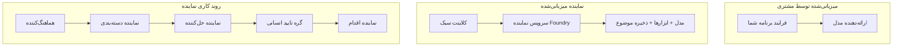
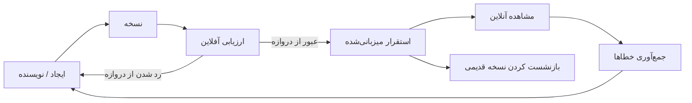
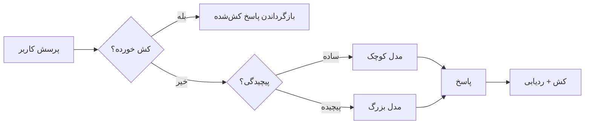
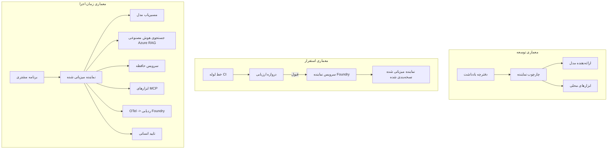

# استقرار عامل‌های مقیاس‌پذیر با Microsoft Foundry


تا این مرحله در دوره، شما عامل‌هایی ساخته‌اید که روی لپ‌تاپ شما اجرا می‌شوند، داخل یک نوت‌بوک، با استفاده از `az login` و چند متغیر محیطی. این دقیقاً راه درستی برای یادگیری است. اما این راه مناسبی برای اجرای عاملی که هزاران مشتری روی آن در ساعت ۳ صبح حساب می‌کنند، نیست.

این درس درباره شکاف بین «در ماشین من کار می‌کند» و «به طور قابل‌اعتماد و مقرون‌به‌صرفه در محیط تولید کار می‌کند» است. ما این شکاف را با استفاده از **Microsoft Foundry** و **خدمات عامل Microsoft Foundry** پر می‌کنیم و این کار را با ساخت یک عامل پشتیبانی مشتری واقعی انجام می‌دهیم که ابزارها، بازیابی، حافظه، ارزیابی و نظارت دارد.

## مقدمه

این درس موارد زیر را پوشش خواهد داد:

- تفاوت بین **عامل نمونه اولیه** و **عامل مستقر شده**، و اینکه چرا گذار بیشتر درباره همه چیز *دور* مدل است.
- **الگوهای استقرار** برای عامل‌ها: میزبانی شده توسط مشتری، میزبانی شده توسط سرویس (Hosted Agents)، و جریان‌های کاری هماهنگ شده.
- **چرخه عمر عامل** در Microsoft Foundry — ایجاد، نسخه‌بندی، استقرار، ارزیابی، مشاهده، بازنشستگی.
- **استراتژی‌های مقیاس‌گذاری**: مسیریابی مدل، کشینگ، همزمانی، و طراحی بدون حالت.
- **قابلیت مشاهده** با OpenTelemetry و ردیابی Foundry.
- **بهینه‌سازی هزینه** از طریق انتخاب مدل، مسیریابی و دروازه‌های ارزیابی.
- **ملاحظات سازمانی**: حاکمیت، تأیید انسانی، و اجرای امن سرورهای MCP در محیط تولید.

## اهداف آموزشی

پس از اتمام این درس، شما خواهید دانست چگونه:

- الگوی استقرار مناسب را برای بار کاری یک عامل خاص انتخاب کنید.
- عاملی را در Microsoft Foundry Agent Service مستقر کنید تا نسخه‌دار، حکمرانی شده و قابل مشاهده باشد.
- عاملی را برای ردیابی ابزار کنید و یک خط لوله ارزیابی وصل کنید که قبل از هر نسخه اجرا شود.
- مسیریابی مدل و کشینگ را اعمال کنید تا تأخیر و هزینه در مقیاس کنترل شود.
- یک دروازه تأیید انسانی برای اقدامات پرخطر اضافه کنید و سرور MCP را به شکلی ایمن در تولید ادغام کنید.

## پیش‌نیازها

این درس فرض می‌کند شما درس‌های قبلی را کامل کرده‌اید و با موارد زیر راحت هستید:

- ساخت عامل‌ها با [Microsoft Agent Framework](../14-microsoft-agent-framework/README.md) (درس ۱۴).
- [استفاده از ابزار](../04-tool-use/README.md) (درس ۴) و [Agentic RAG](../05-agentic-rag/README.md) (درس ۵).
- [حافظه عامل](../13-agent-memory/README.md) (درس ۱۳) و [پروتکل‌های Agentic / MCP](../11-agentic-protocols/README.md) (درس ۱۱).
- [قابلیت مشاهده و ارزیابی](../10-ai-agents-production/README.md) (درس ۱۰) — این درس مستقیماً بر آن بنا شده است.

همچنین نیاز خواهید داشت:

- یک **اشتراک Azure** و یک **پروژه Microsoft Foundry** با حداقل یک مدل چت مستقر شده.
- **Azure CLI** احراز هویت شده (`az login`).
- Python 3.12+ و بسته‌های داخل مخزن [`requirements.txt`](../../../requirements.txt).

## از نمونه اولیه تا تولید: چه چیزی واقعاً تغییر می‌کند

عامل نمونه اولیه و عامل تولیدی حلقه اصلی مشابهی دارند — استدلال، فراخوانی ابزارها، پاسخ. آنچه تغییر می‌کند همه چیزهایی است که دور آن حلقه پیچیده شده‌اند. مدل شاید ۲۰٪ یک عامل تولیدی باشد؛ ۸۰٪ دیگر اسکلت عملیاتی است.

| موضوع | نمونه اولیه | تولید |
| --- | --- | --- |
| **میزبانی** | در نوت‌بوک شما اجرا می‌شود | به عنوان یک سرویس میزبانی شده، نسخه‌بندی شده و ارائه می‌شود |
| **هویت** | توکن `az login` شما | هویت مدیریت شده با RBAC محدود شده |
| **حالت** | در حافظه، با راه‌اندازی مجدد از بین می‌رود | خارجی شده (ذخیره موضوع، سرویس حافظه) |
| **خطا** | شما دنبال‌گیری خطا را می‌بینید | تلاش‌های مجدد، مسیرهای جایگزین، نامه‌های مرده، هشدارها |
| **هزینه** | «چند سنت است» | به ازای هر درخواست پیگیری شده، مسیریابی شده، کش شده، بودجه‌بندی شده |
| **کیفیت** | خروجی را چشم بسته بررسی می‌کنید | قبل از هر انتشار به طور خودکار ارزیابی می‌شود |
| **اعتماد** | شما هر اقدام را تأیید می‌کنید | سیاست + حضور انسانی در حلقه برای اقدامات پرریسک |

این جدول را در نظر داشته باشید. هر بخش زیر به یکی از این ردیف‌ها مربوط است.

## الگوهای استقرار عامل

سه الگوی اصلی وجود دارد که اغلب به صورت ترکیبی استفاده می‌شوند.

### 1. عامل‌های میزبانی شده توسط مشتری

شیء عامل داخل فرآیند برنامه *شما* زندگی می‌کند. کد شما مستقیماً به ارائه‌دهنده مدل فراخوانی می‌زند؛ حلقه استدلال در سرویس شما اجرا می‌شود. این همان کاری است که در هر درس قبلی انجام شده است.

- **زمان استفاده** وقتی کامل کنترل روی حلقه نیاز دارید، یا میان‌افزار سفارشی می‌خواهید، یا عامل را در یک بک‌اند موجود تعبیه می‌کنید.
- **معامله**: مقیاس‌گذاری، حالت و تاب‌آوری را خودتان باید مدیریت کنید.

### 2. عامل‌های میزبانی شده (Foundry Agent Service)

عامل به عنوان یک *منبع ثبت شده* در Microsoft Foundry است. Foundry حلقه استدلال را میزبانی می‌کند، موضوعات را ذخیره می‌کند، ایمنی محتوا و RBAC را اجرا می‌کند و عامل را در پرتال Foundry قابل مشاهده می‌سازد. برنامه شما به یک کلاینت نازک تبدیل می‌شود که موضوع ایجاد می‌کند و پاسخ‌ها را می‌خواند.

- **زمان استفاده** وقتی دوام، قابلیت مشاهده داخلی، حاکمیت، و کاهش سطح عملیاتی می‌خواهید.
- **معامله**: کنترل سطح پایین کمتر به ازای دسترسی به محیط زمان اجرای مدیریت شده.

### 3. جریان‌های کاری عامل

چندین عامل (و ابزارها) در قالب گرافی با جریان کنترل صریح ترکیب می‌شوند — مراحل متوالی، شاخه‌بندی، گره‌های تأیید انسانی، و نقاط بازبینی بادوام که می‌توانند متوقف و ادامه یابند. این قابلیت **Workflows** چارچوب عامل مایکروسافت است که در مقیاس استقرار اعمال شده است.

- **زمان استفاده** وقتی یک وظیفه چند عامل تخصصی را دربرمی‌گیرد یا نیازمند مرحله تأیید در وسط است.
- **معامله**: اجزای متحرک بیشتر و نیاز به قابلیت مشاهده در سطح هماهنگی.



## چرخه عمر عامل در Microsoft Foundry

استقرار عامل، یک `push` یک‌باره نیست. این یک حلقه است و بسیار شبیه چرخه انتشار نرم‌افزار است چون دقیقاً همان است.



ایده کلیدی، گرفته شده از [درس ۱۰](../10-ai-agents-production/README.md): **ارزیابی آفلاین یک دروازه است، نه یک فکر بعدی.** نسخه جدید یک عامل تنها زمانی منتشر می‌شود که از آستانه‌های ارزیابی شما عبور کند. سپس قابلیت مشاهده آنلاین شکست‌های دنیای واقعی را به مجموعه آزمایش آفلاین شما بازمی‌گرداند. این کل حلقه است.

## استراتژی‌های مقیاس‌گذاری

مقیاس‌گذاری یک عامل با مقیاس‌گذاری یک API وب بدون حالت متفاوت است، زیرا هر درخواست می‌تواند چندین فراخوانی گران قیمت مدل و ابزار ایجاد کند. چهار تکنیک بار بیشتر را تحمل می‌کند.

**مدیریت درخواست بدون حالت.** هیچ وضعیت شخصی در حافظه فرآیند خود نگه ندارید. موضوعات مکالمه را در ذخیره موضوع Foundry یا سرویس حافظه ذخیره کنید تا هر نمونه‌ای بتواند هر درخواستی را پاسخ دهد. این همان چیزی است که اجازه می‌دهد شما به صورت افقی مقیاس‌پذیر باشید — نمونه‌ها را اضافه کنید، جلسه‌های چسبنده ندارید.

**مسیریابی مدل.** هر درخواست نیازی به استفاده از مدل قدرتمند (و پرهزینه) شما ندارد. درخواست‌های ساده — طبقه‌بندی نیت، پاسخ‌های کوتاه واقعی — را به مدل کوچک و سریع ارسال کنید و مدل بزرگ را برای استدلال واقعی نگه دارید. **مدیر مدل** Foundry می‌تواند این کار را برای شما انجام دهد یا می‌توانید طبقه‌بندی سبک خود را پیاده‌سازی کنید. نسخه DIY آن را در آزمایشگاه خواهید ساخت.

**کشینگ پاسخ.** بسیاری از سوالات پشتیبانی تقریباً تکراری هستند («چگونه رمز عبورم را بازنشانی کنم؟»). پاسخ‌ها را به سوالات رایج کش کنید و بدون زدن به مدل پاسخ دهید. حتی نرخ کش خوردن متوسط هم به طور معناداری هزینه و تأخیر را کاهش می‌دهد.

**همزمانی و فشار برگشتی.** ارائه‌دهندگان مدل محدودیت نرخ دارند. همزمانی خود را محدود کنید، از تلاش‌های مجدد با فاصله نمایی استفاده کنید و به آرامی شکست بخورید (پاسخ صف داده‌شده «ما داریم روی آن کار می‌کنیم» بهتر از خطای ۵۰۰ است).



## قابلیت مشاهده در محیط تولید

آنچه را نمی‌بینید نمی‌توانید مدیریت کنید. همانطور که در درس ۱۰ پوشش داده شد، چارچوب عامل مایکروسافت به طور بومی **OpenTelemetry** ردیابی صادر می‌کند — هر فراخوانی مدل، اجرا ابزار، و مرحله ارکستراسیون تبدیل به یک بازه زمانی می‌شود. در تولید این بازه‌ها را به Microsoft Foundry (یا هر بک‌اند سازگار با OTel) صادر می‌کنید تا بتوانید:

- یک شکایت مشتری را از ابتدا تا انتها در هر فراخوانی مدل و ابزار ردیابی کنید.
- تاخیر p50/p95 و هزینه هر درخواست را در طول زمان مشاهده کنید.
- قبل از اینکه کاربران یا تیم مالی متوجه شوند، در مورد اوج خطاها و ناهنجاری‌های هزینه هشدار دریافت کنید.

```python
from agent_framework.observability import get_tracer

tracer = get_tracer()

with tracer.start_as_current_span("support_request") as span:
    span.set_attribute("customer.tier", "enterprise")
    span.set_attribute("routed.model", "gpt-5-nano")
    # اجرای عامل به طور خودکار درون این بازه ردیابی می‌شود
```

صفات مانند `customer.tier` و `routed.model` همان چیزی هستند که دیوار ردیابی‌ها را به سوالات قابل پاسخ تبدیل می‌کنند («آیا مشتریان سازمانی بیش از حد به مدل کوچک هدایت می‌شوند؟»).

## بهینه‌سازی هزینه

هزینه در عوامل تولیدی عمدتاً به توکن‌ها وابسته است. سه اهرم، به ترتیب تأثیر:

1. **اندازه مناسب مدل.** مدلی کوچک که از دروازه ارزیابی شما عبور کند تقریباً همیشه ارزان‌تر از مدل بزرگتر است که همین‌طور موفق شود. از ارزیابی استفاده کنید تا ثابت کنید مدل کوچک کافی است، به جای اینکه برای احتیاط به بزرگ‌ترین مدل بسنده کنید.
2. **مسیر بر اساس پیچیدگی.** همانطور که گفته شد — قیمت مدل بزرگ را فقط برای درخواست‌هایی پرداخت کنید که نیازمند استدلال با مدل بزرگ هستند.
3. **کشینگ قوی.** ارزان‌ترین فراخوان مدل همان فراخوانی است که هرگز انجام نشده است.

دروازه‌های ارزیابی و کنترل هزینه یک رشته دانش هستند که از دو زاویه دیده شده‌اند: ارزیابی به شما *کف کیفیت* را می‌گوید، مسیریابی و کشینگ هزینه را تا حد امکان نزدیک به *کف* نگه می‌دارند.

## ملاحظات استقرار سازمانی

**حاکمیت.** عامل‌های میزبانی شده از RBAC، ایمنی محتوا، و ثبت بازرسی Foundry بهره‌مند می‌شوند. به هر عامل یک هویت مدیریت شده با کمترین امتیازی که نیاز دارد اختصاص دهید — دسترسی فقط خواندنی به پایگاه دانش، دسترسی محدود به API بلیت‌زنی، و هیچ چیز بیشتر.

**حضور انسانی در حلقه.** برخی اقدامات بسیار مهم هستند که به طور کامل خودکار نشوند — صدور بازپرداخت، حذف حساب، ارجاع به تیم حقوقی. چارچوب عامل مایکروسافت از ابزارهای **نیازمند تأیید** پشتیبانی می‌کند: عامل اقدام را پیشنهاد می‌دهد، اجرا متوقف می‌شود، انسانی تأیید یا رد می‌کند، و جریان کاری ادامه می‌یابد. این ابتدایی را در [درس ۶](../06-building-trustworthy-agents/README.md) دیدید؛ اینجا پیاده‌سازی آن است.

**MCP در تولید.** [MCP](../11-agentic-protocols/README.md) به عامل شما اجازه می‌دهد ابزارهای خارجی را از طریق یک رابط استاندارد مصرف کند. در تولید، هر سرور MCP را به عنوان یک مرز غیرقابل اعتماد در نظر بگیرید: نسخه سرور را ثابت کنید، آن را با هویتی محدود اجرا کنید، خروجی‌های آن را اعتبارسنجی کنید و هرگز اسرار را به آن ندهید. یک سرور MCP یک وابستگی است و وابستگی‌ها نیاز به وصله، حسابرسی و محدودیت نرخ دارند.



این سه نمودار — توسعه، استقرار، زمان اجرا — همان عامل در سه مرحله زندگی‌اش هستند. آزمایشگاه بعدی شما را در ساخت آن راهنمایی می‌کند.

## آزمایشگاه عملی: عامل پشتیبانی مشتری آماده تولید

فایل [`code_samples/16-python-agent-framework.ipynb`](./code_samples/16-python-agent-framework.ipynb) را باز کنید و به طور کامل کار کنید. شما یک **عامل پشتیبانی مشتری Contoso** با تمام ملاحظات تولید را سرهم‌بندی خواهید کرد:

1. **فراخوانی ابزار** — وضعیت سفارش را بررسی کنید و بلیت‌های پشتیبانی را باز کنید.
2. **RAG** — به سوالات سیاست از پایگاه دانش پاسخ دهید (Azure AI Search با یک حالت پشتیبان در حافظه تا نوت‌بوک بدون داشتن منابع Search اجرا شود).
3. **حافظه** — مشتری را در سراسر دورهای مکالمه به یاد بسپارید.
4. **مسیریابی مدل** — یک طبقه‌بند پیچیدگی هر درخواست را به مدل کوچک یا بزرگ هدایت می‌کند.
5. **کشینگ پاسخ** — سوالات تکراری از کش سرویس داده می‌شوند.
6. **تأیید انسانی** — بازپرداخت‌های بالاتر از یک حد توقف برای امضای انسانی می‌شوند.
7. **خط لوله ارزیابی** — یک مجموعه کوچک آزمایش آفلاین عامل را امتیاز می‌دهد و به عنوان دروازه انتشار عمل می‌کند.
8. **قابلیت مشاهده** — ردیابی OpenTelemetry به دور هر درخواست.

### راهنمای گام به گام

نوت‌بوک طوری سازمان‌دهی شده که هر ملاحظۀ تولید یک بخش مستقل و قابل اجرا باشد. قلب آن، هندلر درخواست به همراه مسیریابی و کشینگ است:

```python
async def handle_support_request(query: str, customer_id: str) -> str:
    # ۱. در صورت امکان از حافظه نهان سرویس دهی کنید.
    cached = response_cache.get(normalize(query))
    if cached:
        return cached

    # ۲. مسیر یابی بر اساس پیچیدگی برای کنترل هزینه.
    model = "gpt-5-nano" if is_simple(query) else "gpt-5-mini"

    # ۳. اجرای عامل در داخل بازه ردیابی برای قابل مشاهده بودن.
    with tracer.start_as_current_span("support_request") as span:
        span.set_attribute("routed.model", model)
        span.set_attribute("customer.id", customer_id)
        response = await support_agent.run(query, model=model)

    # ۴. ذخیره در حافظه نهان و بازگشت.
    response_cache.set(normalize(query), response.text)
    return response.text
```

دروازه ارزیابی که از انتشار محافظت می‌کند چنین است:

```python
async def evaluation_gate(agent, test_cases, threshold: float = 0.8) -> bool:
    passed = 0
    for case in test_cases:
        result = await agent.run(case["input"])
        if score_response(result.text, case["expected"]) >= 0.8:
            passed += 1
    pass_rate = passed / len(test_cases)
    print(f"Evaluation pass rate: {pass_rate:.0%} (gate: {threshold:.0%})")
    return pass_rate >= threshold  # فقط در صورت عبور گیت مستقر شود
```

هر خط را بخوانید — نوت‌بوک اصل‌ها را عمداً کوچک نگه داشته تا چیزی پشت فراخوان فریم‌ورک پنهان نشود.

## اعتبارسنجی عامل مستقر شده با تست‌های دود

دروازه ارزیابی بالا به صورت *آفلاین* روی شیء عامل شما اجرا می‌شود. وقتی عامل به عنوان عامل میزبانی شده مستقر شود، شما یک بررسی دیگر، حتی ارزان‌تر نیاز دارید: **آیا نقطۀ پایانی مستقر شده واقعاً پاسخ می‌دهد؟**

استقرار «موفق» تنها ثابت می‌کند که صفحه کنترل تعریف را پذیرفته است — این ثابت نمی‌کند عامل پاسخ می‌دهد. یک وابستگی مفقود، مسیریابی مدل نادرست یا اتصال منقضی شده می‌تواند استقراری سبز بدون هیچ پاسخی باقی بگذارد. **تست دود** این را ظرف چند ثانیه و در هر استقرار شکار می‌کند، بدون هزینه کامل ارزیابی.

این مخزن یک خط لوله تست دود آماده استفاده را ساخته است که بر اساس اکشن [AI Smoke Test](https://github.com/marketplace/actions/ai-smoke-test) در گیت‌هاب است:

- **کتالوگ** — [`tests/lesson-16-smoke-tests.json`](../../../tests/lesson-16-smoke-tests.json) فرامین و ادعاها برای عامل پشتیبانی Contoso را شامل می‌شود (پاسخ‌های سیاست مبتنی بر داده، جستجوی سفارش، حفظ موضوع، و پیوستگی موضوع چند دوری). کتالوگ‌های دیگر عوامل درس‌های دیگر کنار آن زندگی می‌کنند — ببینید [`tests/README.md`](../tests/README.md).
- **جریان کاری** — [`.github/workflows/smoke-test.yml`](../../../.github/workflows/smoke-test.yml) با Azure OIDC وارد می‌شود و هر فرمان را به نقطۀ پایانی Responses عامل POST می‌کند، و در صورت هر ادعای اشتباه کار را خطا می‌دهد.

```yaml
- name: Smoke-test hosted agent
  uses: JFolberth/ai-smoketest@v1
  with:
    project_endpoint: ${{ inputs.project_endpoint }}
    agent_name: ContosoSupportAgent
    tests_file: tests/lesson-16-smoke-tests.json
```


آن را از تب **Actions** اجرا کنید وقتی عامل شما مستقر شد، با تأمین نقطه پایانی پروژه Foundry و نام عامل خود. هویت همکار به نقش **Azure AI User** در دامنه پروژه Foundry نیاز دارد. لایه‌ها را مانند یک هرم در نظر بگیرید: آزمایش‌های دود (دسترسی‌پذیر و پاسخگو؟) در هر استقرار اجرا می‌شوند، ارزیابی آفلاین (به اندازه کافی برای عرضه خوب؟) قبل از ارتقا اجرا می‌شود و ارزیابی آنلاین (در محیط واقعی چگونه عمل می‌کند؟) به صورت مداوم اجرا می‌شود.

## آزمون دانش

قبل از رفتن به تمرین، درک خود را آزمایش کنید.

**1. تقریباً چقدر از یک عامل تولید "مدل" است و بقیه چیست؟**

<details>
<summary>پاسخ</summary>

مدل بخش کمتری از سیستم است — اغلب حدود ۲۰٪ ذکر می‌شود. بقیه اسکلت عملیاتی است: میزبانی و نسخه‌بندی، هویت و RBAC، حالت خارجی شده، مدیریت خطا، پیگیری هزینه، ارزیابی و کنترل‌های انسان در حلقه. رفتن به تولید بیشتر درباره ساخت همه چیز *در اطراف* حلقه استدلال است.
</details>

**2. چه زمانی عامل میزبانی شده را به جای عامل میزبانی شده توسط مشتری انتخاب می‌کنید؟**

<details>
<summary>پاسخ</summary>

وقتی می‌خواهید یک زمان اجرا مدیریت شده با تحمل داخلی (رشته‌هایی که پایدار هستند و می‌توانند ادامه پیدا کنند)، قابلیت مشاهده، ایمنی محتوا و RBAC داشته باشید، و مایلید برخی کنترل‌های سطح پایین حلقه استدلال را فدای کاهش سطح عملیاتی کنید. میزبانی شده توسط مشتری زمانی ترجیح داده می‌شود که کنترل کامل بر حلقه لازم باشد یا عامل را در یک بک‌اند موجود جاسازی می‌کنید.
</details>

**3. چرا یک عامل مقیاس‌پذیر باید بدون حالت در حافظه فرایند خود باشد؟**

<details>
<summary>پاسخ</summary>

بنابراین هر نمونه می‌تواند هر درخواست را مدیریت کند، چیزی که امکان مقیاس‌پذیری افقی بدون نشست‌های چسبنده را فراهم می‌آورد. حالت مکالمه هر کاربر به فروشگاه رشته یا سرویس حافظه خارجی شده است. اگر حالت در حافظه فرایند باشد، در هنگام راه‌اندازی مجدد از دست می‌رود و نمی‌توان بار را آزادانه توزیع کرد.
</details>

**4. مدل مسیریابی چه مشکلی را حل می‌کند و چگونه با ارزیابی مرتبط است؟**

<details>
<summary>پاسخ</summary>

مسیریابی درخواست‌های ساده را به مدل کوچک، ارزان و سریع می‌فرستد و مدل بزرگ را برای استدلال واقعی نگه می‌دارد، که هم تأخیر و هم هزینه را کنترل می‌کند. این به ارزیابی مرتبط است زیرا ارزیابی چیزی است که *اثبات* می‌کند مدل کوچک برای یک کلاس از درخواست‌ها به اندازه کافی خوب است — مسیریابی بدون ارزیابی حدس زدن است.
</details>

**5. "دروازه ارزیابی" چیست و در چرخه عمر کجا واقع شده است؟**

<details>
<summary>پاسخ</summary>

دروازه ارزیابی مجموعه آزمون آفلاین را روی نسخه جدید عامل اجرا می‌کند و مگر اینکه نرخ قبولی بیش از حد نصاب باشد، استقرار را مسدود می‌کند. این در چرخه عمر بین «نسخه» و «استقرار» قرار دارد و کیفیت را پیش‌شرط انتشار می‌کند، نه چیزی که بعد از عرضه بررسی شود.
</details>

**6. چرا سرور MCP باید در تولید به عنوان مرزی غیرقابل اعتماد رفتار شود؟**

<details>
<summary>پاسخ</summary>

چون یک وابستگی خارجی است که عامل شما به آن فراخوانی می‌کند. باید نسخه آن را ثابت کنید، با هویت محدود شده اجرا کنید، خروجی‌های آن را اعتبارسنجی کنید، نرخ درخواست را محدود کنید و هرگز اسرار را در اختیارش نگذارید — همان انضباطی که برای هر وابستگی شخص ثالث اعمال می‌کنید. خروجی‌های آن وارد استدلال عامل شما می‌شود، بنابراین اعتماد بدون اعتبارسنجی یک ریسک امنیتی است.
</details>

**7. کدام تغییر منفرد معمولاً بیشترین تأثیر را بر هزینه عامل تولید دارد و چرا؟**

<details>
<summary>پاسخ</summary>

اندازه مناسبی مدل — استفاده از کوچک‌ترین مدلی که هنوز از دروازه ارزیابی شما عبور می‌کند. هزینه بیشتر تحت سلطه توکن‌ها است، و مدل کوچکتر که سطح کیفی را داشته باشد همیشه تقریباً ارزان‌تر از مدل بزرگ‌تر است. سپس کش کردن و مسیریابی هزینه را بیشتر کاهش می‌دهند، اما انتخاب مدل پایه درست بزرگ‌ترین اثر اولیه را دارد.
</details>

**8. نقش ویژگی‌های اسپن مانند `customer.tier` و `routed.model` در قابلیت مشاهده چیست؟**

<details>
<summary>پاسخ</summary>

آن‌ها ردیابی‌های خام را به پرسش‌های کسب‌وکاری قابل پاسخ تبدیل می‌کنند. بدون ویژگی‌ها یک دیوار از اسپن‌ها دارید؛ با آن‌ها می‌توانید بپرسید «آیا مشتریان سازمانی بیش از حد به مدل کوچک مسیریابی می‌شوند؟» یا «کدام مدل درخواست‌های ما را کندتر مدیریت می‌کند؟» ویژگی‌ها نحوه تقسیم تلومتری به ابعاد مهم عملیات شما هستند.
</details>

## تمرین

عامل پشتیبانی مشتری را از آزمایشگاه بگیرید و برای یک سناریوی خاص قوی کنید: **عامل پشتیبانی صورتحساب اشتراک برای یک شرکت SaaS.**

ارسال شما باید:

1. **ابزارها را** با ابزارهای مرتبط با صورتحساب جایگزین کنید: `get_subscription_status`، `get_invoice` و `issue_credit` (اعتبارهای بالای ۵۰ دلار به تأیید انسانی نیاز دارند).
۲. **سه سند RAG** اضافه کنید که سیاست بازپرداخت شرکت، چرخه صورتحساب و سیاست لغو را پوشش می‌دهد.
۳. **مجموعه ارزیابی را** به حداقل هشت مورد افزایش دهید، شامل دست‌کم دو مورد که *باید* مسیر تأیید انسانی را فعال کنند و اطمینان حاصل کنید دروازه ارزیابی شما درست عبور یا رد می‌کند.
۴. **یک گزارش هزینه** اضافه کنید: پس از اجرای ده پرسش ترکیبی از طریق عامل، چاپ کنید چند تا به مدل کوچک، چند تا به مدل بزرگ رفته‌اند و چند تا از کش سرو شده‌اند.

یک پاراگراف کوتاه (در یک سلول مارک‌داون) بنویسید و توضیح دهید که کدام قانون مسیریابی مدل را انتخاب کردید و چگونه آن را با ترافیک واقعی اعتبارسنجی می‌کنید. پاسخ واحد درست وجود ندارد — شما براساس اینکه نگرانی‌های تولید به هم پیوسته ارزیابی می‌شوید.

## خلاصه

در این درس، یک عامل را از نمونه اولیه به تولید با Microsoft Foundry منتقل کردید:

- جهش به تولید بیشتر درباره **اسکلت عملیاتی** اطراف مدل است — میزبانی، هویت، حالت، مدیریت خطا، هزینه، کیفیت و اعتماد.
- سه **الگوهای استقرار** را آموختید — میزبانی شده توسط مشتری، عوامل میزبانی شده، و جریان‌های کاری عامل — و زمان مناسب هر کدام.
- چرخه عمر **عامل** را مرور کردید که در آن ارزیابی آفلاین به عنوان «دروازه انتشار» عمل می‌کند و قابلیت مشاهده آنلاین خطاها را به مجموعه آزمون بازمی‌گرداند.
- استراتژی‌های **مقیاس‌بندی** — طراحی بدون حالت، مسیریابی مدل، کش کردن و همزمانی محدود — را اعمال کردید و آن‌ها را به **بهینه‌سازی هزینه** متصل کردید.
- کنترل‌های **سازمانی** را پیاده‌سازی کردید: RBAC، تأیید انسان در حلقه، و یکپارچه‌سازی امن MCP در تولید.
- یک عامل پشتیبانی مشتری **آماده تولید** ساختید که همه این نگرانی‌ها را در کدی عملی به هم پیوند می‌دهد.

درس بعدی مسیر معکوس را طی می‌کند: به جای مقیاس دادن عوامل به فضای ابری، آن‌ها را *پایین* آورده و روی یک رایانه توسعه‌دهنده به طور کامل محلی اجرا می‌کنید.

## منابع اضافی

- <a href="https://learn.microsoft.com/azure/ai-foundry/what-is-azure-ai-foundry" target="_blank">مستندات Microsoft Foundry</a>
- <a href="https://learn.microsoft.com/azure/ai-foundry/agents/overview" target="_blank">بررسی اجمالی سرویس عامل Microsoft Foundry</a>
- <a href="https://learn.microsoft.com/en-us/agent-framework/overview/?wt.mc_id=youtube_26688_organicsocial_reactor&pivots=programming-language-python" target="_blank">چارچوب عامل مایکروسافت</a>
- <a href="https://learn.microsoft.com/azure/ai-foundry/concepts/model-router" target="_blank">مسیریاب مدل در Microsoft Foundry</a>
- <a href="https://learn.microsoft.com/azure/search/search-what-is-azure-search" target="_blank">جستجوی AI Azure</a>
- <a href="https://opentelemetry.io/" target="_blank">OpenTelemetry</a>
- <a href="https://github.com/marketplace/actions/ai-smoke-test" target="_blank">عملیات GitHub برای تست دود AI</a>
- <a href="https://modelcontextprotocol.io/" target="_blank">پروتکل زمینه مدل (MCP)</a>

## درس قبلی

[ساخت عوامل استفاده کامپیوتر (CUA)](../15-browser-use/README.md)

## درس بعدی

[ایجاد عوامل AI محلی](../17-creating-local-ai-agents/README.md)

---

<!-- CO-OP TRANSLATOR DISCLAIMER START -->
**سلب مسئولیت**:
این سند با استفاده از سرویس ترجمه هوش مصنوعی [Co-op Translator](https://github.com/Azure/co-op-translator) ترجمه شده است. در حالی که ما در تلاش برای دقت هستیم، لطفاً توجه داشته باشید که ترجمه‌های خودکار ممکن است شامل خطاها یا نادرستی‌هایی باشند. سند اصلی به زبان مادری خود باید به عنوان منبع معتبر در نظر گرفته شود. برای اطلاعات حیاتی، ترجمه حرفه‌ای انسانی توصیه می‌شود. ما در قبال هرگونه سوء تفاهم یا برداشت نادرست ناشی از استفاده از این ترجمه مسئولیتی نداریم.
<!-- CO-OP TRANSLATOR DISCLAIMER END -->