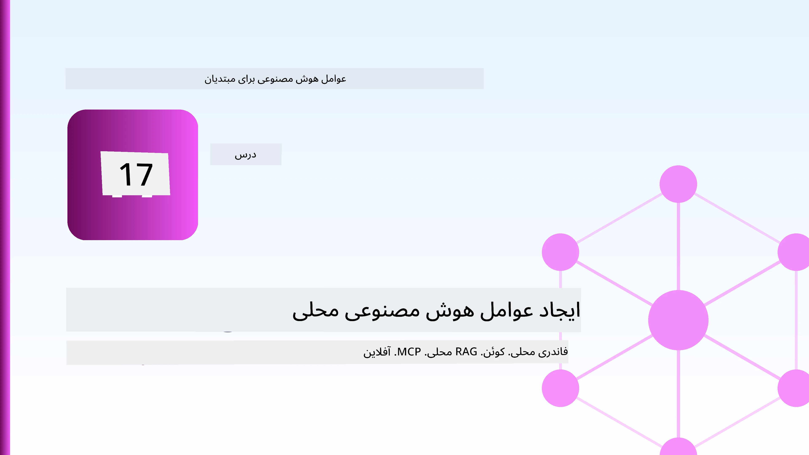
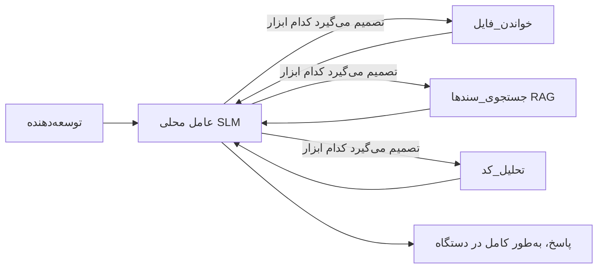
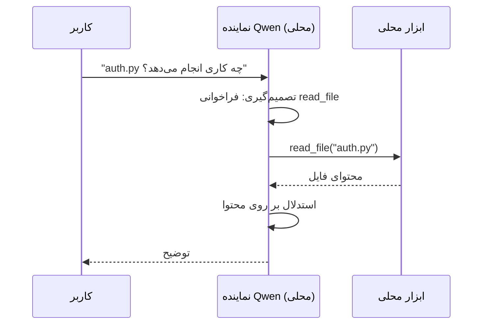
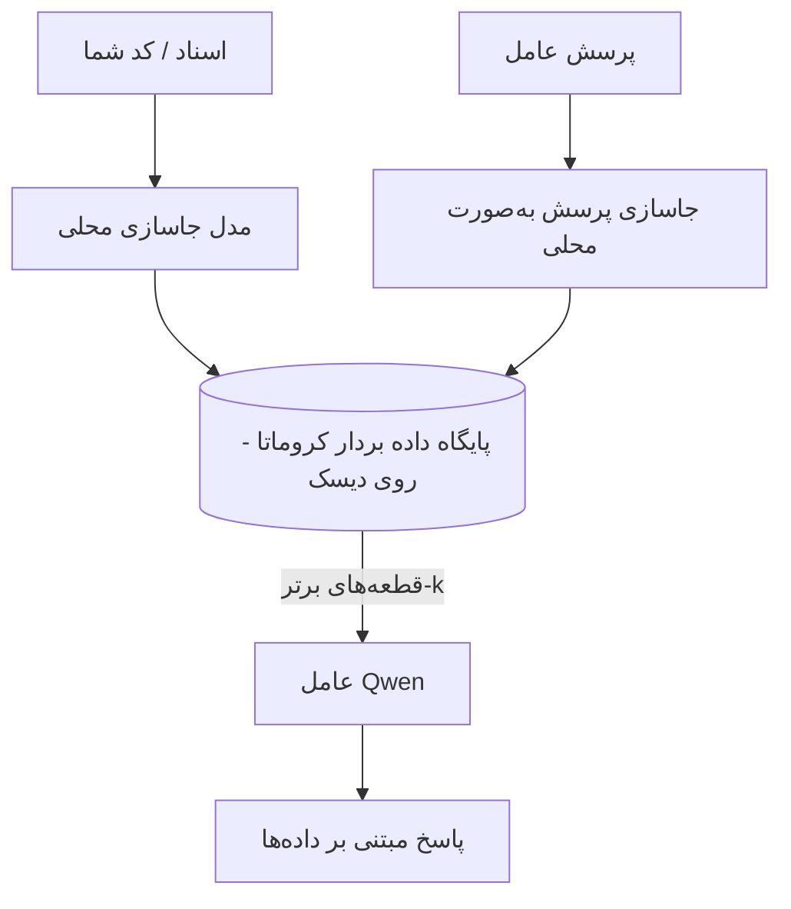
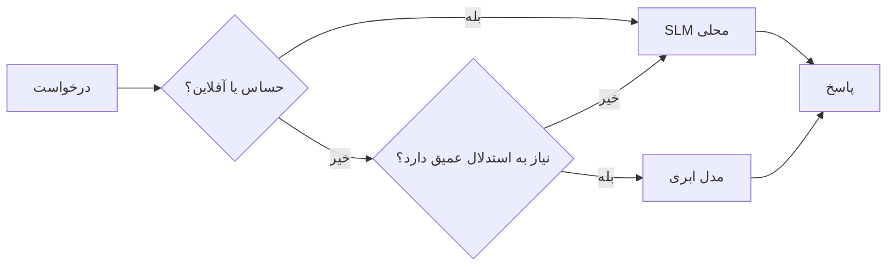

# ساخت عوامل هوش مصنوعی محلی با استفاده از Microsoft Foundry Local و Qwen



درس قبلی عوامل را در فضای ابری *گسترش* داد. این یکی آن‌ها را به یک ماشین واحد *می‌آورد*. تا پایان، شما یک دستیار مهندسی کاری خواهید داشت که استدلال می‌کند، ابزارها را فراخوانی می‌کند، فایل‌های شما را می‌خواند و در مستندات شما جستجو می‌کند — **بدون هیچ تماس استنتاجی از فضای ابری.**

چرا می‌خواهید این کار را انجام دهید؟ سه دلیل که در کار مهندسی واقعی مرتباً مطرح می‌شوند:

- **حفظ حریم خصوصی.** کد و اسناد هرگز از ماشین خارج نمی‌شوند. هیچ پرامپت، هیچ قطعه‌ای، هیچ داده مشتری از مرز شبکه عبور نمی‌کند.
- **هزینه.** استنتاج محلی هزینه بر اساس تعداد توکن ندارد. می‌توانید تمام روز چرخه بزنید فقط به قیمت برق.
- **کارکرد آفلاین.** در هواپیما، در یک مرکز امن، یا در هنگام قطعی، عامل همچنان کار می‌کند.

نکته این است که شما یک مدل ابری پیشرفته را با یک **مدل زبانی کوچک (SLM)** که روی CPU، GPU یا NPU شما اجرا می‌شود معامله می‌کنید. این درس درباره ساخت عواملی است که در این محدودیت *خوب* عمل می‌کنند، نه اینکه وانمود کنیم محدودیت وجود ندارد.

## مقدمه

این درس موارد زیر را پوشش می‌دهد:

- **مدل‌های زبانی کوچک (SLM)** — چی هستند، کجا بهترین عملکرد را دارند و کجا ندارند.
- **Microsoft Foundry Local** — یک ران‌تایم سبک که مدل‌ها را روی دستگاه دانلود و ارائه می‌دهد از طریق یک **API سازگار با OpenAI**.
- **مدل‌های فراخوانی تابع Qwen** — مدل‌های SLM که بطور قابل اعتماد تماس‌های ابزاری تولید می‌کنند، که عامل‌های محلی (نه فقط چت محلی) را ممکن می‌سازد.
- **ابزارهای محلی، RAG محلی، و MCP محلی** — که قابلیت را به عامل بدون نیاز به ابر می‌دهد.
- **الگوهای ترکیبی** — کی چیزها را محلی نگه داریم و کی به ابر دسترسی پیدا کنیم.

## اهداف یادگیری

پس از اتمام این درس، خواهید دانست چگونه:

- تعادل‌های مدل‌های SLM را توضیح دهید و موارد استفاده مناسب برای عامل‌های محلی را انتخاب کنید.
- یک مدل Qwen را به‌صورت محلی با Foundry Local ارائه دهید و از طریق نقطه پایان سازگار با OpenAI به آن متصل شوید.
- یک عامل تماس‌گیرنده ابزار بسازید که به‌طور کامل روی ایستگاه کاری شما اجرا شود.
- RAG محلی را روی اسناد خود با استفاده از یک پایگاه داده برداری محلی (Chroma) اضافه کنید.
- عامل را به یک سرور MCP محلی متصل کنید و درباره طراحی‌های ترکیبی محلی/ابری تفکر کنید.

## پیش‌نیازها

این درس فرض می‌کند که دروس قبلی را گذرانده‌اید و با موارد زیر راحت هستید:

- [استفاده از ابزار](../04-tool-use/README.md) (درس ۴) و [Agentic RAG](../05-agentic-rag/README.md) (درس ۵).
- [پروتکل‌های عامل / MCP](../11-agentic-protocols/README.md) (درس ۱۱).
- [Microsoft Agent Framework](../14-microsoft-agent-framework/README.md) (درس ۱۴).

همچنین نیاز دارید:

- یک ایستگاه کاری توسعه‌دهنده. **حداقل ۸ گیگابایت رم واقع‌بینانه است**؛ ۱۶ گیگابایت یا بیشتر راحت‌تر است. یک GPU یا NPU کمک می‌کند ولی ضروری نیست.
- **Microsoft Foundry Local** نصب شده (به بخش نصب زیر مراجعه کنید).
- پایتون ۳.۱۲+ و بسته‌های موجود در مخزن [`requirements.txt`](../../../requirements.txt)، به‌علاوه `foundry-local-sdk`، `openai`، و `chromadb` برای این درس.

## مدل‌های زبانی کوچک: ابزار مناسب برای کار محلی

یک مدل ابری پیشرفته صدها میلیارد پارامتر دارد و پشت آن یک مرکز داده وجود دارد. یک SLM چند میلیارد پارامتر دارد و باید در رم لپ‌تاپ شما جا شود. این تفاوت انتظارات مشخصی ایجاد می‌کند.

**SLM ها در موارد زیر خوب هستند:**

- وظایف ساخت‌یافته و محدود — طبقه‌بندی، استخراج، خلاصه‌سازی مستندات شناخته شده.
- **فراخوانی ابزار** — تصمیم‌گیری در مورد اینکه کدام تابع فراخوانی شود و با چه آرگومان‌هایی.
- تکرار سریع، ارزان و خصوصی روی داده‌های خودتان.

**SLM ها در موارد زیر ضعیف‌تر هستند:**

- استدلال باز و چندپله ای روی متن‌های زمینه بزرگ.
- دانش عمومی گسترده (آن‌ها کمتر دیده‌اند و بیشتر فراموش می‌کنند).

استراتژی برنده برای عوامل محلی این است: **بگذارید SLM هماهنگ کند و بگذارید ابزارها بار سنگین را بردارند.** مدل نیازی به دانستن کدهای شما ندارد — بلکه باید بداند کی `read_file` و `search_docs` را فراخوانی کند. این مستقیماً به نقاط قوت SLM بازی می‌دهد.



## Microsoft Foundry Local

**Microsoft Foundry Local** یک ران‌تایم سبک است که مدل‌ها را کاملاً روی دستگاه شما دانلود، مدیریت، و ارائه می‌کند. مهم‌ترین ویژگی آن برای ما این است که یک **نقطه پایان HTTP سازگار با OpenAI** ارائه می‌دهد — به این معنا که SDK اوپن‌ای‌آی و کلاینت OpenAI در Microsoft Agent Framework با تنها تغییر `base_url` روی آن کار می‌کنند. همه چیزهایی که درباره ساخت عوامل یاد گرفتید به‌طور مستقیم منتقل می‌شود؛ فقط نقطه پایان از فضای ابری به `localhost` منتقل می‌شود.

Foundry Local خودکار بهترین نسخه مدل را برای سخت‌افزار شما انتخاب می‌کند — نسخه CPU، نسخه CUDA/GPU، یا نسخه NPU — بنابراین نیازی به بهینه‌سازی دستی برای هر دستگاه نیست.

### نصب

Foundry Local را نصب کنید (به [مستندات](https://learn.microsoft.com/azure/ai-foundry/foundry-local/) برای سیستم عامل خود مراجعه کنید) و سپس تأیید کنید کار می‌کند:

```bash
# نصب (مثال؛ دستورالعمل‌های مربوط به پلتفرم خود را دنبال کنید)
winget install Microsoft.FoundryLocal      # ویندوز
# brew install microsoft/foundrylocal/foundrylocal   # مک‌اواس

# یک مدل Qwen را دانلود و اجرا کنید، سپس سرویس محلی را راه‌اندازی کنید
foundry model run qwen2.5-7b-instruct
foundry service status
```

پس از راه‌اندازی سرویس، یک نقطه پایان محلی سازگار با OpenAI دارید (معمولاً `http://localhost:PORT/v1`). این نوت‌بوک از `foundry-local-sdk` برای پیدا کردن خودکار نقطه پایان استفاده می‌کند، پس نیازی به برنامه‌نویسی سخت‌ روی پورت نیست.

## فراخوانی تابع Qwen: چرا مهم است

یک عامل وقتی عامل است که بتواند ابزارها را فراخوانی کند. بسیاری از SLM ها می‌توانند چت کنند اما تماس‌های ابزاری نامعتبر و نادرست تولید می‌کنند. مدل‌های **Qwen** برای فراخوانی تابع آموزش دیده‌اند و ساختارهای تماس ابزاری به‌خوبی ساخته شده و مداوم تولید می‌کنند — درست همان چیزی که یک مدل گفتگوی محلی را به یک عامل *محلی* تبدیل می‌کند.

روند همان حلقه استاندارد فراخوانی ابزار است که شما آن را می‌شناسید، فقط روی دستگاه اجرا می‌شود:



## RAG محلی

جستجوی مستندات جایی است که عوامل محلی به ارزش خود می‌رسند. به جای اینکه امیدوار باشید SLM مستندات چارچوب شما را به خاطر سپرده باشد، آن مستندات را در یک **پایگاه داده برداری محلی** تعبیه می‌کنید و اجازه می‌دهید عامل قطعات مرتبط را در زمان درخواست بازیابی کند.

ما از **Chroma** استفاده می‌کنیم، یک فروشگاه برداری جاسازی‌شده که به‌صورت فرایند درون‌برنامه‌ای اجرا می‌شود و نیازی به سرور ندارد. کل خط لوله کاملاً محلی است: مدل جاسازی محلی → بردارهای محلی → بازیابی محلی → SLM محلی.



این همان الگوی Agentic RAG از درس ۵ است — تنها تفاوت این است که هر مؤلفه روی دستگاه شما اجرا می‌شود.

## سرورهای MCP محلی

[MCP](../11-agentic-protocols/README.md) یک پروتکل انتقال است، نه یک سرویس ابری. یک سرور MCP می‌تواند به‌صورت فرایند محلی روی `stdio` اجرا شود و ابزارها را روی پروتکل استاندارد به عامل شما ارائه دهد. این امکان بازاستفاده از اکوسیستم روبه‌گسترش سرورهای MCP — دسترسی به فایل سیستم، عملیات git، پرس‌وجوهای بانک اطلاعاتی — کاملاً به‌صورت آفلاین را فراهم می‌کند.

وضعیت امنیتی متفاوت از فضای ابری است ولی غایب نیست: یک سرور MCP محلی همچنان با مجوزهای کاربر شما اجرا می‌شود، پس محدوده دسترسی آن را مشخص کنید (مثلاً یک دایرکتوری پروژه، نه کل پوشه خانگی شما) و خروجی‌های آن را به عنوان ورودی برای اعتبارسنجی در نظر بگیرید.

## الگوهای ترکیبی ابری و محلی

اولویت محلی به معنی فقط محلی نیست. سیستم‌های پیشرفته بر اساس حساسیت و دشواری مسیر یابی می‌کنند:

| وضعیت | محل اجرا |
| --- | --- |
| کد / داده حساس، یا آفلاین | **SLM محلی** |
| وظیفه ساده و محدود | **SLM محلی** (ارزان، سریع) |
| استدلال چندپله سخت روی داده غیرحساس | **مدل ابری** |
| همه چیز، هنگام قطعی | **SLM محلی** (تنزل کیفیت تدریجی) |

این ایده **مسیر دهی مدل** از درس ۱۶ را بازتاب می‌دهد — به جز اینکه یکی از "مدل‌ها" اکنون ماشین خود شما است. یک طراحی مقاوم وقتی ابر در دسترس نیست به محلی بازمی‌گردد تا عامل به‌جای شکست کامل، کیفیتش کاهش یابد.



## آزمایش عملی: یک دستیار مهندسی محلی

فایل [`code_samples/17-local-agent-foundry-local.ipynb`](./code_samples/17-local-agent-foundry-local.ipynb) را باز کنید و آن را اجرا کنید. شما یک **دستیار مهندسی محلی** خواهید ساخت که کاملاً روی ایستگاه کاری شما اجرا می‌شود و می‌تواند:

1. **ابزارها را فراخوانی کند** — از طریق فراخوانی تابع Qwen از طریق Foundry Local.
2. **عملیات فایل محلی انجام دهد** — فهرست‌کردن و خواندن فایل‌ها در دایرکتوری پروژه.
3. **کد را تحلیل کند** — گزارش معیارهای پایه روی یک فایل منبع.
4. **مستندات را جستجو کند** — RAG محلی روی پوشه اسناد با Chroma.
5. **از MCP استفاده کند** — اتصال به سرور MCP محلی (با رد graceful در صورت عدم تنظیم).

در هیچ مرحله‌ای از استنتاج ابری استفاده نمی‌شود.

### گام به گام

دستیار از طریق نقطه پایان سازگار با OpenAI به Foundry Local متصل می‌شود، بنابراین کد عامل تقریباً مشابه دروس ابری است — فقط کلاینت تغییر می‌کند:

```python
from foundry_local import FoundryLocalManager
from openai import OpenAI

# فوندری لوکال مدل را کشف می‌کند/دانلود می‌کند و یک نقطه پایانی محلی به ما می‌دهد.
manager = FoundryLocalManager(\"qwen2.5-7b-instruct\")
client = OpenAI(base_url=manager.endpoint, api_key=manager.api_key)  # api_key یک جایگزین محلی است
```

ابزارها توابع عادی پایتون هستند که محدوده آن‌ها یک دایرکتوری پروژه است:

```python
def read_file(path: str) -> str:
    \"\"\"Read a file, but only inside the sandboxed project directory.\"\"\"
    full = (PROJECT_ROOT / path).resolve()
    if PROJECT_ROOT not in full.parents and full != PROJECT_ROOT:
        return \"Access denied: path is outside the project directory.\"
    return full.read_text(encoding=\"utf-8\")
```

به بررسی sandbox توجه کنید — حتی به‌صورت محلی، ابزاری که مسیرهای دلخواه می‌خواند یک ریسک است. این نوت‌بوک هر ابزار را محدوده به یک ریشه پروژه نگه می‌دارد.

## آزمایش دانش

پیش از حرکت به تمرین، دانش خود را بسنجید.

**۱. دو دلیل مشخص برای اجرای عامل به‌صورت محلی به جای فضای ابری بدهید.**

<details>
<summary>پاسخ</summary>

هر دو مورد از: **حریم خصوصی** (کد و داده هیچ‌گاه از دستگاه خارج نمی‌شود)، **هزینه** (هزینه استنتاج بر اساس توکن ندارید)، و **قابلیت آفلاین** (بدون شبکه کار می‌کند — در هواپیما، مرکز امن، یا هنگام قطعی). محدودیت‌های قانونی/رعایت مقررات که ارسال داده به خارج دستگاه را ممنوع می‌کنند، یکی از دلایل حفظ حریم خصوصی است.
</details>

**۲. تقسیم کار توصیه شده بین SLM و ابزارهای آن در یک عامل محلی چیست و چرا؟**

<details>
<summary>پاسخ</summary>

اجازه دهید SLM **هماهنگ کند** (تصمیم بگیرد کدام ابزار و با چه آرگومان‌هایی فراخوانده شود) و بگذارید **ابزارها بار سنگین را بردارند** (خواندن فایل‌ها، بازیابی اسناد، محاسبه نتایج). SLM ها در تصمیمات محدود مانند انتخاب ابزار قوی هستند اما در دانش گسترده و استدلال چندپله طولانی ضعیف‌ترند، پس تکیه بر ابزارها به نقاط قوت آن‌ها می‌افزاید.
</details>

**۳. چه چیزی امکان استفاده مجدد از کد عامل ابری با Foundry Local را فراهم می‌کند؟**

<details>
<summary>پاسخ</summary>

Foundry Local یک **نقطه پایان HTTP سازگار با OpenAI** ارائه می‌دهد. SDK OpenAI و کلاینت OpenAI در Agent Framework با تغییر تنها `base_url` (و استفاده از کلید API محلی جعلی) روی آن کار می‌کنند. بقیه کد عامل همان خواهد بود.
</details>

**۴. چرا به طور مشخص از مدل فراخوانی تابع Qwen استفاده می‌کنیم و نه هر SLM؟**

<details>
<summary>پاسخ</summary>

چون یک عامل باید تماس‌های ابزار قابل اعتماد و ساختار یافته تولید کند. بسیاری از SLM ها می‌توانند چت کنند اما ساختارهای تماس ابزار ناقص یا ناسازگار تولید می‌کنند. مدل‌های Qwen برای فراخوانی تابع آموزش دیده‌اند و تماس‌های ابزار سازگار تولید می‌کنند که همین باعث می‌شود مدل چت محلی به عامل محلی تبدیل شود.
</details>

**۵. در خط لوله RAG محلی، کدام مؤلفه‌ها روی دستگاه اجرا می‌شوند؟**

<details>
<summary>پاسخ</summary>

همه آن‌ها: مدل جاسازی، پایگاه داده برداری (Chroma، روی دیسک)، مرحله بازیابی و SLM. مستندات به‌صورت محلی جاسازی، ذخیره، بازیابی و توسط مدل محلی استدلال می‌شود — هیچ مؤلفه‌ای به ابر دسترسی ندارد.
</details>

**۶. یک سرور MCP محلی روی دستگاه شما اجرا می‌شود. آیا به‌طور خودکار امن است؟ چه احتیاطی باید داشته باشید؟**

<details>
<summary>پاسخ</summary>

نه. یک سرور MCP محلی با مجوزهای کاربر شما اجرا می‌شود، پس می‌تواند به هر چیزی که شما می‌توانید دسترسی داشته باشید دست بزند. آن را محدود به چیزی کنید که نیاز دارد (مثلاً یک پوشه پروژه به جای کل پوشه خانگی) و خروجی‌های آن را به عنوان ورودی برای اعتبارسنجی قبل از استفاده در نظر بگیرید.
</details>

**۷. یک قانون مسیر یابی ترکیبی منطقی که شامل مدل محلی باشد را شرح دهید.**

<details>
<summary>پاسخ</summary>

درخواست‌های حساس یا آفلاین را به SLM محلی هدایت کنید؛ وظایف ساده و محدود را برای سرعت و هزینه به SLM محلی بفرستید؛ استدلال چندپله سخت روی داده غیرحساس را به مدل ابری هدایت کنید؛ و درصورت در دسترس نبودن ابر، به SLM محلی بازگردید تا عامل به‌صورت ارام کاهش کیفیت دهد به جای اینکه کاملاً شکست بخورد. این همان مسیر یابی مدل (درس ۱۶) با دستگاه محلی به‌عنوان یکی از مدل‌ها است.
</details>

**۸. حداقل رم واقعی برای اجرای عامل محلی در این درس چقدر است و رم بیشتر چه مزیتی دارد؟**

<details>
<summary>پاسخ</summary>

حدود **۸ گیگابایت** حداقل واقع‌بینانه است؛ ۱۶ گیگابایت یا بیشتر راحت‌تر است. رم بیشتر اجازه می‌دهد مدل‌های بزرگ‌تر و توانمندتری را اجرا کنید و متن بیشتری را در حافظه نگه دارید. GPU یا NPU سرعت استنتاج را افزایش می‌دهد ولی ضروری نیست — Foundry Local زمانی که شتاب‌دهنده‌ای در دسترس نیست نسخه CPU را انتخاب می‌کند.
</details>

## تمرین

دستیار مهندسی محلی را به یک **بازبین مستندات محلی** برای یک پروژه کوچک به انتخاب خودتان گسترش دهید (اگر دوست دارید از یکی از پوشه‌های دروس این مخزن استفاده کنید).

ارسال شما باید:

1. یک پوشه مستندات/کد واقعی را به Chroma فهرست کند (حداقل پنج فایل).
2. یک ابزار `find_todos` اضافه کند که پروژه را برای نظرات `TODO`/`FIXME` اسکن کند و آن‌ها را به همراه فایل و شماره خط بازگرداند — ضمن حفظ همان بررسی sandbox مانند `read_file`.

۳. **از عامل سه سؤال بپرسید** که او را مجبور به ترکیب ابزارها کند: یک سؤال خالص RAG، یک سؤال که نیاز به خواندن یک فایل خاص دارد، و یک سؤال که نیاز به پیدا کردن TODOها دارد.
۴. **آن را اندازه‌گیری کنید**: زمان هر سه پاسخ را اندازه‌گیری کرده و آنها را در یک سل مارک‌داون یادداشت کنید. درباره این که آیا تأخیر برای جریان کاری مورد نظرتان قابل قبول است یا خیر، نظر دهید.

سپس یک پاراگراف کوتاه بنویسید درباره **چه مواردی را به کلاود منتقل می‌کنید و چه مواردی را به صورت محلی نگه می‌دارید** برای این بازبین، و چرا. شما بر اساس اینکه آیا اجزای محلی به درستی به هم متصل شده‌اند و آیا استدلال ترکیبی شما منطقی است ارزیابی می‌شوید — نه بر اساس کیفیت مدل.

## خلاصه

در این درس شما عاملی ساختید که کاملاً روی دستگاه خودتان اجرا می‌شود:

- **SLMها** به جای گستردگی، حریم خصوصی، هزینه و عملیات آفلاین را ارائه می‌دهند — و وقتی که **ابزارها را هماهنگ می‌کنند** به جای اینکه همه دانش را خودشان داشته باشند، درخشان می‌شوند.
- **Foundry Local** مدل‌ها را روی دستگاه و پشت یک **نقطه انتهایی سازگار با OpenAI** ارائه می‌دهد، بنابراین کد عامل کلاود شما با یک تغییر تک‌خطی منتقل می‌شود.
- **مدل‌های فراخوانی تابع Qwen** فراخوانی ابزارهای محلی قابل اعتماد — و در نتیجه عوامل محلی — را ممکن می‌سازند.
- **RAG محلی** (Chroma) و **MCP محلی** به عامل توانایی می‌دهند بدون اینکه دستگاه را ترک کند.
- **الگوهای ترکیبی** به شما اجازه می‌دهند بر اساس حساسیت و دشواری مسیر یابی کنید، با حالت محلی به عنوان راه‌حل جایگزین متناسب.

این قوس استقرار را کامل می‌کند: درس ۱۶ عوامل مقیاس‌پذیر را به Microsoft Foundry گسترش داد، و این درس آنها را روی یک ایستگاه کاری تک‌نفره کوچک کرد. درس بعدی به حفظ امنیت عوامل مستقر شده می‌پردازد.

## منابع بیشتر

- <a href="https://learn.microsoft.com/azure/ai-foundry/foundry-local/" target="_blank">مستندات Microsoft Foundry Local</a>
- <a href="https://learn.microsoft.com/azure/ai-foundry/what-is-azure-ai-foundry" target="_blank">مستندات Microsoft Foundry</a>
- <a href="https://learn.microsoft.com/en-us/agent-framework/overview/?wt.mc_id=youtube_26688_organicsocial_reactor&pivots=programming-language-python" target="_blank">چارچوب عامل مایکروسافت</a>
- <a href="https://qwen.readthedocs.io/en/latest/framework/function_call.html" target="_blank">مستندات فراخوانی تابع Qwen</a>
- <a href="https://modelcontextprotocol.io/" target="_blank">پروتکل زمینه مدل (MCP)</a>
- <a href="https://docs.trychroma.com/" target="_blank">پایگاه داده برداری Chroma</a>

## درس قبلی

[استقرار عوامل مقیاس‌پذیر](../16-deploying-scalable-agents/README.md)

## درس بعدی

[امن‌سازی عوامل هوش مصنوعی](../18-securing-ai-agents/README.md)

---

<!-- CO-OP TRANSLATOR DISCLAIMER START -->
**سلب مسئولیت**:
این سند با استفاده از سرویس ترجمه هوش مصنوعی [Co-op Translator](https://github.com/Azure/co-op-translator) ترجمه شده است. در حالی که ما در تلاش برای دقت هستیم، لطفاً توجه داشته باشید که ترجمه‌های خودکار ممکن است شامل خطاها یا نادرستی‌هایی باشند. سند اصلی به زبان مادری خود باید به عنوان منبع معتبر در نظر گرفته شود. برای اطلاعات حیاتی، ترجمه حرفه‌ای انسانی توصیه می‌شود. ما در قبال هرگونه سوء تفاهم یا برداشت نادرست ناشی از استفاده از این ترجمه مسئولیتی نداریم.
<!-- CO-OP TRANSLATOR DISCLAIMER END -->