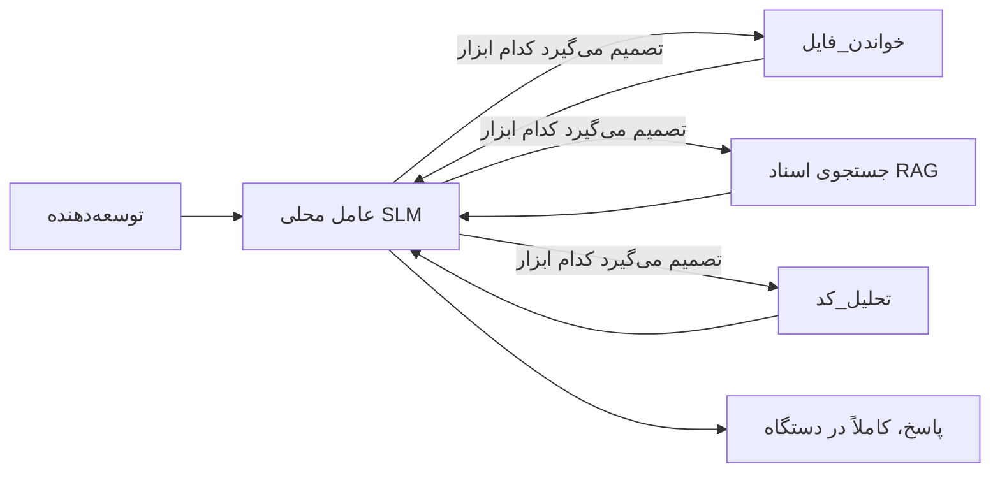
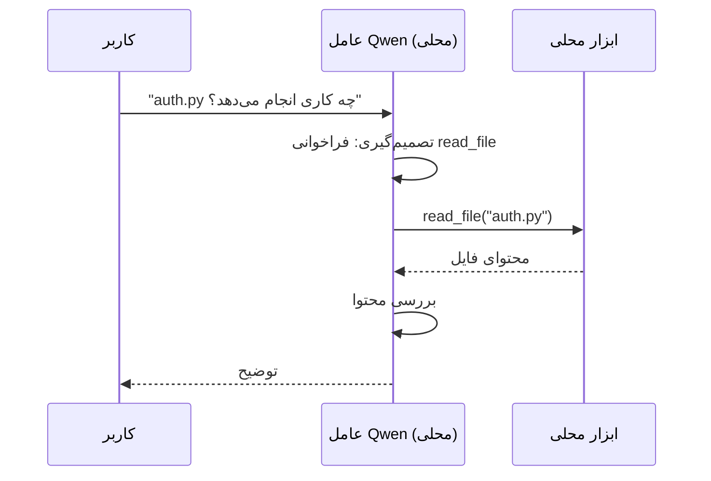
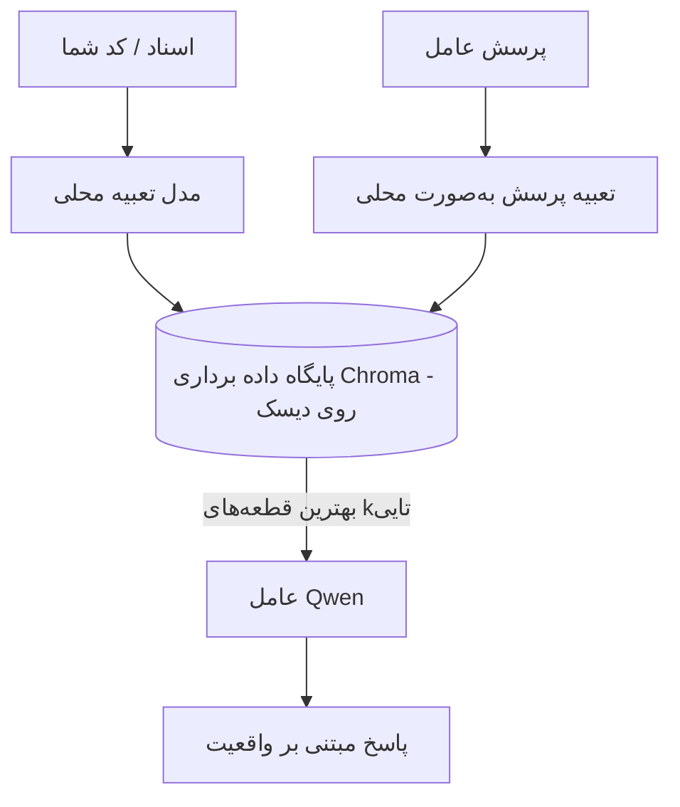
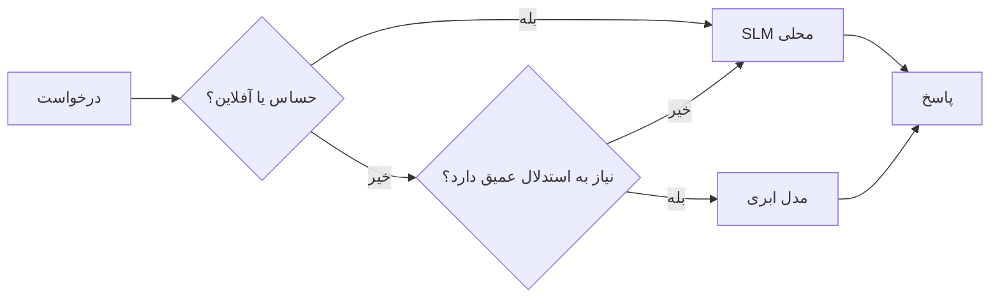

# ایجاد نمایندگان هوش مصنوعی محلی با استفاده از Microsoft Foundry Local و Qwen


در درس قبلی نمایندگان را به سمت *ابر* مقیاس کردیم. این یکی آنها را روی یک دستگاه واحد *پایین* می‌آورد. در پایان شما یک دستیار مهندسی کاری خواهید داشت که استدلال می‌کند، ابزارها را فراخوانی می‌کند، پرونده‌های شما را می‌خواند و مستندات شما را جستجو می‌کند — **بدون هیچ تماس استنتاج ابری.**

چرا این را می‌خواهید؟ سه دلیل که به طور مکرر در کار مهندسی واقعی مطرح می‌شوند:

- **حریم خصوصی.** کد و اسناد هرگز دستگاه را ترک نمی‌کنند. هیچ پرامپت، هیچ قطعه کدی، هیچ داده مشتری از مرز شبکه عبور نمی‌کند.
- **هزینه.** استنتاج محلی هزینه بر اساس هر توکن ندارد. می‌توانید تمام روز برای قیمت برق تکرار کنید.
- **آفلاین.** در هواپیما، در یک مجتمع امن، یا هنگام قطعی، نماینده هنوز کار می‌کند.

نکته این است که شما یک مدل ابری پیشرفته را با یک **مدل زبان کوچک (SLM)** که روی CPU، GPU یا NPU شما اجرا می‌شود، معاوضه می‌کنید. این درس درباره ساخت نمایندگانی است که در آن محدودیت *خوب* عمل می‌کنند، نه ادای نبود محدودیت را در بیاورند.

## مقدمه

این درس شامل موارد زیر است:

- **مدل‌های زبان کوچک (SLMها)** — آنها چه هستند، در کجا خوب عمل می‌کنند و در کجا نه.
- **Microsoft Foundry Local** — یک زمان‌اجرایی که مدل‌ها را روی دستگاه دانلود و ارائه می‌دهد از طریق یک **رابط برنامه‌نویسی سازگار با OpenAI**.
- **مدل‌های فراخوانی تابع Qwen** — SLMهایی که به طور قابل اعتماد فراخوانی ابزار تولید می‌کنند که باعث می‌شود نمایندگان محلی *(نه فقط گفتگو محلی)* ممکن شوند.
- **ابزارهای محلی، RAG محلی، و MCP محلی** — فراهم کردن قابلیت برای نماینده بدون ابر.
- **الگوهای هیبریدی** — کی چیزها را محلی نگه داریم و کی به ابر رجوع کنیم.

## اهداف یادگیری

پس از پایان این درس، شما خواهید دانست چگونه:

- ترید آف‌های SLMها را توضیح دهید و موارد استفاده مناسب نمایندگان محلی را انتخاب کنید.
- یک مدل Qwen را به صورت محلی با Foundry Local خدمت دهید و از طریق نقطه پایانی سازگار با OpenAI به آن متصل شوید.
- یک نماینده فراخوانی ابزار بسازید که کاملاً روی ایستگاه کاری شما اجرا شود.
- RAG محلی را روی اسناد خود با استفاده از یک پایگاه داده برداری محلی (Chroma) اضافه کنید.
- نماینده را به یک سرور MCP محلی متصل کنید و درباره طراحی‌های هیبریدی محلی/ابری استدلال کنید.

## پیش‌نیازها

این درس فرض می‌کند که درس‌های قبلی را پشت سر گذاشته‌اید و با موارد زیر راحت هستید:

- [استفاده از ابزار](../04-tool-use/README.md) (درس 4) و [Agentic RAG](../05-agentic-rag/README.md) (درس 5).
- [پروتکل‌های Agentic / MCP](../11-agentic-protocols/README.md) (درس 11).
- [چارچوب عامل مایکروسافت](../14-microsoft-agent-framework/README.md) (درس 14).

همچنین به موارد زیر نیاز دارید:

- یک ایستگاه کاری توسعه‌دهنده. **حداقل واقع‌بینانه ۸ گیگابایت رم**؛ ۱۶ گیگابایت+ راحت است. داشتن GPU یا NPU کمک می‌کند اما ضروری نیست.
- نصب **Microsoft Foundry Local** (بخش راه‌اندازی را ببینید).
- پایتون 3.12+ و بسته‌های موجود در مخزن [`requirements.txt`](../../../requirements.txt)، به‌علاوه `foundry-local-sdk`، `openai` و `chromadb` برای این درس.

## مدل‌های زبان کوچک: ابزار مناسب برای کار محلی

یک مدل ابری پیشرفته صدها میلیارد پارامتر و یک مرکز داده پشت خود دارد. یک SLM چند میلیارد پارامتر دارد و باید در رم لپ‌تاپ شما جا بگیرد. این تفاوت انتظارات روشنی را تعیین می‌کند.

**SLMها در این موارد خوب هستند:**

- کارهای ساختاریافته و محدود — طبقه‌بندی، استخراج، خلاصه‌سازی یک سند شناخته شده.
- **فراخوانی ابزار** — تصمیم‌گیری درباره اینکه کدام تابع را با چه آرگومان‌هایی فراخوانی کنیم.
- تکرار سریع، ارزان و خصوصی روی داده‌های خودتان.

**SLMها در این موارد ضعیف‌ترند:**

- استدلال چند‌مرحله‌ای باز و گسترده در متن‌های بزرگ.
- دانش گسترده جهانی (چون کمتر دیده‌اند و بیشتر فراموش می‌کنند).

استراتژی برنده برای نمایندگان محلی بنابراین این است: **بگذارید SLM هماهنگ کند و بگذارید ابزارها بار سنگین را بر دوش بکشند.** مدل نیازی ندارد کد پایه شما را *بداند* — نیاز دارد بداند کی `read_file` و `search_docs` را فراخوانی کند. این دقیقاً به نقاط قوت SLM می‌پردازد.



## Microsoft Foundry Local

**Microsoft Foundry Local** یک زمان‌اجرای سبک است که مدل‌ها را کاملاً روی دستگاه شما دانلود، مدیریت و ارائه می‌دهد. ویژگی مهم برای ما این است که یک **نقطه پایانی HTTP سازگار با OpenAI** فراهم می‌کند — به این معنی که SDK OpenAI و کلاینت OpenAI چارچوب عامل مایکروسافت با تنها تغییر `base_url` علیه آن کار می‌کنند. همه چیزهایی که درباره ساخت نماینده‌ها یاد گرفته‌اید مستقیماً منتقل می‌شود؛ فقط نقطه پایانی از ابر به `localhost` منتقل می‌شود.

Foundry Local همچنین بهترین نسخه یک مدل را به طور خودکار برای سخت‌افزار شما انتخاب می‌کند — نسخه CPU، نسخه CUDA/GPU یا نسخه NPU — بنابراین بهینه‌سازی دستی برای هر دستگاه لازم نیست.

### راه‌اندازی

Foundry Local را نصب کنید (مستندات [آن](https://learn.microsoft.com/azure/ai-foundry/foundry-local/) را برای سیستم‌عامل خود ببینید) سپس تأیید کنید که کار می‌کند:

```bash
# نصب (مثال؛ مستندات مربوط به پلتفرم خود را دنبال کنید)
winget install Microsoft.FoundryLocal      # ویندوز
# brew install microsoft/foundrylocal/foundrylocal   # macOS

# دانلود و اجرای مدل Qwen، سپس راه‌اندازی سرویس محلی
foundry model run qwen2.5-7b-instruct
foundry service status
```

زمانی که سرویس اجرا شود، یک نقطه پایانی محلی سازگار با OpenAI خواهید داشت (معمولاً `http://localhost:PORT/v1`). نوت‌بوک با استفاده از `foundry-local-sdk` به طور خودکار نقطه پایانی را کشف می‌کند، پس نیازی به کدگذاری سخت‌افزار پورت نیست.

## فراخوانی تابع Qwen: چرا اهمیت دارد

یک نماینده فقط وقتی نماینده است که بتواند ابزارها را فراخوانی کند. بسیاری از SLMها می‌توانند گفتگو کنند اما فراخوانی ابزار نامطمئن و اشتباه تولید می‌کنند. مدل‌های **Qwen** برای فراخوانی تابع آموزش دیده‌اند و ساختار فراخوانی ابزار خوب‌فرم‌گیری‌شده‌ای تولید می‌کنند — که دقیقاً همان چیزی است که یک مدل گفتگوی محلی را به یک *نماینده* محلی تبدیل می‌کند.

جریان همان حلقه استاندارد فراخوانی ابزار است که قبلاً می‌شناسید، فقط روی دستگاه اجرا می‌شود:



## RAG محلی

جستجوی مستندات جایی است که نمایندگان محلی ارزش خود را نشان می‌دهند. به جای این که امیدوار باشید SLM مستندات چارچوب شما را به خاطر سپرده باشد، این مستندات را در یک **پایگاه داده برداری محلی** جاسازی می‌کنید و اجازه می‌دهید نماینده قطعات مرتبط را به درخواست بازیابی کند.

ما از **Chroma** استفاده می‌کنیم، یک فروشگاه برداری جاسازی‌شده که به صورت درون‌فرآیندی اجرا می‌شود و نیازی به مدیریت سرور ندارد. فرآیند کاملاً محلی است: مدل جاسازی محلی → بردارهای محلی → بازیابی محلی → SLM محلی.



این همان الگوی Agentic RAG از درس 5 است—تنها تغییر این است که همه مؤلفه‌ها روی دستگاه شما اجرا می‌شود.

## سرورهای MCP محلی

[MCP](../11-agentic-protocols/README.md) یک پروتکل حمل و نقل است، نه یک سرویس ابری. یک سرور MCP می‌تواند به عنوان یک فرآیند محلی روی `stdio` اجرا شود و ابزارها را به نماینده شما از طریق پروتکل استاندارد ارائه دهد. این امکان استفاده مجدد از اکوسیستم در حال رشد سرورهای MCP — دسترسی به سیستم فایل، عملیات git، پرس و جوهای پایگاه داده — را کاملاً به صورت آفلاین فراهم می‌کند.

موضع امنیتی با ابر متفاوت است، ولی غایب نیست: یک سرور MCP محلی هنوز با مجوزهای کاربر شما اجرا می‌شود، بنابراین باید محدوده دسترسی آن را کنترل کنید (یک دایرکتوری پروژه، نه کل پوشه خانگی شما) و خروجی‌های آن را به عنوان ورودی برای اعتبارسنجی در نظر بگیرید.

## الگوهای هیبریدی ابری-محلی

محلی‌اول به معنای فقط محلی نیست. سیستم‌های بالغ بر اساس حساسیت و سختی مسیردهی می‌کنند:

| وضعیت | محل اجرا |
| --- | --- |
| کد / داده حساس، یا آفلاین | **SLM محلی** |
| کار ساده و محدود | **SLM محلی** (ارزان، سریع) |
| استدلال چند قفله سخت روی داده غیر حساس | **مدل ابری** |
| همه چیز در زمان قطعی | **SLM محلی** (تخریب تدریجی) |

این الگوی **مسیردهی مدل** از درس 16 را منعکس می کند — جز اینکه یکی از "مدل‌ها" اکنون دستگاه خود شما است. یک طراحی مقاوم وقتی ابر در دسترس نیست به مدل محلی بازمی‌گردد، بنابراین کیفیت نماینده کاهش می‌یابد به جای شکست کامل.



## آزمایش عملی: یک دستیار مهندسی محلی

فایل [`code_samples/17-local-agent-foundry-local.ipynb`](./code_samples/17-local-agent-foundry-local.ipynb) را باز کرده و آن را اجرا کنید. شما یک **دستیار مهندسی محلی** خواهید ساخت که روی ایستگاه کاری شما کاملاً اجرا می‌شود و می‌تواند:

۱. **فراخوانی ابزارها** — از طریق فراخوانی تابع Qwen از طریق Foundry Local.
۲. **انجام عملیات پرونده محلی** — فهرست و خواندن پرونده‌ها در یک دایرکتوری پروژه.
۳. **تحلیل کد** — گزارش معیارهای پایه روی یک فایل منبع.
۴. **جستجوی مستندات** — RAG محلی روی یک پوشه مستندات با Chroma.
۵. **استفاده از MCP** — اتصال به سرور MCP محلی (با رد ملایم اگر سرور پیکربندی نشده باشد).

در هیچ مرحله‌ای از استنتاج ابری استفاده نمی‌شود.

### راهنمای گام به گام

دستیار از طریق نقطه پایانی سازگار با OpenAI به Foundry Local متصل می‌شود، بنابراین کد نماینده تقریباً شبیه درس‌های ابری است — تنها کلاینت تغییر می‌کند:

```python
from foundry_local import FoundryLocalManager
from openai import OpenAI

# فاندری لوکال مدل را پیدا می‌کند/دانلود می‌کند و یک نقطه انتهایی محلی به ما می‌دهد.
manager = FoundryLocalManager(\"qwen2.5-7b-instruct\")
client = OpenAI(base_url=manager.endpoint, api_key=manager.api_key)  # api_key یک مکان‌نگهدار محلی است
```

ابزارها توابع عادی پایتون هستند که به یک دایرکتوری پروژه محدود شده‌اند:

```python
def read_file(path: str) -> str:
    \"\"\"Read a file, but only inside the sandboxed project directory.\"\"\"
    full = (PROJECT_ROOT / path).resolve()
    if PROJECT_ROOT not in full.parents and full != PROJECT_ROOT:
        return \"Access denied: path is outside the project directory.\"
    return full.read_text(encoding=\"utf-8\")
```

توجه به بررسی محیط محافظتی — حتی محلی هم، ابزاری که مسیرهای دلخواه می‌خواند خطرناک است. نوت‌بوک هر ابزار را محدود به یک ریشه پروژه نگه می‌دارد.

## بررسی دانش

قبل از رفتن به تمرین، دانش خود را آزمایش کنید.

**۱. دو دلیل ملموس برای اجرای یک نماینده به صورت محلی به جای ابری بیان کنید.**

<details>
<summary>پاسخ</summary>

هر دو مورد از: **حریم خصوصی** (کد و داده‌ها هرگز دستگاه را ترک نمی‌کنند)، **هزینه** (بدون صورت‌حساب استنتاج بر اساس هر توکن)، و **قابلیت آفلاین بودن** (در هواپیما، مکان امن یا هنگام قطعی سند اجرا می‌شود). محدودیت‌های قانونی/رعایتی که فرستادن داده‌ها به بیرون را ممنوع می‌کنند دلیل شایع حفظ حریم خصوصی است.
</details>

**۲. تقسیم کار توصیه‌شده بین یک SLM و ابزارهای آن در یک نماینده محلی چیست و چرا؟**

<details>
<summary>پاسخ</summary>

بگذارید SLM **هماهنگ کند** (تصمیم بگیرد کدام ابزار را با چه آرگومان‌هایی فراخوانی کند) و بگذارید **ابزارها بار سنگین را بر دوش بکشند** (خواندن فایل‌ها، بازیابی مستندات، محاسبه نتایج). SLMها در تصمیم‌های محدود مثل انتخاب ابزار قوی هستند ولی در دانش گسترده و استدلال چندمرحله‌ای ضعیف‌ترند، پس تکیه بر ابزارها به نقاط قوت آن‌ها می‌پردازد.
</details>

**۳. چه چیزی امکان استفاده مجدد از کد نماینده ابری با Foundry Local را فراهم می‌کند؟**

<details>
<summary>پاسخ</summary>

Foundry Local یک **نقطه پایانی HTTP سازگار با OpenAI** ارائه می‌دهد. SDK OpenAI و کلاینت OpenAI چارچوب عامل با تغییر تنها در `base_url` (و استفاده از کلید API محلی) علیه آن کار می‌کنند. بقیه کد نماینده تغییر نمی‌کند.
</details>

**۴. چرا ما به طور خاص از مدل فراخوانی تابع Qwen استفاده می‌کنیم به جای هر SLM دیگری؟**

<details>
<summary>پاسخ</summary>

زیرا یک نماینده باید فراخوانی ابزار قابل اعتماد و خوب‌ساختاری شده تولید کند. بسیاری از SLMها می‌توانند گفتگو کنند ولی ساختارهای فراخوانی ابزار نامنظم یا ناسازگار تولید می‌کنند. مدل‌های Qwen برای فراخوانی تابع آموزش دیده و فراخوانی ابزار منظم تولید می‌کنند که دقیقاً چیزی است که مدل گفتگو محلی را به نماینده محلی عملی تبدیل می‌کند.
</details>

**۵. در خط لوله RAG محلی، کدام مؤلفه‌ها روی دستگاه اجرا می‌شوند؟**

<details>
<summary>پاسخ</summary>

همه‌ی آنها: مدل جاسازی، پایگاه داده برداری (Chroma، روی دیسک)، مرحله بازیابی، و SLM. اسناد به صورت محلی جاسازی، ذخیره، بازیابی و توسط مدل محلی تحلیل می‌شوند — هیچ مؤلفه‌ای به ابر دسترسی ندارد.
</details>

**۶. یک سرور MCP محلی روی دستگاه شما اجرا می‌شود. آیا این به طور خودکار آن را ایمن می‌کند؟ چه احتیاطی هنوز باید بکنید؟**

<details>
<summary>پاسخ</summary>

خیر. یک سرور MCP محلی با مجوزهای کاربر شما اجرا می‌شود، بنابراین می‌تواند به هر چیزی که شما می‌توانید دسترسی داشته باشد، دسترسی داشته باشد. آن را محدود به نیازهایش کنید (مثلاً یک دایرکتوری پروژه به جای کل پوشه خانگی) و خروجی‌های آن را به عنوان ورودی برای اعتبارسنجی قبل از اقدام در نظر بگیرید.
</details>

**۷. یک قانون مسیردهی هیبریدی معقول که مدل محلی را در بر می‌گیرد، توصیف کنید.**

<details>
<summary>پاسخ</summary>

درخواست‌های حساس یا آفلاین را به SLM محلی مسیر دهید؛ کارهای ساده و محدود را برای سرعت و هزینه به SLM محلی؛ استدلال چندمرحله‌ای سخت روی داده غیر حساس را به مدل ابری؛ و اگر ابر در دسترس نبود، به SLM محلی بازگردید تا نماینده به آرامی کیفیت خود را کاهش دهد به جای شکست کامل. این همان مسیردهی مدل (درس 16) با دستگاه محلی به عنوان یکی از مدل‌ها است.
</details>

**۸. کمینه رم واقع‌بینانه برای اجرای نماینده محلی در این درس چقدر است و رم بیشتر چه مزیتی دارد؟**

<details>
<summary>پاسخ</summary>

حدود **۸ گیگابایت** حداقل واقع‌بینانه است؛ ۱۶ گیگابایت+ راحت است. رم بیشتر به شما اجازه می‌دهد مدل‌های بزرگتر و توانمندتری اجرا کنید و متن بیشتری را در حافظه نگه دارید. GPU یا NPU سرعت inference را افزایش می‌دهد اما ضروری نیست — Foundry Local زمانی که شتاب‌دهنده‌ای موجود نباشد نسخه CPU را انتخاب می‌کند.
</details>

## تمرین

دستیار مهندسی محلی را به یک **بازبین مستندات محلی** برای یک پروژه کوچک انتخابی توسعه دهید (می‌توانید از یکی از پوشه‌های درس این مخزن استفاده کنید).

ارسال شما باید:

۱. یک پوشه واقعی مستندات/کد را به Chroma شاخص‌گذاری کند (حداقل پنج فایل).
۲. یک ابزار `find_todos` اضافه کند که پروژه را برای کامنت‌های `TODO`/`FIXME` اسکن کرده و آنها را با فایل و شماره خط برگرداند — با همان بررسی محیط محافظتی مثل `read_file`.

3. **از عامل سه سؤال بپرسید** که او را مجبور به ترکیب ابزارها کند: یک سؤال صرفاً RAG، یک سؤال که نیاز به خواندن یک فایل خاص دارد، و یک سؤال که نیاز به یافتن TODOها دارد.
4. **زمان‌بندی کنید**: زمان پاسخ هر سه مورد را اندازه‌گیری کرده و در یک سل مارک‌داون یادداشت کنید. درباره اینکه آیا تأخیر در روند کاری مد نظر شما قابل قبول است یا خیر، نظر دهید.

سپس یک پاراگراف کوتاه بنویسید در مورد اینکه **چه چیزهایی را به فضای ابری منتقل می‌کنید و چه چیزهایی را به صورت محلی نگه می‌دارید** برای این بررسی‌کننده، و چرا. ارزیابی شما بر این اساس است که آیا اجزای محلی به درستی به هم متصل شده‌اند و آیا استدلال ترکیبی شما منطقی است — نه بر کیفیت مدل.

## خلاصه

در این درس شما یک عامل ساختید که کاملاً روی دستگاه خود شما اجرا می‌شود:

- **SLMها** به جای گستردگی، حریم خصوصی، هزینه و عملکرد آفلاین را مبادله می‌کنند — و زمانی می‌درخشند که **ابزارها را هماهنگ کنند** به جای اینکه همه دانش را خودشان داشته باشند.
- **Foundry Local** مدل‌ها را روی دستگاه در پشت یک **نقطه پایانی سازگار با OpenAI** ارائه می‌دهد، بنابراین کد عامل ابری شما با یک تغییر خطی منتقل می‌شود.
- **مدل‌های فراخوانی تابع Qwen** فراخوانی ابزار محلی قابل اعتماد را ممکن می‌سازند — و بنابراین *عامل‌های* محلی را.
- **RAG محلی** (Chroma) و **MCP محلی** به عامل قابلیت می‌دهند بدون اینکه دستگاه را ترک کند.
- **الگوهای ترکیبی** به شما اجازه می‌دهند بر اساس حساسیت و دشواری مسیردهی کنید، با محلی به عنوان یک راه‌حل جایگزین نرم.

این فصل کامل‌کننده چرخه استقرار است: درس ۱۶ عامل‌ها را در Microsoft Foundry مقیاس‌دهی کرد، و این درس آن‌ها را روی یک ایستگاه کاری واحد مقیاس‌دهی کرد. درس بعدی به حفظ امنیت عامل‌های مستقر شده می‌پردازد.

## منابع بیشتر

- <a href="https://learn.microsoft.com/azure/ai-foundry/foundry-local/" target="_blank">مستندات Microsoft Foundry Local</a>
- <a href="https://learn.microsoft.com/azure/ai-foundry/what-is-azure-ai-foundry" target="_blank">مستندات Microsoft Foundry</a>
- <a href="https://learn.microsoft.com/en-us/agent-framework/overview/?wt.mc_id=youtube_26688_organicsocial_reactor&pivots=programming-language-python" target="_blank">Microsoft Agent Framework</a>
- <a href="https://qwen.readthedocs.io/en/latest/framework/function_call.html" target="_blank">مستندات فراخوانی تابع Qwen</a>
- <a href="https://modelcontextprotocol.io/" target="_blank">پروتکل زمینه مدل (MCP)</a>
- <a href="https://docs.trychroma.com/" target="_blank">پایگاه داده بردار Chroma</a>

## درس قبلی

[استقرار عامل‌های مقیاس‌پذیر](../16-deploying-scalable-agents/README.md)

## درس بعدی

[امنیت عامل‌های هوش مصنوعی](../18-securing-ai-agents/README.md)

---

<!-- CO-OP TRANSLATOR DISCLAIMER START -->
**سلب مسئولیت**:
این سند با استفاده از سرویس ترجمه هوش مصنوعی [Co-op Translator](https://github.com/Azure/co-op-translator) ترجمه شده است. در حالی که ما در تلاش برای دقت هستیم، لطفاً توجه داشته باشید که ترجمه‌های خودکار ممکن است شامل خطاها یا نادرستی‌هایی باشند. سند اصلی به زبان مادری خود باید به عنوان منبع معتبر در نظر گرفته شود. برای اطلاعات حیاتی، ترجمه حرفه‌ای انسانی توصیه می‌شود. ما در قبال هرگونه سوء تفاهم یا برداشت نادرست ناشی از استفاده از این ترجمه مسئولیتی نداریم.
<!-- CO-OP TRANSLATOR DISCLAIMER END -->