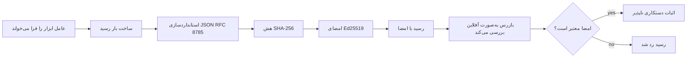
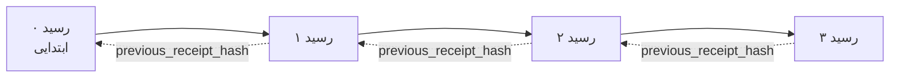

[تماشای ویدیو درس: ایمن‌سازی عوامل هوش مصنوعی با رسیدهای رمزنگاری‌شده](https://youtu.be/PLACEHOLDER_VIDEO_ID)

> _(ویدیو درس و تصویر کوچک پس از ادغام توسط تیم محتوای مایکروسافت اضافه خواهد شد، مطابق با الگوی درس ۱۴ / ۱۵.)_

# ایمن‌سازی عوامل هوش مصنوعی با رسیدهای رمزنگاری‌شده

## مقدمه

این درس شامل موارد زیر است:

- چرا ردپای حسابرسی برای عوامل هوش مصنوعی برای انطباق، اشکال‌زدایی و اعتماد اهمیت دارد.
- رسید رمزنگاری شده چیست و چگونه با یک خط گزارش بدون امضا تفاوت دارد.
- چگونگی تولید یک رسید امضا شده برای فراخوان ابزار یک عامل در پایتون ساده.
- چگونگی تأیید یک رسید به صورت آفلاین و تشخیص تغییر دادن.
- چگونگی زنجیره کردن رسیدها به طوری که حذف یا تغییر ترتیب یکی زنجیره را خراب کند.
- رسیدها چه چیزی را اثبات می‌کنند و صراحتاً چه چیزی را اثبات نمی‌کنند.

## اهداف یادگیری

پس از اتمام این درس، می‌توانید:

- حالت‌های خرابی که موجب ضرورت اثبات رمزنگاری شده برای اقدامات عامل می‌شوند را شناسایی کنید.
- یک رسید امضا شده Ed25519 را روی بارگذاری JSON به صورت کاننیکال تولید کنید.
- رسید را به صورت مستقل با استفاده تنها از کلید عمومی امضاکننده تأیید کنید.
- با اجرای مجدد تأیید روی رسید تغییر یافته، تغییرات را تشخیص دهید.
- یک سلسله رسیدهای زنجیره شده هَش بسازید و توضیح دهید چرا زنجیره اهمیت دارد.
- مرز بین آنچه رسیدها اثبات می‌کنند (نسبت، صحت، ترتیب) و آنچه اثبات نمی‌کنند (درستی عمل، صحت سیاست) را تشخیص دهید.

## مسئله: ردپای حسابرسی عامل شما

تصور کنید یک عامل هوش مصنوعی برای شرکت Contoso Travel مستقر کرده‌اید. این عامل درخواست‌های مشتری را می‌خواند، API پروازها را برای یافتن گزینه‌ها فراخوانی می‌کند و به نمایندگی از مشتری جایگاه‌ها را رزرو می‌نماید. در سه ماهه گذشته، این عامل ۵۰,۰۰۰ رزرو را پردازش کرده است.

امروز یک حسابرس می‌آید. پرسش ساده‌ای می‌پرسد: «به من نشان دهید عامل شما چه کرده است.»

شما فایل‌های گزارش خود را تحویل می‌دهید. حسابرس آنها را می‌بیند و پرسش دشوارتر می‌پرسد: «چگونه بدانم این گزارش‌ها ویرایش نشده‌اند؟»

این همان مشکل ردپای حسابرسی است. بیشتر استقرارهای فعلی عامل متکی به موارد زیر هستند:

- **گزارش‌های برنامه**: توسط خود عامل نوشته می‌شوند، و هر کسی که به فایل‌ سیستم دسترسی داشته باشد می‌تواند آنها را ویرایش کند.
- **خدمات گزارش‌دهی ابری**: در سطح پلتفرم دستکاری آنها قابل مشاهده است اما فقط اگر حسابرس به اپراتور پلتفرم اعتماد کند.
- **گزارش‌های تراکنش پایگاه داده**: برای تغییرات پایگاه داده مناسب هستند ولی برای فراخوان‌های ابزار دلخواه نه.

هیچ‌یک از این موارد نمی‌توانند پرسش حسابرس را بدون الزام به اعتماد به کسی (شما، ارائه‌دهنده ابر، فروشنده پایگاه داده) پاسخ دهند. برای استفاده داخلی، آن اعتماد معمولاً قابل قبول است. برای بارهای کاری دارای مقررات (مالی، بهداشت، هر چیز مشمول قانون هوش مصنوعی اتحادیه اروپا) قابل قبول نیست.

رسیدهای رمزنگاری شده این مشکل را حل می‌کنند با اینکه هر عمل عامل را به صورت مستقل قابل تأیید می‌سازند. حسابرس نیازی به اعتماد به شما ندارد. تنها کلید عمومی شما و رسید کافی است.

## رسید رمزنگاری شده چیست؟

رسید یک شیء JSON است که آنچه یک عامل انجام داده را ثبت می‌کند و با یک امضای دیجیتال امضا شده است.



یک رسید حداقلی به این شکل است:

```json
{
  "type": "agent.tool_call.v1",
  "agent_id": "contoso-travel-bot",
  "tool_name": "lookup_flights",
  "tool_args_hash": "sha256:a3f9c1...",
  "result_hash": "sha256:7b2e1d...",
  "policy_id": "contoso-travel-policy-v3",
  "timestamp": "2026-04-25T14:30:00Z",
  "sequence": 47,
  "previous_receipt_hash": "sha256:9d4e6a...",
  "signature": {
    "alg": "EdDSA",
    "sig": "c5af83...",
    "public_key": "8f3b2c..."
  }
}
```

سه ویژگی این کار را انجام می‌دهند:

1. **امضا**. رسید توسط درگاه عامل با استفاده از کلید خصوصی Ed25519 امضا شده است. هر کسی که کلید عمومی متناظر را دارد می‌تواند امضا را به صورت آفلاین تأیید کند. دستکاری در هر فیلد، امضا را نامعتبر می‌کند.

2. **کدگذاری کاننیکال**. پیش از امضا، رسید با استفاده از طرح کاننیکال‌سازی JSON (JCS، RFC 8785) سریالیزه می‌شود. این تضمین می‌کند که دو پیاده‌سازی که همان رسید منطقی را تولید می‌کنند، خروجی بایت-شناسایی‌شده (byte-identical) می‌سازند. بدون کاننیکال‌سازی، serializerهای مختلف JSON امضاهای متفاوتی برای همان محتوا تولید می‌کردند.

3. **زنجیره هَش**. فیلد `previous_receipt_hash` هر رسید را به قبلی آن لینک می‌کند. حذف یا تغییر ترتیب یک رسید، تمام رسیدهای بعد از آن را خراب می‌کند. دستکاری حتی اگر هر امضای فردی نادیده گرفته شود، در سطح زنجیره قابل مشاهده می‌شود.

این ویژگی‌ها سه تضمین را فراهم می‌کنند:

- **نسبت**: این کلید این محتوا را امضا کرده است.
- **درستی**: محتوا از زمان امضا تغییر نکرده است.
- **ترتیب**: این رسید پس از آن رسید در زنجیره آمده است.

## تولید رسید در پایتون

برای تولید رسید نیازی به کتابخانه خاصی ندارید. ابتداییات رمزنگاری به طور گسترده موجود است و منطق در چند ده خط پایتون خلاصه می‌شود.

تمرین‌های عملی در `code_samples/18-signed-receipts.ipynb` کل جریان را طی می‌کنند. نسخه خلاصه:

```python
import json
import hashlib
import base64
from nacl import signing
from jcs import canonicalize  # JSON استاندارد RFC 8785

def b64url_nopad(data: bytes) -> str:
    return base64.urlsafe_b64encode(data).decode("ascii").rstrip("=")

def sha256_canonical(obj) -> str:
    """SHA-256 of a Python object's JCS-canonical JSON form."""
    return f"sha256:{hashlib.sha256(canonicalize(obj)).hexdigest()}"

# تولید یا بارگذاری کلید امضا (در تولید، در یک مخزن کلید ذخیره شود)
signing_key = signing.SigningKey.generate()
verify_key = signing_key.verify_key

# ساخت داده رسید (فعلاً بدون امضا)
tool_args = {"origin": "SYD", "destination": "LAX"}
tool_result = [{"flight": "QF11", "price": 1850, "stops": 0}]

payload = {
    "type": "agent.tool_call.v1",
    "agent_id": "contoso-travel-bot",
    "tool_name": "lookup_flights",
    "tool_args_hash": sha256_canonical(tool_args),
    "result_hash": sha256_canonical(tool_result),
    "policy_id": "contoso-travel-policy-v3",
    "timestamp": "2026-04-25T14:30:00Z",
    "sequence": 0,
    "previous_receipt_hash": None,
}

# استانداردسازی، هش، امضا.
canonical_bytes = canonicalize(payload)
message_hash = hashlib.sha256(canonical_bytes).digest()
signature_bytes = signing_key.sign(message_hash).signature

# الحاق یک شیء امضای ساختاریافته.
receipt = {
    **payload,
    "signature": {
        "alg": "EdDSA",
        "sig": b64url_nopad(signature_bytes),
        "public_key": b64url_nopad(bytes(verify_key)),
    },
}
```

این کل خط لوله امضا است. تمرین‌ها در دفترچه هر مرحله را گام به گام نشان می‌دهند.

## تأیید رسید و تشخیص دستکاری

تأیید عملیات معکوس است:

```python
import base64
import hashlib
from nacl import signing
from nacl.exceptions import BadSignatureError
from jcs import canonicalize

def b64url_decode(s: str) -> bytes:
    padding = "=" * ((4 - len(s) % 4) % 4)
    return base64.urlsafe_b64decode(s + padding)

def verify_receipt(receipt: dict) -> bool:
    # امضا یک شیء ساخت‌یافته است: {"alg"، "sig"، "public_key"}.
    sig_obj = receipt.get("signature")
    if not sig_obj or sig_obj.get("alg") != "EdDSA":
        return False

    # بازسازی محموله‌ای که در واقع امضا شده بود (همه چیز به جز امضا).
    payload = {k: v for k, v in receipt.items() if k != "signature"}

    canonical_bytes = canonicalize(payload)
    message_hash = hashlib.sha256(canonical_bytes).digest()

    try:
        verify_key = signing.VerifyKey(b64url_decode(sig_obj["public_key"]))
        verify_key.verify(message_hash, b64url_decode(sig_obj["sig"]))
        return True
    except BadSignatureError:
        return False
```

این تابع یک رسید می‌گیرد و اگر امضا معتبر باشد `True` برمی‌گرداند و در غیر این صورت `False`. هیچ فراخوان شبکه‌ای، وابستگی به سرویس یا نیاز به اعتماد به شخص ثالث نیست.

برای دیدن عملکرد تشخیص تغییر، دفترچه موارد زیر را طی می‌کند:

1. تولید یک رسید معتبر و تأیید صحت آن.
2. تغییر یک بایت در فیلد `tool_args_hash`.
3. اجرای مجدد تأیید و مشاهده شکست آن.

این نشان عملی است که رسیدها در برابر تغییر مقاوم‌اند: هر تغییر، حتی کوچک، امضا را خراب می‌کند.

## زنجیره کردن رسیدها برای عوامل چندمرحله‌ای

یک رسید امضا شده فقط یک عمل را محافظت می‌کند. زنجیره‌ای از رسیدها یک توالی را محافظت می‌کند.



هر رسید هَش رسید قبلی را ثبت می‌کند. برای حذف بی‌صدا رسید شماره ۲، یک مهاجم باید یا:

- فیلد `previous_receipt_hash` رسید شماره ۳ را تغییر دهد (امضای رسید ۳ را می‌شکند)، یا
- یک امضای جدید روی رسید شماره ۳ اصلاح شده جعل کند (که نیاز به کلید خصوصی عامل دارد).

اگر کلید خصوصی در یک خزانه کلید سخت‌افزاری باشد و شما کلید عمومی را با هر رسید منتشر کنید، هیچ‌یک از این حملات بدون کشف امکان‌پذیر نیست.

دفترچه مراحل زیر را طی می‌کند:

1. ساختن زنجیره‌ای از سه رسید.
2. تأیید اینکه هر `previous_receipt_hash` با هَش واقعی رسید قبلی تطابق دارد.
3. دستکاری یکی از رسیدها در وسط و مشاهده شکستن زنجیره دقیقاً در آن نقطه.

این‌گونه ردپای حسابرسی ایجاد می‌شود که یک حسابرس خارجی می‌تواند بدون اعتماد به شما آن را تأیید کند.

## رسیدها چه اثبات می‌کنند (و چه اثبات نمی‌کنند)

این مهم‌ترین بخش این درس است. رسیدها قدرتمندند اما قدرت آنها محدود است.

**رسیدها سه چیز را اثبات می‌کنند:**

1. **نسبت**: کلید خاصی یک بارگذاری مشخص را امضا کرده است.
2. **درستی**: بارگذاری از زمان امضا تغییر نکرده است.
3. **ترتیب**: این رسید پس از آن رسید در زنجیره آمده است.

**رسیدها اثبات نمی‌کنند:**

1. **درستی**: اینکه عمل عامل درست بوده باشد. یک رسید می‌تواند برای پاسخ اشتباه به همان وضوح امضا شود که برای پاسخ درست می‌شود.
2. **انطباق با سیاست**: اینکه سیاست اشاره شده در `policy_id` واقعاً ارزیابی شده باشد، یا اگر ارزیابی می‌شد این عمل را مجاز می‌دانست. رسید آنچه ادعا شده را ثبت می‌کند، نه آنچه اجرا شده است.
3. **هویت فراتر از کلید**: رسید می‌گوید "این کلید این محتوا را امضا کرده است". نمی‌گوید "این انسان مجوز داده است". اتصال کلید به شخص یا سازمان نیازمند زیرساخت هویت جداگانه است (دایرکتوری، رجیستری کلید عمومی، و غیره).
4. **صحت ورودی‌ها**: اگر عامل یک پرسش دستکاری‌شده دریافت کند و روی آن عمل کند، رسید عمل را به وفاداری ثبت می‌کند. رسیدها بعد از اعتبارسنجی ورودی هستند، نه جایگزین آن.

این مرز اهمیت دارد از دو جهت:

- به شما می‌گوید رسیدها برای چه کاربردی مفیدند: قابل حسابرسی و ضد تغییر کردن رفتار عامل، حتی در مرزهای سازمانی.
- به شما می‌گوید چه لایه‌های بیشتری هنوز نیاز دارید: اعتبارسنجی ورودی (درس ۶)، اعمال سیاست (به طور خلاصه پوشش داده شده)، و زیرساخت هویت (خارج از دامنه این درس).

اشتباه رایج این است که فرض شود «رسید داریم» یعنی «حکمرانی داریم.» این درست نیست. رسیدها بنیادند. حکمرانی سیستمی است که روی آنها می‌سازید.

## مراجع تولید

کد پایتون در این درس عمداً بسیار کم است تا هر خط را بتوانید بخوانید و دقیقاً بفهمید چه اتفاقی می‌افتد. در تولید، دو گزینه دارید:

1. **مستقیماً روی ابتداییات رمزنگاری بسازید.** ۵۰ خط کدی که دیدید برای بسیاری از موارد کافی است. PyNaCl (Ed25519) و بسته `jcs` (برای JSON کاننیکال) کتابخانه‌های خوب نگهداری‌شده و ممیزی شده هستند.

2. **از یک کتابخانه تولید رسید استفاده کنید.** چندین پروژه متن‌باز همان الگو را با ویژگی‌های اضافی (چرخش کلید، تأیید دسته‌ای، توزیع مجموعه JWK، ادغام با موتورهای سیاست) پیاده‌سازی می‌کنند:
   - قالب رسید استفاده‌شده در این درس از یک پیش‌نویس IETF Internet-Draft (`draft-farley-acta-signed-receipts`) منشأ می‌گیرد که هم‌اکنون در فرایند استانداردسازی است.
   - بسته ابزار حکمرانی عامل مایکروسافت رسیدها را با تصمیمات سیاست مبتنی بر Cedar ترکیب می‌کند؛ آموزش ۳۳ در آن مخزن مثال انتها به انتها دارد.
   - بسته‌های `protect-mcp` (npm) و `@veritasacta/verify` (npm) پیاده‌سازی Node برای امضای رسید و تأیید آفلاین ارائه می‌دهند که برای بسته‌بندی هر سرور MCP با ردپای حسابرسی ضد تغییر طراحی شده‌اند.

تصمیم بین ساختن از ابتدا و استفاده از کتابخانه مانند انتخاب بین نوشتن کتابخانه JWT خودتان و استفاده از یک کتابخانه آزموده‌شده است: هر دو منطقی‌اند؛ کتابخانه در زمان صرفه‌جویی می‌کند و دامنه ممیزی را کاهش می‌دهد؛ ساختن از ابتدا شما را مجبور می‌کند هر جزئیات را بفهمید. این درس مسیر ساختن از ابتدا را آموزش می‌دهد تا پایه را برای هر دو گزینه داشته باشید.

## بررسی دانش

قبل از رفتن به تمرین عملی، دانش خود را بسنجید.

**۱. رسید با کلید خصوصی Ed25519 عامل امضا می‌شود. حسابرس فقط کلید عمومی دارد. آیا حسابرس می‌تواند رسید را به صورت آفلاین تأیید کند؟**

<details>
<summary>پاسخ</summary>

بله. تأیید Ed25519 تنها به کلید عمومی و بایت‌های امضا شده نیاز دارد. هیچ تماس شبکه‌ای، وابستگی به سرویس نیست. این ویژگی رسیدها را در محیط‌های جداسازی‌شده، چندسازمانی یا حسابرسی با اعتماد کم مفید می‌کند.
</details>

**۲. یک مهاجم فیلد `policy_id` رسید را تغییر می‌دهد تا ادعا کند توسط سیاستی با اجازه بیشتر حکمرانی شده است. امضا روی بارگذاری اصلی بوده است. در تأیید چه اتفاقی می‌افتد؟**

<details>
<summary>پاسخ</summary>

تأیید ناموفق است. امضا روی بایت‌های کاننیکال بارگذاری اصلی محاسبه شده است؛ تغییر هر فیلد بایت‌های کاننیکال را تغییر می‌دهد، که هش SHA-256 را تغییر می‌دهد و امضا را نامعتبر می‌کند. مهاجم نیاز به کلید خصوصی برای تولید امضای معتبر جدید دارد که ندارد.
</details>

**۳. چرا رسید به جای آرگومان‌ها و نتایج خام، `tool_args_hash` و `result_hash` را شامل می‌شود؟**

<details>
<summary>پاسخ</summary>

دو دلیل دارد. اول اینکه ممکن است لازم باشد رسید بایگانی یا در محیط‌هایی ارسال شود که افشای محتوای خام (اطلاعات شناسایی شخصی، داده‌های تجاری) مشکل‌ساز است. هش کردن باعث می‌شود رسید کوچک بماند و محتوا خصوصی باشد؛ حسابرس مطمئن می‌شود هش با نسخه‌ای جداگانه از محتوا مطابقت دارد. دوم اینکه هش‌ها اندازه ثابتی دارند؛ رسید با هش اندازه محدودی دارد بدون توجه به بزرگی ورودی‌ها و خروجی‌ها.
</details>

**۴. فیلد `previous_receipt_hash` هر رسید را به قبلی آن متصل می‌کند. اگر مهاجمی ساکتانه یک رسید از وسط زنجیره را حذف کند، چه چیزی نامعتبر می‌شود؟**

<details>
<summary>پاسخ</summary>

هر رسیدی که بعد از رسید حذف‌شده آمده است. فیلدهای `previous_receipt_hash` آنها دیگر با زنجیره واقعی هماهنگ نیست (زیرا رسیدی که به آن اشاره می‌کردند وجود ندارد یا زنجیره به پیش‌ازآن دیگری اشاره می‌کند). برای پنهان کردن حذف، مهاجم باید هر رسید بعدی را دوباره امضا کند که نیاز به کلید خصوصی دارد.
</details>

**۵. یک رسید به درستی تأیید شد. آیا این اثبات می‌کند که فعل عامل درست، منطقی یا مطابق سیاست بوده است؟**

<details>
<summary>پاسخ</summary>

خیر. یک رسید معتبر سه مورد را اثبات می‌کند: نسبت (این کلید این محتوا را امضا کرده است)، درستی (محتوا تغییر نکرده است) و ترتیب (این رسید پس از آن رسید آمده است). اثبات نمی‌کند که عمل درست بوده، سیاست نام‌برده در `policy_id` واقعاً اجرا شده یا عامل همه قوانین را رعایت کرده است. رسیدها رفتار عامل را قابل حسابرسی می‌کنند، نه لزوماً درست. این مهم‌ترین مرز درس است.
</details>

## تمرین عملی

دفترچه `code_samples/18-signed-receipts.ipynb` را باز کرده و همه چهار بخش را کامل کنید:

1. **بخش ۱**: اولین رسید خود را امضا کرده و تأیید کنید.
2. **بخش ۲**: رسید را دستکاری کرده و ببینید تأیید شکست می‌خورد.
3. **بخش ۳**: زنجیره‌ای سه رسیدی بسازید و صحت زنجیره را تأیید کنید.
4. **بخش ۴**: این الگو را روی یک عامل ساخته شده با چارچوب عامل مایکروسافت اعمال کنید: فراخوان ابزار را در امضای رسید بپیچید، سپس رسید را به طور مستقل تأیید کنید.

**چالش اضافی ۱:** طرح رسید را با یک فیلد اضافی دلخواه گسترش دهید (برای مثال، شناسه درخواست برای ردیابی)، منطق امضای کاننیکال را به‌روزرسانی کنید و تأیید کنید که رسید همچنان به درستی از پس‌وارد (round-trip) تأیید برمی‌آید. سپس فیلد را پس از امضا تغییر داده و تأیید شکست را مشاهده کنید. این باعث می‌شود هر بایت از کدگذاری کاننیکال که به امضا کمک می‌کند را بفهمید.
**چالش کششی ۲:** دو رسید خود را با SHA-256 هش کنید (بایت‌های canonical آن‌ها را به ترتیب قطعی به هم متصل کنید) و هش حاصل را به عنوان یک فیلد جدید در رسید سوم قرار دهید قبل از امضا کردن آن. تایید کنید که هر سه رسید هنوز به درستی انتقال پیدا می‌کنند. شما همین حالا یک اثبات شمول یک مرحله‌ای ساخته‌اید: هر کسی که رسید سوم را در دست داشته باشد می‌تواند اثبات کند که دو رسید اول در زمانی که رسید سوم امضا شده وجود داشته‌اند، بدون اینکه محتویات آن‌ها را لو بدهد. این همان الگوی استفاده شده در رسیدهای افشای انتخابی در مقیاس است (تعهدهای مرکلی، RFC 6962).

## نتیجه‌گیری

رسیدهای رمزنگاری‌شده به عامل‌های هوش مصنوعی یک رد حسابرسی ارائه می‌دهند که:

- **قابل تایید مستقل**: هر طرفی که کلید عمومی را داشته باشد می‌تواند تایید کند، بدون وابستگی به سرویس.
- **مشخص‌کننده دستکاری**: هر تغییری باعث نامعتبر شدن امضا می‌شود.
- **قابل حمل**: یک رسید یک فایل کوچک JSON است؛ می‌توان آن را بایگانی، انتقال و در هرجا تایید کرد.
- **مطابق با استانداردها**: ساخته شده بر اساس Ed25519 (RFC 8032)، JCS (RFC 8785) و SHA-256، همه‌ی پرایمیتیوهای به طور گسترده استفاده شده.

آن‌ها جایگزینی برای اعتبارسنجی ورودی، اجرای سیاست‌ها یا زیرساخت هویت نیستند. آن‌ها پایه‌ای برای آن لایه‌ها هستند. وقتی عامل‌هایی را در بارکاری‌های تنظیم‌شده، جریان‌های کاری چندسازمانی، یا هر جایی که نمی‌توان فرض کرد حسابرس آینده به شما اعتماد داشته باشد، مستقر می‌کنید، رسیدها راهی هستند که رد حسابرسی را صادقانه نگه می‌دارند.

مهم‌ترین نکته: رسیدها ثابت می‌کنند چه کسی چه چیزی گفته، و کی گفته است. آن‌ها ثابت نمی‌کنند چیزی که گفته شده درست یا صحیح بوده است. این تمایز را محکم نگه دارید. این تفاوت بین یک سیستم اصیل منشأ و یک سیستم گمراه‌کننده است.

## چک‌لیست تولید

وقتی آماده بودید تا از این درس فارغ‌التحصیل شده و عامل‌هایی با رسیدهای امضا شده را در یک محیط واقعی مستقر کنید:

- [ ] **کلید امضا را از لپتاپ توسعه‌دهنده خارج کنید.** از Azure Key Vault، AWS KMS، یا یک ماژول امنیت سخت‌افزاری استفاده کنید. کلید خصوصی که رسیدهایتان را امضا می‌کند نباید هرگز در کنترل منبع یا به صورت متن ساده روی ماشین‌های برنامه باشد.
- [ ] **کلید عمومی تایید را منتشر کنید.** حسابرسان برای تایید آفلاین به آن نیاز دارند. الگوی استاندارد یک JWK Set در یک URL شناخته شده است (RFC 7517)، مثلاً `https://your-org.example.com/.well-known/agent-keys.json`.
- [ ] **زنجیره را به صورت خارجی مستندسازی کنید.** به صورت دوره‌ای هش آخرین سر زنجیره را در یک لاگ شفافیت (Sigstore Rekor، RFC 3161 مرجع زمان‌بندی، یا یک سیستم داخلی دوم) بنویسید تا یک طرف خارجی بتواند تایید کند "این زنجیره در این زمان وجود داشته است."
- [ ] **رسیدها را به صورت غیرقابل تغییر ذخیره کنید.** ذخیره‌سازی فقط افزودنی (Azure Storage با سیاست‌های غیرقابل تغییر، AWS S3 Object Lock) از بازنویسی تاریخچه توسط افراد داخلی در لایه ذخیره‌سازی جلوگیری می‌کند.
- [ ] **تصمیم درباره حفظ نگهداری بگیرید.** بسیاری از رژیم‌های انطباق به حفظ چندساله نیاز دارند. برای رشد رسید برنامه‌ریزی کنید (هر رسید حدود ۵۰۰ بایت است؛ یک عامل که روزانه ۱۰ هزار فراخوانی می‌کند حدود ۱.۸ گیگابایت در سال تولید می‌کند).
- [ ] **مستند کنید رسیدها چه چیزهایی را پوشش نمی‌دهند.** رسیدها نسبت‌دهی، صحت و ترتیب را اثبات می‌کنند. دفترچه عملیات شما باید به صراحت فهرست کند چه کنترل‌های اضافی (اعتبارسنجی ورودی، اجرای سیاست، محدودیت نرخ، زیرساخت هویت) در کنار رسیدها در پستوری حکومت شما قرار دارند.

### سوالات بیشتر درباره تأمین امنیت عامل‌های هوش مصنوعی؟

به [دیسکورد Microsoft Foundry](https://aka.ms/ai-agents/discord) بپیوندید تا با دیگر یادگیرندگان ملاقات کنید، در ساعات اداری شرکت کنید و سوالات خود را درباره عامل‌های هوش مصنوعی مطرح کنید.

## فراتر از این درس

این درس شامل امضای یک رسید و توالی‌های هش زنجیره‌ای است. همان پرایمیتیوها در چند الگوی پیشرفته‌تر که ممکن است با توسعه حکومت شما مواجه شوید، ترکیب می‌شوند:

- **افشای انتخابی.** وقتی فیلدهای یک رسید به صورت مستقل تعهد می‌شوند (درخت مرکلی به سبک RFC 6962)، می‌توانید فیلدهای خاصی را به حسابرسان خاص نشان دهید و ثابت کنید بقیه فیلدها بدون تغییر مانده‌اند بدون اینکه آن‌ها را افشا کنید. مفید وقتی که یک رسید باید هم یک حسابرسی کامل (که به جامعیت نیاز دارد) و هم مقررات حداقلی داده مانند GDPR (که می‌خواهند حسابرس حداقل اطلاعات لازم را ببیند) را تامین کند.
- **ابطال رسید.** اگر کلید امضا به خطر بیفتد، نیاز است راهی برای علامت زدن همه رسیدهای امضاشده توسط آن کلید به عنوان غیرقابل اعتماد از یک زمان مشخص داشته باشید. الگوهای استاندارد: کلیدهای امضای کوتاه‌مدت به همراه فهرست ابطال منتشرشده، یا لاگ شفافیت با ورودی‌های ابطال.
- **رسیدهای امضای دوجانبه / تقسیم‌شده.** برخی پیاده‌سازی‌ها باری را به قبل از اجرا (`authorization_*`) و پس از اجرا (`result_*`) تقسیم می‌کنند که هر کدام امضای مستقل دارند، مفید زمانی که تصمیم مجوز و نتیجه مشاهده شده توسط بازیگران یا در زمان‌های مختلف تولید می‌شوند. این به صورت افزایشی بر قالب رسید آموزش داده شده این درس افزوده می‌شود.
- **ترکیب بار.** یک رسید هر بایتی که در `result_hash` قرار دهید مهر می‌زند. بارهای واقعی اغلب غنی‌تر از نتیجه یک فراخوان ابزار منفرد هستند: استدلال قبل از تصمیم (پیش‌بینی مدل، گزینه‌های مد نظر، شواهد و کامل بودن آن، وضعیت ریسک، زنجیره مسئولیت، نتیجه گیت) همه می‌توانند داخل بار قرار داشته باشند، مهر شده با یک رسید واحد. این قالب رسید را کمینه نگه می‌دارد در حالی که اجازه می‌دهد اسکیماهای بار بر اساس دامنه تکامل یابند.
- **انطباق بین پیاده‌سازی‌ها.** چند پیاده‌سازی مستقل از همان قالب رسید (پایتون، تایپ اسکریپت، راست، گو) در برابر بردارهای آزمون مشترک متقابلاً تایید انجام می‌دهند. اگر پیاده‌سازی خود را بسازید، تایید کردن در برابر بردارهای منتشر شده سازگاری سیمی را تضمین می‌کند.
- **مهاجرت پساکوانتومی.** Ed25519 امروز به طور گسترده استفاده می‌شود ولی در برابر حملات کوانتومی مقاوم نیست. قالب رسید الگوریتم‌چابک است: فیلد `signature.alg` می‌تواند `ML-DSA-65` (استاندارد امضای پساکوانتومی NIST) را حمل کند وقتی نیاز به مهاجرت باشد. برای دوره انتقالی که رسیدها دوگانه امضا شده‌اند برنامه‌ریزی کنید.

## منابع بیشتر

- <a href="https://datatracker.ietf.org/doc/draft-farley-acta-signed-receipts/" target="_blank">پیش‌نویس اینترنتی IETF: رسیدهای تصمیم امضا شده برای کنترل دسترسی ماشین به ماشین</a>
- <a href="https://learn.microsoft.com/azure/ai-studio/responsible-use-of-ai-overview" target="_blank">مروری بر هوش مصنوعی مسئولانه (Azure AI)</a>
- <a href="https://datatracker.ietf.org/doc/html/rfc8032" target="_blank">RFC 8032: الگوریتم امضای دیجیتال منحنی ادواردز (EdDSA)</a>
- <a href="https://datatracker.ietf.org/doc/html/rfc8785" target="_blank">RFC 8785: طرح نرمال‌سازی JSON (JCS)</a>
- <a href="https://datatracker.ietf.org/doc/html/rfc6962" target="_blank">RFC 6962: شفافیت گواهی‌نامه</a> (ساختار درخت مرکلی استفاده شده توسط رسیدهای افشای انتخابی)
- <a href="https://github.com/microsoft/agent-governance-toolkit/blob/main/docs/tutorials/33-offline-verifiable-receipts.md" target="_blank">جعبه ابزار حکومت عامل مایکروسافت، آموزش ۳۳: رسیدهای تصمیم با قابلیت تایید آفلاین</a>
- <a href="https://github.com/ScopeBlind/agent-governance-testvectors" target="_blank">بردارهای آزمون انطباق بین پیاده‌سازی برای قالب رسید استفاده شده در این درس (Apache-2.0)</a>
- <a href="https://pynacl.readthedocs.io/" target="_blank">مستندات PyNaCl</a> (Ed25519 در پایتون)

## درس قبلی

[ساخت عامل‌های استفاده از رایانه (CUA)](../15-browser-use/README.md)

## درس بعدی

_(توسط نگهداران برنامه درسی تعیین خواهد شد)_

---

<!-- CO-OP TRANSLATOR DISCLAIMER START -->
**سلب مسئولیت**:
این سند با استفاده از سرویس ترجمه هوش مصنوعی [Co-op Translator](https://github.com/Azure/co-op-translator) ترجمه شده است. در حالی که ما در تلاش برای دقت هستیم، لطفاً توجه داشته باشید که ترجمه‌های خودکار ممکن است شامل خطاها یا نادرستی‌هایی باشند. سند اصلی به زبان مادری خود باید به عنوان منبع معتبر در نظر گرفته شود. برای اطلاعات حیاتی، ترجمه حرفه‌ای انسانی توصیه می‌شود. ما در قبال هرگونه سوء تفاهم یا برداشت نادرست ناشی از استفاده از این ترجمه مسئولیتی نداریم.
<!-- CO-OP TRANSLATOR DISCLAIMER END -->