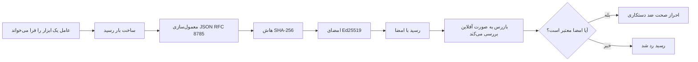
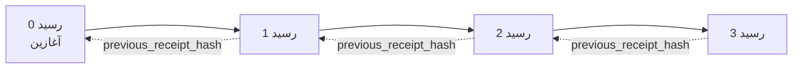

[تماشای ویدیو درس: ایمن‌سازی عوامل هوش مصنوعی با رسیدهای رمزنگاری‌شده](https://youtu.be/PLACEHOLDER_VIDEO_ID)

> _(ویدیو درس و تصویر کوچک توسط تیم محتوای مایکروسافت پس از ادغام اضافه خواهند شد، مطابق الگوی درس ۱۴ / ۱۵.)_

# ایمن‌سازی عوامل هوش مصنوعی با رسیدهای رمزنگاری‌شده

## مقدمه

این درس پوشش می‌دهد:

- چرا ردپاهای حسابرسی برای عوامل هوش مصنوعی برای انطباق، عیب‌یابی و اعتماد اهمیت دارند.
- رسید رمزنگاری شده چیست و چگونه با یک خط لاگ بدون امضاء تفاوت دارد.
- چگونه با پایتون ساده رسید امضاء شده برای فراخوانی ابزار یک عامل تولید کنیم.
- چگونه رسید را به صورت آفلاین تأیید و تغییرات مخرب را تشخیص دهیم.
- چگونه رسیدها را به صورت زنجیره‌ای به هم پیوند دهیم طوری که حذف یا جا‌به‌جایی یکی زنجیره را بشکند.
- رسیدها چه چیزی را اثبات می‌کنند و چه چیزی را صراحتاً اثبات نمی‌کنند.

## اهداف یادگیری

پس از کامل کردن این درس خواهید دانست چگونه:

- حالت‌های شکست را که انگیزه ایجاد سابقه رمزنگاری‌شده برای اقدامات عامل هستند، شناسایی کنید.
- رسید امضاء شده Ed25519 روی یک بارگذاری JSON استاندارد تولید کنید.
- با استفاده از کلید عمومی امضاکننده رسید را به صورت مستقل تأیید کنید.
- تغییرات مخرب را با اجرای مجدد تأیید روی رسید تغییر یافته تشخیص دهید.
- توالی رسیدهای زنجیره‌ای هش را بسازید و توضیح دهید چرا زنجیره مهم است.
- مرز بین آنچه رسیدها اثبات می‌کنند (نسبت دادن، تمامیت، ترتیب) و آنچه اثبات نمی‌کنند (درستی عمل، صحت سیاست) را تشخیص دهید.

## مسئله: ردپای حسابرسی عامل شما

فرض کنید شما یک عامل هوش مصنوعی برای شرکت Contoso Travel مستقر کرده‌اید. این عامل درخواست‌های مشتری را می‌خواند، از API پروازها برای جستجو استفاده می‌کند و به نمایندگی از مشتری صندلی رزرو می‌کند. در سه ماهه گذشته، عامل ۵۰،۰۰۰ رزرو انجام داده است.

امروز یک حسابرس می‌آید و سوال ساده‌ای می‌پرسد: «به من نشان بده عامل شما چه کاری انجام داد.»

شما فایل‌های لاگ را می‌دهید. حسابرس آن‌ها را بررسی می‌کند و سوال سخت‌تری می‌پرسد: «چطور مطمئن شوم این لاگ‌ها ویرایش نشده‌اند؟»

این مشکل ردپای حسابرسی است. اکثر استقرارهای عامل امروز به اینها متکی هستند:

- **لاگ‌های برنامه**: توسط خود عامل نوشته شده، قابل ویرایش توسط هر کسی با دسترسی به سیستم فایل.
- **خدمات ثبت لاگ ابری**: در سطح پلتفرم به تغییر مخرب مقاوم‌اند اما فقط در صورتی که حسابرس به اپراتور پلتفرم اعتماد داشته باشد.
- **لاگ‌های تراکنش پایگاه داده**: برای تغییرات پایگاه داده مناسب‌اند اما برای فراخوانی‌های ابزار دلخواه مناسب نیستند.

هیچ کدام نمی‌توانند بدون اینکه حسابرس به شخص یا نهادی (شما، ارائه‌دهنده ابر، فروشنده پایگاه داده) اعتماد کند، سوال حسابرس را پاسخ دهند. برای استفاده داخلی معمولاً این اعتماد قابل قبول است اما برای بارهای تحت مقررات (مالی، بهداشت و درمان، هر چیزی تحت قانون هوش مصنوعی اتحادیه اروپا) قابل قبول نیست.

رسیدهای رمزنگاری‌شده این مشکل را با امکان تأیید مستقل برای هر عمل عامل حل می‌کنند. حسابرس نیازی به اعتماد به شما ندارد. فقط کلید عمومی شما و خود رسید مورد نیاز است.

## رسید رمزنگاری‌شده چیست؟

رسید یک شیء JSON است که آنچه عامل انجام داده را ثبت می‌کند و با امضای دیجیتال امضاء شده است.



یک رسید حداقلی به این شکل است:

```json
{
  "type": "agent.tool_call.v1",
  "agent_id": "contoso-travel-bot",
  "tool_name": "lookup_flights",
  "tool_args_hash": "sha256:a3f9c1...",
  "result_hash": "sha256:7b2e1d...",
  "policy_id": "contoso-travel-policy-v3",
  "timestamp": "2026-04-25T14:30:00Z",
  "sequence": 47,
  "previous_receipt_hash": "sha256:9d4e6a...",
  "signature": {
    "alg": "EdDSA",
    "sig": "c5af83...",
    "public_key": "8f3b2c..."
  }
}
```

سه ویژگی کار را انجام می‌دهند:

1. **امضا**. رسید توسط دروازه عامل با کلید خصوصی Ed25519 امضاء شده است. هر کسی با کلید عمومی متناظر می‌تواند به صورت آفلاین امضا را تأیید کند. تغییر در هر فیلدی امضا را نامعتبر می‌کند.

2. **رمزنگاری استاندارد**. قبل از امضا، رسید با استفاده از طرح استانداردسازی JSON (JCS، RFC 8785) سریال می‌شود. این تضمین می‌کند که دو پیاده‌سازی که رسید منطقی یکسان تولید می‌کنند، خروجی بایتی مشابه دارند. بدون رمزنگاری استاندارد، سریالایزرهای مختلف JSON امضای متفاوتی برای یک محتوا تولید می‌کنند.

3. **زنجیره‌سازی هش**. فیلد `previous_receipt_hash` هر رسید را به رسید قبلی آن پیوند می‌دهد. حذف یا تغییر ترتیب یک رسید، هر رسید بعدی را می‌شکند. تغییر مخرب حتی در سطح زنجیره قابل مشاهده است حتی اگر امضاهای فردی دور زده شوند.

این ویژگی‌ها به‌طور مشترک سه تضمین ارائه می‌دهند:

- **نسبت دادن**: این کلید این محتوا را امضاء کرده است.
- **تمامیت**: محتوا از زمان امضا تغییر نکرده است.
- **ترتیب**: این رسید بعد از آن رسید در زنجیره آمده است.

## تولید رسید در پایتون

برای تولید رسید نیازی به کتابخانه خاص ندارید. اجزای رمزنگاری به طور گسترده در دسترس‌اند و منطق چند ده خط پایتون است.

تمرین‌های عملی در `code_samples/18-signed-receipts.ipynb` روند کامل را طی می‌کنند. نسخه خلاصه:

```python
import json
import hashlib
import base64
from nacl import signing
from jcs import canonicalize  # JSON رسمی RFC 8785

def b64url_nopad(data: bytes) -> str:
    return base64.urlsafe_b64encode(data).decode("ascii").rstrip("=")

def sha256_canonical(obj) -> str:
    """SHA-256 of a Python object's JCS-canonical JSON form."""
    return f"sha256:{hashlib.sha256(canonicalize(obj)).hexdigest()}"

# تولید یا بارگذاری کلید امضا (در تولید، در یک گاوصندوق کلید ذخیره کنید)
signing_key = signing.SigningKey.generate()
verify_key = signing_key.verify_key

# ساخت بارنامه رسید (هنوز امضا نشده)
tool_args = {"origin": "SYD", "destination": "LAX"}
tool_result = [{"flight": "QF11", "price": 1850, "stops": 0}]

payload = {
    "type": "agent.tool_call.v1",
    "agent_id": "contoso-travel-bot",
    "tool_name": "lookup_flights",
    "tool_args_hash": sha256_canonical(tool_args),
    "result_hash": sha256_canonical(tool_result),
    "policy_id": "contoso-travel-policy-v3",
    "timestamp": "2026-04-25T14:30:00Z",
    "sequence": 0,
    "previous_receipt_hash": None,
}

# رسمی‌سازی، هش، امضا.
canonical_bytes = canonicalize(payload)
message_hash = hashlib.sha256(canonical_bytes).digest()
signature_bytes = signing_key.sign(message_hash).signature

# اضافه کردن یک شیء امضای ساختاریافته.
receipt = {
    **payload,
    "signature": {
        "alg": "EdDSA",
        "sig": b64url_nopad(signature_bytes),
        "public_key": b64url_nopad(bytes(verify_key)),
    },
}
```

این کل خط لوله امضا است. تمرین‌ها در دفترچه یادداشت هر مرحله را توضیح می‌دهند.

## تأیید رسید و تشخیص تغییرات مخرب

تأیید معکوس عملیات امضا است:

```python
import base64
import hashlib
from nacl import signing
from nacl.exceptions import BadSignatureError
from jcs import canonicalize

def b64url_decode(s: str) -> bytes:
    padding = "=" * ((4 - len(s) % 4) % 4)
    return base64.urlsafe_b64decode(s + padding)

def verify_receipt(receipt: dict) -> bool:
    # امضا یک شیء ساختاریافته است: {"alg"، "sig"، "public_key"}.
    sig_obj = receipt.get("signature")
    if not sig_obj or sig_obj.get("alg") != "EdDSA":
        return False

    # بازسازی بار داده‌ای که در واقع امضا شده است (همه چیز به جز امضا).
    payload = {k: v for k, v in receipt.items() if k != "signature"}

    canonical_bytes = canonicalize(payload)
    message_hash = hashlib.sha256(canonical_bytes).digest()

    try:
        verify_key = signing.VerifyKey(b64url_decode(sig_obj["public_key"]))
        verify_key.verify(message_hash, b64url_decode(sig_obj["sig"]))
        return True
    except BadSignatureError:
        return False
```

این تابع یک رسید می‌گیرد و در صورت معتبر بودن امضا `True` و در غیر این صورت `False` باز می‌گرداند. هیچ تماس شبکه‌ای، وابستگی به سرویس یا نیاز به اعتماد به هیچ شخص ثالثی وجود ندارد.

برای دیدن تشخیص دستکاری، دفترچه یادداشت مراحل زیر را طی می‌کند:

1. تولید یک رسید معتبر و تأیید صحت آن.
2. تغییر یک بایت از فیلد `tool_args_hash`.
3. اجرای مجدد تأیید و مشاهده شکست آن.

این نمایش عملی اثبات می‌کند رسیدها قابل تغییر مخرب نیستند: هر تغییر، هرچقدر کوچک، امضا را می‌شکند.

## زنجیره‌سازی رسیدها برای عوامل چندمرحله‌ای

یک رسید امضاء شده یک عمل را محافظت می‌کند. زنجیره رسیدها یک توالی از اعمال را محافظت می‌کند.



هر رسید هش رسید قبلی را ثبت می‌کند. برای حذف بی‌صدا رسید ۲، مهاجم باید یا:

- فیلد `previous_receipt_hash` رسید ۳ را تغییر دهد (امضای رسید ۳ را می‌شکند)، یا
- امضای جدیدی روی رسید ۳ تغییر یافته جعل کند (نیاز به کلید خصوصی عامل دارد).

اگر کلید خصوصی در گنجه سخت‌افزاری باشد و کلید عمومی را همراه هر رسید منتشر کرده باشید، هیچ کدام از این حملات بدون شناسایی عملی نیستند.

دفترچه یادداشت موارد زیر را طی می‌کند:

1. ساخت زنجیره‌ای از سه رسید.
2. تأیید اینکه هر `previous_receipt_hash` با هش واقعی رسید قبلی مطابقت دارد.
3. دستکاری یک رسید در وسط و دیدن شکستن زنجیره درست در همان نقطه.

این روش تولید ردپای حسابرسی است که یک حسابرس خارجی بدون نیاز به اعتماد به شما می‌تواند تأیید کند.

## رسیدها چه چیزی را اثبات می‌کنند (و چه چیزی را اثبات نمی‌کنند)

این مهم‌ترین بخش این درس است. رسیدها قدرتمندند اما قدرتشان محدود است.

**رسیدها سه چیز را اثبات می‌کنند:**

1. **نسبت دادن**: یک کلید خاص بارگذاری خاصی را امضا کرده است.
2. **تمامیت**: بارگذاری از زمان امضا تغییر نکرده است.
3. **ترتیب**: این رسید بعد از آن رسید در زنجیره هش آمده است.

**رسیدها اثبات نمی‌کنند:**

1. **درستی**: اینکه اقدام عامل اقدام درست بوده است. یک رسید می‌تواند برای پاسخ نادرست به همان پاکیزگی پاسخ درست امضا شود.
2. **انطباق با سیاست**: اینکه سیاست ذکر شده در `policy_id` واقعاً ارزیابی شده یا اینکه اگر بررسی می‌شد این اقدام را اجازه می‌داد. رسید آنچه ادعا شده را ثبت می‌کند نه آنچه اعمال شده.
3. **هویت فراتر از کلید**: رسید می‌گوید «این کلید این محتوا را امضا کرده.» نمی‌گوید «این انسان این موضوع را مجاز دانسته.» اتصال یک کلید به یک شخص یا سازمان به زیرساخت هویت جداگانه نیاز دارد (دایرکتوری، رجیستری کلید عمومی و غیره).
4. **صدق ورودی‌ها**: اگر عامل یک درخواست دستکاری‌شده دریافت کند و بر اساس آن عمل کند، رسید آن عمل را به درستی ثبت می‌کند. رسیدها پس از اعتبارسنجی ورودی‌ها هستند و جایگزین آن نیستند.

این مرز برای دو دلیل اهمیت دارد:

- می‌گوید رسیدها برای چه مفیدند: قابل حسابرسی و مقاوم در برابر دستکاری کردن رفتار عامل، حتی در مرزهای سازمانی.
- می‌گوید چه لایه‌های اضافی هنوز لازم است: اعتبارسنجی ورودی (درس ۶)، اجرای سیاست (کمی پایین‌تر پوشش داده شده)، و زیرساخت هویت (خارج از دامنه این درس).

اشتباه رایج این است که فرض کنیم «رسید داریم» یعنی «حکمرانی داریم.» اینطور نیست. رسید پایه است. حکمرانی سیستمی است که روی آن می‌سازید.

## مراجع تولید

کد پایتون این درس به عمد حداقلی است تا بتوانید هر خط را بخوانید و دقیقاً بفهمید چه اتفاقی می‌افتد. در تولید دو انتخاب دارید:

1. **مستقیماً روی اجزای رمزنگاری بسازید.** ۵۰ خطی که دیدید برای بسیاری از موارد کافی است. PyNaCl (Ed25519) و بسته `jcs` (JSON استاندارد) کتابخانه‌هایی خوب نگهداری شده و بررسی‌شده‌اند.

2. **از کتابخانه رسید تولیدی استفاده کنید.** چند پروژه متن‌باز همان الگو را با امکانات اضافی (چرخش کلید، تأیید دسته‌ای، توزیع دسته کلید JWK، ادغام با موتورهای سیاست) پیاده‌سازی کرده‌اند:
   - فرمت رسید استفاده‌شده در این درس طبق یک پیش‌نویس اینترنتی IETF (`draft-farley-acta-signed-receipts`) است که در فرایند استانداردسازی قرار دارد.
   - مجموعه ابزار حاکمیت عامل مایکروسافت (Microsoft Agent Governance Toolkit) رسیدها را با تصمیمات سیاست مبتنی بر Cedar ترکیب می‌کند؛ آموزش ۳۳ در آن مخزن مثال انتها به انتها دارد.
   - بسته‌های `protect-mcp` (npm) و `@veritasacta/verify` (npm) پیاده‌سازی مبتنی بر Node برای امضا و تأیید آفلاین رسید را ارائه می‌دهند، برای پوشش هر سرور MCP با ردپای مقاوم در برابر دستکاری.
   - SDK پایتون **[nobulex](https://github.com/arian-gogani/nobulex)** (`pip install nobulex`) همان الگوی امضای Ed25519 + JCS را با ادغام‌های LangChain و CrewAI ارائه می‌دهد، شامل بردارهای آزمون اعتبار متقاطع منتشر شده و نگاشت انطباق ارائه شده از طریق [OWASP PR #2210](https://github.com/OWASP/CheatSheetSeries/pull/2210).

تصمیم بین نوشتن خودتان یا استفاده از کتابخانه مانند انتخاب بین نوشتن کتابخانه JWT خودتان یا استفاده از کتابخانه تست‌شده است: هر دو معقول‌اند؛ کتابخانه زمان می‌خرد و سطح حسابرسی را کاهش می‌دهد؛ روش از صفر تا صد شما را مجبور به فهم تمام اجزا می‌کند. این درس روش از صفر تا صد را آموزش می‌دهد تا مبنای هر دو انتخاب را داشته باشید.

## بررسی دانش

قبل از رفتن به تمرین، دانش خود را آزمایش کنید.

**۱. رسید با کلید خصوصی Ed25519 عامل امضا شده است. حسابرس فقط کلید عمومی را دارد. آیا حسابرس می‌تواند رسید را به صورت آفلاین تأیید کند؟**

<details>
<summary>پاسخ</summary>

بله. تأیید Ed25519 فقط به کلید عمومی و بایت‌های امضا شده نیاز دارد. هیچ تماس شبکه‌ای یا وابستگی به سرویس نیست. این ویژگی باعث می‌شود رسیدها در محیط‌های ایزوله، چند سازمانی یا حسابرسی کم‌اعتماد مفید باشند.
</details>

**۲. مهاجم فیلد `policy_id` یک رسید را تغییر می‌دهد تا ادعا کند زیر سیاستی با مجوز بیشتر بوده است. امضا روی بارگذاری اصلی است. در تأیید چه اتفاقی می‌افتد؟**

<details>
<summary>پاسخ</summary>

تأیید ناموفق است. امضا روی بایت‌های استانداردشده بارگذاری اصلی محاسبه شده؛ تغییر هر فیلد بایت‌های استاندارد را تغییر داده، هش SHA-256 را عوض می‌کند و امضا را نامعتبر می‌کند. برای تولید امضای معتبر جدید به کلید خصوصی نیاز است که مهاجم ندارد.
</details>

**۳. چرا رسید به جای آرگومان‌ها و نتیجه خام، `tool_args_hash` و `result_hash` را شامل می‌شود؟**

<details>
<summary>پاسخ</summary>

دو دلیل: اول، ممکن است رسید نیاز به بایگانی یا انتقال در محیط‌هایی داشته باشد که افشای محتوا (اطلاعات شخصی، داده‌های تجاری) مشکل است. هش کردن باعث کوچک ماندن رسید و حفظ محرمانگی محتوا می‌شود؛ حسابرس تأیید می‌کند که هش با نسخه جداگانه محتوا مطابقت دارد. دوم، هش‌ها اندازه ثابتی دارند؛ رسید با هش محدود به اندازه معین است، فارغ از بزرگ بودن ورودی‌ها و خروجی‌ها.
</details>

**۴. فیلد `previous_receipt_hash` هر رسید را به پیشینی آن پیوند می‌دهد. اگر مهاجم یک رسید وسط زنجیره را بی‌صدا حذف کند، چه چیزی نامعتبر می‌شود؟**

<details>
<summary>پاسخ</summary>

هر رسید بعد از رسید حذف شده. فیلدهای `previous_receipt_hash` آن‌ها دیگر با زنجیره واقعی مطابقت ندارد (چون رسید مرجع دیگر وجود ندارد یا زنجیره حالا به پیشینی دیگری اشاره می‌کند). برای پنهان کردن حذف، مهاجم باید تمام رسیدهای بعدی را دوباره امضا کند که نیازمند کلید خصوصی است.
</details>

**۵. رسید به‌درستی تأیید می‌شود. آیا این اثبات می‌کند که عمل عامل درست، منطقی یا منطبق بر سیاست بوده است؟**

<details>
<summary>پاسخ</summary>

خیر. یک رسید معتبر سه چیز را اثبات می‌کند: نسبت دادن (این کلید این محتوا را امضا کرده)، تمامیت (محتوا تغییر نکرده)، و ترتیب (این رسید بعد از آن رسید آمده). اثبات نمی‌کند که عمل درست بوده، سیاست ذکر شده واقعاً بررسی شده یا عامل همه قوانین را رعایت کرده باشد. رسیدها رفتار عامل را قابل حسابرسی می‌کنند، نه لزوماً درست. این مهم‌ترین مرز در درس است.
</details>

## تمرین عملی

دفترچه یادداشت `code_samples/18-signed-receipts.ipynb` را باز کنید و چهار بخش را کامل کنید:

1. **بخش ۱**: اولین رسید خود را امضا و تأیید کنید.
2. **بخش ۲**: با رسید دستکاری کنید و شکست تأیید را مشاهده کنید.
3. **بخش ۳**: زنجیره‌ای از سه رسید بسازید و تمامیت زنجیره را تأیید کنید.
4. **بخش ۴**: الگو را روی عاملی که با چارچوب عامل مایکروسافت ساخته شده اعمال کنید: یک فراخوانی ابزار را با امضای رسید بپوشانید و سپس رسید را به صورت مستقل تأیید کنید.
**چالش کششی ۱:** طرح رسید را با یک فیلد اضافی که خودتان انتخاب می‌کنید (مثلاً یک شناسه درخواست برای ردیابی) گسترش دهید، منطق امضای کاننیکال را برای شامل کردن آن به‌روزرسانی کنید، و تأیید کنید که رسید هنوز به درستی می‌تواند از طریق تأیید عبور کند. سپس پس از امضا، فیلد را تغییر دهید و تأیید را ناموفق کنید. این شما را مجبور می‌کند بفهمید هر بایت از کدگذاری کاننیکال چگونه به امضا کمک می‌کند.

**چالش کششی ۲:** دو تا از رسیدهای خود را با هم هَش SHA-256 کنید (بایت‌های کاننیکال‌شده‌شان را به ترتیب مشخص به هم بچسبانید) و حاصل را به عنوان یک فیلد جدید بر روی رسید سوم قرار دهید قبل از آن که آن را امضا کنید. تأیید کنید که همه سه رسید به درستی عبور می‌کنند. شما همین حالا یک اثبات شمول یک مرحله‌ای ساخته‌اید: هرکس رسید سوم را داشته باشد می‌تواند اثبات کند رسید اول و دوم در زمان امضای آن وجود داشتند، بدون نیاز به افشای محتوایشان. این الگوی رسیدهای افشای انتخابی است که در مقیاس استفاده می‌شود (تعهدهای مرکل، RFC 6962).

## نتیجه‌گیری

رسیدهای رمزنگاری‌شده به عامل‌های هوش مصنوعی یک مسیر حسابرسی می‌دهند که:

- **قابل تأیید مستقل است:** هر شخصی که کلید عمومی را داشته باشد می‌تواند تأیید کند، بدون وابستگی به هیچ سرویس.
- **قابل تشخیص تغییر است:** هر تغییری، امضا را نامعتبر می‌کند.
- **قابل حمل است:** رسید یک فایل کوچک JSON است؛ می‌توان آن را آرشیو، منتقل و در هر جا تأیید کرد.
- **مطابق استانداردها است:** بر پایه Ed25519 (RFC 8032)، JCS (RFC 8785)، و SHA-256 ساخته شده که همه از اجزای پرکاربرد هستند.

آنها جایگزین اعتبارسنجی ورودی، اعمال سیاست‌ها یا زیرساخت هویت نیستند. آنها پایه‌ای برای آن لایه‌ها هستند. زمانی که عامل‌ها را در محیط‌های تنظیم‌شده، گردش کارهای چندسازمانی یا هر موقعیتی که نمی‌توان انتظار داشت حسابرس آینده به شما اعتماد کند به کار می‌برید، رسیدها نحوه درست کردن مسیر حسابرسی صادقانه هستند.

مهم‌ترین نکته: رسیدها ثابت می‌کنند چه کسی چه چیزی گفته و کی گفته است. آنها اثبات نمی‌کنند آنچه گفته شده، درست یا صحیح بوده است. این تمایز را محکم نگه دارید. این تفاوت بین یک سیستم اصیل منشأ و یک سیستم گمراه‌کننده است.

## چک‌لیست تولید

زمانی که آماده هستید از این درس فراتر بروید و عامل‌های دارای امضای رسید را در محیط واقعی مستقر کنید:

- [ ] **کلید امضا را از لپ‌تاپ توسعه‌دهنده خارج کنید.** از Azure Key Vault، AWS KMS، یا ماژول امنیت سخت‌افزاری استفاده کنید. کلید خصوصی که رسیدهای شما را امضا می‌کند نباید هرگز در کنترل کد منبع یا به شکل متن ساده روی ماشین‌های کاربردی باشد.
- [ ] **کلید عمومی تأییدیه را منتشر کنید.** حسابرسان برای تأیید آفلاین به آن نیاز دارند. الگوی استاندارد یک مجموعه کلید JWK در یک URL شناخته‌شده است (RFC 7517)، مثلاً `https://your-org.example.com/.well-known/agent-keys.json`.
- [ ] **زنجیره را به صورت خارجی مهر کنید.** به صورت دوره‌ای هش سردسته زنجیره را در یک لاگ شفافیت (Sigstore Rekor، مرجع زمان‌بندی RFC 3161، یا یک سیستم داخلی دوم) بنویسید تا یک طرف بیرونی بتواند تأیید کند «این زنجیره در این زمان وجود داشت.»
- [ ] **رسیدها را به صورت غیر قابل تغییر ذخیره کنید.** ذخیره‌سازی فقط افزودنی (مانند Azure Storage با سیاست‌های عدم تغییر، AWS S3 Object Lock) از دستکاری تاریخچه توسط افراد داخلی در لایه ذخیره‌سازی جلوگیری می‌کند.
- [ ] **تصمیم به حفظ نگهداری بگیرید.** بسیاری از چارچوب‌های انطباق نیاز به نگهداری چندساله دارند. برای رشد رسید برنامه‌ریزی کنید (هر رسید حدود ۵۰۰ بایت است؛ یک عامل با ۱۰ هزار تماس در روز حدود ۱.۸ گیگابایت در سال تولید می‌کند).
- [ ] **مستندسازی کنید چه چیزهایی توسط رسید پوشش داده نمی‌شود.** رسیدها اصالت، یکپارچگی، و ترتیب را ثابت می‌کنند. راهنمای عملیاتی شما باید صریحاً فهرست کند چه کنترل‌های اضافی (اعتبارسنجی ورودی، اعمال سیاست، محدودیت نرخ، زیرساخت هویت) در کنار رسیدها در پستور حاکمیتی شما قرار دارند.

### سوالات بیشتر درباره امن‌سازی عامل‌های هوش مصنوعی دارید؟

به [مایکروسافت فاندری دیسکورد](https://aka.ms/ai-agents/discord) بپیوندید تا با دیگر یادگیرندگان ملاقات کنید، در ساعت‌های کاری شرکت کنید و سوالات هوش مصنوعی خود را بپرسید.

## فراتر از این درس

این درس شامل امضای با یک رسید و دنباله‌های هش زنجیره‌ای است. همان اجزا در چند الگوی پیشرفته دیگر ترکیب می‌شوند که ممکن است با رشد پستور حاکمیتی شما با آنها روبرو شوید:

- **افشای انتخابی.** وقتی فیلدهای رسید به طور مستقل تعهد می‌شوند (درخت مرکل سبک RFC 6962)، می‌توانید فیلدهای مشخصی را به حسابرسان مشخص نشان دهید و اثبات کنید بقیه بدون تغییر مانده‌اند بدون اینکه آنها را افشا کنید. مفید هنگامیکه همان رسید باید هم حسابرسی جامع (که به کامل بودن نیاز دارد) و هم مقررات کاهش داده مانند GDPR (که می‌خواهند حسابرس حداقل داده ممکن ببیند) را پاسخ دهد.
- **ابطال رسیدها.** اگر کلید امضا درز پیدا کند، راهی لازم است تا همه رسیدهای امضا شده با آن کلید را از یک زمان مشخص به بعد غیرقابل اعتماد اعلام کنید. الگوهای استاندارد: کلیدهای امضای کوتاه‌مدت به همراه فهرست ابطال منتشر شده، یا لاگ شفافیت با ورودی‌های ابطال.
- **رسیدهای امضای دوطرفه/تقسیم‌شده.** برخی پیاده‌سازی‌ها بار امضا شده را به دو نیمه پیش‌اجرا (`authorization_*`) و پس‌اجرا (`result_*`) با امضاهای مستقل تقسیم می‌کنند، که زمانی که تصمیم مجوز و نتیجه مشاهده شده توسط افراد یا در زمان‌های مختلف تولید می‌شوند مفید است. این افزایشی بر روی فرمت رسیدی است که در این درس آموزش داده شده است.
- **ترکیب بار.** رسید هر بایتی که در `result_hash` قرار دهید مهر و موم می‌کند. بارهای دنیای واقعی اغلب از نتیجه یک فراخوان ابزار ساده غنی‌ترند: دلیل‌سازی پیش‌تصمیم (پیش‌بینی مدل، گزینه‌های در نظر گرفته شده، شواهد و جامعیت آن، وضعیت ریسک، زنجیره حسابرسی، نتیجه دروازه) همه می‌توانند داخل بار باشند، مهر و موم شده با یک رسید واحد. این فرمت رسید را حداقلی نگه می‌دارد در حالی که اجازه می‌دهد طرح‌های بار حوزه به حوزه توسعه یابند.
- **انطباق میان پیاده‌سازی‌ها.** چند پیاده‌سازی مستقل از یک فرمت رسید (پایتون، تایپ‌اسکریپت، راست، گو) نسبت به بردارهای آزمایشی مشترک تأیید متقابل انجام می‌دهند. اگر پیاده‌سازی خود را ساختید، اعتبارسنجی با بردارهای منتشر شده سازگاری را تأیید می‌کند.
- **مهاجرت پساکوانتومی.** Ed25519 امروز به طور گسترده استفاده می‌شود اما مقاوم در برابر کوانتوم نیست. فرمت رسید الگوریتم-چابک است: فیلد `signature.alg` می‌تواند `ML-DSA-65` (استاندارد امضای پساکوانتومی NIST) را در مواقع مهاجرت در خود نگه دارد. برای دوره انتقالی که رسیدها دوگانه امضا می‌شوند برنامه‌ریزی کنید.

## منابع اضافی

- <a href="https://datatracker.ietf.org/doc/draft-farley-acta-signed-receipts/" target="_blank">پیش‌نویس اینترنتی IETF: رسیدهای تصمیم امضا شده برای کنترل دسترسی ماشین به ماشین</a>
- <a href="https://learn.microsoft.com/azure/ai-studio/responsible-use-of-ai-overview" target="_blank">بررسی استفاده مسئولانه از هوش مصنوعی (Azure AI)</a>
- <a href="https://datatracker.ietf.org/doc/html/rfc8032" target="_blank">RFC 8032: الگوریتم امضای دیجیتال منحنی ادواردز (EdDSA)</a>
- <a href="https://datatracker.ietf.org/doc/html/rfc8785" target="_blank">RFC 8785: طرح استانداردسازی JSON (JCS)</a>
- <a href="https://datatracker.ietf.org/doc/html/rfc6962" target="_blank">RFC 6962: شفافیت گواهی‌نامه</a> (ساخت درخت مرکل استفاده شده در رسیدهای افشای انتخابی)
- <a href="https://github.com/microsoft/agent-governance-toolkit/blob/main/docs/tutorials/33-offline-verifiable-receipts.md" target="_blank">ابزار حاکمیت عامل مایکروسافت، آموزش ۳۳: رسیدهای تصمیم قابل تأیید آفلاین</a>
- <a href="https://github.com/ScopeBlind/agent-governance-testvectors" target="_blank">بردارهای آزمایشی انطباق میان پیاده‌سازی‌ها</a> برای فرمت رسید استفاده شده در این درس (مجوز Apache-2.0)
- <a href="https://pynacl.readthedocs.io/" target="_blank">مستندات PyNaCl</a> (Ed25519 در پایتون)

## درس قبلی

[ساخت عامل‌های استفاده کامپیوتر (CUA)](../15-browser-use/README.md)

## درس بعدی

_(توسط نگهدارندگان برنامه درسی تعیین می‌شود)_

---

<!-- CO-OP TRANSLATOR DISCLAIMER START -->
**سلب مسئولیت**:
این سند با استفاده از سرویس ترجمه هوش مصنوعی [Co-op Translator](https://github.com/Azure/co-op-translator) ترجمه شده است. در حالی که ما در تلاش برای دقت هستیم، لطفاً توجه داشته باشید که ترجمه‌های خودکار ممکن است شامل خطاها یا نادرستی‌هایی باشند. سند اصلی به زبان مادری خود باید به عنوان منبع معتبر در نظر گرفته شود. برای اطلاعات حیاتی، ترجمه حرفه‌ای انسانی توصیه می‌شود. ما در قبال هرگونه سوء تفاهم یا برداشت نادرست ناشی از استفاده از این ترجمه مسئولیتی نداریم.
<!-- CO-OP TRANSLATOR DISCLAIMER END -->