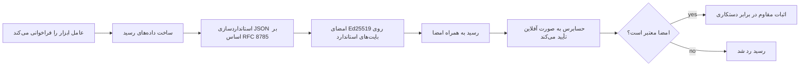
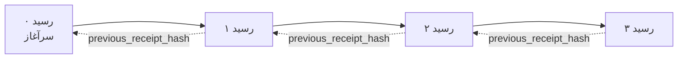

[تماشای ویدیوی درس: ایمن‌سازی عوامل هوش مصنوعی با رسیدهای رمزنگاری‌شده](https://youtu.be/PLACEHOLDER_VIDEO_ID)

> _(ویدیوی درس و تصویر بندانگشتی توسط تیم محتوای مایکروسافت پس از ادغام افزوده خواهند شد، مطابق الگوی درس ۱۴ / ۱۵.)_

# ایمن‌سازی عوامل هوش مصنوعی با رسیدهای رمزنگاری‌شده

## مقدمه

این درس موارد زیر را پوشش خواهد داد:

- چرا ردپای حسابرسی برای عوامل هوش مصنوعی در تطابق، اشکال‌زدایی و اعتماد اهمیت دارد.
- رسید رمزنگاری‌شده چیست و چگونه با یک خط لاگ بدون امضا متفاوت است.
- چگونه یک رسید امضا شده برای فراخوانی ابزار یک عامل را به زبان ساده در پایتون تولید کنیم.
- چگونه رسید را به صورت آفلاین تأیید کنیم و دستکاری را تشخیص دهیم.
- چگونه رسیدها را به هم زنجیر کنیم تا حذف یا تغییر ترتیب یکی، زنجیره را بشکند.
- چه مواردی توسط رسیدها اثبات می‌شود و چه مواردی به‌طور صریح اثبات نمی‌شود.

## اهداف یادگیری

پس از اتمام این درس، شما خواهید دانست چگونه:

- حالت‌های شکست را که موجب ضرورت تعیین منشأ رمزنگاری‌شده برای اقدامات عامل می‌شوند، شناسایی کنید.
- یک رسید امضا شده با Ed25519 بر روی بارگذاری JSON استاندارد تولید کنید.
- به‌صورت مستقل با استفاده از کلید عمومی امضا کننده رسید را تأیید کنید.
- دستکاری را با اجرای مجدد تأیید بر روی رسید تغییر یافته تشخیص دهید.
- یک زنجیره هش‌شده از رسیدها بسازید و توضیح دهید چرا زنجیره اهمیت دارد.
- مرز بین آنچه رسیدها اثبات می‌کنند (نسبت‌دهی، صحت، ترتیب) و آنچه اثبات نمی‌کنند (درستی عمل، صحت سیاست) را تشخیص دهید.

## مشکل: ردپای حسابرسی عامل شما

تصور کنید یک عامل هوش مصنوعی برای Contoso Travel مستقر کرده‌اید. این عامل درخواست‌های مشتری را می‌خواند، با API پروازها تماس می‌گیرد تا گزینه‌ها را جستجو کند و به نمایندگی از مشتری صندلی‌ها را رزرو می‌کند. در سه ماهه گذشته، عامل ۵۰,۰۰۰ رزرو انجام داده است.

امروز یک حسابرس می‌آید. او یک سؤال ساده می‌پرسد: «به من نشان بده عامل شما چه کرده است.»

شما فایل‌های لاگ خود را تحویل می‌دهید. حسابرس آنها را نگاه می‌کند و سؤال سخت‌تری می‌پرسد: «چطور بدانم این لاگ‌ها ویرایش نشده‌اند؟»

این مشکل ردپای حسابرسی است. بیشتر استقرارهای عامل امروز به موارد زیر متکی‌اند:

- **لاگ‌های برنامه**: که توسط خود عامل نوشته شده و توسط هر کسی که به فایل سیستم دسترسی دارد، قابل ویرایش است.
- **خدمات لاگ‌گیری ابری**: در سطح پلتفرم تغییرناپذیر هستند اما فقط اگر حسابرس به اپراتور پلتفرم اعتماد داشته باشد.
- **لاگ‌های تراکنش پایگاه داده**: برای تغییرات پایگاه داده مناسب‌اند اما برای فراخوان‌های دلخواه ابزار مناسب نیستند.

هیچ‌کدام از این موارد نمی‌توانند سؤال حسابرس را بدون نیاز به اعتماد حسابرس به کسی (شما، ارائه‌دهنده ابر شما، فروشنده پایگاه داده شما) پاسخ دهند. برای استفاده داخلی آن اعتماد معمولاً قابل قبول است. برای بارهای کاری تنظیم‌شده (مالی، پزشکی، هر چیزی که تحت قانون هوش مصنوعی اتحادیه اروپا باشد)، قابل قبول نیست.

رسیدهای رمزنگاری این مشکل را با قابل تأیید کردن مستقل هر اقدام عامل حل می‌کنند. حسابرس نیازی به اعتماد به شما ندارد. تنها کلید عمومی شما و خود رسید لازم است.

## رسید رمزنگاری‌شده چیست؟

یک رسید یک شیء JSON است که آنچه عامل انجام داده را ثبت می‌کند و با امضای دیجیتال امضا شده است.


```mermaid
flowchart LR
    A[عامل ابزار را فراخوانی می‌کند] --> B[ساخت داده‌های رسید]
    B --> C[استانداردسازی JSON بر اساس RFC 8785]
    C --> E[امضای Ed25519 روی بایت‌های استاندارد]
    E --> F[رسید به همراه امضا]
    F --> G[حسابرس به صورت آفلاین تأیید می‌کند]
    G --> H{امضا معتبر است؟}
    H -- yes --> I[اثبات مقاوم در برابر دستکاری]
    H -- no --> J[رسید رد شد]
```

یک رسید حداقلی به این شکل است:

```json
{
  "type": "agent.tool_call.v1",
  "agent_id": "contoso-travel-bot",
  "tool_name": "lookup_flights",
  "tool_args_hash": "sha256:a3f9c1...",
  "result_hash": "sha256:7b2e1d...",
  "policy_id": "contoso-travel-policy-v3",
  "timestamp": "2026-04-25T14:30:00Z",
  "sequence": 47,
  "previous_receipt_hash": "sha256:9d4e6a...",
  "signature": {
    "alg": "EdDSA",
    "sig": "c5af83...",
    "public_key": "8f3b2c..."
  }
}
```

سه ویژگی این کار را انجام می‌دهند:

۱. **امضا**. رسید توسط دروازه عامل با استفاده از کلید خصوصی Ed25519 امضا می‌شود. هر کسی که کلید عمومی متناظر را داشته باشد می‌تواند امضا را آفلاین تأیید کند. هر دستکاری در هر فیلدی امضا را نامعتبر می‌کند.

۲. **رمزگذاری استاندارد**. پیش از امضا، رسید با استفاده از روش استاندارد JSON Canonicalization Scheme (JCS، RFC 8785) سریال می‌شود. این اطمینان می‌دهد که دو پیاده‌سازی که همان رسید منطقی را تولید می‌کنند، دقیقاً خروجی بایتی یکسان دارند. بدون رمزگذاری استاندارد، سریال‌سازهای مختلف JSON امضای متفاوتی برای همان محتوا تولید می‌کردند.

۳. **زنجیره هش**. فیلد `previous_receipt_hash` هر رسید را به رسید قبلی پیوند می‌دهد. حذف یا تغییر ترتیب یک رسید همه رسیدهای بعد از آن را می‌شکند. دستکاری حتی اگر امضاهای تکی دور زده شوند، در سطح زنجیره دیده می‌شود.

این ویژگی‌ها با هم سه ضمانت فراهم می‌کنند:

- **نسبت‌دهی**: این کلید این محتوا را امضا کرده است.
- **درستی**: محتوا از زمان امضا تغییر نکرده است.
- **ترتیب**: این رسید بعد از آن رسید در زنجیره آمده است.

## تولید رسید در پایتون

برای تولید رسید نیازی به کتابخانه خاصی ندارید. ابتداییات رمزنگاری در دسترس گسترده است و منطق آن چند ده خط پایتون است.

تمرین‌های عملی در `code_samples/18-signed-receipts.ipynb` کل روند را قدم به قدم نشان می‌دهند. نسخه خلاصه:

```python
import json
import hashlib
import base64
from nacl import signing
from jcs import canonicalize  # JSON استاندارد RFC 8785

def b64url_nopad(data: bytes) -> str:
    return base64.urlsafe_b64encode(data).decode("ascii").rstrip("=")

def sha256_canonical(obj) -> str:
    """SHA-256 of a Python object's JCS-canonical JSON form."""
    return f"sha256:{hashlib.sha256(canonicalize(obj)).hexdigest()}"

# تولید یا بارگذاری کلید امضا (در محیط تولید، در یک مخزن کلید ذخیره شود)
signing_key = signing.SigningKey.generate()
verify_key = signing_key.verify_key

# ساختار بار رسید را بسازید (هنوز امضا نشده است)
tool_args = {"origin": "SYD", "destination": "LAX"}
tool_result = [{"flight": "QF11", "price": 1850, "stops": 0}]

payload = {
    "type": "agent.tool_call.v1",
    "agent_id": "contoso-travel-bot",
    "tool_name": "lookup_flights",
    "tool_args_hash": sha256_canonical(tool_args),
    "result_hash": sha256_canonical(tool_result),
    "policy_id": "contoso-travel-policy-v3",
    "timestamp": "2026-04-25T14:30:00Z",
    "sequence": 0,
    "previous_receipt_hash": None,
}

# تبدیل به قالب استاندارد و امضای مستقیم بایت‌های JCS. PureEdDSA به صورت داخلی هش می‌کند.
canonical_bytes = canonicalize(payload)
signature_bytes = signing_key.sign(canonical_bytes).signature

# پیوست یک شیء امضای ساختاریافته.
receipt = {
    **payload,
    "signature": {
        "alg": "EdDSA",
        "sig": b64url_nopad(signature_bytes),
        "public_key": b64url_nopad(bytes(verify_key)),
    },
}
```

این کل خط لوله امضا است. تمرین‌ها در دفترچه آموزش هر مرحله را توضیح می‌دهند.

## تأیید رسید و تشخیص دستکاری

تأیید عملیات معکوس است:

```python
import base64
import hashlib
from nacl import signing
from nacl.exceptions import BadSignatureError
from jcs import canonicalize

def b64url_decode(s: str) -> bytes:
    padding = "=" * ((4 - len(s) % 4) % 4)
    return base64.urlsafe_b64decode(s + padding)

def verify_receipt(receipt: dict) -> bool:
    # امضا یک شیء ساختاریافته است: {"alg"، "sig"، "public_key"}.
    sig_obj = receipt.get("signature")
    if not sig_obj or sig_obj.get("alg") != "EdDSA":
        return False

    # بازسازی محموله‌ای که در واقع امضا شده بود (همه چیز به جز امضا).
    payload = {k: v for k, v in receipt.items() if k != "signature"}

    canonical_bytes = canonicalize(payload)

    try:
        verify_key = signing.VerifyKey(b64url_decode(sig_obj["public_key"]))
        verify_key.verify(canonical_bytes, b64url_decode(sig_obj["sig"]))
        return True
    except BadSignatureError:
        return False
```

این تابع یک رسید را می‌گیرد و اگر امضا معتبر بود `True` برمی‌گرداند وگرنه `False`. هیچ تماس شبکه‌ای، وابستگی به سرویس یا اعتماد به هیچ شخص ثالثی لازم نیست.

برای مشاهده تشخیص دستکاری در عمل، دفترچه آموزش موارد زیر را توضیح می‌دهد:

۱. تولید یک رسید معتبر و تأیید آن.
۲. تغییر یک بایت از فیلد `tool_args_hash`.
۳. اجرای مجدد تأیید و مشاهده شکست آن.

این نمایش عملی نشان می‌دهد که رسیدها دستکاری‌پذیر نیستند: هرگونه تغییر، هرچند کوچک، امضا را می‌شکند.

## زنجیره‌کردن رسیدها برای عوامل چندمرحله‌ای

یک رسید امضا شده تنها یک اقدام را محافظت می‌کند. زنجیره‌ای از رسیدها یک توالی از اقدامات را محافظت می‌کند.


```mermaid
flowchart LR
    R0[رسید ۰<br/>سرآغاز] --> R1[رسید ۱]
    R1 --> R2[رسید ۲]
    R2 --> R3[رسید ۳]
    R1 -. previous_receipt_hash .-> R0
    R2 -. previous_receipt_hash .-> R1
    R3 -. previous_receipt_hash .-> R2
```

هر رسید هش رسید قبلی را ثبت می‌کند. برای حذف بی‌سر و صدای رسید ۲، مهاجم باید یا:

- فیلد `previous_receipt_hash` رسید ۳ را تغییر دهد (امضای رسید ۳ را می‌شکند)، یا
- یک امضای جدید بر روی رسید ۳ تغییر یافته جعل کند (نیاز به کلید خصوصی عامل دارد).

اگر کلید خصوصی در یک گنجینه کلید سخت‌افزاری نگهداری شود و شما کلید عمومی را با هر رسید منتشر کنید، هیچ کدام از این حملات بدون کشف شدن ممکن نیست.

دفترچه آموزش موارد زیر را توضیح می‌دهد:

۱. ساخت زنجیره‌ای از سه رسید.
۲. تأیید اینکه `previous_receipt_hash` هر رسید با هش واقعی رسید قبلی مطابقت دارد.
۳. دستکاری یک رسید در وسط زنجیره و مشاهده شکست زنجیره در همان نقطه.

این همان روشی است که یک ردپای حسابرسی تولید می‌کنید که حسابرس خارجی بدون اعتماد به شما می‌تواند آن را تأیید کند.

## آنچه رسیدها اثبات می‌کنند (و آنچه اثبات نمی‌کنند)

این مهم‌ترین بخش این درس است. رسیدها قدرتمندند اما قدرتشان محدود است.

**رسیدها سه چیز را اثبات می‌کنند:**

۱. **نسبت‌دهی**: کلید خاصی یک بارگذاری خاص را امضا کرده است.
۲. **درستی**: بارگذاری از زمان امضا تغییر نکرده است.
۳. **ترتیب**: این رسید بعد از آن رسید در زنجیره هش آمده است.

**رسیدها اثبات نمی‌کنند:**

۱. **درستی عمل**: اینکه عمل عامل عمل درستی بوده است. رسید می‌تواند برای پاسخ نادرست به همان وضوح پاسخ درست امضا شود.
۲. **تطابق با سیاست**: اینکه سیاست اشاره‌شده در `policy_id` واقعاً اجرا شده یا اینکه اگر بررسی می‌شد اجازه انجام این عمل را می‌داد. رسید آنچه ادعا شده را ثبت می‌کند، نه آنچه اجرا شده است.
۳. **هویت فراتر از کلید**: رسید می‌گوید «این کلید این محتوا را امضا کرده است.» نمی‌گوید «این انسان این را مجاز کرده است.» ارتباط دادن یک کلید به یک فرد یا سازمان نیازمند زیرساخت هویت جداگانه (دایرکتوری، رجیستری کلید عمومی و غیره) است.
۴. **صحت ورودی‌ها**: اگر عامل راهنمای دستکاری شده دریافت کند و بر اساس آن عمل کند، رسید عمل را به‌درستی ثبت می‌کند. رسیدها پس از اعتبارسنجی ورودی هستند، جایگزین آن نیستند.

این مرز به دو دلیل مهم است:

- به شما می‌گوید رسیدها برای چه مواردی مفید هستند: قابل حسابرسی و قابل تشخیص دستکاری کردن رفتار عامل، حتی در مرزهای سازمانی.
- به شما می‌گوید چه لایه‌های اضافی هنوز نیاز دارید: اعتبارسنجی ورودی (درس ۶)، اجرای سیاست (در ادامه به صورت مختصر پوشش داده شده) و زیرساخت هویت (خارج از دامنه این درس).

یک اشتباه رایج این است که فکر کنید «ما رسید داریم» یعنی «ما تحت حکم هستیم.» اینطور نیست. رسیدها پایه‌اند. حکم‌روایی سیستمی است که روی آن می‌سازید.

## اثبات اینکه یک انسان همان عمل دقیق را تأیید کرده است

مورد ۳ بالا شایان یک بخش جداست: رسید عمل می‌گوید «این کلید این محتوا را امضا کرده است»، هرگز «یک انسان این را مجاز کرده است.» برای اقدامات پرخطر (بازپرداخت، حذف، انتقال وجه) چارچوب‌های حکم‌روایی به طور فزاینده‌ای دقیقاً آن بیانیه‌ی مفقود شده را می‌خواهند، که با همان ابتداییاتی که شما در این درس ساخته‌اید قابل تولید است.

دفترچه پیگیری `code_samples/human-authorization-receipts.ipynb` نوع دوم رسید `human.approval.v1` را اضافه می‌کند، با همان شکل پاکت رسیدهای درس (یک بارگذاری تایپ شده با امضای Ed25519 بر روی بایت‌های استاندارد JCS آن، با شیء `signature` بیرون از بایت‌های امضا شده). یک تأییدکننده نام‌دار کل **عمل استاندارد و digest آن** را قبل از اجرا امضا می‌کند؛ رسید عمل عامل همان **digest اقدام** و یک `parent_approval_ref` دارد که همان `receipt_hash` تأیید است، و این همان قرارداد `previous_receipt_hash` در زنجیره‌ای است که بالاتر ساختید. یک `verify_chain` هر دو اثر را تحت **رجیستری کلیدهای پین‌شده جداگانه** (کلیدهای تأییدکننده در مقابل کلیدهای عامل) بررسی می‌کند، بنابراین مسیر کد مشترک است اما مقامات هرگز مشترک نیستند.

این ویژگی این است، به دقت بیان شده: *انسان این عمل دقیق را تأیید کرده است، و عامل دقیقاً همان عمل تأیید شده را اجرا کرده است.* اجزای رد این دفترچه آموزشی چیزی است که این ویژگی را واقعیت می‌بخشد نه صرفاً ادعا:

- مجموعه کلاسیک: دستکاری، سوء استفاده گیج‌کننده، پخش مجدد، جعل کلید در هر دو طرف، ورودی کج‌ساخت؛
- **صلاحیت منقضی شده**: امضایی که هنوز تأیید می‌شود ولی رد می‌شود زیرا نسخه سیاست تغییر کرده، کلید تأییدکننده از رجیستری پین‌شده خارج شده، یا اعتبار تأیید پیش از اجرا منقضی شده است؛
- **جانشینی digest**: یک رسید عملی امضا شده معتبر که به تأیید *واقعی* اشاره می‌کند اما متصل به یک عمل استاندارد *متفاوت* است.

هر خرابی با دلیلی متمایز رد می‌شود، بنابراین حسابرسی که رد را می‌خواند می‌تواند تشخیص دهد آیا صلاحیت منقضی شده یا عمل اجرا شده تغییر کرده است. قاعده‌ای که دفترچه آموزش می‌دهد: یک تأیید امضا شده به تنهایی صلاحیت نیست. صلاحیت تنها زمانی وجود دارد که هر دو رسید هنوز به همان عمل استاندارد در زمان اجرا متصل باشند. رسید تأیید انسانی ترکیبی آموزشی است که این درس تعریف کرده، نه نوع رسیدی که توسط `draft-farley-acta-signed-receipts` تعریف شده باشد.

## مراجع تولیدی

کد پایتون این درس عمداً حداقلی است تا هر خط را بخوانید و دقیقاً بفهمید چه می‌گذرد. در تولید، دو گزینه دارید:

۱. **مستقیماً روی ابتداییات رمزنگاری بسازید.** چهل خطی که دیدید برای بسیاری از موارد استفاده کافی است. کتابخانه‌های PyNaCl (Ed25519) و بسته `jcs` (JSON استاندارد) به‌خوبی نگهداری شده و مورد حسابرسی قرار گرفته‌اند.

۲. **از کتابخانه رسید تولیدی استفاده کنید.** چند پروژه متن‌باز همان الگو را با ویژگی‌های اضافی (چرخش کلید، تأیید دسته‌ای، توزیع مجموعه JWK، ادغام با موتورهای سیاست) اجرا می‌کنند:
   - خط لوله امضا از روش‌های JCS و محدوده امضا در یک پیش‌نویس مستقل IETF ([`draft-farley-acta-signed-receipts`](https://datatracker.ietf.org/doc/draft-farley-acta-signed-receipts/)، بازبینی ۰۲) استفاده می‌کند. رسید آموزشی این درس با ساختار `{payload, signature}` پیش‌نویس متفاوت است و به عنوان پیاده‌سازی استاندارد ارائه نمی‌شود. پیش‌نویس مجموعه‌ای از تست‌های انطباق مشترک ([agent-governance-testvectors](https://github.com/ScopeBlind/agent-governance-testvectors)) برای پیاده‌سازی‌هایی که فرمت سیمی آن را هدف قرار داده‌اند منتشر می‌کند.
   - ابزار Microsoft Agent Governance Toolkit رسیدها را با تصمیم‌های مبتنی بر سیاست Cedar ترکیب می‌کند؛ آموزش ۳۳ در آن مخزن نمونه‌ای انتها به انتها را ارائه می‌دهد.
   - بسته‌های `protect-mcp` (npm) و `@veritasacta/verify` (npm) پیاده‌سازی مبتنی بر نود از امضا و تأیید آفلاین رسید ارائه می‌دهند، برای بسته‌بندی هر سرور MCP با ردپای حسابرسی تشخیص‌داده‌شده، شامل یک جریان انتظار برای امضا که در آن اقدام متوقف شده یک رسید تأیید مربوط به digest اقدام صادر می‌کند (در جریان دسکتاپ پشتیبانی شده توسط WebAuthn)، همان الگوی رسید تأیید انسانی دفترچه بالا.
   - SDK پایتون **[nobulex](https://github.com/arian-gogani/nobulex)** (`pip install nobulex`) همان الگوی امضای Ed25519 + JCS را در پایتون با ادغام‌های LangChain و CrewAI ارائه می‌کند، شامل بردارهای تست اعتبارسنجی متقابل منتشر شده و نگاشت انطباق ارائه شده از طریق [OWASP PR #2210](https://github.com/OWASP/CheatSheetSeries/pull/2210).

تصمیم بین ساختن خودتان و استفاده از کتابخانه مانند تصمیم بین نوشتن کتابخانه JWT خودتان یا استفاده از یک کتابخانه آزموده شده است: هر دو معقول‌اند؛ کتابخانه زمان را صرفه‌جویی و سطح حسابرسی را کاهش می‌دهد؛ رویکرد از صفر شما را مجبور می‌کند هر ابتدایی را بفهمید. این درس مسیر از صفر را آموزش می‌دهد تا پایه‌ای برای هر دو گزینه داشته باشید.

## بررسی دانش

قبل از رفتن به تمرین عملی، درک خود را امتحان کنید.

**۱. یک رسید با کلید خصوصی Ed25519 عامل امضا می‌شود. حسابرس فقط کلید عمومی را دارد. آیا حسابرس می‌تواند رسید را آفلاین تأیید کند؟**

<details>
<summary>پاسخ</summary>

بله. تأیید Ed25519 تنها به کلید عمومی و بایت‌های امضا شده نیاز دارد. هیچ تماس شبکه‌ای، وابستگی به سرویس وجود ندارد. این خاصیت است که رسیدها را در محیط‌های بدون اتصال، چندسازمانی، یا حسابرسی با اعتماد کم مفید می‌کند.
</details>

**۲. یک مهاجم فیلد `policy_id` یک رسید را تغییر می‌دهد تا ادعا کند توسط سیاستی با اجازه بیشتر مدیریت شده است. امضا بر روی بارگذاری اصلی بوده است. در هنگام تأیید چه اتفاقی می‌افتد؟**

<details>
<summary>پاسخ</summary>


تأیید ناموفق است. امضا بر روی بایت‌های اصلی محتوی محاسبه شده است؛ تغییر هر فیلدی آن بایت‌ها را تغییر می‌دهد که باعث نامعتبر شدن امضا می‌شود. حمله‌کننده برای تولید یک امضای معتبر جدید نیاز به کلید خصوصی دارد که آن را در اختیار ندارد.
</details>

**۳. چرا رسید شامل `tool_args_hash` و `result_hash` است به جای آرگومان‌ها و نتیجه خام؟**

<details>
<summary>پاسخ</summary>

دو دلیل دارد. اول اینکه ممکن است لازم باشد رسید در محیط‌هایی آرشیو یا منتقل شود که فاش شدن محتوای خام (اطلاعات شخصی، داده‌های تجاری) مشکل‌ساز است. هش کردن باعث می‌شود رسید کوچک باشد و محتوی خصوصی بماند؛ حسابرس صحت تطابق هش را با نسخه‌ای جداگانه از محتوای واقعی بررسی می‌کند. دوم، هش‌ها اندازه ثابتی دارند؛ رسیدی با هش‌ها فارغ از بزرگی ورودی‌ها و خروجی‌ها اندازه‌اش محدود است.
</details>

**۴. فیلد `previous_receipt_hash` هر رسید را به قبلی‌اش لینک می‌کند. اگر یک حمله‌کننده بی‌صدا یکی از رسیدهای وسط زنجیره را حذف کند، چه چیزی نامعتبر می‌شود؟**

<details>
<summary>پاسخ</summary>

همه رسیدهایی که بعد از رسید حذف شده آمده‌اند. فیلدهای `previous_receipt_hash` آن‌ها دیگر با زنجیره واقعی مطابقت ندارند (چون رسید مرجع وجود ندارد یا زنجیره به پیشینی دیگری اشاره می‌کند). برای پنهان کردن حذف، حمله‌کننده باید هر رسید بعدی را دوباره امضا کند که مستلزم کلید خصوصی است.
</details>

**۵. رسید به طور کامل تأیید شد. آیا این ثابت می‌کند عمل عامل درست، منطقی یا مطابق سیاست بوده است؟**

<details>
<summary>پاسخ</summary>

خیر. رسید معتبر سه چیز را ثابت می‌کند: نسبت‌دهی (این کلید این محتوی را امضا کرده)، صحت (محتوی تغییر نکرده) و ترتیب (این رسید بعد از آن آمده است). این ثابت نمی‌کند که عمل صحیح بوده، سیاست نام‌گذاری‌شده در `policy_id` واقعاً ارزیابی شده یا عامل هر قانونی را رعایت کرده است. رسیدها رفتار عامل را قابل حسابرسی می‌کنند، نه الزاماً درست بودن آن را. این مهم‌ترین مرز در این درس است.
</details>

## تمرین عملی

فایل `code_samples/18-signed-receipts.ipynb` را باز کرده و همه چهار بخش را کامل کنید:

۱. **بخش ۱**: اولین رسید خود را امضا و تأیید کنید.
۲. **بخش ۲**: رسید را دستکاری کرده و مشاهده کنید که تأیید ناموفق است.
۳. **بخش ۳**: زنجیره‌ای سه‌رسیده‌ای بسازید و تمامیت زنجیره را تأیید کنید.
۴. **بخش ۴**: الگو را روی عاملی ساخته شده با Microsoft Agent Framework اعمال کنید: یک فراخوانی ابزار را در امضای رسید بپیچید، سپس رسید را بطور مستقل تأیید کنید.

**چالش کششی ۱:** طرح رسید را با یک فیلد اضافی از انتخاب خود گسترش دهید (مثلاً شناسه درخواست برای ردیابی)، منطق امضای کاننیکال را شامل آن کنید و تایید کنید که رسید هنوز به درستی تأیید می‌شود. سپس پس از امضا فیلد را تغییر دهید و تأیید ناموفق باشد. این باعث می‌شود بفهمید چگونه هر بایت از کدینگ کاننیکال به امضا کمک می‌کند.

**چالش کششی ۲:** دو رسید خود را با SHA-256 هش کنید (بایت‌های کاننیکال آن‌ها را به ترتیب تعیین‌شده چسبانده و هش کنید) و چکیده حاصل را به عنوان فیلد جدید روی رسید سوم جاسازی و امضا کنید. تأیید کنید هر سه رسید هنوز به درستی کار می‌کنند. شما اثبات درج یک‌مرحله‌ای ساخته‌اید: هر کسی رسید سوم را داشته باشد می‌تواند ثابت کند دو رسید اول هنگام امضا وجود داشته‌اند بدون افشای محتوای آن‌ها. این الگویی است که رسیدهای افشای انتخابی در مقیاس استفاده می‌کنند (تعهدات مرکلی، RFC 6962).

## نتیجه‌گیری

رسیدهای رمزنگاری‌شده به عوامل هوش مصنوعی سابقه حسابرسی می‌دهند که:

- **قابل تأیید مستقل**: هر کسی که کلید عمومی دارد می‌تواند تأیید کند، بدون وابستگی به سرویس.
- **قابل تشخیص تغییر**: هر دستکاری امضا را نامعتبر می‌کند.
- **قابل حمل**: رسید یک فایل JSON کوچک است؛ می‌توان آن را آرشیو، منتقل و در هرجا تأیید کرد.
- **مطابق استانداردها**: بر اساس Ed25519 (RFC 8032)، JCS (RFC 8785)، و SHA-256، همه استانداردهای گسترده.

آن‌ها جایگزین اعتبارسنجی ورودی، اجرای سیاست یا زیرساخت هویت نیستند. بلکه پایه‌ای برای آن لایه‌ها هستند. زمانی که عوامل را در محیط‌های قانونمند، گردش‌کارهای چندسازمانی یا هر جایی که انتظار اعتماد از حسابرس آینده نیست مستقر می‌کنید، رسیدها راه راست‌کردن سابقه هستند.

نکته مهم‌ترین: رسیدها اثبات می‌کنند چه کسی چه چیزی را و کی گفته است. آن‌ها اثبات نمی‌کنند گفته‌ها درست یا صحیح بودند. این تمایز را محکم نگه دارید. تفاوت بین یک سیستم سابقه صادق و گمراه‌کننده است.

## فهرست کنترل تولید

وقتی آماده شدید از این درس فراتر رفته و عوامل امضا شده با رسید را در محیط واقعی مستقر کنید:

- [ ] **کلید امضا را از لپ‌تاپ توسعه‌دهنده خارج کنید.** از Azure Key Vault، AWS KMS یا ماژول امنیت سخت‌افزاری استفاده کنید. کلید خصوصی که رسیدهای شما را امضا می‌کند نباید هرگز در کنترل نسخه یا متن باز روی ماشین‌های اپلیکیشن باشد.
- [ ] **کلید عمومی تأیید را منتشر کنید.** حسابرسان برای تأیید آفلاین به آن نیاز دارند. الگوی استاندارد یک مجموعه JWK در URL شناخته شده است (RFC 7517)، مثلاً `https://your-org.example.com/.well-known/agent-keys.json`.
- [ ] **زنجیره را بیرونی ثابت کنید.** به طور دوره‌ای هش سر زنجیره را در یک لاگ شفافیت بنویسید (Sigstore Rekor، مرجع نشانه زمانی RFC 3161، یا سیستم داخلی دوم) تا طرف خارجی تأیید کند "این زنجیره در این زمان وجود داشته."
- [ ] **رسیدها را به صورت غیرقابل تغییر ذخیره کنید.** ذخیره‌سازی افزایشی فقط (Azure Storage با سیاست‌های پایداری، AWS S3 Object Lock) جلوگیری می‌کند از بازنویسی تاریخچه توسط افراد داخلی در لایه ذخیره‌سازی.
- [ ] **تصمیم‌گیری درباره نگه‌داری.** بسیاری از مقررات نیاز به نگه‌داری چند ساله دارند. برنامه رشد رسید را در نظر بگیرید (هر رسید ~۵۰۰ بایت؛ عاملی که روزانه ۱۰K فراخوانی می‌کند حدود ۱.۸ گیگابایت در سال تولید می‌کند).
- [ ] **مستند کنید رسیدها چه چیزهایی را پوشش نمی‌دهند.** رسیدها نسبت‌دهی، صحت و ترتیب را اثبات می‌کنند. راهنمای اجرایی شما باید صریح لیست کند کنترل‌های اضافی (اعتبارسنجی ورودی، اجرای سیاست، محدودیت نرخ، زیرساخت هویت) که در کنار رسیدها در ساختار حاکمیتی شما هستند.

### سوال بیشتری درباره امنیت عوامل هوش مصنوعی دارید؟

به [Microsoft Foundry Discord](https://aka.ms/ai-agents/discord) بپیوندید تا با دیگر یادگیرندگان ملاقات کنید، در ساعات کاری شرکت کنید و سوالات خود درباره عوامل هوش مصنوعی را پاسخ بگیرید.

## فراتر از این درس

این درس امضای تک‌رسید و توالی‌های زنجیره هش را پوشش می‌دهد. همان پایه‌ها در چند الگوی پیشرفته‌تر ترکیب می‌شوند که ممکن است با بلوغ حاکمیت شما با آن‌ها برخورد کنید:

- **افشای انتخابی.** وقتی فیلدهای رسید مستقل متعهد می‌شوند (درخت مرکلی سبک RFC 6962)، می‌توانید فیلدهای خاصی را به حسابرسان مشخص نشان دهید و ثابت کنید بقیه تغییر نکرده‌اند بدون افشاء. این هنگام که یک رسید باید هم ممیزی جامع (که کامل بودن می‌خواهد) و هم مقررات حداقل‌سازی داده مانند GDPR (که می‌خواهد حسابرس کمترین حد لازم را ببیند) را برآورده کند، کاربردی است.
- **ابطال رسید.** اگر کلید امضا به خطر بیفتد، باید راهی باشد برای علامت‌گذاری همه رسیدهای آن کلید به عنوان غیرقابل اعتماد از یک زمان به بعد. الگوهای استاندارد: کلید امضای کوتاه‌مدت با لیست ابطال منتشرشده یا لاگ شفاف با ورودی ابطال.
- **رسیدهای امضای دوطرفه / تقسیم‌شده.** برخی پیاده‌سازی‌ها بار امضاشده را به نصف‌های قبل اجرا (`authorization_*`) و بعد اجرا (`result_*`) با امضاهای مستقل تقسیم می‌کنند، کاربردی وقتی که تصمیم مجوز و نتیجه مشاهده‌شده توسط بازیگران مختلف یا زمان‌های متفاوت تولید شده است. این روی فرمت رسید آموزش داده شده افزوده می‌شود.
- **ترکیب محتوی.** رسید هرچه بایت در `result_hash` باشد مهر و موم می‌کند. محتوای واقعی اغلب از نتیجه یک فراخوانی تک‌ابزاری غنی‌تر است: دلایل پیش از تصمیم (پیش‌بینی مدل، گزینه‌های در نظر گرفته شده، شواهد و کامل بودنشان، موقعیت ریسک، زنجیره مسئولیت، نتیجه دروازه) همه می‌توانند در محتوی باشند، مهر و موم شده با یک رسید. این فرمت رسید را حداقلی نگه می‌دارد و اجازه می‌دهد طرح‌های محتوی حوزه‌به‌حوزه رشد کنند.
- **تطابق بین پیاده‌سازی‌ها.** چند پیاده‌سازی مستقل از همان فرمت رسید (Python, TypeScript, Rust, Go) نسبت به بردارهای آزمون مشترک تأیید متقابل دارند. اگر خودتان پیاده‌سازی بسازید، اعتبارسنجی علیه بردارهای منتشرشده سازگاری سیم‌کشی را تضمین می‌کند.
- **مهاجرت پساکوانتومی.** Ed25519 امروز به طور گسترده استفاده می‌شود اما در برابر کوانتوم مقاوم نیست. فرمت رسید الگوریتم-چابک است: فیلد `signature.alg` می‌تواند `ML-DSA-65` (استاندارد امضای پساکوانتومی NIST) را زمانی که نیاز به مهاجرت است حمل کند. برای دوره انتقال برنامه‌ریزی کنید که رسیدها دو امضا دارند.

## منابع بیشتر

- <a href="https://datatracker.ietf.org/doc/draft-farley-acta-signed-receipts/" target="_blank">IETF Internet-Draft: رسیدهای تصمیم امضا شده برای کنترل دسترسی ماشین-به-ماشین</a>
- <a href="https://learn.microsoft.com/azure/ai-studio/responsible-use-of-ai-overview" target="_blank">بررسی مسئولیت هوش مصنوعی (Azure AI)</a>
- <a href="https://datatracker.ietf.org/doc/html/rfc8032" target="_blank">RFC 8032: الگوریتم امضای دیجیتال منحنی ادواردز (EdDSA)</a>
- <a href="https://datatracker.ietf.org/doc/html/rfc8785" target="_blank">RFC 8785: طرح کاننیکال‌سازی JSON (JCS)</a>
- <a href="https://datatracker.ietf.org/doc/html/rfc6962" target="_blank">RFC 6962: شفافیت گواهی</a> (ساختار درخت مرکلی استفاده شده در رسیدهای افشای انتخابی)
- <a href="https://github.com/microsoft/agent-governance-toolkit/blob/main/docs/tutorials/33-offline-verifiable-receipts.md" target="_blank">Microsoft Agent Governance Toolkit، آموزش ۳۳: رسیدهای تصمیم قابل تأیید آفلاین</a>
- <a href="https://github.com/ScopeBlind/agent-governance-testvectors" target="_blank">بردارهای تست تطابق بین پیاده‌سازی برای فرمت رسید استفاده شده در این درس (Apache-2.0)</a>
- <a href="https://pynacl.readthedocs.io/" target="_blank">مستندات PyNaCl</a> (Ed25519 در Python)

## درس قبلی

[ایجاد عوامل محلی هوش مصنوعی](../17-creating-local-ai-agents/README.md)

---

<!-- CO-OP TRANSLATOR DISCLAIMER START -->
**سلب مسئولیت**:
این سند با استفاده از سرویس ترجمه هوش مصنوعی [Co-op Translator](https://github.com/Azure/co-op-translator) ترجمه شده است. در حالی که ما در تلاش برای دقت هستیم، لطفاً توجه داشته باشید که ترجمه‌های خودکار ممکن است شامل خطاها یا نادرستی‌هایی باشند. سند اصلی به زبان مادری خود باید به عنوان منبع معتبر در نظر گرفته شود. برای اطلاعات حیاتی، ترجمه حرفه‌ای انسانی توصیه می‌شود. ما در قبال هرگونه سوء تفاهم یا برداشت نادرست ناشی از استفاده از این ترجمه مسئولیتی نداریم.
<!-- CO-OP TRANSLATOR DISCLAIMER END -->