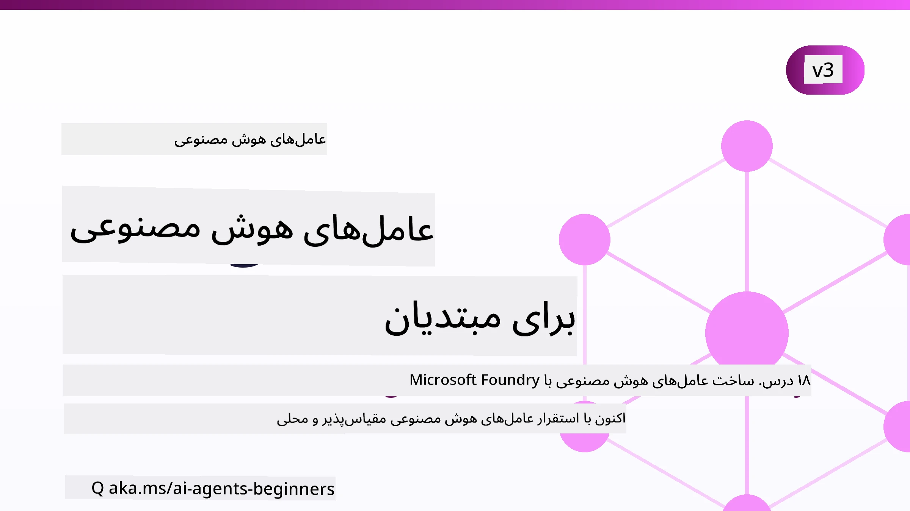

# عوامل هوش مصنوعی برای مبتدیان - یک دوره آموزشی



## دوره‌ای که همه چیزهایی را که برای شروع ساخت عوامل هوش مصنوعی نیاز دارید آموزش می‌دهد

[](https://github.com/microsoft/ai-agents-for-beginners/blob/master/LICENSE?WT.mc_id=academic-105485-koreyst)
[](https://GitHub.com/microsoft/ai-agents-for-beginners/graphs/contributors/?WT.mc_id=academic-105485-koreyst)
[](https://GitHub.com/microsoft/ai-agents-for-beginners/issues/?WT.mc_id=academic-105485-koreyst)
[](https://GitHub.com/microsoft/ai-agents-for-beginners/pulls/?WT.mc_id=academic-105485-koreyst)
[](http://makeapullrequest.com?WT.mc_id=academic-105485-koreyst)

### 🌐 پشتیبانی چند زبانه

#### پشتیبانی شده توسط GitHub Action (خودکار و همیشه به‌روز)

<!-- CO-OP TRANSLATOR LANGUAGES TABLE START -->
[Arabic](../ar/README.md) | [Bengali](../bn/README.md) | [Bulgarian](../bg/README.md) | [Burmese (Myanmar)](../my/README.md) | [Chinese (Simplified)](../zh-CN/README.md) | [Chinese (Traditional, Hong Kong)](../zh-HK/README.md) | [Chinese (Traditional, Macau)](../zh-MO/README.md) | [Chinese (Traditional, Taiwan)](../zh-TW/README.md) | [Croatian](../hr/README.md) | [Czech](../cs/README.md) | [Danish](../da/README.md) | [Dutch](../nl/README.md) | [Estonian](../et/README.md) | [Finnish](../fi/README.md) | [French](../fr/README.md) | [German](../de/README.md) | [Greek](../el/README.md) | [Hebrew](../he/README.md) | [Hindi](../hi/README.md) | [Hungarian](../hu/README.md) | [Indonesian](../id/README.md) | [Italian](../it/README.md) | [Japanese](../ja/README.md) | [Kannada](../kn/README.md) | [Khmer](../km/README.md) | [Korean](../ko/README.md) | [Lithuanian](../lt/README.md) | [Malay](../ms/README.md) | [Malayalam](../ml/README.md) | [Marathi](../mr/README.md) | [Nepali](../ne/README.md) | [Nigerian Pidgin](../pcm/README.md) | [Norwegian](../no/README.md) | [Persian (Farsi)](./README.md) | [Polish](../pl/README.md) | [Portuguese (Brazil)](../pt-BR/README.md) | [Portuguese (Portugal)](../pt-PT/README.md) | [Punjabi (Gurmukhi)](../pa/README.md) | [Romanian](../ro/README.md) | [Russian](../ru/README.md) | [Serbian (Cyrillic)](../sr/README.md) | [Slovak](../sk/README.md) | [Slovenian](../sl/README.md) | [Spanish](../es/README.md) | [Swahili](../sw/README.md) | [Swedish](../sv/README.md) | [Tagalog (Filipino)](../tl/README.md) | [Tamil](../ta/README.md) | [Telugu](../te/README.md) | [Thai](../th/README.md) | [Turkish](../tr/README.md) | [Ukrainian](../uk/README.md) | [Urdu](../ur/README.md) | [Vietnamese](../vi/README.md)

> **ترجیح می‌دهید به صورت محلی کلون کنید؟**
>
> این مخزن شامل بیش از ۵۰ ترجمه زبان است که به طور قابل توجهی اندازه دانلود را افزایش می‌دهد. برای کلون کردن بدون ترجمه‌ها، از sparse checkout استفاده کنید:
>
> **Bash / macOS / Linux:**
> ```bash
> git clone --filter=blob:none --sparse https://github.com/microsoft/ai-agents-for-beginners.git
> cd ai-agents-for-beginners
> git sparse-checkout set --no-cone '/*' '!translations' '!translated_images'
> ```
>
> **CMD (ویندوز):**
> ```cmd
> git clone --filter=blob:none --sparse https://github.com/microsoft/ai-agents-for-beginners.git
> cd ai-agents-for-beginners
> git sparse-checkout set --no-cone "/*" "!translations" "!translated_images"
> ```
>
> این کار همه چیز مورد نیاز برای کامل کردن دوره را با دانلودی بسیار سریع‌تر به شما می‌دهد.
<!-- CO-OP TRANSLATOR LANGUAGES TABLE END -->

**اگر مایلید زبان‌های ترجمه بیشتری پشتیبانی شود، آنها را در [اینجا](https://github.com/Azure/co-op-translator/blob/main/getting_started/supported-languages.md) فهرست شده‌اند.**

[](https://GitHub.com/microsoft/ai-agents-for-beginners/watchers/?WT.mc_id=academic-105485-koreyst)
[](https://GitHub.com/microsoft/ai-agents-for-beginners/network/?WT.mc_id=academic-105485-koreyst)
[](https://GitHub.com/microsoft/ai-agents-for-beginners/stargazers/?WT.mc_id=academic-105485-koreyst)

[](https://discord.com/invite/ATgtXmAS5D)


## 🌱 شروع به کار

این دوره شامل درس‌هایی است که اصول ساخت عوامل هوش مصنوعی را پوشش می‌دهند. هر درس موضوع خاص خود را دارد، پس از هر جایی که دوست دارید شروع کنید!

برای این دوره پشتیبانی چند زبانه وجود دارد. به [زبان‌های در دسترس اینجا](#-multi-language-support) مراجعه کنید. 

اگر برای اولین بار است که با مدل‌های هوش مصنوعی مولد کار می‌کنید، دوره [هوش مصنوعی مولد برای مبتدیان](https://aka.ms/genai-beginners) ما را بررسی کنید که شامل ۲۱ درس درباره ساخت با GenAI است.

فراموش نکنید که [این مخزن را ستاره (🌟) بدهید](https://docs.github.com/en/get-started/exploring-projects-on-github/saving-repositories-with-stars?WT.mc_id=academic-105485-koreyst) و [این مخزن را فورک کنید](https://github.com/microsoft/ai-agents-for-beginners/fork) تا کد را اجرا کنید.

### دیدار با سایر یادگیرندگان، دریافت پاسخ سوالات خود

اگر گیر کردید یا سوالی درباره ساخت عوامل هوش مصنوعی داشتید، به کانال دیسکورد اختصاصی ما در [دیسکورد Microsoft Foundry](https://aka.ms/ai-agents/discord) بپیوندید.

### آنچه نیاز دارید

هر درس در این دوره شامل نمونه‌های کد است که در پوشه code_samples یافت می‌شوند. می‌توانید [این مخزن را فورک کنید](https://github.com/microsoft/ai-agents-for-beginners/fork) تا نسخه خودتان را ایجاد کنید.  

نمونه‌های کد در این تمرینات از چارچوب Microsoft Agent با سرویس Microsoft Foundry Agent V2 استفاده می‌کنند:

- [Microsoft Foundry](https://aka.ms/ai-agents-beginners/ai-foundry) - نیاز به حساب Azure

این دوره از چارچوب‌ها و خدمات زیر برای عامل‌های هوش مصنوعی مایکروسافت استفاده می‌کند:

- [Microsoft Agent Framework (MAF)](https://learn.microsoft.com/agent-framework/overview/)
- [Microsoft Foundry Agent Service V2](https://aka.ms/ai-agents-beginners/ai-agent-service)

برخی از نمونه‌های کد همچنین از ارائه‌دهندگان جایگزین سازگار با OpenAI مانند [MiniMax](https://platform.minimaxi.com/) پشتیبانی می‌کنند که مدل‌های متن بلند (تا ۲۰۴ هزار توکن) ارائه می‌دهد. برای جزئیات پیکربندی به [تنظیمات دوره](./00-course-setup/README.md) مراجعه کنید.

برای اطلاعات بیشتر در مورد اجرای کد این دوره، به [تنظیمات دوره](./00-course-setup/README.md) مراجعه کنید.

## 🙏 می‌خواهید کمک کنید؟

آیا پیشنهادی دارید یا خطاهای نوشتاری یا کدی پیدا کرده‌اید؟ [یک مسئله مطرح کنید](https://github.com/microsoft/ai-agents-for-beginners/issues?WT.mc_id=academic-105485-koreyst) یا [درخواست کشش ایجاد کنید](https://github.com/microsoft/ai-agents-for-beginners/pulls?WT.mc_id=academic-105485-koreyst)


## 📂 هر درس شامل

- یک درس مکتوب که در README قرار دارد و یک ویدئوی کوتاه
- نمونه‌های کد پایتون با استفاده از Microsoft Agent Framework و Microsoft Foundry
- لینک به منابع اضافی برای ادامه یادگیری شما


## 🗃️ دروس

| **درس**                                   | **متن و کد**                                     | **ویدئو**                                                  | **یادگیری اضافی**                                                                     |
|----------------------------------------------|-------------------------------------------------|------------------------------------------------------------|----------------------------------------------------------------------------------------|
| معرفی عوامل هوش مصنوعی و موارد استفاده آنها | [لینک](./01-intro-to-ai-agents/README.md)        | [ویدئو](https://youtu.be/3zgm60bXmQk?si=z8QygFvYQv-9WtO1)  | [لینک](https://aka.ms/ai-agents-beginners/collection?WT.mc_id=academic-105485-koreyst) |
| بررسی چارچوب‌های عامل‌گرا                    | [لینک](./02-explore-agentic-frameworks/README.md) | [ویدئو](https://youtu.be/ODwF-EZo_O8?si=Vawth4hzVaHv-u0H)  | [لینک](https://aka.ms/ai-agents-beginners/collection?WT.mc_id=academic-105485-koreyst) |
| درک الگوهای طراحی عامل‌گرا                   | [لینک](./03-agentic-design-patterns/README.md)   | [ویدئو](https://youtu.be/m9lM8qqoOEA?si=BIzHwzstTPL8o9GF)  | [لینک](https://aka.ms/ai-agents-beginners/collection?WT.mc_id=academic-105485-koreyst) |
| الگوی طراحی استفاده از ابزار                  | [لینک](./04-tool-use/README.md)                   | [ویدئو](https://youtu.be/vieRiPRx-gI?si=2z6O2Xu2cu_Jz46N)  | [لینک](https://aka.ms/ai-agents-beginners/collection?WT.mc_id=academic-105485-koreyst) |
| RAG عامل‌گرا                                   | [لینک](./05-agentic-rag/README.md)                | [ویدئو](https://youtu.be/WcjAARvdL7I?si=gKPWsQpKiIlDH9A3)  | [لینک](https://aka.ms/ai-agents-beginners/collection?WT.mc_id=academic-105485-koreyst) |
| ساخت عوامل هوش مصنوعی قابل اعتماد            | [لینک](./06-building-trustworthy-agents/README.md) | [ویدئو](https://youtu.be/iZKkMEGBCUQ?si=jZjpiMnGFOE9L8OK ) | [لینک](https://aka.ms/ai-agents-beginners/collection?WT.mc_id=academic-105485-koreyst) |
| الگوی طراحی برنامه‌ریزی                        | [لینک](./07-planning-design/README.md)            | [ویدئو](https://youtu.be/kPfJ2BrBCMY?si=6SC_iv_E5-mzucnC)  | [لینک](https://aka.ms/ai-agents-beginners/collection?WT.mc_id=academic-105485-koreyst) |
| الگوی طراحی چند عاملی                         | [لینک](./08-multi-agent/README.md)                 | [ویدئو](https://youtu.be/V6HpE9hZEx0?si=rMgDhEu7wXo2uo6g)  | [لینک](https://aka.ms/ai-agents-beginners/collection?WT.mc_id=academic-105485-koreyst) |

| الگوی طراحی فراشناخت                 | [لینک](./09-metacognition/README.md)               | [ویدیو](https://youtu.be/His9R6gw6Ec?si=8gck6vvdSNCt6OcF)  | [لینک](https://aka.ms/ai-agents-beginners/collection?WT.mc_id=academic-105485-koreyst) |
| عوامل هوش مصنوعی در تولید                      | [لینک](./10-ai-agents-production/README.md)        | [ویدیو](https://youtu.be/l4TP6IyJxmQ?si=31dnhexRo6yLRJDl)  | [لینک](https://aka.ms/ai-agents-beginners/collection?WT.mc_id=academic-105485-koreyst) |
| استفاده از پروتکل‌های عامل‌محور (MCP، A2A و NLWeb) | [لینک](./11-agentic-protocols/README.md)           | [ویدیو](https://youtu.be/X-Dh9R3Opn8)                                 | [لینک](https://aka.ms/ai-agents-beginners/collection?WT.mc_id=academic-105485-koreyst) |
| مهندسی زمینه برای عوامل هوش مصنوعی            | [لینک](./12-context-engineering/README.md)         | [ویدیو](https://youtu.be/F5zqRV7gEag)                                 | [لینک](https://aka.ms/ai-agents-beginners/collection?WT.mc_id=academic-105485-koreyst) |
| مدیریت حافظه عامل‌محور                      | [لینک](./13-agent-memory/README.md)     |      [ویدیو](https://youtu.be/QrYbHesIxpw?si=vZkVwKrQ4ieCcIPx)                                                      |                                                                                        |
| کاوش چارچوب عامل مایکروسافت                         | [لینک](./14-microsoft-agent-framework/README.md)                            |                                                            |                                                                                        |
| ساخت عوامل استفاده رایانه (CUA)           | [لینک](./15-browser-use/README.md)     |                                                            | [لینک](https://docs.browser-use.com/examples/templates/playwright-integration)         |
| استقرار عوامل مقیاس‌پذیر                    | [لینک](./16-deploying-scalable-agents/README.md) |                                                    | [لینک](https://learn.microsoft.com/azure/ai-foundry/agents/overview)                   |
| ایجاد عوامل هوش مصنوعی محلی                     | [لینک](./17-creating-local-ai-agents/README.md)  |                                                    | [لینک](https://learn.microsoft.com/azure/ai-foundry/foundry-local/)                    |
| تامین امنیت عوامل هوش مصنوعی                           | [لینک](./18-securing-ai-agents/README.md)  |                                                            | [لینک](https://aka.ms/ai-agents-beginners/collection?WT.mc_id=academic-105485-koreyst) |

## 🎒 دوره‌های دیگر

تیم ما دوره‌های دیگری نیز تولید می‌کند! ببینید:

<!-- CO-OP TRANSLATOR OTHER COURSES START -->
### LangChain
[](https://aka.ms/langchain4j-for-beginners)
[](https://aka.ms/langchainjs-for-beginners?WT.mc_id=m365-94501-dwahlin)
[](https://github.com/microsoft/langchain-for-beginners?WT.mc_id=m365-94501-dwahlin)
---

### Azure / Edge / MCP / عوامل
[](https://github.com/microsoft/AZD-for-beginners?WT.mc_id=academic-105485-koreyst)
[](https://github.com/microsoft/edgeai-for-beginners?WT.mc_id=academic-105485-koreyst)
[](https://github.com/microsoft/mcp-for-beginners?WT.mc_id=academic-105485-koreyst)
[](https://github.com/microsoft/ai-agents-for-beginners?WT.mc_id=academic-105485-koreyst)

---
 
### سری هوش مصنوعی مولد
[](https://github.com/microsoft/generative-ai-for-beginners?WT.mc_id=academic-105485-koreyst)
[-9333EA?style=for-the-badge&labelColor=E5E7EB&color=9333EA)](https://github.com/microsoft/Generative-AI-for-beginners-dotnet?WT.mc_id=academic-105485-koreyst)
[-C084FC?style=for-the-badge&labelColor=E5E7EB&color=C084FC)](https://github.com/microsoft/generative-ai-for-beginners-java?WT.mc_id=academic-105485-koreyst)
[-E879F9?style=for-the-badge&labelColor=E5E7EB&color=E879F9)](https://github.com/microsoft/generative-ai-with-javascript?WT.mc_id=academic-105485-koreyst)

---
 
### یادگیری پایه‌ای
[](https://aka.ms/ml-beginners?WT.mc_id=academic-105485-koreyst)
[](https://aka.ms/datascience-beginners?WT.mc_id=academic-105485-koreyst)
[](https://aka.ms/ai-beginners?WT.mc_id=academic-105485-koreyst)
[](https://github.com/microsoft/Security-101?WT.mc_id=academic-96948-sayoung)
[](https://aka.ms/webdev-beginners?WT.mc_id=academic-105485-koreyst)
[](https://aka.ms/iot-beginners?WT.mc_id=academic-105485-koreyst)
[](https://github.com/microsoft/xr-development-for-beginners?WT.mc_id=academic-105485-koreyst)

---
 
### سری Copilot
[](https://aka.ms/GitHubCopilotAI?WT.mc_id=academic-105485-koreyst)
[](https://github.com/microsoft/mastering-github-copilot-for-dotnet-csharp-developers?WT.mc_id=academic-105485-koreyst)
[](https://github.com/microsoft/CopilotAdventures?WT.mc_id=academic-105485-koreyst)
<!-- CO-OP TRANSLATOR OTHER COURSES END -->

## 🌟 تشکر از جامعه

از [Shivam Goyal](https://www.linkedin.com/in/shivam2003/) برای مشارکت نمونه‌های کد مهم که Agentic RAG را نشان می‌دهند، سپاسگزاریم. 

## مشارکت

این پروژه از مشارکت‌ها و پیشنهادات استقبال می‌کند. بیشتر مشارکت‌ها نیازمند آن است که شما با یک
توافقنامه مجوز مشارکت‌کننده (CLA) موافقت کنید که اعلام می‌کند شما حق دارید و واقعاً به ما اجازه می‌دهید
حقوق استفاده از مشارکت شما را داشته باشیم. برای جزئیات به <https://cla.opensource.microsoft.com> مراجعه کنید.

هنگامی که درخواست پول ارسال می‌کنید، ربات CLA به طور خودکار تعیین می‌کند که آیا نیاز به ارائه
CLA دارید و درخواست را به طور مناسب (مانند بررسی وضعیت، نظر) علامت‌گذاری می‌کند. فقط دستورالعمل‌هایی که
توسط ربات داده می‌شود را دنبال کنید. شما فقط یک بار در همه مخازن از این CLA باید این کار را انجام دهید.

این پروژه [کد رفتار اپن سورس مایکروسافت](https://opensource.microsoft.com/codeofconduct/) را اتخاذ کرده است.
برای اطلاعات بیشتر به [سوالات متداول کد رفتار](https://opensource.microsoft.com/codeofconduct/faq/) مراجعه کنید یا
با [opencode@microsoft.com](mailto:opencode@microsoft.com) برای هر سوال یا نظر اضافی تماس بگیرید.

## علائم تجاری

این پروژه ممکن است شامل علائم تجاری یا لوگوهایی برای پروژه‌ها، محصولات یا خدمات باشد. استفاده مجاز از علائم تجاری یا لوگوهای مایکروسافت
مشروط به و باید مطابق با
[راهنمایی‌های علائم تجاری و برند مایکروسافت](https://www.microsoft.com/legal/intellectualproperty/trademarks/usage/general) باشد.
استفاده از علائم تجاری یا لوگوهای مایکروسافت در نسخه‌های تغییر یافته از این پروژه نباید باعث سردرگمی شود یا دلالت بر حمایت مایکروسافت داشته باشد.
هرگونه استفاده از علائم تجاری یا لوگوهای شخص ثالث تابع سیاست‌های آن طرف‌های ثالث است.

## دریافت کمک


اگر گیر کردید یا سوالی درباره ساخت برنامه‌های هوش مصنوعی دارید، بپیوندید به:

[](https://aka.ms/foundry/discord)

اگر بازخورد محصول یا خطا هنگام ساخت داشتید، مراجعه کنید به:

[](https://aka.ms/foundry/forum)

---

<!-- CO-OP TRANSLATOR DISCLAIMER START -->
**سلب مسئولیت**:
این سند با استفاده از سرویس ترجمه هوش مصنوعی [Co-op Translator](https://github.com/Azure/co-op-translator) ترجمه شده است. در حالی که ما در تلاش برای دقت هستیم، لطفاً توجه داشته باشید که ترجمه‌های خودکار ممکن است شامل خطاها یا نادرستی‌هایی باشند. سند اصلی به زبان مادری خود باید به عنوان منبع معتبر در نظر گرفته شود. برای اطلاعات حیاتی، ترجمه حرفه‌ای انسانی توصیه می‌شود. ما در قبال هرگونه سوء تفاهم یا برداشت نادرست ناشی از استفاده از این ترجمه مسئولیتی نداریم.
<!-- CO-OP TRANSLATOR DISCLAIMER END -->