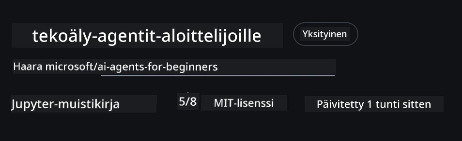

# Kurssin asetukset

## Johdanto

Tässä oppitunnissa käydään läpi, miten suoritat tämän kurssin koodiesimerkit.

## Liity muiden oppijoiden seuraan ja hae apua

Ennen kuin aloitat repositorion kloonaamisen, liity [AI Agents For Beginners Discord -kanavaan](https://aka.ms/ai-agents/discord) saadaksesi apua asennuksessa, vastauksia kurssiin liittyviin kysymyksiin tai ollaksesi yhteydessä muihin oppijoihin.

## Kloonaa tai forkkaa tämä repositorio

Aloittaaksesi, kloonaa tai forkkaa GitHub-repositorio. Tämä luo oman version kurssimateriaalista, jotta voit suorittaa, testata ja muokata koodia!

Tämän voi tehdä klikkaamalla linkkiä <a href="https://github.com/microsoft/ai-agents-for-beginners/fork" target="_blank">forkkaa repositorio</a>

Sinulla pitäisi nyt olla oma forkkaamasi versio tästä kurssista seuraavassa linkissä:



### Shallow Clone (suositellaan työpajaa / Codespacesia varten)

  >Koko repositorio voi olla suuri (~3 GB), kun lataat koko historian ja kaikki tiedostot. Jos osallistut vain työpajaan tai tarvitset vain muutamia oppituntikansioita, shallow-kloonaus (tai sparse-kloonaus) välttää suurimman osan latauksesta katkaisemalla historian ja/tai ohittamalla blobit.

#### Nopea shallow-kloonaus — minimaalinen historia, kaikki tiedostot

Korvaa `<your-username>` alla olevissa komennoissa fork-URL-osoitteellasi (tai upstream-URL-osoitteella, jos haluat).

Kloonaa vain viimeisin commit-historia (pieni lataus):

```bash|powershell
git clone --depth 1 https://github.com/<your-username>/ai-agents-for-beginners.git
```

Kloonaa tietty haara:

```bash|powershell
git clone --depth 1 --branch <branch-name> https://github.com/<your-username>/ai-agents-for-beginners.git
```

#### Osittainen (sparse) kloonaus — minimaaliset blobit + vain valitut kansiot

Tämä käyttää partial clonea ja sparse-checkoutia (vaatii Git 2.25+ ja suositellaan nykyaikaista Gitiä, jossa on partial clone -tuki):

```bash|powershell
git clone --depth 1 --filter=blob:none --sparse https://github.com/<your-username>/ai-agents-for-beginners.git
```

Siirry repositorion kansioon:

```bash|powershell
cd ai-agents-for-beginners
```

Sitten määritä, mitä kansioita haluat (esimerkissä alla näkyy kaksi kansiota):

```bash|powershell
git sparse-checkout set 00-course-setup 01-intro-to-ai-agents
```

Kun olet kloonannut ja varmistanut tiedostot, jos tarvitset vain tiedostot ja haluat vapauttaa tilaa (ei git-historiaa), poista repositorion metatiedot (💀 peruuttamaton — menetät kaiken Git-toiminnallisuuden: ei committeja, pull- tai push-toimintoja tai historian pääsyä).

```bash
# zsh/bash
rm -rf .git
```

```powershell
# PowerShell
Remove-Item -Recurse -Force .git
```

#### GitHub Codespacesin käyttö (suositeltava tapa välttää paikallisia suuria latauksia)

- Luo uusi Codespace tälle repositoriolle [GitHubin käyttöliittymän kautta](https://github.com/codespaces).  

- Uudessa Codespacen terminaalissa suorita yksi yllä olevista shallow/sparse-kloonauskomennoista tuodaksesi vain tarvitsemasi oppituntikansiot Codespace-työtilaan.
- Valinnainen: kloonauksen jälkeen Codespacessa poista .git vapauttaaksesi tilaa (katso yllä olevat poistokäskyt).
- Huom: Jos avaat repositorion suoraan Codespacesissa (ilman erillistä kloonausta), Codespaces rakentaa devcontainer-ympäristön ja saattaa silti provisioida enemmän kuin tarvitset. Shallow-kopiointi puhtaaseen Codespaceen antaa enemmän hallintaa levytilan käytöstä.

#### Vinkkejä

- Vaihda aina kloonaus-URL omaasi, jos haluat muokata/commitata.
- Jos tarvitset myöhemmin lisää historiaa tai tiedostoja, voit hakea niitä tai säätää sparse-checkoutia lisätäksesi kansioita.

## Koodin suorittaminen

Tässä kurssissa on sarja Jupyter-muistikirjoja, joita voit suorittaa saadaksesi käytännön kokemusta tekoälyagenttien rakentamisesta.

Koodiesimerkeissä käytetään Microsoft Agent Frameworkia (MAF) yhdessä `AzureAIProjectAgentProvider`-sovittimen kanssa, joka yhdistää **Azure AI Agent Service V2** (Responses API) -palveluun **Microsoft Foundryn** kautta.

Kaikki Python-muistikirjat on nimetty `*-python-agent-framework.ipynb`.

## Vaatimukset

- Python 3.12+
  - **HUOM**: Jos Python 3.12 ei ole asennettuna, varmista, että asennat sen. Luo sitten virtuaaliympäristösi käyttäen python3.12 varmistaaksesi, että requirements.txt-tiedostosta asennetaan oikeat versiot.
  
    >Esimerkki

    Luo Python-venv-kansio:

    ```bash|powershell
    python -m venv venv
    ```

    Aktivoi sitten venv-ympäristö:

    ```bash
    # zsh/bash
    source venv/bin/activate
    ```
  
    ```dos
    # Command Prompt for Windows
    venv\Scripts\activate
    ```

- .NET 10+: .NET-koodiesimerkkien osalta varmista, että asennat [.NET 10 SDK:n](https://dotnet.microsoft.com/download/dotnet/10.0) tai uudemman. Tarkista sitten asennettu .NET SDK -versiosi:

    ```bash|powershell
    dotnet --list-sdks
    ```

- **Azure CLI** — Vaaditaan autentikointiin. Asenna osoitteesta [aka.ms/installazurecli](https://aka.ms/installazurecli).
- **Azure-tilaus** — Pääsyä Microsoft Foundryyn ja Azure AI Agent Serviceen varten.
- **Microsoft Foundry -projekti** — Projekti, jossa on käyttöön otettu malli (esim. `gpt-4o`). Katso [Vaihe 1](../../../00-course-setup) alla.

Tähän repositorion juureen on lisätty tiedosto `requirements.txt`, joka sisältää kaikki koodiesimerkkien suorittamiseen tarvittavat Python-paketit.

Voit asentaa ne suorittamalla seuraavan komennon terminaalissasi repositorion juurikansiossa:

```bash|powershell
pip install -r requirements.txt
```

Suosittelemme Python-virtuaaliympäristön luomista mahdollisten ristiriitojen ja ongelmien välttämiseksi.

## VSCode:n määritys

Varmista, että käytät oikeaa Python-versiota VSCode:ssa.


## Microsoft Foundryn ja Azure AI Agent Servicen käyttöönotto

### Vaihe 1: Luo Microsoft Foundry -projekti

Tarvitset Azure AI Foundry -hubin ja -projektin, jossa on käyttöön otettu malli muistikirjojen suorittamista varten.

1. Siirry osoitteeseen [ai.azure.com](https://ai.azure.com) ja kirjaudu sisään Azure-tililläsi.
2. Luo **hub** (tai käytä olemassa olevaa). Katso: [Hub resources overview](https://learn.microsoft.com/azure/ai-foundry/concepts/ai-resources).
3. Hubin sisällä luo **projekti**.
4. Ota malli käyttöön (esim. `gpt-4o`) valitsemalla **Models + Endpoints** → **Deploy model**.

### Vaihe 2: Hae projektisi päätepiste ja mallin käyttöönoton nimi

Microsoft Foundry -portaalissa projektisi tiedoista:

- **Project Endpoint** — Siirry **Overview**-sivulle ja kopioi päätepisteen URL-osoite.


- **Model Deployment Name** — Siirry **Models + Endpoints** -kohtaan, valitse käyttöönotettu mallisi ja kirjaa ylös **Deployment name** (esim. `gpt-4o`).

### Vaihe 3: Kirjaudu Azureen komennolla `az login`

Kaikki muistikirjat käyttävät autentikointiin **`AzureCliCredential`**-luokkaa — eikä API-avaimia tarvitse hallita. Tämä vaatii, että olet kirjautunut sisään Azure CLI:n kautta.

1. **Asenna Azure CLI** jos et ole vielä tehnyt sitä: [aka.ms/installazurecli](https://aka.ms/installazurecli)

2. **Kirjaudu sisään** suorittamalla:

    ```bash|powershell
    az login
    ```

    Tai jos olet etäympäristössä/Codespacessa ilman selainta:

    ```bash|powershell
    az login --use-device-code
    ```

3. **Valitse tilauksesi** jos sinua pyydetään — valitse tilaus, joka sisältää Foundry-projektisi.

4. **Varmista**, että olet kirjautunut sisään:

    ```bash|powershell
    az account show
    ```

> **Miksi `az login`?** Muistikirjat autentikoituvat `azure-identity`-paketin `AzureCliCredential`-luokan avulla. Tämä tarkoittaa, että Azure CLI -istuntosi tarjoaa tunnistetiedot — ei API-avaimia tai salaisuuksia `.env`-tiedostossasi. Tämä on [turvallisuuden hyvä käytäntö](https://learn.microsoft.com/azure/developer/ai/keyless-connections).

### Vaihe 4: Luo `.env`-tiedostosi

Kopioi esimerkkitiedosto:

```bash
# zsh/bash
cp .env.example .env
```

```powershell
# PowerShell
Copy-Item .env.example .env
```

Avaa `.env` ja täytä nämä kaksi arvoa:

```env
AZURE_AI_PROJECT_ENDPOINT=https://<your-project>.services.ai.azure.com/api/projects/<your-project-id>
AZURE_AI_MODEL_DEPLOYMENT_NAME=gpt-4o
```

| Muuttuja | Mistä löytää |
|----------|-----------------|
| `AZURE_AI_PROJECT_ENDPOINT` | Foundry-portaali → projektisi → **Overview**-sivu |
| `AZURE_AI_MODEL_DEPLOYMENT_NAME` | Foundry-portaali → **Models + Endpoints** → käyttöönotetun mallisi nimi |

Siinä se suurimmalle osalle oppitunneista! Muistikirjat autentikoituvat automaattisesti `az login` -istuntosi kautta.

### Vaihe 5: Asenna Python-riippuvuudet

```bash|powershell
pip install -r requirements.txt
```

Suosittelemme suorittamaan tämän aiemmin luomassasi virtuaaliympäristössä.

## Lisäasetukset oppitunnille 5 (Agentic RAG)

Oppitunti 5 käyttää **Azure AI Search** -palvelua retrieval-augmented generationia varten. Jos aiot suorittaa kyseisen oppitunnin, lisää nämä muuttujat `.env`-tiedostoosi:

| Muuttuja | Mistä löytää |
|----------|-----------------|
| `AZURE_SEARCH_SERVICE_ENDPOINT` | Azure-portaali → Azure AI Search -resurssisi → **Overview** → URL |
| `AZURE_SEARCH_API_KEY` | Azure-portaali → Azure AI Search -resurssisi → **Settings** → **Keys** → primary admin key |

## Lisäasetukset oppitunneille 6 ja 8 (GitHub Models)

Joissain oppituntien 6 ja 8 muistikirjoissa käytetään **GitHub Models** -palvelua Azure AI Foundryn sijaan. Jos aiot suorittaa näitä esimerkkejä, lisää nämä muuttujat `.env`-tiedostoosi:

| Muuttuja | Mistä löytää |
|----------|-----------------|
| `GITHUB_TOKEN` | GitHub → **Settings** → **Developer settings** → **Personal access tokens** |
| `GITHUB_ENDPOINT` | Käytä `https://models.inference.ai.azure.com` (oletusarvo) |
| `GITHUB_MODEL_ID` | Käytettävän mallin nimi (esim. `gpt-4o-mini`) |

## Lisäasetukset oppitunnille 8 (Bing Grounding Workflow)

Ehdollinen workflow-muistikirja oppitunnissa 8 käyttää **Bing grounding** -toimintoa Azure AI Foundryn kautta. Jos aiot suorittaa tämän esimerkin, lisää tämä muuttuja `.env`-tiedostoosi:

| Muuttuja | Mistä löytää |
|----------|-----------------|
| `BING_CONNECTION_ID` | Azure AI Foundry -portaali → projektisi → **Management** → **Connected resources** → Bing-yhteytesi → kopioi connection ID |

## Vianmääritys

### SSL-varmennevirheet macOS:ssä

Jos käytät macOS:ää ja kohtaat virheen, kuten:

```plaintext
ssl.SSLCertVerificationError: [SSL: CERTIFICATE_VERIFY_FAILED] certificate verify failed: self-signed certificate in certificate chain
```

Tämä on tunnettu ongelma Pythonissa macOS:llä, jossa järjestelmän SSL-varmenteita ei luoteta automaattisesti. Kokeile seuraavia ratkaisuja tässä järjestyksessä:

**Vaihtoehto 1: Suorita Pythonin Install Certificates -skripti (suositeltava)**

```bash
# Korvaa 3.XX asentamallasi Python-versiolla (esim. 3.12 tai 3.13):
/Applications/Python\ 3.XX/Install\ Certificates.command
```

**Vaihtoehto 2: Käytä `connection_verify=False` muistikirjassasi (vain GitHub Models -muistikirjoille)**

Lesson 6 -muistikirjassa (`06-building-trustworthy-agents/code_samples/06-system-message-framework.ipynb`) on jo kommentoitu kiertotie mukana. Poista kommenttimerkintä `connection_verify=False` luodessasi clientin:

```python
client = ChatCompletionsClient(
    endpoint=endpoint,
    credential=AzureKeyCredential(token),
    connection_verify=False,  # Poista SSL-tarkistus käytöstä, jos kohtaat sertifikaattivirheitä
)
```

> **⚠️ Varoitus:** SSL-varmennetarkistuksen pois kytkeminen (`connection_verify=False`) heikentää turvallisuutta ohittamalla varmenteen validoinnin. Käytä tätä vain väliaikaisena kiertotienä kehitysympäristöissä, ei koskaan tuotannossa.

**Vaihtoehto 3: Asenna ja käytä `truststore`-kirjastoa**

```bash
pip install truststore
```

Lisää sitten seuraava koodi muistikirjasi tai skriptisi alkuun ennen verkko-operaatioita:

```python
import truststore
truststore.inject_into_ssl()
```

## Jumiuduitko jonnekin?

Jos sinulla on ongelmia tämän asennuksen suorittamisessa, liity <a href="https://discord.gg/kzRShWzttr" target="_blank">Azure AI Community Discord -kanavalle</a> tai <a href="https://github.com/microsoft/ai-agents-for-beginners/issues?WT.mc_id=academic-105485-koreyst" target="_blank">luo issue</a>.

## Seuraava oppitunti

Olet nyt valmis suorittamaan tämän kurssin koodin. Hauskaa oppimista tekoälyagenttien maailmasta!

[Johdanto tekoälyagentteihin ja agenttien käyttötapauksiin](../01-intro-to-ai-agents/README.md)

---

<!-- CO-OP TRANSLATOR DISCLAIMER START -->
Vastuuvapauslauseke:
Tämä asiakirja on käännetty tekoälypohjaisella käännöspalvelulla Co-op Translator (https://github.com/Azure/co-op-translator). Vaikka pyrimme tarkkuuteen, huomioithan, että automatisoiduissa käännöksissä saattaa esiintyä virheitä tai epätarkkuuksia. Alkuperäistä asiakirjaa sen alkuperäiskielellä tulee pitää auktoritatiivisena lähteenä. Tärkeää tietoa varten suositellaan ammattimaista ihmiskäännöstä. Emme ole vastuussa tämän käännöksen käytöstä aiheutuvista väärinymmärryksistä tai tulkinnoista.
<!-- CO-OP TRANSLATOR DISCLAIMER END -->