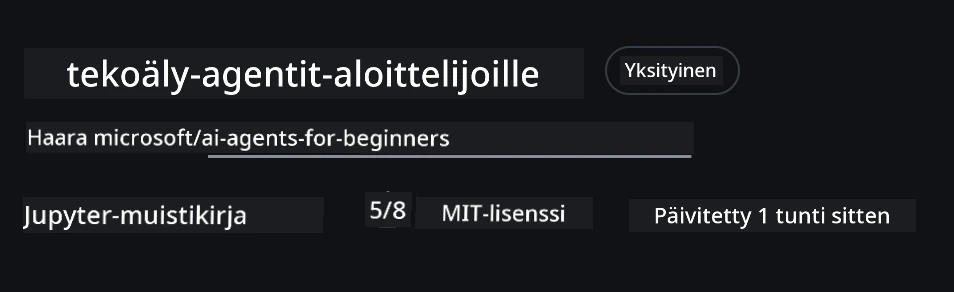
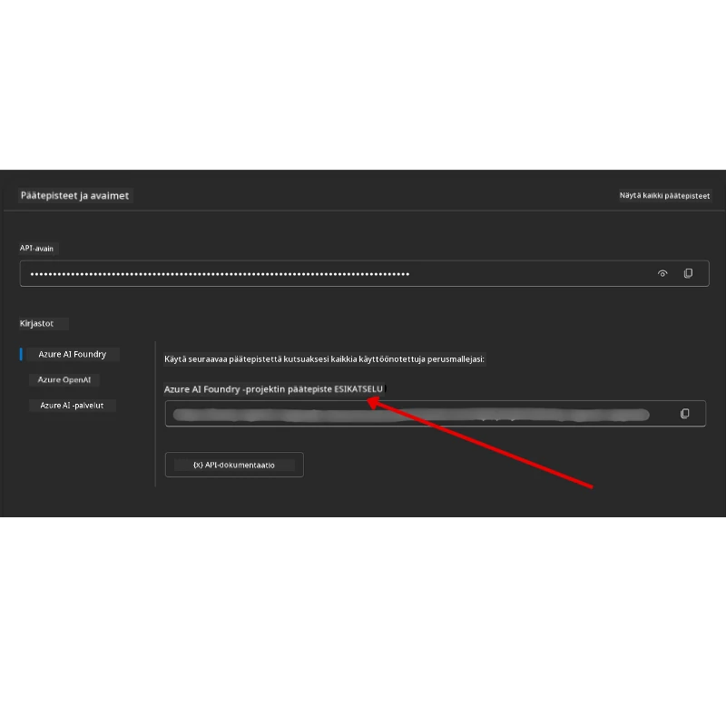

# Kurssin asennus

## Johdanto

Tässä oppitunnissa käsitellään, kuinka suorittaa tämän kurssin koodiesimerkit.

## Liity muiden oppijoiden seuraan ja saa apua

Ennen kuin alat kloonata omaa repositoriota, liity [AI Agents For Beginners Discord -kanavalle](https://aka.ms/ai-agents/discord) saadaksesi apua asennuksessa, kysyäksesi kurssista tai yhteydenottoa varten muiden oppijoiden kanssa.

## Kloonaa tai haarauta tämä repo

Aloita kloonaamalla tai haarauttamalla GitHub-repositorio. Näin saat oman version kurssimateriaalista, jotta voit suorittaa, testata ja muokata koodia!

Tämä onnistuu klikkaamalla linkkiä <a href="https://github.com/microsoft/ai-agents-for-beginners/fork" target="_blank">haarauta repositorio</a>

Sinulla pitäisi nyt olla oma haarautettu versio tästä kurssista seuraavassa linkissä:



### Kevyt kloonaus (suositellaan työpajaa / Codespaces)

  >Koko repositorio voi olla suuri (~3 Gt), jos lataat koko historian ja kaikki tiedostot. Jos osallistut vain työpajaan tai tarvitset vain muutaman oppitunnin kansion, kevyt kloonaus (tai osittainen kloonaus) lataa huomattavasti vähemmän.

#### Nopea kevyt kloonaus — minimaalinen historia, kaikki tiedostot

Korvaa `<your-username>` alla komennoissa omalla haarautus-URL:llasi (tai upstream-URL:lla, jos haluat).

Kloonaa vain viimeisin commit-historia (pieni lataus):

```bash
git clone --depth 1 https://github.com/<your-username>/ai-agents-for-beginners.git
```

Kloonaa tietty haara:

```bash
git clone --depth 1 --branch <branch-name> https://github.com/<your-username>/ai-agents-for-beginners.git
```

#### Osittainen (sparse) kloonaus — minimaalinen määrä tietoja + vain valitut kansiot

Tämä käyttää osittaista kloonausta ja sparse-checkout-toimintoa (vaatii Git 2.25+:n ja suositellaan modernia Gitiä osittaisen kloonauksen tuella):

```bash
git clone --depth 1 --filter=blob:none --sparse https://github.com/<your-username>/ai-agents-for-beginners.git
```

Siirry repositorion kansioon:

```bash
cd ai-agents-for-beginners
```

Määritä mitkä kansiot haluat (alla esimerkki kahdesta kansiosta):

```bash
git sparse-checkout set 00-course-setup 01-intro-to-ai-agents
```

Kloonauksen ja tiedostojen varmistamisen jälkeen, jos tarvitset vain tiedostot ja haluat vapauttaa tilaa (ilman git-historiaa), poista repositorion metadata (💀 peruuttamaton — menetät kaikki Git-toiminnot):

```bash
# zsh/bash
rm -rf .git
```

```powershell
# PowerShell
Remove-Item -Recurse -Force .git
```

#### GitHub Codespaces -käyttö (suositellaan välttämään paikalliset suuret lataukset)

- Luo uusi Codespace tälle repositoriolle GitHubin käyttöliittymän kautta [GitHub UI](https://github.com/codespaces).  

- Suorita uudessa Codespace-terminaalissa joku kevyt/sparse kloonaus- komennoista yllä tuodaksesi vain tarvitsemasi oppituntikansiot Codespace-työtilaan.
- Vapaaehtoinen: kloonauksen jälkeen Codespacessa voit poistaa .git-kansion saadaksesi lisää tilaa (katso poistokäskyt yläpuolella).
- Huom: Jos avaat repositorion suoraan Codespacessa (ilman ylimääräistä kloonausta), huomioi että Codespaces rakentaa devcontainer-ympäristön ja voi silti luoda enemmän kuin tarvitset.

#### Vinkkejä

- Vaihda aina kloonaus-URL omak forkkausversiosi URL:ksi, jos aiot muokata ja sitouttaa muutoksia.
- Jos tarvitset myöhemmin enemmän historiaa tai tiedostoja, voit hakea niitä tai muuttaa sparse-checkoutia sisällyttämään lisäkansioita.

## Koodin suoritus

Tämä kurssi tarjoaa sarjan Jupyter-muistikirjoja, joita voit suorittaa saadaksesi käytännön kokemusta AI-agenttien rakentamisesta.

Koodiesimerkeissä käytetään **Microsoft Agent Frameworkia (MAF)** `FoundryChatClient`-asiakasohjelman avulla, joka muodostaa yhteyden **Microsoft Foundry Agent Service V2:een** (Responses API) Microsoft Foundryn kautta.

Kaikki Python-muistikirjat on nimetty muotoon `*-python-agent-framework.ipynb`.

## Vaaditut asiat

- Python 3.12+
  - **HUOM**: Jos Python3.12 ei ole asennettuna, varmista että asennat sen. Luo sitten virtuaaliympäristö python3.12:lla varmistaaksesi oikeat versiot requirements.txt-tiedostosta.
  
    >Esimerkki

    Luo Python-venv-kansio:

    ```bash
    python -m venv venv
    ```

    Aktivoi sitten venv-ympäristö:

    ```bash
    # zsh/bash
    source venv/bin/activate
    ```
  
    ```dos
    # Command Prompt for Windows
    venv\Scripts\activate
    ```

- .NET 10+: Näytteiden .NET-koodia varten varmista, että sinulla on asennettuna [.NET 10 SDK](https://dotnet.microsoft.com/download/dotnet/10.0) tai uudempi versio. Tarkista asennettu SDK-versiosi:

    ```bash
    dotnet --list-sdks
    ```

- **Azure CLI** — tarve todennukseen. Asenna osoitteesta [aka.ms/installazurecli](https://aka.ms/installazurecli).
- **Azure-tilaus** — Microsoft Foundryn ja Microsoft Foundry Agent Servicen pääsyä varten.
- **Microsoft Foundry -projekti** — Projekti, johon on otettu käyttöön malli (esim. `gpt-5-mini`). Katso [Vaihe 1](#vaihe-1-luo-microsoft-foundry-projekti) alla.

Tämä repositorion juuressa on mukana `requirements.txt`-tiedosto, jossa on kaikki tarvittavat Python-paketit koodiesimerkkien ajamiseen.

Voit asentaa ne suorittamalla seuraavan komennon terminaalissasi repositorion juuressa:

```bash
pip install -r requirements.txt
```

Suosittelemme Python-virtuaaliympäristön luomista välisten yhteensopivuusongelmien välttämiseksi.

## VSCode-asennus

Varmista, että käytät oikeaa Python-versiota VSCodessa.


## Microsoft Foundryn ja Microsoft Foundry Agent Servicen asetukset

### Vaihe 1: Luo Microsoft Foundry -projekti

Sinulla täytyy olla Microsoft Foundry **hub** ja **projekti** mallin kanssa ajaaksesi muistikirjoja.

1. Mene [ai.azure.com](https://ai.azure.com) ja kirjaudu sisään Azure-tililläsi.
2. Luo **hub** (tai käytä olemassa olevaa). Katso: [Hub resources overview](https://learn.microsoft.com/azure/ai-foundry/concepts/ai-resources).
3. Luo hubin sisälle **projekti**.
4. Ota käyttöön malli (esim. `gpt-5-mini`) **Models + Endpoints** → **Deploy model** kautta.

### Vaihe 2: Hae projektisi päätepisteen ja mallin käyttöönoton nimi

Microsoft Foundryn portaalista projektiisi:

- **Project Endpoint** — Mene **Overview**-sivulle ja kopioi endpoint-URL.



- **Model Deployment Name** — Mene **Models + Endpoints**-osioon, valitse käyttöönotettu mallisi ja muista **Deployment name** (esim. `gpt-5-mini`).

### Vaihe 3: Kirjaudu Azureen komennolla `az login`

Useimmat muistikirjat todennetaan **Azure CLI -kirjautumisella** — käyttäen `AzureCliCredential` tai `DefaultAzureCredential` (molemmat käyttävät `az login` -istuntoasi) `azure-identity`-paketin kautta — joten ne eivät vaadi API-avaimia. Jotkut oppitunnit ja valinnaiset integraatiot käyttävät API-avaimia; tarkista kunkin oppitunnin vaatimukset lisäympäristömuuttujien varalta. Tämä edellyttää että olet kirjautunut Azure CLI:llä.

1. **Asenna Azure CLI**, jos et ole vielä tehnyt sitä: [aka.ms/installazurecli](https://aka.ms/installazurecli)

2. **Kirjaudu sisään** suorittamalla:

    ```bash
    az login
    ```

    Tai jos olet etä-/Codespace-ympäristössä ilman selainta:

    ```bash
    az login --use-device-code
    ```

3. **Valitse tilauksesi** jos sinulta kysytään — valitse se, jossa Foundry-projektisi sijaitsee.

4. **Varmista** että olet kirjautunut sisään:

    ```bash
    az account show
    ```

> **Miksi `az login`?** Muistikirjat käyttävät todennukseen `AzureCliCredential` (tai `DefaultAzureCredential`, joka myös käyttää Azure CLI -kirjautumistasi) `azure-identity`-paketista. Tämä tarkoittaa, että Azure CLI -istuntosi tarjoaa tunnistetiedot — et tarvitse API-avaimia tai salaisuuksia `.env`-tiedostossa. Tämä on [turvallisuuden paras käytäntö](https://learn.microsoft.com/azure/developer/ai/keyless-connections).

### Vaihe 4: Luo oma `.env`-tiedostosi

Kopioi esimerkkitiedosto:

```bash
# zsh/bash
cp .env.example .env
```

```powershell
# PowerShell
Copy-Item .env.example .env
```

Avaa `.env` ja täytä seuraavat arvot:

```env
AZURE_AI_PROJECT_ENDPOINT=https://<your-project>.services.ai.azure.com/api/projects/<your-project-id>
AZURE_AI_MODEL_DEPLOYMENT_NAME=gpt-5-mini
```

| Muuttuja | Mistä löytää |
|----------|-----------------|
| `AZURE_AI_PROJECT_ENDPOINT` | Foundry-portaali → projektisi → **Overview**-sivu |
| `AZURE_AI_MODEL_DEPLOYMENT_NAME` | Foundry-portaali → **Models + Endpoints** → käyttöönotettu mallin nimi |

Se on siinä useimmille oppitunneille! Muistikirjat autentikoituvat automaattisesti `az login` -istunnon kautta.

### Vaihe 5: Asenna Python-riippuvuudet

```bash
pip install -r requirements.txt
```

Suosittelemme suorittamaan tämän aikaisemmin luodussa virtuaaliympäristössä.

## Valinnainen asennus: Azure AI Search (oppitunnit 5 ja 16)

Oppitunneilla 5 (Agentic RAG) ja 16 muistikirjat toimivat välittömästi **muistissa pidettävän tietokannan** kanssa — ei tarvita muita Azure-resursseja. Jos haluat taustalle oikean **Azure AI Search** -indeksin, huomaa että **Oppitunti 16 muistikirja käyttää tällä hetkellä avainpohjaista todennusta**: se vaihtaa muistihakutoiminnosta Azure AI Searchiin vain, kun sekä `AZURE_SEARCH_SERVICE_ENDPOINT` että `AZURE_SEARCH_API_KEY` on asetettu, muuten se pysyy muistihakutoiminnossa — joten ajettaessa oikean indeksin kanssa sinun on asetettava myös ylläpitäjän avain. Avainvapaa todennus Microsoft Entra ID:n (RBAC) avulla on suositeltu tapa omaan tuotantokoodiin käyttämällä `az login`-kertymää, juuri kuten muualla tässä kurssissa.

RBAC-vaiheet alla koskevat asennusesimerkkien näytteitä ja omaa koodiasi. Ne eivät mahdollista avainvapaata todennusta oppitunnin 16 muistikirjassa; Oppitunti 16 edellyttää edelleen sekä päätepistettä että ylläpitäjän avainta Azure AI Searchin käyttämiseksi.

1. **Ota roolipohjainen käyttöoikeus käyttöön** haulla palvelussasi:

    ```bash
    az search service update --name <service-name> --resource-group <resource-group> --auth-options aadOrApiKey
    ```

2. **Määritä itsellesi tarvittavat roolit** (indeksien luonti/lataus ja kysely):

    ```bash
    az role assignment create --assignee <your-user-or-principal-id> --role "Search Service Contributor" --scope $(az search service show -g <resource-group> -n <service-name> --query id -o tsv)
    az role assignment create --assignee <your-user-or-principal-id> --role "Search Index Data Contributor" --scope $(az search service show -g <resource-group> -n <service-name> --query id -o tsv)
    ```

3. **Lisää päätepiste** `.env`-tiedostoon:

| Muuttuja | Mistä löytää |
|----------|-----------------|
| `AZURE_SEARCH_SERVICE_ENDPOINT` | Azure-portaali → oma **Azure AI Search** -resurssi → **Overview** → URL |
| `AZURE_SEARCH_API_KEY` | Pakollinen (päätepisteen kanssa) Azure AI Searchin käyttämiseksi Oppitunti 16 muistikirjassa, joka käyttää avainpohjaista todennusta. Azure-portaali → **Asetukset** → **Avain** → pääavain |

> **Miksi avainvapaa?** Ylläpitäjän avaimet antavat täyden kirjoitusoikeuden hakupalveluusi ja voivat vuodeta `.env`-tiedostoissa. RBAC:lla käytetään `az login` -tunnusta sen sijaan — sama avainvapaa Entra ID -malli, jota kurssin muistikirjat käyttävät (`AzureCliCredential` / `DefaultAzureCredential`). Katso [Yhdistä Azure AI Searchiin roolien avulla](https://learn.microsoft.com/azure/search/search-security-rbac).

Katso [Azure AI Search asennusopas](./AzureSearch.md) täydellisiä indeksin luontiesimerkkejä Pythonilla ja .NET:llä.

## Lisäasetukset oppitunneille, jotka kutsuvat Azure OpenAI:ta suoraan (oppitunnit 6 ja 8)

Jotkut oppituntien 6 ja 8 muistikirjat käyttävät **Azure OpenAI:ta** suoraan (käyttäen **Responses APIa**) Microsoft Foundryn sijaan. Nämä näytteet käyttivät aiemmin GitHub-malleja, jotka ovat käytöstä poistettuja eivätkä tue Responses API:a. Lisää nämä muuttujat `.env`-tiedostoosi:

| Muuttuja | Mistä löytää |
|----------|-----------------|
| `AZURE_OPENAI_ENDPOINT` | Azure-portaali → oma **Azure OpenAI** -resurssi → **Avain ja päätepiste** → Päätepiste (esim. `https://<your-resource>.openai.azure.com`) |
| `AZURE_OPENAI_DEPLOYMENT` | Käyttöönotetun mallisi nimi (esim. `gpt-5-mini`), joka tukee Responses API:ta |
| `AZURE_OPENAI_API_KEY` | Valinnainen — vain jos käytät avainpohjaista todennusta `az login` / Entra ID:n sijaan |

> Responses API käyttää vakaata `/openai/v1/`-päätepistettä, joten `api-version` ei vaadita. Kirjaudu `az login`:lla käyttääksesi avainvapaata Entra ID -todennusta.

## Vaihtoehtoinen palveluntarjoaja: MiniMax (OpenAI-yhteensopiva)

[MiniMax](https://platform.minimaxi.com/) tarjoaa laajakonseptisia malleja (jopa 204K tokenia) OpenAI-yhteensopivan API:n kautta. Koska Microsoft Agent Frameworkin `OpenAIChatClient` toimii minkä tahansa OpenAI-yhteensopivan päätepisteen kanssa, voit käyttää MiniMaxia suoraan vaihtoehtona niillä tunneilla, jotka käyttävät `OpenAIChatClient`-asiakasta.

Lisää nämä muuttujat `.env`-tiedostoosi:

| Muuttuja | Mistä löytää |
|----------|-----------------|
| `MINIMAX_API_KEY` | [MiniMax Platform](https://platform.minimaxi.com/) → API-avaimet |
| `MINIMAX_BASE_URL` | Käytä `https://api.minimax.io/v1` (oletusarvo) |
| `MINIMAX_MODEL_ID` | Mallin nimi (esim. `MiniMax-M3`) |

**Esimerkkimallit**: `MiniMax-M3` (suositeltu), `MiniMax-M2.7`, `MiniMax-M2.7-highspeed` (nopeammat vastaukset). Mallin nimet ja saatavuus voivat muuttua ja pääsy tiettyyn malliin riippuu tilistäsi.

Koodiesimerkit, jotka käyttävät `OpenAIChatClient`:a (esim. Oppitunti 14 hotellivaraus työnkulku), tunnistavat ja käyttävät automaattisesti MiniMax-konfiguraatiotasi, kun `MINIMAX_API_KEY` on asetettu.


## Vaihtoehtoinen tarjoaja: Foundry Local (Mallien suoritus laitteella)

[Foundry Local](https://foundrylocal.ai) on kevyt ajoalusta, joka lataa, hallinnoi ja palvelee kielimalleja **kokonaan omalla koneellasi** OpenAI-yhteensopivan API:n kautta — pilveä ei tarvita.

Koska Microsoft Agent Frameworkin `OpenAIChatClient` toimii minkä tahansa OpenAI-yhteensopivan päätepisteen kanssa, Foundry Local on paikallinen vaihtoehto Azure OpenAI:lle.

**1. Asenna Foundry Local**

```bash
# Windows
winget install Microsoft.FoundryLocal

# macOS
brew install foundrylocal
```

**2. Lataa ja suorita malli** (tämä myös käynnistää paikallisen palvelun):

```bash
foundry model list          # katso saatavilla olevat mallit
foundry model run phi-4-mini
```

**3. Asenna Python SDK**, jota käytetään paikallisen päätepisteen löytämiseen:

```bash
pip install foundry-local-sdk
```

**4. Kohdista Microsoft Agent Framework paikalliseen malliisi:**

```python
from foundry_local import FoundryLocalManager
from agent_framework.openai import OpenAIChatClient

# Lataa (tarvittaessa) ja palvelee mallin paikallisesti, sitten löytää päätelaitteen/portin.
manager = FoundryLocalManager("phi-4-mini")

chat_client = OpenAIChatClient(
    base_url=manager.endpoint,      # esim. http://localhost:<port>/v1
    api_key=manager.api_key,        # aina "ei-vaadittu" Foundry Localille
    model_id=manager.get_model_info("phi-4-mini").id,
)

agent = chat_client.as_agent(
    name="LocalAgent",
    instructions="You are a helpful assistant running fully on-device.",
)
```

> **Huom:** Foundry Local tarjoaa OpenAI-yhteensopivan **Chat Completions** -päätepisteen. Käytä sitä paikalliseen kehitykseen ja offline-tilanteisiin. Täydellisen **Responses API** -ominaisuussarjan (tilaisten keskustelujen yms.) saamiseksi käytä Azure OpenAI:ta tai Microsoft Foundry -projektia.

## Lisäasetukset Oppitunnille 8 (Bing Grounding -työnkulku)

Ehdollinen työnkulku Oppitunnilla 8 käyttää **Bing-groundingia** Microsoft Foundryn kautta. Jos aiot suorittaa tämän esimerkin, lisää tämä muuttuja `.env` -tiedostoosi:

| Muuttuja | Missä se löytyy |
|----------|-----------------|
| `BING_CONNECTION_ID` | Microsoft Foundry -portaali → projektisi → **Hallinta** → **Yhdistetyt resurssit** → Bing-yhteytesi → kopioi yhteys-ID |

## Vianmääritys

### SSL-varmenteen vahvistusvirheet macOS:ssä

Jos käytät macOS:ää ja kohtaat virheen kuten:

```plaintext
ssl.SSLCertVerificationError: [SSL: CERTIFICATE_VERIFY_FAILED] certificate verify failed: self-signed certificate in certificate chain
```

Tämä on tunnettu ongelma Pythonissa macOS:llä, jossa järjestelmän SSL-varmenteisiin ei luoteta automaattisesti. Kokeile seuraavia ratkaisuja tässä järjestyksessä:

**Vaihtoehto 1: Suorita Pythonin Install Certificates -skripti (suositeltu)**

```bash
# Korvaa 3.XX asentamallasi Python-versiolla (esim. 3.12 tai 3.13):
/Applications/Python\ 3.XX/Install\ Certificates.command
```

**Vaihtoehto 2: Käytä `connection_verify=False` -asetusta muistikirjassasi (vain GitHub Models -muistikirjoille)**

Oppitunnin 6 muistikirjassa (`06-building-trustworthy-agents/code_samples/06-system-message-framework.ipynb`) on jo kommentoitu kiertotapa. Poista kommenttimerkki `connection_verify=False` -riviltä, kun kohtaat varmennevirheitä:

```python
client = ChatCompletionsClient(
    endpoint=endpoint,
    credential=AzureKeyCredential(token),
    connection_verify=False,  # Poista SSL-varmennuksen tarkistus käytöstä, jos kohtaat varmennevirheitä
)
```

> **⚠️ Varoitus:** SSL-varmennevahvistuksen poistaminen käytöstä (`connection_verify=False`) heikentää turvallisuutta ohittamalla varmennuksen tarkistuksen. Käytä tätä vain väliaikaisena ratkaisuna kehitysympäristöissä. Älä koskaan käytä tuotannossa.

**Vaihtoehto 3: Asenna ja käytä `truststore`-kirjastoa**

```bash
pip install truststore
```

Lisää sitten seuraava koodi muistikirjan tai skriptin alkuun ennen verkko-operaatioita:

```python
import truststore
truststore.inject_into_ssl()
```

## Jämähtänyt johonkin?

Jos kohtaat ongelmia tämän asennuksen kanssa, liity <a href="https://discord.gg/kzRShWzttr" target="_blank">Azure AI Community Discord</a>en tai <a href="https://github.com/microsoft/ai-agents-for-beginners/issues?WT.mc_id=academic-105485-koreyst" target="_blank">luo issue</a>.

## Seuraava oppitunti

Nyt olet valmis suorittamaan tämän kurssin koodin. Hauskaa oppimista tekoälyagenttien maailmasta! 

[Johdanto tekoälyagentteihin ja agenttien käyttötapauksiin](../01-intro-to-ai-agents/README.md)

---

<!-- CO-OP TRANSLATOR DISCLAIMER START -->
**Vastuuvapauslauseke**:
Tämä asiakirja on käännetty käyttämällä tekoälypohjaista käännöspalvelua [Co-op Translator](https://github.com/Azure/co-op-translator). Vaikka pyrimme tarkkuuteen, otathan huomioon, että automaattiset käännökset saattavat sisältää virheitä tai epätarkkuuksia. Alkuperäinen asiakirja sen alkuperäiskielellä on virallinen lähde. Tärkeissä asioissa suositellaan ammattimaista ihmiskäännöstä. Emme ole vastuussa tämän käännöksen käytöstä aiheutuvista väärinymmärryksistä tai tulkinnoista.
<!-- CO-OP TRANSLATOR DISCLAIMER END -->