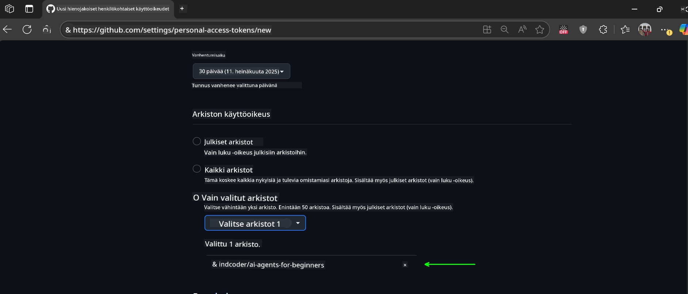

<!--
CO_OP_TRANSLATOR_METADATA:
{
  "original_hash": "c6a79c8f2b56a80370ff7e447765524f",
  "translation_date": "2025-07-24T08:34:54+00:00",
  "source_file": "00-course-setup/README.md",
  "language_code": "fi"
}
-->
# Kurssin Aloitus

## Johdanto

Tässä osiossa käsitellään, kuinka tämän kurssin koodiesimerkkejä ajetaan.

## Kloonaa tai haarauta tämä repositorio

Aloita kloonaamalla tai haarauttamalla GitHub-repositorio. Näin saat oman version kurssimateriaalista, jota voit ajaa, testata ja muokata!

Tämä onnistuu klikkaamalla linkkiä

Sinulla pitäisi nyt olla oma haarautettu versio tästä kurssista seuraavassa linkissä:


## Koodin suorittaminen

Tämä kurssi tarjoaa sarjan Jupyter Notebookeja, joiden avulla pääset käytännössä kokeilemaan AI-agenttien rakentamista.

Koodiesimerkit käyttävät joko:

**Vaatii GitHub-tilin - Ilmainen**:

1) Semantic Kernel Agent Framework + GitHub Models Marketplace. Merkitty nimellä (semantic-kernel.ipynb)
2) AutoGen Framework + GitHub Models Marketplace. Merkitty nimellä (autogen.ipynb)

**Vaatii Azure-tilauksen**:
3) Azure AI Foundry + Azure AI Agent Service. Merkitty nimellä (azureaiagent.ipynb)

Suosittelemme kokeilemaan kaikkia kolmea esimerkkiä nähdäksesi, mikä niistä sopii sinulle parhaiten.

Valitsemasi vaihtoehto määrittää, mitä asennusvaiheita sinun tulee noudattaa alla:

## Vaatimukset

- Python 3.12+
  - **HUOM**: Jos sinulla ei ole Python 3.12:ta asennettuna, varmista, että asennat sen. Luo sitten virtuaaliympäristösi (venv) käyttäen python3.12:ta varmistaaksesi, että requirements.txt-tiedostosta asennetaan oikeat versiot.
- GitHub-tili - Pääsy GitHub Models Marketplaceen
- Azure-tilaus - Pääsy Azure AI Foundryyn
- Azure AI Foundry -tili - Pääsy Azure AI Agent Serviceen

Repositorion juuresta löytyy `requirements.txt`-tiedosto, joka sisältää kaikki tarvittavat Python-paketit koodiesimerkkien suorittamiseen.

Voit asentaa ne suorittamalla seuraavan komennon terminaalissa repositorion juuressa:

```bash
pip install -r requirements.txt
```
Suosittelemme Python-virtuaaliympäristön luomista mahdollisten ristiriitojen ja ongelmien välttämiseksi.

## VSCode-asennus
Varmista, että käytät oikeaa Python-versiota VSCode:ssa.


## GitHub Models -esimerkkien asennus

### Vaihe 1: Hanki GitHubin henkilökohtainen käyttöoikeustunnus (PAT)

Tämä kurssi hyödyntää GitHub Models Marketplacea, joka tarjoaa ilmaisen pääsyn suuriin kielimalleihin (LLM), joita käytät AI-agenttien rakentamiseen.

GitHub-mallien käyttöön tarvitset [GitHubin henkilökohtaisen käyttöoikeustunnuksen](https://docs.github.com/en/authentication/keeping-your-account-and-data-secure/managing-your-personal-access-tokens).

Tämä onnistuu siirtymällä GitHub-tilillesi.

Noudata [vähimmän oikeuden periaatetta](https://docs.github.com/en/get-started/learning-to-code/storing-your-secrets-safely) luodessasi tunnusta. Tämä tarkoittaa, että sinun tulisi antaa tunnukselle vain ne oikeudet, joita tarvitaan tämän kurssin koodiesimerkkien suorittamiseen.

1. Valitse vasemmalta `Fine-grained tokens`.

    Valitse sitten `Generate new token`.

    

1. Anna tunnukselle kuvaava nimi, joka heijastaa sen tarkoitusta, jotta se on helppo tunnistaa myöhemmin. Aseta vanhenemispäivä (suositus: 30 päivää; voit valita lyhyemmän ajan, kuten 7 päivää, jos haluat turvallisemman vaihtoehdon).

    

1. Rajoita tunnuksen käyttöoikeus omaan haarautettuun repositorioosi.

    

1. Rajoita tunnuksen käyttöoikeuksia: Valitse **Permissions**-kohdasta **Account Permissions**, siirry kohtaan **Models** ja salli vain GitHub-mallien lukemiseen tarvittavat oikeudet.

    

    

Kopioi juuri luomasi tunnus. Lisää se nyt tämän kurssin mukana toimitettuun `.env`-tiedostoon.

### Vaihe 2: Luo `.env`-tiedosto

Luo `.env`-tiedosto suorittamalla seuraava komento terminaalissa.

```bash
cp .env.example .env
```

Tämä kopioi esimerkkitiedoston ja luo `.env`-tiedoston hakemistoosi, jossa täytät ympäristömuuttujien arvot.

Avaa `.env`-tiedosto suosikkieditorissasi ja liitä tunnuksesi `GITHUB_TOKEN`-kenttään.

Nyt sinun pitäisi pystyä suorittamaan tämän kurssin koodiesimerkit.

## Azure AI Foundry- ja Azure AI Agent Service -esimerkkien asennus

### Vaihe 1: Hanki Azure-projektin päätepiste

Noudata ohjeita hubin ja projektin luomiseksi Azure AI Foundryssa täältä: [Hub-resurssien yleiskatsaus](https://learn.microsoft.com/en-us/azure/ai-foundry/concepts/ai-resources)

Kun olet luonut projektisi, sinun tulee hakea projektisi yhteysmerkkijono.

Tämä onnistuu siirtymällä projektisi **Yleiskatsaus**-sivulle Azure AI Foundry -portaalissa.


### Vaihe 2: Luo `.env`-tiedosto

Luo `.env`-tiedosto suorittamalla seuraava komento terminaalissa.

```bash
cp .env.example .env
```

Tämä kopioi esimerkkitiedoston ja luo `.env`-tiedoston hakemistoosi, jossa täytät ympäristömuuttujien arvot.

Avaa `.env`-tiedosto suosikkieditorissasi ja liitä tunnuksesi `PROJECT_ENDPOINT`-kenttään.

### Vaihe 3: Kirjaudu sisään Azureen

Turvallisuuskäytännön mukaisesti käytämme [avaimetonta todennusta](https://learn.microsoft.com/azure/developer/ai/keyless-connections?tabs=csharp%2Cazure-cli?WT.mc_id=academic-105485-koreyst) Azure OpenAI:n todennukseen Microsoft Entra ID:n avulla.

Avaa seuraavaksi terminaali ja suorita `az login --use-device-code` kirjautuaksesi Azure-tilillesi.

Kun olet kirjautunut sisään, valitse tilauksesi terminaalissa.

## Lisäympäristömuuttujat - Azure Search ja Azure OpenAI

Agentic RAG -oppituntia (oppitunti 5) varten on esimerkkejä, jotka käyttävät Azure Searchia ja Azure OpenAI:ta.

Jos haluat suorittaa nämä esimerkit, sinun tulee lisätä seuraavat ympäristömuuttujat `.env`-tiedostoosi:

### Yleiskatsaus-sivu (Projekti)

- `AZURE_SUBSCRIPTION_ID` - Tarkista **Projektin tiedot** projektisi **Yleiskatsaus**-sivulta.

- `AZURE_AI_PROJECT_NAME` - Katso projektisi **Yleiskatsaus**-sivun yläosaa.

- `AZURE_OPENAI_SERVICE` - Löydät tämän **Sisältyvät ominaisuudet** -välilehdeltä kohdasta **Azure OpenAI Service** projektisi **Yleiskatsaus**-sivulla.

### Hallintakeskus

- `AZURE_OPENAI_RESOURCE_GROUP` - Siirry kohtaan **Projektin ominaisuudet** projektisi **Yleiskatsaus**-sivulla **Hallintakeskuksessa**.

- `GLOBAL_LLM_SERVICE` - **Liitetyt resurssit** -kohdassa etsi **Azure AI Services** -yhteyden nimi. Jos sitä ei ole listattu, tarkista **Azure-portaalista** resurssiryhmäsi AI Services -resurssin nimi.

### Mallit + päätepisteet -sivu

- `AZURE_OPENAI_EMBEDDING_DEPLOYMENT_NAME` - Valitse upotusmallisi (esim. `text-embedding-ada-002`) ja merkitse muistiin **Deployment name** mallin tiedoista.

- `AZURE_OPENAI_CHAT_DEPLOYMENT_NAME` - Valitse keskustelumallisi (esim. `gpt-4o-mini`) ja merkitse muistiin **Deployment name** mallin tiedoista.

### Azure-portaali

- `AZURE_OPENAI_ENDPOINT` - Etsi **Azure AI services**, klikkaa sitä, siirry kohtaan **Resurssien hallinta**, **Avaimet ja päätepiste**, selaa alas kohtaan "Azure OpenAI endpoints" ja kopioi "Language APIs" -päätepiste.

- `AZURE_OPENAI_API_KEY` - Kopioi samalta näytöltä AVAIN 1 tai AVAIN 2.

- `AZURE_SEARCH_SERVICE_ENDPOINT` - Etsi **Azure AI Search** -resurssisi, klikkaa sitä ja katso **Yleiskatsaus**.

- `AZURE_SEARCH_API_KEY` - Siirry kohtaan **Asetukset** ja sitten **Avaimet** kopioidaksesi ensisijaisen tai toissijaisen ylläpitäjän avaimen.

### Ulkoinen verkkosivu

- `AZURE_OPENAI_API_VERSION` - Vieraile [API-version elinkaari](https://learn.microsoft.com/en-us/azure/ai-services/openai/api-version-deprecation#latest-ga-api-release) -sivulla kohdassa **Latest GA API release**.

### Avaimeton todennus

Sen sijaan, että kovakoodaisimme tunnistetietosi, käytämme avaimetonta yhteyttä Azure OpenAI:n kanssa. Tätä varten tuomme `DefaultAzureCredential`-luokan ja kutsumme myöhemmin `DefaultAzureCredential`-funktiota saadaksemme tunnistetiedot.

```python
from azure.identity import DefaultAzureCredential, InteractiveBrowserCredential
```

## Jäikö jokin kohta epäselväksi?

Jos kohtaat ongelmia tämän asennuksen aikana, liity keskusteluumme

## Seuraava oppitunti

Olet nyt valmis suorittamaan tämän kurssin koodiesimerkit. Mukavia oppimishetkiä AI-agenttien maailmassa!

[Johdanto AI-agentteihin ja agenttien käyttötapauksiin](../01-intro-to-ai-agents/README.md)

**Vastuuvapauslauseke**:  
Tämä asiakirja on käännetty käyttämällä tekoälypohjaista käännöspalvelua [Co-op Translator](https://github.com/Azure/co-op-translator). Pyrimme tarkkuuteen, mutta huomioithan, että automaattiset käännökset voivat sisältää virheitä tai epätarkkuuksia. Alkuperäistä asiakirjaa sen alkuperäisellä kielellä tulisi pitää ensisijaisena lähteenä. Kriittisen tiedon osalta suositellaan ammattimaista ihmiskääntämistä. Emme ole vastuussa tämän käännöksen käytöstä johtuvista väärinkäsityksistä tai virhetulkinnoista.