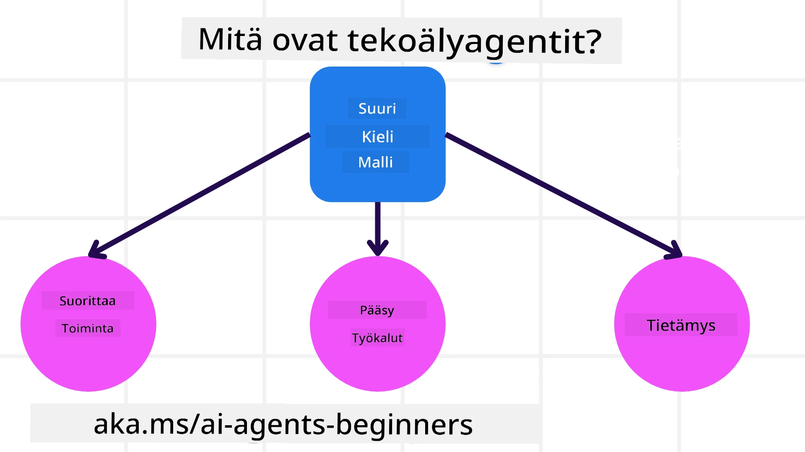
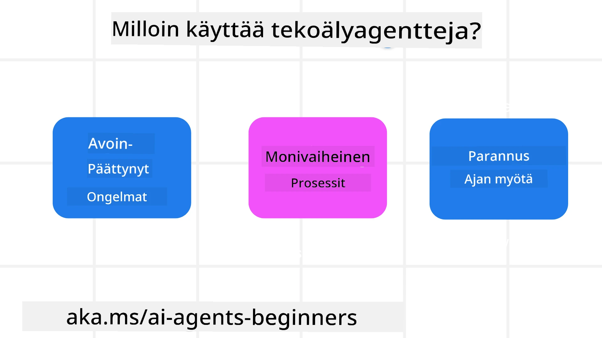

> _(Klikkaa yllä olevaa kuvaa katsoaksesi tämän oppitunnin videon)_

# Johdanto AI-agentteihin ja agenttien käyttötapauksiin

Tervetuloa "AI Agents for Beginners" -kurssille! Tämä kurssi tarjoaa perustietoa ja käytännön esimerkkejä AI-agenttien rakentamisesta.

Liity <a href="https://discord.gg/kzRShWzttr" target="_blank">Azure AI Discord Community</a> -yhteisöön tavataaksesi muita oppijoita ja AI-agenttien rakentajia sekä esittääksesi kysymyksiä tähän kurssiin liittyen.

Aloittaaksemme tämän kurssin, aloitamme ymmärtämällä paremmin, mitä AI-agentit ovat ja miten voimme käyttää niitä rakentamissamme sovelluksissa ja työnkuluissa.

## Johdanto

Tässä oppitunnissa käsitellään:

- Mitä AI-agentit ovat ja mitkä ovat eri tyyppisiä agentteja?
- Mitkä käyttötapaukset sopivat parhaiten AI-agenteille ja miten ne voivat auttaa meitä?
- Mitkä ovat joitakin perusrakenteita agenttiperusteisia ratkaisuja suunniteltaessa?

## Oppimistavoitteet
Oppitunnin suorittamisen jälkeen sinun pitäisi pystyä:

- Ymmärtämään AI-agenttien käsitteet ja miten ne eroavat muista AI-ratkaisuista.
- Soveltamaan AI-agentteja tehokkaasti.
- Suunnittelemaan agenttiperusteisia ratkaisuja tuottavasti sekä käyttäjille että asiakkaille.

## AI-agenttien määrittely ja agenttityypit

### Mitä AI-agentit ovat?

AI-agentit ovat **järjestelmiä**, jotka mahdollistavat **Suurten kielimallien (LLMs)** **toimintojen suorittamisen** laajentamalla niiden kyvykkyyksiä antamalla LLM:ille **pääsyn työkaluihin** ja **tietoon**.

Pilkotaan tätä määritelmää pienempiin osiin:

- **Järjestelmä** - On tärkeää ajatella agentteja ei vain yksittäisenä komponenttina, vaan monesta komponentista koostuvana järjestelmänä. Perustasolla AI-agentin komponentit ovat:
  - **Ympäristö** - Määritelty tila, jossa AI-agentti toimii. Esimerkiksi, jos meillä olisi matkavarauksen AI-agentti, ympäristö voisi olla matkavarauksessa käytettävä järjestelmä, jota agentti käyttää tehtävien suorittamiseen.
  - **Sensorit** - Ympäristöt sisältävät tietoa ja antavat palautetta. AI-agentit käyttävät sensoreita kerätäkseen ja tulkitakseen tietoa nykyisestä ympäristön tilasta. Matkavarauksen agenttiesimerkissä varausjärjestelmä voi antaa tietoja kuten hotellien saatavuudesta tai lentojen hinnoista.
  - **Aktuaattorit** - Kun AI-agentti vastaanottaa ympäristön nykytilan, agentti määrittää kyseistä tehtävää varten, mitä toimintoa suoritetaan ympäristön muuttamiseksi. Matkavarauksen agentilla se voisi olla käyttäjän puolesta varatun saatavilla olevan huoneen varaaminen.

**Suurten kielimallien** - Agenttien käsite oli olemassa ennen LLMien syntyä. Etu AI-agenttien rakentamisessa LLM:ien avulla on niiden kyky tulkita ihmiskieltä ja dataa. Tämä kyky mahdollistaa LLM:ien tulkita ympäristön tietoja ja määritellä suunnitelman ympäristön muuttamiseksi.

**Toimintojen suorittaminen** - AI-agenttijärjestelmien ulkopuolella LLM:t rajoittuvat tilanteisiin, joissa toiminto tarkoittaa sisällön tai tiedon tuottamista käyttäjän kehotteen perusteella. AI-agenttijärjestelmissä LLM:t voivat suorittaa tehtäviä tulkitsemalla käyttäjän pyyntöä ja käyttämällä ympäristössä saatavilla olevia työkaluja.

**Pääsy työkaluihin** - Millaisiin työkaluihin LLM:llä on pääsy määritellään 1) ympäristön perusteella, jossa se toimii ja 2) AI-agentin kehittäjän toimesta. Matka-agenttiesimerkissämme agentin työkalut rajoittuvat varausjärjestelmän käytettävissä oleviin toimintoihin, ja/tai kehittäjä voi rajoittaa agentin työkalupääsyä esimerkiksi koskemaan vain lentoja.

**Muisti + tieto** - Muisti voi olla lyhytaikaista keskustelun kontekstissa käyttäjän ja agentin välillä. Pitkällä aikavälillä, ympäristön tarjoaman tiedon ulkopuolella, AI-agentit voivat myös hakea tietoa muista järjestelmistä, palveluista, työkaluista ja jopa muilta agenteilta. Matkavarauksen esimerkissä tämä tieto voisi olla käyttäjän matkustusehdotukset, jotka sijaitsevat asiakasrekisterissä.

### Eri agenttityypit

Nyt kun meillä on yleinen määritelmä AI-agenteille, katsotaan joitakin erityisiä agenttityyppejä ja miten niitä sovellettaisiin matkavarauksen AI-agenttiin.

| **Agentin tyyppi**            | **Kuvaus**                                                                                                                            | **Esimerkki**                                                                                                                                                                                                                |
| ----------------------------- | ------------------------------------------------------------------------------------------------------------------------------------- | ---------------------------------------------------------------------------------------------------------------------------------------------------------------------------------------------------------------------------- |
| **Yksinkertaiset refleksiagentit** | Suorittavat välittömiä toimintoja ennalta määriteltyjen sääntöjen perusteella.                                                          | Matka-agentti tulkitsee sähköpostin kontekstin ja välittää matkustusvalitukset asiakaspalveluun.                                                                                                                             |
| **Mallipohjaiset refleksiagentit** | Suorittavat toimintoja maailman mallin ja mallin muutosten perusteella.                                                               | Matka-agentti priorisoi reittejä, joilla on merkittäviä hintamuutoksia, koska sillä on pääsy historiallisten hintojen tietoihin.                                                                                             |
| **Tavoitepohjaiset agentit**       | Laativat suunnitelmia tiettyjen tavoitteiden saavuttamiseksi tulkitsemalla tavoitetta ja määrittämällä toimet sen saavuttamiseksi.     | Matka-agentti varaa matkan määrittämällä tarvittavat matkajärjestelyt (auto, julkinen liikenne, lennot) lähtöpaikasta määränpäähän.                                                                                          |
| **Hyötypohjaiset agentit**         | Ottavat huomioon mieltymykset ja punnitsevat kompromisseja numeerisesti päättääkseen, miten tavoitteet saavutetaan.                    | Matka-agentti maksimoi hyötyä punnitsemalla mukavuuden ja kustannusten välistä tasapainoa matkavarauksia tehdessään.                                                                                                         |
| **Oppivat agentit**               | Parantavat toimintaansa ajan myötä reagoimalla palautteeseen ja säätämällä toimintojaan sen mukaisesti.                               | Matka-agentti paranee käyttämällä asiakkaiden palautetta matkan jälkeisistä kyselyistä tehdäkseen muutoksia tuleviin varauksiin.                                                                                             |
| **Hierarkkiset agentit**          | Sisältävät useita agenteja kerrostetussa järjestelmässä, jossa korkeammat agentit jakavat tehtävät pienempiin tehtäviin alempien agenttien suoritettaviksi. | Matka-agentti peruuttaa matkan jakamalla tehtävän alatehtäviin (esim. yksittäisten varausten peruminen) ja antaa alempien tasojen agenttien suorittaa ne ja raportoida takaisin ylemmälle agentille.                             |
| **Moni-agenttijärjestelmät (MAS)** | Agentit suorittavat tehtäviä itsenäisesti, joko yhteistyössä tai kilpailussa.                                                         | Yhteistyö: Useat agentit varaavat tiettyjä matkustuspalveluja, kuten hotelleja, lentoja ja viihdettä. Kilpailu: Useat agentit hallinnoivat ja kilpailevat jaetusta hotellivarauskalenterista varatakseen asiakkaita hotelliin. |

## Milloin käyttää AI-agentteja

Aiemmassa osiossa käytimme matkatoimiston käyttötapausta selittämään, miten eri tyyppisiä agenteja voidaan käyttää erilaisissa matkavarauksen tilanteissa. Jatkamme tämän sovelluksen käyttöä koko kurssin ajan.

Katsotaan, millaisiin käyttötapauksiin AI-agentit sopivat parhaiten:

- **Avoimet ongelmat** - antaa LLM:lle mahdollisuuden määrittää tarvittavat vaiheet tehtävän suorittamiseksi, koska niitä ei aina voida kovakoodata työnkulkuun.
- **Monivaiheiset prosessit** - tehtävät, jotka vaativat tietyn tason monimutkaisuutta, jossa AI-agentin täytyy käyttää työkaluja tai tietoa useiden vuorojen aikana yhden haun sijaan.  
- **Parantuminen ajan myötä** - tehtävät, joissa agentti voi parantaa toimintaansa ajan myötä vastaanottamalla palautetta joko ympäristöltä tai käyttäjiltä tarjotakseen paremman hyödyn.

Käsittelemme lisää huomioitavia seikkoja AI-agenttien käytöstä luotettavien AI-agenttien rakentaminen -oppitunnissa.

## Agenttiperusteisten ratkaisujen perusteet

### Agentin kehitys

Ensimmäinen vaihe AI-agenttijärjestelmän suunnittelussa on työkalujen, toimintojen ja käyttäytymisten määrittäminen. Tässä kurssissa keskitymme käyttämään **Azure AI Agent Service** -palvelua agenttiemme määrittelyyn. Se tarjoaa ominaisuuksia kuten:

- Avoimien mallien valinta, kuten OpenAI, Mistral ja Llama
- Lisensoidun datan käyttö palveluntarjoajilta, kuten Tripadvisor
- Standardoitujen OpenAPI 3.0 -työkalujen käyttö

### Agenttiperusteiset mallit

Kommunikaatio LLM:ien kanssa tapahtuu kehotteiden kautta. Koska AI-agentit ovat osittain itsenäisiä, ei aina ole mahdollista tai tarpeen lähettää LLM:lle uutta kehotetta manuaalisesti ympäristön muuttuessa. Käytämme **agenttiperusteisia malleja**, jotka mahdollistavat LLM:lle kehotteiden antamisen usean vaiheen ajan skaalautuvammalla tavalla.

Tämä kurssi on jaettu joihinkin nykyisiin suosittuihin agenttiperusteisiin malleihin.

### Agenttikehykset

Agenttikehykset mahdollistavat kehittäjille agenttiperusteisten mallien toteuttamisen koodin kautta. Nämä kehykset tarjoavat malleja, lisäosia ja työkaluja paremman AI-agenttien yhteistyön toteuttamiseksi. Nämä hyödyt tarjoavat paremmat mahdollisuudet havaittavuuteen ja vianmääritykseen AI-agenttijärjestelmissä.

Tässä kurssissa tutustumme Microsoft Agent Frameworkiin (MAF) tuotantovalmiiden AI-agenttien rakentamista varten.

## Esimerkkikoodit

- Python: [Agent Framework](./code_samples/01-python-agent-framework.ipynb)
- .NET: [Agent Framework](./code_samples/01-dotnet-agent-framework.md)

## Onko sinulla lisää kysymyksiä AI-agenteista?

Liity [Microsoft Foundry Discord](https://aka.ms/ai-agents/discord) -kanavalle tavataaksesi muita oppijoita, osallistuaksesi toimistoaikoihin ja saadaksesi vastauksia AI-agentteja koskeviin kysymyksiisi.

## Edellinen oppitunti

[Course Setup](../00-course-setup/README.md)

## Seuraava oppitunti

[Exploring Agentic Frameworks](../02-explore-agentic-frameworks/README.md)

---

<!-- CO-OP TRANSLATOR DISCLAIMER START -->
Vastuuvapauslauseke:
Tämä asiakirja on käännetty tekoälypohjaisella käännöspalvelulla [Co-op Translator](https://github.com/Azure/co-op-translator). Vaikka pyrimme täsmällisyyteen, otathan huomioon, että automaattiset käännökset saattavat sisältää virheitä tai epätarkkuuksia. Alkuperäistä asiakirjaa sen alkuperäisellä kielellä tulee pitää virallisena lähteenä. Tärkeissä asioissa suositellaan ammattimaisen kääntäjän tekemää käännöstä. Emme ole vastuussa tämän käännöksen käytöstä aiheutuvista väärinymmärryksistä tai virhetulkinnoista.
<!-- CO-OP TRANSLATOR DISCLAIMER END -->