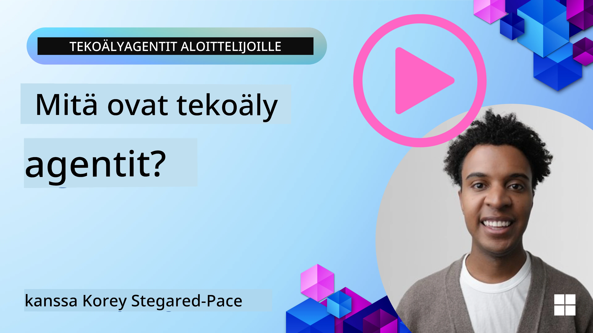
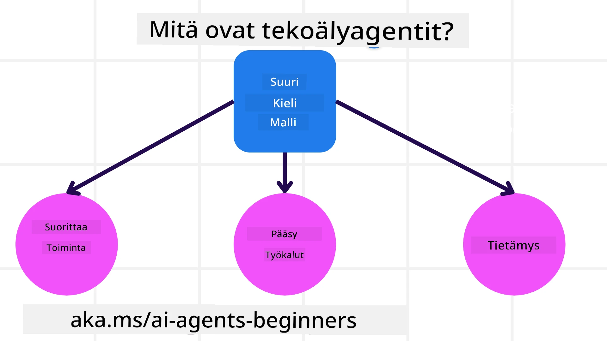
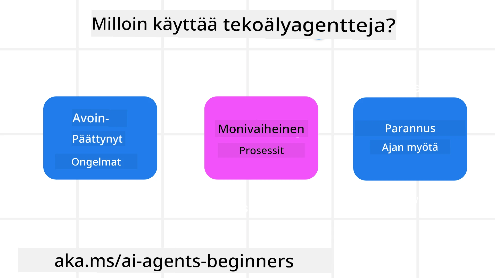

> _(Klikkaa yllä olevaa kuvaa katsoaksesi videon tältä oppitunnilta)_

# Johdanto tekoälyagentteihin ja agenttien käyttötapauksiin

Tervetuloa **AI Agents for Beginners** -kurssille! Tämä kurssi antaa sinulle perustiedot — sekä toimivan koodin — aloittaaksesi tekoälyagenttien rakentamisen alusta alkaen.

Tule sanomaan hei <a href="https://discord.gg/kzRShWzttr" target="_blank">Azure AI Discord -yhteisöön</a> — se on täynnä oppijoita ja tekoälyn rakentajia, jotka mielellään vastaavat kysymyksiin.

Ennen kuin ryhdymme rakentamaan, varmistetaan ensin, että ymmärrämme mitä tekoälyagentti *on* ja milloin sen käyttö on järkevää.

---

## Johdanto

Tämä oppitunti kattaa:

- Mitä tekoälyagentit ovat ja mitä eri tyyppejä niitä on
- Mihin tehtäviin tekoälyagentit sopivat parhaiten
- Keskeiset rakennuspalikat, joita käytät suunnitellessasi agenttipohjaista ratkaisua

## Oppimistavoitteet

Tämän oppitunnin lopuksi sinun tulisi pystyä:

- Selittämään, mitä tekoälyagentti on ja miten se eroaa tavallisesta tekoälyratkaisusta
- Tietämään, milloin kannattaa käyttää tekoälyagenttia (ja milloin ei)
- Luonnostelemaan perus agenttipohjainen ratkaisusuunnitelma todellisen maailman ongelmaan

---

## Tekoälyagenttien määrittely ja tekoälyagenttien tyypit

### Mitä tekoälyagentit ovat?

Tässä yksinkertainen tapa ajatella sitä:

> **Tekoälyagentit ovat järjestelmiä, jotka antavat suurille kielimalleille (LLM) mahdollisuuden *tehdä asioita* — antamalla niille työkaluja ja tietoa toimia maailmassa, eivät vain vastata pyyntöihin.**

Puretaan tätä hieman:

- **Järjestelmä** — Tekoälyagentti ei ole vain yksi asia. Se on koostumus osista, jotka toimivat yhdessä. Jokaisella agentilla on ytimessään kolme osaa:
  - **Ympäristö** — tila, jossa agentti toimii. Matkavarausagentin ympäristö on itse varausalusta.
  - **Sensorit** — miten agentti lukee ympäristön nykytilaa. Matkavarausagentti saattaa tarkistaa hotellien saatavuuden tai lentojen hinnat.
  - **Vaikuttimet** — miten agentti suorittaa toimia. Matkavarausagentti voi varata huoneen, lähettää vahvistuksen tai peruuttaa varauksen.

- **Suuret kielimallit** — Agentit olivat olemassa ennen suuria kielimalleja, mutta juuri LLM:t tekevät moderneista agenteista niin tehokkaita. Ne ymmärtävät luonnollista kieltä, ymmärtävät kontekstia ja pystyvät muuttamaan epäselvän käyttäjäpyynnön konkreettiseksi toimintasuunnitelmaksi.

- **Toimintojen suorittaminen** — Ilman agenttijärjestelmää LLM vain tuottaa tekstiä. Agenttijärjestelmän sisällä LLM voi oikeasti *suorittaa* vaiheita — etsiä tietokannasta, kutsua API:a, lähettää viestin.

- **Työkalujen käyttö** — Mitä työkaluja agentti voi käyttää, riippuu (1) missä ympäristössä se toimii ja (2) mitä kehittäjä on sille antanut. Matkavarausagentti saattaa pystyä etsimään lentoja, mutta ei muokkaamaan asiakastietoja — kaikki riippuu siitä, miten se on kytketty.

- **Muisti + Tieto** — agenteilla voi olla lyhytaikainen muisti (nykyinen keskustelu) ja pitkäaikainen muisti (asiakastietokanta, aiemmat vuorovaikutukset). Matkavarausagentti voi "muistaa", että suosittelet ikkunapaikkoja.

---

### Eri tekoälyagenttityypit

Kaikki agentit eivät ole samanlaisia. Tässä eri päätyypit matkavarausagentin esimerkin avulla:

| **Agenttityyppi** | **Mitä se tekee** | **Matkavarausagentin esimerkki** |
|---|---|---|
| **Yksinkertaiset refleksiagentit** | Seuraa kovakoodattuja sääntöjä — ei muistia, ei suunnittelua. | Näkee valitusviestin → lähettää sen asiakaspalveluun. Siinä kaikki. |
| **Mallipohjaiset refleksiagentit** | Pitää sisäistä mallia maailmasta ja päivittää sitä muutosten mukaan. | Seuraa lentojen historiallisia hintoja ja merkitsee reitit, jotka ovat yhtäkkiä kalliita. |
| **Tavoitepohjaiset agentit** | On tavoite mielessä ja suunnittelee askel askeleelta sen saavuttamiseksi. | Varaa koko matkan (lennot, auton, hotellin) alkaen nykyisestä sijainnistasi ja päämäärääsi saakka. |
| **Hyötypohjaiset agentit** | Ei etsi vain *jotain* ratkaisua, vaan *parhaan* punniten kompromisseja. | Tasapainottaa kustannuksia ja mukavuutta löytääkseen matkan, joka on parhaimmin mieltymyksillesi sopiva. |
| **Oppivat agentit** | Paranee ajan myötä oppimalla palautteesta. | Säätää tulevia varaus-suosituksia jälkikyselyiden tulosten perusteella. |
| **Hierarkkiset agentit** | Korkeamman tason agentti jakaa työn alatehtäviin ja delegoi alemmille agenteille. | "Peruuta matka" -pyyntö jaetaan: lennon peruutus, hotellin peruutus, auton vuokrauksen peruutus — kukin hoidetaan alajaetun agentin toimesta. |
| **Moniagenttijärjestelmät (MAS)** | Useita itsenäisiä agenteja työskentelee yhdessä (tai kilpaillen). | Yhteistyö: eri agentit hoitavat hotellit, lennot ja viihteen. Kilpailu: useat agentit kilpailevat täyttääkseen hotellihuoneita parhaaseen hintaan. |

---

## Milloin käyttää tekoälyagentteja

Pelkkä se, että voit käyttää tekoälyagenttia, ei tarkoita, että sinun aina pitäisi. Tässä tilanteet, joissa agentit todella loistavat:

- **Avoimet ongelmat** — kun ongelman ratkaisuvaiheita ei voi ohjelmoida etukäteen. LLM:n täytyy pystyä löytämään polku dynaamisesti.
- **Monivaiheiset prosessit** — tehtävät, jotka vaativat työkalujen käyttöä useiden vuorojen aikana, eivät pelkkää yhtä tiedonhakua tai generointia.
- **Parantuminen ajan myötä** — kun haluat järjestelmän kehittyvän älykkäämmäksi käyttäjäpalautteen tai ympäristön signaalien perusteella.

Tutustumme myöhemmin kurssilla lähemmin siihen, milloin (ja milloin *ei*) kannattaa käyttää tekoälyagentteja **Rakennetaan luotettavia tekoälyagentteja** -opetuksessa.

---

## Agenttipohjaisten ratkaisujen perusteet

### Agentin kehitys

Ensimmäinen asia agenttia rakentaessa on määritellä *mitä se voi tehdä* — sen työkalut, toiminnot ja käyttäytymiset.

Tässä kurssissa käytämme pääalustana **Azure AI Agent Service** -palvelua. Se tukee:

- Malleja tarjoajilta kuten OpenAI, Mistral ja Meta (Llama)
- Lisensoituja tietoja tarjoajilta kuten Tripadvisor
- Standardoituja OpenAPI 3.0 -työkalumääritelmiä

### Agenttipatternit

Viestit LLM:lle käskytetään kehotteiden kautta. Agenttien kanssa et voi aina tehdä kaikkia käskyjä käsin — agentin täytyy toimia monivaiheisesti. Tähän tulevat **Agenttipatternit**. Ne ovat uudelleenkäytettäviä strategioita, joiden avulla voit ohjata ja orkestroida LLM:ää skaalautuvammin ja luotettavammin.

Tämä kurssi on rakennettu yleisimpien ja hyödyllisimpien agenttipatternien ympärille.

### Agenttikehykset

Agenttikehykset tarjoavat kehittäjille valmiita malleja, työkaluja ja infrastruktuuria agenttien rakentamiseen. Niiden avulla on helpompi:

- Yhdistää työkaluja ja toimintoja
- Tarkkailla, mitä agentti tekee (ja virheenkorjaus)
- Tehdä yhteistyötä useiden agenttien kesken

Tässä kurssissa keskitymme **Microsoft Agent Framework (MAF)** -kehykseen tuotantovalmiiden agenttien rakentamiseen.

---

## Koodiesimerkit

Valmiina näkemään toiminnassa? Tässä tämän oppitunnin koodiesimerkit:

- 🐍 Python: [Agent Framework](./code_samples/01-python-agent-framework.ipynb)
- 🔷 .NET: [Agent Framework](./code_samples/01-dotnet-agent-framework.md)

---

## Onko kysyttävää?

Liity [Microsoft Foundry Discordiin](https://discord.com/invite/ATgtXmAS5D) yhdistääksesi muihin oppijoihin, osallistu toimistotunteihin ja saa vastauksia AI-agentteihin liittyviin kysymyksiisi yhteisöltä.

---

## Edellinen oppitunti

[Kurssin aloitus](../00-course-setup/README.md)

## Seuraava oppitunti

[Tutustutaan agenttikehyksiin](../02-explore-agentic-frameworks/README.md)

---

<!-- CO-OP TRANSLATOR DISCLAIMER START -->
**Vastuuvapauslauseke**:
Tämä asiakirja on käännetty käyttämällä tekoälypohjaista käännöspalvelua [Co-op Translator](https://github.com/Azure/co-op-translator). Vaikka pyrimme tarkkuuteen, otathan huomioon, että automaattiset käännökset saattavat sisältää virheitä tai epätarkkuuksia. Alkuperäinen asiakirja sen alkuperäiskielellä on virallinen lähde. Tärkeissä asioissa suositellaan ammattimaista ihmiskäännöstä. Emme ole vastuussa tämän käännöksen käytöstä aiheutuvista väärinymmärryksistä tai tulkinnoista.
<!-- CO-OP TRANSLATOR DISCLAIMER END -->