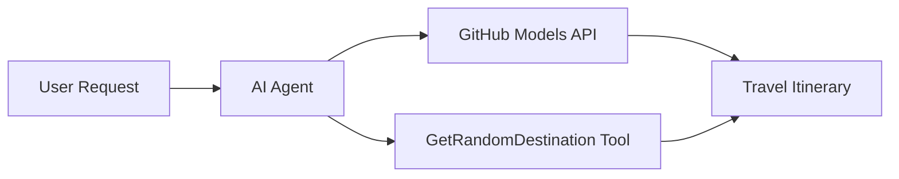

<!--
CO_OP_TRANSLATOR_METADATA:
{
  "original_hash": "23afd9be7b6ba5b69a44c3b6a78e07f6",
  "translation_date": "2025-11-06T10:04:57+00:00",
  "source_file": "01-intro-to-ai-agents/code_samples/01-dotnet-agent-framework.md",
  "language_code": "fi"
}
-->
# 🌍 AI-matkatoimisto Microsoft Agent Frameworkilla (.NET)

## 📋 Skenaarion yleiskuvaus

Tämä muistikirja näyttää, kuinka rakentaa älykäs matkasuunnittelija Microsoft Agent Frameworkin avulla .NET-ympäristössä. Agentti voi automaattisesti luoda henkilökohtaisia päiväretkien matkasuunnitelmia satunnaisiin kohteisiin ympäri maailmaa.

**Keskeiset ominaisuudet:**
- 🎲 **Satunnaisen kohteen valinta**: Käyttää mukautettua työkalua lomakohteiden valintaan
- 🗺️ **Älykäs matkasuunnittelu**: Luo yksityiskohtaisia päiväkohtaisia matkasuunnitelmia
- 🔄 **Reaaliaikainen suoratoisto**: Tukee sekä välittömiä että suoratoistovastauksia
- 🛠️ **Mukautettu työkalujen integrointi**: Näyttää, kuinka agentin ominaisuuksia voi laajentaa

## 🔧 Tekninen arkkitehtuuri

### Keskeiset teknologiat
- **Microsoft Agent Framework**: Uusin .NET-toteutus tekoälyagenttien kehittämiseen
- **GitHub Models -integraatio**: Käyttää GitHubin AI-mallien inferenssipalvelua
- **OpenAI API -yhteensopivuus**: Hyödyntää OpenAI:n asiakaskirjastoja mukautetuilla päätepisteillä
- **Turvallinen konfigurointi**: API-avainten hallinta ympäristömuuttujien avulla

### Keskeiset komponentit
1. **AIAgent**: Pääagentti, joka hallinnoi keskustelun kulkua
2. **Mukautetut työkalut**: `GetRandomDestination()`-funktio agentin käytettävissä
3. **Chat Client**: GitHub Models -pohjainen keskusteluliittymä
4. **Suoratoistotuki**: Reaaliaikaisen vastausten generoinnin mahdollistaminen

### Integraatiomalli


## 🚀 Aloitus

**Edellytykset:**
- .NET 10.0 tai uudempi
- GitHub Models API -pääsytunnus
- Ympäristömuuttujat konfiguroitu `.env`-tiedostoon

**Vaaditut ympäristömuuttujat:**
```env
GITHUB_TOKEN=your_github_token
GITHUB_ENDPOINT=https://models.inference.ai.azure.com
GITHUB_MODEL_ID=gpt-4o-mini
```

Suorita alla oleva koodiesimerkki järjestyksessä nähdäksesi matkatoimiston toiminnassa!

---

## .NET Yksittäinen tiedostosovellus: Esimerkki AI-matkatoimistosta

Katso `01-dotnet-agent-framework.cs` saadaksesi täydellisen ajettavan koodiesimerkin.

```bash
dotnet run 01-dotnet-agent-framework.cs
```

### Esimerkkikoodi

```csharp
static string GetRandomDestination()
{
    var destinations = new List<string>
    {
        "Paris, France",
        "Tokyo, Japan",
        "New York City, USA",
        "Sydney, Australia",
        "Rome, Italy",
        "Barcelona, Spain",
        "Cape Town, South Africa",
        "Rio de Janeiro, Brazil",
        "Bangkok, Thailand",
        "Vancouver, Canada"
    };
    var random = new Random();
    int index = random.Next(destinations.Count);
    return destinations[index];
}

// Extract configuration from environment variables
var github_endpoint = Environment.GetEnvironmentVariable("GITHUB_ENDPOINT") ?? throw new InvalidOperationException("GITHUB_ENDPOINT is not set.");
var github_model_id = Environment.GetEnvironmentVariable("GITHUB_MODEL_ID") ?? "gpt-4o-mini";
var github_token = Environment.GetEnvironmentVariable("GITHUB_TOKEN") ?? throw new InvalidOperationException("GITHUB_TOKEN is not set.");

// Configure OpenAI Client Options
var openAIOptions = new OpenAIClientOptions()
{
    Endpoint = new Uri(github_endpoint)
};

// Initialize OpenAI Client with GitHub Models Configuration
var openAIClient = new OpenAIClient(new ApiKeyCredential(github_token), openAIOptions);

// Create AI Agent with Travel Planning Capabilities
AIAgent agent = openAIClient
    .GetChatClient(github_model_id)
    .CreateAIAgent(
        instructions: "You are a helpful AI Agent that can help plan vacations for customers at random destinations",
        tools: [AIFunctionFactory.Create(GetRandomDestination)]
    );

// Execute Agent: Plan a Day Trip (Non-Streaming)
Console.WriteLine(await agent.RunAsync("Plan me a day trip"));

// Execute Agent: Plan a Day Trip (Streaming Response)
await foreach (var update in agent.RunStreamingAsync("Plan me a day trip"))
{
    Console.Write(update);
}
```

---

**Vastuuvapauslauseke**:  
Tämä asiakirja on käännetty käyttämällä tekoälypohjaista käännöspalvelua [Co-op Translator](https://github.com/Azure/co-op-translator). Vaikka pyrimme tarkkuuteen, huomioithan, että automaattiset käännökset voivat sisältää virheitä tai epätarkkuuksia. Alkuperäinen asiakirja sen alkuperäisellä kielellä tulisi pitää ensisijaisena lähteenä. Tärkeissä tiedoissa suositellaan ammattimaista ihmiskäännöstä. Emme ole vastuussa väärinkäsityksistä tai virhetulkinnoista, jotka johtuvat tämän käännöksen käytöstä.