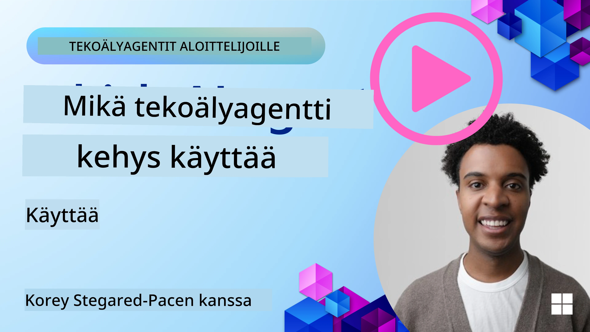

[](https://youtu.be/ODwF-EZo_O8?si=1xoy_B9RNQfrYdF7)

> _(Napsauta yllä olevaa kuvaa nähdäksesi tämän oppitunnin videon)_

# Tutustu tekoälyagenttikehyksiin

Tekoälyagenttikehykset ovat ohjelmistoalustoja, jotka on suunniteltu yksinkertaistamaan tekoälyagenttien luomista, käyttöönottoa ja hallintaa. Nämä kehykset tarjoavat kehittäjille valmiita komponentteja, abstraktioita ja työkaluja, jotka sujuvoittavat monimutkaisten tekoälyjärjestelmien kehitystä.

Nämä kehykset auttavat kehittäjiä keskittymään sovellustensa ainutlaatuisiin osa-alueisiin tarjoamalla standardoituja lähestymistapoja tekoälyagenttien kehityksen yleisiin haasteisiin. Ne parantavat järjestelmien skaalautuvuutta, saavutettavuutta ja tehokkuutta.

## Johdanto 

Tässä oppitunnissa käsitellään:

- Mitä tekoälyagenttikehykset ovat ja mitä ne mahdollistavat kehittäjille?
- Miten tiimit voivat käyttää näitä nopeasti prototypoimaan, iteromaan, ja parantamaan agentin kyvykkyyksiä?
- Mitkä ovat Microsoftin luomien kehysten ja työkalujen erot (<a href="https://aka.ms/ai-agents-beginners/ai-agent-service" target="_blank">Azure AI Agent Service</a> and the <a href="https://learn.microsoft.com/azure/ai-services/openai/how-to/responses" target="_blank">Microsoft Agent Framework</a>)?
- Voinko integroida olemassa olevat Azure-ekosysteemityökaluni suoraan, vai tarvitseeko minun käyttää itsenäisiä ratkaisuja?
- Mikä on Azure AI Agents -palvelu ja miten se auttaa minua?

## Oppimistavoitteet

Tämän oppitunnin tavoitteena on auttaa sinua ymmärtämään:

- Tekoälyagenttikehysten rooli tekoälykehityksessä.
- Miten hyödyntää tekoälyagenttikehyksiä älykkäiden agenttien rakentamiseen.
- Keskeiset kyvykkyydet, joita tekoälyagenttikehykset mahdollistavat.
- Eroavaisuudet Microsoft Agent Frameworkin ja Azure AI Agent Servicen välillä.

## Mitä tekoälyagenttikehykset ovat ja mitä ne mahdollistavat kehittäjille?

Perinteiset tekoälykehykset voivat auttaa sinua integroimaan tekoälyn sovelluksiisi ja parantamaan sovelluksia seuraavilla tavoilla:

- **Personalisointi**: Tekoäly voi analysoida käyttäjän käyttäytymistä ja mieltymyksiä tarjotakseen personoituja suosituksia, sisältöä ja kokemuksia.
Example: Streaming services like Netflix use AI to suggest movies and shows based on viewing history, enhancing user engagement and satisfaction.
- **Automaatio ja tehokkuus**: Tekoäly voi automatisoida toistuvia tehtäviä, sujuvoittaa työnkulkuja ja parantaa toiminnallista tehokkuutta.
Example: Customer service apps use AI-powered chatbots to handle common inquiries, reducing response times and freeing up human agents for more complex issues.
- **Parannettu käyttäjäkokemus**: Tekoäly voi parantaa kokonaisvaltaista käyttäjäkokemusta tarjoamalla älykkäitä ominaisuuksia kuten puheentunnistus, luonnollisen kielen käsittely ja ennustava teksti.
Example: Virtual assistants like Siri and Google Assistant use AI to understand and respond to voice commands, making it easier for users to interact with their devices.

### Kuulostaa hienolta — miksi sitten tarvitsemme tekoälyagenttikehystä?

Tekoälyagenttikehykset edustavat enemmän kuin pelkkiä tekoälykehyksiä. Ne on suunniteltu mahdollistamaan älykkäiden agenttien luomisen, jotka voivat olla vuorovaikutuksessa käyttäjien, muiden agenttien ja ympäristön kanssa tiettyjen tavoitteiden saavuttamiseksi. Nämä agentit voivat osoittaa autonomista käyttäytymistä, tehdä päätöksiä ja sopeutua muuttuviin olosuhteisiin. Tarkastellaan muutamia keskeisiä kyvykkyyksiä, joita tekoälyagenttikehykset tarjoavat:

- **Agenttien yhteistyö ja koordinointi**: Mahdollistaa useiden tekoälyagenttien luomisen, jotka voivat työskennellä yhdessä, kommunikoida ja koordinoida ratkaistakseen monimutkaisia tehtäviä.
- **Tehtävien automaatio ja hallinta**: Tarjoaa mekanismeja monivaiheisten työnkulkujen automatisointiin, tehtävien delegointiin ja dynaamiseen tehtävähallintaan agenttien kesken.
- **Kontekstuaalinen ymmärrys ja sopeutuminen**: Varustaa agentit kyvyllä ymmärtää kontekstia, sopeutua muuttuviin ympäristöihin ja tehdä päätöksiä reaaliaikaisen tiedon perusteella.

Yhteenvetona: agentit antavat sinun tehdä enemmän, viedä automaation seuraavalle tasolle ja luoda älykkäämpiä järjestelmiä, jotka voivat sopeutua ja oppia ympäristöstään.

## Miten nopeasti prototypoida, iteroda ja parantaa agentin kyvykkyyksiä?

Tämä ala kehittyy nopeasti, mutta useimmissa tekoälyagenttikehyksissä on yhteisiä piirteitä, jotka auttavat nopeasti prototypoimaan ja iteromaan — nimittäin modulaariset komponentit, yhteistyötyökalut ja reaaliaikainen oppiminen. Sukelletaan näihin:

- **Käytä modulaarisia komponentteja**: SDK:t tarjoavat valmiiksi rakennettuja komponentteja, kuten AI- ja muistikonnektoreita, funktiokutsuja luonnollisen kielen tai koodilisäosien avulla, kehotemalleja ja muuta.
- **Hyödynnä yhteistyötyökaluja**: Suunnittele agentteja spesifisillä rooleilla ja tehtävillä, jolloin ne voivat testata ja hioa yhteistyön työnkulkuja.
- **Opiskele reaaliajassa**: Toteuta palautesilmukoita, joissa agentit oppivat vuorovaikutuksista ja säätävät käyttäytymistään dynaamisesti.

### Käytä modulaarisia komponentteja

SDK:t kuten Microsoft Agent Framework tarjoavat valmiiksi rakennettuja komponentteja, kuten AI-konnektoreita, työkalumääritelmiä ja agenttien hallintaa.

**Miten tiimit voivat käyttää näitä**: Tiimit voivat nopeasti koota nämä komponentit toimivaksi prototyypiksi ilman, että kaikkea tarvitsee rakentaa alusta alkaen, mikä mahdollistaa nopean kokeilun ja iteroinnin.

**Miten se toimii käytännössä**: Voit käyttää valmiiksi rakennettua parseria käyttäjän syötteen tietojen poimintaan, muistimoduulia tietojen tallentamiseen ja hakemiseen sekä kehotegeneraattoria vuorovaikutukseen käyttäjän kanssa — kaikki ilman, että sinun tarvitsee rakentaa näitä komponentteja tyhjästä.

**Esimerkkikoodi**. Tarkastellaan esimerkkiä siitä, miten voit käyttää Microsoft Agent Frameworkia `AzureAIProjectAgentProvider`-kanssa, jotta malli vastaa käyttäjän syötteisiin työkalukutsujen avulla:

``` python
# Microsoft Agent Framework Python -esimerkki

import asyncio
import os
from typing import Annotated

from agent_framework.azure import AzureAIProjectAgentProvider
from azure.identity import AzureCliCredential


# Määrittele esimerkkityökalu matkavarauksen tekemiseen
def book_flight(date: str, location: str) -> str:
    """Book travel given location and date."""
    return f"Travel was booked to {location} on {date}"


async def main():
    provider = AzureAIProjectAgentProvider(credential=AzureCliCredential())
    agent = await provider.create_agent(
        name="travel_agent",
        instructions="Help the user book travel. Use the book_flight tool when ready.",
        tools=[book_flight],
    )

    response = await agent.run("I'd like to go to New York on January 1, 2025")
    print(response)
    # Esimerkki tulostus: Lentosi New Yorkiin 1. tammikuuta 2025 on varattu onnistuneesti. Turvallisia matkoja! ✈️🗽


if __name__ == "__main__":
    asyncio.run(main())
```

Mitä tästä esimerkistä näet on, miten voit hyödyntää valmiiksi rakennettua parseria poimiaksesi keskeisiä tietoja käyttäjän syötteestä, kuten lennon lähtöpaikan, määränpään ja päivämäärän. Tämä modulaarinen lähestymistapa antaa sinun keskittyä korkean tason logiikkaan.

### Hyödynnä yhteistyötyökaluja

Kehykset kuten Microsoft Agent Framework helpottavat useiden agenttien luomista, jotka voivat työskennellä yhdessä.

**Miten tiimit voivat käyttää näitä**: Tiimit voivat suunnitella agentteja spesifisillä rooleilla ja tehtävillä, jolloin ne voivat testata ja hioa yhteistyön työnkulkuja ja parantaa järjestelmän kokonaistehokkuutta.

**Miten se toimii käytännössä**: Voit luoda agenttitiimin, jossa jokaisella agentilla on erikoistunut tehtävä, kuten tiedonhaku, analyysi tai päätöksenteko. Nämä agentit voivat kommunikoida ja jakaa tietoa saavuttaakseen yhteisen tavoitteen, kuten vastaamalla käyttäjän kyselyyn tai suorittamalla tehtävän.

**Esimerkkikoodi (Microsoft Agent Framework)**:

```python
# Useiden agenttien luominen, jotka työskentelevät yhdessä Microsoft Agent -kehyksen avulla

import os
from agent_framework.azure import AzureAIProjectAgentProvider
from azure.identity import AzureCliCredential

provider = AzureAIProjectAgentProvider(credential=AzureCliCredential())

# Datan hakemisen agentti
agent_retrieve = await provider.create_agent(
    name="dataretrieval",
    instructions="Retrieve relevant data using available tools.",
    tools=[retrieve_tool],
)

# Datan analysoinnin agentti
agent_analyze = await provider.create_agent(
    name="dataanalysis",
    instructions="Analyze the retrieved data and provide insights.",
    tools=[analyze_tool],
)

# Ajetaan agentit peräkkäin tehtävässä
retrieval_result = await agent_retrieve.run("Retrieve sales data for Q4")
analysis_result = await agent_analyze.run(f"Analyze this data: {retrieval_result}")
print(analysis_result)
```

Edellisessä koodissa näet, miten voit luoda tehtävän, joka sisältää useiden agenttien yhteistyön tietojen analysoimiseksi. Jokainen agentti suorittaa tietyn toiminnon, ja tehtävä toteutetaan koordinoimalla agentteja halutun lopputuloksen saavuttamiseksi. Luomalla omistettuja agentteja erikoistuneilla rooleilla voit parantaa tehtävien tehokkuutta ja suorituskykyä.

### Opi reaaliajassa

Edistyneet kehykset tarjoavat kyvykkyyksiä reaaliaikaiseen kontekstin ymmärtämiseen ja sopeutumiseen.

**Miten tiimit voivat käyttää näitä**: Tiimit voivat toteuttaa palautesilmukoita, joissa agentit oppivat vuorovaikutuksista ja säätävät käyttäytymistään dynaamisesti, mikä johtaa jatkuvaan parantumiseen ja kyvykkyyksien hienosäätöön.

**Miten se toimii käytännössä**: Agentit voivat analysoida käyttäjäpalautetta, ympäristötietoja ja tehtävien tuloksia päivittääkseen tietopohjaansa, säätääkseen päätöksentekoalgoritmejaan ja parantaakseen suorituskykyä ajan myötä. Tämä iteratiivinen oppimisprosessi mahdollistaa agenttien sopeutumisen muuttuviin olosuhteisiin ja käyttäjäpreferensseihin, mikä tehostaa järjestelmän kokonaistoimivuutta.

## Mitkä ovat erot Microsoft Agent Frameworkin ja Azure AI Agent Servicen välillä?

Vertailtavia näkökulmia on monia, mutta katsotaan muutamia keskeisiä eroja niiden suunnittelun, kyvykkyyksien ja kohdekäyttötapausten osalta:

## Microsoft Agent Framework (MAF)

Microsoft Agent Framework tarjoaa virtaviivaisen SDK:n tekoälyagenttien rakentamiseen käyttäen `AzureAIProjectAgentProvider`-rajapintaa. Sen avulla kehittäjät voivat luoda agentteja, jotka hyödyntävät Azure OpenAI -malleja sisäänrakennetulla työkalukutsulla, keskustelunhallinnalla ja yritystason tietoturvalla Azure-identiteetin kautta.

**Käyttötapaukset**: Tuotantovalmiiden tekoälyagenttien rakentaminen työkalujen käytöllä, monivaiheisilla työnkuluilla ja yritysintegrointitilanteilla.

Tässä on joitain Microsoft Agent Frameworkin tärkeitä ydinajatuksia:

- **Agentit**. Agentti luodaan `AzureAIProjectAgentProvider`-kautta ja määritellään nimellä, ohjeilla ja työkaluilla. Agentti voi:
  - **Käsitellä käyttäjäviestejä** ja generoida vastauksia käyttäen Azure OpenAI -malleja.
  - **Kutsua työkaluja** automaattisesti keskustelukontekstin perusteella.
  - **Ylläpitää keskustelutilaa** useiden vuorovaikutusten ajan.

  Tässä on koodikatkelma, joka näyttää, miten agentti luodaan:

    ```python
    import os
    from agent_framework.azure import AzureAIProjectAgentProvider
    from azure.identity import AzureCliCredential

    provider = AzureAIProjectAgentProvider(credential=AzureCliCredential())
    agent = await provider.create_agent(
        name="my_agent",
        instructions="You are a helpful assistant.",
    )

    response = await agent.run("Hello, World!")
    print(response)
    ```

- **Työkalut**. Kehys tukee työkalujen määrittelyä Python-funktioina, joita agentti voi kutsua automaattisesti. Työkalut rekisteröidään agentin luomisen yhteydessä:

    ```python
    def get_weather(location: str) -> str:
        """Get the current weather for a location."""
        return f"The weather in {location} is sunny, 72\u00b0F."

    agent = await provider.create_agent(
        name="weather_agent",
        instructions="Help users check the weather.",
        tools=[get_weather],
    )
    ```

- **Moni-agenttikoordinointi**. Voit luoda useita agentteja eri erikoistumisilla ja koordinoida niiden työtä:

    ```python
    planner = await provider.create_agent(
        name="planner",
        instructions="Break down complex tasks into steps.",
    )

    executor = await provider.create_agent(
        name="executor",
        instructions="Execute the planned steps using available tools.",
        tools=[execute_tool],
    )

    plan = await planner.run("Plan a trip to Paris")
    result = await executor.run(f"Execute this plan: {plan}")
    ```

- **Azure-identiteetin integrointi**. Kehys käyttää `AzureCliCredential`- (tai `DefaultAzureCredential`-) kirjautumista turvalliseen, avaimettomaan autentikointiin, mikä poistaa tarpeen hallita API-avaimia suoraan.

## Azure AI Agent Service

Azure AI Agent Service on uudempi lisäys, joka esiteltiin Microsoft Ignite 2024 -tapahtumassa. Se mahdollistaa tekoälyagenttien kehittämisen ja käyttöönoton joustavammilla malleilla, kuten suoran kutsun avoimen lähdekoodin LLM-malleihin kuten Llama 3, Mistral ja Cohere.

Azure AI Agent Service tarjoaa vahvempia yritystason tietoturvamekanismeja ja tietojen tallennusmenetelmiä, mikä tekee siitä sopivan yrityssovelluksiin.

Se toimii suoraan yhdessä Microsoft Agent Frameworkin kanssa agenttien rakentamisessa ja käyttöönotossa.

Tämä palvelu on tällä hetkellä Public Preview -tilassa ja tukee Pythonia ja C#:a agenttien rakentamiseen.

Using the Azure AI Agent Service Python SDK, we can create an agent with a user-defined tool:

```python
import asyncio
from azure.identity import DefaultAzureCredential
from azure.ai.projects import AIProjectClient

# Määritä työkalufunktiot
def get_specials() -> str:
    """Provides a list of specials from the menu."""
    return """
    Special Soup: Clam Chowder
    Special Salad: Cobb Salad
    Special Drink: Chai Tea
    """

def get_item_price(menu_item: str) -> str:
    """Provides the price of the requested menu item."""
    return "$9.99"


async def main() -> None:
    credential = DefaultAzureCredential()
    project_client = AIProjectClient.from_connection_string(
        credential=credential,
        conn_str="your-connection-string",
    )

    agent = project_client.agents.create_agent(
        model="gpt-4o-mini",
        name="Host",
        instructions="Answer questions about the menu.",
        tools=[get_specials, get_item_price],
    )

    thread = project_client.agents.create_thread()

    user_inputs = [
        "Hello",
        "What is the special soup?",
        "How much does that cost?",
        "Thank you",
    ]

    for user_input in user_inputs:
        print(f"# User: '{user_input}'")
        message = project_client.agents.create_message(
            thread_id=thread.id,
            role="user",
            content=user_input,
        )
        run = project_client.agents.create_and_process_run(
            thread_id=thread.id, agent_id=agent.id
        )
        messages = project_client.agents.list_messages(thread_id=thread.id)
        print(f"# Agent: {messages.data[0].content[0].text.value}")


if __name__ == "__main__":
    asyncio.run(main())
```

### Ydinkäsitteet

Azure AI Agent Servicellä on seuraavat ydinkäsitteet:

- **Agentti**. Azure AI Agent Service integroituu Microsoft Foundryyn. AI Foundryn sisällä tekoälyagentti toimii "älykkäänä" mikropalveluna, jota voidaan käyttää kysymyksiin vastaamiseen (RAG), toimintojen suorittamiseen tai työnkulkujen täydelliseen automatisointiin. Tämä saavutetaan yhdistämällä generatiivisten AI-mallien teho työkaluihin, jotka antavat agentille mahdollisuuden käyttää ja olla vuorovaikutuksessa reaaliaikaisten tietolähteiden kanssa. Tässä on esimerkki agentista:

    ```python
    agent = project_client.agents.create_agent(
        model="gpt-4o-mini",
        name="my-agent",
        instructions="You are helpful agent",
        tools=code_interpreter.definitions,
        tool_resources=code_interpreter.resources,
    )
    ```

    In this example, an agent is created with the model `gpt-4o-mini`, a name `my-agent`, and instructions `You are helpful agent`. The agent is equipped with tools and resources to perform code interpretation tasks.

- **Ketju ja viestit**. Ketju on toinen tärkeä käsite. Se edustaa keskustelua tai vuorovaikutusta agentin ja käyttäjän välillä. Ketjuja voidaan käyttää keskustelun etenemisen seuraamiseen, kontekstin tallentamiseen ja vuorovaikutuksen tilan hallintaan. Tässä on esimerkki ketjusta:

    ```python
    thread = project_client.agents.create_thread()
    message = project_client.agents.create_message(
        thread_id=thread.id,
        role="user",
        content="Could you please create a bar chart for the operating profit using the following data and provide the file to me? Company A: $1.2 million, Company B: $2.5 million, Company C: $3.0 million, Company D: $1.8 million",
    )
    
    # Ask the agent to perform work on the thread
    run = project_client.agents.create_and_process_run(thread_id=thread.id, agent_id=agent.id)
    
    # Fetch and log all messages to see the agent's response
    messages = project_client.agents.list_messages(thread_id=thread.id)
    print(f"Messages: {messages}")
    ```

    In the previous code, a thread is created. Thereafter, a message is sent to the thread. By calling `create_and_process_run`, the agent is asked to perform work on the thread. Finally, the messages are fetched and logged to see the agent's response. The messages indicate the progress of the conversation between the user and the agent. It's also important to understand that the messages can be of different types such as text, image, or file, that is the agents work has resulted in for example an image or a text response for example. As a developer, you can then use this information to further process the response or present it to the user.

- **Integroituu Microsoft Agent Frameworkiin**. Azure AI Agent Service toimii saumattomasti Microsoft Agent Frameworkin kanssa, mikä tarkoittaa, että voit rakentaa agentteja käyttäen `AzureAIProjectAgentProvider`-rajapintaa ja ottaa ne käyttöön Agent Service -palvelun kautta tuotantotilanteissa.

**Käyttötapaukset**: Azure AI Agent Service on suunniteltu yrityssovelluksiin, jotka vaativat turvallista, skaalautuvaa ja joustavaa tekoälyagenttien käyttöönottoa.

## Mikä on ero näiden lähestymistapojen välillä?
 
Vaikka vaikuttaa siltä, että päällekkäisyyttä on, on olemassa joitain keskeisiä eroja niiden suunnittelussa, kyvykkyyksissä ja kohdekäyttötapauksissa:
 
- **Microsoft Agent Framework (MAF)**: On tuotantovalmiiksi tarkoitettu SDK tekoälyagenttien rakentamiseen. Se tarjoaa virtaviivaisen API:n agenttien luomiseen työkalukutsuin, keskustelunhallinnalla ja Azure-identiteetti-integraatiolla.
- **Azure AI Agent Service**: On alusta- ja käyttöönotto-palvelu Azure Foundryssa agentteja varten. Se tarjoaa sisäänrakennetun yhteyden palveluihin kuten Azure OpenAI, Azure AI Search, Bing Search ja koodin suoritus.
 
Et ole vieläkään varma, kumpaa valita?

### Käyttötapaukset
 
> Q: I'm building production AI agent applications and want to get started quickly
>
>
>A: The Microsoft Agent Framework is a great choice. It provides a simple, Pythonic API via `AzureAIProjectAgentProvider` that lets you define agents with tools and instructions in just a few lines of code.

>Q: I need enterprise-grade deployment with Azure integrations like Search and code execution
>
> A: Azure AI Agent Service is the best fit. It's a platform service that provides built-in capabilities for multiple models, Azure AI Search, Bing Search and Azure Functions. It makes it easy to build your agents in the Foundry Portal and deploy them at scale.
 
> Q: I'm still confused, just give me one option
>
> A: Start with the Microsoft Agent Framework to build your agents, and then use Azure AI Agent Service when you need to deploy and scale them in production. This approach lets you iterate quickly on your agent logic while having a clear path to enterprise deployment.
 
Kootaan tärkeimmät erot taulukkoon:

| Kehys | Painopiste | Ydinkäsitteet | Käyttötapaukset |
| --- | --- | --- | --- |
| Microsoft Agent Framework | Virtaviivainen agentti-SDK työkalukutsulla | Agentit, Työkalut, Azure-identiteetti | AI-agenttien rakentaminen, työkalujen käyttö, monivaiheiset työnkulut |
| Azure AI Agent Service | Joustavat mallit, yritystason turvallisuus, Koodin generointi, Työkalukutsut | Modulaarisuus, Yhteistyö, Prosessien orkestrointi | Turvallinen, skaalautuva ja joustava tekoälyagenttien käyttöönotto |

## Voinko integroida olemassa olevat Azure-ekosysteemityökaluni suoraan, vai tarvitseeko minun käyttää itsenäisiä ratkaisuja?
Vastaus on kyllä: voit integroida olemassa olevat Azure-ekosysteemin työkalusi suoraan Azure AI Agent Serviceen, sillä se on rakennettu toimimaan saumattomasti muiden Azure-palveluiden kanssa. Voit esimerkiksi integroida Bingin, Azure AI Searchin ja Azure Functionsin. Microsoft Foundryn kanssa on myös syvä integraatio.

The Microsoft Agent Framework also integrates with Azure services through `AzureAIProjectAgentProvider`in ja Azure-identiteetin kautta, jolloin voit kutsua Azure-palveluita suoraan agenttityökaluistasi.

## Esimerkkikoodit

- Python: [Agenttikehys](./code_samples/02-python-agent-framework.ipynb)
- .NET: [Agenttikehys](./code_samples/02-dotnet-agent-framework.md)

## Onko sinulla lisää kysymyksiä tekoälyagenttikehyksistä?

Liity [Microsoft Foundry Discord](https://aka.ms/ai-agents/discord) keskustellaksesi muiden oppijoiden kanssa, osallistuaksesi toimistoaikoihin ja saadaksesi vastauksia tekoälyagentteja koskeviin kysymyksiisi.

## Lähteet

- <a href="https://techcommunity.microsoft.com/blog/azure-ai-services-blog/introducing-azure-ai-agent-service/4298357" target="_blank">Azure Agent -palvelu</a>
- <a href="https://learn.microsoft.com/azure/ai-services/openai/how-to/responses" target="_blank">Microsoft Agent Framework - Azure OpenAI -vastaukset</a>
- <a href="https://learn.microsoft.com/azure/ai-services/agents/overview" target="_blank">Azure AI Agent -palvelu</a>

## Edellinen oppitunti

[Introduction to AI Agents and Agent Use Cases](../01-intro-to-ai-agents/README.md)

## Seuraava oppitunti

[Agenttien suunnittelumallien ymmärtäminen](../03-agentic-design-patterns/README.md)

---

<!-- CO-OP TRANSLATOR DISCLAIMER START -->
Vastuuvapauslauseke:
Tämä asiakirja on käännetty tekoälypohjaisella käännöspalvelulla [Co-op Translator](https://github.com/Azure/co-op-translator). Vaikka pyrimme tarkkuuteen, huomioithan, että automaattikäännöksissä voi esiintyä virheitä tai epätarkkuuksia. Alkuperäistä asiakirjaa sen alkuperäisellä kielellä tulee pitää määräävänä lähteenä. Tärkeiden tietojen osalta suositellaan ammattimaista ihmiskäännöstä. Emme ole vastuussa tämän käännöksen käytöstä johtuvista väärinymmärryksistä tai virheellisistä tulkinnoista.
<!-- CO-OP TRANSLATOR DISCLAIMER END -->