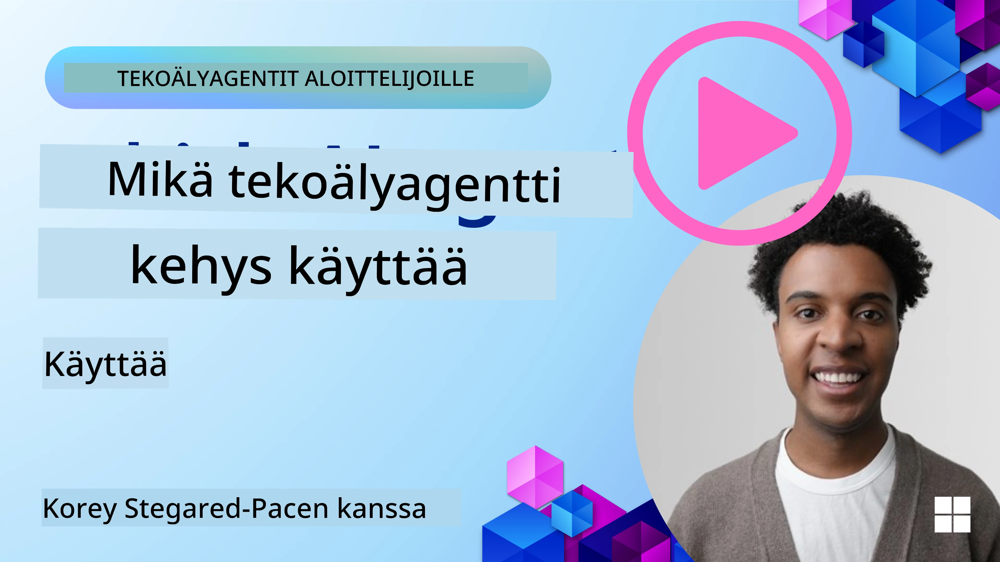

[](https://youtu.be/ODwF-EZo_O8?si=1xoy_B9RNQfrYdF7)

> _(Napsauta yllä olevaa kuvaa katsoaksesi tämän oppitunnin videon)_

# Tutustu tekoälyagenttikehyksiin

Tekoälyagenttikehykset ovat ohjelmistoalustoja, jotka on suunniteltu helpottamaan tekoälyagenttien luomista, käyttöönottoa ja hallintaa. Nämä kehykset tarjoavat kehittäjille valmiita komponentteja, abstraktioita ja työkaluja, jotka virtaviivaistavat monimutkaisten tekoälyjärjestelmien kehittämistä.

Nämä kehykset auttavat kehittäjiä keskittymään sovellustensa ainutlaatuisiin osiin tarjoamalla standardoituja lähestymistapoja tekoälyagenttien kehittämisen yleisiin haasteisiin. Ne parantavat skaalautuvuutta, saavutettavuutta ja tehokkuutta tekoälyjärjestelmien rakentamisessa.

## Johdanto

Tässä oppitunnissa käsitellään:

- Mitä tekoälyagenttikehykset ovat ja mitä ne mahdollistavat kehittäjille?
- Kuinka tiimit voivat käyttää näitä nopeasti prototypointiin, iterointiin ja agentin kyvykkyyksien parantamiseen?
- Mitkä ovat Microsoftin (<a href="https://aka.ms/ai-agents-beginners/ai-agent-service" target="_blank">Azure AI Agent Service</a> ja <a href="https://learn.microsoft.com/azure/ai-services/openai/how-to/responses" target="_blank">Microsoft Agent Framework</a>) kehittämien kehysten ja työkalujen erot?
- Voinko integroida olemassa olevat Azure-ekosysteemityökaluni suoraan, vai tarvitsenko itsenäisiä ratkaisuja?
- Mikä on Azure AI Agents -palvelu ja kuinka se auttaa minua?

## Oppimistavoitteet

Tämän oppitunnin tavoitteena on auttaa sinua ymmärtämään:

- Tekoälyagenttikehysten rooli tekoälyn kehityksessä.
- Kuinka hyödyntää tekoälyagenttikehyksiä älykkäiden agenttien rakentamisessa.
- Tekoälyagenttikehysten mahdollistamat keskeiset kyvykkyydet.
- Microsoft Agent Frameworkin ja Azure AI Agent Servicen erot.

## Mitä tekoälyagenttikehykset ovat ja mitä ne mahdollistavat kehittäjille?

Perinteiset tekoälykehykset voivat auttaa sinua integroimaan tekoälyä sovelluksiisi ja parantamaan näitä sovelluksia seuraavin tavoin:

- **Personalisointi**: Tekoäly voi analysoida käyttäjän käyttäytymistä ja mieltymyksiä tarjotakseen räätälöityjä suosituksia, sisältöä ja kokemuksia.  
Esimerkki: Suoratoistopalvelut kuten Netflix käyttävät tekoälyä ehdottaakseen elokuvia ja sarjoja katseluhistorian perusteella, mikä lisää käyttäjien sitoutumista ja tyytyväisyyttä.  
- **Automaatio ja tehokkuus**: Tekoäly voi automatisoida toistuvia tehtäviä, virtaviivaistaa työnkulkuja ja parantaa toimintatehokkuutta.  
Esimerkki: Asiakaspalvelusovellukset käyttävät tekoälypohjaisia chatbotteja hoitamaan yleisiä kyselyitä, mikä lyhentää vastausaikoja ja vapauttaa ihmiskollegoita monimutkaisempiin tehtäviin.  
- **Parannettu käyttökokemus**: Tekoäly voi parantaa kokonaiskäyttökokemusta tarjoamalla älykkäitä ominaisuuksia, kuten puheentunnistusta, luonnollisen kielen käsittelyä ja ennakoivaa tekstiä.  
Esimerkki: Virtuaaliassistentit kuten Siri ja Google Assistant käyttävät tekoälyä ymmärtääkseen ja vastatakseen puhekomentoihin, mikä helpottaa käyttäjien vuorovaikutusta laitteidensa kanssa.

### Kuulostaa hyvältä, mutta miksi tarvitsemme tekoälyagenttikehyksen?

Tekoälyagenttikehykset ovat enemmän kuin pelkkiä tekoälykehyksiä. Ne on suunniteltu mahdollistamaan älykkäiden agenttien luominen, jotka voivat olla vuorovaikutuksessa käyttäjien, muiden agenttien ja ympäristön kanssa saavuttaakseen erityisiä tavoitteita. Nämä agentit voivat osoittaa autonomista käyttäytymistä, tehdä päätöksiä ja mukautua muuttuviin olosuhteisiin. Tarkastellaan joitakin tekoälyagenttikehysten keskeisiä kyvykkyyksiä:

- **Agenttien yhteistyö ja koordinointi**: Mahdollistaa useiden tekoälyagenttien luomisen, jotka voivat tehdä yhteistyötä, kommunikoida ja koordinoida monimutkaisten tehtävien ratkaisemiseksi.  
- **Tehtävien automaatio ja hallinta**: Tarjoaa mekanismeja monivaiheisten työnkulkujen automatisointiin, tehtävien delegointiin ja dynaamiseen tehtävien hallintaan agenttien kesken.  
- **Kontekstuaalinen ymmärrys ja sopeutuminen**: Varustaa agentit kyvyllä ymmärtää konteksti, sopeutua muuttuviin ympäristöihin ja tehdä päätöksiä reaaliaikaisen tiedon perusteella.

Yhteenvetona agentit antavat sinulle mahdollisuuden saavuttaa enemmän, viedä automaatiota seuraavalle tasolle ja luoda älykkäämpiä järjestelmiä, jotka voivat oppia ja sopeutua ympäristöönsä.

## Kuinka nopeasti prototyypittää, iterroida ja parantaa agenttien kyvykkyyksiä?

Tämä ala kehittyy nopeasti, mutta useimmissa tekoälyagenttikehyksissä on yhteisiä piirteitä, jotka auttavat sinua nopeasti prototyypittämään ja iteromaan, nimittäin modulaariset komponentit, yhteistyövälineet ja reaaliaikainen oppiminen. Tutustutaan näihin:

- **Käytä modulaarisia komponentteja**: Tekoäly-SDK:t tarjoavat valmiita komponentteja, kuten tekoäly- ja muistikytkimiä, toimintokutsuja luonnollisella kielellä tai koodiplugineilla, kehotemalleja ja muuta.  
- **Hyödynnä yhteistyövälineitä**: Suunnittele agentteja tiettyihin rooleihin ja tehtäviin, jolloin ne voivat testata ja kehittää yhteistyön työnkulkuja.  
- **Opiskele reaaliajassa**: Toteuta palautemekanismeja, joissa agentit oppivat vuorovaikutuksista ja säätävät käyttäytymistään dynaamisesti.

### Käytä modulaarisia komponentteja

SDK:t kuten Microsoft Agent Framework tarjoavat valmiita komponentteja, kuten tekoälykytkimiä, työkalumääritelmiä ja agenttien hallintaa.

**Kuinka tiimit voivat käyttää näitä**: Tiimit voivat nopeasti koota nämä komponentit toimivaksi prototyypiksi ilman, että aloittavat alusta, mikä mahdollistaa nopean kokeilun ja iteroinnin.

**Miten se toimii käytännössä**: Voit käyttää valmista jäsentä (parseriä) tietojen poimimiseen käyttäjän syötteestä, muistikomponenttia tietojen tallentamiseen ja hakemiseen sekä kehotegeneraattoria käyttäjien vuorovaikutukseen, kaikki ilman että sinun tarvitsee rakentaa näitä alusta alkaen.

**Esimerkkikoodi**. Tarkastellaan esimerkkiä, jossa käytät Microsoft Agent Frameworkia `AzureAIProjectAgentProvider`-luokan kanssa, jotta malli vastaa käyttäjän syötteisiin työkalukutsuilla:

``` python
# Microsoft Agent Framework Python -esimerkki

import asyncio
import os
from typing import Annotated

from agent_framework.azure import AzureAIProjectAgentProvider
from azure.identity import AzureCliCredential


# Määrittele esimerkkityökalu matkan varaamiseen
def book_flight(date: str, location: str) -> str:
    """Book travel given location and date."""
    return f"Travel was booked to {location} on {date}"


async def main():
    provider = AzureAIProjectAgentProvider(credential=AzureCliCredential())
    agent = await provider.create_agent(
        name="travel_agent",
        instructions="Help the user book travel. Use the book_flight tool when ready.",
        tools=[book_flight],
    )

    response = await agent.run("I'd like to go to New York on January 1, 2025")
    print(response)
    # Esimerkkituloste: Lentosi New Yorkiin 1. tammikuuta 2025 on varattu onnistuneesti. Hyvää matkaa! ✈️🗽


if __name__ == "__main__":
    asyncio.run(main())
```
  
Tässä esimerkissä näet, miten voit hyödyntää valmista jäsentä poimiaksesi keskeisiä tietoja käyttäjän syötteestä, kuten lennon lähtöpaikan, määränpään ja päivän varaustoiveesta. Tämä modulaarinen lähestymistapa antaa sinun keskittyä korkeamman tason logiikkaan.

### Hyödynnä yhteistyövälineitä

Kehykset, kuten Microsoft Agent Framework, helpottavat useiden agenttien luomista, jotka voivat tehdä yhteistyötä.

**Kuinka tiimit voivat käyttää näitä**: Tiimit voivat suunnitella agentteja tiettyihin rooleihin ja tehtäviin, jotta ne voivat testata ja parantaa yhteistyön työnkulkuja sekä tehostaa järjestelmän kokonaisuutta.

**Miten se toimii käytännössä**: Voit luoda agenttitiimin, jossa jokaisella agentilla on erikoistunut tehtävä, kuten tiedonhaku, analyysi tai päätöksenteko. Nämä agentit voivat kommunikoida ja jakaa tietoa saavuttaakseen yhteisen tavoitteen, kuten vastaamaan käyttäjän kyselyyn tai suorittamaan tehtävän.

**Esimerkkikoodi (Microsoft Agent Framework)**:

```python
# Useiden agenttien luominen, jotka työskentelevät yhdessä Microsoft Agent Frameworkin avulla

import os
from agent_framework.azure import AzureAIProjectAgentProvider
from azure.identity import AzureCliCredential

provider = AzureAIProjectAgentProvider(credential=AzureCliCredential())

# Tietojen hakemiseen erikoistunut agentti
agent_retrieve = await provider.create_agent(
    name="dataretrieval",
    instructions="Retrieve relevant data using available tools.",
    tools=[retrieve_tool],
)

# Tietojen analysointiin erikoistunut agentti
agent_analyze = await provider.create_agent(
    name="dataanalysis",
    instructions="Analyze the retrieved data and provide insights.",
    tools=[analyze_tool],
)

# Agenttien suorittaminen tehtävän peräkkäin
retrieval_result = await agent_retrieve.run("Retrieve sales data for Q4")
analysis_result = await agent_analyze.run(f"Analyze this data: {retrieval_result}")
print(analysis_result)
```
  
Edellisessä koodissa näet, miten luodaan tehtävä, joka sisältää useiden agenttien yhteistyön datan analysoimiseksi. Jokainen agentti suorittaa tietyn toiminnon, ja tehtävä toteutetaan koordinoimalla agenttien työskentelyä tavoitteen saavuttamiseksi. Määrittelemällä agentteja omiin erikoisrooleihinsa voit parantaa tehtävien tehokkuutta ja suorituskykyä.

### Opiskele reaaliajassa

Edistyneet kehykset tarjoavat kyvykkyyksiä reaaliaikaiseen kontekstin ymmärtämiseen ja sopeutumiseen.

**Kuinka tiimit voivat käyttää näitä**: Tiimit voivat ottaa käyttöön palautesilmukoita, joissa agentit oppivat vuorovaikutuksista ja mukauttavat käyttäytymistään dynaamisesti, mikä johtaa jatkuvaan parantamiseen ja kyvykkyyksien hienosäätöön.

**Miten se toimii käytännössä**: Agentit voivat analysoida käyttäjäpalautetta, ympäristötietoja ja tehtävien tuloksia päivittääkseen tietokantaansa, säätääkseen päätöksentekoalgoritmeja ja parantaakseen suorituskykyä ajan myötä. Tämä iteratiivinen oppimisprosessi mahdollistaa agenttien sopeutumisen muuttuviin olosuhteisiin ja käyttäjäpreferensseihin, parantaen järjestelmän tehokkuutta kokonaisuudessaan.

## Mitkä ovat Microsoft Agent Frameworkin ja Azure AI Agent Servicen erot?

Näitä lähestymistapoja voi vertailla monin tavoin, mutta katsotaan joitakin keskeisiä eroja niiden suunnittelun, kyvykkyyksien ja käyttötarkoitusten osalta:

## Microsoft Agent Framework (MAF)

Microsoft Agent Framework tarjoaa virtaviivaistetun SDK:n tekoälyagenttien rakentamiseen `AzureAIProjectAgentProvider`-luokan avulla. Se mahdollistaa agenttien luomisen, jotka hyödyntävät Azure OpenAI -malleja sisäänrakennetulla työkalukutsulla, keskustelun hallinnalla ja yritystason tietoturvalla Azure-tunnistuksen kautta.

**Käyttötapaukset**: Valmiiden tuotantokelpoisten tekoälyagenttien rakentaminen, jotka käyttävät työkaluja, monivaiheisia työnkulkuja ja yritysintegraatioskenaarioita.

Seuraavassa on joitakin Microsoft Agent Frameworkin keskeisiä käsitteitä:

- **Agentit**. Agentti luodaan `AzureAIProjectAgentProvider`-luokan kautta ja määritellään nimi, ohjeet ja työkalut. Agentti voi:
  - **Käsitellä käyttäjän viestejä** ja luoda vastauksia käyttämällä Azure OpenAI -malleja.
  - **Kutsua työkaluja** automaattisesti keskustelun kontekstin perusteella.
  - **Ylläpitää keskustelun tilaa** useiden vuorovaikutusten aikana.

  Tässä on koodikatkelma agentin luomisesta:

    ```python
    import os
    from agent_framework.azure import AzureAIProjectAgentProvider
    from azure.identity import AzureCliCredential

    provider = AzureAIProjectAgentProvider(credential=AzureCliCredential())
    agent = await provider.create_agent(
        name="my_agent",
        instructions="You are a helpful assistant.",
    )

    response = await agent.run("Hello, World!")
    print(response)
    ```
  
- **Työkalut**. Kehys tukee työkalujen määrittelyä Python-funktioina, joita agentti voi kutsua automaattisesti. Työkalut rekisteröidään agenttia luotaessa:

    ```python
    def get_weather(location: str) -> str:
        """Get the current weather for a location."""
        return f"The weather in {location} is sunny, 72\u00b0F."

    agent = await provider.create_agent(
        name="weather_agent",
        instructions="Help users check the weather.",
        tools=[get_weather],
    )
    ```
  
- **Moniagenttien koordinointi**. Voit luoda useita agenteja eri erikoisaloilla ja koordinoida heidän työtään:

    ```python
    planner = await provider.create_agent(
        name="planner",
        instructions="Break down complex tasks into steps.",
    )

    executor = await provider.create_agent(
        name="executor",
        instructions="Execute the planned steps using available tools.",
        tools=[execute_tool],
    )

    plan = await planner.run("Plan a trip to Paris")
    result = await executor.run(f"Execute this plan: {plan}")
    ```
  
- **Azure-tunnistusintegraatio**. Kehys käyttää `AzureCliCredential`- tai `DefaultAzureCredential`-autentikointia turvallisesti ilman avainten hallintaa.

## Azure AI Agent Service

Azure AI Agent Service on uudempi lisäys, esitelty Microsoft Ignite 2024 -tapahtumassa. Se mahdollistaa tekoälyagenttien kehittämisen ja käyttöönoton joustavammilla malleilla, kuten avoimen lähdekoodin LLM-mallien (Llama 3, Mistral, Cohere) kutsumisella.

Azure AI Agent Service tarjoaa vahvempia yritystason tietoturvamekanismeja ja tietovarastointimenetelmiä, mikä tekee siitä sopivan yrityssovelluksiin.

Se toimii suoraan yhteistyössä Microsoft Agent Frameworkin kanssa agenttien rakentamiseen ja käyttöönottoon.

Palvelu on tällä hetkellä julkisessa esikatselussa ja tukee agenttien rakentamista Pythonilla ja C#:lla.

Azure AI Agent Service Python SDK:lla voimme luoda agentin käyttäjän määrittelemällä työkalulla:

```python
import asyncio
from azure.identity import DefaultAzureCredential
from azure.ai.projects import AIProjectClient

# Määrittele työkalufunktiot
def get_specials() -> str:
    """Provides a list of specials from the menu."""
    return """
    Special Soup: Clam Chowder
    Special Salad: Cobb Salad
    Special Drink: Chai Tea
    """

def get_item_price(menu_item: str) -> str:
    """Provides the price of the requested menu item."""
    return "$9.99"


async def main() -> None:
    credential = DefaultAzureCredential()
    project_client = AIProjectClient.from_connection_string(
        credential=credential,
        conn_str="your-connection-string",
    )

    agent = project_client.agents.create_agent(
        model="gpt-4o-mini",
        name="Host",
        instructions="Answer questions about the menu.",
        tools=[get_specials, get_item_price],
    )

    thread = project_client.agents.create_thread()

    user_inputs = [
        "Hello",
        "What is the special soup?",
        "How much does that cost?",
        "Thank you",
    ]

    for user_input in user_inputs:
        print(f"# User: '{user_input}'")
        message = project_client.agents.create_message(
            thread_id=thread.id,
            role="user",
            content=user_input,
        )
        run = project_client.agents.create_and_process_run(
            thread_id=thread.id, agent_id=agent.id
        )
        messages = project_client.agents.list_messages(thread_id=thread.id)
        print(f"# Agent: {messages.data[0].content[0].text.value}")


if __name__ == "__main__":
    asyncio.run(main())
```
  
### Keskeiset käsitteet

Azure AI Agent Servicellä on seuraavat keskeiset käsitteet:

- **Agentti**. Azure AI Agent Service integroituu Microsoft Foundryyn. AI Foundryssä agentti toimii "älykkäänä" mikropalveluna, jota voidaan käyttää kysymyksiin vastaamiseen (RAG), toimien suorittamiseen tai työnkulkujen täysin automatisointiin. Tämä saavutetaan yhdistämällä generatiivisten tekoälymallien voima työkaluihin, jotka mahdollistavat pääsyn todellisiin tietolähteisiin ja vuorovaikutuksen niiden kanssa. Tässä esimerkki agentista:

    ```python
    agent = project_client.agents.create_agent(
        model="gpt-4o-mini",
        name="my-agent",
        instructions="You are helpful agent",
        tools=code_interpreter.definitions,
        tool_resources=code_interpreter.resources,
    )
    ```
  
   Tässä esimerkissä agentti luodaan mallilla `gpt-4o-mini`, nimellä `my-agent` ja ohjeella `You are helpful agent`. Agentti on varustettu työkaluilla ja resursseilla suorittamaan koodin tulkintatehtäviä.

- **Ketju ja viestit**. Ketju on toinen tärkeä käsite. Se edustaa keskustelua tai vuorovaikutusta agentin ja käyttäjän välillä. Ketjuja voidaan käyttää seuraamaan keskustelun etenemistä, tallentamaan kontekstitietoja ja hallitsemaan vuorovaikutuksen tilaa. Tässä ketju esimerkkinä:

    ```python
    thread = project_client.agents.create_thread()
    message = project_client.agents.create_message(
        thread_id=thread.id,
        role="user",
        content="Could you please create a bar chart for the operating profit using the following data and provide the file to me? Company A: $1.2 million, Company B: $2.5 million, Company C: $3.0 million, Company D: $1.8 million",
    )
    
    # Pyydä agenttia suorittamaan työtä ketjussa
    run = project_client.agents.create_and_process_run(thread_id=thread.id, agent_id=agent.id)
    
    # Hae ja kirjaa kaikki viestit nähdäksesi agentin vastauksen
    messages = project_client.agents.list_messages(thread_id=thread.id)
    print(f"Messages: {messages}")
    ```
  
   Edellisessä koodissa luodaan ketju. Sen jälkeen ketjuun lähetetään viesti. Kutsumalla `create_and_process_run` pyydetään agenttia suorittamaan työ ketjulla. Lopuksi viestit haetaan ja kirjataan nähdäksesi agentin vastauksen. Viestit kuvaavat keskustelun etenemistä käyttäjän ja agentin välillä. On myös tärkeää ymmärtää, että viestit voivat olla eri tyyppejä, kuten tekstiä, kuvaa tai tiedostoa, eli agentin työ voi tuloksena olla esimerkiksi kuva tai tekstivastaus. Kehittäjänä voit sitten käyttää tätä tietoa jatkokäsittelyyn tai esittää vastauksen käyttäjälle.

- **Integrointi Microsoft Agent Frameworkin kanssa**. Azure AI Agent Service toimii saumattomasti yhdessä Microsoft Agent Frameworkin kanssa, joten voit rakentaa agentteja käyttäen `AzureAIProjectAgentProvider`-luokkaa ja ottaa ne tuotantokäyttöön Agent Servicen kautta.

**Käyttötapaukset**: Azure AI Agent Service on suunniteltu yrityssovelluksiin, jotka vaativat turvallista, skaalautuvaa ja joustavaa tekoälyagenttien käyttöönottoa.

## Mikä ero näillä lähestymistavoilla on?

Vaikka ne kuulostavat päällekkäisiltä, on niiden suunnittelussa, kyvykkyyksissä ja käyttötarkoituksissa keskeisiä eroja:

- **Microsoft Agent Framework (MAF)**: On tuotantovalmiiksi kehitetty SDK tekoälyagenttien rakentamiseen. Se tarjoaa yksinkertaistetun API:n agenttien luomiseen, työkalukutsuihin, keskustelun hallintaan ja Azure-identiteetti-integraatioon.  
- **Azure AI Agent Service**: On alusta ja käyttöönottopalvelu Azure Foundryssä agenttien kehittämiseen. Se tarjoaa valmiit liitännät palveluihin kuten Azure OpenAI, Azure AI Search, Bing Search ja koodin suoritus.  

Etkö ole varma kumpi sopii?

### Käyttötapaukset

Käydään läpi joitakin yleisiä käyttötapauksia:

> K: Rakennan tuotantokelpoisia tekoälyagenttisovelluksia ja haluan aloittaa nopeasti  
>

>V: Microsoft Agent Framework on erinomainen valinta. Se tarjoaa yksinkertaisen, Python-tyyppisen API:n `AzureAIProjectAgentProvider`-luokan kautta, jonka avulla voit määritellä agentteja työkaluilla ja ohjeilla vain muutamalla koodirivillä.

> K: Tarvitsen yritystason käyttöönoton Azure-integraatioilla kuten Search ja koodin suoritus  
>

> V: Azure AI Agent Service sopii parhaiten tähän. Se on alusta, joka tarjoaa valmiit kyvykkyydet monille malleille, kuten Azure AI Search, Bing Search ja Azure Functions. Sen avulla voit helposti rakentaa agentteja Foundry-portaalissa ja ottaa ne käyttöön suuressa mittakaavassa.

> K: Olen edelleen hämmentynyt, anna minulle yksi vaihtoehto  
>

> V: Aloita Microsoft Agent Frameworkista agenttien rakentamiseen ja käytä Azure AI Agent Serviceä, kun tarvitset tuotantokäyttöönottamista ja skaalautuvuutta. Tämä lähestymistapa antaa sinulle mahdollisuuden iteratiiviseen agenttilogiikkaan yhdistettynä selkeään polkuun yrityskäyttöön.

Tiivistetään keskeiset erot taulukkoon:

| Kehys | Painopiste | Keskeiset käsitteet | Käyttötapaukset |
| --- | --- | --- | --- |
| Microsoft Agent Framework | Virtaviivainen agentti-SDK työkalukutsuin | Agentit, Työkalut, Azure-identiteetti | Tekoälyagenttien rakentaminen, työkalujen käyttö, monivaiheiset työnkulut |
| Azure AI Agent Service | Joustavat mallit, yritysturvallisuus, koodin generointi, työkalukutsut | Modulaarisuus, Yhteistyö, Prosessien orkestrointi | Turvallinen, skaalautuva ja joustava tekoälyagenttien käyttöönotto |

## Voinko integroida olemassa olevat Azure-ekosysteemityökaluni suoraan, vai tarvitsenko itsenäisiä ratkaisuja?
Vastaus on kyllä, voit integroida olemassa olevat Azure-ekosysteemisi työkalut suoraan Azure AI Agent Serviceen, erityisesti koska se on rakennettu toimimaan saumattomasti muiden Azure-palveluiden kanssa. Voisit esimerkiksi integroida Bingin, Azure AI Searchin ja Azure Functionsit. Microsoft Foundryn kanssa on myös syvä integraatio.

Microsoft Agent Framework integroituu myös Azure-palveluihin `AzureAIProjectAgentProvider`-komponentin ja Azure-tunnistautumisen kautta, jolloin voit kutsua Azure-palveluita suoraan agenttityökaluistasi.

## Sample Codes

- Python: [Agent Framework](./code_samples/02-python-agent-framework.ipynb)
- .NET: [Agent Framework](./code_samples/02-dotnet-agent-framework.md)

## Got More Questions about AI Agent Frameworks?

Liity [Microsoft Foundry Discordiin](https://discord.com/invite/ATgtXmAS5D) tavata muita oppijoita, osallistua office hours -tapahtumiin ja saada vastauksia AI-agentteihin liittyviin kysymyksiisi.

## References

- <a href="https://techcommunity.microsoft.com/blog/azure-ai-services-blog/introducing-azure-ai-agent-service/4298357" target="_blank">Azure Agent Service</a>
- <a href="https://learn.microsoft.com/azure/ai-services/openai/how-to/responses" target="_blank">Microsoft Agent Framework - Azure OpenAI Responses</a>
- <a href="https://learn.microsoft.com/azure/ai-services/agents/overview" target="_blank">Azure AI Agent service</a>

## Previous Lesson

[Introduction to AI Agents and Agent Use Cases](../01-intro-to-ai-agents/README.md)

## Next Lesson

[Understanding Agentic Design Patterns](../03-agentic-design-patterns/README.md)

---

<!-- CO-OP TRANSLATOR DISCLAIMER START -->
**Vastuuvapauslauseke**:
Tämä asiakirja on käännetty käyttämällä tekoälypohjaista käännöspalvelua [Co-op Translator](https://github.com/Azure/co-op-translator). Vaikka pyrimme tarkkuuteen, otathan huomioon, että automaattiset käännökset saattavat sisältää virheitä tai epätarkkuuksia. Alkuperäinen asiakirja sen alkuperäiskielellä on virallinen lähde. Tärkeissä asioissa suositellaan ammattimaista ihmiskäännöstä. Emme ole vastuussa tämän käännöksen käytöstä aiheutuvista väärinymmärryksistä tai tulkinnoista.
<!-- CO-OP TRANSLATOR DISCLAIMER END -->