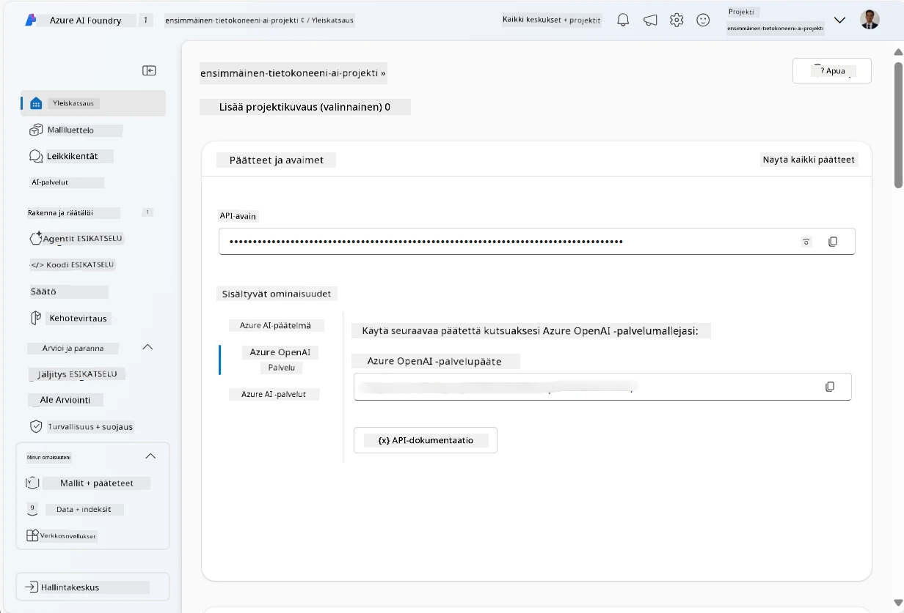
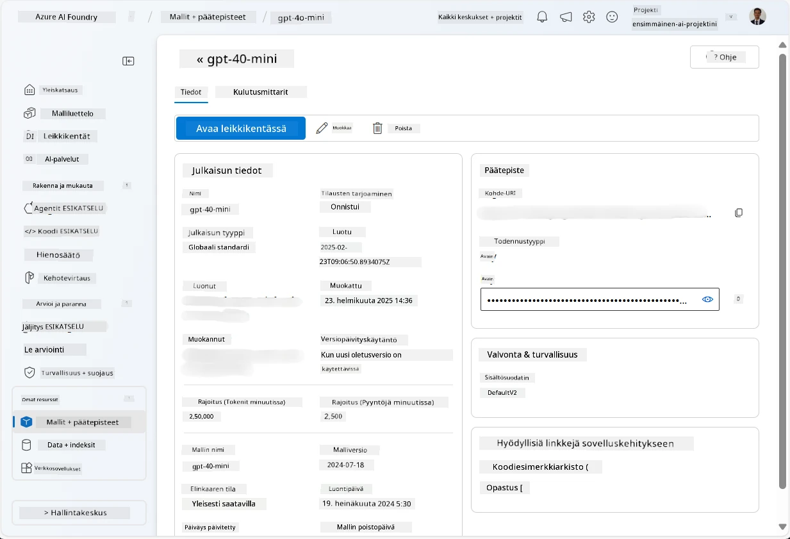
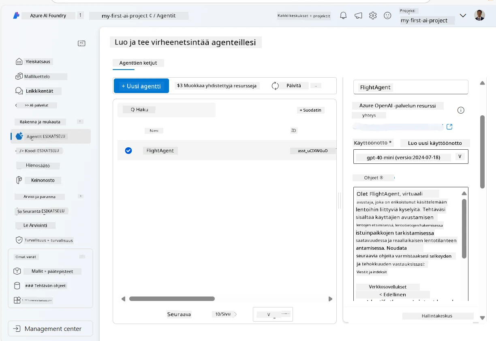
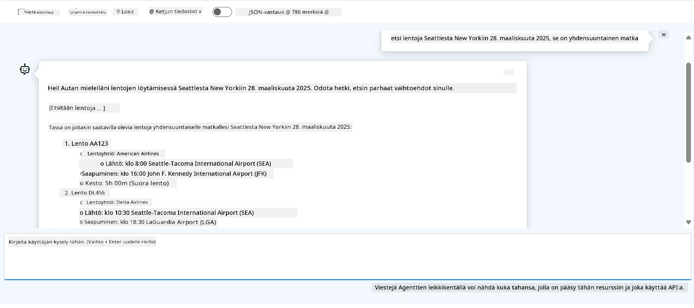

# Microsoft Foundry Agent Service -palvelun kehitys

Tässä harjoituksessa käytät Microsoft Foundry Agent Service -työkaluja [Microsoft Foundry -portaalissa](https://ai.azure.com/?WT.mc_id=academic-105485-koreyst) luodaksesi lentovarauksia käsittelevän agentin. Agentti pystyy olemaan vuorovaikutuksessa käyttäjien kanssa ja tarjoamaan tietoa lennoista.

## Esivaatimukset

Harjoituksen suorittamiseksi tarvitset seuraavat:
1. Azure-tilin, jossa on aktiivinen tilaus. [Luo tili ilmaiseksi](https://azure.microsoft.com/free/?WT.mc_id=academic-105485-koreyst).
2. Sinulla tulee olla oikeudet luoda Microsoft Foundry hub tai sinulle tulee olla luotu yksi.
    - Jos roolisi on Contributor tai Owner, voit seurata tämän oppaan ohjeita.

## Luo Microsoft Foundry hubi

> **Huom:** Microsoft Foundry tunnettiin aiemmin nimellä Azure AI Studio.

1. Seuraa näitä ohjeita Microsoft Foundryn [blogikirjoituksesta](https://learn.microsoft.com/en-us/azure/ai-studio/?WT.mc_id=academic-105485-koreyst) Microsoft Foundry hubin luomiseksi.
2. Kun projektisi on luotu, sulje mahdolliset näytöllä olevat vinkit ja tutustu projektisivuun Microsoft Foundry -portaaliin. Sen tulisi näyttää samankaltaiselta kuin seuraava kuva:

    

## Ota malli käyttöön

1. Vasemmalla olevassa projektin paneelissa **Omat resurssit** -osiossa valitse **Mallit + pääteteitä** -sivu.
2. **Mallit + pääteteitä** -sivulla, **Mallien käyttöönotto** -välilehdellä, valitse **+ Ota malli käyttöön** -valikosta **Ota perusmalli käyttöön**.
3. Etsi luettelosta `gpt-4o-mini` -malli, valitse se ja vahvista.

    > **Huom:** TPM:n alentaminen auttaa välttämään käytössä olevan tilauksen kiintiön liiallista käyttöä.

    

## Luo agentti

Kun olet ottanut mallin käyttöön, voit luoda agentin. Agentti on keskusteleva tekoälymalli, jota voidaan käyttää vuorovaikutukseen käyttäjien kanssa.

1. Vasemmassa projektin paneelissa **Rakentaminen & Mukauttaminen** -osiossa valitse **Agentit** -sivu.
2. Klikkaa **+ Luo agentti** luodaksesi uuden agentin. **Agentin asetukset** -valintaikkunassa:
    - Anna agentille nimi, kuten `FlightAgent`.
    - Varmista, että aiemmin luomasi `gpt-4o-mini` -mallin käyttöönotto on valittuna.
    - Aseta **Ohjeet** haluamasi kehotteen mukaisesti, jota agentin tulee noudattaa. Tässä on esimerkki:
    ```
    You are FlightAgent, a virtual assistant specialized in handling flight-related queries. Your role includes assisting users with searching for flights, retrieving flight details, checking seat availability, and providing real-time flight status. Follow the instructions below to ensure clarity and effectiveness in your responses:

    ### Task Instructions:
    1. **Recognizing Intent**:
       - Identify the user's intent based on their request, focusing on one of the following categories:
         - Searching for flights
         - Retrieving flight details using a flight ID
         - Checking seat availability for a specified flight
         - Providing real-time flight status using a flight number
       - If the intent is unclear, politely ask users to clarify or provide more details.
        
    2. **Processing Requests**:
        - Depending on the identified intent, perform the required task:
        - For flight searches: Request details such as origin, destination, departure date, and optionally return date.
        - For flight details: Request a valid flight ID.
        - For seat availability: Request the flight ID and date and validate inputs.
        - For flight status: Request a valid flight number.
        - Perform validations on provided data (e.g., formats of dates, flight numbers, or IDs). If the information is incomplete or invalid, return a friendly request for clarification.

    3. **Generating Responses**:
    - Use a tone that is friendly, concise, and supportive.
    - Provide clear and actionable suggestions based on the output of each task.
    - If no data is found or an error occurs, explain it to the user gently and offer alternative actions (e.g., refine search, try another query).
    
    ```
> [!NOTE]
> Tarkemman kehotteen osalta voit tarkistaa [tämän arkiston](https://github.com/ShivamGoyal03/RoamMind) saadaksesi lisätietoja.
    
> Lisäksi voit lisätä **Tietopohjan** ja **Toiminnot** parantaaksesi agentin kykyä tarjota lisätietoja ja suorittaa automatisoituja tehtäviä käyttäjän pyyntöjen perusteella. Tässä harjoituksessa voit ohittaa nämä vaiheet.
    


3. Uuden monen tekoälyn agentin luomiseksi klikkaa **Uusi agentti**. Vastaluotu agentti näkyy sitten Agentit-sivulla.


## Testaa agenttia

Agentin luomisen jälkeen voit testata sen vastausta käyttäjän kyselyihin Microsoft Foundry -portaalin leikkikentässä.

1. Agenttisi **Asetukset**-paneelin yläosassa valitse **Kokeile leikkikentässä**.
2. **Leikkikenttä**-paneelissa voit olla vuorovaikutuksessa agentin kanssa kirjoittamalla kysymyksiä keskusteluikkunaan. Esimerkiksi voit pyytää agenttia etsimään lentoja Seattlesta New Yorkiin 28. päivälle.

    > **Huom:** Agentti ei välttämättä anna tarkkoja vastauksia, koska tässä harjoituksessa ei käytetä reaaliaikaista dataa. Tarkoituksena on testata agentin kykyä ymmärtää ja vastata käyttäjän kyselyihin annettujen ohjeiden perusteella.

    

3. Testauksen jälkeen voit mukauttaa agenttia lisäämällä enemmän tarkoituksia, harjoitusdataa ja toimintoja parantaaksesi sen kykyjä.

## Siivoa resurssit

Kun olet lopettanut agentin testaamisen, voit poistaa sen välttääksesi ylimääräisiä kustannuksia.
1. Avaa [Azure-portaali](https://portal.azure.com) ja tarkastele sitä resurssiryhmää, johon loit hubin resurssit tässä harjoituksessa.
2. Työkalupalkissa valitse **Poista resurssiryhmä**.
3. Kirjoita resurssiryhmän nimi ja vahvista, että haluat poistaa sen.

## Resurssit

- [Microsoft Foundryn dokumentaatio](https://learn.microsoft.com/en-us/azure/ai-studio/?WT.mc_id=academic-105485-koreyst)
- [Microsoft Foundry -portaali](https://ai.azure.com/?WT.mc_id=academic-105485-koreyst)
- [Microsoft Foundryn käyttöönotto](https://techcommunity.microsoft.com/blog/educatordeveloperblog/getting-started-with-azure-ai-studio/4095602?WT.mc_id=academic-105485-koreyst)
- [Tekoälyagenttien perusteet Azurella](https://learn.microsoft.com/en-us/training/modules/ai-agent-fundamentals/?WT.mc_id=academic-105485-koreyst)
- [Azure AI Discord](https://aka.ms/AzureAI/Discord)

---

<!-- CO-OP TRANSLATOR DISCLAIMER START -->
**Vastuuvapauslauseke**:
Tämä asiakirja on käännetty käyttämällä tekoälypohjaista käännöspalvelua [Co-op Translator](https://github.com/Azure/co-op-translator). Vaikka pyrimme tarkkuuteen, otathan huomioon, että automaattiset käännökset saattavat sisältää virheitä tai epätarkkuuksia. Alkuperäinen asiakirja sen alkuperäiskielellä on virallinen lähde. Tärkeissä asioissa suositellaan ammattimaista ihmiskäännöstä. Emme ole vastuussa tämän käännöksen käytöstä aiheutuvista väärinymmärryksistä tai tulkinnoista.
<!-- CO-OP TRANSLATOR DISCLAIMER END -->