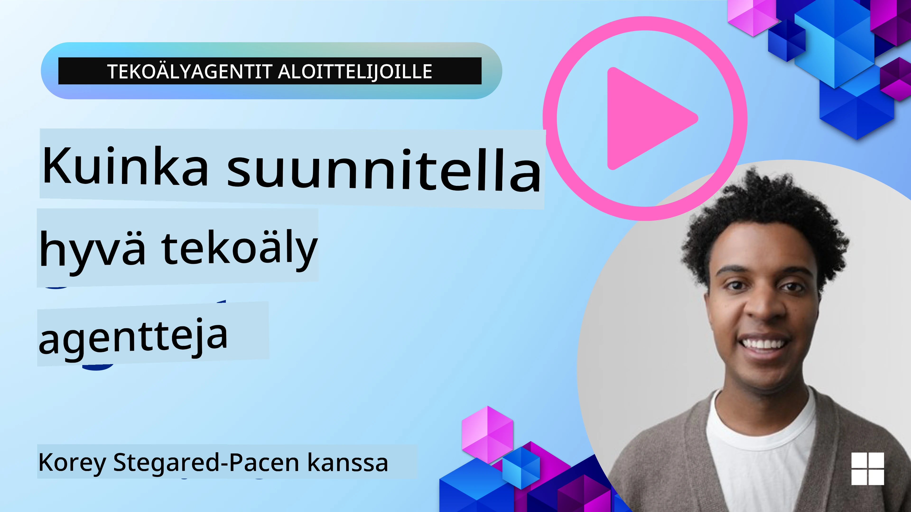
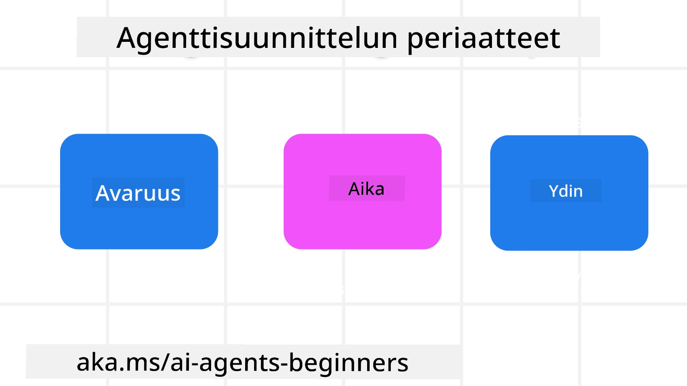

> _(Napsauta yllä olevaa kuvaa katsoaksesi tämän oppitunnin videon)_
# AI-agenttien suunnitteluperiaatteet

## Johdanto

AI-agenttijärjestelmien rakentamisesta on monia tapoja ajatella. Koska epäselvyys on ominaisuus eikä virhe Generative AI -suunnittelussa, insinöörien on joskus vaikea edes tietää, mistä aloittaa. Olemme luoneet joukon ihmiskeskeisiä UX-suunnitteluperiaatteita, joiden avulla kehittäjät voivat rakentaa asiakaskeskeisiä agenttipohjaisia järjestelmiä ratkaistakseen liiketoimintatarpeitaan. Nämä suunnitteluperiaatteet eivät ole määräävä arkkitehtuuri, vaan lähtöpiste tiimeille, jotka määrittelevät ja rakentavat agenttikokemuksia.

Yleisesti ottaen agenttien tulisi:

- Laajentaa ja skaalata ihmisten kykyjä (ideointi, ongelmanratkaisu, automaatio jne.)
- Täyttää tiedon aukkoja (auttaa minua perehtymään tieteenaloihin, kääntämään jne.)
- Helpottaa ja tukea yhteistyötä tavoilla, joilla yksilöt mieluiten työskentelevät toisten kanssa
- Tehdä meistä parempia versioita itsestämme (esim. elämänvalmentajina/tehtävien esimiehinä, auttaen meitä oppimaan tunnevälittelyä ja tietoisen läsnäolon taitoja, kestävyyden rakentamisessa jne.)

## Tämä Oppitunti Käsittelee

- Mitä agenttien suunnitteluperiaatteet ovat
- Mitä ohjeita noudattaa näitä suunnitteluperiaatteita toteutettaessa
- Joitain esimerkkejä suunnitteluperiaatteiden käytöstä

## Oppimistavoitteet

Tämän oppitunnin jälkeen osaat:

1. Selittää, mitä agenttien suunnitteluperiaatteet ovat
2. Selittää ohjeet agenttien suunnitteluperiaatteiden käytöstä
3. Ymmärtää, miten agentti rakennetaan agenttien suunnitteluperiaatteiden avulla

## Agenttien suunnitteluperiaatteet

### Agentti (tila)

Tämä on ympäristö, jossa agentti toimii. Nämä periaatteet ohjaavat, miten suunnittelemme agentteja toimimaan fyysisissä ja digitaalisissa maailmoissa.

- **Yhdistäminen, ei sulautuminen** – autta agentteja yhdistämään ihmisiä toisiin ihmisiin, tapahtumiin ja toimintakelpoiseen tietoon yhteistyön ja yhteyden luomiseksi.
- Agentit auttavat yhdistämään tapahtumia, tietoa ja ihmisiä.
- Agentit tuovat ihmiset lähemmäs toisiaan. Niitä ei ole suunniteltu korvaamaan tai halventamaan ihmisiä.
- **Helposti saavutettavissa mutta toisinaan näkymättömissä** – agentti toimii pääosin taustalla ja puuttuu peliin vain sopivasti ja merkityksellisesti.
  - Agentti on helposti löydettävissä ja saavutettavissa valtuutetuille käyttäjille millä tahansa laitteella tai alustalla.
  - Agentti tukee monimuotoisia syötteitä ja tulosteita (ääni, puhe, teksti jne.).
  - Agentti voi saumattomasti siirtyä etualan ja taustan välillä; proaktiivisen ja reaktiivisen tilan välillä, käyttäjän tarpeiden mukaan.
  - Agentti voi toimia näkymättömässä muodossa, mutta sen taustaprosessit ja yhteistyö muiden agenttien kanssa ovat käyttäjän nähtävissä ja hallittavissa.

### Agentti (aika)

Tämä kertoo, miten agentti toimii ajan kuluessa. Nämä periaatteet ohjaavat agenttien suunnittelua, jotka toimivat menneisyyden, nykyisyyden ja tulevaisuuden vuorovaikutuksessa.

- **Menneisyys**: Historian tarkastelu, joka sisältää sekä tilan että kontekstin.
  - Agentti tarjoaa relevantimpia tuloksia analysoimalla laajempaa historiallista dataa kuin vain tapahtumat, ihmiset tai tilat.
  - Agentti luo yhteyksiä menneisiin tapahtumiin ja reflektoi aktiivisesti muistoja nykytilanteiden ymmärtämiseksi.
- **Nykyhetki**: Kehottaa enemmän kuin ilmoittaa.
  - Agentti ilmentää kokonaisvaltaista lähestymistapaa ihmisten kanssa vuorovaikutukseen. Kun tapahtuma tapahtuu, agentti menee pelkän staattisen ilmoituksen tai muun muodollisuuden ohi. Agentti voi yksinkertaistaa prosesseja tai dynaamisesti ohjata käyttäjän huomion oikeaan aikaan.
  - Agentti tarjoaa tietoa kontekstuaalisen ympäristön, sosiaalisten ja kulttuuristen muutosten sekä käyttäjän tarkoituksen mukaan räätälöitynä.
  - Agentin vuorovaikutus voi olla asteittaista, kehittyen ja monimutkaistuen käyttäjiä voimaannuttaen pitkällä aikavälillä.
- **Tulevaisuus**: Sopeutuminen ja kehittyminen.
  - Agentti mukautuu eri laitteisiin, alustoihin ja modaliteetteihin.
  - Agentti mukautuu käyttäjän käyttäytymiseen, saavutettavuustarpeisiin ja on vapaasti muokattavissa.
  - Agentti muotoutuu ja kehittyy jatkuvan käyttäjävuorovaikutuksen kautta.

### Agentti (ydin)

Nämä ovat keskeiset elementit agentin suunnittelun ytimessä.

- **Hyväksy epävarmuus mutta luo luottamus**.
  - Tietyn tason epävarmuus agentissa on odotettua. Epävarmuus on keskeinen osa agenttien suunnittelua.
  - Luottamus ja läpinäkyvyys ovat agentin suunnittelun perustavia kerroksia.
  - Ihmiset hallitsevat, milloin agentti on päällä/pois päältä, ja agentin tila on aina selvästi näkyvissä.

## Ohjeet näiden periaatteiden toteuttamiseen

Kun käytät edellä olevia suunnitteluperiaatteita, käytä seuraavia ohjeita:

1. **Läpinäkyvyys**: Ilmoita käyttäjälle, että tekoäly on mukana, miten se toimii (mukaan lukien aiemmat toimet) ja miten antaa palautetta sekä muokata järjestelmää.
2. **Hallinta**: Mahdollista käyttäjän räätälöidä, määrittää mieltymyksiä, personoida ja hallita järjestelmää ja sen ominaisuuksia (mukaan lukien unohtamisen mahdollisuus).
3. **Johdonmukaisuus**: Pyri johdonmukaisiin, monimuotoisiin kokemuksiin eri laitteilla ja käyttöliittymissä. Käytä tuttuja UI/UX-elementtejä, missä mahdollista (esim. mikrofonikuvake äänivuorovaikutukseen) ja vähennä asiakkaan kognitiivista kuormitusta mahdollisimman paljon (esim. tiiviit vastaukset, visuaaliset apuvälineet ja 'Lue lisää' -sisältö).

## Kuinka suunnitella matkailuagentti näiden periaatteiden ja ohjeiden avulla

Kuvittele suunnittelevasi matkailuagenttia; tässä on, miten voisit ajatella suunnitteluperiaatteiden ja ohjeiden käyttöä:

1. **Läpinäkyvyys** – Kerro käyttäjälle, että matkailuagentti on tekoälyllä varustettu agentti. Anna perustiedot aloittamisesta (esim. “Hei”-viesti, esimerkkipyyntöjä). Dokumentoi tämä selkeästi tuotteen sivulla. Näytä luettelo pyynnöistä, joita käyttäjä on aiemmin tehnyt. Tee selväksi, miten antaa palautetta (peukut ylös ja alas, Lähetä palaute -painike jne.). Kerro selkeästi, onko agentilla käyttö- tai aiherajoituksia.
2. **Hallinta** – Varmista, että on selvää, miten käyttäjä voi muokata agenttia sen luomisen jälkeen esimerkiksi järjestelmän kehotteella. Mahdollista käyttäjän valita, kuinka laaja-alainen agentti on, sen kirjoitustyyli ja mitkä aiheet ovat kiellettyjä. Anna käyttäjän nähdä ja poistaa siihen liittyvät tiedostot tai tiedot, pyynnöt ja aiemmat keskustelut.
3. **Johdonmukaisuus** – Varmista, että kuvakkeet, kuten Jaa kehotteet, tiedoston tai kuvan lisääminen ja jonkun tai jonkin merkitseminen, ovat standardoituja ja tunnistettavia. Käytä paperiliitin-kuvaketta tiedoston latausten/jakamisen osoittamiseen agentin kanssa ja kuvan kuvaketta grafiikan lataamiseksi.

## Esimerkkikoodit

- Python: [Agent Framework](./code_samples/03-python-agent-framework.ipynb)
- .NET: [Agent Framework](./code_samples/03-dotnet-agent-framework.md)

## Lisää kysymyksiä AI-agenttien suunnittelumalleista?

Liity [Microsoft Foundry Discordiin](https://discord.com/invite/ATgtXmAS5D) tavata muita oppijoita, osallistua toimistoaikoihin ja saada vastauksia AI-agentteja koskeviin kysymyksiisi.

## Lisäresurssit

- <a href="https://openai.com" target="_blank">Agenttipohjaisten AI-järjestelmien hallinnan käytännöt | OpenAI</a>
- <a href="https://microsoft.com" target="_blank">HAX Toolkit -projekti - Microsoft Research</a>
- <a href="https://responsibleaitoolbox.ai" target="_blank">Responsible AI Toolbox</a>

## Edellinen oppitunti

[Agenttikehysten tutkiminen](../02-explore-agentic-frameworks/README.md)

## Seuraava oppitunti

[Työkalujen käyttö -suunnittelumalli](../04-tool-use/README.md)

---

<!-- CO-OP TRANSLATOR DISCLAIMER START -->
**Vastuuvapauslauseke**:
Tämä asiakirja on käännetty käyttämällä tekoälypohjaista käännöspalvelua [Co-op Translator](https://github.com/Azure/co-op-translator). Vaikka pyrimme tarkkuuteen, otathan huomioon, että automaattiset käännökset saattavat sisältää virheitä tai epätarkkuuksia. Alkuperäinen asiakirja sen alkuperäiskielellä on virallinen lähde. Tärkeissä asioissa suositellaan ammattimaista ihmiskäännöstä. Emme ole vastuussa tämän käännöksen käytöstä aiheutuvista väärinymmärryksistä tai tulkinnoista.
<!-- CO-OP TRANSLATOR DISCLAIMER END -->