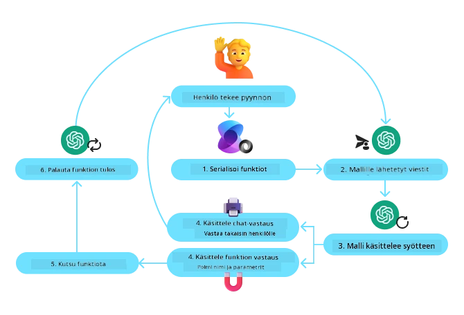
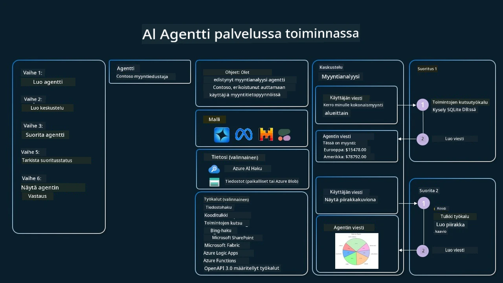

[](https://youtu.be/vieRiPRx-gI?si=cEZ8ApnT6Sus9rhn)

> _(Napsauta yllä olevaa kuvaa katsoaksesi tämän oppitunnin videon)_

# Työkalujen käytön suunnittelumalli

Työkalut ovat mielenkiintoisia, koska ne antavat tekoälyagenteille laajemman valikoiman kykyjä. Sen sijaan, että agentilla olisi rajallinen joukko toimintoja, joita se voi suorittaa, työkalun lisäämällä agentti voi nyt suorittaa laajan valikoiman toimintoja. Tässä luvussa tarkastelemme työkalujen käytön suunnittelumallia, joka kuvaa, miten tekoälyagentit voivat käyttää tiettyjä työkaluja saavuttaakseen tavoitteensa.

## Johdanto

Tässä oppitunnissa pyrimme vastaamaan seuraaviin kysymyksiin:

- Mitä työkalujen käytön suunnittelumalli on?
- Mitä käyttötapauksia siihen voidaan soveltaa?
- Mitkä ovat elementit/rakennuspalikat, joita tarvitaan suunnittelumallin toteuttamiseen?
- Mitä erityishuomioita on työkalujen käytön suunnittelumallin käyttämisessä luotettavien tekoälyagenttien rakentamiseksi?

## Oppimistavoitteet

Tämän oppitunnin suorittamisen jälkeen osaat:

- Määritellä työkalujen käytön suunnittelumallin ja sen tarkoituksen.
- Tunnistaa käyttötapaukset, joissa työkalujen käytön suunnittelumalli on sovellettavissa.
- Ymmärtää keskeiset elementit, joita tarvitaan suunnittelumallin toteuttamiseen.
- Tunnistaa näkökohdat, jotka liittyvät tekoälyagenttien luotettavuuden varmistamiseen käyttämällä tätä suunnittelumallia.

## Mitä on työkalujen käytön suunnittelumalli?

**Työkalujen käytön suunnittelumalli** keskittyy antamaan LLM-malleille kyvyn olla vuorovaikutuksessa ulkoisten työkalujen kanssa saavuttaakseen erityisiä tavoitteita. Työkalut ovat koodia, jota agentti voi suorittaa toimiakseen. Työkalu voi olla yksinkertainen funktio kuten laskin, tai kolmannen osapuolen palvelun API-kutsu kuten osakekurssien tai sääennusteen hakeminen. Tekoälyagenttien kontekstissa työkalut on suunniteltu toimimaan agenttien suorittamina vastauksena **mallin generoimiin funktiokutsuihin**.

## Mihin käyttötapauksiin sitä voidaan soveltaa?

Tekoälyagentit voivat hyödyntää työkaluja monimutkaisten tehtävien suorittamiseen, tiedon hakemiseen tai päätösten tekemiseen. Työkalujen käytön suunnittelumallia käytetään usein tilanteissa, joissa tarvitaan dynaamista vuorovaikutusta ulkoisten järjestelmien, kuten tietokantojen, verkkopalveluiden tai kooditulkitsijoiden kanssa. Tämä kyky on hyödyllinen monissa käyttötapauksissa, kuten:

- **Dynaaminen tiedonhaun toteutus:** Agentit voivat kysyä ulkoisista API-rajapinnoista tai tietokannoista ajantasaista tietoa (esim. SQLite-tietokannan kyselyt data-analyysia varten, osakekurssien tai sääennusteiden hakeminen).
- **Koodin suoritus ja tulkinta:** Agentit voivat suorittaa koodia tai skriptejä ratkaistakseen matemaattisia ongelmia, luodakseen raportteja tai suorittaakseen simulointeja.
- **Työnkulkujen automaatio:** Toistuvien tai monivaiheisten työnkulkujen automatisointi yhdistämällä työkaluja kuten tehtävien ajastimet, sähköpostipalvelut tai datavirtaputket.
- **Asiakastuki:** Agentit voivat olla vuorovaikutuksessa asiakkuudenhallintajärjestelmien, tikettijärjestelmien tai tietokantojen kanssa ratkaistakseen käyttäjän kyselyjä.
- **Sisällön luominen ja muokkaus:** Agentit voivat hyödyntää työkaluja kuten kieliopintarkistimia, tekstin tiivistäjiä tai sisällön turvallisuusarvioijia sisällöntuotannon tukena.

## Mitkä ovat elementit/rakennuspalikat, joita tarvitaan työkalujen käytön suunnittelumallin toteuttamiseen?

Nämä rakennuspalikat mahdollistavat tekoälyagentin suorittaa monenlaisia tehtäviä. Tarkastellaan avainosia, joita tarvitaan työkalujen käytön suunnittelumallin toteuttamiseksi:

- **Funktio/työkalujen skeemat:** Yksityiskohtaiset määritelmät käytettävissä olevista työkaluista, sisältäen funktion nimen, tarkoituksen, vaaditut parametrit ja odotetut tulokset. Nämä skeemat auttavat LLM:ää ymmärtämään, mitä työkaluja on saatavilla ja miten rakentaa valideja pyyntöjä.

- **Funktion suorituslogiikka:** Säätelee, miten ja milloin työkaluja kutsutaan käyttäjän aikomuksen ja keskustelukontekstin perusteella. Tämä voi sisältää suunnittelumoduuleja, reititysmekanismeja tai ehdollisia virtausratkaisuja, jotka päättävät työkalujen käytön dynaamisesti.

- **Viestien käsittelyjärjestelmä:** Komponentit, jotka hallinnoivat keskustelun kulkua käyttäjän syötteiden, LLM-vastausten, työkalukutsujen ja työkalujen vastausten välillä.

- **Työkalujen integrointikehys:** Infrastruktuuri, joka yhdistää agentin erilaisiin työkaluihin, olipa kyse yksinkertaisista funktioista tai monimutkaisista ulkoisista palveluista.

- **Virheenkäsittely ja validointi:** Mekanismit työkalujen suoritusvirheiden käsittelyyn, parametrien tarkastamiseen ja odottamattomien vastausten hallintaan.

- **Tilanhallinta:** Seuraa keskustelukontekstia, aiempia työkalujen käyttökertoja ja pysyvää dataa varmistaen johdonmukaisuuden monivaiheisissa vuorovaikutuksissa.

Seuraavaksi tarkastelemme funktioiden/työkalukutsujen toimintaa tarkemmin.

### Funktio/työkalukutsut

Funktiokutsut ovat ensisijainen tapa, jolla LLM:tä mahdollistetaan työkalujen kanssa vuorovaikutukseen. Näet usein termejä ’funktio’ ja ’työkalu’ käytettävän vaihtokelpoisesti, koska ”funktiot” (uudelleenkäytettävän koodin lohkot) ovat ne ’työkalut’, joita agentit käyttävät tehtävien suorittamiseen. Jotta funktion koodi voitaisiin kutsua, LLM:n on vertailtava käyttäjän pyyntöä funktion kuvaukseen. Tätä varten LLM:lle lähetetään skeema, joka sisältää kaikkien käytettävissä olevien funktioiden kuvaukset. LLM valitsee sitten sopivimman funktion tehtävään ja palauttaa sen nimen ja argumentit. Valittu funktio kutsutaan, sen vastaus lähetetään takaisin LLM:lle, joka käyttää tätä tietoa vastatakseen käyttäjän pyyntöön.

Kehittäjien ottaa funktiokutsut käyttöön agenteille tarvitaan:

1. LLM-malli, joka tukee funktiokutsuja
2. Skeema, joka sisältää funktioiden kuvaukset
3. Koodi kutakin kuvattua funktiota varten

Käytetään esimerkkinä kaupungin nykyisen ajan hakemista:

1. **Aloita LLM, joka tukee funktiokutsuja:**

    Kaikki mallit eivät tue funktiokutsuja, joten on tärkeää tarkistaa, että käyttämäsi LLM tukee niitä. <a href="https://learn.microsoft.com/azure/ai-services/openai/how-to/function-calling" target="_blank">Azure OpenAI</a> tukee funktiokutsuja. Voimme aloittaa luomalla Azure OpenAI -asiakkaan.

    ```python
    # Alusta Azure OpenAI -asiakas
    client = AzureOpenAI(
        azure_endpoint = os.getenv("AZURE_AI_PROJECT_ENDPOINT"), 
        api_key=os.getenv("AZURE_OPENAI_API_KEY"),  
        api_version="2024-05-01-preview"
    )
    ```

1. **Luo funktioskeema:**

    Määrittelemme seuraavaksi JSON-skeeman, joka sisältää funktion nimen, kuvauksen siitä, mitä funktio tekee, sekä funktion parametrien nimet ja kuvaukset.
    Lähetämme tämän skeeman aiemmin luodulle asiakkaalle yhdessä käyttäjän pyynnön kanssa löytääksemme ajan San Franciscossa. On tärkeää huomata, että **työkalukutsu** on se, mikä palautetaan, **ei** lopullinen vastaus kysymykseen. Kuten aiemmin mainittiin, LLM palauttaa valitsemaansa funktion nimen ja argumentit, jotka sille toimitetaan.

    ```python
    # Funktion kuvaus mallin luettavaksi
    tools = [
        {
            "type": "function",
            "function": {
                "name": "get_current_time",
                "description": "Get the current time in a given location",
                "parameters": {
                    "type": "object",
                    "properties": {
                        "location": {
                            "type": "string",
                            "description": "The city name, e.g. San Francisco",
                        },
                    },
                    "required": ["location"],
                },
            }
        }
    ]
    ```
   
    ```python
  
    # Alkuperäinen käyttäjäviesti
    messages = [{"role": "user", "content": "What's the current time in San Francisco"}] 
  
    # Ensimmäinen API-kutsu: Pyydä mallia käyttämään funktiota
      response = client.chat.completions.create(
          model=deployment_name,
          messages=messages,
          tools=tools,
          tool_choice="auto",
      )
  
      # Käsittele mallin vastaus
      response_message = response.choices[0].message
      messages.append(response_message)
  
      print("Model's response:")  

      print(response_message)
  
    ```

    ```bash
    Model's response:
    ChatCompletionMessage(content=None, role='assistant', function_call=None, tool_calls=[ChatCompletionMessageToolCall(id='call_pOsKdUlqvdyttYB67MOj434b', function=Function(arguments='{"location":"San Francisco"}', name='get_current_time'), type='function')])
    ```
  
1. **Funktion koodi, joka toteuttaa tehtävän:**

    Nyt kun LLM on valinnut, mikä funktio suoritetaan, tehtävän suorittava koodi täytyy toteuttaa ja suorittaa.
    Voimme toteuttaa Pythonilla koodin nykyisen ajan hakemiseksi. Meidän täytyy myös kirjoittaa koodi, joka purkaa vastauksesta funktion nimen ja argumentit saadaksemme lopullisen tuloksen.

    ```python
      def get_current_time(location):
        """Get the current time for a given location"""
        print(f"get_current_time called with location: {location}")  
        location_lower = location.lower()
        
        for key, timezone in TIMEZONE_DATA.items():
            if key in location_lower:
                print(f"Timezone found for {key}")  
                current_time = datetime.now(ZoneInfo(timezone)).strftime("%I:%M %p")
                return json.dumps({
                    "location": location,
                    "current_time": current_time
                })
      
        print(f"No timezone data found for {location_lower}")  
        return json.dumps({"location": location, "current_time": "unknown"})
    ```

     ```python
     # Käsittele funktiokutsut
      if response_message.tool_calls:
          for tool_call in response_message.tool_calls:
              if tool_call.function.name == "get_current_time":
     
                  function_args = json.loads(tool_call.function.arguments)
     
                  time_response = get_current_time(
                      location=function_args.get("location")
                  )
     
                  messages.append({
                      "tool_call_id": tool_call.id,
                      "role": "tool",
                      "name": "get_current_time",
                      "content": time_response,
                  })
      else:
          print("No tool calls were made by the model.")  
  
      # Toinen API-kutsu: Hae lopullinen vastaus mallilta
      final_response = client.chat.completions.create(
          model=deployment_name,
          messages=messages,
      )
  
      return final_response.choices[0].message.content
     ```

     ```bash
      get_current_time called with location: San Francisco
      Timezone found for san francisco
      The current time in San Francisco is 09:24 AM.
     ```

Funktiokutsut ovat useimpien, elleivät kaikkien, agenttien työkalukäytön suunnittelun ytimessä, mutta niiden toteuttaminen alusta asti voi joskus olla haastavaa.
Kuten opimme [Oppitunnissa 2](../../../02-explore-agentic-frameworks), agenttipohjaiset kehykset tarjoavat valmiita rakennuspalikoita työkalujen käyttöön.

## Työkalujen käyttöesimerkkejä agenttipohjaisilla kehyksillä

Tässä on joitakin esimerkkejä siitä, miten voit toteuttaa työkalujen käytön suunnittelumallin käyttämällä eri agenttipohjaisia kehyksiä:

### Microsoft Agent Framework

<a href="https://learn.microsoft.com/azure/ai-services/agents/overview" target="_blank">Microsoft Agent Framework</a> on avoimen lähdekoodin tekoälykehys tekoälyagenttien rakentamiseen. Se yksinkertaistaa funktiokutsujen käyttöä sallimalla työkalujen määrittelyn Python-funktioina `@tool`-koristeen avulla. Kehys hallinnoi mallin ja koodin välistä viestintää automaattisesti. Lisäksi se tarjoaa pääsyn valmiisiin työkaluihin, kuten Tiedostohaku ja Koodin tulkki, `AzureAIProjectAgentProvider`-komponentin kautta.

Seuraava kaavio havainnollistaa funktiokutsun prosessia Microsoft Agent Frameworkissa:



Microsoft Agent Frameworkissa työkalut määritellään koristelluiksi funktioiksi. Voimme muuntaa aiemmin nähdyn `get_current_time` -funktion työkaluksi käyttämällä `@tool`-koristetta. Kehys sarjoittaa automaattisesti funktion ja sen parametrit, luoden skeeman, joka lähetetään LLM:lle.

```python
from agent_framework import tool
from agent_framework.azure import AzureAIProjectAgentProvider
from azure.identity import AzureCliCredential

@tool
def get_current_time(location: str) -> str:
    """Get the current time for a given location"""
    ...

# Luo asiakas
provider = AzureAIProjectAgentProvider(credential=AzureCliCredential())

# Luo agentti ja suorita työkaluilla
agent = await provider.create_agent(name="TimeAgent", instructions="Use available tools to answer questions.", tools=get_current_time)
response = await agent.run("What time is it?")
```
  
### Azure AI Agent Service

<a href="https://learn.microsoft.com/azure/ai-services/agents/overview" target="_blank">Azure AI Agent Service</a> on uudempi agenttipohjainen kehys, joka on suunniteltu auttamaan kehittäjiä rakentamaan, käyttämään ja skaalaamaan korkealaatuisia ja laajennettavia tekoälyagentteja turvallisesti ilman, että tarvitsee hallita taustalla olevia laskenta- tai tallennusresursseja. Se on erityisen hyödyllinen yrityssovelluksiin, koska se on täysin hallinnoitu palvelu, jolla on yritystason tietoturva.

Suoraan LLM-rajapinnan kehittämiseen verrattuna Azure AI Agent Service tarjoaa useita etuja, kuten:

- Automaattinen työkalukutsujen hallinta – ei tarvitse käsitellä työkalukutsua, suorittaa työkalua ja käsitellä vastausta; kaikki tämä tehdään palvelinpuolella
- Turvallisesti hallitut tiedot – keskustelutilan hallinnan sijaan voi luottaa ketjuihin, jotka tallentavat kaiken tarvittavan tiedon
- Valmiit työkalut – Työkaluja, joita voi käyttää vuorovaikutukseen tietolähteiden kanssa, kuten Bing, Azure AI Search ja Azure Functions

Azure AI Agent Servicen työkalut voidaan jakaa kahteen kategoriaan:

1. Tietotyökalut:
    - <a href="https://learn.microsoft.com/azure/ai-services/agents/how-to/tools/bing-grounding?tabs=python&pivots=overview" target="_blank">Maadoitus Bing-haun avulla</a>
    - <a href="https://learn.microsoft.com/azure/ai-services/agents/how-to/tools/file-search?tabs=python&pivots=overview" target="_blank">Tiedostohaku</a>
    - <a href="https://learn.microsoft.com/azure/ai-services/agents/how-to/tools/azure-ai-search?tabs=azurecli%2Cpython&pivots=overview-azure-ai-search" target="_blank">Azure AI Search</a>

2. Toimintotyökalut:
    - <a href="https://learn.microsoft.com/azure/ai-services/agents/how-to/tools/function-calling?tabs=python&pivots=overview" target="_blank">Funktiokutsut</a>
    - <a href="https://learn.microsoft.com/azure/ai-services/agents/how-to/tools/code-interpreter?tabs=python&pivots=overview" target="_blank">Koodin tulkki</a>
    - <a href="https://learn.microsoft.com/azure/ai-services/agents/how-to/tools/openapi-spec?tabs=python&pivots=overview" target="_blank">OpenAPI-määritellyt työkalut</a>
    - <a href="https://learn.microsoft.com/azure/ai-services/agents/how-to/tools/azure-functions?pivots=overview" target="_blank">Azure Functions</a>

Agenttipalvelu mahdollistaa näiden työkalujen käytön yhdessä `toolset`-kokonaisuutena. Se hyödyntää myös `ketjuja` (threads), jotka pitävät kirjaa tietyn keskustelun viestihistoriasta.

Kuvittele, että olet myyntiedustaja Contoso-nimisessä yrityksessä. Haluat kehittää keskustelevaa agenttia, joka voi vastata kysymyksiin myyntidatastasi.

Seuraava kuva havainnollistaa, miten voisit käyttää Azure AI Agent Serviceä analysoidaksesi myyntidataa:



Voit käyttää mitä tahansa näistä työkaluista palvelun kanssa luomalla asiakkaan ja määrittelemällä työkalun tai työkalukokonaisuuden. Käytännössä voit toteuttaa tämän seuraavalla Python-koodilla. LLM pystyy tarkastelemaan työkalukokonaisuutta ja päättämään käyttääkö käyttäjän luomaa funktiota `fetch_sales_data_using_sqlite_query` vai valmista Koodin tulkkia käyttäjäpyynnön mukaan.

```python 
import os
from azure.ai.projects import AIProjectClient
from azure.identity import DefaultAzureCredential
from fetch_sales_data_functions import fetch_sales_data_using_sqlite_query # fetch_sales_data_using_sqlite_query-funktio, joka löytyy tiedostosta fetch_sales_data_functions.py.
from azure.ai.projects.models import ToolSet, FunctionTool, CodeInterpreterTool

project_client = AIProjectClient.from_connection_string(
    credential=DefaultAzureCredential(),
    conn_str=os.environ["PROJECT_CONNECTION_STRING"],
)

# Alusta työkalupakki
toolset = ToolSet()

# Alusta funktiokutsujen agentti fetch_sales_data_using_sqlite_query-funktiolla ja lisää se työkalupakkiin
fetch_data_function = FunctionTool(fetch_sales_data_using_sqlite_query)
toolset.add(fetch_data_function)

# Alusta Koodin tulkki -työkalu ja lisää se työkalupakkiin.
code_interpreter = code_interpreter = CodeInterpreterTool()
toolset.add(code_interpreter)

agent = project_client.agents.create_agent(
    model="gpt-4o-mini", name="my-agent", instructions="You are helpful agent", 
    toolset=toolset
)
```

## Mitä erityishuomioita on työkalujen käytön suunnittelumallin käyttämisessä luotettavien tekoälyagenttien rakentamiseksi?

Yleinen huolenaihe LLM:ien dynaamisesti generoiman SQL:n kanssa on tietoturva, erityisesti riski SQL-injektioon tai haitallisiin toimiin, kuten tietokannan poistamiseen tai muokkaamiseen. Vaikka nämä riskit ovat todellisia, ne voidaan tehokkaasti vähentää konfiguroimalla tietokannan käyttöoikeudet oikein. Useimmissa tietokannoissa tämä tarkoittaa tietokannan asettamista vain luku -tilaan. Tietokantapalveluissa kuten PostgreSQL tai Azure SQL sovellukselle tulee määrittää vain lukuoikeudet (SELECT-rooli).

Sovelluksen ajaminen turvallisessa ympäristössä parantaa suojaa edelleen. Yritysskenaarioissa data yleensä otetaan operatiivisista järjestelmistä ja muunnetaan käyttäjäystävälliseen skeemaan lukevalle tietokannalle tai tietovarastolle. Tämä lähestymistapa varmistaa tiedon turvallisuuden, suorituskyvyn ja saavutettavuuden optimoinnin sekä rajoitetun, vain luku -käytön sovellukselle.

## Esimerkkikoodit

- Python: [Agent Framework](./code_samples/04-python-agent-framework.ipynb)
- .NET: [Agent Framework](./code_samples/04-dotnet-agent-framework.md)

## Lisää kysymyksiä työkalujen käytön suunnittelumalleista?

Liity [Microsoft Foundry Discord](https://aka.ms/ai-agents/discord) -kanavalle tavata muiden oppijoiden kanssa, osallistua toimistotunteihin ja saada vastauksia tekoälyagenttikysymyksiisi.

## Lisäresurssit

- <a href="https://microsoft.github.io/build-your-first-agent-with-azure-ai-agent-service-workshop/" target="_blank">Azure AI Agents Service -työpaja</a>
- <a href="https://github.com/Azure-Samples/contoso-creative-writer/tree/main/docs/workshop" target="_blank">Contoso Creative Writer -moniagenttityöpaja</a>
- <a href="https://learn.microsoft.com/azure/ai-services/agents/overview" target="_blank">Microsoft Agent Framework -yleiskatsaus</a>

## Edellinen oppitunti

[Agenttipohjaisten suunnittelumallien ymmärtäminen](../03-agentic-design-patterns/README.md)

## Seuraava oppitunti
[Agentic RAG](../05-agentic-rag/README.md)

---

<!-- CO-OP TRANSLATOR DISCLAIMER START -->
**Vastuuvapauslauseke**:  
Tämä asiakirja on käännetty tekoälypohjaisella käännöspalvelulla [Co-op Translator](https://github.com/Azure/co-op-translator). Pyrimme tarkkuuteen, mutta huomioithan, että automaattikäännöksissä saattaa olla virheitä tai epätarkkuuksia. Alkuperäinen asiakirja omalla kielellään on aina virallinen lähde. Tärkeissä asioissa suositellaan ammattimaista ihmiskäännöstä. Emme ole vastuussa mahdollisista väärinymmärryksistä tai tulkinnoista, jotka johtuvat tämän käännöksen käytöstä.
<!-- CO-OP TRANSLATOR DISCLAIMER END -->