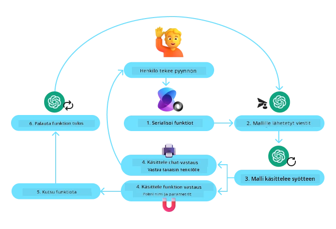
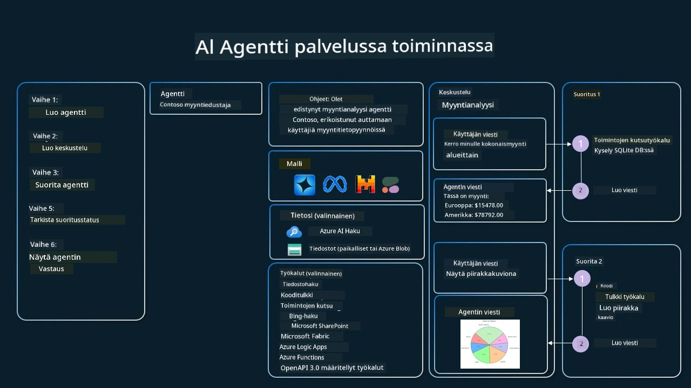

[](https://youtu.be/vieRiPRx-gI?si=cEZ8ApnT6Sus9rhn)

> _(Klikkaa yllä olevaa kuvaa nähdäksesi tämän oppitunnin videon)_

# Työkalujen Käyttö Design Pattern

Työkalut ovat mielenkiintoisia, koska ne antavat tekoälyagenteille laajemman valikoiman kykyjä. Sen sijaan, että agentilla olisi rajattu joukko toimintoja, joita se voi suorittaa, työkalun lisäämällä agentti voi nyt suorittaa laajan joukon toimintoja. Tässä luvussa tarkastelemme Työkalujen Käyttö Design Patternia, joka kuvaa, miten tekoälyagentit voivat käyttää tiettyjä työkaluja saavuttaakseen tavoitteensa.

## Johdanto

Tässä oppitunnissa pyrimme vastaamaan seuraaviin kysymyksiin:

- Mikä on työkalujen käyttö design pattern?
- Mitä käyttötapauksia siihen voidaan soveltaa?
- Mitkä ovat elementit/rakennuspalikat, jotka tarvitaan design patternin toteuttamiseen?
- Mitä erityisiä huomioita pitää ottaa huomioon, kun käytetään työkalujen käyttö design patternia luotaavien tekoälyagenttien rakentamiseen?

## Oppimistavoitteet

Tämän oppitunnin jälkeen osaat:

- Määritellä työkalujen käyttö design patternin ja sen tarkoituksen.
- Tunnistaa käyttötapaukset, joissa tätä design patternia voidaan soveltaa.
- Ymmärtää keskeiset elementit, jotka tarvitaan design patternin toteuttamiseen.
- Tunnistaa huomioitavat seikat luottamuksen varmistamiseksi tekoälyagenteissa, jotka käyttävät tätä design patternia.

## Mikä on työkalujen käyttö design pattern?

**Työkalujen käyttö design pattern** keskittyy antamaan suurille kielimalleille (LLM) kyvyn olla vuorovaikutuksessa ulkoisten työkalujen kanssa tiettyjen tavoitteiden saavuttamiseksi. Työkalut ovat koodia, jonka agentti voi suorittaa tehdäkseen toimintoja. Työkalu voi olla yksinkertainen funktio, kuten laskin, tai API-kutsu kolmannen osapuolen palveluun, kuten osakekurssien haku tai sääennuste. Tekoälyagenttien kontekstissa työkalut on suunniteltu suoritettaviksi agenttien toimesta mallipohjaisten funktiokutsujen yhteydessä.

## Mihin käyttötapauksiin sitä voidaan soveltaa?

Tekoälyagentit voivat hyödyntää työkaluja monimutkaisten tehtävien suorittamiseksi, tiedon hakemiseksi tai päätösten tekemiseksi. Työkalujen käyttö design patternia käytetään usein tilanteissa, joissa vaaditaan dynaamista vuorovaikutusta ulkoisten järjestelmien kanssa, kuten tietokannat, verkkopalvelut tai koodin tulkitsemiset. Tämä kyky on hyödyllinen monissa eri käyttötapauksissa, kuten:

- **Dynaaminen tiedonhaku:** Agentit voivat kysyä ulkoisia API-rajapintoja tai tietokantoja saadakseen ajantasaisia tietoja (esim. SQLite-tietokannan kysely data-analyysiä varten, osakekurssien tai säätilan hakeminen).
- **Koodin suoritus ja tulkinta:** Agentit voivat suorittaa koodia tai skriptejä ratkaistakseen matemaattisia ongelmia, tuottaakseen raportteja tai suorittaakseen simulaatioita.
- **Työnkulun automaatio:** Toistuvien tai monivaiheisten työnkulkujen automaatio integroimalla työkaluja, kuten tehtävien ajastimia, sähköpostipalveluja tai dataputkia.
- **Asiakastuki:** Agentit voivat olla vuorovaikutuksessa asiakkuudenhallintajärjestelmien, tikettijärjestelmien tai tietopankkien kanssa ratkaistakseen käyttäjien kyselyitä.
- **Sisällön luonti ja muokkaus:** Agentit voivat hyödyntää työkaluja, kuten kieliopin tarkistajia, tekstin tiivistäjiä tai sisällön turvallisuuden arvioijia sisältötehtävissä.

## Mitä elementtejä/rakennuspalikoita tarvitaan työkalujen käyttö design patternin toteuttamiseen?

Nämä rakennuspalikat mahdollistavat tekoälyagentin suorittaa laajan joukon tehtäviä. Katsotaan keskeisiä elementtejä, jotka tarvitaan työkalujen käyttö design patternin toteuttamiseen:

- **Funktio/Työkalumääritelmät (Schemat):** Yksityiskohtaiset määritelmät käytettävissä olevista työkaluista, mukaan lukien toiminnon nimi, tarkoitus, vaaditut parametrit ja odotetut tulokset. Nämä skeemat mahdollistavat LLM:lle työkalujen ymmärtämisen ja oikeiden pyyntöjen muodostamisen.

- **Toimintojen Suorituslogiikka:** Säätelee, miten ja milloin työkaluja kutsutaan käyttäjän tarkoituksen ja keskustelukontekstin perusteella. Tämä voi sisältää suunnittelumoduuleja, reititysmekanismeja tai ehtovirtoja, jotka dynamiikkaisesti päättävät työkalujen käytön.

- **Viestien Käsittelyjärjestelmä:** Komponentit, jotka hallinnoivat keskustelun kulkua käyttäjän syötteiden, LLM-vastausten, työkalukutsujen ja työkalujen vastausten välillä.

- **Työkalujen Integraatioraamisysteemi:** Infrastruktuuri, joka yhdistää agentin erilaisiin työkaluihin, olivat ne sitten yksinkertaisia funktioita tai monimutkaisia ulkoisia palveluja.

- **Virheiden Käsittely ja Validointi:** Mekanismit virheiden hallintaan työkalujen suorituksessa, parametrien validointiin ja odottamattomien vastausten hallintaan.

- **Tilanhallinta:** Seuraa keskustelukontekstia, aiempia työkalukutsuja ja pysyvää dataa varmistaakseen johdonmukaisuuden monivaiheisessa vuorovaikutuksessa.

Seuraavaksi tarkastellaan Funktio/Työkalukutsua tarkemmin.

### Funktio/Työkalukutsu

Funktiokutsu on ensisijainen tapa, jolla suuria kielimalleja (LLM) voidaan antaa olla vuorovaikutuksessa työkalujen kanssa. 'Funktio' ja 'Työkalu' termejä käytetään usein vaihdellen, koska 'funktiot' (uudelleenkäytettäviä koodilohkoja) ovat ne 'työkalut', joita agentit käyttävät tehtävien suorittamiseen. Jotta funktion koodi saadaan kutsuttua, LLM:n tulee vertailla käyttäjän pyyntöä funktion kuvaukseen. Tätä varten LLM:lle lähetetään skeema, joka sisältää kuvaukset kaikista käytettävissä olevista funktioista. LLM valitsee sitten tehtävään parhaiten sopivan funktion ja palauttaa sen nimen sekä argumentit. Valittu funktio suoritetaan, sen vastaus lähetetään takaisin LLM:lle, joka käyttää tietoa vastatakseen käyttäjän pyyntöön.

Kehittäjien toteuttaessa funktiokutsua agenteille tarvitsee seuraavat asiat:

1. LLM-mallin, joka tukee funktiokutsuja
2. Skeeman, joka sisältää funktiokuvaukset
3. Koodi jokaista kuvattua funktiota varten

Käydään esimerkkinä läpi nykyisen ajan hakeminen kaupungista:

1. **Alusta LLM, joka tukee funktiokutsuja:**

    Kaikki mallit eivät tue funktiokutsuja, joten on tärkeää tarkistaa, että käyttämäsi LLM tukee sitä. <a href="https://learn.microsoft.com/azure/ai-services/openai/how-to/function-calling" target="_blank">Azure OpenAI</a> tukee funktiokutsuja. Aloitetaan luomalla Azure OpenAI -asiakas.

    ```python
    # Alusta Azure OpenAI -asiakas
    client = AzureOpenAI(
        azure_endpoint = os.getenv("AZURE_AI_PROJECT_ENDPOINT"), 
        api_key=os.getenv("AZURE_OPENAI_API_KEY"),  
        api_version="2024-05-01-preview"
    )
    ```

1. **Luo Funktioskeema:**

    Määrittelemme JSON-skeman, joka sisältää funktion nimen, kuvauksen siitä, mitä funktio tekee, sekä funktion parametrien nimet ja kuvaukset.
    Tämän skeeman annamme aiemmin luodulle asiakkaalle yhdessä käyttäjän pyynnön kanssa, joka on tässä tapauksessa tarkoitus hakea aika San Franciscossa. Tärkeää huomata on, että **työkalukutsu** palautetaan, **ei** lopullista vastausta kysymykseen. Kuten aiemmin mainittiin, LLM palauttaa valitun funktion nimen ja sille annettavat argumentit.

    ```python
    # Funktiokuvauksen lukemista mallille
    tools = [
        {
            "type": "function",
            "function": {
                "name": "get_current_time",
                "description": "Get the current time in a given location",
                "parameters": {
                    "type": "object",
                    "properties": {
                        "location": {
                            "type": "string",
                            "description": "The city name, e.g. San Francisco",
                        },
                    },
                    "required": ["location"],
                },
            }
        }
    ]
    ```
   
    ```python
  
    # Alkuperäinen käyttäjäviesti
    messages = [{"role": "user", "content": "What's the current time in San Francisco"}] 
  
    # Ensimmäinen API-kutsu: Pyydä mallia käyttämään funktiota
      response = client.chat.completions.create(
          model=deployment_name,
          messages=messages,
          tools=tools,
          tool_choice="auto",
      )
  
      # Käsittele mallin vastaus
      response_message = response.choices[0].message
      messages.append(response_message)
  
      print("Model's response:")  

      print(response_message)
  
    ```

    ```bash
    Model's response:
    ChatCompletionMessage(content=None, role='assistant', function_call=None, tool_calls=[ChatCompletionMessageToolCall(id='call_pOsKdUlqvdyttYB67MOj434b', function=Function(arguments='{"location":"San Francisco"}', name='get_current_time'), type='function')])
    ```
  
1. **Funktiokoodi tehtävän suorittamiseksi:**

    Nyt, kun LLM on valinnut, mikä funktio täytyy suorittaa, tehtävää suorittava koodi täytyy toteuttaa ja suorittaa.
    Voin toteuttaa koodin nykyisen ajan hakemiseen Pythonilla. Tarvitsemme myös koodin, joka purkaa nimen ja argumentit response_message-viestistä saadakseen lopullisen tuloksen.

    ```python
      def get_current_time(location):
        """Get the current time for a given location"""
        print(f"get_current_time called with location: {location}")  
        location_lower = location.lower()
        
        for key, timezone in TIMEZONE_DATA.items():
            if key in location_lower:
                print(f"Timezone found for {key}")  
                current_time = datetime.now(ZoneInfo(timezone)).strftime("%I:%M %p")
                return json.dumps({
                    "location": location,
                    "current_time": current_time
                })
      
        print(f"No timezone data found for {location_lower}")  
        return json.dumps({"location": location, "current_time": "unknown"})
    ```

     ```python
     # Käsittele funktiokutsuja
      if response_message.tool_calls:
          for tool_call in response_message.tool_calls:
              if tool_call.function.name == "get_current_time":
     
                  function_args = json.loads(tool_call.function.arguments)
     
                  time_response = get_current_time(
                      location=function_args.get("location")
                  )
     
                  messages.append({
                      "tool_call_id": tool_call.id,
                      "role": "tool",
                      "name": "get_current_time",
                      "content": time_response,
                  })
      else:
          print("No tool calls were made by the model.")  
  
      # Toinen API-kutsu: Hanki lopullinen vastaus mallilta
      final_response = client.chat.completions.create(
          model=deployment_name,
          messages=messages,
      )
  
      return final_response.choices[0].message.content
     ```

     ```bash
      get_current_time called with location: San Francisco
      Timezone found for san francisco
      The current time in San Francisco is 09:24 AM.
     ```

Funktiokutsu on useimpien, ellei kaikkien agenttien työkalukäytön design patternien ytimessä, mutta sen toteuttaminen alusta voi joskus olla haastavaa.
Kuten opimme [Oppitunnissa 2](../../../02-explore-agentic-frameworks), agenttirunkojen avulla saamme valmiita rakennuspalikoita työkalujen käyttöön.

## Työkalujen Käyttö Esimerkkejä Agenttirunkojen Kanssa

Tässä on joitakin esimerkkejä siitä, miten voit toteuttaa Työkalujen Käyttö Design Patternia eri agenttirunkojen avulla:

### Microsoft Agent Framework

<a href="https://learn.microsoft.com/azure/ai-services/agents/overview" target="_blank">Microsoft Agent Framework</a> on avoimen lähdekoodin tekoälykehys tekoälyagenttien rakentamiseen. Se yksinkertaistaa funktiokutsujen käyttöä sallimalla työkalujen määrittelyn Python-funktioina käyttäen `@tool`-koristetta. Kehys hoitaa mallin ja koodisi välisen vuorovaikutuksen edestakaisin. Se tarjoaa myös pääsyn valmiiksi rakennettuihin työkaluihin kuten Tiedostohaku ja Koodin Tulkitsija `AzureAIProjectAgentProvider`-komponentin kautta.

Seuraava kaavio havainnollistaa toimintojen kutsuprosessia Microsoft Agent Frameworkissa:



Microsoft Agent Frameworkissa työkalut määritellään koristelluiksi funktioiksi. Voimme muuttaa aiemmin nähdyn `get_current_time`-funktion työkaluksi lisäämällä siihen `@tool`-koristeen. Kehys sarjoittaa automaattisesti funktion ja sen parametrit, luoden skeeman, joka lähetetään LLM:lle.

```python
from agent_framework import tool
from agent_framework.azure import AzureAIProjectAgentProvider
from azure.identity import AzureCliCredential

@tool
def get_current_time(location: str) -> str:
    """Get the current time for a given location"""
    ...

# Luo asiakas
provider = AzureAIProjectAgentProvider(credential=AzureCliCredential())

# Luo agentti ja suorita työkalulla
agent = await provider.create_agent(name="TimeAgent", instructions="Use available tools to answer questions.", tools=get_current_time)
response = await agent.run("What time is it?")
```
  
### Azure AI Agent Service

<a href="https://learn.microsoft.com/azure/ai-services/agents/overview" target="_blank">Azure AI Agent Service</a> on uudempi agenttirunko, joka on suunniteltu auttamaan kehittäjiä rakentamaan, käyttöönottoon ja skaalamaan turvallisesti laadukkaita ja laajennettavia tekoälyagentteja ilman tarvetta hallita taustalla olevia laskenta- ja tallennusresursseja. Se on erityisen hyödyllinen yrityssovelluksissa, koska kyseessä on täysin hallittu palvelu yritystason turvallisuudella.

Verrattaessa suoraan LLM API:n käyttöön, Azure AI Agent Service tarjoaa joitakin etuja, kuten:

- Automaattinen työkalukutsujen hallinta – ei tarvetta parsia työkalukutsua, suorittaa työkalua ja käsitellä vastausta; kaikki tehdään palvelinpuolella
- Turvallisesti hallinnoitu data – keskustelutilan hallinnan sijaan voit luottaa säikeisiin, jotka tallentavat kaiken tarvitun tiedon
- Valmiit työkalut – Työkaluja, joilla voi olla vuorovaikutusta datalähteiden kanssa, kuten Bing, Azure AI Search ja Azure Functions.

Azure AI Agent Servicen työkalut voidaan jakaa kahteen kategoriaan:

1. Tietotyökalut:
    - <a href="https://learn.microsoft.com/azure/ai-services/agents/how-to/tools/bing-grounding?tabs=python&pivots=overview" target="_blank">Bing-hakuin pohjautuminen</a>
    - <a href="https://learn.microsoft.com/azure/ai-services/agents/how-to/tools/file-search?tabs=python&pivots=overview" target="_blank">Tiedostohaku</a>
    - <a href="https://learn.microsoft.com/azure/ai-services/agents/how-to/tools/azure-ai-search?tabs=azurecli%2Cpython&pivots=overview-azure-ai-search" target="_blank">Azure AI Search</a>

2. Toimintatyökalut:
    - <a href="https://learn.microsoft.com/azure/ai-services/agents/how-to/tools/function-calling?tabs=python&pivots=overview" target="_blank">Funktiokutsut</a>
    - <a href="https://learn.microsoft.com/azure/ai-services/agents/how-to/tools/code-interpreter?tabs=python&pivots=overview" target="_blank">Koodin tulkitsin</a>
    - <a href="https://learn.microsoft.com/azure/ai-services/agents/how-to/tools/openapi-spec?tabs=python&pivots=overview" target="_blank">OpenAPI-määritellyt työkalut</a>
    - <a href="https://learn.microsoft.com/azure/ai-services/agents/how-to/tools/azure-functions?pivots=overview" target="_blank">Azure Functions</a>

Agent Service mahdollistaa näiden työkalujen käytön yhdessä `toolset`-kokonaisuutena. Se käyttää myös `threads`-säikeitä, jotka seuraavat tietyn keskustelun viestihistoriaa.

Kuvittele, että olet myyntiedustaja yrityksessä nimeltä Contoso. Haluat kehittää keskusteluagentin, joka osaa vastata kysymyksiin myyntidatastasi.

Seuraava kuva havainnollistaa, miten Azure AI Agent Serviceä voidaan käyttää myyntidatan analysointiin:



Käyttääksesi näistä työkaluista mitä tahansa palvelun kanssa, voimme luoda asiakkaan ja määritellä työkalun tai työkalusetin. Käytännön toteutuksessa voimme käyttää seuraavaa Python-koodia. LLM pystyy katsomaan työkalusettiä ja päättämään käyttääkö käyttäjän luomaa funktiota `fetch_sales_data_using_sqlite_query` vai valmista Koodin tulkitsijaa käyttäjän pyynnön perusteella.

```python 
import os
from azure.ai.projects import AIProjectClient
from azure.identity import DefaultAzureCredential
from fetch_sales_data_functions import fetch_sales_data_using_sqlite_query # fetch_sales_data_using_sqlite_query-funktio, joka löytyy fetch_sales_data_functions.py-tiedostosta.
from azure.ai.projects.models import ToolSet, FunctionTool, CodeInterpreterTool

project_client = AIProjectClient.from_connection_string(
    credential=DefaultAzureCredential(),
    conn_str=os.environ["PROJECT_CONNECTION_STRING"],
)

# Alusta työkalusarja
toolset = ToolSet()

# Alusta funktiokutsujen agentti fetch_sales_data_using_sqlite_query-funktiolla ja lisää se työkalusarjaan
fetch_data_function = FunctionTool(fetch_sales_data_using_sqlite_query)
toolset.add(fetch_data_function)

# Alusta Kooditulkkityökalu ja lisää se työkalusarjaan.
code_interpreter = CodeInterpreterTool()toolset.add(code_interpreter)

agent = project_client.agents.create_agent(
    model="gpt-4o-mini", name="my-agent", instructions="You are helpful agent", 
    toolset=toolset
)
```

## Mitä erityisiä huomioita työkalujen käyttö design patternia käytettäessä luotettavien tekoälyagenttien rakentamiseen?

Yleinen huolenaihe SQL:n dynaamisessa generoinnissa LLM:ien avulla on turvallisuus, erityisesti SQL-injektioiden tai haitallisten toimien riski, kuten tietokannan pudottaminen tai manipulaatio. Vaikka nämä huolenaiheet ovat perusteltuja, ne voidaan tehokkaasti ehkäistä asetuksilla, jotka rajoittavat tietokannan käyttöoikeuksia. Useimmissa tietokannoissa tämä tarkoittaa tietokannan määrittämistä vain luku -tilaan. Tietokantapalveluissa, kuten PostgreSQL tai Azure SQL, sovellukselle annetaan lukuoikeudet sisältävä käyttöoikeusrooli (SELECT).

Sovelluksen ajaminen turvallisessa ympäristössä parantaa suojaa entisestään. Yritysskenaarioissa data yleensä puretaan ja muunnetaan operatiivisista järjestelmistä vain luettavaksi tietokannaksi tai tietovarastoksi käyttäjäystävällisellä skeemalla. Tämä varmistaa, että data on turvallista, optimoitua suorituskyvyn ja saavutettavuuden kannalta ja että sovelluksella on rajoitettu, vain luku -pääsy.

## Esimerkkikoodit

- Python: [Agent Framework](./code_samples/04-python-agent-framework.ipynb)
- .NET: [Agent Framework](./code_samples/04-dotnet-agent-framework.md)

## Onko sinulla lisää kysyttävää työkalujen käyttö design patenteista?

Liity [Microsoft Foundry Discordiin](https://discord.com/invite/ATgtXmAS5D) tavata muita oppijoita, osallistua aukioloaikoihin ja saada vastauksia AI Agents -kysymyksiisi.

## Lisäresurssit

- <a href="https://microsoft.github.io/build-your-first-agent-with-azure-ai-agent-service-workshop/" target="_blank">Azure AI Agents Service -workshop</a>
- <a href="https://github.com/Azure-Samples/contoso-creative-writer/tree/main/docs/workshop" target="_blank">Contoso Creative Writer Multi-Agent Workshop</a>
- <a href="https://learn.microsoft.com/azure/ai-services/agents/overview" target="_blank">Microsoft Agent Frameworkin yleiskatsaus</a>

## Edellinen Oppitunti

[Agenttirakennemallien ymmärtäminen](../03-agentic-design-patterns/README.md)

## Seuraava Oppitunti
[Agenttinen RAG](../05-agentic-rag/README.md)

---

<!-- CO-OP TRANSLATOR DISCLAIMER START -->
**Vastuuvapauslauseke**:
Tämä asiakirja on käännetty käyttämällä tekoälypohjaista käännöspalvelua [Co-op Translator](https://github.com/Azure/co-op-translator). Vaikka pyrimme tarkkuuteen, otathan huomioon, että automaattiset käännökset saattavat sisältää virheitä tai epätarkkuuksia. Alkuperäinen asiakirja sen alkuperäiskielellä on virallinen lähde. Tärkeissä asioissa suositellaan ammattimaista ihmiskäännöstä. Emme ole vastuussa tämän käännöksen käytöstä aiheutuvista väärinymmärryksistä tai tulkinnoista.
<!-- CO-OP TRANSLATOR DISCLAIMER END -->