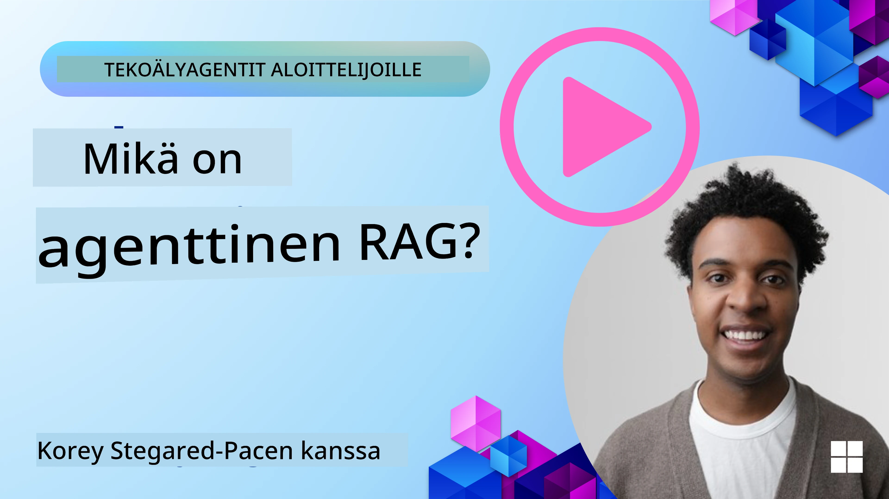
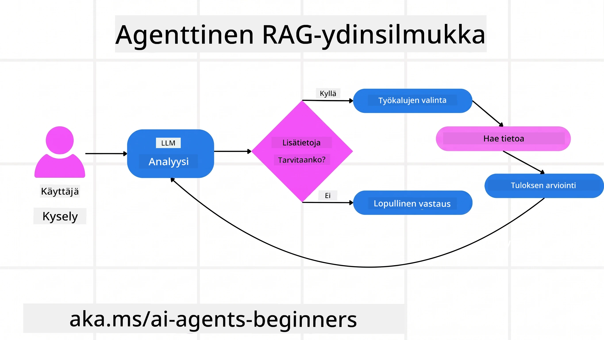
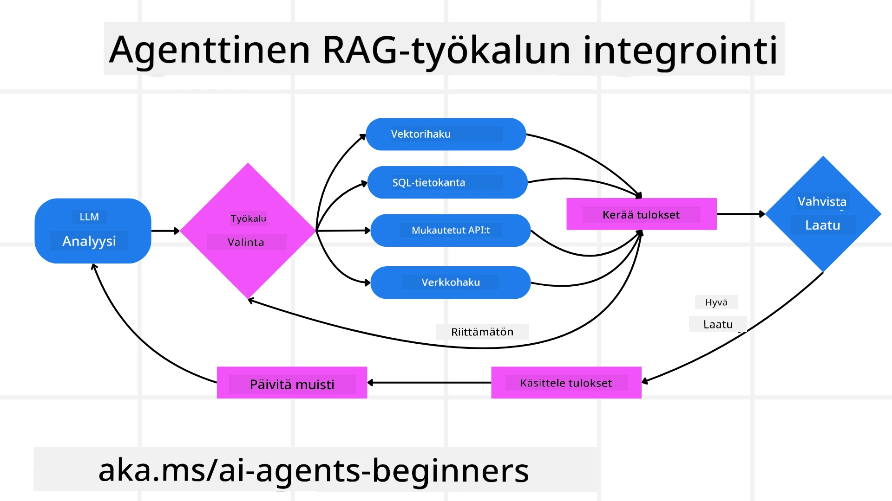
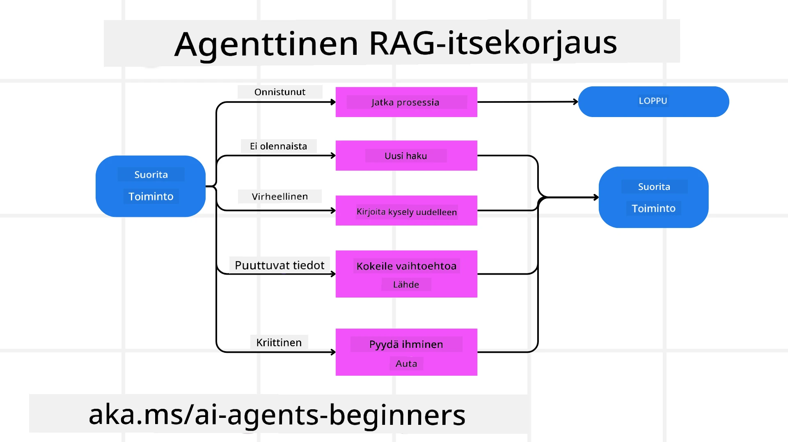
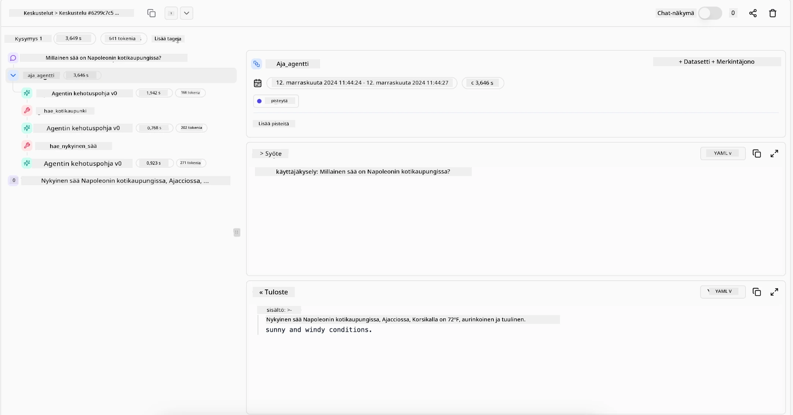

> _(Napsauta yllä olevaa kuvaa katsellaksesi tämän oppitunnin videota)_

# Agentic RAG

Tämä oppitunti tarjoaa kattavan yleiskatsauksen Agentic Retrieval-Augmented Generationista (Agentic RAG), kehittyvästä tekoälyn paradigmaattisesta lähestymistavasta, jossa suuret kielimallit (LLM:t) suunnittelevat itsenäisesti seuraavia askeleitaan samalla kun ne hakevat tietoa ulkoisista lähteistä. Toisin kuin staattiset hakeminen-ensisijaisesti -mallit, Agentic RAG sisältää toistuvia kutsuja LLM:lle, joita rytmittävät työkalujen tai toimintojen kutsut sekä jäsennellyt tulosteet. Järjestelmä arvioi tuloksia, tarkentaa hakukyselyjä, kutsuu tarvittaessa lisätyökaluja ja toistaa tätä sykliä, kunnes tyydyttävä ratkaisu on saavutettu.

## Johdanto

Tässä oppitunnissa käsitellään

- **Agentic RAG:n ymmärtäminen:** Opi kehittyvästä AI-paradigmasta, jossa suuret kielimallit (LLM:t) suunnittelevat itsenäisesti seuraavia askeleitaan samalla kun ne hakevat tietoa ulkoisista tietolähteistä.
- **Iteratiivisen Maker-Checker-tyylin hallinta:** Ymmärrä toistuvien kutsujen silmukka LLM:lle, jota rytmittävät työkalujen tai toimintojen kutsut sekä jäsennellyt tulosteet, jotka on suunniteltu parantamaan tarkkuutta ja käsittelemään virheellisiä kyselyitä.
- **Käytännön sovellusten tutkiminen:** Tunnista tilanteet, joissa Agentic RAG loistaa, kuten tarkkuuslähtöiset ympäristöt, monimutkaiset tietokantaintegraatiot ja laajennetut työvirrat.

## Oppimistavoitteet

Oppitunnin suorittamisen jälkeen osaat/ymmärrät:

- **Agentic RAG:n ymmärtäminen:** Opi kehittyvästä AI-paradigmasta, jossa suuret kielimallit (LLM:t) suunnittelevat itsenäisesti seuraavia askeleitaan samalla kun ne hakevat tietoa ulkoisista tietolähteistä.
- **Iteratiivinen Maker-Checker-tyyli:** Ymmärrä konsepti, jossa LLM:lle tehdään toistuvia kutsuja, joita rytmittävät työkalujen tai toimintojen kutsut ja jäsennellyt tulosteet, joiden tarkoituksena on parantaa tarkkuutta ja käsitellä virheellisiä kyselyitä.
- **Päämäärä prosessin hallinnassa:** Ymmärrä järjestelmän kyky hallita omaa päättelyprosessiaan, päätellen, miten ongelmia lähestytään ilman ennalta määriteltyjä polkuja.
- **Työvirta:** Ymmärrä, miten agenttimalli itsenäisesti päättää hakea markkinatrendiraportteja, tunnistaa kilpailijatietoja, korreloi sisäisiä myyntimittareita, yhdistää löydökset ja arvioi strategian.
- **Iteratiiviset silmukat, työkalujen integrointi ja muisti:** Opi järjestelmän perustuvan toistuvaan vuorovaikutusmalliin, ylläpitäen tilaa ja muistia askelten yli välttääkseen toistuvat silmukat ja tehdäkseen perusteltuja päätöksiä.
- **Virhetilanteiden käsittely ja itsekorjaus:** Tutki järjestelmän vahvoja itsekorjausmekanismeja, kuten toistamista ja uudelleenkyselyä, diagnostiikkatyökalujen käyttöä ja inhimilliseen valvontaan turvautumista.
- **Agenttiuden rajat:** Ymmärrä Agentic RAG:n rajoitukset, keskittyen tehtäväkohtaisen autonomian, infrastruktuuririippuvuuden ja turvatoimien kunnioittamisen tärkeyteen.
- **Käytännön käyttötapaukset ja arvo:** Tunnista tilanteet, joissa Agentic RAG toimii parhaiten, esimerkiksi tarkkuuslähtöisissä ympäristöissä, monimutkaisissa tietokantaintegraatioissa ja laajennetuissa työvirroissa.
- **Hallinto, läpinäkyvyys ja luottamus:** Opi hallinnon ja läpinäkyvyyden merkitys, mukaan lukien selitettävä päättely, harhan hallinta ja inhimillinen valvonta.

## Mikä on Agentic RAG?

Agentic Retrieval-Augmented Generation (Agentic RAG) on kehittyvä tekoälyn paradigma, jossa suuret kielimallit (LLM:t) suunnittelevat itsenäisesti seuraavia askeleitaan samalla kun ne hakevat tietoa ulkoisista lähteistä. Toisin kuin staattiset hakeminen-ensisijaisesti -mallit, Agentic RAG sisältää toistuvia kutsuja LLM:lle, joita rytmittävät työkalujen tai toimintojen kutsut ja jäsennellyt tulosteet. Järjestelmä arvioi tuloksia, tarkentaa hakukyselyitä, kutsuu tarvittaessa lisätyökaluja ja jatkaa sykliä, kunnes tyydyttävä ratkaisu löytyy. Tämä iteratiivinen ”maker-checker” -tyyli parantaa tarkkuutta, käsittelee virheellisiä kyselyjä ja varmistaa laadukkaat tulokset.

Järjestelmä hallitsee aktiivisesti omaa päättelyprosessiaan, kirjoittaen uudelleen epäonnistuneita kyselyjä, valiten erilaisia hakumenetelmiä ja integroimalla useita työkaluja—kuten vektorihaun Azure AI Searchissa, SQL-tietokannat tai mukautetut API:t—ennen vastauksen lopullista muotoilua. Agenttijärjestelmän erottuva ominaisuus on kyky hallita oma päättelyprosessinsa. Perinteiset RAG-toteutukset perustuvat ennalta määriteltyihin polkuihin, mutta agenttijärjestelmä määrittää autonomisesti toimenpidesarjan löytämänsä tiedon laadun perusteella.

## Agentic Retrieval-Augmented Generationin (Agentic RAG) määrittely

Agentic Retrieval-Augmented Generation (Agentic RAG) on kehittyvä AI-kehityksen paradigma, jossa LLM:t eivät pelkästään hae tietoa ulkoisista tietolähteistä, vaan myös suunnittelevat itsenäisesti seuraavia askeleitaan. Toisin kuin staattiset hakeminen-ensisijaisesti -mallit tai huolellisesti skriptatut kehotteet, Agentic RAG sisältää toistuvan silmukan LLM-kutsuja, joita rytmittävät työkalujen tai toimintojen kutsut ja jäsennellyt tulosteet. Järjestelmä arvioi joka hetkellä saadut tulokset, päättää tarkentaa hakukyselyjä, kutsuu tarvittaessa lisätyökaluja ja jatkaa tätä sykliä, kunnes saavuttaa tyydyttävän ratkaisun.

Tämä iteratiivinen ”maker-checker” -toimintatyyli on suunniteltu parantamaan tarkkuutta, käsittelemään virheellisiä kyselyjä rakenteellisissa tietokannoissa (esim. NL2SQL) ja varmistamaan tasapainoiset, laadukkaat tulokset. Sen sijaan, että luotetaan pelkästään huolellisesti suunniteltuihin kehottesarjoihin, järjestelmä hallitsee aktiivisesti päättelyprosessinsa. Se voi kirjoittaa uudelleen epäonnistuneita kyselyjä, valita erilaisia hakumenetelmiä ja integroida useita työkaluja—kuten vektorihaun Azure AI Searchissa, SQL-tietokantaan tai mukautettuihin API:hin—ennen vastauksensa viimeistelyä. Tämä poistaa tarpeen monimutkaisille orkestrointikehyksille. Sen sijaan melko yksinkertainen silmukka ”LLM-kutsu → työkalun käyttö → LLM-kutsu → …” voi tuottaa kehittyneitä ja hyvin perusteltuja tuloksia.

## Päättelyprosessin hallinta

Erottava ominaisuus, joka tekee järjestelmästä ”agenttisen”, on sen kyky hallita omaa päättelyprosessiaan. Perinteiset RAG-toteutukset usein luottavat ihmisiin määrittelemään mallille polun: ajatusketju, joka määrittelee, mitä hakea ja milloin.
Mutta kun järjestelmä on todella agenttinen, se päättää sisäisesti, miten lähestyy ongelmaa. Se ei vain suorita skriptiä, vaan päättää itsenäisesti toimenpidesarjan tietolähteen laadun perusteella.
Esimerkiksi, jos sitä pyydetään luomaan tuotteen lanseerausstrategia, se ei perustu pelkästään kehotteeseen, joka määrittelee koko tutkimus- ja päätöksentekoprosessin. Sen sijaan agenttimalli päättää itsenäisesti:

1. Hakea ajantasaiset markkinatrendiraportit Bing Web Groundingin avulla.
2. Tunnistaa asiaankuuluvat kilpailijatiedot Azure AI Searchin avulla.
3. Korreloida historialliset sisäiset myyntimittarit Azure SQL Databasen avulla.
4. Yhdistää löydökset yhtenäiseksi strategiaksi Azure OpenAI Servicen kautta.
5. Arvioida strategia aukkojen tai epäjohdonmukaisuuksien varalta ja hakea tietoa uudelleen tarvittaessa.
Kaikki nämä vaiheet — kyselyjen tarkentaminen, lähteiden valinta, iteraatio kunnes vastaus on tyydyttävä — päätetään kokonaan mallin toimesta, ei ihmisen ennalta määrittelemänä.

## Iteratiiviset silmukat, työkalujen integrointi ja muisti

Agenttijärjestelmä perustuu toistuvaan vuorovaikutusmalliin:

- **Ensimmäinen kutsu:** Käyttäjän tavoite (eli käyttäjän pyyntö) esitetään LLM:lle.
- **Työkalun kutsu:** Jos malli havaitsee puuttuvaa tietoa tai epäselviä ohjeita, se valitsee työkalun tai hakumenetelmän—esimerkiksi vektoripohjaisen tietokantahaun (esim. Azure AI Search Hybrid -haku yksityisistä tiedoista) tai rakenteellisen SQL-kyselyn—hankkiakseen lisää kontekstia.
- **Arviointi ja tarkentaminen:** Saamansa datan tarkasteltuaan malli päättää, onko tieto riittävä. Jos ei, se tarkentaa kyselyä, kokeilee toista työkalua tai muuttaa lähestymistapaa.
- **Toisto kunnes tyytyväinen:** Tätä sykliä jatketaan, kunnes malli todetaan saaneen tarpeeksi selkeyttä ja näyttöä lopullisen hyvin perustellun vastauksen antamiseksi.
- **Muisti ja tila:** Koska järjestelmä säilyttää tilan ja muistin askelten yli, se muistaa aiemmat yritykset ja niiden tulokset, välttäen toistuvia silmukoita ja tehdäkseen tietoisempia päätöksiä etenemisessään.

Ajan myötä tämä luo kehittyvän ymmärryksen tunteen, mahdollistaen mallin suorittaa monimutkaisia, moniasteisia tehtäviä ilman, että ihminen tarvitsee jatkuvasti puuttua tai muokata kehotetta.

## Virhetilanteiden käsittely ja itsekorjaus

Agentic RAG:n autonomia sisältää myös vahvoja itsekorjausmekanismeja. Kun järjestelmä kohtaa umpikujiin—kuten merkityksettömien asiakirjojen haun tai virheellisten kyselyiden kohdalla—se voi:

- **Iteroida ja uudelleenhakea:** Palauttamatta vähäarvoisia vastauksia, malli kokeilee uusia hakustrategioita, kirjoittaa uudelleen tietokantakyselyjä tai tarkastelee vaihtoehtoisia tietoaineistoja.
- **Käyttää diagnostiikkatyökaluja:** Järjestelmä voi kutsua lisätoimintoja, joiden avulla se voi virheenkorjausta päättelyvaiheissaan tai vahvistaa haetun tiedon oikeellisuuden. Työkalut kuten Azure AI Tracing ovat tärkeitä vankan havaittavuuden ja valvonnan mahdollistamiseksi.
- **Turvautua ihmisen valvontaan:** Korkean panoksen tai toistuvasti virheilevissä tilanteissa malli voi merkitä epävarmuuden ja pyytää ihmisen ohjausta. Kun ihminen antaa korjaavaa palautetta, malli osaa hyödyntää sitä myöhemmin.

Tämä iteratiivinen ja dynaaminen lähestymistapa mahdollistaa mallin jatkuvan parantamisen, varmistaen, ettei se ole pelkkä ”yhdellä kerralla” -järjestelmä vaan oppii virheistään kulloisenkin istunnon aikana.

## Agenttiuden rajat

Huolimatta tehtäväkohtaisesta autonomiastaan, Agentic RAG ei ole sama asia kuin yleisäly (Artificial General Intelligence). Sen ”agenttiominaisuudet” rajoittuvat työkaluihin, tietolähteisiin ja kehittäjien asettamiin politiikkoihin. Se ei voi keksiä omia työkalujaan tai astua sen domainin ulkopuolelle, joka on sille määritelty. Sen sijaan se loistaa resurssien dynaamisessa orkestroinnissa.
Keskeiset erot kehittyneempiin tekoälymuotoihin ovat:

1. **Domain-kohtainen autonomia:** Agentic RAG -järjestelmät keskittyvät käyttäjän määrittämien tavoitteiden saavuttamiseen tunnetussa domainissa, käyttäen strategioita kuten kyselyiden uudelleenkirjoitus tai työkalujen valinta tulosten parantamiseksi.
2. **Infrastruktuuririippuvainen:** Järjestelmän kyvykkyydet riippuvat kehittäjien integroimista työkaluista ja tiedoista. Se ei voi ylittää näitä rajoja ilman ihmisen puuttumista.
3. **Turvarajojen kunnioitus:** Eettiset ohjeistukset, sääntelyn vaatimukset ja liiketoimintapolitiikat ovat edelleen erittäin tärkeitä. Agentin vapaus on aina sidoksissa turvallisuus- ja valvontamekanismeihin (toivottavasti).

## Käytännön käyttötapaukset ja arvo

Agentic RAG loistaa tilanteissa, joissa vaaditaan iteratiivista hienosäätöä ja tarkkuutta:

1. **Tarkkuus ensin -ympäristöt:** Sääntelyn tarkastuksissa, lakianalyyseissä tai juridisessa tutkimuksessa agenttimalli voi toistuvasti varmistaa faktat, konsultoida useita lähteitä ja kirjoittaa kyselyjä uudelleen tuottaakseen perusteellisesti validoidun vastauksen.
2. **Monimutkaiset tietokantaintegraatiot:** Kun käsitellään rakenteellista dataa, jossa kyselyt usein epäonnistuvat tai tarvitsevat tarkistuksia, järjestelmä voi itsenäisesti hienosäätää kyselyitä Azure SQL:n tai Microsoft Fabric OneLaken avulla varmistaen, että lopullinen haku vastaa käyttäjän aikomusta.
3. **Laajennetut työvirrat:** Pitkään kestävät istunnot voivat kehittyä jatkuvasti uutta tietoa ilmestyessä. Agentic RAG voi jatkuvasti sisällyttää uutta dataa, muuttaen strategioita oppiessaan lisää ongelma-alueesta.

## Hallinto, läpinäkyvyys ja luottamus

Näiden järjestelmien tullessa autonomisemmiksi päättelyssään, hallinto ja läpinäkyvyys ovat ratkaisevan tärkeitä:

- **Selitettävä päättely:** Malli voi tarjota auditointijäljen tekemistään kyselyistä, ne lähteet, joita se käytti, ja päättelyvaiheet, joilla se saavutti johtopäätöksensä. Työkalut kuten Azure AI Content Safety ja Azure AI Tracing / GenAIOps voivat auttaa ylläpitämään läpinäkyvyyttä ja vähentämään riskejä.
- **Harhan hallinta ja tasapainoinen haku:** Kehittäjät voivat säätää hakustrategioita varmistaakseen, että tasapainoiset ja edustavat tietolähteet otetaan huomioon, ja säännöllisesti tarkastaa tuotokset havaitakseen harhaa tai vinoja malleja käyttämällä mukautettuja malleja kehittyneille data-analytiikan organisaatioille Azure Machine Learningin avulla.
- **Ihmisen valvonta ja säädösten noudattaminen:** Herkillä tehtävillä ihmisen tarkastus on edelleen välttämätöntä. Agentic RAG ei korvaa inhimillistä harkintaa korkean panoksen päätöksissä—se tukee sitä toimittamalla laadukkaammin arvioituja vaihtoehtoja.

On olennaista, että käytössä on työkaluja, jotka tarjoavat selkeän toimintalokin. Ilman niitä monivaiheisen prosessin virheenjäljitys voi olla hyvin vaikeaa. Katso seuraava esimerkki Literal AI:lta (yritys Chainlitin takana) agentin ajosta:

## Yhteenveto

Agentic RAG edustaa luonnollista evoluutiota siinä, miten tekoälyjärjestelmät käsittelevät monimutkaisia, dataintensiivisiä tehtäviä. Omaksumalla toistuvan vuorovaikutusmallin, valitsemalla työkalut itsenäisesti ja tarkentamalla kyselyjä kunnes saavutetaan laadukas tulos, järjestelmä siirtyy staattisesta kehotteen seuraamisesta adaptiivisempaan, kontekstin aware päätöksentekijään. Vaikka se on edelleen rajattu ihmisen määrittelemän infrastruktuurin ja eettisten ohjeiden mukaan, nämä agenttikyvykkyydet mahdollistavat rikkaampia, dynaamisempia ja lopulta hyödyllisempiä tekoälyvuorovaikutuksia niin yrityksille kuin loppukäyttäjille.

### Haluatko tietää lisää Agentic RAG:sta?

Liity [Microsoft Foundry Discordiin](https://discord.com/invite/ATgtXmAS5D) tavata muita oppijoita, osallistua toimistoaikoihin ja saada vastauksia tekoälyagenttikysymyksiisi.

## Lisäresurssit

- <a href="https://learn.microsoft.com/training/modules/use-own-data-azure-openai" target="_blank">Ota käyttöön Retrieval Augmented Generation (RAG) Azure OpenAI Servicen avulla: Opi käyttämään omia tietojasi Azure OpenAI Servicen kanssa. Tämä Microsoft Learn -moduuli tarjoaa kattavan oppaan RAG:n toteuttamisesta</a>
- <a href="https://learn.microsoft.com/azure/ai-studio/concepts/evaluation-approach-gen-ai" target="_blank">Generatiivisen tekoälyn sovellusten arviointi Microsoft Foundryn avulla: Artikkeli käsittelee mallien arviointia ja vertailua julkisesti saatavilla olevilla dataseteillä, mukaan lukien agenttipohjaiset AI-sovellukset ja RAG-arkkitehtuurit</a>
- <a href="https://weaviate.io/blog/what-is-agentic-rag" target="_blank">Mikä on Agentic RAG | Weaviate</a>
- <a href="https://ragaboutit.com/agentic-rag-a-complete-guide-to-agent-based-retrieval-augmented-generation/" target="_blank">Agentic RAG: Täydellinen opas agenttipohjaiseen Retrieval Augmented Generationiin – Uutisia generation RAG:sta</a>

- <a href="https://huggingface.co/learn/cookbook/agent_rag" target="_blank">Agenttinen RAG: tehosta RAG:ia kyselyn uudelleenmuotoilulla ja itse-kyselyllä! Hugging Face Open-Source AI Cookbook</a>
- <a href="https://youtu.be/aQ4yQXeB1Ss?si=2HUqBzHoeB5tR04U" target="_blank">Agenttikerrosten lisääminen RAG:iin</a>
- <a href="https://www.youtube.com/watch?v=zeAyuLc_f3Q&t=244s" target="_blank">Tietoavustajien tulevaisuus: Jerry Liu</a>
- <a href="https://www.youtube.com/watch?v=AOSjiXP1jmQ" target="_blank">Kuinka rakentaa agenttisia RAG-järjestelmiä</a>
- <a href="https://ignite.microsoft.com/sessions/BRK102?source=sessions" target="_blank">Microsoft Foundry Agent Service:n käyttäminen tekoälyagenttien skaalaamiseen</a>

### Tieteelliset julkaisut

- <a href="https://arxiv.org/abs/2303.17651" target="_blank">2303.17651 Self-Refine: Itereerivä parantaminen itsepalautteen avulla</a>
- <a href="https://arxiv.org/abs/2303.11366" target="_blank">2303.11366 Reflexion: Kielipohjaiset agentit verbaalisella vahvistusoppimisella</a>
- <a href="https://arxiv.org/abs/2305.11738" target="_blank">2305.11738 CRITIC: Suuret kielimallit voivat itsekorjata työkaluinteraktiivisen kritiikin avulla</a>
- <a href="https://arxiv.org/abs/2501.09136" target="_blank">2501.09136 Agenttinen hakua laajentava generointi: Katsaus agenttiseen RAG:iin</a>

## Edellinen oppitunti

[Työkalujen käyttömalli](../04-tool-use/README.md)

## Seuraava oppitunti

[Luotettavien tekoälyagenttien rakentaminen](../06-building-trustworthy-agents/README.md)

---

<!-- CO-OP TRANSLATOR DISCLAIMER START -->
**Vastuuvapauslauseke**:
Tämä asiakirja on käännetty käyttämällä tekoälypohjaista käännöspalvelua [Co-op Translator](https://github.com/Azure/co-op-translator). Vaikka pyrimme tarkkuuteen, otathan huomioon, että automaattiset käännökset saattavat sisältää virheitä tai epätarkkuuksia. Alkuperäinen asiakirja sen alkuperäiskielellä on virallinen lähde. Tärkeissä asioissa suositellaan ammattimaista ihmiskäännöstä. Emme ole vastuussa tämän käännöksen käytöstä aiheutuvista väärinymmärryksistä tai tulkinnoista.
<!-- CO-OP TRANSLATOR DISCLAIMER END -->