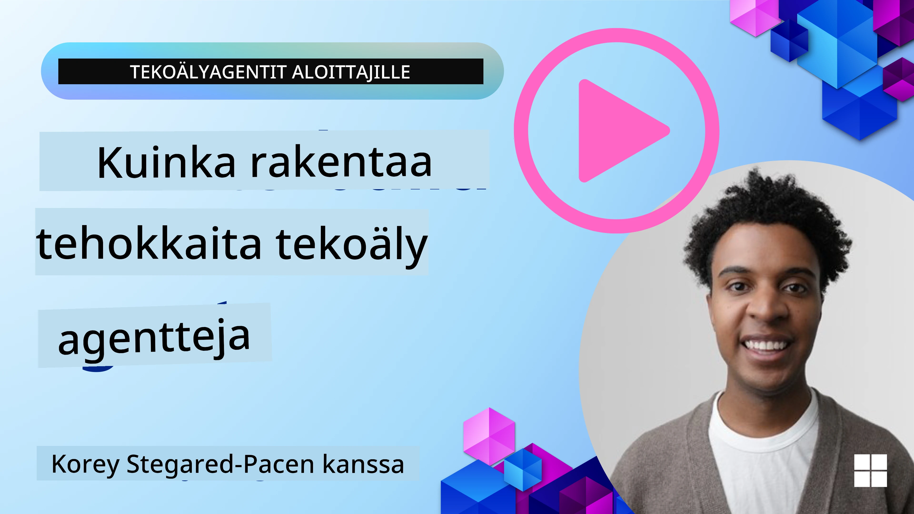
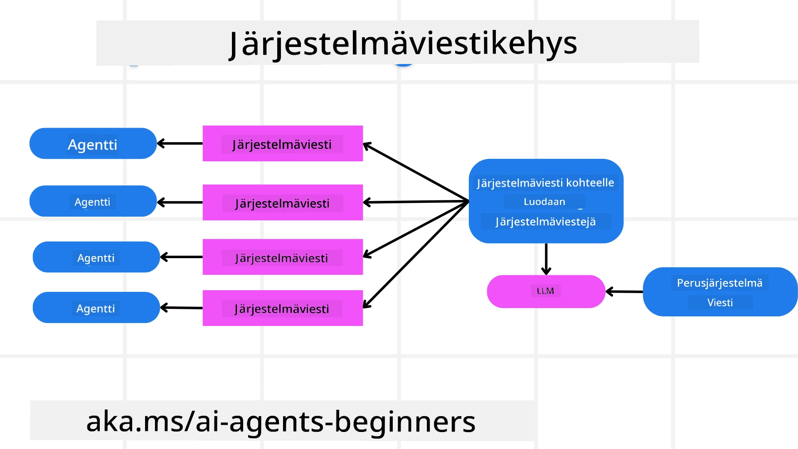
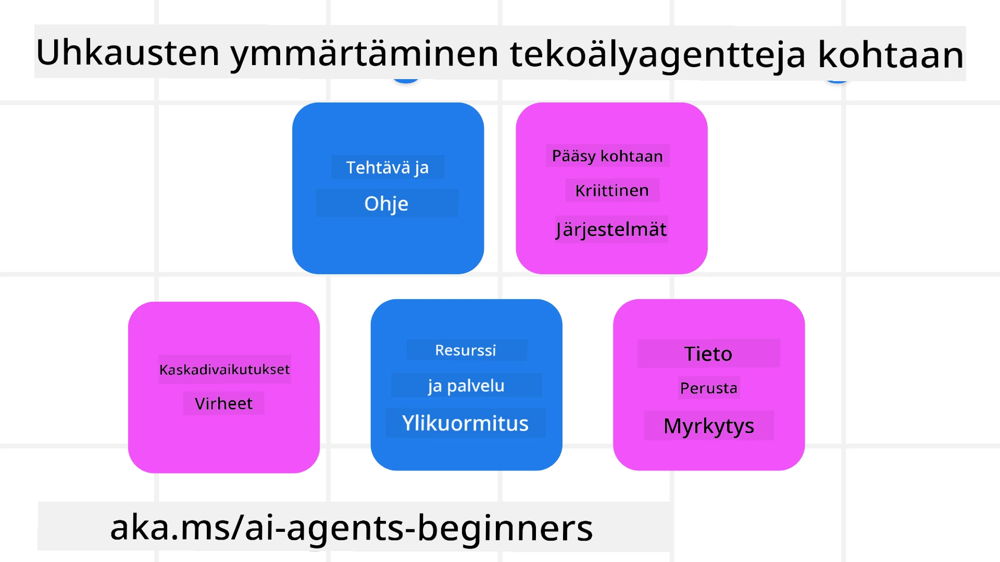
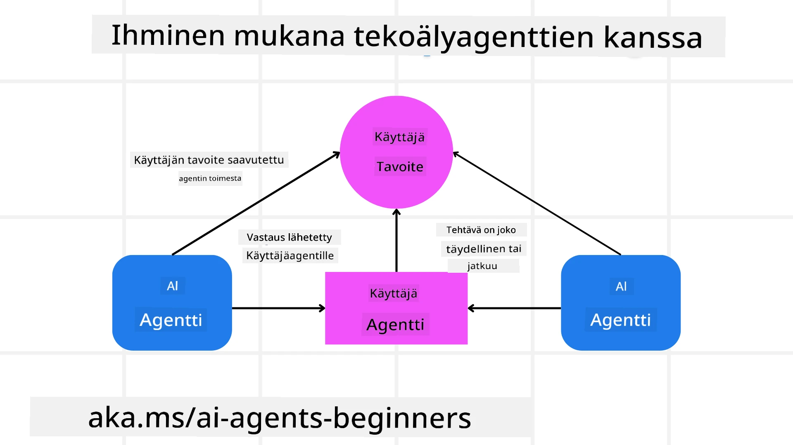

[](https://youtu.be/iZKkMEGBCUQ?si=Q-kEbcyHUMPoHp8L)

> _(Napsauta yllä olevaa kuvaa nähdäksesi tämän oppitunnin videon)_

# Luotettavien tekoälyagenttien rakentaminen

## Johdanto

Tässä oppitunnissa käsitellään:

- Kuinka rakentaa ja ottaa käyttöön turvallisia ja tehokkaita tekoälyagentteja
- Tärkeitä turvallisuusnäkökohtia tekoälyagenttien kehittämisessä
- Kuinka ylläpitää tiedon ja käyttäjän yksityisyyttä tekoälyagentteja kehitettäessä

## Oppimistavoitteet

Oppitunnin suorittamisen jälkeen osaat:

- Tunnistaa ja vähentää riskejä tekoälyagentteja luotaessa
- Toteuttaa turvallisuustoimenpiteitä varmistaaksesi, että tiedot ja pääsy hallitaan asianmukaisesti
- Luoda tekoälyagentteja, jotka säilyttävät tietosuojan ja tarjoavat laadukkaan käyttökokemuksen

## Turvallisuus

Katsotaan ensin turvallisten agenttisovellusten rakentamista. Turvallisuus tarkoittaa, että tekoälyagentti toimii suunnitellusti. Agenttisovellusten rakentajina meillä on menetelmiä ja työkaluja turvallisuuden maksimoimiseksi:

### Järjestelmäviestikehyksen rakentaminen

Jos olet koskaan rakentanut tekoälysovellusta käyttäen suuria kielimalleja (LLM), tiedät, kuinka tärkeää on suunnitella vankka järjestelmäkehotus tai järjestelmäviesti. Nämä kehotukset määrittävät meta-säännöt, ohjeet ja suuntaviivat sille, miten LLM vuorovaikuttaa käyttäjän ja datan kanssa.

Tekoälyagenttien kohdalla järjestelmäkehotus on vielä tärkeämpi, sillä tekoälyagentit tarvitsevat erittäin tarkat ohjeet suorittaakseen meille suunnitellut tehtävät.

Skalautuvien järjestelmäkehotusten luomiseksi voimme käyttää järjestelmäviestikehystä yhden tai useamman agentin rakentamiseen sovelluksessamme:



#### Vaihe 1: Luo meta-järjestelmäviesti

Meta-kehotusta käyttää LLM luodakseen järjestelmäkehotuksia luomillemme agenteille. Suunnittelemme sen malliksi, jotta voimme tehokkaasti luoda useita agentteja tarvittaessa.

Tässä on esimerkki meta-järjestelmäviestistä, jonka antaisimme LLM:lle:

```plaintext
You are an expert at creating AI agent assistants. 
You will be provided a company name, role, responsibilities and other
information that you will use to provide a system prompt for.
To create the system prompt, be descriptive as possible and provide a structure that a system using an LLM can better understand the role and responsibilities of the AI assistant. 
```

#### Vaihe 2: Luo peruskehotus

Seuraava vaihe on luoda peruskehotus, joka kuvaa tekoälyagenttia. Sinun tulisi sisällyttää agentin rooli, suoritetut tehtävät ja muut agentin vastuut.

Tässä on esimerkki:

```plaintext
You are a travel agent for Contoso Travel that is great at booking flights for customers. To help customers you can perform the following tasks: lookup available flights, book flights, ask for preferences in seating and times for flights, cancel any previously booked flights and alert customers on any delays or cancellations of flights.  
```

#### Vaihe 3: Anna perusjärjestelmäviesti LLM:lle

Nyt voimme optimoida tämän järjestelmäviestin antamalla meta-järjestelmäviestin järjestelmäviestinä ja perusjärjestelmäviestimme.

Tämä tuottaa paremmin suunnitellun järjestelmäviestin, joka ohjaa tekoälyagenttejamme:

```markdown
**Company Name:** Contoso Travel  
**Role:** Travel Agent Assistant

**Objective:**  
You are an AI-powered travel agent assistant for Contoso Travel, specializing in booking flights and providing exceptional customer service. Your main goal is to assist customers in finding, booking, and managing their flights, all while ensuring that their preferences and needs are met efficiently.

**Key Responsibilities:**

1. **Flight Lookup:**
    
    - Assist customers in searching for available flights based on their specified destination, dates, and any other relevant preferences.
    - Provide a list of options, including flight times, airlines, layovers, and pricing.
2. **Flight Booking:**
    
    - Facilitate the booking of flights for customers, ensuring that all details are correctly entered into the system.
    - Confirm bookings and provide customers with their itinerary, including confirmation numbers and any other pertinent information.
3. **Customer Preference Inquiry:**
    
    - Actively ask customers for their preferences regarding seating (e.g., aisle, window, extra legroom) and preferred times for flights (e.g., morning, afternoon, evening).
    - Record these preferences for future reference and tailor suggestions accordingly.
4. **Flight Cancellation:**
    
    - Assist customers in canceling previously booked flights if needed, following company policies and procedures.
    - Notify customers of any necessary refunds or additional steps that may be required for cancellations.
5. **Flight Monitoring:**
    
    - Monitor the status of booked flights and alert customers in real-time about any delays, cancellations, or changes to their flight schedule.
    - Provide updates through preferred communication channels (e.g., email, SMS) as needed.

**Tone and Style:**

- Maintain a friendly, professional, and approachable demeanor in all interactions with customers.
- Ensure that all communication is clear, informative, and tailored to the customer's specific needs and inquiries.

**User Interaction Instructions:**

- Respond to customer queries promptly and accurately.
- Use a conversational style while ensuring professionalism.
- Prioritize customer satisfaction by being attentive, empathetic, and proactive in all assistance provided.

**Additional Notes:**

- Stay updated on any changes to airline policies, travel restrictions, and other relevant information that could impact flight bookings and customer experience.
- Use clear and concise language to explain options and processes, avoiding jargon where possible for better customer understanding.

This AI assistant is designed to streamline the flight booking process for customers of Contoso Travel, ensuring that all their travel needs are met efficiently and effectively.

```

#### Vaihe 4: Toista ja kehitä

Tämän järjestelmäviestikehyksen arvo on siinä, että se helpottaa monien agenttien järjestelmäviestien luomista sekä järjestelmäviestien parantamista ajan myötä. On harvinaista, että sinulla olisi heti ensimmäisellä kerralla täydellinen järjestelmäviesti käyttötapaustasi varten. Pienten säätöjen ja parannusten tekeminen muuttamalla perusjärjestelmäviestiä ja ajamalla se järjestelmän läpi antaa sinun vertailla ja arvioida tuloksia.

## Uhkien ymmärtäminen

Luodaksesi luotettavia tekoälyagentteja, on tärkeää ymmärtää ja vähentää agenttiisi kohdistuvia riskejä ja uhkia. Tarkastelemme vain joitakin tekoälyagentteihin kohdistuvia erilaisia uhkia ja miten voit paremmin suunnitella ja varautua niihin.



### Tehtävä ja ohjeet

**Kuvaus:** Hyökkääjät yrittävät muuttaa tekoälyagentin ohjeita tai tavoitteita kehotusten avulla tai muokkaamalla syötteitä.

**Vähentäminen:** Suorita validointitarkastuksia ja syötteiden suodatusta havaitaksesi mahdollisesti vaaralliset kehotukset ennen kuin tekoälyagentti käsittelee ne. Koska tällaiset hyökkäykset vaativat tyypillisesti usein vuorovaikutusta agentin kanssa, rajoita keskustelun kääntöjen määrää estääksesi tämän tyyppisiä hyökkäyksiä.

### Pääsy kriittisiin järjestelmiin

**Kuvaus:** Jos tekoälyagentilla on pääsy järjestelmiin ja palveluihin, jotka sisältävät arkaluontoista dataa, hyökkääjät voivat vaarantaa agentin ja näiden palveluiden välisen viestinnän. Nämä voivat olla suoria hyökkäyksiä tai epäsuoria yrityksiä saada tietoa näistä järjestelmistä agentin kautta.

**Vähentäminen:** Tekoälyagenttien tulisi saada pääsy järjestelmiin vain tarpeen mukaan tämän tyyppisten hyökkäysten estämiseksi. Lisäksi agentin ja järjestelmän välinen viestintä tulisi suojata. Todennuksen ja pääsynhallinnan toteuttaminen on toinen tapa suojata tätä tietoa.

### Resurssien ja palveluiden ylikuormitus

**Kuvaus:** Tekoälyagentit voivat käyttää eri työkaluja ja palveluita tehtävien suorittamiseen. Hyökkääjät voivat käyttää tätä kykyä hyökätäkseen palveluihin lähettämällä suuren määrän pyyntöjä tekoälyagentin kautta, mikä voi johtaa järjestelmävirheisiin tai korkeisiin kustannuksiin.

**Vähentäminen:** Toteuta käytännöt, joilla rajoitetaan pyyntöjen määrää, jonka tekoälyagentti voi tehdä palveluun. Keskustelun kääntöjen ja pyyntöjen määrän rajoittaminen tekoälyagentillesi on toinen keino estää näitä hyökkäyksiä.

### Tietokannan myrkyttäminen

**Kuvaus:** Tämä hyökkäystyyppi ei kohdistu suoraan tekoälyagenttiin, vaan tietokantaan ja muihin palveluihin, joita tekoälyagentti käyttää. Se voi sisältää datan tai tiedon turmelemisen, jota agentti käyttää tehtävän suorittamiseen, mikä johtaa puolueellisiin tai ei-toivottuihin käyttäjävastauksiin.

**Vähentäminen:** Suorita säännöllisiä tarkistuksia datalle, jota tekoälyagentti käyttää työnkuluissaan. Varmista, että tämän datan käyttö on suojattu ja että sitä voivat muuttaa vain luotetut henkilöt tämän tyyppisen hyökkäyksen välttämiseksi.

### Ketjureaktiovirheet

**Kuvaus:** Tekoälyagentit käyttävät eri työkaluja ja palveluita tehtävien suorittamiseen. Hyökkääjien aiheuttamat virheet voivat johtaa muiden agenttiin liitettyjen järjestelmien vikaantumiseen, mikä saa hyökkäyksen leviämään ja vaikeuttaa sen selvittämistä.

**Vähentäminen:** Yksi tapa välttää tämä on antaa tekoälyagentin toimia rajoitetussa ympäristössä, kuten suorittaa tehtäviä Docker-kontissa, estäen suorat järjestelmähyökkäykset. Takaisinkytkentämekanismien ja uudelleenyritysten luominen, kun tietyt järjestelmät vastaavat virheellä, on toinen keino estää laajempia järjestelmävikoja.

## Ihminen Loopissa (Human-in-the-Loop)

Toinen tehokas tapa rakentaa luotettavia tekoälyagenttijärjestelmiä on käyttää ihmistä vuorovaikutuksessa. Tämä luo kulun, jossa käyttäjät voivat antaa palautetta agenteille suorituksen aikana. Käyttäjät toimivat ikään kuin agenteina monen agentin järjestelmässä ja hyväksyvät tai keskeyttävät toiminnon.



Tässä on koodiesimerkki Microsoft Agent Frameworkin käytöstä tämän käsitteen toteutukseen:

```python
import os
from agent_framework.azure import AzureAIProjectAgentProvider
from azure.identity import AzureCliCredential

# Luo tarjoaja, jossa on ihmisen hyväksyntäprosessi
provider = AzureAIProjectAgentProvider(
    credential=AzureCliCredential(),
)

# Luo toimija, jossa on ihmisen hyväksymisvaihe
response = provider.create_response(
    input="Write a 4-line poem about the ocean.",
    instructions="You are a helpful assistant. Ask for user approval before finalizing.",
)

# Käyttäjä voi tarkastella ja hyväksyä vastauksen
print(response.output_text)
user_input = input("Do you approve? (APPROVE/REJECT): ")
if user_input == "APPROVE":
    print("Response approved.")
else:
    print("Response rejected. Revising...")
```

## Yhteenveto

Luotettavien tekoälyagenttien rakentaminen vaatii huolellista suunnittelua, vahvoja turvallisuustoimia ja jatkuvaa iterointia. Rakentamalla rakenteellisia meta-kehotusjärjestelmiä, ymmärtämällä mahdolliset uhkat ja käyttämällä vähennysstrategioita kehittäjät voivat luoda turvallisia ja tehokkaita tekoälyagentteja. Lisäksi ihmisen osallistuminen varmistaa, että tekoälyagentit pysyvät käyttäjien tarpeiden mukaisina ja minimoivat riskit. Kun tekoäly kehittyy, proaktiivisen turvallisuus-, yksityisyys- ja eettisen näkökulman ylläpito on avain luottamuksen ja luotettavuuden edistämiseksi tekoälyn ohjaamissa järjestelmissä.

### Onko sinulla lisää kysymyksiä luotettavien tekoälyagenttien rakentamisesta?

Liity [Microsoft Foundry Discord -kanavalle](https://aka.ms/ai-agents/discord) tavata muita oppijoita, osallistua toimistoaikoihin ja saada vastauksia tekoälyagenttikysymyksiisi.

## Lisäresurssit

- <a href="https://learn.microsoft.com/azure/ai-studio/responsible-use-of-ai-overview" target="_blank">Vastuullisen tekoälyn yleiskatsaus</a>
- <a href="https://learn.microsoft.com/azure/ai-studio/concepts/evaluation-approach-gen-ai" target="_blank">Generatiivisten tekoälymallien ja -sovellusten arviointi</a>
- <a href="https://learn.microsoft.com/azure/ai-services/openai/concepts/system-message?context=%2Fazure%2Fai-studio%2Fcontext%2Fcontext&tabs=top-techniques" target="_blank">Turvalliset järjestelmäviestit</a>
- <a href="https://blogs.microsoft.com/wp-content/uploads/prod/sites/5/2022/06/Microsoft-RAI-Impact-Assessment-Template.pdf?culture=en-us&country=us" target="_blank">Riskinarviointimalli</a>

## Edellinen oppitunti

[Agenttinen RAG](../05-agentic-rag/README.md)

## Seuraava oppitunti

[Suunnittelumalli](../07-planning-design/README.md)

---

<!-- CO-OP TRANSLATOR DISCLAIMER START -->
**Vastuuvapauslauseke**:
Tämä asiakirja on käännetty käyttämällä tekoälypohjaista käännöspalvelua [Co-op Translator](https://github.com/Azure/co-op-translator). Pyrimme tarkkuuteen, mutta huomioithan, että automaattikäännöksissä saattaa esiintyä virheitä tai epätarkkuuksia. Alkuperäistä asiakirjaa sen alkuperäiskielellä tulee pitää ensisijaisena lähteenä. Tärkeissä tiedoissa suositellaan ammattimaista ihmiskäännöstä. Emme ole vastuussa tämän käännöksen käytöstä johtuvista väärinymmärryksistä tai tulkinnoista.
<!-- CO-OP TRANSLATOR DISCLAIMER END -->