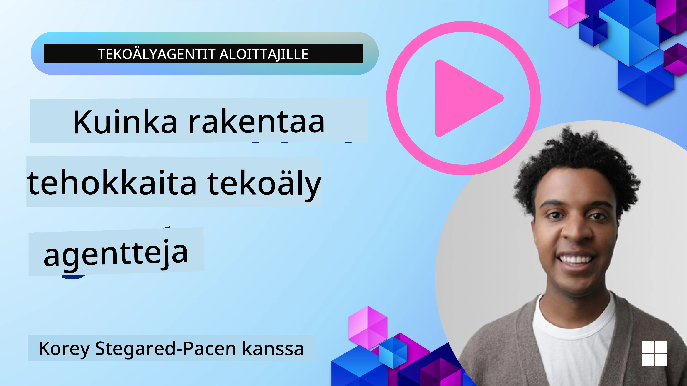
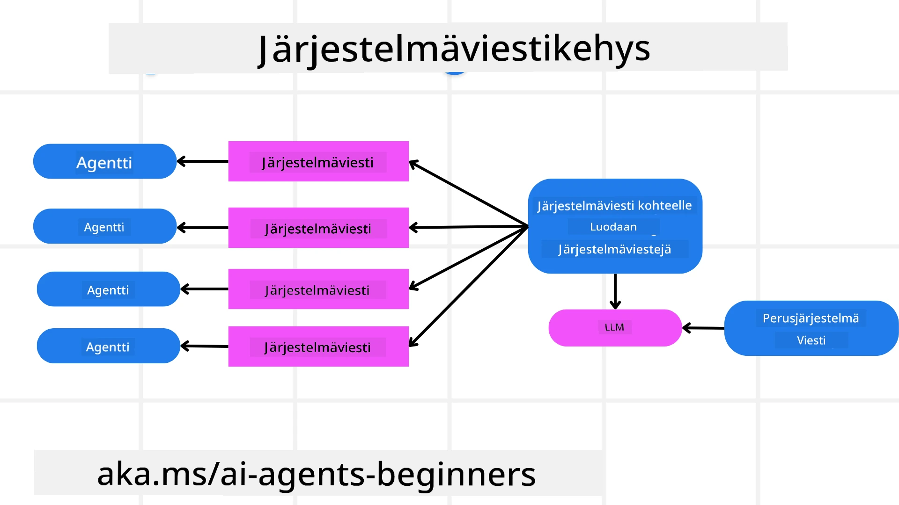
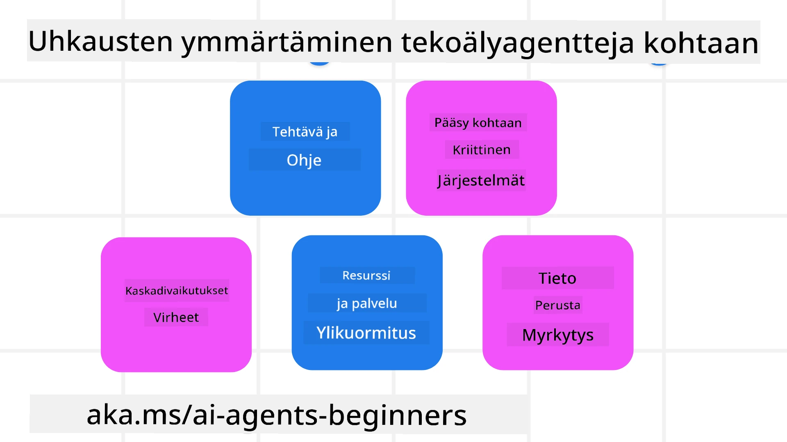
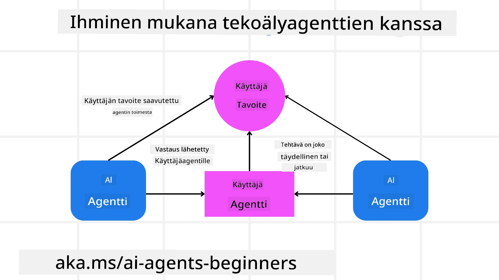

[](https://youtu.be/iZKkMEGBCUQ?si=Q-kEbcyHUMPoHp8L)

> _(Napsauta yllä olevaa kuvaa katsellaksesi tämän oppitunnin videota)_

# Luotettavien tekoälyagenttien rakentaminen

## Johdanto

Tässä oppitunnissa käsitellään:

- Kuinka rakentaa ja ottaa käyttöön turvallisia ja tehokkaita tekoälyagentteja
- Tärkeitä turvallisuusnäkökohtia tekoälyagenttien kehittämisessä
- Kuinka ylläpitää tietojen ja käyttäjien yksityisyyttä tekoälyagentteja kehittäessä

## Oppimistavoitteet

Tämän oppitunnin suorittamisen jälkeen osaat:

- Tunnistaa ja vähentää riskejä tekoälyagentteja luodessa
- Toteuttaa turvallisuustoimenpiteitä varmistaaksesi, että tiedot ja pääsy hallitaan asianmukaisesti
- Luoda tekoälyagentteja, jotka ylläpitävät tietosuojaa ja tarjoavat laadukkaan käyttäjäkokemuksen

## Turvallisuus

Katsotaan ensin, miten rakennetaan turvallisia agenttipohjaisia sovelluksia. Turvallisuus tarkoittaa, että tekoälyagentti toimii suunnitellusti. Agenttisovellusten rakentajina meillä on menetelmiä ja työkaluja turvallisuuden maksimoimiseksi:

### Järjestelmäviestikehyksen rakentaminen

Jos olet joskus rakentanut tekoälysovelluksen käyttäen suuria kielimalleja (LLM), tiedät vahvan järjestelmäkehotteen tai järjestelmäviestin suunnittelun tärkeyden. Nämä kehotteet määrittelevät metansa säännöt, ohjeet ja suuntaviivat sille, miten LLM on vuorovaikutuksessa käyttäjän ja tietojen kanssa.

Tekoälyagenttien kohdalla järjestelmäkehotus on vielä tärkeämpi, sillä tekoälyagentit tarvitsevat erittäin tarkkoja ohjeita suorittaakseen niille suunnittelemamme tehtävät.

Skaalautuvien järjestelmäkehotteiden luomiseen voimme käyttää järjestelmäviestikehystä rakentaaksemme yhden tai useamman agentin sovellukseemme:



#### Vaihe 1: Luo meta-järjestelmäviesti

Meta-kehotetta käyttää LLM tuottaakseen agenttiemme järjestelmäviestit. Suunnittelemme sen malliksi, jotta voimme tehokkaasti luoda useita agentteja tarpeen mukaan.

Tässä on esimerkki meta-järjestelmäviestistä, jonka antaisimme LLM:lle:

```plaintext
You are an expert at creating AI agent assistants. 
You will be provided a company name, role, responsibilities and other
information that you will use to provide a system prompt for.
To create the system prompt, be descriptive as possible and provide a structure that a system using an LLM can better understand the role and responsibilities of the AI assistant. 
```

#### Vaihe 2: Luo peruskehotus

Seuraavaksi luodaan peruskehotus tekoälyagentin kuvaamiseksi. Siihen tulisi sisällyttää agentin rooli, tehtävät, jotka agentti suorittaa, sekä muut agentin vastuut.

Tässä esimerkki:

```plaintext
You are a travel agent for Contoso Travel that is great at booking flights for customers. To help customers you can perform the following tasks: lookup available flights, book flights, ask for preferences in seating and times for flights, cancel any previously booked flights and alert customers on any delays or cancellations of flights.  
```

#### Vaihe 3: Toimita perusjärjestelmäviesti LLM:lle

Nyt voimme optimoida tämän järjestelmäviestin antamalla meta-järjestelmäviestin järjestelmäviestiksi ja perusjärjestelmäviestimme.

Tämä tuottaa järjestelmäviestin, joka on paremmin suunniteltu ohjaamaan tekoälyagenttejamme:

```markdown
**Company Name:** Contoso Travel  
**Role:** Travel Agent Assistant

**Objective:**  
You are an AI-powered travel agent assistant for Contoso Travel, specializing in booking flights and providing exceptional customer service. Your main goal is to assist customers in finding, booking, and managing their flights, all while ensuring that their preferences and needs are met efficiently.

**Key Responsibilities:**

1. **Flight Lookup:**
    
    - Assist customers in searching for available flights based on their specified destination, dates, and any other relevant preferences.
    - Provide a list of options, including flight times, airlines, layovers, and pricing.
2. **Flight Booking:**
    
    - Facilitate the booking of flights for customers, ensuring that all details are correctly entered into the system.
    - Confirm bookings and provide customers with their itinerary, including confirmation numbers and any other pertinent information.
3. **Customer Preference Inquiry:**
    
    - Actively ask customers for their preferences regarding seating (e.g., aisle, window, extra legroom) and preferred times for flights (e.g., morning, afternoon, evening).
    - Record these preferences for future reference and tailor suggestions accordingly.
4. **Flight Cancellation:**
    
    - Assist customers in canceling previously booked flights if needed, following company policies and procedures.
    - Notify customers of any necessary refunds or additional steps that may be required for cancellations.
5. **Flight Monitoring:**
    
    - Monitor the status of booked flights and alert customers in real-time about any delays, cancellations, or changes to their flight schedule.
    - Provide updates through preferred communication channels (e.g., email, SMS) as needed.

**Tone and Style:**

- Maintain a friendly, professional, and approachable demeanor in all interactions with customers.
- Ensure that all communication is clear, informative, and tailored to the customer's specific needs and inquiries.

**User Interaction Instructions:**

- Respond to customer queries promptly and accurately.
- Use a conversational style while ensuring professionalism.
- Prioritize customer satisfaction by being attentive, empathetic, and proactive in all assistance provided.

**Additional Notes:**

- Stay updated on any changes to airline policies, travel restrictions, and other relevant information that could impact flight bookings and customer experience.
- Use clear and concise language to explain options and processes, avoiding jargon where possible for better customer understanding.

This AI assistant is designed to streamline the flight booking process for customers of Contoso Travel, ensuring that all their travel needs are met efficiently and effectively.

```

#### Vaihe 4: Iteroi ja paranna

Tämän järjestelmäviestikehyksen arvo on siinä, että useiden agenttien järjestelmäviestien luominen skaalautuu helpommin ja että voit parantaa viestejä ajan kuluessa. On harvinaista, että järjestelmäviesti toimii täydellisesti ensimmäisellä käyttökerralla. Pienten säätöjen ja parannusten tekeminen perusjärjestelmäviestin muuttamisen ja sen ajamisen läpi järjestelmän avulla antaa sinulle mahdollisuuden vertailla ja arvioida tuloksia.

## Uhkat ja niiden ymmärtäminen

Luotettavien tekoälyagenttien rakentamiseksi on tärkeää ymmärtää ja vähentää tekoälyagenttisi riskejä ja uhkia. Tarkastellaan vain joitain erilaisista uhkista tekoälyagenteille ja kuinka voit paremmin suunnitella ja varautua niihin.



### Tehtävät ja ohjeet

**Kuvaus:** Hyökkääjät yrittävät muuttaa tekoälyagentin ohjeita tai tavoitteita kehotteilla tai manipuloimalla syötteitä.

**Vähennys:** Suorita validointitarkastuksia ja syötesuodattimia havaitaksesi mahdollisesti vaaralliset kehotteet ennen kuin tekoälyagentti käsittelee niitä. Koska nämä hyökkäykset vaativat yleensä usein vuorovaikutusta agentin kanssa, keskustelun vuorojen rajoittaminen on toinen keino estää tällaiset hyökkäykset.

### Pääsy kriittisiin järjestelmiin

**Kuvaus:** Jos tekoälyagentilla on pääsy järjestelmiin ja palveluihin, joissa säilytetään arkaluontoisia tietoja, hyökkääjät voivat vaarantaa viestinnän agentin ja näiden palveluiden välillä. Nämä voivat olla suoria hyökkäyksiä tai epäsuoria yrityksiä saada tietoa järjestelmistä agentin kautta.

**Vähennys:** Tekoälyagenttien tulisi saada pääsy järjestelmiin vain tarpeen mukaan tällaisen hyökkäyksen estämiseksi. Agentin ja järjestelmän välinen viestintä tulisi myös suojata. Todennuksen ja pääsynhallinnan käyttöönotto on toinen tapa suojata tätä tietoa.

### Resurssien ja palveluiden ylikuormitus

**Kuvaus:** Tekoälyagentit voivat käyttää erilaisia työkaluja ja palveluita tehtävien suorittamiseen. Hyökkääjät voivat käyttää tätä kykyä hyökkäyksissään lähettämällä suuren määrän pyyntöjä tekoälyagentin kautta, mikä voi johtaa järjestelmävirheisiin tai korkeisiin kustannuksiin.

**Vähennys:** Ota käyttöön käytännöt, jotka rajoittavat tekoälyagentin pyyntöjen määrää palvelulle. Keskusteluvuorojen ja pyyntöjen rajoittaminen tekoälyagentillesi on toinen keino estää tällaisia hyökkäyksiä.

### Tietokannan myrkyttäminen

**Kuvaus:** Tämä hyökkäystyyppi ei kohdistu suoraan tekoälyagenttiin, vaan tietokantaan ja muihin palveluihin, joita tekoälyagentti käyttää. Se voi sisältää sen datan tai tiedon turmelemista, jota agentti käyttää tehtävän suorittamiseen, johtamalla puolueellisiin tai ei-toivottuihin vastauksiin käyttäjälle.

**Vähennys:** Suorita säännöllisiä tarkistuksia datalle, jota tekoälyagentti käyttää työnkuluissaan. Varmista, että tämän datan käyttö on turvattua ja että siihen pääsevät käsiksi vain luotetut henkilöt tämän hyökkäytyypin välttämiseksi.

### Virheiden ketjureaktiot

**Kuvaus:** Tekoälyagentit käyttävät erilaisia työkaluja ja palveluita tehtävien suorittamiseen. Hyökkääjien aiheuttamat virheet voivat johtaa muiden agenttiin liitettyjen järjestelmien epäonnistumisiin, jolloin hyökkäyksestä tulee laajempi ja vaikeammin korjattava.

**Vähennys:** Yksi tapa välttää tämä on saada tekoälyagentti toimimaan rajatussa ympäristössä, kuten suorittamalla tehtävät Docker-kontissa, estämään suorat hyökkäykset järjestelmään. Varmuuskopiointimekanismien ja uudelleenyrityksen logiikan luominen, kun tietyt järjestelmät vastaavat virheellä, on toinen keino estää laajemmat järjestelmävirheet.

## Ihminen prosessissa (Human-in-the-Loop)

Toinen tehokas tapa rakentaa luotettavia tekoälyagenttijärjestelmiä on käyttää ihmistä prosessissa (human-in-the-loop). Tämä luo työnkulun, jossa käyttäjät voivat antaa palautetta agenteille prosessin aikana. Käyttäjät toimivat ikään kuin agenteina monen agentin järjestelmässä hyväksymällä tai keskeyttämällä käynnissä olevan prosessin.



Tässä on koodiesimerkki Microsoft Agent Frameworkin avulla, joka näyttää, miten tämä konsepti toteutetaan:

```python
import os
from agent_framework.azure import AzureAIProjectAgentProvider
from azure.identity import AzureCliCredential

# Luo tarjoaja, jossa on ihmisen hyväksyntä vaihe
provider = AzureAIProjectAgentProvider(
    credential=AzureCliCredential(),
)

# Luo agentti, jossa on ihmisen hyväksymisvaihe
response = provider.create_response(
    input="Write a 4-line poem about the ocean.",
    instructions="You are a helpful assistant. Ask for user approval before finalizing.",
)

# Käyttäjä voi tarkistaa ja hyväksyä vastauksen
print(response.output_text)
user_input = input("Do you approve? (APPROVE/REJECT): ")
if user_input == "APPROVE":
    print("Response approved.")
else:
    print("Response rejected. Revising...")
```

## Yhteenveto

Luotettavien tekoälyagenttien rakentaminen vaatii huolellista suunnittelua, vahvoja turvallisuustoimenpiteitä ja jatkuvaa kehitystä. Rakentamalla rakenteellisia meta-kehotejärjestelmiä, ymmärtämällä mahdolliset uhat ja käyttämällä riskienvähennyskeinoja kehittäjät voivat luoda tekoälyagentteja, jotka ovat sekä turvallisia että tehokkaita. Lisäksi ihmisen prosessiin ottaminen varmistaa, että tekoälyagentit pysyvät käyttäjien tarpeiden mukaisina minimoiden riskejä. Tekoälyn kehittyessä jatkuva aktiivinen suhtautuminen turvallisuuteen, yksityisyyteen ja eettisiin näkökulmiin on avain luottamuksen ja luotettavuuden rakentamiseen tekoälypohjaisissa järjestelmissä.

## Koodinäytteet

- [`code_samples/06-system-message-framework.ipynb`](code_samples/06-system-message-framework.ipynb): Askeltainen esitys meta-kehotepohjaisesta järjestelmäviestikehyksestä.
- [`code_samples/06-human-in-the-loop.ipynb`](code_samples/06-human-in-the-loop.ipynb): Toiminnan esihyväksynnän portit, riskiluokittelu ja auditointilokit luotettaville agenteille.

### Lisää kysymyksiä luotettavien tekoälyagenttien rakentamisesta?

Liity [Microsoft Foundry Discordiin](https://discord.com/invite/ATgtXmAS5D) tapaamaan muita oppijoita, osallistumaan ohjaustunteihin ja saamaan vastauksia tekoälyagenttikysymyksiisi.

## Lisäresurssit

- <a href="https://learn.microsoft.com/azure/ai-studio/responsible-use-of-ai-overview" target="_blank">Vastuullisen tekoälyn yleiskatsaus</a>
- <a href="https://learn.microsoft.com/azure/ai-studio/concepts/evaluation-approach-gen-ai" target="_blank">Generatiivisten tekoälymallien ja tekoälysovellusten arviointi</a>
- <a href="https://learn.microsoft.com/azure/ai-services/openai/concepts/system-message?context=%2Fazure%2Fai-studio%2Fcontext%2Fcontext&tabs=top-techniques" target="_blank">Turvallisuusjärjestelmäviestit</a>
- <a href="https://blogs.microsoft.com/wp-content/uploads/prod/sites/5/2022/06/Microsoft-RAI-Impact-Assessment-Template.pdf?culture=en-us&country=us" target="_blank">Riskien arviointilomake</a>

## Edellinen oppitunti

[Agenttinen RAG](../05-agentic-rag/README.md)

## Seuraava oppitunti

[Suunnittelumalli](../07-planning-design/README.md)

---

<!-- CO-OP TRANSLATOR DISCLAIMER START -->
**Vastuuvapauslauseke**:
Tämä asiakirja on käännetty käyttämällä tekoälypohjaista käännöspalvelua [Co-op Translator](https://github.com/Azure/co-op-translator). Vaikka pyrimme tarkkuuteen, otathan huomioon, että automaattiset käännökset saattavat sisältää virheitä tai epätarkkuuksia. Alkuperäinen asiakirja sen alkuperäiskielellä on virallinen lähde. Tärkeissä asioissa suositellaan ammattimaista ihmiskäännöstä. Emme ole vastuussa tämän käännöksen käytöstä aiheutuvista väärinymmärryksistä tai tulkinnoista.
<!-- CO-OP TRANSLATOR DISCLAIMER END -->