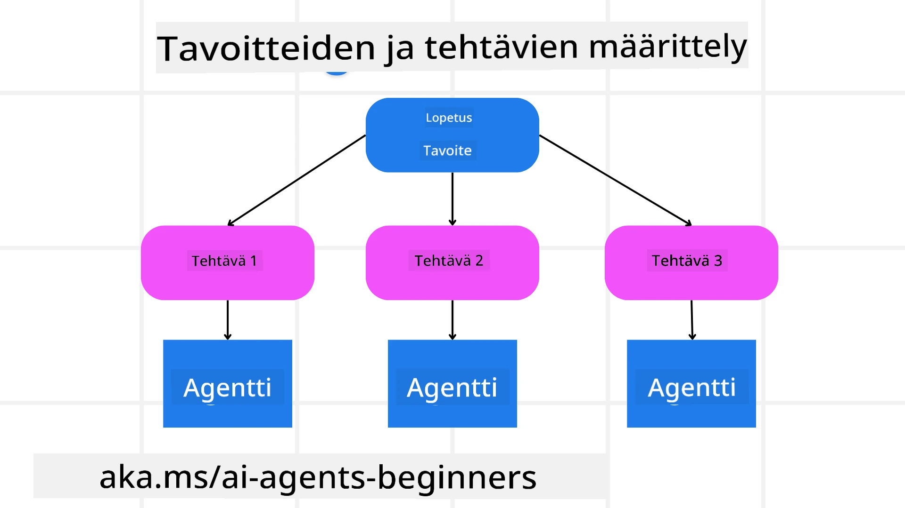

[](https://youtu.be/kPfJ2BrBCMY?si=9pYpPXp0sSbK91Dr)

> _(Napsauta yllä olevaa kuvaa katsoaksesi tämän oppitunnin videon)_

# Suunnittelumalli

## Johdanto

Tässä oppitunnissa käsitellään

* Selkeän kokonais tavoitteen määrittäminen ja monimutkaisen tehtävän jakaminen hallittaviin osiin.
* Rakenteellisen ulostulon hyödyntäminen luotettavampien ja koneellisesti luettavien vastausten saamiseksi.
* Tapahtumapohjaisen lähestymistavan soveltaminen dynaamisten tehtävien ja odottamattomien syötteiden käsittelyyn.

## Oppimistavoitteet

Oppitunnin suorittamisen jälkeen ymmärrät:

* Tunnistaa ja asettaa tekoälyagentille kokonais tavoitteen varmistaen, että se tietää selkeästi, mitä on saavutettava.
* Hajottaa monimutkainen tehtävä hallittaviin osatehtäviin ja järjestää ne loogiseen järjestykseen.
* Varustaa agentit oikeilla työkaluilla (esim. hakutyökalut tai data-analytiikkatyökalut), päättää milloin ja miten niitä käytetään, ja käsitellä odottamattomia tilanteita.
* Arvioida osatehtävien tulosta, mitata suorituskykyä ja toistaa toimia lopputuloksen parantamiseksi.

## Kokonais tavoitteen määrittely ja tehtävän pilkkominen



Useimmat todellisen maailman tehtävät ovat liian monimutkaisia ratkaistaviksi yhdellä askeleella. Tekoälyagentilla on oltava ytimekäs tavoite, joka ohjaa sen suunnittelua ja toimia. Esimerkiksi tavoitteena voisi olla:

    "Laadi 3 päivän matkasuunnitelma."

Vaikka se on helppo ilmaista, tavoite tarvitsee vielä tarkentamista. Mitä selkeämpi tavoite on, sitä paremmin agentti (ja mahdolliset ihmisyhteistyökumppanit) voivat keskittyä saavuttamaan oikean tuloksen, kuten kattavan matkasuunnitelman lentovaihtoehtoineen, hotellisuosituksineen ja aktiviteettiehdotuksineen.

### Tehtävän pilkkominen

Suuret tai monimutkaiset tehtävät ovat helpommin hallittavissa, kun ne jaetaan pienempiin, tavoitekeskeisiin osatehtäviin.
Matkasuunnitelman esimerkissä voitaisiin jakaa tavoite seuraaviin osiin:

* Lentojen varaus
* Hotellivaraukset
* Auton vuokraus
* Henkilökohtaistaminen

Jokaisen osatehtävän voi hoitaa omistautunut agentti tai prosessi. Yksi agentti voi erikoistua parhaiden lentotarjousten etsimiseen, toinen keskittyä hotellivarauksiin ja niin edelleen. Koordinoiva tai "alavirran" agentti voi sitten yhdistää nämä tulokset yhdeksi yhtenäiseksi matkasuunnitelmaksi loppukäyttäjälle.

Tämä modulaarinen lähestymistapa mahdollistaa myös asteittaiset parannukset. Esimerkiksi voit lisätä erikoistuneita agenteja ruokasuosituksia tai paikallisia aktiviteetteja varten ja kehittää matkasuunnitelmaa ajan myötä.

### Rakenteellinen ulostulo

Suurten kielimallien (LLM) on mahdollista luoda rakenteellista ulostuloa (esim. JSON), joka on helpompi jäsentää ja käsitellä alavirran agenteilla tai palveluilla. Tämä on erityisen hyödyllistä monen agentin tapauksissa, joissa voimme suorittaa nämä tehtävät suunnittelun tuloksen jälkeen.

Seuraava Python-esimerkki demonstroi yksinkertaista suunnittelijaa, joka pilkkoo tavoitteen osatehtäviin ja luo rakenteellisen suunnitelman:

```python
from pydantic import BaseModel
from enum import Enum
from typing import List, Optional, Union
import json
import os
from typing import Optional
from pprint import pprint
from agent_framework.azure import AzureAIProjectAgentProvider
from azure.identity import AzureCliCredential

class AgentEnum(str, Enum):
    FlightBooking = "flight_booking"
    HotelBooking = "hotel_booking"
    CarRental = "car_rental"
    ActivitiesBooking = "activities_booking"
    DestinationInfo = "destination_info"
    DefaultAgent = "default_agent"
    GroupChatManager = "group_chat_manager"

# Matkan alatason malli
class TravelSubTask(BaseModel):
    task_details: str
    assigned_agent: AgentEnum  # haluamme määrittää tehtävän agentille

class TravelPlan(BaseModel):
    main_task: str
    subtasks: List[TravelSubTask]
    is_greeting: bool

provider = AzureAIProjectAgentProvider(credential=AzureCliCredential())

# Määrittele käyttäjän viesti
system_prompt = """You are a planner agent.
    Your job is to decide which agents to run based on the user's request.
    Provide your response in JSON format with the following structure:
{'main_task': 'Plan a family trip from Singapore to Melbourne.',
 'subtasks': [{'assigned_agent': 'flight_booking',
               'task_details': 'Book round-trip flights from Singapore to '
                               'Melbourne.'}
    Below are the available agents specialised in different tasks:
    - FlightBooking: For booking flights and providing flight information
    - HotelBooking: For booking hotels and providing hotel information
    - CarRental: For booking cars and providing car rental information
    - ActivitiesBooking: For booking activities and providing activity information
    - DestinationInfo: For providing information about destinations
    - DefaultAgent: For handling general requests"""

user_message = "Create a travel plan for a family of 2 kids from Singapore to Melbourne"

response = client.create_response(input=user_message, instructions=system_prompt)

response_content = response.output_text
pprint(json.loads(response_content))
```

### Suunnitteluagentti monen agentin orkestrointiin

Tässä esimerkissä Semanttinen Reititin Agentti vastaanottaa käyttäjän pyynnön (esim. "Tarvitsen hotellisuunnitelman matkalleni.").

Suunnittelija tekee seuraavaa:

* Vastaanottaa hotellisuunnitelman: Suunnittelija ottaa käyttäjän viestin ja perustuen järjestelmäkehotteeseen (mukaan lukien käytettävissä olevien agenttien tiedot) luo rakenteellisen matkasuunnitelman.
* Listaa agentit ja niiden työkalut: Agenttirekisterissä on lista agenteista (esim. lennot, hotellit, autonvuokraus ja aktiviteetit) ja niiden tarjoamista toiminnoista tai työkaluista.
* Reitittää suunnitelman vastaaville agenteille: Tavoitteiden määrän mukaan suunnittelija joko lähettää viestin suoraan omistautuneelle agentille (yhden tehtävän skenaarioissa) tai koordinoi monen agentin yhteistyön ryhmäkeskustelun hallinnan kautta.
* Tiivistää lopputuloksen: Lopuksi suunnittelija tiivistää luodun suunnitelman selkeyden vuoksi.
Seuraava Python-koodiesimerkki havainnollistaa nämä vaiheet:

```python

from pydantic import BaseModel

from enum import Enum
from typing import List, Optional, Union

class AgentEnum(str, Enum):
    FlightBooking = "flight_booking"
    HotelBooking = "hotel_booking"
    CarRental = "car_rental"
    ActivitiesBooking = "activities_booking"
    DestinationInfo = "destination_info"
    DefaultAgent = "default_agent"
    GroupChatManager = "group_chat_manager"

# Matkatehtävän alitehtävämalli

class TravelSubTask(BaseModel):
    task_details: str
    assigned_agent: AgentEnum # haluamme määrittää tehtävän agentille

class TravelPlan(BaseModel):
    main_task: str
    subtasks: List[TravelSubTask]
    is_greeting: bool
import json
import os
from typing import Optional

from agent_framework.azure import AzureAIProjectAgentProvider
from azure.identity import AzureCliCredential

# Luo asiakas

provider = AzureAIProjectAgentProvider(credential=AzureCliCredential())

from pprint import pprint

# Määrittele käyttäjän viesti

system_prompt = """You are a planner agent.
    Your job is to decide which agents to run based on the user's request.
    Below are the available agents specialized in different tasks:
    - FlightBooking: For booking flights and providing flight information
    - HotelBooking: For booking hotels and providing hotel information
    - CarRental: For booking cars and providing car rental information
    - ActivitiesBooking: For booking activities and providing activity information
    - DestinationInfo: For providing information about destinations
    - DefaultAgent: For handling general requests"""

user_message = "Create a travel plan for a family of 2 kids from Singapore to Melbourne"

response = client.create_response(input=user_message, instructions=system_prompt)

response_content = response.output_text

# Tulosta vastauksen sisältö JSON-muodossa lataamisen jälkeen

pprint(json.loads(response_content))
```

Seuraavaksi näet edellisen koodin tulosteen, jota voit sitten käyttää rakenteellisen ulostulon ohjaamiseen `assigned_agent` -kenttään ja tiivistää matkasuunnitelman loppukäyttäjälle.

```json
{
    "is_greeting": "False",
    "main_task": "Plan a family trip from Singapore to Melbourne.",
    "subtasks": [
        {
            "assigned_agent": "flight_booking",
            "task_details": "Book round-trip flights from Singapore to Melbourne."
        },
        {
            "assigned_agent": "hotel_booking",
            "task_details": "Find family-friendly hotels in Melbourne."
        },
        {
            "assigned_agent": "car_rental",
            "task_details": "Arrange a car rental suitable for a family of four in Melbourne."
        },
        {
            "assigned_agent": "activities_booking",
            "task_details": "List family-friendly activities in Melbourne."
        },
        {
            "assigned_agent": "destination_info",
            "task_details": "Provide information about Melbourne as a travel destination."
        }
    ]
}
```

Esimerkki muistikirja edellisellä koodilla on saatavilla [tästä](07-python-agent-framework.ipynb).

### Iteratiivinen suunnittelu

Jotkut tehtävät vaativat edestakaista tai uudelleensuunnittelua, jossa yhden osatehtävän tulos vaikuttaa seuraavaan. Esimerkiksi, jos agentti havaitsee odottamattoman tietomuodon lentojen varauksessa, sen täytyy mahdollisesti mukauttaa strategiaansa ennen hotellivarauksia.

Lisäksi käyttäjäpalaute (esim. käyttäjän päätös mieluummin aikaisemmasta lennosta) voi laukaista osittaisen uudelleensuunnittelun. Tämä dynaaminen, iteratiivinen lähestymistapa varmistaa, että lopullinen ratkaisu vastaa todellisen maailman vaatimuksia ja käyttäjän muuttuvia mieltymyksiä.

esim. koodiesimerkki

```python
from agent_framework.azure import AzureAIProjectAgentProvider
from azure.identity import AzureCliCredential
#.. sama kuin edellisessä koodissa ja siirrä käyttäjän historia, nykyinen suunnitelma

system_prompt = """You are a planner agent to optimize the
    Your job is to decide which agents to run based on the user's request.
    Below are the available agents specialized in different tasks:
    - FlightBooking: For booking flights and providing flight information
    - HotelBooking: For booking hotels and providing hotel information
    - CarRental: For booking cars and providing car rental information
    - ActivitiesBooking: For booking activities and providing activity information
    - DestinationInfo: For providing information about destinations
    - DefaultAgent: For handling general requests"""

user_message = "Create a travel plan for a family of 2 kids from Singapore to Melbourne"

response = client.create_response(
    input=user_message,
    instructions=system_prompt,
    context=f"Previous travel plan - {TravelPlan}",
)
# .. suunnittele uudelleen ja lähetä tehtävät asianomaisille agenteille
```

Laajempaa suunnittelua varten tutustu Magnetic One <a href="https://www.microsoft.com/research/articles/magentic-one-a-generalist-multi-agent-system-for-solving-complex-tasks" target="_blank">Blogikirjoitukseen</a> monimutkaisten tehtävien ratkaisemisesta.

## Yhteenveto

Tässä artikkelissa olemme tarkastelleet esimerkkiä siitä, kuinka voimme luoda suunnittelijan, joka voi dynaamisesti valita määritellyt käytettävissä olevat agentit. Suunnittelijan tulos pilkkoo tehtävät ja osoittaa agentit niiden suorittamista varten. Oletetaan, että agenteilla on pääsy tarvittaviin toimintoihin/työkaluihin tehtävän suorittamiseksi. Agenttien lisäksi voit sisällyttää muitakin malleja kuten reflektointi, tiivistäjä ja turnauskeskustelu, räätälöidäksesi toiminnallisuutta.

## Lisäresurssit

Magnetic One - Yleiskäyttöinen monen agentin järjestelmä monimutkaisten tehtävien ratkaisemiseen, joka on saavuttanut vaikuttavia tuloksia useilla haastavilla agenttipohjaisilla vertailuilla. Viite: <a href="https://www.microsoft.com/research/articles/magentic-one-a-generalist-multi-agent-system-for-solving-complex-tasks" target="_blank">Magnetic One</a>. Tässä toteutuksessa orkestroija luo tehtäväsidonnaisia suunnitelmia ja delegoi nämä tehtävät käytettävissä oleville agenteille. Suunnittelun lisäksi orkestroija käyttää seurantamekanismia valvoakseen tehtävän edistymistä ja tekee uudelleensuunnittelua tarpeen mukaan.

### Onko sinulla lisää kysymyksiä suunnittelumallista?

Liity [Microsoft Foundry Discordiin](https://aka.ms/ai-agents/discord) tapaamaan muita oppijoita, osallistumaan kyselytunteihin ja saamaan vastauksia tekoälyagenttikysymyksiisi.

## Edellinen oppitunti

[Luotettavien tekoälyagenttien rakentaminen](../06-building-trustworthy-agents/README.md)

## Seuraava oppitunti

[Moni-agenttisuunnittelumalli](../08-multi-agent/README.md)

---

<!-- CO-OP TRANSLATOR DISCLAIMER START -->
**Vastuuvapauslauseke**:
Tämä asiakirja on käännetty tekoälykäännöspalvelun [Co-op Translator](https://github.com/Azure/co-op-translator) avulla. Vaikka pyrimme tarkkuuteen, ole hyvä ja ota huomioon, että automaattikäännöksissä saattaa esiintyä virheitä tai epätarkkuuksia. Alkuperäistä asiakirjaa sen alkuperäisellä kielellä tulisi pitää auktoritatiivisena lähteenä. Tärkeissä tiedoissa suositellaan ammattimaista ihmiskäännöstä. Emme ole vastuussa tämän käännöksen käytöstä aiheutuvista väärinkäsityksistä tai virhetulkintojen seurauksista.
<!-- CO-OP TRANSLATOR DISCLAIMER END -->