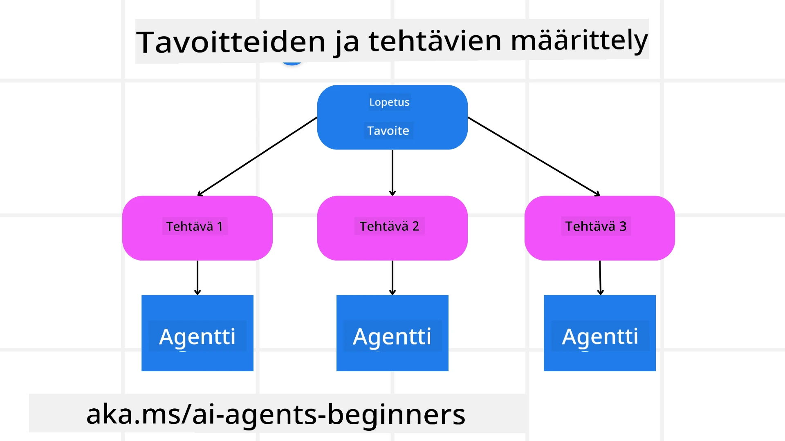

[](https://youtu.be/kPfJ2BrBCMY?si=9pYpPXp0sSbK91Dr)

> _(Klikkaa yllä olevaa kuvaa nähdäksesi tämän oppitunnin videon)_

# Suunnittelumalli

## Johdanto

Tässä oppitunnissa käsitellään

* Selkeän kokonaismäärän määrittäminen ja monimutkaisen tehtävän jakaminen hallittaviin osiin.
* Rakenteellisen tulosteen hyödyntäminen luotettavampien ja koneellisesti luettavien vastausten saamiseksi.
* Tapahtumapohjaisen lähestymistavan soveltaminen dynaamisten tehtävien ja odottamattomien syötteiden käsittelyyn.

## Oppimistavoitteet

Oppitunnin suorittamisen jälkeen ymmärrät:

* Tunnistaa ja asettaa tekoälyagentille kokonaismäärän, varmistaen että se tietää selkeästi, mitä on saavutettava.
* Jäsentää monimutkainen tehtävä hallittaviin osatehtäviin ja järjestää ne loogiseen järjestykseen.
* Varustaa agentit oikeilla välineillä (esim. hakutyökalut tai data-analytiikkatyökalut), päättää milloin ja miten niitä käytetään, sekä käsitellä odottamattomat tilanteet.
* Arvioida osatehtävien tuloksia, mitata suorituskykyä ja iteratiivisesti parantaa toimintoja lopputuloksen kehittämiseksi.

## Kokonaismäärän määrittäminen ja tehtävän pilkkominen



Useimmat todelliset tehtävät ovat liian monimutkaisia hoidettaviksi yhdellä askeleella. Tekoälyagentilla tarvitsee olla ytimekäs tavoite ohjaamaan sen suunnittelua ja toimia. Esimerkiksi tavoitteena voi olla:

    "Laadi kolmen päivän matkasuunnitelma."

Vaikka se on yksinkertainen lausuma, se vaatii silti tarkennusta. Mitä selkeämpi tavoite on, sitä paremmin agentti (ja mahdolliset ihmiset yhteistyössä) voivat keskittyä saavuttamaan oikeanlaiset tulokset, kuten kattavan matkasuunnitelman lento-, hotelli- ja aktiviteettiehdotuksineen.

### Tehtävän pilkkominen

Suuret tai monimutkaiset tehtävät ovat hallittavampia, kun ne jaetaan pienempiin, tavoitekeskeisiin osatehtäviin.
Matkasuunnitelmaesimerkissä voit pilkkoa tavoitteen seuraaviin osiin:

* Lentovaraukset
* Hotellivaraukset
* Autonvuokraus
* Personalisointi

Kukin osatehtävä voidaan sitten hoitaa omistautuneiden agenttien tai prosessien toimesta. Yksi agentti saattaa erikoistua etsimään parhaat lentotarjoukset, toinen keskittyy hotellivarauksiin jne. Koordinointia tai "alasvirtaista" agenttia voidaan käyttää kokoamaan nämä tulokset yhdeksi yhtenäiseksi matkasuunnitelmaksi loppukäyttäjälle.

Tämä modulaarinen lähestymistapa mahdollistaa myös asteittaiset parannukset. Esimerkiksi voit lisätä erikoistuneita agentteja ruoka- tai paikallisten aktiviteettien suosituksiin ja hiomaan suunnitelmaa ajan myötä.

### Rakenteellinen tuloste

Suuret kielimallit (LLMit) voivat tuottaa rakenteellista tulostetta (esim. JSON), joka on helpompi jakaa ja käsitellä alasvirtaisten agenttien tai palveluiden toimesta. Tämä on erityisen hyödyllistä monen agentin kontekstissa, jossa voimme suorittaa nämä tehtävät suunnittelun tuloksen vastaanotettuamme.

Seuraava Python-koodi demonstroi yksinkertaista suunnitteluagenttia, joka pilkkoo tavoitteen osatehtäviin ja luo rakenteellisen suunnitelman:

```python
from pydantic import BaseModel
from enum import Enum
from typing import List, Optional, Union
import json
import os
from typing import Optional
from pprint import pprint
from agent_framework.foundry import FoundryChatClient
from azure.identity import AzureCliCredential

class AgentEnum(str, Enum):
    FlightBooking = "flight_booking"
    HotelBooking = "hotel_booking"
    CarRental = "car_rental"
    ActivitiesBooking = "activities_booking"
    DestinationInfo = "destination_info"
    DefaultAgent = "default_agent"
    GroupChatManager = "group_chat_manager"

# Matkan alitehtävämalli
class TravelSubTask(BaseModel):
    task_details: str
    assigned_agent: AgentEnum  # Haluamme määrittää tehtävän agentille

class TravelPlan(BaseModel):
    main_task: str
    subtasks: List[TravelSubTask]
    is_greeting: bool

provider = FoundryChatClient(
    project_endpoint=os.environ["AZURE_AI_PROJECT_ENDPOINT"],
    model=os.environ["AZURE_AI_MODEL_DEPLOYMENT_NAME"],
    credential=AzureCliCredential(),
)

# Määritä käyttäjän viesti
system_prompt = """You are a planner agent.
    Your job is to decide which agents to run based on the user's request.
    Provide your response in JSON format with the following structure:
{'main_task': 'Plan a family trip from Singapore to Melbourne.',
 'subtasks': [{'assigned_agent': 'flight_booking',
               'task_details': 'Book round-trip flights from Singapore to '
                               'Melbourne.'}
    Below are the available agents specialised in different tasks:
    - FlightBooking: For booking flights and providing flight information
    - HotelBooking: For booking hotels and providing hotel information
    - CarRental: For booking cars and providing car rental information
    - ActivitiesBooking: For booking activities and providing activity information
    - DestinationInfo: For providing information about destinations
    - DefaultAgent: For handling general requests"""

user_message = "Create a travel plan for a family of 2 kids from Singapore to Melbourne"

response = client.create_response(input=user_message, instructions=system_prompt)

response_content = response.output_text
pprint(json.loads(response_content))
```

### Suunnitteluagentti Multi-Agent Orkestroinnilla

Tässä esimerkissä Semanttinen Reititin -agentti vastaanottaa käyttäjän pyynnön (esimerkiksi "Tarvitsen hotellisuunnitelman matkalleni.").

Suunnittelija tekee sitten:

* Vastaanottaa Hotellisuunnitelman: Suunnittelija ottaa käyttäjän viestin ja järjestelmän kehotteen (mukaan lukien käytettävissä olevat agenttien tiedot) perusteella generoi rakenteellisen matkasuunnitelman.
* Listaa Agentit ja Niiden Työkalut: Agenttirekisteri pitää listaa agenteista (esim. lento-, hotelli-, autonvuokraus- ja aktiviteettiagentit) ja niiden tarjoamista toiminnoista tai työkaluista.
* Reitittää Suunnitelman Asiaankuuluville Agenteille: Osatehtävien lukumäärästä riippuen suunnittelija joko lähettää viestin suoraan omistautuneelle agentille (yksittäistehtävissä) tai koordinoi monen agentin yhteistyötä ryhmäkeskustelun hallinnan kautta.
* Yhteenveto Tuloksesta: Lopuksi suunnittelija tiivistää luodun suunnitelman selkeyden vuoksi.
Seuraava Python-koodiesimerkki havainnollistaa näitä vaiheita:

```python

from pydantic import BaseModel

from enum import Enum
from typing import List, Optional, Union

class AgentEnum(str, Enum):
    FlightBooking = "flight_booking"
    HotelBooking = "hotel_booking"
    CarRental = "car_rental"
    ActivitiesBooking = "activities_booking"
    DestinationInfo = "destination_info"
    DefaultAgent = "default_agent"
    GroupChatManager = "group_chat_manager"

# Matkustus alitehtävän malli

class TravelSubTask(BaseModel):
    task_details: str
    assigned_agent: AgentEnum # haluamme antaa tehtävän edustajalle

class TravelPlan(BaseModel):
    main_task: str
    subtasks: List[TravelSubTask]
    is_greeting: bool
import json
import os
from typing import Optional

from agent_framework.foundry import FoundryChatClient
from azure.identity import AzureCliCredential

# Luo asiakas

provider = FoundryChatClient(
    project_endpoint=os.environ["AZURE_AI_PROJECT_ENDPOINT"],
    model=os.environ["AZURE_AI_MODEL_DEPLOYMENT_NAME"],
    credential=AzureCliCredential(),
)

from pprint import pprint

# Määritä käyttäjän viesti

system_prompt = """You are a planner agent.
    Your job is to decide which agents to run based on the user's request.
    Below are the available agents specialized in different tasks:
    - FlightBooking: For booking flights and providing flight information
    - HotelBooking: For booking hotels and providing hotel information
    - CarRental: For booking cars and providing car rental information
    - ActivitiesBooking: For booking activities and providing activity information
    - DestinationInfo: For providing information about destinations
    - DefaultAgent: For handling general requests"""

user_message = "Create a travel plan for a family of 2 kids from Singapore to Melbourne"

response = client.create_response(input=user_message, instructions=system_prompt)

response_content = response.output_text

# Tulosta vastaussisältö sen ladattua JSON-muodossa

pprint(json.loads(response_content))
```

Seuraavassa on edellisen koodin tuotos, ja voit käyttää tätä rakenteellista tulosta reitittääksesi sen `assigned_agent` -agentille ja tiivistääksesi matkasuunnitelman loppukäyttäjälle.

```json
{
    "is_greeting": "False",
    "main_task": "Plan a family trip from Singapore to Melbourne.",
    "subtasks": [
        {
            "assigned_agent": "flight_booking",
            "task_details": "Book round-trip flights from Singapore to Melbourne."
        },
        {
            "assigned_agent": "hotel_booking",
            "task_details": "Find family-friendly hotels in Melbourne."
        },
        {
            "assigned_agent": "car_rental",
            "task_details": "Arrange a car rental suitable for a family of four in Melbourne."
        },
        {
            "assigned_agent": "activities_booking",
            "task_details": "List family-friendly activities in Melbourne."
        },
        {
            "assigned_agent": "destination_info",
            "task_details": "Provide information about Melbourne as a travel destination."
        }
    ]
}
```

Esimerkkimuistikirja yllä olevalla koodiesimerkillä on saatavilla [tässä](./code_samples/07-python-agent-framework.ipynb).

### Iteratiivinen suunnittelu

Jotkut tehtävät vaativat edestakaista työtä tai uudelleensuunnittelua, jossa yhden osatehtävän tulos vaikuttaa seuraavaan. Esimerkiksi jos agentti havaitsee yllättävän tietomuodon lentovarauksessa, sen täytyy ehkä mukauttaa strategiaansa ennen hotellivarauksiin siirtymistä.

Lisäksi käyttäjäpalaute (esim. että ihminen päättää mieluummin aikaisemman lennon) voi laukaista osittaisen uudelleensuunnittelun. Tämä dynaaminen, iteratiivinen lähestymistapa takaa, että lopullinen ratkaisu sopii todellisiin rajoituksiin ja käyttäjän muuttuvat mieltymykset huomioiden.

esim. koodiesimerkki

```python
import os
from agent_framework.foundry import FoundryChatClient
from azure.identity import AzureCliCredential
#.. sama kuin edellisessä koodissa ja välitä käyttäjän historia, nykyinen suunnitelma

system_prompt = """You are a planner agent to optimize the
    Your job is to decide which agents to run based on the user's request.
    Below are the available agents specialized in different tasks:
    - FlightBooking: For booking flights and providing flight information
    - HotelBooking: For booking hotels and providing hotel information
    - CarRental: For booking cars and providing car rental information
    - ActivitiesBooking: For booking activities and providing activity information
    - DestinationInfo: For providing information about destinations
    - DefaultAgent: For handling general requests"""

user_message = "Create a travel plan for a family of 2 kids from Singapore to Melbourne"

response = client.create_response(
    input=user_message,
    instructions=system_prompt,
    context=f"Previous travel plan - {TravelPlan}",
)
# .. tee uudelleen suunnitelma ja lähetä tehtävät asianomaisille agenteille
```

Kattavampaan suunnitteluun tutustu Magnetic One <a href="https://www.microsoft.com/research/articles/magentic-one-a-generalist-multi-agent-system-for-solving-complex-tasks" target="_blank">blogikirjoitus</a>, joka käsittelee monimutkaisten tehtävien ratkaisua.

## Yhteenveto

Tässä artikkelissa olemme tarkastelleet esimerkkiä siitä, miten voimme luoda suunnittelijan, joka dynaamisesti valitsee määritellyt käytettävissä olevat agentit. Suunnittelijan tuloste pilkkoo tehtävät ja osoittaa agentit niiden suorittamiseksi. Oletetaan, että agenteilla on pääsy tehtävän suorittamiseen tarvittaviin toimintoihin/työkaluihin. Agenttien lisäksi voit lisätä muitakin malleja, kuten reflektiomalli, tiivistäjä ja kierroittainen chat, mukauttamaan ratkaisua entisestään.

## Lisäresurssit

Magnetic One - Yleistajuinen monietäinen järjestelmä monimutkaisten tehtävien ratkaisuun, joka on saavuttanut vaikuttavia tuloksia useissa haastavissa agenttimaisissa vertailuissa. Lähde: <a href="https://www.microsoft.com/research/articles/magentic-one-a-generalist-multi-agent-system-for-solving-complex-tasks" target="_blank">Magnetic One</a>. Tässä toteutuksessa orkestroija luo tehtäväkohtaisia suunnitelmia ja delegoi ne käytettävissä oleville agenteille. Suunnittelun lisäksi orkestroija käyttää seurantamekanismia tehtävän etenemisen valvontaan ja uudelleensuunnittelee tarpeen mukaan.

### Onko sinulla lisää kysymyksiä suunnittelumallista?

Liity [Microsoft Foundry Discord](https://discord.com/invite/ATgtXmAS5D) -yhteisöön tavata muita oppijoita, osallistua toimistoaikoihin ja saada vastauksia tekoälyagenttien kysymyksiin.

## Edellinen oppitunti

[Luotettavien tekoälyagenttien rakentaminen](../06-building-trustworthy-agents/README.md)

## Seuraava oppitunti

[Moni-agenttinen suunnittelumalli](../08-multi-agent/README.md)

---

<!-- CO-OP TRANSLATOR DISCLAIMER START -->
**Vastuuvapauslauseke**:
Tämä asiakirja on käännetty käyttämällä tekoälypohjaista käännöspalvelua [Co-op Translator](https://github.com/Azure/co-op-translator). Vaikka pyrimme tarkkuuteen, otathan huomioon, että automaattiset käännökset saattavat sisältää virheitä tai epätarkkuuksia. Alkuperäinen asiakirja sen alkuperäiskielellä on virallinen lähde. Tärkeissä asioissa suositellaan ammattimaista ihmiskäännöstä. Emme ole vastuussa tämän käännöksen käytöstä aiheutuvista väärinymmärryksistä tai tulkinnoista.
<!-- CO-OP TRANSLATOR DISCLAIMER END -->