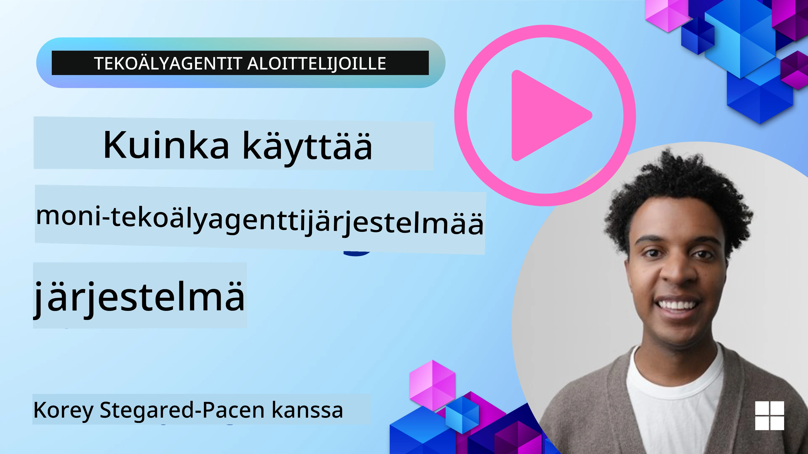
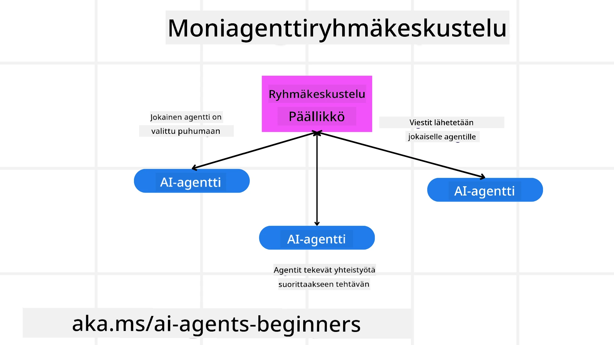
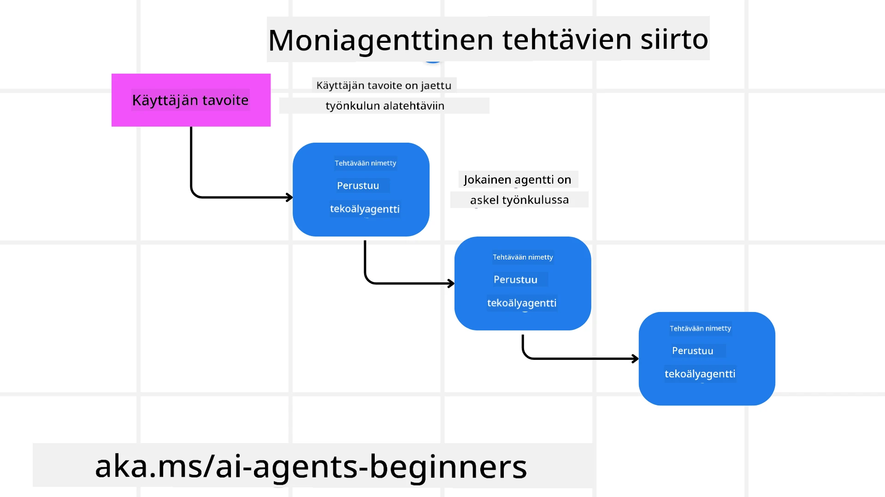
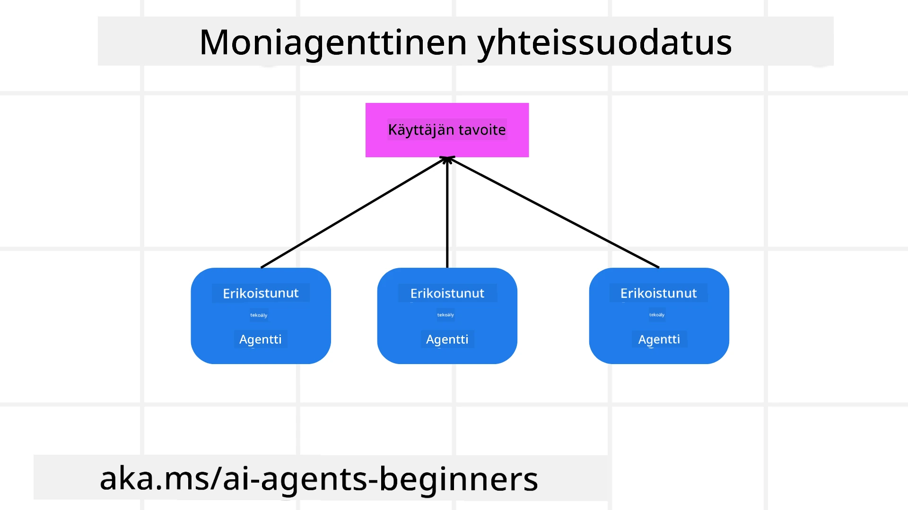

> _(Klikkaa yllä olevaa kuvaa nähdäksesi tämän oppitunnin videon)_

# Multi-agenttisuunnittelumallit

Heti kun aloitat projektin, joka sisältää useita agenteja, sinun täytyy ottaa huomioon multi-agenttisuunnittelumalli. Ei kuitenkaan välttämättä ole heti selvää, milloin siirtyä moniin agenteihin ja mitkä ovat edut.

## Johdanto

Tässä oppitunnissa pyrimme vastaamaan seuraaviin kysymyksiin:

- Mitkä ovat tilanteet, joissa multi-agentit ovat sovellettavissa?
- Mitkä ovat monien agenttien käytön edut verrattuna siihen, että yksi ainoa agentti hoitaisi useita tehtäviä?
- Mitkä ovat multi-agenttisuunnittelumallin toteuttamisen rakennuspalikat?
- Miten voimme nähdä, miten useat agentit ovat vuorovaikutuksessa keskenään?

## Oppimistavoitteet

Tämän oppitunnin jälkeen sinun tulisi pystyä:

- Tunnistamaan tilanteet, joissa multi-agentit ovat sovellettavissa
- Havaitsemaan monien agenttien käytön edut verrattuna yksittäiseen agenttiin
- Ymmärtämään multi-agenttisuunnittelumallin toteuttamisen rakennuspalikat

Mikä on laajempi kokonaiskuva?

*Multi-agentit ovat suunnittelumalli, joka sallii useiden agenttien työskentelyn yhdessä yhteisen tavoitteen saavuttamiseksi*.

Tätä mallia käytetään laajasti eri aloilla, kuten robotiikassa, autonomisissa järjestelmissä ja hajautetussa laskennassa.

## Tilanteet, joissa multi-agentit ovat sovellettavissa

Missä tilanteissa multi-agentteja kannattaa käyttää? Vastaus on, että monissa tilanteissa useiden agenttien hyödyntäminen on hyödyllistä, erityisesti seuraavissa tapauksissa:

- **Suuret työmäärät**: Suuret työmäärät voidaan jakaa pienempiin tehtäviin ja jakaa eri agenteille, mikä mahdollistaa rinnakkaisen käsittelyn ja nopeamman valmistumisen. Esimerkkinä tästä on suuri tietojenkäsittelytehtävä.
- **Monimutkaiset tehtävät**: Monimutkaiset tehtävät, kuten suuret työmäärätkin, voidaan pilkkoa pienempiin alatehtäviin, jotka annetaan eri agenteille, joista jokainen erikoistuu tehtävän tiettyyn osa-alueeseen. Hyvä esimerkki on autonomiset ajoneuvot, joissa eri agentit hallitsevat navigointia, esteiden havaitsemista ja viestintää muiden ajoneuvojen kanssa.
- **Monipuolinen erikoisosaaminen**: Eri agentit voivat hallita monipuolista osaamista, mikä mahdollistaa tehtävän eri osa-alueiden tehokkaamman hoitamisen kuin yhden agentin. Tässä tapauksessa hyvä esimerkki on terveydenhuolto, jossa agentit voivat hallita diagnostiikkaa, hoitosuunnitelmia ja potilaan seurantaa.

## Monien agenttien käytön edut verrattuna yksittäiseen agenttiin

Yksittäinen agenttijärjestelmä voisi toimia hyvin yksinkertaisissa tehtävissä, mutta monimutkaisemmissa tehtävissä useiden agenttien käyttö tarjoaa useita etuja:

- **Erikoistuminen**: Jokainen agentti voi erikoistua tiettyyn tehtävään. Kun yksittäinen agentti ei ole erikoistunut, sinulla on agentti, joka pystyy tekemään kaikkea, mutta voi hämmentyä monimutkaisissa tehtävissä. Se voi esimerkiksi lopulta hoitaa tehtävän, johon se ei ole parhaiten soveltuva.
- **Skaalautuvuus**: Järjestelmiä on helpompi skaalata lisäämällä agentteja sen sijaan, että kuormitat yksittäistä agenttia liikaa.
- **Vikasietoisuus**: Jos yksi agentti epäonnistuu, muut voivat jatkaa toimintaansa, varmistaen järjestelmän luotettavuuden.

Otetaan esimerkki: varataan matka käyttäjälle. Yksittäinen agenttijärjestelmä joutuu hoitamaan kaikki matkanvarausprosessin vaiheet, lennon löytämisestä hotellin ja vuokra-auton varaamiseen. Yhden agentin saavuttamiseksi agentilla pitäisi olla työkaluja kaikkien näiden tehtävien hoitamiseen. Tämä voisi johtaa monimutkaiseen ja monoliittiseen järjestelmään, jota on vaikea ylläpitää ja skaalata. Toisaalta multi-agenttijärjestelmä voisi sisältää eri agentteja, jotka ovat erikoistuneet lennon etsintään, hotellin ja vuokra-autojen varaamiseen. Tämä tekisi järjestelmästä modulaarisemman, helpommin ylläpidettävän ja skaalautuvan.

Vertaa tätä matkatoimistoon, jota pyörittää perheyritys verrattuna matkatoimistoon, joka toimii franchising-mallilla. Perheyrityksessä yksi agentti hoitaa kaikki matkan varaamisen osa-alueet, kun taas franchising-toimistossa eri agentit hoitavat eri osat matkan varaamisesta.

## Multi-agenttisuunnittelumallin toteuttamisen rakennuspalikat

Ennen kuin voit toteuttaa multi-agenttisuunnittelumallin, sinun täytyy ymmärtää mallin muodostavat rakennuspalikat.

Tarkastellaan tätä konkreettisesti uudelleen esimerkillä, jossa varataan matka käyttäjälle. Tässä tapauksessa rakennuspalikat olisivat:

- **Agenttien välinen viestintä**: Lennon etsintään, hotellin varaamiseen ja vuokra-autoihin liittyvien agenttien täytyy kommunikoida ja jakaa tietoa käyttäjän mieltymyksistä ja rajoitteista. Sinun täytyy päättää viestintäprotokollat ja menetelmät. Konkreettisesti tämä tarkoittaa, että lennon etsintään keskittyvän agentin täytyy viestiä hotellin varaamiseen keskittyvän agentin kanssa varmistaakseen, että hotelli on varattu samoille päiville kuin lento. Tämä tarkoittaa, että agenttien täytyy jakaa tietoa käyttäjän matkustuspäivistä, eli sinun pitää päättää *mitkä agentit jakavat tietoa ja miten he jakavat tietoa*.
- **Koordinointimekanismit**: Agenttien täytyy koordinoida toimintaansa varmistaakseen, että käyttäjän mieltymykset ja rajoitteet täyttyvät. Käyttäjän mieltymys voi olla esimerkiksi hotelli lähellä lentokenttää, kun taas rajoite voi olla, että vuokra-autot ovat saatavilla vain lentokentältä. Tämä tarkoittaa, että hotellin varaamiseen keskittyvän agentin täytyy tehdä yhteistyötä vuokra-autojen varaamiseen keskittyvän agentin kanssa varmistaakseen, että käyttäjän toiveet ja rajoitukset toteutuvat. Tämä tarkoittaa, että sinun täytyy päättää *kuinka agentit koordinoivat toimintaansa*.
- **Agenttien arkkitehtuuri**: Agenttien täytyy sisältää sisäinen rakenne päätösten tekemiseen ja oppimiseen käyttäjän kanssakäymisistä. Tämä tarkoittaa, että lennon etsintään keskittyvän agentin täytyy pystyä tekemään päätöksiä siitä, mitä lentoja suositellaan käyttäjälle. Sinun täytyy päättää *kuinka agentit tekevät päätöksiä ja oppivat käyttäjän kanssakäymisistä*. Esimerkkinä siitä, miten agentti oppii ja kehittyy, voisi olla se, että lennon etsintään keskittyvä agentti voisi käyttää koneoppimismallia suositellakseen lentoja käyttäjän aiempien mieltymysten perusteella.
- **Näkyvyys multi-agenttien vuorovaikutuksiin**: Sinun täytyy nähdä, miten useat agentit ovat vuorovaikutuksessa keskenään. Tämä tarkoittaa, että sinulla täytyy olla työkaluja ja tekniikoita agenttien aktiviteettien ja vuorovaikutuksien seuraamiseen. Tämä voi olla lokitus- ja valvontatyökaluja, visualisointityökaluja ja suorituskykymittareita.
- **Multi-agenttimallit**: Multi-agenttijärjestelmien toteuttamiseen on erilaisia malleja, kuten keskitettyjä, hajautettuja ja hybridejä arkkitehtuureja. Sinun täytyy päättää, mikä malli sopii parhaiten käyttötapaukseesi.
- **Ihminen kehissä**: Useimmissa tapauksissa ihmisellä on rooli järjestelmässä, ja sinun täytyy ohjeistaa agentteja, milloin pyytää ihmisen väliintuloa. Tämä voi olla esimerkiksi käyttäjän pyyntö tietystä hotellista tai lennosta, jota agentit eivät ole suositelleet, tai vahvistuksen pyytäminen ennen lentojen tai hotellien varaamista.

## Näkyvyys multi-agenttien vuorovaikutuksiin

On tärkeää, että sinulla on näkyvyys siihen, miten useat agentit ovat vuorovaikutuksessa keskenään. Tämä näkyvyys on olennaista virheiden korjaamiseksi, optimoinniksi ja järjestelmän kokonaistehokkuuden varmistamiseksi. Tätä varten sinun täytyy omistaa työkaluja ja tekniikoita agenttien aktiviteettien ja vuorovaikutusten seuraamiseen. Tämä voi olla lokitus- ja valvontatyökaluja, visualisointityökaluja ja suorituskykymittareita.

Esimerkiksi käyttäjälle matkaa varattaessa voitaisiin käyttää kojelautaa, joka näyttää kunkin agentin tilan, käyttäjän mieltymykset ja rajoitteet sekä agenttien väliset vuorovaikutukset. Tämä kojelauta voisi näyttää käyttäjän matkustuspäivät, lentojen suositukset lentoagentilta, hotellisuositukset hotelliagentilta ja vuokra-autosuositukset vuokra-autoagentilta. Tämä antaisi selkeän kuvan siitä, miten agentit ovat vuorovaikutuksessa keskenään ja täyttyvätkö käyttäjän mieltymykset ja rajoitteet.

Tutkitaan kutakin näistä näkökohdista tarkemmin.

- **Loki- ja valvontatyökalut**: Haluat tehdä lokituksen jokaisesta agentin suorittamasta toiminnosta. Lokimerkintä voisi tallentaa tiedot agentista, joka suoritti toiminnon, tehdystä toiminnosta, toiminnon suoritusajasta ja toiminnon tuloksesta. Tätä tietoa voidaan sen jälkeen käyttää virheiden korjaamisessa, optimoinnissa ja muussa.
  
- **Visualisointityökalut**: Visualisointityökalut auttavat näkemään agenttien väliset vuorovaikutukset intuitiivisemmalla tavalla. Esimerkiksi voitaisiin käyttää kaaviota, joka näyttää tiedon virtauksen agenttien välillä. Tämä voisi auttaa tunnistamaan pullonkauloja, tehottomuuksia ja muita järjestelmän ongelmia.

- **Suorituskykymittarit**: Suorituskykymittarit auttavat seuraamaan multi-agenttijärjestelmän tehokkuutta. Voit esimerkiksi seurata tehtävän suorittamiseen kulunutta aikaa, suoritetun tehtävien määrää aikayksikköä kohden ja agenttien tekemiä suositusten tarkkuutta. Näiden tietojen avulla voit tunnistaa parannusalueita ja optimoida järjestelmää.

## Multi-agenttimallit

Tarkastellaan joitakin konkreettisia malleja, joita voimme käyttää multi-agent-sovellusten luomiseen. Tässä on joitakin mielenkiintoisia malleja harkittavaksi:

### Ryhmäkeskustelu

Tätä mallia käytetään, kun haluat luoda ryhmäkeskustelusovelluksen, jossa useat agentit voivat kommunikoida keskenään. Tyypillisiä käyttötapauksia ovat tiimityö, asiakastuki ja sosiaalinen verkostoituminen.

Tässä mallissa kukin agentti edustaa käyttäjää ryhmäkeskustelussa, ja agenttien välillä vaihdetaan viestejä viestintäprotokollaa käyttäen. Agentit voivat lähettää viestejä ryhmäkeskusteluun, vastaanottaa viestejä ja vastata muiden agenttien viesteihin.

Tämä malli voidaan toteuttaa keskitetyn arkkitehtuurin avulla, jossa kaikki viestit reititetään keskitetyn palvelimen kautta, tai hajautetulla arkkitehtuurilla, jossa viestit vaihdetaan suoraan.

### Tehtävien siirto

Tämä malli on hyödyllinen, kun haluat luoda sovelluksen, jossa useat agentit voivat siirtää tehtäviä toisilleen.

Tyypillisiä käyttötapauksia ovat asiakastuki, tehtävien hallinta ja työnkulun automatisointi.

Tässä mallissa kukin agentti edustaa tehtävää tai työvaihetta, ja agentit voivat siirtää tehtäviä toisille agenteille ennalta määriteltyjen sääntöjen perusteella.

### Yhteistyöhön perustuva suodatus

Tämä malli on hyödyllinen, kun haluat luoda sovelluksen, jossa useat agentit voivat tehdä yhteistyötä käyttäjille suositusten antamiseksi.

Miksi haluaisit useiden agenttien tekevän yhteistyötä? Koska jokaisella agentilla voi olla eri erikoisosaaminen, ja ne voivat osallistua suositusprosessiin eri tavoin.

Otetaan esimerkki, jossa käyttäjä haluaa suosituksen parhaasta osakkeesta ostettavaksi pörssissä.

- **Toimiala-asiantuntija**: Yksi agentti voisi olla asiantuntija tietyllä toimialalla.
- **Tekninen analyysi**: Toinen agentti voisi olla teknisen analyysin asiantuntija.
- **Perusanalyysi**: Ja kolmas agentti voisi olla perusanalyysin asiantuntija. Yhteistyöllä nämä agentit voivat tarjota käyttäjälle kattavamman suosituksen.

## Tilanne: Palautusprosessi

Otetaan tilanne, jossa asiakas yrittää saada tuotteen palautusta. Tässä prosessissa voi olla useita agenteja mukana, mutta jaetaan ne tässä palautusprosessiin spesifiin agentteihin ja yleisiin agentteihin, joita voidaan käyttää myös muissa prosesseissa.

**Palautusprosessiin liittyvät agentit**:

Seuraavat agentit voisivat olla palautusprosessissa mukana:

- **Asiakasagentti**: Tämä agentti edustaa asiakasta ja vastaa palautusprosessin käynnistämisestä.
- **Myyjäagentti**: Tämä agentti edustaa myyjää ja vastaa palautuksen käsittelystä.
- **Maksuagentti**: Tämä agentti vastaa maksuprosessista ja huolehtii asiakkaan maksun palautuksesta.
- **Ratkaisuagentti**: Tämä agentti vastaa mahdollisten ongelmien ratkaisemisesta palautusprosessin aikana.
- **Säännöstenmukaisuusagentti**: Tämä agentti varmistaa, että palautusprosessi noudattaa säädöksiä ja käytäntöjä.

**Yleiset agentit**:

Näitä agenteja voidaan käyttää myös muissa yrityksesi prosesseissa.

- **Toimitusagentti**: Tämä agentti vastaa tuotteen palautuskuljetuksesta myyjälle. Tätä agenttia voi käyttää sekä palautusprosessissa että yleisessä tuotetoimituksessa esimerkiksi ostosten yhteydessä.
- **Palautteenantaja-agentti**: Tämä agentti vastaa asiakkaan palautteen keräämisestä. Palaute voidaan kerätä milloin tahansa, ei vain palautusprosessin aikana.
- **Eskalaatioagentti**: Tämä agentti huolehtii ongelmien eskalaatiosta korkeammalle tukitasolle. Tätä agenttityyppiä voi käyttää missä tahansa prosessissa, jossa tarvitaan ongelman eskalointia.
- **Ilmoitusagentti**: Tämä agentti vastaa ilmoitusten lähettämisestä asiakkaalle eri palautusprosessin vaiheissa.
- **Analytiikka-agentti**: Tämä agentti analysoi palautusprosessiin liittyvää dataa.
- **Tarkastusagentti**: Tämä agentti tarkastaa palautusprosessin varmistaakseen, että se toteutetaan oikein.
- **Raportointiagentti**: Tämä agentti vastaa raporttien laatimisesta palautusprosessista.
- **Tietämyksenantaja-agentti**: Tämä agentti ylläpitää tietopohjaa palautusprosessiin liittyvistä tiedoista. Tämä agentti voi olla perehtynyt sekä palautuksiin että muihin liiketoimintasi osa-alueisiin.
- **Turva-agentti**: Tämä agentti vastaa palautusprosessin turvallisuudesta.
- **Laatuagentti**: Tämä agentti vastaa palautusprosessin laadun varmistamisesta.

Edellä luetellut agentit ovat melko monia, sekä palautusprosessiin spesifejä että yleisiä agentteja, joita voi käyttää myös muissa liiketoimintasi osissa. Toivottavasti tämä antaa sinulle kuvan siitä, miten voit päättää, mitä agenteja käyttää multi-agenttijärjestelmässäsi.

## Tehtävä

Suunnittele multi-agenttijärjestelmä asiakastukiprosessille. Tunnista prosessiin liittyvät agentit, heidän roolinsa ja vastuunsa sekä miten ne ovat vuorovaikutuksessa keskenään. Ota huomioon sekä asiakastukiprosessiin spesifit agentit että yleiset agentit, joita voidaan käyttää myös muissa liiketoimintasi osissa.
> Mieti hetki ennen kuin luet seuraavan ratkaisun, saatat tarvita enemmän agentteja kuin luulet.

> VINKKI: Mieti asiakastukiprosessin eri vaiheita ja ota myös huomioon mistä tahansa järjestelmästä tarvittavat agentit.

## Ratkaisu

[Solution](./solution/solution.md)

## Tietovarmistukset

Kysymys: Milloin kannattaa harkita monen agentin käyttöä?

- [ ] A1: Kun sinulla on pieni työmäärä ja yksinkertainen tehtävä.
- [ ] A2: Kun sinulla on suuri työmäärä
- [ ] A3: Kun sinulla on yksinkertainen tehtävä.

[Solution quiz](./solution/solution-quiz.md)

## Yhteenveto

Tässä oppitunnissa olemme tarkastelleet monen agentin suunnittelumallia, mukaan lukien tilanteet, joissa monen agentin käyttö on soveltuvaa, monen agentin käytön edut verrattuna yksittäiseen agenttiin, monen agentin suunnittelumallin toteuttamisen rakennuspalikat sekä miten saada näkyvyys siihen, miten useat agentit ovat vuorovaikutuksessa keskenään.

### Onko sinulla lisää kysymyksiä monen agentin suunnittelumallista?

Liity [Microsoft Foundry Discordiin](https://aka.ms/ai-agents/discord) tavata muita oppijoita, osallistua aukioloaikoihin ja saada vastauksia AI Agents -kysymyksiisi.

## Lisäresurssit

- <a href="https://learn.microsoft.com/azure/ai-services/agents/overview" target="_blank">Microsoft Agent Frameworkin dokumentaatio</a>
- <a href="https://www.analyticsvidhya.com/blog/2024/10/agentic-design-patterns/" target="_blank">Agenttisuunnittelumallit</a>

## Edellinen oppitunti

[Planning Design](../07-planning-design/README.md)

## Seuraava oppitunti

[Metacognition in AI Agents](../09-metacognition/README.md)

---

<!-- CO-OP TRANSLATOR DISCLAIMER START -->
**Vastuuvapauslauseke**:
Tämä asiakirja on käännetty tekoälykäännöspalvelulla [Co-op Translator](https://github.com/Azure/co-op-translator). Pyrimme tarkkuuteen, mutta huomaathan, että automaattikäännöksissä voi esiintyä virheitä tai epätarkkuuksia. Alkuperäistä asiakirjaa sen alkuperäiskielellä tulisi pitää virallisena lähteenä. Tärkeissä tiedoissa suositellaan ammattimaista ihmiskäännöstä. Emme ole vastuussa tämän käännöksen käytöstä aiheutuvista väärinymmärryksistä tai virhetulkinnoista.
<!-- CO-OP TRANSLATOR DISCLAIMER END -->