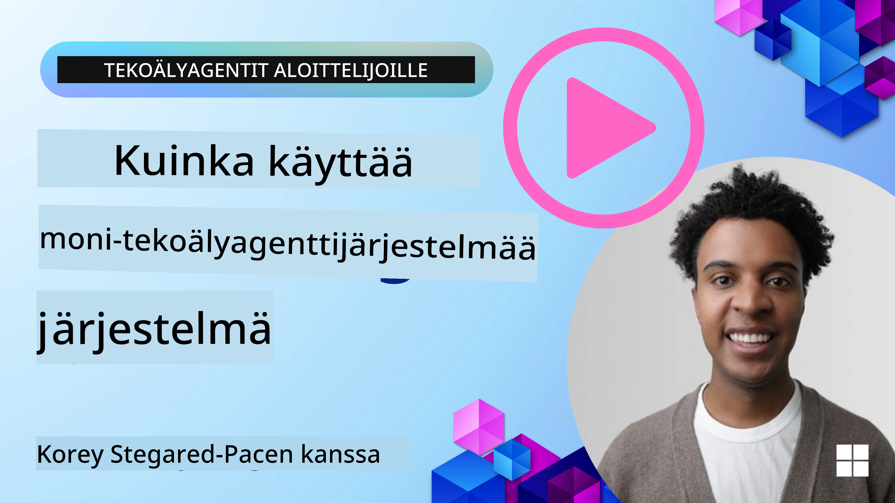
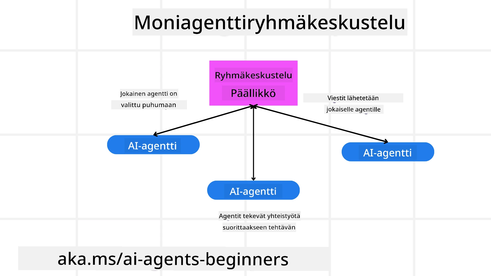
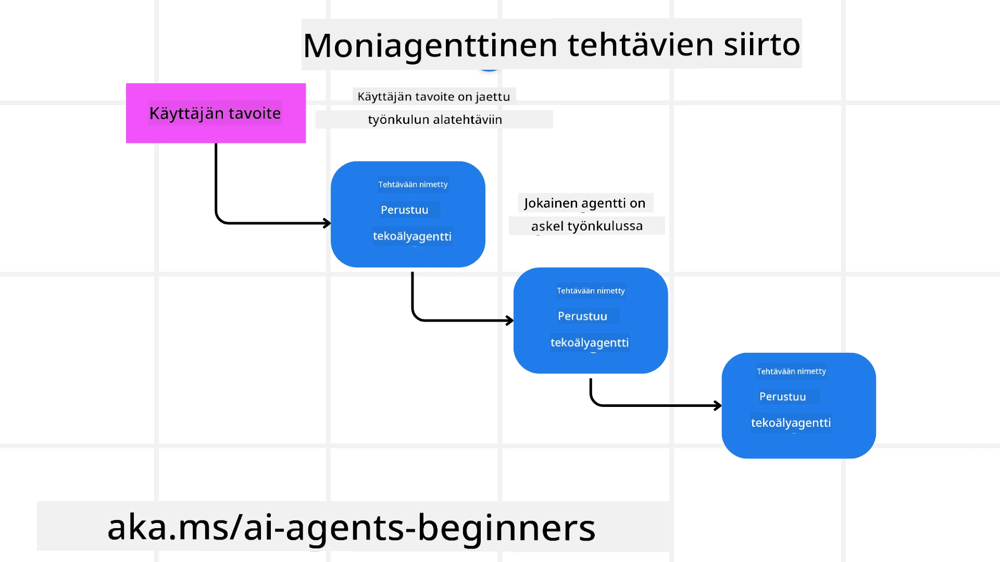
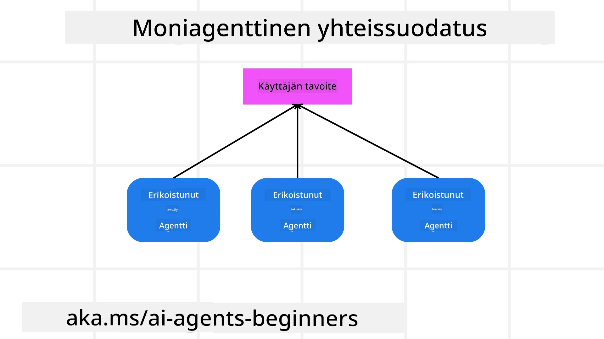

> _(Klikkaa kuvaa yllä nähdäksesi videon tästä oppitunnista)_

# Moniagenttisuunnittelumallit

Heti kun alat työskennellä projektin parissa, johon liittyy useita agentteja, sinun on harkittava moniagenttisuunnittelumallia. Ei kuitenkaan välttämättä ole heti selvää, milloin siirtyä moniagentteihin ja mitkä ovat edut.

## Johdanto

Tässä oppitunnissa pyrimme vastaamaan seuraaviin kysymyksiin:

- Missä tilanteissa moniagentteja voidaan soveltaa?
- Mitkä ovat moniagenttien käytön edut verrattuna siihen, että yksi agentti hoitaa useita tehtäviä?
- Mitkä ovat moniagenttisuunnittelumallin toteutuksen peruselementit?
- Miten voimme saada näkyvyyttä siihen, miten monet agentit ovat vuorovaikutuksessa keskenään?

## Oppimistavoitteet

Tämän oppitunnin jälkeen sinun pitäisi osata:

- Tunnistaa tilanteet, joissa moniagentit soveltuvat
- Tunnistaa moniagenttien käytön edut verrattuna yksittäiseen agenttiin.
- Ymmärtää moniagenttisuunnittelumallin toteutuksen peruselementit.

Mikä on laajempi näkymä?

*Moniagentit ovat suunnittelumalli, joka mahdollistaa useiden agenttien työskentelyn yhdessä yhteisen tavoitteen saavuttamiseksi.*

Tätä mallia käytetään laajalti erilaisilla aloilla, mukaan lukien robotiikka, itsenäiset järjestelmät ja hajautettu laskenta.

## Tilanteet, joissa moniagentit soveltuvat

Mitkä tilanteet ovat hyvän koti käytön moniagenttien käytölle? Vastaus on, että moniagenttien käyttö on hyödyllistä monissa tilanteissa, erityisesti seuraavissa:

- **Suurit työkuormat**: Suuret työkuormat voidaan jakaa pienempiin tehtäviin ja kohdistaa eri agenteille, mikä mahdollistaa rinnakkaisen käsittelyn ja nopeamman valmistumisen. Esimerkkinä tästä on suuri tietojenkäsittelytehtävä.
- **Monimutkaiset tehtävät**: Monimutkaiset tehtävät, kuten suuret työkuormat, voidaan jakaa pienempiin alatehtäviin ja antaa eri agenteille, jotka erikoistuvat tiettyyn osaan tehtävää. Hyvä esimerkki tästä on autonomiset ajoneuvot, joissa eri agentit huolehtivat navigoinnista, esteiden havaitsemisesta ja viestinnästä muiden ajoneuvojen kanssa.
- **Monipuolinen asiantuntemus**: Eri agenteilla voi olla erilaisia asiantuntemuksia, mikä mahdollistaa eri tehtävien käsittelyn tehokkaammin kuin yhdellä agentilla. Tässä tapauksessa hyvä esimerkki on terveydenhuolto, jossa agentit voivat hoitaa diagnostiikkaa, hoitosuunnitelmia ja potilasseurantaa.

## Moniagenttien käytön edut yksittäiseen agenttiin verrattuna

Yksittäinen agenttijärjestelmä voi toimia hyvin yksinkertaisissa tehtävissä, mutta monimutkaisemmissa tehtävissä useiden agenttien käyttö voi tarjota useita etuja:

- **Erikoistuminen**: Jokainen agentti voi olla erikoistunut tiettyyn tehtävään. Yksittäisen agentin erikoistumattomuus tarkoittaa, että agentti voi tehdä kaikkea, mutta saattaa hämmentyä monimutkaisen tehtävän edessä ja päätyä tekemään tehtävää, johon se ei ole parhaiten soveltuva.
- **Skaalautuvuus**: Järjestelmää on helpompi skaalata lisäämällä agentteja kuin kuormittamalla yksittäistä agenttia liikaa.
- **Vikasietoisuus**: Jos yksi agentti epäonnistuu, muut voivat jatkaa toimintaa, mikä varmistaa järjestelmän luotettavuuden.

Otetaan esimerkki, varataan matka käyttäjälle. Yksittäinen agenttijärjestelmä joutuisi hoitamaan kaikki matkanvarausprosessin vaiheet, lennon etsimisestä hotellien ja vuokra-autojen varaamiseen. Tämän saavuttamiseksi yhdellä agentilla pitäisi olla työkalut kaikkien näiden tehtävien hoitamiseen, mikä voisi johtaa monimutkaiseen ja monoliittiseen järjestelmään, jota on vaikea ylläpitää ja skaalata. Moniagenttijärjestelmässä eri agentit erikoistuvat lentojen etsimiseen, hotellien varaamiseen ja vuokra-autojen varaamiseen. Tämä tekee järjestelmästä modulaarisemman, helpommin ylläpidettävän ja skaalautuvan.

Vertaa tätä äitiys- ja isämyymälöissä toimivaan matkatoimistoon verrattuna matkatoimistoon, joka toimii franchising-periaatteella. Äitiys- ja isämyymälässä yksi agentti hoitaisi kaikki matkanvarausprosessin vaiheet, kun taas franchisingissa eri agentit hoitaisivat eri vaiheet.

## Moniagenttisuunnittelumallin toteutuksen peruselementit

Ennen kuin voit toteuttaa moniagenttisuunnittelumallin, sinun on ymmärrettävä mallin peruselementit.

Tehdään tämä konkreettisemmaksi tarkastelemalla uudelleen esimerkkiä käyttäjän matkan varaamisesta. Tässä tapauksessa peruselementteihin kuuluvat:

- **Agenttien välinen viestintä**: Lentojen etsimiseen, hotellien varaamiseen ja vuokra-autoihin erikoistuneiden agenttien on kommunikoitava ja jaettava tietoja käyttäjän mieltymyksistä ja rajoitteista. Sinun on päätettävä viestinnän protokollista ja metodeista. Konkreettisesti tämä tarkoittaa, että lentojen etsintään erikoistunut agentti viestii hotellien varausagentin kanssa varmistaakseen, että hotelli varataan samoille päiville kuin lento. Tämä tarkoittaa, että agenttien on jaettava tietoja käyttäjän matkustuspäivistä, eli sinun on päätettävä *mitkä agentit jakavat tietoa ja miten ne jakavat sitä*.
- **Koordinointimekanismit**: Agenttien täytyy koordinoida toimiaan varmistaakseen, että käyttäjän mieltymykset ja rajoitteet täyttyvät. Käyttäjän mieltymys voisi olla hotelli lähellä lentokenttää, ja rajoite se, että vuokra-autot ovat saatavilla vain lentokentällä. Tämä tarkoittaa, että hotellien varausagentin on koordinoitava toimintaa vuokra-autojen varausagentin kanssa varmistaakseen mieltymysten ja rajoitteiden täyttymisen. Sinun tarvitsee päättää *miten agentit koordinoivat toimintaansa*.
- **Agenttien arkkitehtuuri**: Agenttien on oltava sisäisesti rakenteellisia päätöksenteolle ja oppimiselle käyttäjän kanssa käydyn vuorovaikutuksen perusteella. Tämä tarkoittaa, että lentojen etsintään tarkoitettujen agenttien on päätettävä, mitä lentoja käyttäjälle suositellaan. Sinun on siis päätettävä *miten agentit tekevät päätöksiä ja oppivat vuorovaikutuksesta käyttäjän kanssa*. Esimerkiksi lentojen etsintään erikoistunut agentti voisi käyttää koneoppimismallia suositellakseen lentoja käyttäjän aiempien mieltymysten perusteella.
- **Näkyvyys moniagenttien vuorovaikutuksiin**: Sinun on saatava näkyvyys siihen, miten useat agentit ovat vuorovaikutuksessa keskenään. Tämä vaatii työkaluja ja tekniikoita agenttien toimintojen ja vuorovaikutusten seuraamiseen. Tämä voi olla kirjaus- ja valvontatyökaluja, visualisointityökaluja ja suorituskykymittareita.
- **Moniagenttimallit**: On olemassa eri malleja moniagenttijärjestelmien toteuttamiseen, kuten keskitetty, hajautettu ja hybridiarkkitehtuurit. Sinun on päätettävä, mikä malli sopii parhaiten käyttötapaukseesi.
- **Ihminen ketjussa**: Useimmissa tapauksissa ihmisen on oltava mukana ja sinun on ohjattava agentteja, milloin pyytää ihmisen väliintuloa. Tämä voi olla esimerkiksi käyttäjän pyyntö saada tietty hotelli tai lento, jota agentit eivät ole suositelleet, tai pyyntö varmistuksesta ennen lennon tai hotellin varaamista.

## Näkyvyys moniagenttien vuorovaikutuksiin

On tärkeää, että sinulla on näkyvyys siihen, miten useat agentit ovat vuorovaikutuksessa keskenään. Tämä näkyvyys on välttämätöntä virheiden korjaamiseksi, optimoinniksi ja koko järjestelmän toimivuuden varmistamiseksi. Saavuttaaksesi tämän, tarvitset työkaluja ja tekniikoita agenttien toimintojen ja vuorovaikutusten seuraamiseen. Tämä voi olla kirjaus- ja valvontatyökaluja, visualisointityökaluja ja suorituskykymittareita.

Esimerkiksi käyttäjän matkanvarauksen tapauksessa sinulla voisi olla hallintapaneeli, joka näyttää kunkin agentin tilan, käyttäjän mieltymykset ja rajoitteet sekä agenttien väliset vuorovaikutukset. Tämä hallintapaneeli voisi näyttää käyttäjän matkustuspäivät, lentojen suositukset lentojen etsintään erikoistuneelta agentilta, hotellien suositukset hotellien varausagentilta ja vuokra-autojen suositukset vuokra-autojen varausagentilta. Näin saisit selkeän kuvan siitä, miten agentit ovat vuorovaikutuksessa keskenään ja toteutuvatko käyttäjän mieltymykset ja rajoitteet.

Katsotaanpa näitä näkökulmia tarkemmin.

- **Kirjaus- ja valvontatyökalut**: Halutset kirjausten tekevän jokaisesta agentin suorittamasta toiminnasta. Kirjausmerkintä voisi tallentaa tietoja agentista, joka suoritti toiminnon, suoritetusta toimenpiteestä, hetkestä, jolloin toiminto tehtiin, ja toiminnon tuloksesta. Näitä tietoja voidaan käyttää virheiden korjaukseen, optimointiin ja muuhun.

- **Visualisointityökalut**: Visualisointityökalut voivat auttaa sinua näkemään agenttien välisen vuorovaikutuksen intuitiivisemmalla tavalla. Esimerkiksi voit käyttää graafia, joka näyttää tiedon kulun agenttien välillä. Tämä voi auttaa tunnistamaan pullonkauloja, tehottomuuksia ja muita järjestelmän ongelmia.

- **Suorituskykymittarit**: Suorituskykymittarit auttavat seuraamaan moniagenttijärjestelmän tehokkuutta. Esimerkiksi voit mitata tehtävän suorittamiseen käytettyä aikaa, suoritetun tehtävien määrää aikayksikköä kohti ja agenttien tekemiä suosituksia koskevaa tarkkuutta. Tämä tieto voi auttaa tunnistamaan parannuskohteita ja optimoimaan järjestelmää.

## Moniagenttimallit

Tutustutaan konkreettisiin malleihin, joita voimme käyttää moniagenttisovellusten luomiseen. Tässä on mielenkiintoisia malleja, joita kannattaa harkita:

### Ryhmäkeskustelu

Tämä malli on hyödyllinen, kun haluat luoda ryhmäkeskustelusovelluksen, jossa useat agentit voivat viestiä keskenään. Tyypillisiä käyttötapauksia ovat tiimiyhteistyö, asiakastuki ja sosiaalinen verkostoituminen.

Tässä mallissa kukin agentti edustaa käyttäjää ryhmäkeskustelussa, ja viestejä vaihdetaan agenttien kesken viestintäprotokollan avulla. Agentit voivat lähettää viestejä ryhmäkeskusteluun, vastaanottaa ryhmäkeskustelun viestejä ja vastata muiden agenttien viesteihin.

Tämä malli voidaan toteuttaa keskitettynä arkkitehtuurina, jossa kaikki viestit kulkevat keskuspalvelimen kautta, tai hajautettuna arkkitehtuurina, jossa viestit vaihdetaan suoraan.

### Tehtävien siirto

Tämä malli on hyödyllinen, kun haluat luoda sovelluksen, jossa useat agentit voivat siirtää tehtäviä toisilleen.

Tyypillisiä käyttötapauksia ovat asiakastuki, tehtävien hallinta ja työnkulkujen automaatio.

Tässä mallissa kukin agentti edustaa tehtävää tai työvaihetta työnkulussa, ja agentit voivat siirtää tehtäviä muille agenteille ennalta määriteltyjen sääntöjen perusteella.

### Yhteistyö suodatus

Tämä malli on hyödyllinen, kun haluat luoda sovelluksen, jossa useat agentit voivat tehdä yhteistyötä antaakseen suosituksia käyttäjille.

Miksi haluaisit monien agenttien tekevän yhteistyötä, johtuu siitä, että jokainen agentti voi omaa erilaista asiantuntemusta ja voi osallistua suositusprosessiin eri tavoin.

Otetaan esimerkki, jossa käyttäjä haluaa suosituksen parhaiten ostettavasta osakkeesta pörssissä.

- **Toimialan asiantuntija**: Yksi agentti voisi olla asiantuntija tietyllä toimialalla.
- **Tekninen analyysi**: Toinen agentti voisi olla asiantuntija teknisessä analyysissä.
- **Perusanalyysi**: Ja kolmas agentti voisi olla asiantuntija perusanalyysissä. Yhteistyöllä näistä agenteista voidaan tarjota käyttäjälle kattavampi suositus.

## Tilanne: Hyvityksen käsittely

Harkitaan tilannetta, jossa asiakas yrittää saada hyvityksen tuotteesta. Tässä prosessissa voi olla mukana melko monta agenttia, mutta jaetaan ne hyvitykseen erikoistuneisiin agentteihin ja yleisiin agentteihin, joita voidaan käyttää muissakin prosesseissa.

**Hyvitykseen erikoistuneet agentit**:

Seuraavat agentit voivat olla mukana hyvityksen käsittelyssä:

- **Asiakasagentti**: Tämä agentti edustaa asiakasta ja on vastuussa hyvitysprosessin aloittamisesta.
- **Myyjäagentti**: Tämä agentti edustaa myyjää ja vastaa hyvityksen käsittelystä.
- **Maksuagentti**: Tämä agentti edustaa maksuprosessia ja vastaa asiakkaan maksun hyvittämisestä.
- **Ratkaisuprosessiantti**: Tämä agentti vastaa hyvitysprosessin aikana esiintyvien ongelmien ratkaisemisesta.
- **Säädöstenmukaisuusagentti**: Tämä agentti vastaa siitä, että hyvitysprosessi noudattaa säädöksiä ja yrityksen käytäntöjä.

**Yleiset agentit**:

Näitä agentteja voi käyttää liiketoimintasi muut osat.

- **Kuljetusagentti**: Tämä agentti vastaa tuotteen palauttamisesta myyjälle. Tätä agenttia voidaan käyttää sekä hyvitysprosessissa että tuotteiden yleisessä kuljetuksessa esimerkiksi ostojen yhteydessä.
- **Palauteagentti**: Tämä agentti vastaa asiakkaan palautteen keräämisestä. Palautetta voidaan kerätä milloin tahansa, ei pelkästään hyvitysprosessin aikana.
- **Eskalaatioagentti**: Tämä agentti vastaa asioiden eskaloinnista korkeammalle tukitasolle. Tätä agenttia voi käyttää missä tahansa prosessissa, jossa tarvitaan ongelman eskalaatiota.
- **Ilmoitusagentti**: Tämä agentti vastaa ilmoitusten lähettämisestä asiakkaalle hyvitysprosessin eri vaiheissa.
- **Analytiikkaagentti**: Tämä agentti vastaa hyvitysprosessiin liittyvien tietojen analysoinnista.
- **Tarkastusagentti**: Tämä agentti vastaa hyvitysprosessin auditoinnista varmistaen, että prosessi suoritetaan oikein.
- **Raportointiantti**: Tämä agentti vastaa hyvitysprosessin raporttien laatimisesta.
- **Tietämysagentti**: Tämä agentti ylläpitää hyvitysprosessiin liittyvää tietopohjaa. Tämä agentti voi olla perehtynyt sekä hyvityksiin että muihin liiketoiminnan osa-alueisiin.
- **Turvaagentti**: Tämä agentti vastaa hyvitysprosessin turvallisuuden varmistamisesta.
- **Laatuagentti**: Tämä agentti vastaa hyvitysprosessin laadun varmistamisesta.

Edellä luetellut agentit kattavat sekä hyvitykseen erikoistuneet että liiketoiminnan muut osat palvelevat yleiset agentit. Toivottavasti tämä antaa sinulle käsityksen siitä, miten voit päättää, mitä agenteita käyttää moniagenttijärjestelmässäsi.

## Tehtävä

Suunnittele moniagenttijärjestelmä asiakastukiprosessille. Tunnista prosessiin osallistuvat agentit, heidän roolinsa ja vastuunsa sekä miten he ovat vuorovaikutuksessa keskenään. Harkitse sekä asiakastukeen erikoistuneita agenteita että yleisiä agentteja, joita voidaan käyttää liiketoiminnan muissa osissa.

> Mieti hetki ennen seuraavan ratkaisun lukemista, saatat tarvita enemmän agentteja kuin luulet.

> VINKKI: Ajattele asiakastuen eri vaiheita ja ota myös huomioon järjestelmään tarvittavat agentit.

## Ratkaisu

[Ratkaisu](./solution/solution.md)

## Tietokyselyt

### Kysymys 1

Mikä tilanne sopii parhaiten monen agentin järjestelmälle?

- [ ] A1: Tukibotti vastaa yleisiin kysymyksiin käyttäen yhtä tietokantaa ja pientä työkalupakettia.
- [ ] A2: Hyvityksen käsittelyprosessi tarvitsee erilliset roolit petosten torjuntaan, maksuihin ja vaatimustenmukaisuuteen, jokaisella omat työkalunsa, ja tulokset on koordinoitava.
- [ ] A3: Sama yksinkertainen luokituspyyntö saapuu tuhansia kertoja tunnissa.

### Kysymys 2

Milloin yksi agentti on yleensä parempi valinta?

- [ ] A1: Tehtävä voidaan hoitaa yhdellä ohjeiden ja työkalujen sarjalla, ilman erikoisasiantuntijoiden kierrätystä.
- [ ] A2: Agentilla on käytössään useampi työkalu.
- [ ] A3: Työnkulku vaatii erilliset roolit, joilla on eri käyttöoikeudet ja itsenäiset auditointilokit.

[Ratkaisukysely](./solution/solution-quiz.md)

## Yhteenveto

Tässä oppitunnissa olemme tarkastelleet monen agentin suunnittelumallia, mukaan lukien tilanteet, joissa monen agentin käyttö on sopivaa, monen agentin käytön edut verrattuna yhteen agenttiin, monen agentin suunnittelumallin toteuttamisen rakennuspalikat sekä miten saada näkyvyys siihen, miten useat agentit ovat vuorovaikutuksessa keskenään.

### Onko sinulla lisää kysymyksiä monen agentin suunnittelumallista?

Liity [Microsoft Foundry Discordiin](https://discord.com/invite/ATgtXmAS5D) tavata muita oppijoita, osallistua toimistoaikoihin ja saada vastauksia tekoälyagentteja koskeviin kysymyksiisi.

## Lisäresurssit

- <a href="https://learn.microsoft.com/azure/ai-services/agents/overview" target="_blank">Microsoft Agent Framework -dokumentaatio</a>
- <a href="https://www.analyticsvidhya.com/blog/2024/10/agentic-design-patterns/" target="_blank">Agenttisuunnittelumallit</a>

## Edellinen oppitunti

[Suunnittelun suunnittelu](../07-planning-design/README.md)

## Seuraava oppitunti

[Metakognitio tekoälyagenteissa](../09-metacognition/README.md)

---

<!-- CO-OP TRANSLATOR DISCLAIMER START -->
**Vastuuvapauslauseke**:
Tämä asiakirja on käännetty käyttämällä tekoälypohjaista käännöspalvelua [Co-op Translator](https://github.com/Azure/co-op-translator). Vaikka pyrimme tarkkuuteen, otathan huomioon, että automaattiset käännökset saattavat sisältää virheitä tai epätarkkuuksia. Alkuperäinen asiakirja sen alkuperäiskielellä on virallinen lähde. Tärkeissä asioissa suositellaan ammattimaista ihmiskäännöstä. Emme ole vastuussa tämän käännöksen käytöstä aiheutuvista väärinymmärryksistä tai tulkinnoista.
<!-- CO-OP TRANSLATOR DISCLAIMER END -->