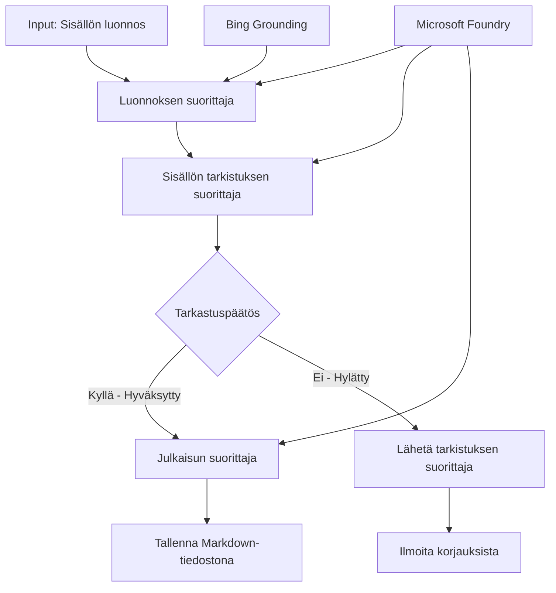

# 🔀 Ehtoiset agenttityönkulut Microsoft Foundryn kanssa (.NET)

## 📋 Älykäs päätökseen perustuva työnkulkuopas

Tämä muistikirja esittelee **ehtoisia työnkulkumalleja** Microsoft Foundryn ja Microsoft Agent Frameworkin .NET-version avulla. Opit rakentamaan kehittyneitä, päätöksiin perustuvia työnkulkuja, jotka älykkäästi ohjaavat käsittelyä AI-analyysin, liiketoimintasääntöjen ja dynaamisten ehtojen perusteella yritystason automaatioon.

## 🎯 Oppimistavoitteet

### 🧠 **Älykäs päätösarkkitehtuuri**
- **Ehtoisen logiikan toteutus**: Rakenna monimutkaisia päätöspuita, joissa on useita haarautumiskohtia
- **AI-vetoinen reititys**: Käytä Microsoft Foundryn malleja älykkäiden reititysratkaisujen tekemiseen
- **Dynaaminen työnkulun mukauttaminen**: Muokkaa työnkulun käyttäytymistä ajoituksen analyysiin ja ehtoihin perustuen
- **Yrityssääntöjen integrointi**: Sisällytä liiketoimintalogiikka ja säännösten vaatimukset työnkulkuihin

### 🔀 **Edistyneet ehdolliset mallit**
- **Monikriteerinen päätöksenteko**: Arvioi useita tekijöitä reitityspäätöksissä
- **Kontekstitietoinen käsittely**: Tee päätöksiä kertyneen työnkulun kontekstin ja historian perusteella
- **Soveltuva työnkulun muokkaus**: Säädä dynaamisesti käsittelypolkuja reaaliaikaisten ehtojen mukaan
- **Sääntömoottorin integrointi**: Toteuta edistyneitä liiketoimintasääntömoottoreita työnkuluissa

### 🏢 **Yritysten ehdolliset sovellukset**
- **Dokumenttien luokittelu ja reititys**: Luokittele ja reititä dokumentteja automaattisesti sopiviin työnkulkuihin
- **Asiakaspalvelun triage**: Älykäs asiakkaiden tiedustelujen reititys erikoisryhmille
- **Säännösten noudattaminen ja riskienhallinta**: Käytä erilaisia tarkastus- ja arviointiprosesseja riskien perusteella
- **Laatutakuun työnkulut**: Reititä sisältö sopivien tarkastusprosessien läpi laadun mittareiden mukaan

## ⚙️ Ennakkoedellytykset ja asennus

### 📦 **Vaaditut NuGet-paketit**

Edistyneet paketit ehtoiselle työnkulkukäsittelylle:

```xml
<!-- Core AI Framework -->
<PackageReference Include="Microsoft.Extensions.AI" Version="9.9.0" />

<!-- Azure AI Agents with Persistent State -->
<PackageReference Include="Azure.AI.Agents.Persistent" Version="1.2.0-beta.5" />

<!-- Azure Identity and Utilities -->
<PackageReference Include="Azure.Identity" Version="1.15.0" />
<PackageReference Include="System.Linq.Async" Version="6.0.3" />
<PackageReference Include="DotNetEnv" Version="3.1.1" />

<!-- Local Workflow Framework References -->
<!-- Microsoft.Agents.Workflows.dll - Advanced workflow orchestration -->
<!-- Microsoft.Agents.AI.AzureAI.dll - Microsoft Foundry integration -->
<!-- Microsoft.Agents.AI.dll - Core agent abstractions -->
```

### 🔑 **Microsoft Foundryn konfigurointi**

**Tarvittavat Azure-resurssit:**
- Microsoft Foundryn työtila, joka sisältää ehdolliset käsittelymallit
- Azure-tilaus, jossa on asianmukaiset laskentakvotat ja oikeudet
- Otetut käyttöön tekoälymallit päätöksentekoa ja sisällön analysointia varten
- (Valinnainen) Bing-hakupalvelun API-yhteys taustatietojen hakuun

**Ympäristökonfiguraatio (.env tiedosto):**
```env
# Microsoft Foundry Configuration
AZURE_AI_PROJECT_ENDPOINT=https://your-project.cognitiveservices.azure.com/
BING_CONNECTION_ID=your-bing-connection-id
```

**Todennuksen asetukset:**
```csharp
// Azure CLI or Managed Identity authentication
using Azure.Identity;
var credential = new AzureCliCredential();

// Load environment configuration
DotNetEnv.Env.Load("../../../.env");
```

### 🏗️ **Ehtoinen työnkulkukarkkitehtuuri**



**Keskeiset komponentit:**
- **Luonnoseksekuteija**: AI-agentti, joka luo luonnoksia selostuksista
- **Sisällön tarkastusmekanismi**: AI-agentti, joka arvioi luonnosten laatua ja vaatimustenmukaisuutta
- **Ehtoinen reititys**: Päätöslogiikka, joka ohjaa reititystä tarkastustulosten perusteella
- **Julkaisun ja tarkastuksen polut**: Erottaa käsittelyreitit hyväksytylle ja hylätylle sisällölle
- **Tilahallinta**: Ylläpitää sisällön ja tarkastuksen kontekstia koko työnkulun ajan

## 🎨 **Ehtoisten työnkulkusuunnittelumallien esittely**

### 📋 **Sisällöntuotanto laadunvalintapisteillä**
```
Outline → Draft Creation → Quality Review → {Approve: Publish | Reject: Revise}
```

### 🎯 **Riskiperusteinen dokumenttien käsittely**
```
Document → Risk Assessment → {Low: Standard | High: Enhanced Review}
```

### 🔍 **Älykäs asiakaspalvelureititys**
```
Customer Query → Analysis → {Simple: FAQ Bot | Complex: Human Agent}
```

### 💼 **Säännösten noudattamiseen perustuvat työnkulut**
```
Content → Compliance Check → {Pass: Publish | Fail: Legal Review}
```

## 🏢 **Ehdolliset hyödyt yrityksille**

### 🎯 **Älykäs automaatio**
- **Älykäs päätöksenteko**: AI-pohjaiset reitityspäätökset sisällön analyysin ja kontekstin perusteella
- **Mukautuva käsittely**: Työnkulut, jotka säätävät automaattisesti muuttuvien ehtojen mukaan
- **Liiketoimintasääntöjen noudattaminen**: Monimutkaisten liiketoimintalogiikkojen ja -politiikkojen automaattinen soveltaminen
- **Kontekstitietoinen reititys**: Päätöksiä koko työnkulun historian ja kertyneen kontekstin perusteella

### 📈 **Toiminnan erinomaisuus**
- **Optimoitu resurssien kohdentaminen**: Reititä työ sopivimmille asiantuntijoille ja prosesseille
- **Vähemmän manuaalista väliintuloa**: Automaattinen päätöksenteko minimoi ihmisen reititystarpeen
- **Nopeammat ratkaisujen toteutusajat**: Suora reititys oikeille asiantuntijoille ja käsittelykapasiteeteille
- **Tasainen soveltaminen**: Yhtenäinen liiketoimintasääntöjen ja päätöskriteerien soveltaminen

### 🛡️ **Riskienhallinta ja sääntelyn noudattaminen**
- **Automaattinen riskinarviointi**: AI-avusteinen sisällön ja tilanteen riskitason arviointi
- **Sääntelyn noudattaminen**: Automatisoitu reititys vaadittavien sääntelyprosessien kautta
- **Turvaprotokollien soveltaminen**: Tehostetut turvatoimet riskinarviointien mukaisesti
- **Auditointilokin ylläpito**: Täydellinen dokumentaatio reitityspäätöksistä ja perusteista

### 📊 **Analytiikka ja jatkuva parantaminen**
- **Päätösanalyytiikka**: Seuraa reitityspäätösten tehokkuutta ja tarkkuutta
- **Mallintunnistus**: Tunnista trendejä ja malleja reitityspäätöksissä ajan mittaan
- **Suorituskyvyn optimointi**: Päätöskriteerien ja reitityksen tehokkuuden jatkuva parantaminen
- **Liiketoimintatiedon hyödyntäminen**: Näkemyksiä sisällön ominaisuuksista ja käsittelytarpeista

### 🔧 **Tekninen erinomaisuus**
- **Pidetty tilanhallinta**: Hallitse monimutkaista tilaa työnkulun suorituksen aikana
- **Laajennettava arkkitehtuuri**: Käsittele suuria volyymejä ehtoiseen käsittelyyn
- **Integraatiomahdollisuudet**: Saumaton integraatio olemassa oleviin liiketoimintajärjestelmiin ja prosesseihin
- **Seuranta ja havaittavuus**: Kattava suorituskyvyn ja päätösten seuranta työnkulussa

Rakennetaan älykkäitä, päätöksiin perustuvia yritystyönkulkuja .NET:llä! 🚀

## 💻 Koodin suorittaminen

Täydellinen toteutus löytyy tiedostosta `04.dotnet-agent-framework-workflow-aifoundry-condition.cs`. Se esittelee **sisällöntuotannon työnkulun laadunvalintapisteillä**:

### 🏗️ **Työnkulun arkkitehtuuri**

```
Content Outline → Draft Creation → Quality Review → Conditional Routing:
                                                      ├─ Approved (>200 words) → Publish
                                                      └─ Rejected (<200 words) → Review Notification
```

**Työnkulun agentit:**
1. **Evangelist Agent**: Luo opas luonnokset rungon perusteella Bing-taustatiedolla
2. **Content Reviewer Agent**: Arvioi luonnoksen laatua (sanamäärä, täydellisyys)
3. **Publisher Agent**: Tallentaa hyväksytyn sisällön aikaleimattuna Markdown-tiedostoina

**Mukautetut eksekutoijat:**
1. **DraftExecutor**: Orkestroi luonnosten luomisen
2. **ContentReviewExecutor**: Suorittaa laatutarkastuksen
3. **PublishExecutor**: Hallinnoi hyväksytyn sisällön julkaisun
4. **SendReviewExecutor**: Hoitaa hylätyistä tiedoista ilmoittamisen

### 🚀 Esimerkin suoritus

**Ennakkoedellytykset:**
- Microsoft Foundryn työtila on konfiguroitu
- Azure CLI -todennus (`az login`)
- (Valinnainen) Bing-haku taustatietojen hakemiseen

```bash
# Tee skriptistä suoritettava (Unix/Linux/macOS)
chmod +x 04.dotnet-agent-framework-workflow-aifoundry-condition.cs

# Suorita ehdollinen työnkulku
./04.dotnet-agent-framework-workflow-aifoundry-condition.cs
```

Tai Windowsilla:
```powershell
dotnet run 04.dotnet-agent-framework-workflow-aifoundry-condition.cs
```

### 📝 Odotettu tulos

Työnkulku suorittaa:
1. **Agenttien luonti**: Alustaa kolme erikoistunutta Microsoft Foundry -agenttia
2. **Luonnoksen generointi**: Evangelist-agentti luo oppaan luonnoksen rungon pohjalta
3. **Sisällön tarkastus**: Sisällön tarkastaja arvioi luonnoksen laadun
4. **Ehtoinen reititys**:
   - **Jos hyväksytty (>200 sanaa)**: Julkaisueksekutoija tallentaa Markdown-tiedostona
   - **Jos hylätty (<200 sanaa)**: Lähetä tarkastusilmoitus
5. **Tulosten näyttäminen**: Näytä työnkulun lopputulos

### 🔧 Mukautusmahdollisuudet

**Muokkaa tarkastuskriteerejä:**
```csharp
const string ContentReviewerInstructions = @"
You are a content reviewer...
1. Check if content is more than 500 words (instead of 200)
2. Verify technical accuracy
3. Ensure proper formatting
...";
```

**Lisää lisää ehtoisia polkuja:**
```csharp
var workflow = new WorkflowBuilder(draftExecutor)
    .AddEdge(draftExecutor, contentReviewerExecutor)
    .AddEdge(contentReviewerExecutor, publishExecutor, condition: GetCondition("Excellent"))
    .AddEdge(contentReviewerExecutor, editExecutor, condition: GetCondition("Good"))
    .AddEdge(contentReviewerExecutor, sendReviewerExecutor, condition: GetCondition("Poor"))
    .Build();
```

**Vaihda sisällön vaatimuksia:**
```csharp
string OUTLINE_Content = @"
# Your Custom Topic
## Section 1
https://your-reference-url
## Section 2
...
";
```

### 🎯 Todelliset käyttötapaukset

Tämä ehdollinen työnkulkumalli sopii erityisen hyvin:
- **Sisällönhallintajärjestelmiin**: Automaattiset toimitukselliset työnkulut laadunvalintapisteillä
- **Dokumenttien käsittelyyn**: Reititä dokumentit luokituksen ja vaatimusten mukaan
- **Asiakastukeen**: Älykäs lippujen reititys monimutkaisuuden ja kiireellisyyden perusteella
- **Oikeudelliseen tarkastukseen**: Sopimusten reititys riskinarvioinnin ja arvon mukaan
- **Henkilöstön prosesseihin**: Hakemusten reitti oikeiden seulontaprosessien läpi

### 🔍 Ehtologiikan ymmärtäminen

**Ehto-funktio:**
```csharp
public Func<object?, bool> GetCondition(string expectedResult) =>
    reviewResult => reviewResult is ReviewResult review && review.Result == expectedResult;
```

Tämä funktio luo predikaatin, joka:
1. Tarkistaa, onko tulos tyyppiä `ReviewResult`
2. Vertaa `Result`-ominaisuutta odotettuun arvoon
3. Palauttaa true/false määrittääkseen reitityksen

**Työnkulun reunat ehtojen kanssa:**
```csharp
.AddEdge(contentReviewerExecutor, publishExecutor, condition: GetCondition("Yes"))
.AddEdge(contentReviewerExecutor, sendReviewerExecutor, condition: GetCondition("No"))
```

### 📊 Edistyneet ominaisuudet

**JSON-skeeman validointi:**
Työnkulku käyttää JSON-skeemoja varmistaakseen jäsennellyt vastaukset:

```csharp
// Define response structure
public class ReviewResult
{
    [JsonPropertyName("review_result")]
    public string Result { get; set; } = string.Empty;
    
    [JsonPropertyName("reason")]
    public string Reason { get; set; } = string.Empty;
    
    [JsonPropertyName("draft_content")]
    public string DraftContent { get; set; } = string.Empty;
}

// Apply to agent
ResponseFormat = ChatResponseFormat.ForJsonSchema(
    AIJsonUtilities.CreateJsonSchema(typeof(ReviewResult)), 
    "ReviewResult", 
    "Review Result From DraftContent"
)
```

**Bing-taustatiedon integrointi:**
Evangelist-agentti käyttää Bing-taustaa hankkiakseen reaaliaikaista tietoa:

```csharp
var bingGroundingConfig = new BingGroundingSearchConfiguration(bing_conn_id);
BingGroundingToolDefinition bingGroundingTool = new(
    new BingGroundingSearchToolParameters([bingGroundingConfig])
);
```

Tämä mahdollistaa agentin seuraamisen URL-osoitteissa rungossa ja nykyisen tiedon poimimisen.

### 🛡️ Virheenkäsittely

Työnkulku sisältää vankan virheenkäsittelyn hylätylle sisällölle:
- Tarkastusvirheet aktivoivat vaihtoehtoisen polun
- Ilmoitukset tarjoavat selkeät hylkäyssyyt
- Sisältö säilyy tarkistusta varten

### 🔄 Työnkulun laajennus

**Lisää korjaussilmukka:**
Luo palautesilmukka, joka luonnostelee sisällön uudelleen automaattisesti:

```csharp
.AddEdge(contentReviewerExecutor, publishExecutor, condition: GetCondition("Yes"))
.AddEdge(contentReviewerExecutor, draftExecutor, condition: GetCondition("No")) // Loop back
```

**Toteuta monitasoinen tarkastus:**
Lisää useita tarkastusvaiheita eri kriteereillä:

```csharp
.AddEdge(draftExecutor, technicalReviewer)
.AddEdge(technicalReviewer, editorialReviewer, condition: GetCondition("TechPass"))
.AddEdge(editorialReviewer, publishExecutor, condition: GetCondition("EditPass"))
```

Tämä ehdollinen työnkulkumalli tarjoaa perustan kehittyneiden, älykkäiden yritysautomaatiokehysten rakentamiseen! 🚀

---

<!-- CO-OP TRANSLATOR DISCLAIMER START -->
**Vastuuvapauslauseke**:
Tämä asiakirja on käännetty käyttämällä tekoälypohjaista käännöspalvelua [Co-op Translator](https://github.com/Azure/co-op-translator). Vaikka pyrimme tarkkuuteen, otathan huomioon, että automaattiset käännökset saattavat sisältää virheitä tai epätarkkuuksia. Alkuperäinen asiakirja sen alkuperäiskielellä on virallinen lähde. Tärkeissä asioissa suositellaan ammattimaista ihmiskäännöstä. Emme ole vastuussa tämän käännöksen käytöstä aiheutuvista väärinymmärryksistä tai tulkinnoista.
<!-- CO-OP TRANSLATOR DISCLAIMER END -->