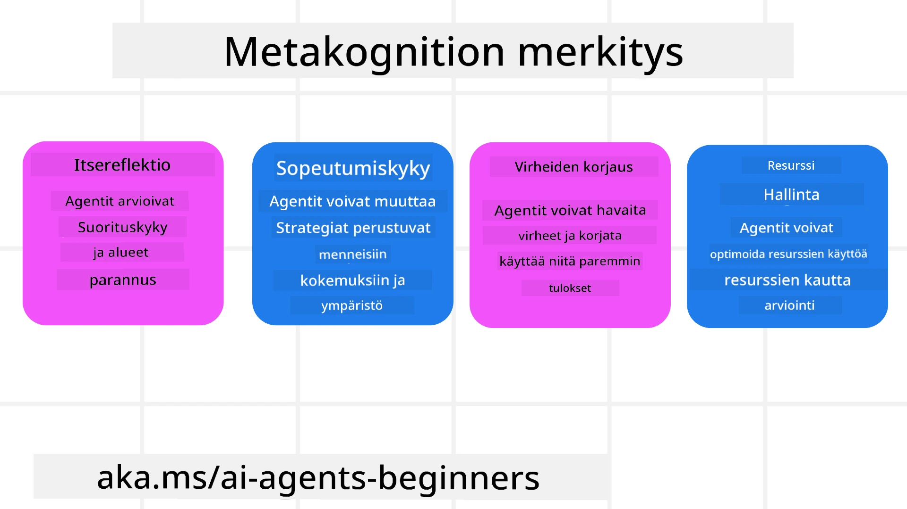
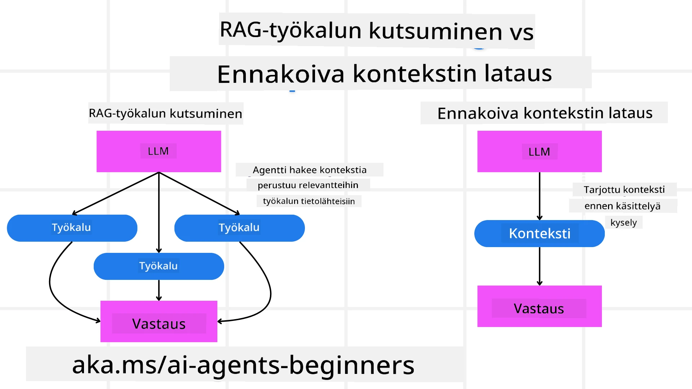

[](https://youtu.be/His9R6gw6Ec?si=3_RMb8VprNvdLRhX)

> _(Klikkaa yllä olevaa kuvaa katsoaksesi tämän oppitunnin videon)_
# Metakognitio tekoälyagenteissa

## Johdanto

Tervetuloa oppitunnille tekoälyagenttien metakognitiosta! Tämä luku on suunnattu aloittelijoille, jotka ovat kiinnostuneita siitä, miten tekoälyagentit voivat ajatella omia ajatteluprosessejaan. Oppitunnin lopuksi ymmärrät keskeiset käsitteet ja sinulla on käytännön esimerkkejä metakognition soveltamisesta tekoälyagenttien suunnittelussa.

## Oppimistavoitteet

Oppitunnin suorittamisen jälkeen osaat:

1. Ymmärtää päättelysilmukkien vaikutukset agenttien määrittelyssä.
2. Käyttää suunnittelu- ja arviointitekniikoita itsensä korjaavien agenttien tukemiseksi.
3. Luoda omia agentteja, jotka pystyvät käsittelemään koodia tehtävien suorittamiseksi.

## Metakognition esittely

Metakognitio viittaa korkeampiin kognitiivisiin prosesseihin, jotka tarkoittavat oman ajattelun pohtimista. Tekoälyagenteille tämä tarkoittaa kykyä arvioida ja mukauttaa toimintaansa itsearvioinnin ja aiempien kokemusten perusteella. Metakognitio, eli "ajattelu ajattelemisesta", on tärkeä käsite agenttipohjaisten tekoälyjärjestelmien kehityksessä. Se tarkoittaa, että tekoälyjärjestelmät ovat tietoisia omista sisäisistä prosesseistaan ja pystyvät valvomaan, säätelemään ja sopeuttamaan käyttäytymistään sen mukaisesti. Aivan kuten me teemme, kun luemme tilannetta tai tarkastelemme ongelmaa. Tämä itseymmärrys voi auttaa tekoälyjärjestelmiä tekemään parempia päätöksiä, tunnistamaan virheitä ja parantamaan suoritustaan ajan myötä – jälleen viitaten Turingin testiin ja keskusteluun siitä, tuleeko tekoäly valtaamaan.

Agenttipohjaisen tekoälyn kontekstissa metakognitio voi auttaa ratkaisemaan useita haasteita, kuten:
- Läpinäkyvyys: Varmistaa, että tekoälyjärjestelmät voivat selittää päättelynsä ja päätöksensä.
- Päättely: Parantaa tekoälyjärjestelmien kykyä yhdistellä tietoa ja tehdä perusteltuja päätöksiä.
- Sopeutuminen: Mahdollistaa tekoälyjärjestelmien mukautumisen uusiin ympäristöihin ja muuttuviin olosuhteisiin.
- Havainnointi: Parantaa tekoälyjärjestelmien tarkkuutta ympäristöstä kerätyn datan tunnistamisessa ja tulkinnassa.

### Mikä on metakognitio?

Metakognitio, eli "ajattelu ajattelemisesta", on korkeampi kognitiivinen prosessi, johon kuuluu itseymmärrys ja kognitiivisten prosessien itseohjautuvuus. Tekoälyn alalla metakognitio antaa agenteille kyvyn arvioida ja mukauttaa strategioitaan ja toimiaan, mikä johtaa parantuneisiin ongelmanratkaisu- ja päätöksentekokykyihin. Ymmärtämällä metakognition voit suunnitella tekoälyagentteja, jotka eivät ole pelkästään älykkäämpiä vaan myös mukautuvampia ja tehokkaampia. Todellisessa metakognitiossa tekoäly perustelee eksplisiittisesti omaa päättelyään.

Esimerkki: ”Asetin halvimmat lennot etusijalle, koska… saatan menettää suorien lentojen mahdollisuuden, joten tarkistan uudelleen.”.
Seuraa miten tai miksi agentti valitsi tietyn reitin.
- Huomaa, että se teki virheitä, koska luotti liikaa käyttäjän viime kerralla antamiin mieltymyksiin, joten se muuttaa päätöksentekostrategiaansa, ei vain lopullista suositusta.
- Tunnistaa malleja kuten: ”aina kun käyttäjä mainitsee ’liian ruuhkaista’, en pelkästään poista tiettyjä nähtävyyksiä vaan myös pohdin, että ’parhaiden nähtävyyksien’ valintamenetelmäni on virheellinen, jos aina sijoitan suosion mukaan.”

### Metakognition merkitys tekoälyagenteissa

Metakognitiolla on keskeinen rooli tekoälyagenttien suunnittelussa useista syistä:



- Itsetutkiskelu: Agentit voivat arvioida omaa suoriutumistaan ja tunnistaa parannuskohteita.
- Sopeutumiskyky: Agentit voivat muuttaa strategioitaan aiempien kokemusten ja muuttuvien olosuhteiden perusteella.
- Virheiden korjaus: Agentit voivat havaita ja korjata virheitä itsenäisesti, mikä johtaa tarkempiin tuloksiin.
- Resurssien hallinta: Agentit voivat optimoida resurssien, kuten ajan ja laskentatehon, käyttöä suunnittelemalla ja arvioimalla toimintaansa.

## Tekoälyagentin osat

Ennen metakognitiivisiin prosesseihin syventymistä on tärkeää ymmärtää tekoälyagentin perusosat. Tekoälyagentti koostuu tyypillisesti seuraavista:

- Persoona: Agentin persoonallisuus ja ominaisuudet, jotka määrittävät sen vuorovaikutuksen käyttäjien kanssa.
- Työkalut: Agentin suorittamat kyvyt ja toiminnot.
- Taidot: Agentin omistama tietämys ja asiantuntemus.

Nämä osat toimivat yhdessä muodostaen "asiantuntijayksikön", joka voi suorittaa tiettyjä tehtäviä.

**Esimerkki**:
Ajattele matkanjärjestäjää, joka ei ainoastaan suunnittele lomasi, vaan myös säätää reittiään reaaliaikaisen datan ja aiempien asiakaskokemusten perusteella.

### Esimerkki: Metakognitio matkanjärjestäjäpalvelussa

Kuvittele, että suunnittelet tekoälypohjaista matkanjärjestäjäpalvelua. Tämä agentti, "Matkanjärjestäjä", auttaa käyttäjiä lomamatkojen suunnittelussa. Sisällyttääksesi metakognition, Matkanjärjestäjän tulee arvioida ja säätää toimintaansa itsearvioinnin ja aiempien kokemusten pohjalta. Näin metakognitio voisi toimia:

#### Nykyinen tehtävä

Auttaa käyttäjää suunnittelemaan matka Pariisiin.

#### Tehtävän suorittamisen vaiheet

1. **Kerää käyttäjän mieltymykset**: Kysy käyttäjältä matkustuspäivät, budjetti, kiinnostuksenkohteet (esim. museot, ruoka, ostokset) ja erityisvaatimukset.
2. **Hanki tietoa**: Etsi lentoja, majoituksia, nähtävyyksiä ja ravintoloita käyttäjän mieltymysten mukaan.
3. **Luo suositukset**: Tarjoa henkilökohtainen matkasuunnitelma lentotiedoilla, hotellivarauksilla ja ehdotetuilla aktiviteeteilla.
4. **Säädä palautteen perusteella**: Kysy käyttäjältä palautetta suosituksista ja tee tarvittavat muutokset.

#### Tarvittavat resurssit

- Pääsy lento- ja hotellivarauksien tietokantoihin.
- Tietoa Pariisin nähtävyyksistä ja ravintoloista.
- Käyttäjäpalautedata aiemmista vuorovaikutuksista.

#### Kokemus ja itsetutkiskelu

Matkanjärjestäjä käyttää metakognitiota arvioidakseen suoriutumistaan ja oppiakseen aiemmista kokemuksista. Esimerkiksi:

1. **Analysoi käyttäjäpalautetta**: Matkanjärjestäjä tarkastelee palautetta määrittääkseen, mitkä suositukset otettiin hyvin vastaan ja mitkä eivät. Se säätää tulevia ehdotuksiaan tämän perusteella.
2. **Sopeutumiskyky**: Jos käyttäjä on aiemmin maininnut, ettei pidä ruuhkaisista paikoista, Matkanjärjestäjä välttää suosittelemasta suosittuja turistinähtävyyksiä ruuhka-aikoina jatkossa.
3. **Virheiden korjaus**: Jos Matkanjärjestäjä teki virheen aiemmassa varauksessa, esimerkiksi ehdottamalla täysin varattua hotellia, se oppii tarkistamaan saatavuuden huolellisemmin ennen suositusten tekemistä.

#### Käytännön kehittäjäesimerkki

Tässä on yksinkertaistettu esimerkki Matkanjärjestäjän koodista, jossa metakognitio on sisällytetty:

```python
class Travel_Agent:
    def __init__(self):
        self.user_preferences = {}
        self.experience_data = []

    def gather_preferences(self, preferences):
        self.user_preferences = preferences

    def retrieve_information(self):
        # Hae lentoja, hotelleja ja nähtävyyksiä mieltymysten perusteella
        flights = search_flights(self.user_preferences)
        hotels = search_hotels(self.user_preferences)
        attractions = search_attractions(self.user_preferences)
        return flights, hotels, attractions

    def generate_recommendations(self):
        flights, hotels, attractions = self.retrieve_information()
        itinerary = create_itinerary(flights, hotels, attractions)
        return itinerary

    def adjust_based_on_feedback(self, feedback):
        self.experience_data.append(feedback)
        # Analysoi palautetta ja säädä tulevia suosituksia
        self.user_preferences = adjust_preferences(self.user_preferences, feedback)

# Esimerkkikäyttö
travel_agent = Travel_Agent()
preferences = {
    "destination": "Paris",
    "dates": "2025-04-01 to 2025-04-10",
    "budget": "moderate",
    "interests": ["museums", "cuisine"]
}
travel_agent.gather_preferences(preferences)
itinerary = travel_agent.generate_recommendations()
print("Suggested Itinerary:", itinerary)
feedback = {"liked": ["Louvre Museum"], "disliked": ["Eiffel Tower (too crowded)"]}
travel_agent.adjust_based_on_feedback(feedback)
```

#### Miksi metakognitio on tärkeää

- **Itsetutkiskelu**: Agentit voivat analysoida suorituskykyään ja tunnistaa kehityskohteita.
- **Sopeutumiskyky**: Agentit voivat muuttaa strategioitaan palautteen ja muuttuvien olosuhteiden perusteella.
- **Virheiden korjaus**: Agentit voivat itsenäisesti havaita ja korjata virheitä.
- **Resurssien hallinta**: Agentit voivat optimoida resurssien käyttöä, kuten ajan ja laskentatehon hyödyntämistä.

Sisällyttämällä metakognition Matkanjärjestäjä voi tarjota henkilökohtaisempia ja tarkempia matkasuosituksia, parantaen käyttäjäkokemusta.

---

## 2. Suunnittelu agenteissa

Suunnittelu on olennainen osa tekoälyagenttien käyttäytymistä. Siihen kuuluu tarvittavien toimenpiteiden hahmottaminen tavoitteen saavuttamiseksi ottaen huomioon nykyinen tila, resurssit ja mahdolliset esteet.

### Suunnittelun elementit

- **Nykyinen tehtävä**: Määrittele tehtävä selkeästi.
- **Tehtävän vaiheet**: Pilko tehtävä hallittaviin vaiheisiin.
- **Tarvittavat resurssit**: Tunnista tarvittavat resurssit.
- **Kokemus**: Hyödynnä aiempia kokemuksia suunnittelun tukena.

**Esimerkki**:
Tässä ovat askelmat, jotka Matkanjärjestäjän tulee suorittaa auttaakseen käyttäjää suunnittelemaan matka tehokkaasti:

### Matkanjärjestäjän vaiheet

1. **Kerää käyttäjän mieltymykset**
   - Kysy käyttäjältä tietoja matkustuspäivistä, budjetista, kiinnostuksenkohteista ja erityisvaatimuksista.
   - Esimerkkejä: "Milloin aiot matkustaa?" "Mikä on budjettisi?" "Mitä aktiviteetteja tykkäät tehdä lomalla?"

2. **Hae tietoja**
   - Etsi sopivia matkustusvaihtoehtoja käyttäjän mieltymysten perusteella.
   - **Lennot**: Etsi käyttäjän budjetin ja matkustuspäivien puitteissa saatavilla olevia lentoja.
   - **Majoitus**: Löydä hotellit tai vuokra-asunnot, jotka vastaavat käyttäjän sijainti-, hinta- ja mukavuustoiveita.
   - **Nähtävyydet ja ravintolat**: Tunnista suositut nähtävyydet, aktiviteetit ja ruokailuvaihtoehdot, jotka sopivat käyttäjän kiinnostuksenkohteisiin.

3. **Tee suositukset**
   - Koosta kerätyistä tiedoista henkilökohtainen matkasuunnitelma.
   - Tarjoa tiedot, kuten lentovaihtoehdot, hotellivaraukset ja ehdotetut aktiviteetit, sovittaen ne käyttäjän mieltymyksiin.

4. **Esitä matkasuunnitelma käyttäjälle**
   - Jaa ehdotettu matkasuunnitelma käyttäjän tarkasteltavaksi.
   - Esimerkki: "Tässä on ehdotus matkasuunnitelmaksi Pariisiin. Siinä on lentotiedot, hotellivaraukset sekä lista suositelluista aktiviteeteista ja ravintoloista. Kerro mitä mieltä olet!"

5. **Kerää palautetta**
   - Kysy käyttäjältä palautetta ehdotetusta matkasuunnitelmasta.
   - Esimerkkejä: "Pidätkö lentovaihtoehdoista?" "Onko hotelli sopiva tarpeisiisi?" "Haluatko lisätä tai poistaa aktiviteetteja?"

6. **Säädä palautteen perusteella**
   - Tee matkasuunnitelmaan muutoksia käyttäjän palautteen perusteella.
   - Muuta tarvittaessa lento-, majoitus- ja aktiviteettisuosituksia paremmin käyttäjän mieltymyksiä vastaaviksi.

7. **Lopullinen vahvistus**
   - Esitä päivitetty matkasuunnitelma käyttäjälle lopulliseksi vahvistukseksi.
   - Esimerkki: "Tein muutokset palautteesi mukaan. Tässä päivitetty matkasuunnitelma. Näyttääkö kaikki sinusta hyvältä?"

8. **Varaa ja vahvista varaukset**
   - Kun käyttäjä hyväksyy suunnitelman, varaa lennot, majoitukset ja valmiiksi suunnitellut aktiviteetit.
   - Lähetä vahvistustiedot käyttäjälle.

9. **Tarjoa jatkuvaa tukea**
   - Ole käytettävissä auttamaan käyttäjää muutoksissa tai lisäpyynnöissä ennen matkaa ja sen aikana.
   - Esimerkki: "Jos tarvitset apua matkan aikana, ota yhteyttä milloin tahansa!"

### Esimerkkikeskustelu

```python
class Travel_Agent:
    def __init__(self):
        self.user_preferences = {}
        self.experience_data = []

    def gather_preferences(self, preferences):
        self.user_preferences = preferences

    def retrieve_information(self):
        flights = search_flights(self.user_preferences)
        hotels = search_hotels(self.user_preferences)
        attractions = search_attractions(self.user_preferences)
        return flights, hotels, attractions

    def generate_recommendations(self):
        flights, hotels, attractions = self.retrieve_information()
        itinerary = create_itinerary(flights, hotels, attractions)
        return itinerary

    def adjust_based_on_feedback(self, feedback):
        self.experience_data.append(feedback)
        self.user_preferences = adjust_preferences(self.user_preferences, feedback)

# Esimerkkikäyttö buukkauksen pyynnössä
travel_agent = Travel_Agent()
preferences = {
    "destination": "Paris",
    "dates": "2025-04-01 to 2025-04-10",
    "budget": "moderate",
    "interests": ["museums", "cuisine"]
}
travel_agent.gather_preferences(preferences)
itinerary = travel_agent.generate_recommendations()
print("Suggested Itinerary:", itinerary)
feedback = {"liked": ["Louvre Museum"], "disliked": ["Eiffel Tower (too crowded)"]}
travel_agent.adjust_based_on_feedback(feedback)
```

## 3. Korjaava RAG-järjestelmä

Aloitetaan ymmärtämällä ero RAG-työkalun ja ennakoivan kontekstin lataamisen välillä



### Hakuun perustuva generointi (RAG)

RAG yhdistää hakujärjestelmän ja generatiivisen mallin. Kun kysely tehdään, hakujärjestelmä noutaa ulkoisesta lähteestä asiaankuuluvia asiakirjoja tai tietoja, ja näitä tietoja käytetään täydentämään generatiivisen mallin syötettä. Tämä auttaa mallia muodostamaan tarkempia ja kontekstuaalisesti relevantteja vastauksia.

RAG-järjestelmässä agentti hakee relevanttia tietoa tietokannasta ja käyttää sitä sopivien vastausten tai toimintojen luomiseen.

### Korjaava RAG-lähestymistapa

Korjaava RAG keskittyy RAG-tekniikoiden käyttämiseen virheiden korjaamiseksi ja tekoälyagenttien tarkkuuden parantamiseksi. Tämä sisältää:

1. **Kehote-tekniikka**: Käytetään tiettyjä kehotteita ohjaamaan agenttia hakemaan asiaankuuluvaa tietoa.
2. **Työkalu**: Toteutetaan algoritmeja ja mekanismeja, joiden avulla agentti arvioi haetun tiedon relevanssia ja luo tarkkoja vastauksia.
3. **Arviointi**: Arvioidaan jatkuvasti agentin suorituskykyä ja tehdään säätöjä sen tarkkuuden ja tehokkuuden parantamiseksi.

#### Esimerkki: Korjaava RAG hakukoneagentissa

Ajatellaan hakukoneagenttia, joka hakee tietoa verkosta vastatakseen käyttäjän kyselyihin. Korjaava RAG saattaa sisältää:

1. **Kehote-tekniikka**: Hakukyselyiden muodostaminen käyttäjän syötteen perusteella.
2. **Työkalu**: Luonnollisen kielen käsittelyn ja koneoppimisalgoritmien käyttö hakutulosten lajitteluun ja suodattamiseen.
3. **Arviointi**: Käyttäjäpalautteen analysointi virheiden tunnistamiseksi ja korjaamiseksi haetussa tiedossa.

### Korjaava RAG Matkanjärjestäjässä

Korjaava RAG (retrieval-augmented generation) parantaa tekoälyn kykyä hakea ja luoda tietoa samalla korjaten mahdolliset epätarkkuudet. Katsotaan, miten Matkanjärjestäjä voi käyttää korjaavaa RAG-lähestymistapaa tarjotakseen tarkempia ja relevantimpia matkasuosituksia.

Tämä sisältää:

- **Kehote-tekniikka:** Käytetään erityisiä kehotteita ohjaamaan agenttia hakemaan relevanttia tietoa.
- **Työkalu:** Toteutetaan algoritmeja ja mekanismeja, joiden avulla agentti arvioi haetun tiedon relevanssia ja luo tarkkoja vastauksia.
- **Arviointi:** Arvioidaan jatkuvasti agentin suoriutumista ja tehdään säätöjä sen tarkkuuden ja tehokkuuden parantamiseksi.

#### Korjaavan RAG:n toteutus Matkanjärjestäjässä

1. **Alkuperäinen käyttäjävuorovaikutus**
   - Matkanjärjestäjä kerää käyttäjän aloitusmieltymykset, kuten kohde, matkustuspäivät, budjetti ja kiinnostuksen kohteet.
   - Esimerkki:

     ```python
     preferences = {
         "destination": "Paris",
         "dates": "2025-04-01 to 2025-04-10",
         "budget": "moderate",
         "interests": ["museums", "cuisine"]
     }
     ```

2. **Tiedon haku**
   - Matkanjärjestäjä hakee tietoa lennoista, majoituksista, nähtävyyksistä ja ravintoloista käyttäjän mieltymysten perusteella.
   - Esimerkki:

     ```python
     flights = search_flights(preferences)
     hotels = search_hotels(preferences)
     attractions = search_attractions(preferences)
     ```

3. **Alkuperäisten suositusten luominen**
   - Matkanjärjestäjä käyttää haettua tietoa luodakseen henkilökohtaisen matkasuunnitelman.
   - Esimerkki:

     ```python
     itinerary = create_itinerary(flights, hotels, attractions)
     print("Suggested Itinerary:", itinerary)
     ```

4. **Käyttäjäpalautteen kerääminen**
   - Matkanjärjestäjä pyytää käyttäjältä palautetta alkuperäisistä suosituksista.
   - Esimerkki:

     ```python
     feedback = {
         "liked": ["Louvre Museum"],
         "disliked": ["Eiffel Tower (too crowded)"]
     }
     ```

5. **Korjaava RAG-prosessi**
   - **Kehote-tekniikka**: Matkanjärjestäjä muodostaa uusia hakukyselyitä käyttäjäpalautteen perusteella.
     - Esimerkki:

       ```python
       if "disliked" in feedback:
           preferences["avoid"] = feedback["disliked"]
       ```

   - **Työkalu**: Matkanjärjestäjä käyttää algoritmeja lajitellakseen ja suodatakseen uusia hakutuloksia, painottaen käyttäjäpalautteen perusteella relevantteja tuloksia.
     - Esimerkki:

       ```python
       new_attractions = search_attractions(preferences)
       new_itinerary = create_itinerary(flights, hotels, new_attractions)
       print("Updated Itinerary:", new_itinerary)
       ```

   - **Arviointi**: Matkanjärjestäjä arvioi jatkuvasti suositustensa relevanssia ja tarkkuutta analysoimalla käyttäjäpalautetta ja tekemällä tarvittavia säätöjä.
     - Esimerkki:

       ```python
       def adjust_preferences(preferences, feedback):
           if "liked" in feedback:
               preferences["favorites"] = feedback["liked"]
           if "disliked" in feedback:
               preferences["avoid"] = feedback["disliked"]
           return preferences

       preferences = adjust_preferences(preferences, feedback)
       ```

#### Käytännön esimerkki

Tässä on yksinkertaistettu Python-koodiesimerkki, jossa korjaava RAG-lähestymistapa on sisällytetty Matkanjärjestäjään:

```python
class Travel_Agent:
    def __init__(self):
        self.user_preferences = {}
        self.experience_data = []

    def gather_preferences(self, preferences):
        self.user_preferences = preferences

    def retrieve_information(self):
        flights = search_flights(self.user_preferences)
        hotels = search_hotels(self.user_preferences)
        attractions = search_attractions(self.user_preferences)
        return flights, hotels, attractions

    def generate_recommendations(self):
        flights, hotels, attractions = self.retrieve_information()
        itinerary = create_itinerary(flights, hotels, attractions)
        return itinerary

    def adjust_based_on_feedback(self, feedback):
        self.experience_data.append(feedback)
        self.user_preferences = adjust_preferences(self.user_preferences, feedback)
        new_itinerary = self.generate_recommendations()
        return new_itinerary

# Esimerkki käyttöstä
travel_agent = Travel_Agent()
preferences = {
    "destination": "Paris",
    "dates": "2025-04-01 to 2025-04-10",
    "budget": "moderate",
    "interests": ["museums", "cuisine"]
}
travel_agent.gather_preferences(preferences)
itinerary = travel_agent.generate_recommendations()
print("Suggested Itinerary:", itinerary)
feedback = {"liked": ["Louvre Museum"], "disliked": ["Eiffel Tower (too crowded)"]}
new_itinerary = travel_agent.adjust_based_on_feedback(feedback)
print("Updated Itinerary:", new_itinerary)
```

### Ennakoiva kontekstin lataus
Etukäteen kontekstin lataaminen tarkoittaa olennaisen kontekstin tai taustatiedon lataamista malliin ennen kyselyn käsittelyä. Tämä tarkoittaa, että mallilla on pääsy tähän tietoon alusta lähtien, mikä voi auttaa sitä tuottamaan paremmin informoituja vastauksia ilman, että sen tarvitsee hakea lisätietoja prosessin aikana.

Tässä on yksinkertaistettu esimerkki siitä, miltä etukäteen kontekstin lataus voisi näyttää matkatoimiston sovellukselle Pythonissa:

```python
class TravelAgent:
    def __init__(self):
        # Lataa suositut kohteet ja niiden tiedot etukäteen
        self.context = {
            "Paris": {"country": "France", "currency": "Euro", "language": "French", "attractions": ["Eiffel Tower", "Louvre Museum"]},
            "Tokyo": {"country": "Japan", "currency": "Yen", "language": "Japanese", "attractions": ["Tokyo Tower", "Shibuya Crossing"]},
            "New York": {"country": "USA", "currency": "Dollar", "language": "English", "attractions": ["Statue of Liberty", "Times Square"]},
            "Sydney": {"country": "Australia", "currency": "Dollar", "language": "English", "attractions": ["Sydney Opera House", "Bondi Beach"]}
        }

    def get_destination_info(self, destination):
        # Hae kohdetiedot esiladatusta kontekstista
        info = self.context.get(destination)
        if info:
            return f"{destination}:\nCountry: {info['country']}\nCurrency: {info['currency']}\nLanguage: {info['language']}\nAttractions: {', '.join(info['attractions'])}"
        else:
            return f"Sorry, we don't have information on {destination}."

# Esimerkki käytöstä
travel_agent = TravelAgent()
print(travel_agent.get_destination_info("Paris"))
print(travel_agent.get_destination_info("Tokyo"))
```

#### Selitys

1. **Alustus (`__init__`-metodi)**: `TravelAgent`-luokka lataa etukäteen sanakirjan, joka sisältää tietoja suosituista matkakohteista, kuten Pariisi, Tokio, New York ja Sydney. Tämä sanakirja sisältää tietoja kuten maa, valuutta, kieli ja tärkeimmät nähtävyydet kutakin kohdetta varten.

2. **Tiedon hakeminen (`get_destination_info`-metodi)**: Kun käyttäjä kysyy tietoa tietystä kohteesta, `get_destination_info`-metodi hakee asiaankuuluvan tiedon etukäteen ladatusta kontekstisanakirjasta.

Lataamalla kontekstin etukäteen matkatoimiston sovellus voi nopeasti vastata käyttäjän kyselyihin ilman, että sen tarvitsee hakea tätä tietoa ulkoisesta lähteestä reaaliajassa. Tämä tekee sovelluksesta tehokkaamman ja reagoivamman.

### Suunnitelman käynnistäminen tavoitteen avulla ennen iteraatiota

Suunnitelman käynnistäminen tavoitteen avulla tarkoittaa selkeän päämäärän tai tavoitteen asettamista alussa. Määrittelemällä tämän tavoitteen etukäteen malli voi käyttää sitä ohjenuorana koko iteraatioprosessin ajan. Tämä auttaa varmistamaan, että jokainen iteraatio vie kohti haluttua lopputulosta, tehden prosessista tehokkaamman ja fokusoituneemman.

Tässä on esimerkki siitä, miten matkasuunnitelma voidaan käynnistää tavoitteella ennen iteraatiota matkatoimiston sovelluksessa Pythonilla:

### Tilannekuvaus

Matkatoimisto haluaa suunnitella räätälöidyn loman asiakkaalle. Tavoitteena on luoda matkareitti, joka maksimoi asiakkaan tyytyväisyyden heidän mieltymystensä ja budjettinsa perusteella.

### Askeleet

1. Määrittele asiakkaan mieltymykset ja budjetti.
2. Käynnistä alkuperäinen suunnitelma näiden mieltymysten perusteella.
3. Iteroi suunnitelmaa tarkentaen, optimoiden asiakkaan tyytyväisyyttä.

#### Python-koodi

```python
class TravelAgent:
    def __init__(self, destinations):
        self.destinations = destinations

    def bootstrap_plan(self, preferences, budget):
        plan = []
        total_cost = 0

        for destination in self.destinations:
            if total_cost + destination['cost'] <= budget and self.match_preferences(destination, preferences):
                plan.append(destination)
                total_cost += destination['cost']

        return plan

    def match_preferences(self, destination, preferences):
        for key, value in preferences.items():
            if destination.get(key) != value:
                return False
        return True

    def iterate_plan(self, plan, preferences, budget):
        for i in range(len(plan)):
            for destination in self.destinations:
                if destination not in plan and self.match_preferences(destination, preferences) and self.calculate_cost(plan, destination) <= budget:
                    plan[i] = destination
                    break
        return plan

    def calculate_cost(self, plan, new_destination):
        return sum(destination['cost'] for destination in plan) + new_destination['cost']

# Esimerkkikäyttö
destinations = [
    {"name": "Paris", "cost": 1000, "activity": "sightseeing"},
    {"name": "Tokyo", "cost": 1200, "activity": "shopping"},
    {"name": "New York", "cost": 900, "activity": "sightseeing"},
    {"name": "Sydney", "cost": 1100, "activity": "beach"},
]

preferences = {"activity": "sightseeing"}
budget = 2000

travel_agent = TravelAgent(destinations)
initial_plan = travel_agent.bootstrap_plan(preferences, budget)
print("Initial Plan:", initial_plan)

refined_plan = travel_agent.iterate_plan(initial_plan, preferences, budget)
print("Refined Plan:", refined_plan)
```

#### Koodin selitys

1. **Alustus (`__init__`-metodi)**: `TravelAgent`-luokka alustetaan mahdollisten matkakohteiden listalla, joilla on ominaisuuksia kuten nimi, kustannus ja aktiviteettityyppi.

2. **Suunnitelman käynnistäminen (`bootstrap_plan`-metodi)**: Tämä metodi luo alkuperäisen matkasuunnitelman asiakkaan mieltymysten ja budjetin perusteella. Se käy läpi kohdelistan ja lisää kohteita suunnitelmaan, jos ne vastaavat asiakkaan mieltymyksiä ja mahtuvat budjettiin.

3. **Mieltymysten vastaavuus (`match_preferences`-metodi)**: Tämä metodi tarkistaa, vastaako kohde asiakkaan mieltymyksiä.

4. **Suunnitelman iteraatio (`iterate_plan`-metodi)**: Tämä metodi tarkentaa alkuperäistä suunnitelmaa yrittämällä korvata jokainen kohde paremmalla vaihtoehdolla ottaen huomioon asiakkaan mieltymykset ja budjettirajoitukset.

5. **Kustannusten laskenta (`calculate_cost`-metodi)**: Tämä metodi laskee nykyisen suunnitelman kokonaiskustannukset, mukaan lukien mahdollisen uuden kohteen.

#### Esimerkin käyttö

- **Alkuperäinen suunnitelma**: Matkatoimisto luo alkuperäisen suunnitelman asiakkaan mieltymysten mukaan, esimerkiksi nähtävyyksien katselu ja budjetti 2000 dollaria.
- **Tarkennettu suunnitelma**: Matkatoimisto iteroi suunnitelmaa, optimoiden asiakkaan mieltymyksiä ja budjettia.

Käynnistämällä suunnitelma selkeällä tavoitteella (esim. asiakkaan tyytyväisyyden maksimointi) ja iteroimalla suunnitelmaa tarkentaen, matkatoimisto voi luoda asiakkaalle räätälöidyn ja optimoidun matkareitin. Tämä lähestymistapa varmistaa, että suunnitelma vastaa asiakkaan mieltymyksiä ja budjettia alusta lähtien ja paranee jokaisen iteraation myötä.

### LLM:n hyödyntäminen uudelleenjärjestelyssä ja pisteytyksessä

Suuria kielimalleja (LLM) voidaan käyttää uudelleenjärjestelyyn ja pisteytykseen arvioimalla haettujen dokumenttien tai tuotettujen vastausten relevanssia ja laatua. Näin se toimii:

**Haku:** Alkuperäinen hakuvaihe hakee joukon ehdokasasiakirjoja tai vastauksia kyselyn perusteella.

**Uudelleenjärjestely:** LLM arvioi nämä ehdokkaat ja järjestää ne uudelleen niiden relevanssin ja laadun perusteella. Tämä vaihe varmistaa, että kaikkein relevantin ja korkealaatuisin tieto esitetään ensin.

**Pisteytys:** LLM antaa pisteet jokaiselle ehdokkaalle, heijastaen niiden relevanssia ja laatua. Tämä auttaa valitsemaan parhaan vastauksen tai asiakirjan käyttäjälle.

Hyödyntämällä LLM:ää uudelleenjärjestelyyn ja pisteytykseen järjestelmä voi tarjota tarkempaa ja kontekstuaalisesti merkityksellisempää tietoa, parantaen käyttäjäkokemusta.

Tässä on esimerkki siitä, miten matkatoimisto voisi käyttää suurta kielimallia (LLM) uudelleenjärjestelyyn ja pisteytykseen matkakohteiden suosituksissa käyttäjän mieltymysten perusteella Pythonilla:

#### Tilannekuvaus - Matkustaminen mieltymysten perusteella

Matkatoimisto haluaa suositella parhaita matkakohteita asiakkaalle tämän mieltymysten perusteella. LLM auttaa uudelleenjärjestelyssä ja pisteytyksessä varmistaen, että kaikkein relevantimmat vaihtoehdot esitetään.

#### Askeleet:

1. Kerää käyttäjän mieltymykset.
2. Hae lista mahdollisista matkakohteista.
3. Käytä LLM:ää uudelleenjärjestelyyn ja pisteytykseen matkakohteiden osalta käyttäjän mieltymysten perusteella.

Tässä on esimerkki siitä, miten voit päivittää edellisen esimerkin käyttämään Azure OpenAI -palveluita:

#### Vaatimukset

1. Sinulla tulee olla Azure-tilaus.
2. Luo Azure OpenAI -resurssi ja hanki API-avain.

#### Esimerkki Python-koodi

```python
import requests
import json

class TravelAgent:
    def __init__(self, destinations):
        self.destinations = destinations

    def get_recommendations(self, preferences, api_key, endpoint):
        # Luo pyyntö Azure OpenAI:lle
        prompt = self.generate_prompt(preferences)
        
        # Määritä otsikot ja pyyntödata
        headers = {
            'Content-Type': 'application/json',
            'Authorization': f'Bearer {api_key}'
        }
        payload = {
            "prompt": prompt,
            "max_tokens": 150,
            "temperature": 0.7
        }
        
        # Kutsu Azure OpenAI API:a saadaksesi uudelleenjärjestetyt ja pisteytetyt kohteet
        response = requests.post(endpoint, headers=headers, json=payload)
        response_data = response.json()
        
        # Poimi ja palauta suositukset
        recommendations = response_data['choices'][0]['text'].strip().split('\n')
        return recommendations

    def generate_prompt(self, preferences):
        prompt = "Here are the travel destinations ranked and scored based on the following user preferences:\n"
        for key, value in preferences.items():
            prompt += f"{key}: {value}\n"
        prompt += "\nDestinations:\n"
        for destination in self.destinations:
            prompt += f"- {destination['name']}: {destination['description']}\n"
        return prompt

# Esimerkkikäyttö
destinations = [
    {"name": "Paris", "description": "City of lights, known for its art, fashion, and culture."},
    {"name": "Tokyo", "description": "Vibrant city, famous for its modernity and traditional temples."},
    {"name": "New York", "description": "The city that never sleeps, with iconic landmarks and diverse culture."},
    {"name": "Sydney", "description": "Beautiful harbour city, known for its opera house and stunning beaches."},
]

preferences = {"activity": "sightseeing", "culture": "diverse"}
api_key = 'your_azure_openai_api_key'
endpoint = 'https://your-endpoint.com/openai/deployments/your-deployment-name/completions?api-version=2022-12-01'

travel_agent = TravelAgent(destinations)
recommendations = travel_agent.get_recommendations(preferences, api_key, endpoint)
print("Recommended Destinations:")
for rec in recommendations:
    print(rec)
```

#### Koodin selitys - Preferences Booker

1. **Alustus**: `TravelAgent`-luokka alustetaan listalla mahdollisia matkakohteita, joilla on ominaisuuksia kuten nimi ja kuvaus.

2. **Suositusten hakeminen (`get_recommendations`-metodi)**: Tämä metodi generoi kehotteen (promptin) Azure OpenAI -palvelulle käyttäjän mieltymysten perusteella ja lähettää HTTP POST -pyynnön Azure OpenAI API:lle saadakseen uudelleenjärjestellyt ja pisteytetyt matkakohteet.

3. **Kehotteen generointi (`generate_prompt`-metodi)**: Tämä metodi rakentaa kehotteen Azure OpenAI:lle sisältäen käyttäjän mieltymykset ja listan matkakohteista. Kehote ohjaa mallia uudelleenjärjestelemään ja pisteyttämään kohteet annettujen mieltymysten perusteella.

4. **API-kutsu**: `requests`-kirjastoa käytetään tekemään HTTP POST -pyyntö Azure OpenAI API -päätepisteeseen. Vastauksessa olevat tiedot sisältävät uudelleenjärjestellyt ja pisteytetyt matkakohteet.

5. **Esimerkin käyttö**: Matkatoimisto kerää käyttäjän mieltymykset (esim. kiinnostus nähtävyyksiin ja monipuoliseen kulttuuriin) ja käyttää Azure OpenAI -palvelua saadakseen uudelleenjärjestellyt ja pisteytetyt suositukset matkakohteista.

Muista korvata `your_azure_openai_api_key` omalla Azure OpenAI API -avaimellasi ja `https://your-endpoint.com/...` Azure OpenAI -käyttöönoton todellisella päätepisteen URL-osoitteella.

Hyödyntämällä LLM:ää uudelleenjärjestelyssä ja pisteytyksessä matkatoimisto voi tarjota asiakkailleen henkilökohtaisempia ja relevantimpia matkasuosituksia, parantaen heidän kokonaiskokemustaan.

### RAG: Kehotekniikka vs Työkalu

Retrieval-Augmented Generation (RAG) voi olla sekä kehotekniikka että työkalu AI-agenttien kehityksessä. Erojen ymmärtäminen auttaa käyttämään RAG:ia tehokkaammin projekteissa.

#### RAG kehotekniikkana

**Mikä se on?**

- Kehotekniikkana RAG tarkoittaa erityisten kyselyiden tai kehotteiden muodostamista, joilla ohjataan olennaisen tiedon hakua suuresta korpuksesta tai tietokannasta. Tätä tietoa käytetään vastausten tai toimintojen generointiin.

**Miten se toimii?**

1. **Kehotteen muodostaminen**: Luo hyvin strukturoidut kehotteet tai kyselyt tehtävän tai käyttäjän syötteen perusteella.
2. **Tietojen haku**: Käytä kehotteita hakeaksesi olennaista dataa olemassa olevasta tietopohjasta tai datasta.
3. **Vastauksen generointi**: Yhdistä haettu tieto generatiivisiin tekoälymalleihin luodaksesi kattavan ja johdonmukaisen vastauksen.

**Esimerkki matkatoimistossa**:

- Käyttäjän syöte: "Haluan käydä museoissa Pariisissa."
- Kehote: "Etsi Pariisin parhaat museot."
- Haettu tieto: Tietoja Louvre-museosta, Musée d'Orsaysta jne.
- Generoitu vastaus: "Tässä on joitain Pariisin parhaita museoita: Louvre-museo, Musée d'Orsay ja Centre Pompidou."

#### RAG työkaluna

**Mikä se on?**

- Työkaluna RAG on integroitu järjestelmä, joka automatisoi haku- ja generointiprosessit, tehden kehittäjien työstä helpompaa toteuttaa monimutkaisia tekoälyominaisuuksia ilman, että jokaiselle kyselylle tarvitsee käsin laatia kehotteita.

**Miten se toimii?**

1. **Integrointi**: Upota RAG AI-agentin arkkitehtuuriin, jolloin se hoitaa automaattisesti haku- ja generointitehtävät.
2. **Automaatio**: Työkalu hallinnoi koko prosessia käyttäjän syötteen vastaanottamisesta lopullisen vastauksen tuottamiseen ilman selkeitä kehotteita joka vaiheessa.
3. **Tehokkuus**: Parantaa agentin suorituskykyä virtaviivaistamalla haku- ja generointiprosessit, mahdollistaen nopeammat ja tarkemmat vastaukset.

**Esimerkki matkatoimistossa**:

- Käyttäjän syöte: "Haluan käydä museoissa Pariisissa."
- RAG-työkalu: Hakee automaattisesti tietoa museoista ja generoi vastauksen.
- Generoitu vastaus: "Tässä on joitain Pariisin parhaita museoita: Louvre-museo, Musée d'Orsay ja Centre Pompidou."

### Vertailu

| Näkökulma                | Kehotekniikka                                             | Työkalu                                                 |
|--------------------------|------------------------------------------------------------|---------------------------------------------------------|
| **Manuaalinen vs Automaattinen**| Manuaalinen kehotteiden laatiminen jokaiselle kyselylle. | Automaattinen prosessi haulle ja generoinnille.         |
| **Kontrolli**            | Tarjoaa enemmän kontrollia hakuprosessin yli.              | Virtaviivaistaa ja automatisoi haku- ja generointiprosessit. |
| **Joustavuus**           | Mahdollistaa räätälöidyt kehotteet erityistarpeisiin.      | Tehokkaampi laajamittaisissa toteutuksissa.              |
| **Monimutkaisuus**       | Vaattee kehotteiden laatimista ja hienosäätöä.             | Helpompi integroida AI-agentin arkkitehtuuriin.          |

### Käytännön esimerkit

**Kehotekniikan esimerkki:**

```python
def search_museums_in_paris():
    prompt = "Find top museums in Paris"
    search_results = search_web(prompt)
    return search_results

museums = search_museums_in_paris()
print("Top Museums in Paris:", museums)
```

**Työkalun esimerkki:**

```python
class Travel_Agent:
    def __init__(self):
        self.rag_tool = RAGTool()

    def get_museums_in_paris(self):
        user_input = "I want to visit museums in Paris."
        response = self.rag_tool.retrieve_and_generate(user_input)
        return response

travel_agent = Travel_Agent()
museums = travel_agent.get_museums_in_paris()
print("Top Museums in Paris:", museums)
```

### Relevanssin arviointi

Relevanssin arviointi on keskeinen osa AI-agenttien suorituskykyä. Se varmistaa, että agentin hakema ja tuottama tieto on sopivaa, tarkkaa ja hyödyllistä käyttäjälle. Tarkastellaan, miten relevanssia voi arvioida AI-agenteissa, mukaan lukien käytännön esimerkit ja tekniikat.

#### Keskeiset käsitteet relevanssin arvioinnissa

1. **Kontekstin ymmärtäminen**:
   - Agentin tulee ymmärtää käyttäjän kyselyn konteksti saadakseen ja tuottaakseen relevanttia tietoa.
   - Esimerkki: Jos käyttäjä kysyy "Parhaat ravintolat Pariisissa," agentin pitää ottaa huomioon käyttäjän mieltymykset kuten ruokalaji ja budjetti.

2. **Tarkkuus**:
   - Agentin antaman tiedon tulee olla faktuaalisesti oikein ja ajan tasalla.
   - Esimerkki: Suositellaan parhaillaan avoinna olevia ravintoloita, joilla on hyvät arvostelut, ei vanhentuneita tai suljettuja vaihtoehtoja.

3. **Käyttäjän tarkoitus**:
   - Agentin tulee tulkita käyttäjän taustalla oleva tarkoitus tarjotakseen kaikkein relevantinta tietoa.
   - Esimerkki: Jos käyttäjä etsii "budjettiystävällisiä hotelleja," agentin tulisi painottaa edullisia vaihtoehtoja.

4. **Palautejärjestelmä**:
   - Jatkuva käyttäjäpalautteen kerääminen ja analysointi auttaa agenttia parantamaan relevanssin arviointia.
   - Esimerkki: Aiempien suositusten käyttäjäarvioiden ja palautteen hyödyntäminen tulevissa vastauksissa.

#### Käytännön tekniikat relevanssin arvioimiseen

1. **Relevanssipisteytys**:
   - Määritä relevanssipisteet jokaiselle haetulle kohteelle sen perusteella, miten hyvin se vastaa käyttäjän kyselyä ja mieltymyksiä.
   - Esimerkki:

     ```python
     def relevance_score(item, query):
         score = 0
         if item['category'] in query['interests']:
             score += 1
         if item['price'] <= query['budget']:
             score += 1
         if item['location'] == query['destination']:
             score += 1
         return score
     ```

2. **Suodatus ja järjestely**:
   - Suodata pois epäolennainen materiaali ja järjestä jäljelle jääneet relevanssipisteiden mukaan.
   - Esimerkki:

     ```python
     def filter_and_rank(items, query):
         ranked_items = sorted(items, key=lambda item: relevance_score(item, query), reverse=True)
         return ranked_items[:10]  # Palauta 10 tärkeintä asiaankuuluvaa kohdetta
     ```

3. **Luonnollisen kielen käsittely (NLP)**:
   - Käytä NLP-tekniikoita käyttäjän kyselyn ymmärtämiseen ja relevantin tiedon hakemiseen.
   - Esimerkki:

     ```python
     def process_query(query):
         # Käytä NLP:tä käyttäjän kyselyn keskeisten tietojen poimimiseen
         processed_query = nlp(query)
         return processed_query
     ```

4. **Käyttäjäpalautteen integrointi**:
   - Kerää palautetta annetuista suosituksista ja käytä sitä parantamaan tulevaa relevanssin arviointia.
   - Esimerkki:

     ```python
     def adjust_based_on_feedback(feedback, items):
         for item in items:
             if item['name'] in feedback['liked']:
                 item['relevance'] += 1
             if item['name'] in feedback['disliked']:
                 item['relevance'] -= 1
         return items
     ```

#### Esimerkki: Relevanssin arviointi matkatoimistossa

Tässä on käytännön esimerkki siitä, miten Travel Agent voi arvioida matkasuositusten relevanssia:

```python
class Travel_Agent:
    def __init__(self):
        self.user_preferences = {}
        self.experience_data = []

    def gather_preferences(self, preferences):
        self.user_preferences = preferences

    def retrieve_information(self):
        flights = search_flights(self.user_preferences)
        hotels = search_hotels(self.user_preferences)
        attractions = search_attractions(self.user_preferences)
        return flights, hotels, attractions

    def generate_recommendations(self):
        flights, hotels, attractions = self.retrieve_information()
        ranked_hotels = self.filter_and_rank(hotels, self.user_preferences)
        itinerary = create_itinerary(flights, ranked_hotels, attractions)
        return itinerary

    def filter_and_rank(self, items, query):
        ranked_items = sorted(items, key=lambda item: self.relevance_score(item, query), reverse=True)
        return ranked_items[:10]  # Palauta 10 parasta asiaankuuluvaa kohdetta

    def relevance_score(self, item, query):
        score = 0
        if item['category'] in query['interests']:
            score += 1
        if item['price'] <= query['budget']:
            score += 1
        if item['location'] == query['destination']:
            score += 1
        return score

    def adjust_based_on_feedback(self, feedback, items):
        for item in items:
            if item['name'] in feedback['liked']:
                item['relevance'] += 1
            if item['name'] in feedback['disliked']:
                item['relevance'] -= 1
        return items

# Esimerkkikäyttö
travel_agent = Travel_Agent()
preferences = {
    "destination": "Paris",
    "dates": "2025-04-01 to 2025-04-10",
    "budget": "moderate",
    "interests": ["museums", "cuisine"]
}
travel_agent.gather_preferences(preferences)
itinerary = travel_agent.generate_recommendations()
print("Suggested Itinerary:", itinerary)
feedback = {"liked": ["Louvre Museum"], "disliked": ["Eiffel Tower (too crowded)"]}
updated_items = travel_agent.adjust_based_on_feedback(feedback, itinerary['hotels'])
print("Updated Itinerary with Feedback:", updated_items)
```

### Hakeminen tarkoituksen mukaan

Hakeminen tarkoituksen mukaan tarkoittaa käyttäjän kyselyn taustalla olevan tarkoituksen ymmärtämistä ja tulkitsemista niin, että haku ja generointi tuottaa mahdollisimman relevanttia ja hyödyllistä tietoa. Tämä lähestymistapa menee pelkkien avainsanojen vastaavuuden yli ja keskittyy käyttäjän todellisten tarpeiden ja kontekstin käsittämiseen.

#### Keskeiset käsitteet haussa tarkoituksen mukaan

1. **Käyttäjän tarkoituksen ymmärtäminen**:
   - Käyttäjän tarkoitus voidaan jaotella kolmeen päätyyppiin: informatiivinen, navigointiin liittyvä ja transaktionaalinen.
     - **Informatiivinen tarkoitus**: käyttäjä etsii tietoa aiheesta (esim. "Mitkä ovat parhaat museot Pariisissa?").
     - **Navigointitarkoitus**: käyttäjä haluaa siirtyä tietylle verkkosivulle tai sivulle (esim. "Louvre-museon virallinen sivusto").
     - **Transaktionaalinen tarkoitus**: käyttäjä haluaa suorittaa jonkin toimenpiteen, kuten varata lennon tai ostaa jotakin (esim. "Varaa lento Pariisiin").

2. **Kontekstin ymmärtäminen**:
   - Käyttäjän kyselyn kontekstin analyysi auttaa tunnistamaan tarkasti käyttäjän tarkoituksen. Tämä sisältää aiemmat vuorovaikutukset, käyttäjän mieltymykset ja kyselyn erityistiedot.

3. **Luonnollisen kielen käsittely (NLP)**:
   - NLP-tekniikoita käytetään ymmärtämään ja tulkitsemaan käyttäjien luonnollisia kielen syötteitä, kuten entiteettien tunnistusta, tunnesävyjen analyysia ja kyselyn jäsentelyä.

4. **Personalisointi**:
   - Hakutulosten personointi käyttäjän historian, mieltymysten ja palautteen perusteella parantaa haun relevanssia.

#### Käytännön esimerkki: Hakeminen tarkoituksen mukaan matkatoimistossa

Tarkastellaan Travel Agent -esimerkkiä, miten haun tarkoituksen mukaan voi toteuttaa.

1. **Käyttäjän mieltymysten kerääminen**

   ```python
   class Travel_Agent:
       def __init__(self):
           self.user_preferences = {}

       def gather_preferences(self, preferences):
           self.user_preferences = preferences
   ```

2. **Käyttäjän tarkoituksen ymmärtäminen**

   ```python
   def identify_intent(query):
       if "book" in query or "purchase" in query:
           return "transactional"
       elif "website" in query or "official" in query:
           return "navigational"
       else:
           return "informational"
   ```

3. **Kontekstin huomioon ottaminen**
   ```python
   def analyze_context(query, user_history):
       # Yhdistä nykyinen kysely käyttäjän historialliseen tietoon kontekstin ymmärtämiseksi
       context = {
           "current_query": query,
           "user_history": user_history
       }
       return context
   ```

4. **Hae ja personoi tulokset**

   ```python
   def search_with_intent(query, preferences, user_history):
       intent = identify_intent(query)
       context = analyze_context(query, user_history)
       if intent == "informational":
           search_results = search_information(query, preferences)
       elif intent == "navigational":
           search_results = search_navigation(query)
       elif intent == "transactional":
           search_results = search_transaction(query, preferences)
       personalized_results = personalize_results(search_results, user_history)
       return personalized_results

   def search_information(query, preferences):
       # Esimerkki hakulogiikasta tiedonetsintäaikomukselle
       results = search_web(f"best {preferences['interests']} in {preferences['destination']}")
       return results

   def search_navigation(query):
       # Esimerkki hakulogiikasta navigaatio-aikomukselle
       results = search_web(query)
       return results

   def search_transaction(query, preferences):
       # Esimerkki hakulogiikasta kaupalliselle aikeelle
       results = search_web(f"book {query} to {preferences['destination']}")
       return results

   def personalize_results(results, user_history):
       # Esimerkki personointilogiikasta
       personalized = [result for result in results if result not in user_history]
       return personalized[:10]  # Palauta 10 parasta personoitua tulosta
   ```

5. **Esimerkkikäyttö**

   ```python
   travel_agent = Travel_Agent()
   preferences = {
       "destination": "Paris",
       "interests": ["museums", "cuisine"]
   }
   travel_agent.gather_preferences(preferences)
   user_history = ["Louvre Museum website", "Book flight to Paris"]
   query = "best museums in Paris"
   results = search_with_intent(query, preferences, user_history)
   print("Search Results:", results)
   ```

---

## 4. Koodin generointi työkaluna

Koodia generoivat agentit käyttävät tekoälymalleja kirjoittaakseen ja suorittaakseen koodia, ratkaisten monimutkaisia ongelmia ja automatisoiden tehtäviä.

### Koodia generoivat agentit

Koodia generoivat agentit käyttävät generatiivisia tekoälymalleja kirjoittamaan ja suorittamaan koodia. Nämä agentit voivat ratkaista monimutkaisia ongelmia, automatisoida tehtäviä ja tarjota arvokkaita oivalluksia generoimalla ja suorittamalla koodia eri ohjelmointikielillä.

#### Käytännön sovellukset

1. **Automaattinen koodin generointi**: Luo koodinpätkiä tiettyihin tehtäviin, kuten data-analyysiin, web-scrapaukseen tai koneoppimiseen.
2. **SQL RAG-menetelmänä**: Käytä SQL-kyselyjä tietokantojen tietojen hakemiseen ja käsittelyyn.
3. **Ongelmanratkaisu**: Luo ja suorita koodia ratkaistaksesi tiettyjä ongelmia, kuten algoritmien optimointia tai datan analysointia.

#### Esimerkki: Koodia generoiva agentti data-analyysiin

Kuvittele suunnittelevasi koodia generoivaa agenttia. Näin se voisi toimia:

1. **Tehtävä**: Analysoida datasetti trendien ja kaavojen tunnistamiseksi.
2. **Vaiheet**:
   - Lataa datasetti data-analyysityökaluun.
   - Generoi SQL-kyselyjä datan suodattamiseen ja aggregointiin.
   - Suorita kyselyt ja hae tulokset.
   - Käytä tuloksia visualisointien ja oivallusten luomiseen.
3. **Tarvittavat resurssit**: Pääsy datasettiin, data-analyysityökalut ja SQL-osaaminen.
4. **Kokemus**: Käytä aiempia analyysituloksia parantaaksesi tulevien analyysien tarkkuutta ja merkityksellisyyttä.

### Esimerkki: Koodia generoiva agentti matkatoimistolle

Tässä esimerkissä suunnittelemme koodia generoivan agentin, Matkatoimiston, auttamaan käyttäjiä matkasuunnitelmien laatimisessa generatiivisen tekoälyn avulla. Tämä agentti voi hoitaa tehtäviä, kuten matkavaihtoehtojen hakemista, tulosten suodattamista ja matkasuunnitelman kokoamista.

#### Koodia generoivan agentin yleiskuvaus

1. **Käyttäjäpreferenssien kerääminen**: Kerää käyttäjän syötteitä, kuten matkakohde, matkustusajat, budjetti ja kiinnostuksen kohteet.
2. **Koodin generointi tiedon hakemiseksi**: Luo koodinpätkiä lentojen, hotellien ja nähtävyyksien tiedon hakemiseen.
3. **Generoidun koodin suorittaminen**: Suorita generoitu koodi reaaliaikaisen tiedon hakemiseksi.
4. **Matkasuunnitelman luominen**: Kokoa haetut tiedot henkilökohtaiseksi matkasuunnitelmaksi.
5. **Mukauttaminen palautteen perusteella**: Vastaanota käyttäjäpalautetta ja generoi koodi tarvittaessa uudelleen parantaaksesi tuloksia.

#### Vaiheittainen toteutus

1. **Käyttäjäpreferenssien kerääminen**

   ```python
   class Travel_Agent:
       def __init__(self):
           self.user_preferences = {}

       def gather_preferences(self, preferences):
           self.user_preferences = preferences
   ```

2. **Koodin generointi tiedon hakemiseksi**

   ```python
   def generate_code_to_fetch_data(preferences):
       # Esimerkki: Luo koodi lentojen hakemiseen käyttäjän mieltymysten perusteella
       code = f"""
       def search_flights():
           import requests
           response = requests.get('https://api.example.com/flights', params={preferences})
           return response.json()
       """
       return code

   def generate_code_to_fetch_hotels(preferences):
       # Esimerkki: Luo koodi hotellien hakemiseen
       code = f"""
       def search_hotels():
           import requests
           response = requests.get('https://api.example.com/hotels', params={preferences})
           return response.json()
       """
       return code
   ```

3. **Generoidun koodin suorittaminen**

   ```python
   def execute_code(code):
       # Suorita generoitu koodi käyttäen execiä
       exec(code)
       result = locals()
       return result

   travel_agent = Travel_Agent()
   preferences = {
       "destination": "Paris",
       "dates": "2025-04-01 to 2025-04-10",
       "budget": "moderate",
       "interests": ["museums", "cuisine"]
   }
   travel_agent.gather_preferences(preferences)
   
   flight_code = generate_code_to_fetch_data(preferences)
   hotel_code = generate_code_to_fetch_hotels(preferences)
   
   flights = execute_code(flight_code)
   hotels = execute_code(hotel_code)

   print("Flight Options:", flights)
   print("Hotel Options:", hotels)
   ```

4. **Matkasuunnitelman generointi**

   ```python
   def generate_itinerary(flights, hotels, attractions):
       itinerary = {
           "flights": flights,
           "hotels": hotels,
           "attractions": attractions
       }
       return itinerary

   attractions = search_attractions(preferences)
   itinerary = generate_itinerary(flights, hotels, attractions)
   print("Suggested Itinerary:", itinerary)
   ```

5. **Mukauttaminen palautteen perusteella**

   ```python
   def adjust_based_on_feedback(feedback, preferences):
       # Säädä mieltymyksiä käyttäjäpalautteen perusteella
       if "liked" in feedback:
           preferences["favorites"] = feedback["liked"]
       if "disliked" in feedback:
           preferences["avoid"] = feedback["disliked"]
       return preferences

   feedback = {"liked": ["Louvre Museum"], "disliked": ["Eiffel Tower (too crowded)"]}
   updated_preferences = adjust_based_on_feedback(feedback, preferences)
   
   # Luo ja suorita koodi uudelleen päivitettyjen mieltymysten mukaisesti
   updated_flight_code = generate_code_to_fetch_data(updated_preferences)
   updated_hotel_code = generate_code_to_fetch_hotels(updated_preferences)
   
   updated_flights = execute_code(updated_flight_code)
   updated_hotels = execute_code(updated_hotel_code)
   
   updated_itinerary = generate_itinerary(updated_flights, updated_hotels, attractions)
   print("Updated Itinerary:", updated_itinerary)
   ```

### Ympäristötietoisuuden ja päättelyn hyödyntäminen

Taulun skeeman perusteella voidaan parantaa kyselyjen generointiprosessia hyödyntämällä ympäristötietoisuutta ja päättelyä.

Tässä on esimerkki siitä, miten tämä voidaan toteuttaa:

1. **Skeeman ymmärtäminen**: Järjestelmä ymmärtää taulun skeeman ja käyttää tätä tietoa kyselyjen generoinnin pohjana.
2. **Mukauttaminen palautteen perusteella**: Järjestelmä säätää käyttäjäpreferenssejä palautteen perusteella ja päättää, mitä kenttiä skeemassa tulee päivittää.
3. **Kyselyjen generointi ja suorittaminen**: Järjestelmä generoi ja suorittaa kyselyitä hakeakseen päivitettyjä lento- ja hotellitietoja uusien preferenssien pohjalta.

Tässä on päivitetty Python-esimerkki, joka sisältää nämä käsitteet:

```python
def adjust_based_on_feedback(feedback, preferences, schema):
    # Säädä asetuksia käyttäjäpalautteen perusteella
    if "liked" in feedback:
        preferences["favorites"] = feedback["liked"]
    if "disliked" in feedback:
        preferences["avoid"] = feedback["disliked"]
    # Päättely skeeman perusteella muiden liittyvien asetusten säätämiseksi
    for field in schema:
        if field in preferences:
            preferences[field] = adjust_based_on_environment(feedback, field, schema)
    return preferences

def adjust_based_on_environment(feedback, field, schema):
    # Räätälöity logiikka asetusten säätämiseksi skeeman ja palautteen perusteella
    if field in feedback["liked"]:
        return schema[field]["positive_adjustment"]
    elif field in feedback["disliked"]:
        return schema[field]["negative_adjustment"]
    return schema[field]["default"]

def generate_code_to_fetch_data(preferences):
    # Luo koodi lentotietojen hakemiseksi päivitettyjen asetusten perusteella
    return f"fetch_flights(preferences={preferences})"

def generate_code_to_fetch_hotels(preferences):
    # Luo koodi hotellitietojen hakemiseksi päivitettyjen asetusten perusteella
    return f"fetch_hotels(preferences={preferences})"

def execute_code(code):
    # Simuloi koodin suoritus ja palauta esimerkkidata
    return {"data": f"Executed: {code}"}

def generate_itinerary(flights, hotels, attractions):
    # Luo matkasuunnitelma lentojen, hotellien ja nähtävyyksien perusteella
    return {"flights": flights, "hotels": hotels, "attractions": attractions}

# Esimerkkiskaema
schema = {
    "favorites": {"positive_adjustment": "increase", "negative_adjustment": "decrease", "default": "neutral"},
    "avoid": {"positive_adjustment": "decrease", "negative_adjustment": "increase", "default": "neutral"}
}

# Esimerkkikäyttö
preferences = {"favorites": "sightseeing", "avoid": "crowded places"}
feedback = {"liked": ["Louvre Museum"], "disliked": ["Eiffel Tower (too crowded)"]}
updated_preferences = adjust_based_on_feedback(feedback, preferences, schema)

# Luo ja suorita koodi uudelleen päivitettyjen asetusten kanssa
updated_flight_code = generate_code_to_fetch_data(updated_preferences)
updated_hotel_code = generate_code_to_fetch_hotels(updated_preferences)

updated_flights = execute_code(updated_flight_code)
updated_hotels = execute_code(updated_hotel_code)

updated_itinerary = generate_itinerary(updated_flights, updated_hotels, feedback["liked"])
print("Updated Itinerary:", updated_itinerary)
```

#### Selitys – Varaus palautteen perusteella

1. **Skeematietoisuus**: `schema`-sanakirja määrittelee, miten preferenssejä säädetään palautteen perusteella. Se sisältää kenttiä kuten `favorites` ja `avoid` sekä niihin liittyvät säädöt.
2. **Preferenssien säätäminen (`adjust_based_on_feedback`-metodi)**: Tämä metodi säätää preferenssejä käyttäjäpalautteen ja skeeman perusteella.
3. **Ympäristöön perustuvat säädöt (`adjust_based_on_environment`-metodi)**: Tämä metodi muokkaa säätöjä skeeman ja palautteen perusteella.
4. **Kyselyjen generointi ja suorittaminen**: Järjestelmä generoi koodia hakeakseen päivitettyjä lento- ja hotellitietoja säädettyjen preferenssien pohjalta ja simuloi näiden kyselyjen suorittamista.
5. **Matkasuunnitelman luominen**: Järjestelmä luo päivitetyn matkasuunnitelman uusien lento-, hotelli- ja nähtävyystietojen perusteella.

Tekemällä järjestelmästä ympäristötietoisen ja hyödyntämällä skeemaan perustuvaa päättelyä, se voi generoi tarkempia ja merkityksellisempiä kyselyjä, mikä johtaa parempiin matkasuosituksiin ja henkilökohtaisempaan käyttäjäkokemukseen.

### SQL:n käyttäminen Retrieval-Augmented Generation (RAG) -tekniikkana

SQL (Structured Query Language) on tehokas työkalu tietokantojen käsittelyyn. Kun sitä käytetään Retrieval-Augmented Generation (RAG) -menetelmän osana, SQL voi hakea relevanttia dataa tietokannoista vastausten tai toimintojen luomiseksi tekoälyagenteissa. Tutkitaan, miten SQL:ää voidaan käyttää RAG-tekniikkana Travel Agent -agentin yhteydessä.

#### Keskeiset käsitteet

1. **Tietokantayhteys**:
   - SQL:llä tehdään tietokantakyselyitä, haetaan relevanttia tietoa ja muokataan dataa.
   - Esimerkki: Lentojen, hotellien ja nähtävyyksien tietojen hakeminen matkailutietokannasta.

2. **Integrointi RAG:n kanssa**:
   - SQL-kyselyt generoidaan käyttäjän syötteen ja preferenssien perusteella.
   - Haettua dataa käytetään personoitujen suositusten tai toimien generointiin.

3. **Dynaaminen kyselyjen generointi**:
   - Tekoälyagentti generoi dynaamisia SQL-kyselyjä kontekstin ja käyttäjävaatimusten mukaan.
   - Esimerkki: SQL-kyselyiden räätälöinti suodattamaan tuloksia budjetin, päivämäärien ja kiinnostuksen kohteiden mukaan.

#### Sovellukset

- **Automaattinen koodin generointi**: Luo koodinpätkiä tiettyihin tehtäviin.
- **SQL RAG-menetelmänä**: Käytä SQL-kyselyjä datan käsittelyyn.
- **Ongelmanratkaisu**: Luo ja suorita koodia ongelmien ratkaisemiseksi.

**Esimerkki**:
Data-analyysiagentti:

1. **Tehtävä**: Analysoida datasetti trendien löytämiseksi.
2. **Vaiheet**:
   - Lataa datasetti.
   - Generoi SQL-kyselyjä datan suodattamiseksi.
   - Suorita kyselyt ja hae tulokset.
   - Luo visualisointeja ja oivalluksia.
3. **Resurssit**: Pääsy datasettiin, SQL-osaaminen.
4. **Kokemus**: Käytä aiempia tuloksia tulevien analyysien parantamiseen.

#### Käytännön esimerkki: SQL Travel Agent -agentissa

1. **Käyttäjäpreferenssien kerääminen**

   ```python
   class Travel_Agent:
       def __init__(self):
           self.user_preferences = {}

       def gather_preferences(self, preferences):
           self.user_preferences = preferences
   ```

2. **SQL-kyselyjen generointi**

   ```python
   def generate_sql_query(table, preferences):
       query = f"SELECT * FROM {table} WHERE "
       conditions = []
       for key, value in preferences.items():
           conditions.append(f"{key}='{value}'")
       query += " AND ".join(conditions)
       return query
   ```

3. **SQL-kyselyjen suorittaminen**

   ```python
   import sqlite3

   def execute_sql_query(query, database="travel.db"):
       connection = sqlite3.connect(database)
       cursor = connection.cursor()
       cursor.execute(query)
       results = cursor.fetchall()
       connection.close()
       return results
   ```

4. **Suositusten generointi**

   ```python
   def generate_recommendations(preferences):
       flight_query = generate_sql_query("flights", preferences)
       hotel_query = generate_sql_query("hotels", preferences)
       attraction_query = generate_sql_query("attractions", preferences)
       
       flights = execute_sql_query(flight_query)
       hotels = execute_sql_query(hotel_query)
       attractions = execute_sql_query(attraction_query)
       
       itinerary = {
           "flights": flights,
           "hotels": hotels,
           "attractions": attractions
       }
       return itinerary

   travel_agent = Travel_Agent()
   preferences = {
       "destination": "Paris",
       "dates": "2025-04-01 to 2025-04-10",
       "budget": "moderate",
       "interests": ["museums", "cuisine"]
   }
   travel_agent.gather_preferences(preferences)
   itinerary = generate_recommendations(preferences)
   print("Suggested Itinerary:", itinerary)
   ```

#### Esimerkki SQL-kyselyistä

1. **Lentokysely**

   ```sql
   SELECT * FROM flights WHERE destination='Paris' AND dates='2025-04-01 to 2025-04-10' AND budget='moderate';
   ```

2. **Hotellikysely**

   ```sql
   SELECT * FROM hotels WHERE destination='Paris' AND budget='moderate';
   ```

3. **Nähtävyyskysely**

   ```sql
   SELECT * FROM attractions WHERE destination='Paris' AND interests='museums, cuisine';
   ```

Hyödyntämällä SQL:ää osana Retrieval-Augmented Generation (RAG) -tekniikkaa, tekoälyagentit kuten Travel Agent voivat dynaamisesti hakea ja käyttää relevanttia dataa tarjotakseen tarkkoja ja henkilökohtaisia suosituksia.

### Metakognition esimerkki

Demonstroidaksemme metakognition toteutusta, luodaan yksinkertainen agentti, joka *reflektoi päätöksentekoprosessiaan* ongelmaa ratkaistessaan. Tässä esimerkissä rakennamme järjestelmän, jossa agentti yrittää optimoida hotellivalintaa, mutta arvioi sitten omaa päättelyään ja säätää strategiaansa virheiden tai ei-optimaalisten valintojen ilmetessä.

Simuloimme tätä perustapauksella, jossa agentti valitsee hotellin hinnan ja laadun yhdistelmän perusteella, mutta "reflektoi" päätöksiään ja mukautuu sen mukaan.

#### Miten tämä havainnollistaa metakognitiota:

1. **Alkuperäinen päätös**: Agentti valitsee halvimman hotellin ymmärtämättä laadun vaikutusta.
2. **Reflektointi ja arviointi**: Ensimmäisen valinnan jälkeen agentti tarkistaa, oliko hotelli "huono" valinta käyttäjäpalautteen perusteella. Jos hotellin laatu oli liian heikko, agentti reflektoi päättelyään.
3. **Strategian säätö**: Agentti muuttaa strategiansa reflektiosta seuraavasti: vaihtaa "halvin" valinnasta "korkealaatuisin" valintaan parantaakseen päätöksentekoa tulevissa kierroksissa.

Tässä esimerkissä:

```python
class HotelRecommendationAgent:
    def __init__(self):
        self.previous_choices = []  # Tallentaa aiemmin valitut hotellit
        self.corrected_choices = []  # Tallentaa korjatut valinnat
        self.recommendation_strategies = ['cheapest', 'highest_quality']  # Saatavilla olevat strategiat

    def recommend_hotel(self, hotels, strategy):
        """
        Recommend a hotel based on the chosen strategy.
        The strategy can either be 'cheapest' or 'highest_quality'.
        """
        if strategy == 'cheapest':
            recommended = min(hotels, key=lambda x: x['price'])
        elif strategy == 'highest_quality':
            recommended = max(hotels, key=lambda x: x['quality'])
        else:
            recommended = None
        self.previous_choices.append((strategy, recommended))
        return recommended

    def reflect_on_choice(self):
        """
        Reflect on the last choice made and decide if the agent should adjust its strategy.
        The agent considers if the previous choice led to a poor outcome.
        """
        if not self.previous_choices:
            return "No choices made yet."

        last_choice_strategy, last_choice = self.previous_choices[-1]
        # Oletetaan, että meillä on käyttäjäpalautetta, joka kertoo, oliko viimeinen valinta hyvä vai ei
        user_feedback = self.get_user_feedback(last_choice)

        if user_feedback == "bad":
            # Säädä strategiaa, jos edellinen valinta oli tyytymätön
            new_strategy = 'highest_quality' if last_choice_strategy == 'cheapest' else 'cheapest'
            self.corrected_choices.append((new_strategy, last_choice))
            return f"Reflecting on choice. Adjusting strategy to {new_strategy}."
        else:
            return "The choice was good. No need to adjust."

    def get_user_feedback(self, hotel):
        """
        Simulate user feedback based on hotel attributes.
        For simplicity, assume if the hotel is too cheap, the feedback is "bad".
        If the hotel has quality less than 7, feedback is "bad".
        """
        if hotel['price'] < 100 or hotel['quality'] < 7:
            return "bad"
        return "good"

# Simuloi hotellilista (hinta ja laatu)
hotels = [
    {'name': 'Budget Inn', 'price': 80, 'quality': 6},
    {'name': 'Comfort Suites', 'price': 120, 'quality': 8},
    {'name': 'Luxury Stay', 'price': 200, 'quality': 9}
]

# Luo agentti
agent = HotelRecommendationAgent()

# Vaihe 1: Agentti suosittelee hotellia "halvin" -strategian avulla
recommended_hotel = agent.recommend_hotel(hotels, 'cheapest')
print(f"Recommended hotel (cheapest): {recommended_hotel['name']}")

# Vaihe 2: Agentti pohtii valintaa ja säätää strategiaa tarvittaessa
reflection_result = agent.reflect_on_choice()
print(reflection_result)

# Vaihe 3: Agentti suosittelee uudelleen, tällä kertaa säädetyn strategian avulla
adjusted_recommendation = agent.recommend_hotel(hotels, 'highest_quality')
print(f"Adjusted hotel recommendation (highest_quality): {adjusted_recommendation['name']}")
```

#### Agentin metakognition kyvyt

Avainasemassa on agentin kyky:
- Arvioida aiemmat valintansa ja päätöksentekoprosessinsa.
- Säätää strategiaansa tämän reflektion perusteella eli metakognitio käytännössä.

Tämä on yksinkertainen metakognition muoto, jossa järjestelmä pystyy mukauttamaan päättelyprosessiaan sisäisen palautteen mukaan.

### Yhteenveto

Metakognitio on voimakas työkalu, joka voi merkittävästi parantaa tekoälyagenttien kykyjä. Sisällyttämällä metakognitiiviset prosessit voit suunnitella agentteja, jotka ovat älykkäämpiä, sopeutuvampia ja tehokkaampia. Käytä lisäresursseja tutkiaksesi metakognition kiehtovaa maailmaa tekoälyagenteissa.

### Onko sinulla lisää kysymyksiä metakognition suunnittelumallista?

Liity [Microsoft Foundry Discordiin](https://discord.com/invite/ATgtXmAS5D) tavata muita oppijoita, osallistua avoimiin tuntiin ja saada vastauksia AI Agents -kysymyksiisi.

## Edellinen oppitunti

[Multi-Agent Design Pattern](../08-multi-agent/README.md)

## Seuraava oppitunti

[AI Agents in Production](../10-ai-agents-production/README.md)

---

<!-- CO-OP TRANSLATOR DISCLAIMER START -->
**Vastuuvapauslauseke**:
Tämä asiakirja on käännetty käyttämällä tekoälypohjaista käännöspalvelua [Co-op Translator](https://github.com/Azure/co-op-translator). Vaikka pyrimme tarkkuuteen, otathan huomioon, että automaattiset käännökset saattavat sisältää virheitä tai epätarkkuuksia. Alkuperäinen asiakirja sen alkuperäiskielellä on virallinen lähde. Tärkeissä asioissa suositellaan ammattimaista ihmiskäännöstä. Emme ole vastuussa tämän käännöksen käytöstä aiheutuvista väärinymmärryksistä tai tulkinnoista.
<!-- CO-OP TRANSLATOR DISCLAIMER END -->