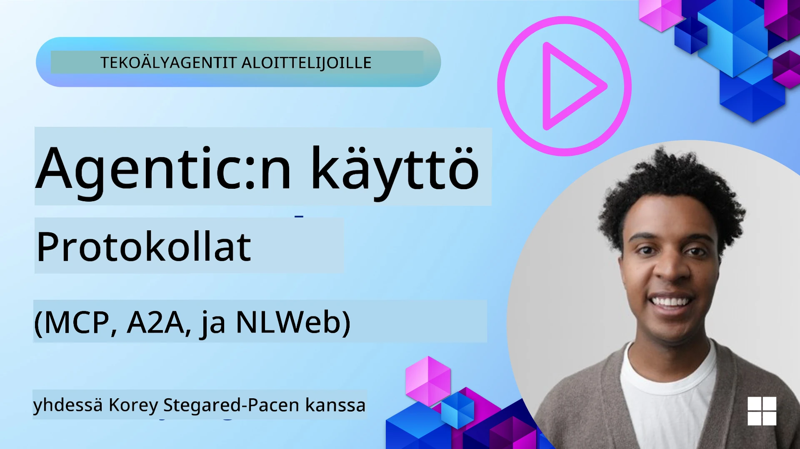
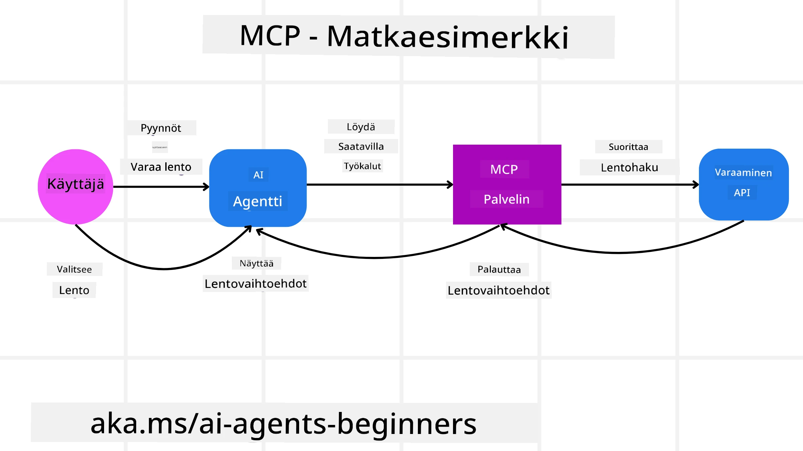
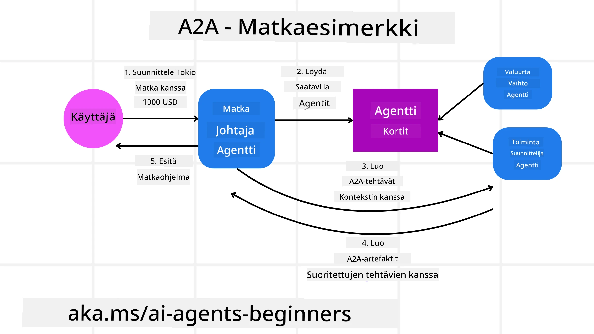
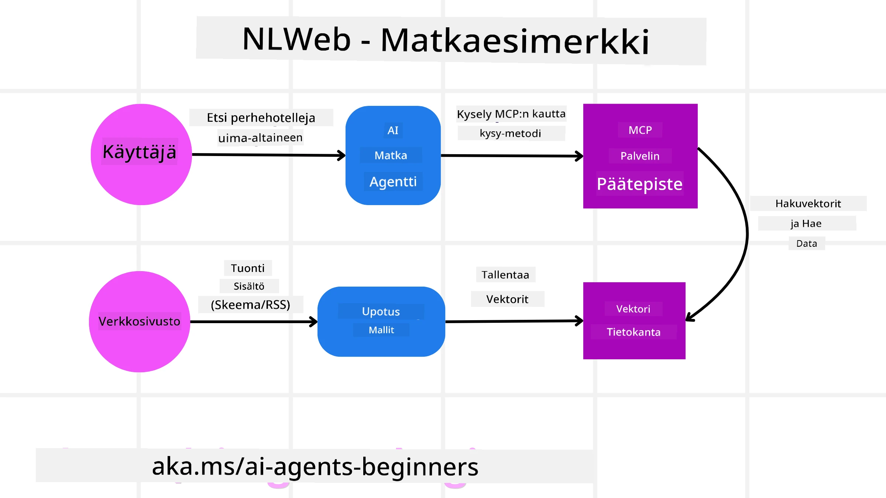

# Using Agentic Protocols (MCP, A2A and NLWeb)

> _(Klikkaa yllä olevaa kuvaa katsoaksesi tämän oppitunnin videon)_

Kun tekoälyagenttien käyttö kasvaa, kasvaa myös tarve protokollille, jotka takaavat standardoinnin, turvallisuuden ja tukevat avointa innovaatiota. Tässä oppitunnissa käsittelemme kolmea protokollaa, jotka pyrkivät vastaamaan tähän tarpeeseen - Model Context Protocol (MCP), Agent to Agent (A2A) ja Natural Language Web (NLWeb).

## Introduction

Tässä oppitunnissa käsittelemme:

• Kuinka **MCP** antaa tekoälyagenteille pääsyn ulkoisiin työkaluihin ja tietoihin käyttäjän tehtävien suorittamiseksi.

• Kuinka **A2A** mahdollistaa kommunikaation ja yhteistyön eri tekoälyagenttien välillä.

• Kuinka **NLWeb** tuo luonnollisen kielen käyttöliittymät mille tahansa verkkosivulle, mahdollistaen tekoälyagenttien löytää ja olla vuorovaikutuksessa sisällön kanssa.

## Learning Goals

• **Tunnistaa** MCP:n, A2A:n ja NLWebin ydintarkoitus ja hyödyt tekoälyagenttien kontekstissa.

• **Selittää** miten kukin protokolla helpottaa viestintää ja vuorovaikutusta LLM:ien, työkalujen ja muiden agenttien välillä.

• **Tunnistaa** kunkin protokollan erilliset roolit monimutkaisten agenttisten järjestelmien rakentamisessa.

## Model Context Protocol

Model Context -protokolla (MCP) on avoin standardi, joka tarjoaa yhdenmukaisen tavan sovelluksille tarjota kontekstia ja työkaluja LLM:ille. Tämä mahdollistaa "universaalin sovittimen" eri tietolähteille ja työkaluilla, joihin tekoälyagentit voivat yhdistää yhtenäisellä tavalla.

Katsotaan MCP:n komponentteja, etuja verrattuna suoraan API-käyttöön ja esimerkkiä siitä, miten tekoälyagentit saattavat käyttää MCP-palvelinta.

### MCP Core Components

MCP toimii **asiakas-palvelinarkkitehtuurilla** ja ydinkomponentit ovat:

• **Isännät** ovat LLM-sovelluksia (esimerkiksi VSCode-tyyppinen koodieditori), jotka aloittavat yhteydet MCP-palvelimeen.

• **Clientit** ovat isäntäsovelluksen komponentteja, jotka ylläpitävät yksittäisiä yhteyksiä palvelimiin.

• **Palvelimet** ovat kevyitä ohjelmia, jotka tarjoavat tiettyjä kyvykkyyksiä.

Protokollaan sisältyy kolme ydinalkeista, jotka ovat MCP-palvelimen kyvykkyyksiä:

• **Työkalut**: Nämä ovat erillisiä toimintoja tai funktioita, joita tekoälyagentti voi kutsua suorittaakseen toiminnon. Esimerkiksi sääpalvelu saattaisi tarjota "hae sää" -työkalun tai verkkokaupan palvelin saattaisi tarjota "osta tuote" -työkalun. MCP-palvelimet ilmoittavat kunkin työkalun nimen, kuvauksen ja input/output-skeeman kyvykkyysluettelossaan.

• **Resurssit**: Nämä ovat vain-luku -tietokohteita tai dokumentteja, joita MCP-palvelin voi tarjota, ja clientit voivat hakea niitä tarpeen mukaan. Esimerkkejä ovat tiedostojen sisältö, tietokantarekisterit tai lokitiedostot. Resurssit voivat olla tekstiä (kuten koodi tai JSON) tai binääriä (kuten kuvia tai PDF-tiedostoja).

• **Promptit**: Nämä ovat ennalta määriteltyjä malleja, jotka tarjoavat ehdotettuja kehotteita ja mahdollistavat monimutkaisempia työnkulkuja.

### Benefits of MCP

MCP tarjoaa merkittäviä etuja tekoälyagenteille:

• **Dynaaminen työkalujen löytäminen**: Agentit voivat dynaamisesti vastaanottaa palvelimelta luettelon saatavilla olevista työkaluista sekä kuvauksen siitä, mitä ne tekevät. Tämä eroaa perinteisistä API:ista, jotka usein vaativat staattista koodausta integraatioille, jolloin minkä tahansa API-muutoksen yhteydessä koodi täytyy päivittää. MCP tarjoaa "integroi kerran" -lähestymistavan, mikä johtaa suurempaan sopeutumiskykyyn.

• **Yhteentoimivuus eri LLM:ien välillä**: MCP toimii eri LLM:ien kanssa, tarjoten joustavuutta vaihtaa ydintä malleja arvioidakseen parempaa suorituskykyä.

• **Standardoitu turvallisuus**: MCP sisältää standardoidun autentikointimenetelmän, parantaen skaalautuvuutta kun lisätään pääsyä lisäisiin MCP-palvelimiin. Tämä on yksinkertaisempaa kuin erilaisten avainten ja autentikointityyppien hallinta eri perinteisille API:ille.

### MCP Example

Kuvittele, että käyttäjä haluaa varata lennon käyttäen MCP:n voimalla toimivaa tekoälyavustajaa.

1. **Yhteys**: Tekoälyavustaja (MCP-client) yhdistää lentoyhtiön tarjoamaan MCP-palvelimeen.

2. **Työkalujen löytäminen**: Client kysyy lentoyhtiön MCP-palvelimelta: "Mitä työkaluja teillä on käytettävissä?" Palvelin vastaa työkaluilla kuten "etsi lentoja" ja "varaa lentoja".

3. **Työkalun kutsuminen**: Sitten kysyt tekoälyavustajalta: "Etsi lento Portlandista Honoluluun." Avustaja, käyttäen LLM:ään, tunnistaa, että sen täytyy kutsua "etsi lentoja" -työkalua ja välittää asiaankuuluvat parametrit (lähtöpaikka, määränpää) MCP-palvelimelle.

4. **Suoritus ja vastaus**: MCP-palvelin, toimiessaan kääreenä, tekee varsinaisen kutsun lentoyhtiön sisäiseen varaus-API:iin. Se vastaanottaa lentotiedot (esim. JSON-datan) ja lähettää ne takaisin tekoälyavustajalle.

5. **Jatkuva vuorovaikutus**: Tekoälyavustaja esittelee lentovaihtoehdot. Kun valitset lennon, avustaja saattaa kutsua saman MCP-palvelimen "varaa lento" -työkalua ja suorittaa varauksen.

## Agent-to-Agent Protocol (A2A)

Kun MCP keskittyy LLM:ien yhdistämiseen työkaluihin, **Agent-to-Agent (A2A) -protokolla** vie asiaa pidemmälle mahdollistamalla kommunikaation ja yhteistyön eri tekoälyagenttien välillä. A2A yhdistää tekoälyagentteja eri organisaatioiden, ympäristöjen ja teknologiapinnojen välillä suorittamaan yhteisiä tehtäviä.

Käymme läpi A2A:n komponentit ja edut sekä esimerkin siitä, miten sitä voitaisiin soveltaa matka-applikaatiossamme.

### A2A Core Components

A2A keskittyy mahdollistamaan agenttien välisen kommunikaation ja saada ne työskentelemään yhdessä käyttäjän alitehtävän suorittamiseksi. Kunkin protokollan komponentin rooli on seuraava:

#### Agent Card

Samankaltaisesti kuin MCP-palvelin jakaa luettelon työkaluista, Agenttikortti sisältää:
- Agentin nimen.
- Yleiskuvaus sen suorittamista tehtävistä.
- Luettelon erityisistä taidoista kuvauksineen, jotka auttavat muita agentteja (tai jopa ihmiskäyttäjiä) ymmärtämään, milloin ja miksi he haluaisivat kutsua kyseistä agenttia.
- Agentin nykyisen Endpoint URL:n.
- Agentin version ja kyvykkyydet, kuten striimaukseen vastaaminen ja push-ilmoitukset.

#### Agent Executor

Agentin suoritin vastaa käyttäjäkeskustelun kontekstin välittämisestä etäagentille; etäagentti tarvitsee tätä ymmärtääkseen suoritettavan tehtävän. A2A-palvelimessa agentti käyttää omaa Large Language Model -malliaan (LLM) saapuvien pyyntöjen jäsentämiseen ja tehtävien suorittamiseen omilla sisäisillä työkaluillaan.

#### Artifact

Kun etäagentti on suorittanut pyydetyn tehtävän, sen työn tulos luodaan artefaktina. Artefakti sisältää agentin työn tuloksen, kuvauksen siitä, mitä suoritettiin, ja tekstikontekstin, joka välitettiin protokollan kautta. Artefaktin lähettämisen jälkeen yhteys etäagenttiin suljetaan, kunnes sitä tarvitaan uudelleen.

#### Event Queue

Tätä komponenttia käytetään päivitysten käsittelyyn ja viestien välittämiseen. Se on erityisen tärkeä tuotantoympäristössä agenttisissa järjestelmissä, jotta estetään agenttien välisen yhteyden sulkeutuminen ennen tehtävän valmistumista, erityisesti kun tehtävän suorittaminen voi kestää pidempään.

### Benefits of A2A

• **Tehostettu yhteistyö**: Se mahdollistaa eri toimittajien ja alustojen agenttien vuorovaikutuksen, kontekstin jakamisen ja yhteisen työskentelyn, helpottaen saumattomia automaatioita perinteisesti eriytettyjen järjestelmien välillä.

• **Mallin valinnan joustavuus**: Jokainen A2A-agentti voi päättää, mitä LLM:ää se käyttää palvellakseen pyyntöjään, mahdollistaen optimoituja tai hienosäädettyjä malleja per agentti, toisin kuin yksittäinen LLM-yhteys joissain MCP-skenaarioissa.

• **Sisäänrakennettu autentikointi**: Autentikointi on integroituna suoraan A2A-protokollaan, tarjoten vahvan turvallisuuskehyksen agenttien välisille vuorovaikutuksille.

### A2A Example

Laajennetaan matkavarausesimerkkiämme, mutta tällä kertaa käyttäen A2A:ta.

1. **Käyttäjäpyyntö monen agentin järjestelmälle**: Käyttäjä kommunikoi "Matka-agentin" A2A-client/agentin kanssa, esimerkiksi sanomalla: "Varaa koko matka Honoluluun ensi viikolle, mukaan lukien lennot, hotelli ja vuokra-auto."

2. **Matka-agentin orkestrointi**: Matka-agentti vastaanottaa tämän monimutkaisen pyynnön. Se käyttää LLM:ään päättelyyn tehtävästä ja määrittää, että sen täytyy olla vuorovaikutuksessa muiden erikoistuneiden agenttien kanssa.

3. **Agenttien välinen viestintä**: Matka-agentti sitten käyttää A2A-protokollaa yhdistääkseen alasvirran agentteihin, kuten "Lentoyhtiö-agenttiin", "Hotelli-agenttiin" ja "Autovuokra-agenttiin", jotka on luotu eri yritysten toimesta.

4. **Delegoitu tehtävän suoritus**: Matka-agentti lähettää näille erikoistuneille agenteille tarkat tehtävät (esim. "Etsi lennot Honoluluun", "Varaa hotelli", "Vuokraa auto"). Kukin näistä erikoistuneista agenteista, ajaen omia LLM:ejään ja käyttäen omia työkalujaan (jotka voivat itse olla MCP-palvelimia), suorittaa oman osansa varauksesta.

5. **Konsolidoitu vastaus**: Kun kaikki alasvirran agentit ovat suorittaneet tehtävänsä, Matka-agentti kokoaa tulokset (lennotiedot, hotellivahvistuksen, autovuokrauksen varauksen) ja lähettää käyttäjälle kattavan, chat-tyyppisen vastauksen.

## Natural Language Web (NLWeb)

Verkkosivustot ovat pitkään olleet ensisijainen tapa, jolla käyttäjät pääsevät käsiksi tietoon ja dataan internetissä.

Katsotaan NLWebin eri komponentteja, NLWebin etuja ja esimerkki siitä, miten NLWeb toimii matkailusovelluksessamme.

### Components of NLWeb

- **NLWeb-sovellus (ydinpalvelukoodi)**: Järjestelmä, joka käsittelee luonnollisen kielen kysymyksiä. Se yhdistää alustan eri osat luodakseen vastauksia. Voit ajatella sitä verkkosivuston luonnollisen kielen ominaisuuksien moottorina.

- **NLWeb-protokolla**: Tämä on perusjoukko sääntöjä luonnollisen kielen vuorovaikutukselle verkkosivun kanssa. Se palauttaa vastaukset JSON-muodossa (usein käyttäen Schema.org:ia). Sen tarkoituksena on luoda yksinkertainen perusta "AI-webille", samalla tavalla kuin HTML mahdollisti dokumenttien jakamisen verkossa.

- **MCP-palvelin (Model Context Protocol -päätepiste)**: Jokainen NLWeb-asennus toimii myös MCP-palvelimena. Tämä tarkoittaa, että se voi jakaa työkaluja (kuten "ask"-metodin) ja dataa muiden tekoälyjärjestelmien kanssa. Käytännössä tämä tekee verkkosivuston sisällöstä ja toiminnoista käytettävissä olevia tekoälyagenteille, jolloin sivusto voi tulla osaksi laajempaa "agentti-ekosysteemiä".

- **Upotusmallit (Embedding Models)**: Näitä malleja käytetään muuntamaan verkkosivuston sisältö numeerisiksi esityksiksi, joita kutsutaan vektoreiksi (embeddings). Nämä vektorit vangitsevat merkityksen siten, että tietokoneet voivat vertailla ja hakea niitä. Ne tallennetaan erikoistettuun tietokantaan, ja käyttäjät voivat valita, mitä upotusmallia he haluavat käyttää.

- **Vektoritietokanta (hakumekanismi)**: Tämä tietokanta tallentaa verkkosivuston sisällön upotukset. Kun joku esittää kysymyksen, NLWeb tarkistaa vektoritietokannan löytääkseen nopeasti relevantit tiedot. Se antaa nopean luettelon mahdollisista vastauksista, järjestettynä samankaltaisuuden mukaan. NLWeb toimii erilaisten vektoritallennusjärjestelmien kanssa, kuten Qdrant, Snowflake, Milvus, Azure AI Search ja Elasticsearch.

### NLWeb by Example

Otetaan taas esimerkkinä matkavaraussivustomme, mutta tällä kertaa se on NLWebin voimin.

1. **Datan syöttö**: Matkasivuston olemassa olevat tuotekatalogit (esim. lentoluettelot, hotellikuvaukset, matkapakettien tiedot) muotoillaan käyttämällä Schema.org:ia tai ladataan RSS-syötteiden kautta. NLWebin työkalut käsittelevät tämän jäsennellyn datan, luovat upotuksia ja tallentavat ne paikalliseen tai etätietokantaan.

2. **Luonnollisen kielen kysely (ihminen)**: Käyttäjä vierailee sivustolla ja sen sijaan, että selaa valikoita, kirjoittaa chat-käyttöliittymään: "Etsi minulle perheystävällinen hotelli Honolulusta, jossa on uima-allas ensi viikolle".

3. **NLWebin käsittely**: NLWeb-sovellus vastaanottaa tämän kyselyn. Se lähettää kyselyn LLM:lle ymmärtämistä varten ja samanaikaisesti hakee vektoritietokannastaan relevantteja hotellilistauksia.

4. **Tarkat tulokset**: LLM auttaa tulkitsemaan tietokannan hakutuloksia, tunnistamaan parhaat osumat kriteereiden "perheystävällinen", "uima-allas" ja "Honolulu" perusteella, ja muotoilee luonnollisen kielen vastauksen. Olennaista on, että vastaus viittaa sivuston katalogin todellisiin hotelleihin, välttäen keksittyä tietoa.

5. **Tekoälyagentin vuorovaikutus**: Koska NLWeb toimii MCP-palvelimena, ulkoinen tekoälymatka-agentti voisi myös yhdistää tämän verkkosivun NLWeb-instaanssiin. Tekoälyagentti voisi sitten käyttää `ask("Onko Honolulun alueella hotellin suosittelemaa vegaanystävällistä ravintolaa?")` -metodia kysyäkseen sivustolta suoraan. NLWeb-instaanssi käsittelisi tämän, hyödyntäen ravintolatietokantaansa (jos ladattu), ja palauttaisi jäsennellyn JSON-vastauksen.

### Got More Questions about MCP/A2A/NLWeb?

Liity [Microsoft Foundry Discord](https://aka.ms/ai-agents/discord) -palvelimeen tapaamaan muita oppijoita, osallistumaan office hour -tilaisuuksiin ja saamaan vastauksia AI-agentteihin liittyviin kysymyksiisi.

## Resources

- [MCP for Beginners](https://aka.ms/mcp-for-beginners)  
- [MCP Documentation](https://learn.microsoft.com/python/api/overview/azure/ai-projects-readme)
- [NLWeb Repo](https://github.com/nlweb-ai/NLWeb)
- [Microsoft Agent Framework](https://aka.ms/ai-agents-beginners/agent-framewrok)

---

<!-- CO-OP TRANSLATOR DISCLAIMER START -->
Vastuuvapauslauseke:
Tämä asiakirja on käännetty tekoälykäännöspalvelulla [Co-op Translator](https://github.com/Azure/co-op-translator). Vaikka pyrimme tarkkuuteen, huomioithan, että automaattiset käännökset saattavat sisältää virheitä tai epätarkkuuksia. Alkuperäistä asiakirjaa sen alkuperäisellä kielellä tulee pitää määräävänä lähteenä. Tärkeiden tietojen osalta suositellaan ammattimaista ihmiskäännöstä. Emme ole vastuussa tämän käännöksen käytöstä aiheutuvista väärinymmärryksistä tai virhetulkinnöistä.
<!-- CO-OP TRANSLATOR DISCLAIMER END -->