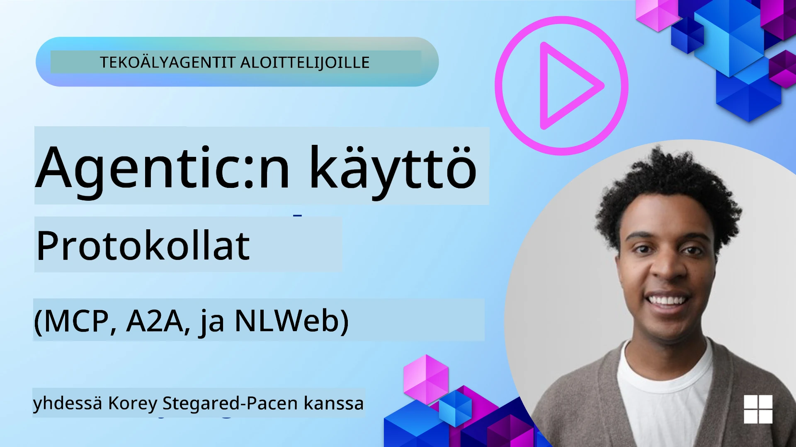
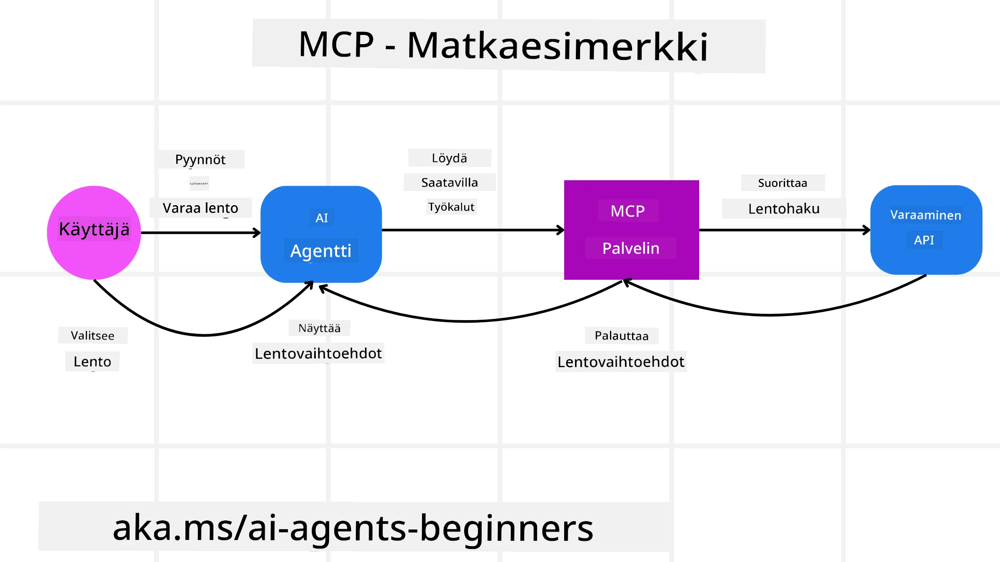
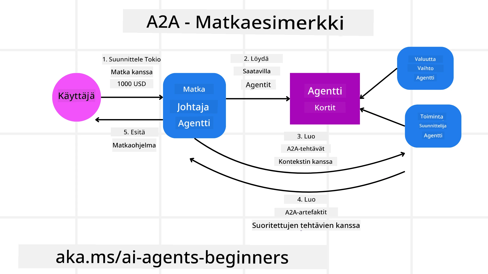
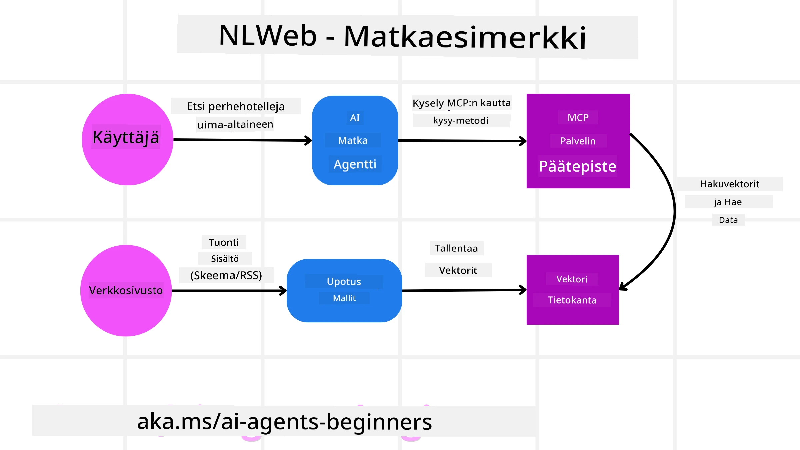

# Agenttiprotokollien käyttö (MCP, A2A ja NLWeb)

> _(Klikkaa yllä olevaa kuvaa nähdäksesi tämän oppitunnin videon)_

Kun tekoälyagenttien käyttö kasvaa, kasvaa myös tarve protokollille, jotka varmistavat standardoinnin, turvallisuuden ja tukevat avointa innovaatiota. Tässä oppitunnissa käsittelemme kolmea protokollaa, jotka pyrkivät täyttämään tämän tarpeen – Model Context Protocol (MCP), Agent to Agent (A2A) ja Natural Language Web (NLWeb).

## Johdanto

Tässä oppitunnissa käsittelemme:

• Kuinka **MCP** mahdollistaa tekoälyagenttien pääsyn ulkoisiin työkaluihin ja tietoihin käyttäjän tehtävien suorittamiseksi.

• Kuinka **A2A** mahdollistaa viestinnän ja yhteistyön eri tekoälyagenttien välillä.

• Kuinka **NLWeb** tuo luonnollisen kielen käyttöliittymät mille tahansa verkkosivustolle mahdollistaen tekoälyagenttien löytää ja olla vuorovaikutuksessa sisällön kanssa.

## Oppimistavoitteet

• **Tunnistaa** MCP:n, A2A:n ja NLWebin keskeiset tarkoitukset ja hyödyt tekoälyagenttien kontekstissa.

• **Selittää**, kuinka kukin protokolla edistää viestintää ja vuorovaikutusta LLM:ien, työkalujen ja muiden agenttien välillä.

• **Tunnistaa** eri protokollien erilliset roolit monimutkaisten agenttipohjaisten järjestelmien rakentamisessa.

## Model Context Protocol

**Model Context Protocol (MCP)** on avoin standardi, joka tarjoaa standardoidun tavan sovelluksille tarjota kontekstia ja työkaluja LLM:ille. Tämä mahdollistaa "universaalin sovittimen" eri tietolähteisiin ja työkaluihin, joihin tekoälyagentit voivat yhdistyä johdonmukaisella tavalla.

Tarkastellaan MCP:n komponentteja, etuja verrattuna suoraan API:en käyttöön sekä esimerkki siitä, kuinka tekoälyagentit voivat käyttää MCP-palvelinta.

### MCP:n pääkomponentit

MCP toimii **asiakas-palvelin-arkkitehtuurilla** ja pääkomponentit ovat:

• **Hostit** ovat LLM-sovelluksia (esimerkiksi koodieditori kuten VSCode), jotka aloittavat yhteydet MCP-palvelimeen.

• **Asiakkaat** ovat isäntäsovelluksen komponentteja, jotka ylläpitävät yksi-yhteen-yhteyksiä palvelinten kanssa.

• **Palvelimet** ovat kevyt ohjelmia, jotka tarjoavat tiettyjä toiminnallisuuksia.

Protokollaan sisältyy kolme perustoimintoa, jotka ovat MCP-palvelimen ominaisuuksia:

• **Työkalut**: Nämä ovat itsenäisiä toimintoja tai funktioita, joita tekoälyagentti voi kutsua suorittaakseen toiminnon. Esimerkiksi sääpalvelu saattaa tarjota "hae sää" -työkalun tai verkkokaupan palvelin voi tarjota "osta tuote" -työkalun. MCP-palvelimet ilmoittavat kunkin työkalun nimen, kuvauksen ja syöte-/tulosteskeeman ominaisuuksien luettelossa.

• **Resurssit**: Nämä ovat vain luku -tietoja tai dokumentteja, joita MCP-palvelin voi tarjota ja asiakkaat voivat hakea niitä tarpeen mukaan. Esimerkkejä ovat tiedostojen sisältö, tietokantarekisterit tai lokitiedostot. Resurssit voivat olla tekstiä (kuten koodia tai JSONia) tai binäärimuotoisia (kuten kuvia tai PDF-tiedostoja).

• **Kehottimet**: Nämä ovat ennalta määriteltyjä malleja, jotka tarjoavat ehdotettuja kehotteita monimutkaisempien työnkulkujen mahdollistamiseksi.

### MCP:n edut

MCP tarjoaa merkittäviä etuja tekoälyagenteille:

• **Dynaaminen työkalujen löytäminen**: Agentit voivat dynaamisesti vastaanottaa listan palvelimen käytettävissä olevista työkaluista kuvauksineen. Tämä eroaa perinteisistä API:sta, joissa integroinnit vaativat usein staattista koodausta, ja API-muutokset edellyttävät koodipäivityksiä. MCP tarjoaa "integroi kerran" -lähestymistavan, joka johtaa parempaan muunneltavuuteen.

• **Yhteentoimivuus eri LLM:ien välillä**: MCP toimii eri LLM:ien kanssa, tarjoten joustavuutta vaihtaa ydinmalleja paremman suorituskyvyn saavuttamiseksi.

• **Standardoitu turvallisuus**: MCP sisältää standardoidun todennusmenetelmän, mikä parantaa laajennettavuutta, kun lisätään pääsy useisiin MCP-palvelimiin. Tämä on yksinkertaisempaa kuin hallita erilaisia avaimia ja todennustyyppejä eri perinteisissä API:eissa.

### MCP-esimerkki

Kuvitellaan, että käyttäjä haluaa varata lennon tekoälyavustajaa käyttäen, joka hyödyntää MCP:tä.

1. **Yhteys**: Tekoälyavustaja (MCP-asiakas) yhdistyy MCP-palvelimeen, jonka on tarjonnut lentoyhtiö.

2. **Työkalujen löytäminen**: Asiakas kysyy lentoyhtiön MCP-palvelimelta: "Mitä työkaluja sinulla on käytettävissä?" Palvelin vastaa työkaluilla kuten "etsi lentoja" ja "varaa lentoja".

3. **Työkalun kutsuminen**: Käyttäjä pyytää tekoälyavustajaa: "Etsi lento Portlandista Honoluluun." Avustaja, käyttäen LLM:ää, tunnistaa, että sen pitää kutsua "etsi lentoja" -työkalu ja välittää asiaankuuluvat parametrit (lähtöpaikka, määränpää) MCP-palvelimelle.

4. **Suoritus ja vastaus**: MCP-palvelin, toimiessaan kääreenä, tekee varsinaisen kutsun lentoyhtiön sisäiseen varaus-API:in. Se vastaanottaa lentotiedot (esim. JSON-dataa) ja lähettää ne takaisin tekoälyavustajalle.

5. **Jatkuva vuorovaikutus**: Tekoälyavustaja esittää lentovaihtoehdot. Kun käyttäjä valitsee lennon, avustaja voi kutsua "varaa lento" -työkalua samalla MCP-palvelimella viimeistellen varauksen.

## Agentti-agenttiprotokolla (A2A)

Kun MCP keskittyy yhdistämään LLM:ät työkaluihin, **Agentti-agenttiprotokolla (A2A)** vie asian pidemmälle mahdollistamalla viestinnän ja yhteistyön eri tekoälyagenttien välillä. A2A yhdistää tekoälyagentteja eri organisaatioista, ympäristöistä ja teknologiaympäristöistä suorittamaan yhteisen tehtävän.

Tarkastelemme A2A:n komponentteja ja etuja sekä annamme esimerkin sen sovelluksesta matkustussovelluksessamme.

### A2A:n pääkomponentit

A2A keskittyy mahdollistamaan viestinnän agenttien välillä ja saamaan heidät työskentelemään yhdessä käyttäjän alitehtävän suorittamiseksi. Jokainen protokollan komponentti edistää tätä:

#### Agenttikortti

Samalla tavalla kuin MCP-palvelin jakaa luettelon työkaluista, agenttikortti sisältää:
- Agentin nimen.
- **yleiskuvan tehtävistä**, joita se suorittaa.
- **listan erityistaidoista** kuvauksineen, jotta muut agentit (tai jopa ihmiset) ymmärtäisivät milloin ja miksi he haluaisivat kutsua kyseistä agenttia.
- Agentin **nykyisen loppupisteen URL-osoitteen**.
- Agentin **version** ja **ominaisuudet**, kuten suoratoistovastaukset ja push-ilmoitukset.

#### Agenttikäyttäjä

Agenttikäyttäjä vastaa **käyttäjän keskustelukontekstin välittämisestä etäagentille**, jota etäagentti tarvitsee ymmärtääkseen suoritettavan tehtävän. A2A-palvelimessa agentti käyttää omaa suurta kielimalliaan (LLM) käsitelläkseen saapuvia pyyntöjä ja suorittaakseen tehtäviä käyttäen omia sisäisiä työkalujaan.

#### Artefakti

Kun etäagentti on suorittanut pyydetyn tehtävän, sen työtuote luodaan artefaktina. Artefakti **sisältää agentin työn tuloksen**, **kuvauksen suoritetusta työstä** sekä **tekstikontekstin**, joka välitetään protokollan kautta. Artefaktin lähettämisen jälkeen yhteys etäagenttiin suljetaan, kunnes sitä tarvitaan uudelleen.

#### Tapahtumajono

Tätä komponenttia käytetään **päivitysten hallintaan ja viestien välittämiseen**. Se on erityisen tärkeä tuotantoympäristössä agenttipohjaisissa järjestelmissä estämään agenttien välisen yhteyden sulkeutuminen ennen tehtävän valmistumista, erityisesti kun tehtävän suoritusajat voivat olla pitkiä.

### A2A:n edut

• **Parannettu yhteistyö**: Mahdollistaa eri toimittajien ja alustojen agenteille vuorovaikutuksen, kontekstin jakamisen ja yhteistyön, tarjoten saumattoman automaation perinteisesti erillisten järjestelmien välillä.

• **Mallin valinnan joustavuus**: Kukin A2A-agentti voi päättää, mitä LLM:ää se käyttää palveluissaan, mahdollistaen optimoidut tai hienosäädetyt mallit per agentti, toisin kuin joissakin MCP-skeneissa, joissa on yksi LLM-yhteys.

• **Sisäänrakennettu todennus**: Todennus on integroitu suoraan A2A-protokollaan, tarjoten vahvan turvallisuuskehyksen agenttien vuorovaikutuksille.

### A2A-esimerkki

Laajennetaan matkavaraustilannettamme käyttämällä nyt A2A:ta.

1. **Käyttäjän pyyntö monien agenttien verkolle**: Käyttäjä kommunikoi "Matkatoimisto" -nimisen A2A-asiakas/agentin kanssa, esimerkiksi sanomalla: "Varaa koko matka Honoluluun ensi viikoksi, sisältäen lennot, hotellin ja vuokra-auton".

2. **Matkatoimiston orkestrointi**: Matkatoimisto vastaanottaa tämän monimutkaisen pyynnön. Se käyttää LLM:ään pohtiakseen tehtävää ja päättää, että sen täytyy olla vuorovaikutuksessa muiden erikoistuneiden agenttien kanssa.

3. **Agenttien välinen viestintä**: Matkatoimisto käyttää A2A-protokollaa yhdistääkseen alavirran agentteihin, kuten "Lentoyhtiöagenttiin", "Hotelliagenttiin" ja "Vuokra-autoagenttiin", jotka ovat eri yritysten luomia.

4. **Tehtävien delegointi**: Matkatoimisto lähettää spesifisiä tehtäviä näille erikoistuneille agenteille (esim. "Etsi lennot Honoluluun", "Varaa hotelli", "Vuokraa auto"). Kukin näistä erikoistuneista agenteista, jotka käyttävät omia LLM:äänsä ja työkalujaan (jotka voivat olla MCP-palvelimia), suorittaa oman osansa varauksesta.

5. **Yhdistetty vastaus**: Kun kaikki alavirran agentit ovat suorittaneet tehtävänsä, Matkatoimisto kokoaa tulokset (lentotiedot, hotellivahvistukset, vuokra-auton varaus) ja lähettää kattavan keskustelutyyppisen vastauksen käyttäjälle.

## Natural Language Web (NLWeb)

Verkkosivustot ovat pitkään olleet ensisijainen tapa käyttäjille päästä käsiksi informaation ja datan lähteisiin internetissä.

Tarkastellaan NLWebin eri komponentteja, sen hyötyjä sekä esimerkkiä siitä, miten NLWeb toimii matkailusovelluksessamme.

### NLWebin komponentit

- **NLWeb-sovellus (ydinpaluukoodipalvelu)**: Järjestelmä, joka käsittelee luonnollisen kielen kysymyksiä. Se yhdistää alustan eri osat luodakseen vastauksia. Voit ajatella sitä verkkosivuston luonnollisen kielen ominaisuuksia ohjaavana moottorina.

- **NLWeb-protokolla**: Tämä on **perussääntöjä sisältävä kokonaisuus luonnollisen kielen vuorovaikutukseen verkkosivuston kanssa**. Se lähettää vastaukset JSON-muodossa (usein käyttämällä Schema.orgia). Tarkoituksena on luoda yksinkertainen perusta "tekoälyverkolle" samalla tavalla kuin HTML mahdollisti dokumenttien jakamisen verkossa.

- **MCP-palvelin (Model Context Protocol -loppupiste)**: Jokainen NLWeb-asennus toimii myös **MCP-palvelimena**, mikä tarkoittaa, että se voi **jakaa työkaluja (kuten "ask"-menetelmän) ja dataa** muiden tekoälyjärjestelmien kanssa. Käytännössä tämä tekee verkkosivun sisällöstä ja kyvykkyyksistä tekoälyagenttien käyttökelpoisia, mahdollistaen sivuston liittymisen laajempaan "agenttiekosysteemiin".

- **Upotemallit**: Näitä malleja käytetään **muuntamaan verkkosivuston sisältö numeerisiksi esityksiksi, joita kutsutaan vektoreiksi (upotuksiksi)**. Nämä vektorit tavoittavat merkityksen tavalla, jonka tietokoneet voivat vertailla ja hakea. Ne tallennetaan erikoistuneeseen tietokantaan, ja käyttäjät voivat valita, mitä upotemallia haluavat käyttää.

- **Vektoritietokanta (hakumekanismi)**: Tämä tietokanta **säilyttää verkkosivun sisällön upotukset**. Kun joku esittää kysymyksen, NLWeb tarkistaa vektoritietokannan löytääkseen nopeasti sopivimmat tiedot. Se antaa nopean listan mahdollisista vastauksista samankaltaisuuden mukaan järjestettynä. NLWeb toimii eri vektorivarastojärjestelmien kuten Qdrant, Snowflake, Milvus, Azure AI Search ja Elasticsearch kanssa.

### NLWeb esimerkin avulla

Otetaan jälleen esimerkkimme matkavaraussivustosta, mutta tällä kertaa NLWebin voimin.

1. **Datan syöttö**: Matkailusivuston olemassa olevat tuotekatalogit (esim. lentolistaukset, hotellikuvaukset, matkakokonaisuudet) on muotoiltu käyttämällä Schema.orgia tai ne on ladattu RSS-syötteiden kautta. NLWebin työkalut syöttävät tämän rakenteellisen datan, luovat upotuksia ja tallentavat ne paikalliseen tai etäiseen vektoritietokantaan.

2. **Luonnollisen kielen haku (ihminen)**: Käyttäjä vierailee sivustolla ja kirjoittaa valikkovaihtoehtojen selaamisen sijaan keskustelukäyttöliittymään: "Etsi minulle perheystävällinen hotelli Honolulusta, jossa on uima-allas ensi viikolle".

3. **NLWebin käsittely**: NLWeb-sovellus vastaanottaa tämän haun. Se lähettää haun LLM:lle ymmärtämistä varten ja samalla etsii vektoritietokannastaan osuvia hotellilistaauksia.

4. **Tarkat tulokset**: LLM auttaa tulkitsemaan tietokannan hakutulokset, tunnistamaan parhaat osumat "perheystävällinen", "uima-allas" ja "Honolulu" -kriteerien perusteella ja muotoilee luonnollisen kielen vastauksen. Vastaus viittaa todellisiin hotelleihin sivuston katalogista, välttäen keksittyä tietoa.

5. **Tekoälyagentin vuorovaikutus**: Koska NLWeb toimii MCP-palvelimena, ulkoinen tekoälymatka-agentti voi myös yhdistää tämän verkkosivun NLWeb-instanssiin. Tekoälyagentti voi sitten käyttää `ask`-MCP-menetelmää kysyäkseen sivustolta suoraan: `ask("Onko Honolulu-alueella hotelli suosittelemia vegaaniystävällisiä ravintoloita?")`. NLWeb instanssi käsittelee tämän, hyödyntäen ravintolatietokantaansa (jos latautunut) ja palauttaa rakenteellisen JSON-vastauksen.

### Onko sinulla lisää kysymyksiä liittyen MCP/A2A/NLWeb?

Liity mukaan [Microsoft Foundry Discordiin](https://discord.com/invite/ATgtXmAS5D) tavataaksesi muita oppijoita, osallistua office-tunteihin ja saada vastauksia tekoälyagenttikysymyksiisi.

## Resurssit

- [MCP aloittelijoille](https://aka.ms/mcp-for-beginners)  
- [MCP dokumentaatio](https://learn.microsoft.com/python/api/overview/azure/ai-projects-readme)
- [NLWeb Repo](https://github.com/nlweb-ai/NLWeb)
- [Microsoft Agent Framework](https://aka.ms/ai-agents-beginners/agent-framework)

---

<!-- CO-OP TRANSLATOR DISCLAIMER START -->
**Vastuuvapauslauseke**:
Tämä asiakirja on käännetty käyttämällä tekoälypohjaista käännöspalvelua [Co-op Translator](https://github.com/Azure/co-op-translator). Vaikka pyrimme tarkkuuteen, otathan huomioon, että automaattiset käännökset saattavat sisältää virheitä tai epätarkkuuksia. Alkuperäinen asiakirja sen alkuperäiskielellä on virallinen lähde. Tärkeissä asioissa suositellaan ammattimaista ihmiskäännöstä. Emme ole vastuussa tämän käännöksen käytöstä aiheutuvista väärinymmärryksistä tai tulkinnoista.
<!-- CO-OP TRANSLATOR DISCLAIMER END -->