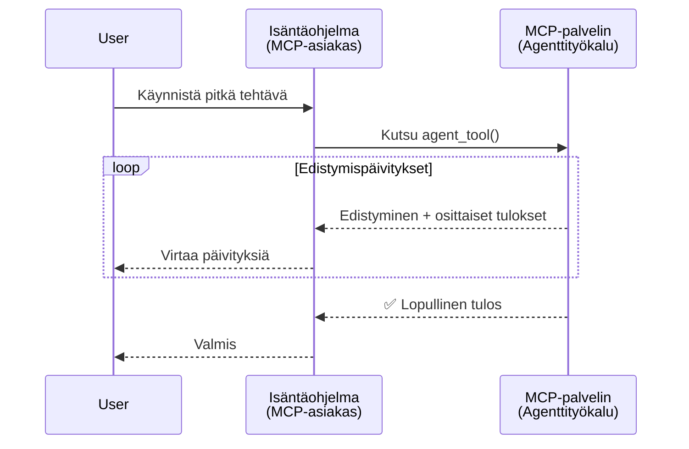
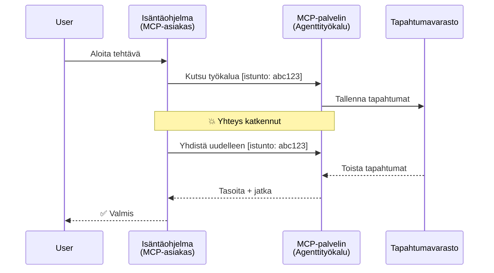
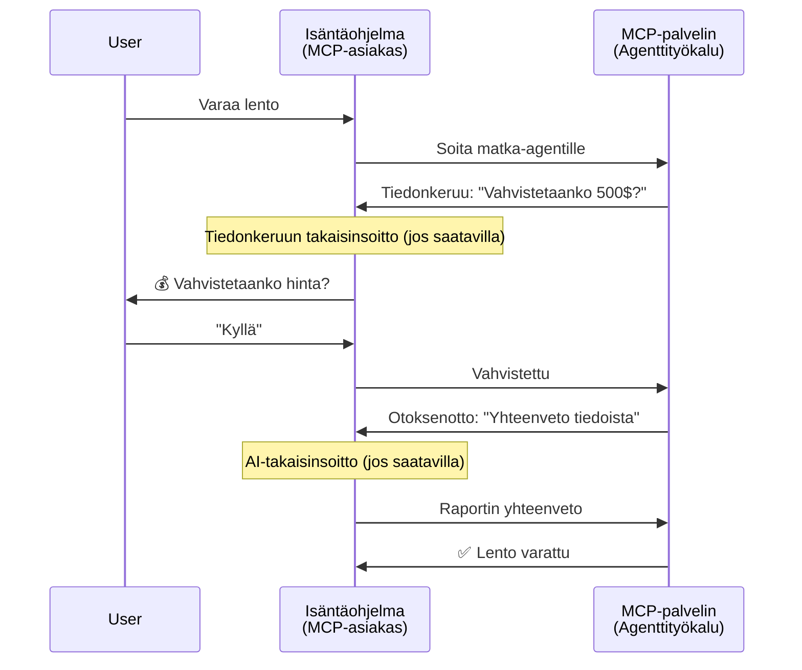
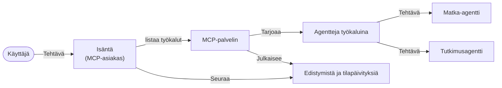

# Agenttien Välisen Viestintäjärjestelmän Rakentaminen MCP:llä

> Tiivistelmä - Voiko Agent2Agent -viestintä rakentaa MCP:lle? Kyllä!

MCP on kehittynyt merkittävästi alkuperäisestä tavoitteestaan "tarjota kontekstia LLM:ille". Viimeaikaisten parannusten, kuten [jatkettavat virrat](https://modelcontextprotocol.io/docs/concepts/transports#resumability-and-redelivery), [elicitointi](https://modelcontextprotocol.io/specification/2025-06-18/client/elicitation), [näytteenotto](https://modelcontextprotocol.io/specification/2025-06-18/client/sampling) sekä ilmoitukset ([edistyminen](https://modelcontextprotocol.io/specification/2025-06-18/basic/utilities/progress) ja [resurssit](https://modelcontextprotocol.io/specification/2025-06-18/schema#resourceupdatednotification)), MCP tarjoaa nyt vankan pohjan monimutkaisten agenttien välisen viestinnän järjestelmien rakentamiseen.

## Agentti/Työkalu-harhakäsitys

Kun yhä useammat kehittäjät tutkivat työkaluja, joilla on agenttimaista käyttäytymistä (toimii pitkään, saatetaan tarvita lisäsyötettä suorituksen aikana jne.), yleinen harhakäsitys on, että MCP ei sovi siihen, koska alkuperäiset työkaluesimerkit keskittyivät yksinkertaisiin pyyntö-vastaus -kuvioihin.

Tämä käsitys on vanhentunut. MCP-spesifikaatiota on parannettu huomattavasti viime kuukausina ominaisuuksilla, jotka sulkevat aukon pitkään jatkuvan agenttikäyttäytymisen rakentamisessa:

- **Virtaus ja osittaiset tulokset**: Reaaliaikaiset edistymisilmoitukset suorituksen aikana
- **Jatkettavuus**: Asiakkaat voivat yhdistää uudelleen ja jatkaa katkeamisen jälkeen
- **Kestävyys**: Tulokset säilyvät palvelimen uudelleenkäynnistyksen yli (esim. resurssilinkkien kautta)
- **Monivuorovaikutteisuus**: Vuorovaikutteinen syöte suorituksen aikana elicitoinnin ja näytteenoton avulla

Näitä ominaisuuksia voidaan yhdistellä monimutkaisten agenttien ja usean agentin sovellusten mahdollistamiseksi, kaikki MCP-protokollan pohjalta.

Viitteenä käytämme agentista nimitystä "työkalu", joka on saatavilla MCP-palvelimella. Tämä tarkoittaa, että on olemassa isäntäohjelma, joka toteuttaa MCP-asiakkaan, joka avaa istunnon MCP-palvelimen kanssa ja voi kutsua agenttia.

## Mikä tekee MCP-työkalusta "agenttimaisen"?

Ennen toteutukseen ryhtymistä määritellään, mitä infrastruktuurin ominaisuuksia tarvitaan pitkään jatkuvien agenttien tukemiseen.

> Määrittelemme agentin entiteetiksi, joka voi toimia itsenäisesti pitkiä aikoja, kyeten käsittelemään monimutkaisia tehtäviä, jotka voivat vaatia useita vuorointeja tai säätöjä reaaliaikaisen palautteen perusteella.

### 1. Virtaus ja osittaiset tulokset

Perinteiset pyyntö-vastaus -kuviot eivät toimi pitkissä tehtävissä. Agenttien pitää tarjota:

- Reaaliaikaiset edistymisilmoitukset
- Välitulokset

**MCP-tuki**: Resurssipäivitysilmoitukset mahdollistavat osittaisten tulosten virtaamisen, vaikka tämä vaatii huolellista suunnittelua, jotta vältetään ristiriidat JSON-RPC:n 1:1 pyyntö/vastausmallin kanssa.

| Ominaisuus                | Käyttötapaus                                                                                                                                                                     | MCP-tuki                                                                                 |
| -------------------------| -------------------------------------------------------------------------------------------------------------------------------------------------------------------------------- | ---------------------------------------------------------------------------------------- |
| Reaaliaikaiset edistymisilmoitukset | Käyttäjä pyytää koodipohjan migraatiotehtävän. Agentti virtaa edistymisen: "10% - Riippuvuuksien analysointi... 25% - TypeScript-tiedostojen muokkaus... 50% - Tuontien päivitys..."       | ✅ Edistymisilmoitukset                                                                   |
| Osittaiset tulokset       | "Kirjan luonti" -tehtävä virtaa osittaisia tuloksia, esim. 1) Tarinan kaaren luonnos, 2) Lukulista, 3) Jokainen luku valmiina. Isäntä voi tarkastella, peruuttaa tai ohjata missä tahansa vaiheessa. | ✅ Ilmoituksia voidaan "laajentaa" sisältämään osittaisia tuloksia, katso ehdotukset PR 383, 776 |

<div align="center" style="font-style: italic; font-size: 0.95em; margin-bottom: 0.5em;">
<strong>Kuva 1:</strong> Tämä kaavio havainnollistaa, miten MCP-agentti virtaa reaaliaikaisia edistymisilmoituksia ja osittaisia tuloksia isäntäohjelmalle pitkän tehtävän aikana, mahdollistaen käyttäjän seurata suoritusta reaaliajassa.
</div>



### 2. Jatkettavuus

Agenttien täytyy käsitellä verkkokatkokset sujuvasti:

- Yhdistä uudelleen (asiakas)katkosten jälkeen 
- Jatka siitä, mihin jäi (viestien uudelleenlähetys)

**MCP-tuki**: MCP:n StreamableHTTP-yhteys tukee istunnon jatkoa ja viestien uudelleenlähetystä istunnon ID:illä ja viimeisellä tapahtuma-ID:llä. Tärkeä huomio on, että palvelimen on toteutettava EventStore, joka sallii tapahtumien toiston asiakkaan uudelleen yhdistämisen yhteydessä.  
Huomaa, että yhteisön ehdotus (PR #975) tutkii siirtoprotokollasta riippumattomia jatkettavia virtoja.

| Ominaisuus    | Käyttötapaus                                                                                                                                                   | MCP-tuki                                                                |
| ------------ | -------------------------------------------------------------------------------------------------------------------------------------------------------------- | ---------------------------------------------------------------------- |
| Jatkettavuus | Asiakas katkaisee yhteyden pitkän tehtävän aikana. Uudelleen yhdistyksen jälkeen istunto jatkuu odotetuilla tapahtumilla saumattomasti siitä mihin jäi.         | ✅ StreamableHTTP-yhteys istunto-ID:illä, tapahtumatoistolla ja EventStorella |

<div align="center" style="font-style: italic; font-size: 0.95em; margin-bottom: 0.5em;">
<strong>Kuva 2:</strong> Tämä kaavio näyttää, miten MCP:n StreamableHTTP-siirto ja EventStore mahdollistavat saumattoman istunnon jatkamisen: jos asiakas katkaisee yhteyden, se voi yhdistää uudelleen ja toistaa puuttuneet tapahtumat, jatkaen tehtävää ilman edistymisen menetystä.
</div>



### 3. Kestävyys

Pitkät agentit tarvitsevat pysyvän tilan:

- Tulokset säilyvät palvelimen uudelleenkäynnistyksen yli
- Tilatiedot voidaan hakea erillisesti
- Edistymisen seuranta istuntojen yli

**MCP-tuki**: MCP tukee nyt resurssilinkin paluuarvotyyppiä työkalukutsuissa. Yleinen kaava on suunnitella työkalu, joka luo resurssin ja palauttaa välittömästi resurssilinkin. Työkalu voi jatkaa tehtävän käsittelyä taustalla ja päivittää resurssia. Asiakas voi valita joko tarkkailla tämän resurssin tilaa saadakseen osittaisia tai täydellisiä tuloksia (riippuen siitä, mitä resurssipäivityksiä palvelin tarjoaa) tai tilata resurssin päivitysilmoituksia varten.

Yksi rajoitus on, että resurssien tarkkailu tai tilausten tekeminen tilapäivityksistä voi kuluttaa resursseja, mikä aiheuttaa mittakaavaongelmia. Avoin yhteisön ehdotus (sisältäen #992) tutkii mahdollisuutta sisällyttää web-hookkeja tai triggereitä, joilla palvelin voi ilmoittaa asiakkaalle/isäntäohjelmalle päivityksistä.

| Ominaisuus  | Käyttötapaus                                                                                                                                        | MCP-tuki                                                        |
| ---------- | --------------------------------------------------------------------------------------------------------------------------------------------------- | ---------------------------------------------------------------- |
| Kestävyys  | Palvelin kaatuu datan migraatiotehtävän aikana. Tulokset ja edistyminen säilyvät uudelleenkäynnistyksen jälkeen, asiakas voi tarkistaa tilan ja jatkaa pysyvästä resurssista. | ✅ Resurssilinkit pysyvien tallentaminen ja tilailmoitukset      |

Tänään yleinen malli on suunnitella työkalu, joka luo resurssin ja palauttaa välittömästi resurssilinkin. Työkalu voi taustalla työstää tehtävää, lähettää resurssipäivityksiä, jotka toimivat edistymisilmoituksina tai sisältävät osittaisia tuloksia, ja päivittää sisältöä tarpeen mukaan resurssissa.

<div align="center" style="font-style: italic; font-size: 0.95em; margin-bottom: 0.5em;">
<strong>Kuva 3:</strong> Tämä kaavio havainnollistaa, miten MCP-agentit käyttävät pysyviä resursseja ja tilailmoituksia varmistaakseen, että pitkät tehtävät säilyvät palvelimen uudelleenkäynnistysten yli, mahdollistaen asiakkaiden tarkistaa edistymisen ja noutaa tulokset myös katkosten jälkeen.
</div>


### 4. Monivuorovaikutteisuus

Agentit tarvitsevat usein lisäsyötettä suorituksen aikana:

- Ihmisen selvennys tai hyväksyntä
- AI-apu monimutkaisiin päätöksiin
- Parametrien dynaaminen säätö

**MCP-tuki**: Täysin tuettu näytteenoton (AI-syöte) ja elicitoinnin (ihmisen syöte) avulla.

| Ominaisuus               | Käyttötapaus                                                                                                                               | MCP-tuki                                               |
| ----------------------- | ------------------------------------------------------------------------------------------------------------------------------------------ | ------------------------------------------------------- |
| Monivuorovaikutteisuus  | Matkavarauksen agentti pyytää käyttäjältä hinnan vahvistuksen, pyytää sitten AI:a tiivistämään matkadata ennen varauksen viimeistelyä.         | ✅ Elicitointi ihmisen syötteelle, näytteenotto AI-syötteelle |

<div align="center" style="font-style: italic; font-size: 0.95em; margin-bottom: 0.5em;">
<strong>Kuva 4:</strong> Tämä kaavio kuvaa, miten MCP-agentit voivat vuorovaikutteisesti pyytää ihmisen syötettä tai AI-apua suorituksen aikana, tukien monimutkaisia, monivuorovaikutteisia työnkulkuja, kuten vahvistuksia ja dynaamista päätöksentekoa.
</div>



## Pitkien Agenttien Toteutus MCP:llä - Koodikatsaus

Artikkelin osana tarjoamme [koodivaraston](https://github.com/victordibia/ai-tutorials/tree/main/MCP%20Agents), joka sisältää täydellisen pitkää agenttikäyttäytymistä toteuttavan MCP Python SDK:n StreamableHTTP-siirrolla istunnon jatkamiseen ja viestien uudelleenlähetykseen. Toteutus osoittaa, miten MCP-ominaisuudet voidaan yhdistää monipuolisten agenttimaisten toimintojen mahdollistamiseksi.

Toteutamme erityisesti palvelimen, jossa on kaksi pääasiallista agenttityökalua:

- **Matka-agentti** - Simuloi matkavarauksen palvelua hintavahvistuksella elicitoinnin kautta
- **Tutkimus-agentti** - Suorittaa tutkimustehtäviä AI-avusteisilla tiivistelmillä näytteenoton kautta

Molemmat agentit näyttävät reaaliaikaisia edistymisilmoituksia, vuorovaikutteisia vahvistuksia ja täydellistä istunnon jatkamisen tukea.

### Keskeiset Toteutuskäsitteet

Seuraavat osiot esittävät palvelinpuolen agenttien toteutuksen ja asiakaspuolen isäntäohjelman käsittelyn kullekin ominaisuudelle:

#### Virtaus ja edistymisilmoitukset - Tehtävän reaaliaikainen tila

Virtaus mahdollistaa agenttien tarjoavan reaaliaikaisia edistymisilmoituksia pitkien tehtävien aikana, pitäen käyttäjät ajan tasalla tehtävän tilasta ja välituloksista.

**Palvelin-toteutus (agentti lähettää edistymisilmoituksia):**

```python
# Palvelimelta/server.py - Matkatoimiston edistymispäivityksiä lähettävä ohjelma
for i, step in enumerate(steps):
    await ctx.session.send_progress_notification(
        progress_token=ctx.request_id,
        progress=i * 25,
        total=100,
        message=step,
        related_request_id=str(ctx.request_id)
    )
    await anyio.sleep(2)  # Simuloi työtä

# Vaihtoehto: Kirjaa viestejä yksityiskohtaisiin vaiheittaisiin päivityksiin
await ctx.session.send_log_message(
    level="info",
    data=f"Processing step {current_step}/{steps} ({progress_percent}%)",
    logger="long_running_agent",
    related_request_id=ctx.request_id,
)
```

**Asiakas-toteutus (isäntä vastaanottaa edistymisilmoitukset):**

```python
# Asiakkaalta/client.py - Asiakas käsittelee reaaliaikaisia ilmoituksia
async def message_handler(message) -> None:
    if isinstance(message, types.ServerNotification):
        if isinstance(message.root, types.LoggingMessageNotification):
            console.print(f"📡 [dim]{message.root.params.data}[/dim]")
        elif isinstance(message.root, types.ProgressNotification):
            progress = message.root.params
            console.print(f"🔄 [yellow]{progress.message} ({progress.progress}/{progress.total})[/yellow]")

# Rekisteröi viestinkäsittelijä istuntoa luotaessa
async with ClientSession(
    read_stream, write_stream,
    message_handler=message_handler
) as session:
```

#### Elicitointi - Käyttäjän syötteen pyytäminen

Elicitointi mahdollistaa agenttien pyytää käyttäjän syötettä suorituksen aikana. Tämä on välttämätöntä vahvistuksiin, selvennyksiin tai hyväksyntöihin pitkissä tehtävissä.

**Palvelin-toteutus (agentti pyytää vahvistusta):**

```python
# Palvelimelta/server.py - Matkatoimisto pyytää hintavahvistusta
elicit_result = await ctx.session.elicit(
    message=f"Please confirm the estimated price of $1200 for your trip to {destination}",
    requestedSchema=PriceConfirmationSchema.model_json_schema(),
    related_request_id=ctx.request_id,
)

if elicit_result and elicit_result.action == "accept":
    # Jatka varausta
    logger.info(f"User confirmed price: {elicit_result.content}")
elif elicit_result and elicit_result.action == "decline":
    # Peruuta varaus
    booking_cancelled = True
```

**Asiakas-toteutus (isäntä tarjoaa elicitointi-kutsun takaisin):**

```python
# Asiakas/client.py - Asiakkaan käsittely elicitation-pyyntöihin
async def elicitation_callback(context, params):
    console.print(f"💬 Server is asking for confirmation:")
    console.print(f"   {params.message}")

    response = console.input("Do you accept? (y/n): ").strip().lower()

    if response in ['y', 'yes']:
        return types.ElicitResult(
            action="accept",
            content={"confirm": True, "notes": "Confirmed by user"}
        )
    else:
        return types.ElicitResult(
            action="decline",
            content={"confirm": False, "notes": "Declined by user"}
        )

# Rekisteröi takaisinkutsu session luomisen yhteydessä
async with ClientSession(
    read_stream, write_stream,
    elicitation_callback=elicitation_callback
) as session:
```

#### Näytteenotto - AI-avun pyytäminen

Näytteenotto sallii agenttien pyytää LLM-avustusta monimutkaisiin päätöksiin tai sisällön generointiin suorituksen aikana. Tämä mahdollistaa ihmisen ja tekoälyn yhdistelmän työnkulut.

**Palvelin-toteutus (agentti pyytää AI-apua):**

```python
# Palvelimelta/server.py - Tutkimusagentti pyytää tekoälyn yhteenvetoa
sampling_result = await ctx.session.create_message(
    messages=[
        SamplingMessage(
            role="user",
            content=TextContent(type="text", text=f"Please summarize the key findings for research on: {topic}")
        )
    ],
    max_tokens=100,
    related_request_id=ctx.request_id,
)

if sampling_result and sampling_result.content:
    if sampling_result.content.type == "text":
        sampling_summary = sampling_result.content.text
        logger.info(f"Received sampling summary: {sampling_summary}")
```

**Asiakas-toteutus (isäntä tarjoaa näytteenottokutsun takaisin):**

```python
# Asiakkaalta/client.py - Asiakkaan käsittely näytteiden pyynnöille
async def sampling_callback(context, params):
    message_text = params.messages[0].content.text if params.messages else 'No message'
    console.print(f"🧠 Server requested sampling: {message_text}")

    # Todellisessa sovelluksessa tämä voisi kutsua LLM-rajapintaa
    # Demon vuoksi tarjoamme mallivastauksen
    mock_response = "Based on current research, MCP has evolved significantly..."

    return types.CreateMessageResult(
        role="assistant",
        content=types.TextContent(type="text", text=mock_response),
        model="interactive-client",
        stopReason="endTurn"
    )

# Rekisteröi takaisinkutsu istunnon luomisen yhteydessä
async with ClientSession(
    read_stream, write_stream,
    sampling_callback=sampling_callback,
    elicitation_callback=elicitation_callback
) as session:
```

#### Jatkettavuus - Istunnon jatkuvuus katkosten yli

Jatkettavuus varmistaa, että pitkät agenttitehtävät voivat selviytyä asiakasyhteyden katkeamisesta ja jatkua saumattomasti uudelleen yhdistyksen jälkeen. Tämä toteutetaan tapahtumakauppojen ja jatkosymbolien avulla.

**Tapahtumakaupan toteutus (palvelin ylläpitää istuntotilaa):**

```python
# Tiedostosta server/event_store.py - Yksinkertainen muistissa oleva tapahtumavarasto
class SimpleEventStore(EventStore):
    def __init__(self):
        self._events: list[tuple[StreamId, EventId, JSONRPCMessage]] = []
        self._event_id_counter = 0

    async def store_event(self, stream_id: StreamId, message: JSONRPCMessage) -> EventId:
        """Store an event and return its ID."""
        self._event_id_counter += 1
        event_id = str(self._event_id_counter)
        self._events.append((stream_id, event_id, message))
        return event_id

    async def replay_events_after(self, last_event_id: EventId, send_callback: EventCallback) -> StreamId | None:
        """Replay events after the specified ID for resumption."""
        start_index = None
        stream_id = None
        for index, (event_stream_id, event_id, _) in enumerate(self._events):
            if event_id == last_event_id:
                start_index = index + 1
                stream_id = event_stream_id
                break

        if start_index is None:
            return None

        # Toista vain myöhemmät tapahtumat istunnon alkuperäisestä virrasta.
        for event_stream_id, event_id, message in self._events[start_index:]:
            if event_stream_id != stream_id:
                continue
            await send_callback(EventMessage(message, event_id))

        return stream_id

# Tiedostosta server/server.py - Tapahtumavaraston välittäminen istunnonhallintaan
def create_server_app(event_store: Optional[EventStore] = None) -> Starlette:
    server = ResumableServer()

    # Luo istunnonhallinta tapahtumavarastolla jatkamista varten
    session_manager = StreamableHTTPSessionManager(
        app=server,
        event_store=event_store,  # Tapahtumavarasto mahdollistaa istunnon jatkamisen
        json_response=False,
        security_settings=security_settings,
    )

    return Starlette(routes=[Mount("/mcp", app=session_manager.handle_request)])

# Käyttö: Alusta tapahtumavarastolla
event_store = SimpleEventStore()
app = create_server_app(event_store)
```

**Asiakas Metadata jatkosymbolilla (asiakas yhdistää uudelleen tallennetun tilan avulla):**

```python
# Asiakas/client.py - Asiakkaan jatkaminen metatietojen kanssa
if existing_tokens and existing_tokens.get("resumption_token"):
    # Käytä olemassa olevaa jatkamistunnusta jatkaaksesi siitä, mihin jäimme
    metadata = ClientMessageMetadata(
        resumption_token=existing_tokens["resumption_token"],
    )
else:
    # Luo takaisinsoittotoiminto jatkamistunnuksen tallentamiseksi, kun se vastaanotetaan
    def enhanced_callback(token: str):
        protocol_version = getattr(session, 'protocol_version', None)
        token_manager.save_tokens(session_id, token, protocol_version, command, args)

    metadata = ClientMessageMetadata(
        on_resumption_token_update=enhanced_callback,
    )

# Lähetä pyyntö jatkamismetatiedoilla
result = await session.send_request(
    types.ClientRequest(
        types.CallToolRequest(
            method="tools/call",
            params=types.CallToolRequestParams(name=command, arguments=args)
        )
    ),
    types.CallToolResult,
    metadata=metadata,
)
```

Isäntäohjelma ylläpitää paikallisesti istunto-ID:tä ja jatkosymboleita, mahdollistaen yhdistämisen olemassa oleviin istuntoihin menettämättä edistymistä tai tilaa.

### Koodin järjestely

<div align="center" style="font-style: italic; font-size: 0.95em; margin-bottom: 0.5em;">
<strong>Kuva 5:</strong> MCP-pohjaisen agenttijärjestelmän arkkitehtuuri
</div>



**Keskeiset tiedostot:**

- **`server/server.py`** - Jatkettava MCP-palvelin matkailu- ja tutkimusagentteineen, jotka osoittavat elicitaatiota, näytteenottoa ja edistymisilmoituksia
- **`client/client.py`** - Vuorovaikutteinen isäntäohjelma jatkotuen, callback-käsittelijöiden ja token-hallinnan kanssa
- **`server/event_store.py`** - Tapahtumakaupan toteutus, joka mahdollistaa istunnon jatkamisen ja viestien uudelleenlähetyksen

## Laajentaminen Moni-Agenttiviestintään MCP:llä

Edellä oleva toteutus on laajennettavissa moni-agenttijärjestelmiin parantamalla isäntäohjelman älykkyyttä ja laajuutta:

- **Älykäs tehtävien hajautus**: Isäntä analysoi monimutkaiset käyttäjäpyynnöt ja jakaa ne alitehtäviin eri erikoistuneille agenteille
- **Monipalvelinkoordinointi**: Isäntä ylläpitää yhteyksiä useisiin MCP-palvelimiin, joista kukin tarjoaa erilaisia agenttikyvykkyyksiä
- **Tehtävien tilanhallinta**: Isäntä seuraa edistymistä useiden rinnakkaisten agenttitehtävien välillä, hoitaa riippuvuudet ja järjestyksen
- **Kestävyys ja uudelleenyritykset**: Isäntä hoitaa virhetilanteita, toteuttaa uudelleenyrityslogiikan ja uudelleenohjaa tehtäviä, kun agentit eivät ole saatavilla
- **Tulosyhteenveto**: Isäntä kokoaa useiden agenttien tuottamat tulokset yhteen johdonmukaisiksi lopputuloksiksi

Isännästä kehittyy yksinkertaisesta asiakkaasta älykäs orkestroija, joka koordinoi hajautettuja agenttikykyjä samalla säilyttäen MCP-protokollan pohjan.

## Yhteenveto

MCP:n parannetut ominaisuudet - resurssailmoitukset, elicitaatio/näytteenotto, jatkettavat virrat ja pysyvät resurssit - mahdollistavat monimutkaiset agenttien väliset vuorovaikutukset pitäen protokollan yksinkertaisena.

## Aloittaminen

Valmis rakentamaan oma agent2agent-järjestelmä? Seuraa näitä vaiheita:

### 1. Suorita demo

```bash
# Käynnistä palvelin tapahtumavarastolla jatkamista varten
python -m server.server --port 8006

# Toisessa päätelaitteessa käynnistä interaktiivinen asiakasprogrammi
python -m client.client --url http://127.0.0.1:8006/mcp
```

**Saatavilla olevat komennot vuorovaikutustilassa:**

- `travel_agent` - Varaa matka hintavahvistuksella elicitoinnin kautta
- `research_agent` - Tutki aiheita AI-avusteisilla tiivistelmillä näytteenoton kautta
- `list` - Näytä kaikki saatavilla olevat työkalut
- `clean-tokens` - Tyhjennä jatkosymbolit
- `help` - Näytä yksityiskohtainen komentojen ohje
- `quit` - Poistu asiakkaasta

### 2. Testaa jatkettavuusominaisuudet

- Käynnistä pitkäkestoinen agentti (esim. `travel_agent`)
- Keskeytä asiakas suorituksen aikana (Ctrl+C)
- Käynnistä asiakas uudelleen - se jatkaa automaattisesti siitä, mihin jäi

### 3. Tutki ja laajenna

- **Tutki esimerkkejä**: Tutustu tähän [mcp-agents](https://github.com/victordibia/ai-tutorials/tree/main/MCP%20Agents)
- **Liity yhteisöön**: Osallistu MCP-keskusteluihin GitHubissa
- **Kokeile**: Aloita yksinkertaisesta pitkäkestoisesta tehtävästä ja lisää vähitellen virtaus, jatkettavuus ja moni-agenttikoordinointi

Tämä osoittaa, miten MCP mahdollistaa älykkäät agenttitoiminnot säilyttäen työkalupohjaisen yksinkertaisuuden.

MCP-protokollan spesifikaatio kehittyy nopeasti; lukijaa kehotetaan tarkistamaan virallinen dokumentaatiosivusto viimeisimpien päivitysten osalta - https://modelcontextprotocol.io/introduction

---

<!-- CO-OP TRANSLATOR DISCLAIMER START -->
**Vastuuvapauslauseke**:
Tämä asiakirja on käännetty käyttämällä tekoälypohjaista käännöspalvelua [Co-op Translator](https://github.com/Azure/co-op-translator). Vaikka pyrimme tarkkuuteen, otathan huomioon, että automaattiset käännökset saattavat sisältää virheitä tai epätarkkuuksia. Alkuperäinen asiakirja sen alkuperäiskielellä on virallinen lähde. Tärkeissä asioissa suositellaan ammattimaista ihmiskäännöstä. Emme ole vastuussa tämän käännöksen käytöstä aiheutuvista väärinymmärryksistä tai tulkinnoista.
<!-- CO-OP TRANSLATOR DISCLAIMER END -->