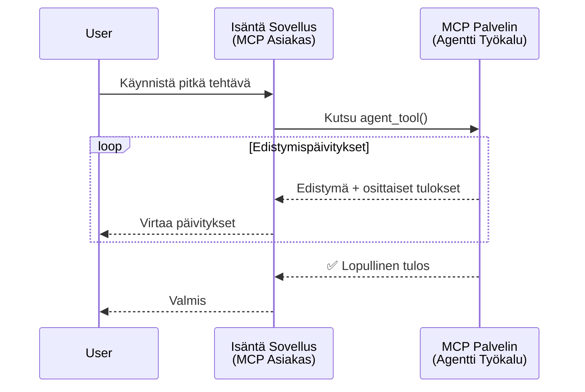
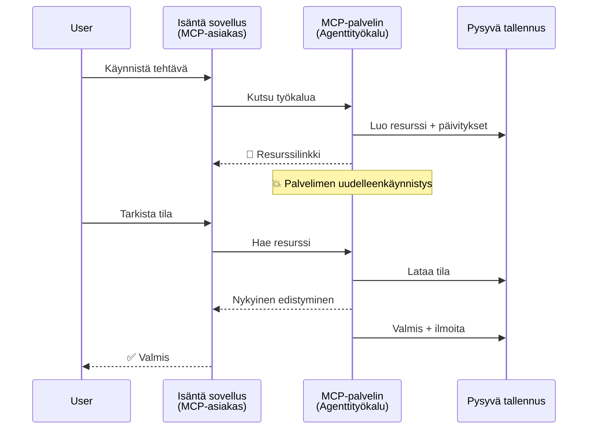
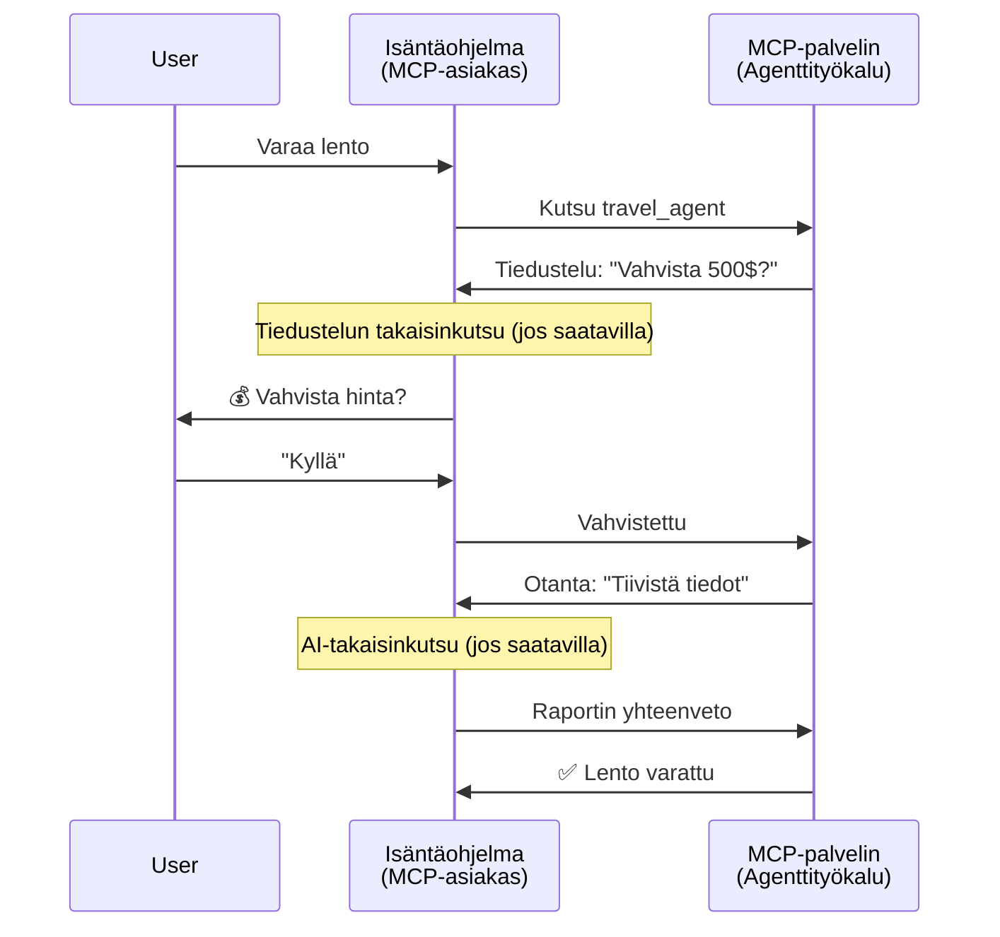
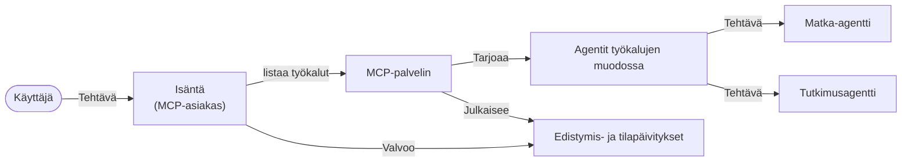

# Agenttien välisen viestintäjärjestelmän rakentaminen MCP:llä

> Tiivistelmä - Voitko rakentaa Agent2Agent-viestinnän MCP:llä? Kyllä!

MCP on kehittynyt merkittävästi alkuperäisestä tavoitteestaan "tarjota kontekstia LLM:ille". Viimeaikaisten parannusten, kuten [jatkettavien suoratoistojen](https://modelcontextprotocol.io/docs/concepts/transports#resumability-and-redelivery), [tiedustelun](https://modelcontextprotocol.io/specification/2025-06-18/client/elicitation), [näytteenoton](https://modelcontextprotocol.io/specification/2025-06-18/client/sampling) ja ilmoitusten ([edistymisestä](https://modelcontextprotocol.io/specification/2025-06-18/basic/utilities/progress) ja [resursseista](https://modelcontextprotocol.io/specification/2025-06-18/schema#resourceupdatednotification)) avulla MCP tarjoaa nyt vankan perustan monimutkaisten agenttien välisen viestinnän järjestelmien rakentamiseen.

## Agentti/työkalu-virheymmärrys

Kun yhä useammat kehittäjät tutkivat agenttitoimintoja sisältäviä työkaluja (kuten pitkään toimivia, kesken suorittamisen mahdollisesti lisäsyötettä vaativia), yleinen väärinkäsitys on, että MCP soveltuu huonosti, koska sen varhaiset esimerkit painottivat yksinkertaisia pyyntö-vastaus-malleja.

Tämä käsitys on vanhentunut. MCP-määrittelyä on viime kuukausien aikana merkittävästi laajennettu ominaisuuksilla, jotka kaventavat aukkoa pitkäkestoisten agenttitoimintojen rakentamisessa:

- **Suoratoisto ja osatulokset**: Reaaliaikaiset edistymisilmoitukset suorituksen aikana
- **Jatkettavuus**: Asiakkaat voivat uudelleenyhdistää ja jatkaa katkeamisen jälkeen
- **Pysyvyys**: Tulokset säilyvät palvelimen uudelleenkäynnistyksen jälkeen (esim. resurssilinkkien kautta)
- **Monivuoroisuus**: Interaktiivinen syöte kesken suorituksen tiedustelun ja näytteenoton avulla

Näitä ominaisuuksia voi yhdistellä mahdollistaen monimutkaiset agentti- ja monagenttisovellukset, kaikki MCP-protokollan päällä.

Viitteeksi kutsumme agenttia "työkaluksi", joka on saatavilla MCP-palvelimella. Tämä edellyttää isäntäohjelmaa, joka toteuttaa MCP-asiakkaan, muodostaa istunnon MCP-palvelimen kanssa ja pystyy kutsumaan agenttia.

## Mikä tekee MCP-työkalusta "agenttisen"?

Ennen toteutukseen ryhtymistä määritellään, mitä infrastruktuuriominaisuuksia tarvitaan pitkäkestoisten agenttien tukemiseksi.

> Määrittelemme agentin itsenäisesti toimivaksi kokonaisuudeksi, joka voi toimia pitkiä aikoja, käsitellä monimutkaisia tehtäviä, jotka saattavat vaatia useita vuorovaikutuksia tai säätöjä reaaliaikaisen palautteen perusteella.

### 1. Suoratoisto ja osatulokset

Perinteiset pyyntö-vastaus-mallit eivät sovellu pitkään kestäviin tehtäviin. Agenttien on tarjottava:

- Reaaliaikaiset edistymisilmoitukset
- Väli- tai osatulokset

**MCP-tuki**: Resurssipäivitysilmoitukset mahdollistavat osatulosten suoratoiston. Tämä vaatii huolellista suunnittelua, jotta JSON-RPC:n 1:1 pyyntö/vastaus -mallin ristiriidat vältetään.

| Ominaisuus                | Käyttötapaus                                                                                                                                                     | MCP-tuki                                                                                   |
| ------------------------- | ---------------------------------------------------------------------------------------------------------------------------------------------------------------- | ----------------------------------------------------------------------------------------- |
| Reaaliaikaiset edistymisilmoitukset | Käyttäjä pyytää koodipohjan migraatiotehtävää. Agentti suoratoistaa edistymistä: "10 % – Riippuvuuksien analysointi... 25 % – TypeScript-tiedostojen muunnos... 50 % – Tuontien päivitys..." | ✅ Edistymisilmoitukset                                                                   |
| Osatulokset               | "Kirjan luonti" -tehtävä suoratoistaa osatuloksia, esim. 1) Tarinan juonen luonnos, 2) Luku-lista, 3) Jokainen luku valmiina. Isäntä voi tarkastella, peruuttaa tai ohjata missä tahansa vaiheessa. | ✅ Ilmoituksia voi "laajentaa" osatuloksia varten, katso ehdotukset PR 383, 776            |

<div align="center" style="font-style: italic; font-size: 0.95em; margin-bottom: 0.5em;">
<strong>Kuvio 1:</strong> Tämä kaavio havainnollistaa, kuinka MCP-agentti suoratoistaa reaaliaikaisia edistymisilmoituksia ja osatuloksia isäntäohjelmalle pitkäkestoisen tehtävän aikana, mahdollistaen käyttäjän seurata suoritusta reaaliajassa.
</div>



### 2. Jatkettavuus

Agenttien on käsiteltävä verkkokatkokset joustavasti:

- Uudelleenyhdistys (asiakas)katkoksen jälkeen
- Jatkuu siitä, mihin jäi (viestien uudelleenlähetys)

**MCP-tuki**: MCP StreamableHTTP -kuljetus tukee nykyään istunnon jatkamista ja viestien uudelleenlähetystä istunnon ja viimeisen tapahtuman tunnisteiden avulla. Tärkeää on, että palvelimen täytyy toteuttaa EventStore, joka mahdollistaa tapahtumien toiston asiakas-yhteyden uudelleen muodostuessa.  
Huomaa, että yhteisön ehdotus (PR #975) tutkii kuljetusriippumatonta jatkettavien suoratoistojen tukea.

| Ominaisuus     | Käyttötapaus                                                                                                                                                    | MCP-tuki                                                                   |
| ------------- | -------------------------------------------------------------------------------------------------------------------------------------------------------------- | ------------------------------------------------------------------------- |
| Jatkettavuus  | Asiakas katkeaa pitkäkestoisen tehtävän aikana. Uudelleenyhdistettäessä istunto jatkuu ja ohitetut tapahtumat toistetaan saumattomasti siitä, mihin jäätiin.     | ✅ StreamableHTTP-kuljetus, jossa on istuntotunnisteet, tapahtumien toisto ja EventStore |

<div align="center" style="font-style: italic; font-size: 0.95em; margin-bottom: 0.5em;">
<strong>Kuvio 2:</strong> Tämä kaavio näyttää, kuinka MCP:n StreamableHTTP-kuljetus ja tapahtumavarasto mahdollistavat saumattoman istunnon jatkamisen: jos asiakas katkeaa, se voi uudelleenyhdistää ja toistaa ohitetut tapahtumat jatkaen tehtävää edistymistä menettämättä.
</div>


### 3. Pysyvyys

Pitkäkestoiset agentit tarvitsevat pysyvän tilan:

- Tulokset säilyvät palvelimen uudelleenkäynnistyksissä
- Tila voidaan hakea erillisesti
- Edistymisen seuranta istuntojen yli

**MCP-tuki**: MCP tukee nyt resurssilinkkityyppiä työkalukutsuissa. Yleinen malli on suunnitella työkalu, joka luo resurssin ja palauttaa välittömästi resurssilinkin. Työkalu voi jatkaa tehtävän käsittelyä taustalla ja päivittää resurssia. Asiakas voi halutessaan kysellä resurssin tilaa osatulosten tai lopullisten tulosten saamiseksi (riippuen palvelimen tarjoamista resurssipäivityksistä) tai tilata resurssin päivitysilmoituksia.

Rajoitus on, että resurssien kysely tai päivityksiin tilaaminen voi kuormittaa resursseja mittakaavassa. On avoin yhteisöehdotus (sisältäen #992), joka tutkii mahdollisuutta sisällyttää webhookkeja tai laukaisijoita, joita palvelin voi kutsua ilmoittaakseen asiakas-/isäntäohjelmalle päivityksistä.

| Ominaisuus  | Käyttötapaus                                                                                                                                          | MCP-tuki                                                      |
| ---------- | ----------------------------------------------------------------------------------------------------------------------------------------------------- | ------------------------------------------------------------- |
| Pysyvyys   | Palvelin kaatuu tietojen siirtotehtävän aikana. Tulokset ja edistyminen säilyvät uudelleenkäynnistyksessä, asiakas voi tarkistaa tilan ja jatkaa pysyvästä resurssista. | ✅ Resurssilinkit pysyvällä tallennuksella ja tila-ilmoituksilla |

Nykyään yleinen malli on siis suunnitella työkalu, joka luo resurssin ja palauttaa välittömästi resurssilinkin. Työkalu voi taustalla käsitellä tehtävää, lähettää resurssipäivitysilmoituksia edistymisilmoituksina tai osatuloksina sekä päivittää resurssin sisältöä tarpeen mukaan.

<div align="center" style="font-style: italic; font-size: 0.95em; margin-bottom: 0.5em;">
<strong>Kuvio 3:</strong> Tämä kaavio havainnollistaa, kuinka MCP-agentit käyttävät pysyviä resursseja ja tila-ilmoituksia varmistaakseen, että pitkäkestoiset tehtävät säilyvät palvelimen uudelleenkäynnistysten yli, mahdollistaen asiakkaille edistymisen tarkastelun ja tulosten hakemisen myös vikatilanteiden jälkeen.
</div>



### 4. Monivuoroiset vuorovaikutukset

Agentit tarvitsevat usein lisäsyötettä kesken suorituksen:

- Henkilön tarkennus tai hyväksyntä
- AI-avusteiset monimutkaiset päätökset
- Dynaaminen parametrien säätö

**MCP-tuki**: Täysin tuettu näytteenoton (AI-syöte) ja tiedustelun (ihmisen syöte) avulla.

| Ominaisuus             | Käyttötapaus                                                                                                                                      | MCP-tuki                                              |
| --------------------- | ------------------------------------------------------------------------------------------------------------------------------------------------- | ----------------------------------------------------- |
| Monivuoroiset vuorovaikutukset | Matkavarauksen agentti pyytää käyttäjältä vahvistusta hinnasta, pyytää sitten AI:ta tiivistämään matkadataa ennen varauksen loppuun saattamista. | ✅ Tiedustelu ihmisen syötteelle, näytteenotto AI-syötteelle |

<div align="center" style="font-style: italic; font-size: 0.95em; margin-bottom: 0.5em;">
<strong>Kuvio 4:</strong> Tämä kaavio kuvaa, kuinka MCP-agentit voivat interaktiivisesti pyytää ihmisen syötettä tai AI-avustusta kesken suorituksen, tukien monimutkaisia, monivuoroisia työnkulkuja kuten vahvistuksia ja dynaamista päätöksentekoa.
</div>



## Pitkäkestoisten agenttien toteutus MCP:llä - Koodiyhteenveto

Tämän artikkelin osana tarjoamme [koodivaraston](https://github.com/victordibia/ai-tutorials/tree/main/MCP%20Agents), joka sisältää täydellisen toteutuksen pitkäkestoisista agenteista käyttäen MCP Python SDK:ta StreamableHTTP-kuljetuksella istunnon jatkamiseen ja viestien uudelleenlähetykseen. Toteutus demonstroi, kuinka MCP-ominaisuuksia voi yhdistää kehittyneiden agenttimaisten toimintojen mahdollistamiseksi.

Tarkemmin toteutamme palvelimen, jolla on kaksi pääagenttityökalua:

- **Matka-agentti** – Simuloi matkavarauksen palvelua hintavahvistuksella tiedustelun avulla
- **Tutkimusagentti** – Tekee tutkimustehtäviä AI-avusteisilla tiivistyksillä näytteenoton avulla

Molemmat agentit demonstroivat reaaliaikaisia edistymisilmoituksia, interaktiivisia vahvistuksia sekä täyttä istunnon jatkamismahdollisuutta.

### Keskeiset toteutuskäsitteet

Seuraavat osiot näyttävät palvelinpuolen agenttien toteutuksen ja asiakaspuolen isännän käsittelyn kutakin ominaisuutta varten:

#### Suoratoisto ja edistymisilmoitukset - reaaliaikainen tehtävän tila

Suoratoisto mahdollistaa agenttien lähettää reaaliaikaisia edistymisilmoituksia pitkäkestoisten tehtävien aikana, pitäen käyttäjät ajan tasalla tehtävän tilasta ja väli- tai osatuloksista.

**Palvelinpuolen toteutus (agentti lähettää edistymisilmoituksia):**

```python
# Palvelimelta/server.py - Matkatoimisto lähettää etenemispäivityksiä
for i, step in enumerate(steps):
    await ctx.session.send_progress_notification(
        progress_token=ctx.request_id,
        progress=i * 25,
        total=100,
        message=step,
        related_request_id=str(ctx.request_id)
    )
    await anyio.sleep(2)  # Työn simulointi

# Vaihtoehto: Kirjaa viestejä yksityiskohtaisiin vaiheittaiseen päivityksiin
await ctx.session.send_log_message(
    level="info",
    data=f"Processing step {current_step}/{steps} ({progress_percent}%)",
    logger="long_running_agent",
    related_request_id=ctx.request_id,
)
```

**Asiakaspuolen toteutus (isäntä vastaanottaa edistymisilmoitukset):**

```python
# Asiakas asiakas/client.py - Asiakas käsittelee reaaliaikaisia ilmoituksia
async def message_handler(message) -> None:
    if isinstance(message, types.ServerNotification):
        if isinstance(message.root, types.LoggingMessageNotification):
            console.print(f"📡 [dim]{message.root.params.data}[/dim]")
        elif isinstance(message.root, types.ProgressNotification):
            progress = message.root.params
            console.print(f"🔄 [yellow]{progress.message} ({progress.progress}/{progress.total})[/yellow]")

# Rekisteröi viestinkäsittelijä istunnon luomisen yhteydessä
async with ClientSession(
    read_stream, write_stream,
    message_handler=message_handler
) as session:
```

#### Tiedustelu - Käyttäjän syötteen pyytäminen

Tiedustelu mahdollistaa agenttien pyytää käyttäjän syötettä kesken suorituksen. Tämä on välttämätöntä vahvistusten, tarkennusten tai hyväksyntöjen saamiseksi pitkissä tehtävissä.

**Palvelinpuolen toteutus (agentti pyytää vahvistusta):**

```python
# Matkatoimisto pyytää hinnan vahvistusta
elicit_result = await ctx.session.elicit(
    message=f"Please confirm the estimated price of $1200 for your trip to {destination}",
    requestedSchema=PriceConfirmationSchema.model_json_schema(),
    related_request_id=ctx.request_id,
)

if elicit_result and elicit_result.action == "accept":
    # Jatka varauksen tekemistä
    logger.info(f"User confirmed price: {elicit_result.content}")
elif elicit_result and elicit_result.action == "decline":
    # Peru varaus
    booking_cancelled = True
```

**Asiakaspuolen toteutus (isäntä tarjoaa tiedustelun palautekutsun):**

```python
# Asiakkaalta/client.py - Asiakkaan pyyntöjen käsittely
async def elicitation_callback(context, params):
    console.print(f"💬 Server is asking for confirmation:")
    console.print(f"   {params.message}")

    response = console.input("Do you accept? (y/n): ").strip().lower()

    if response in ['y', 'yes']:
        return types.ElicitResult(
            action="accept",
            content={"confirm": True, "notes": "Confirmed by user"}
        )
    else:
        return types.ElicitResult(
            action="decline",
            content={"confirm": False, "notes": "Declined by user"}
        )

# Rekisteröi takaisinkutsu istunnon luomisen yhteydessä
async with ClientSession(
    read_stream, write_stream,
    elicitation_callback=elicitation_callback
) as session:
```

#### Näytteenotto - AI-avun pyytäminen

Näytteenotto antaa agenttien pyytää LLM-avustusta monimutkaisiin päätöksiin tai sisällöntuotantoon suorituksen aikana. Tämä mahdollistaa hybridin ihmisen ja AI:n työnkulut.

**Palvelinpuolen toteutus (agentti pyytää AI-apua):**

```python
# Server/server.py - Tutkimusagentti pyytää tekoäly-yhteenvetoa
sampling_result = await ctx.session.create_message(
    messages=[
        SamplingMessage(
            role="user",
            content=TextContent(type="text", text=f"Please summarize the key findings for research on: {topic}")
        )
    ],
    max_tokens=100,
    related_request_id=ctx.request_id,
)

if sampling_result and sampling_result.content:
    if sampling_result.content.type == "text":
        sampling_summary = sampling_result.content.text
        logger.info(f"Received sampling summary: {sampling_summary}")
```

**Asiakaspuolen toteutus (isäntä tarjoaa näytteenoton palautekutsun):**

```python
# Asiakaspalvelu/client.py - Asiakkaan käsittely näytteenottopyynnöille
async def sampling_callback(context, params):
    message_text = params.messages[0].content.text if params.messages else 'No message'
    console.print(f"🧠 Server requested sampling: {message_text}")

    # Todellisessa sovelluksessa tämä voisi kutsua LLM-API:a
    # Demon tarkoituksiin tarjoamme mallivastauksen
    mock_response = "Based on current research, MCP has evolved significantly..."

    return types.CreateMessageResult(
        role="assistant",
        content=types.TextContent(type="text", text=mock_response),
        model="interactive-client",
        stopReason="endTurn"
    )

# Rekisteröi callback luotaessa istuntoa
async with ClientSession(
    read_stream, write_stream,
    sampling_callback=sampling_callback,
    elicitation_callback=elicitation_callback
) as session:
```

#### Jatkettavuus - istunnon jatkuvuus yhteyksien katkeamisen yli

Jatkettavuus varmistaa, että pitkäkestoiset agenttitehtävät säilyvät, vaikka asiakas katkeaisi, ja jatkuvat saumattomasti uudelleenyhdistettäessä. Tämä toteutetaan tapahtumavarastojen ja jatkotunnisteiden avulla.

**Tapahtumavaraston toteutus (palvelin ylläpitää istunnon tilaa):**

```python
# Palvelimelta/event_store.py - Yksinkertainen muistissa toimiva tapahtumavarasto
class SimpleEventStore(EventStore):
    def __init__(self):
        self._events: list[tuple[StreamId, EventId, JSONRPCMessage]] = []
        self._event_id_counter = 0

    async def store_event(self, stream_id: StreamId, message: JSONRPCMessage) -> EventId:
        """Store an event and return its ID."""
        self._event_id_counter += 1
        event_id = str(self._event_id_counter)
        self._events.append((stream_id, event_id, message))
        return event_id

    async def replay_events_after(self, last_event_id: EventId, send_callback: EventCallback) -> StreamId | None:
        """Replay events after the specified ID for resumption."""
        # Etsi tapahtumat viimeisen tunnetun tapahtuman jälkeen ja toista ne
        for _, event_id, message in self._events[start_index:]:
            await send_callback(EventMessage(message, event_id))

# Palvelimelta/server.py - Tapahtumavaraston välittäminen istuntojen hallintaan
def create_server_app(event_store: Optional[EventStore] = None) -> Starlette:
    server = ResumableServer()

    # Luo istuntojen hallinta tapahtumavarastolla uudelleenaloitusta varten
    session_manager = StreamableHTTPSessionManager(
        app=server,
        event_store=event_store,  # Tapahtumavarasto mahdollistaa istunnon uudelleenaloituksen
        json_response=False,
        security_settings=security_settings,
    )

    return Starlette(routes=[Mount("/mcp", app=session_manager.handle_request)])

# Käyttö: Alusta tapahtumavaraston kanssa
event_store = SimpleEventStore()
app = create_server_app(event_store)
```

**Asiakasmetatiedot jatkotunnisteen kanssa (asiakas yhdistää uudelleen tallennetun tilan avulla):**

```python
# Asiakas/client.py - Asiakasjätkös jatkuu metatietojen kanssa
if existing_tokens and existing_tokens.get("resumption_token"):
    # Käytä olemassa olevaa jatkosmerkkiä jatkaaksesi siitä mihin jäimme
    metadata = ClientMessageMetadata(
        resumption_token=existing_tokens["resumption_token"],
    )
else:
    # Luo callback tallentaaksesi jatkosmerkki vastaanotettaessa
    def enhanced_callback(token: str):
        protocol_version = getattr(session, 'protocol_version', None)
        token_manager.save_tokens(session_id, token, protocol_version, command, args)

    metadata = ClientMessageMetadata(
        on_resumption_token_update=enhanced_callback,
    )

# Lähetä pyyntö jatkotietojen kanssa
result = await session.send_request(
    types.ClientRequest(
        types.CallToolRequest(
            method="tools/call",
            params=types.CallToolRequestParams(name=command, arguments=args)
        )
    ),
    types.CallToolResult,
    metadata=metadata,
)
```

Isäntäohjelma ylläpitää istuntotunnisteita ja jatkotunnisteita paikallisesti, mahdollistaen yhdistämisen olemassa oleviin istuntoihin menettämättä edistymistä tai tilaa.

### Koodin järjestely

<div align="center" style="font-style: italic; font-size: 0.95em; margin-bottom: 0.5em;">
<strong>Kuvio 5:</strong> MCP-pohjaisen agenttijärjestelmän arkkitehtuuri
</div>



**Keskeiset tiedostot:**

- **`server/server.py`** – Jatkettava MCP-palvelin matkailu- ja tutkimusagentteineen, jotka demonstroivat tiedustelua, näytteenottoa ja edistymisilmoituksia
- **`client/client.py`** – Interaktiivinen isäntäohjelma, jossa jatkotuki, palautekutsujen käsittelijät ja token-hallinta
- **`server/event_store.py`** – Tapahtumavaraston toteutus, joka mahdollistaa istunnon jatkamisen ja viestien uudelleenlähetyksen

## Jatko monagenttiseen viestintään MCP:llä

Yllä oleva toteutus voidaan laajentaa monagenttijärjestelmäksi parantamalla isäntäohjelman älykkyyttä ja laajentamalla sen toimintakenttää:

- **Älykäs tehtävien pilkkominen**: Isäntä analysoi monimutkaiset käyttäjäpyynnöt ja jakaa ne alitehtäviksi eri erikoistuneille agenteille
- **Monipalvelin-yhteistyö**: Isäntä ylläpitää yhteyksiä useisiin MCP-palvelimiin, jotka tarjoavat erilaisia agenttitoimintoja
- **Tehtävien tilanhallinta**: Isäntä seuraa monia samanaikaisia agenttitehtäviä, hoitaa riippuvuudet ja aikajärjestyksen
- **Resilienssi ja uudelleenyritykset**: Isäntä hallitsee virheitä, toteuttaa uudelleenyrityslogiikkaa ja ohjaa tehtävät uudelleen, kun agentit eivät ole käytettävissä
- **Tulosten yhdistely**: Isäntä yhdistää useiden agenttien tuotokset johdonmukaiseksi lopputulokseksi

Isäntä kehittyy yksinkertaisesta asiakkaasta älykkääksi orkestroijaksi, koordinoiden hajautettuja agenttikykyjä samalla säilyttäen MCP-protokollan peruspohjan.

## Yhteenveto

MCP:n laajennetut ominaisuudet – resurssien ilmoitukset, tiedustelu/näytteenotto, jatkettavat suoratoistot ja pysyvät resurssit – mahdollistavat monimutkaiset agenttien väliset vuorovaikutukset pitäen samalla protokollan yksinkertaisuuden.

## Aloittaminen

Valmiina rakentamaan oma agenttien välinen järjestelmä? Seuraa näitä ohjeita:

### 1. Käynnistä demo

```bash
# Käynnistä palvelin tapahtumavarastolla jatkamiseksi
python -m server.server --port 8006

# Toisessa päätelaitteessa suorita vuorovaikutteinen asiakasohjelma
python -m client.client --url http://127.0.0.1:8006/mcp
```

**Käytettävissä olevat komennot interaktiivisessa tilassa:**

- `travel_agent` – Varaa matka hintavahvistuksella tiedustelun kautta
- `research_agent` – Tee tutkimuksia AI-avusteisilla tiivistyksillä näytteenotolla
- `list` – Näytä kaikki saatavilla olevat työkalut
- `clean-tokens` – Tyhjennä jatkotunnisteet
- `help` – Näytä yksityiskohtainen komentojen ohje
- `quit` – Poistu asiakkaasta

### 2. Testaa jatkettavuutta

- Käynnistä pitkäkestoinen agentti (esim. `travel_agent`)
- Keskeytä asiakas suorituksen aikana (Ctrl+C)
- Käynnistä asiakas uudelleen – se jatkaa automaattisesti siitä mihin jäi

### 3. Tutki ja laajenna

- **Tutki esimerkkejä**: Tutustu tähän [mcp-agents](https://github.com/victordibia/ai-tutorials/tree/main/MCP%20Agents)
- **Liity yhteisöön**: Osallistu MCP-keskusteluihin GitHubissa
- **Kokeile**: Aloita yksinkertaisella pitkäkestoisella tehtävällä ja lisää vähitellen suoratoisto, jatkettavuus ja monagenttien koordinointi

Tämä osoittaa, kuinka MCP mahdollistaa älykkäät agenttikäyttäytymiset säilyttäen työkalupohjaisen yksinkertaisuuden.

Kaiken kaikkiaan MCP-protokollan spesifikaatio kehittyy nopeasti; lukijaa suositellaan tutustumaan viralliseen dokumentaatiosivustoon uusimmista päivityksistä – https://modelcontextprotocol.io/introduction

---

<!-- CO-OP TRANSLATOR DISCLAIMER START -->
**Vastuuvapauslauseke**:
Tämä asiakirja on käännetty käyttämällä tekoälypohjaista käännöspalvelua [Co-op Translator](https://github.com/Azure/co-op-translator). Vaikka pyrimme tarkkuuteen, otathan huomioon, että automaattiset käännökset saattavat sisältää virheitä tai epätarkkuuksia. Alkuperäinen asiakirja sen alkuperäiskielellä on virallinen lähde. Tärkeissä asioissa suositellaan ammattimaista ihmiskäännöstä. Emme ole vastuussa tämän käännöksen käytöstä aiheutuvista väärinymmärryksistä tai tulkinnoista.
<!-- CO-OP TRANSLATOR DISCLAIMER END -->