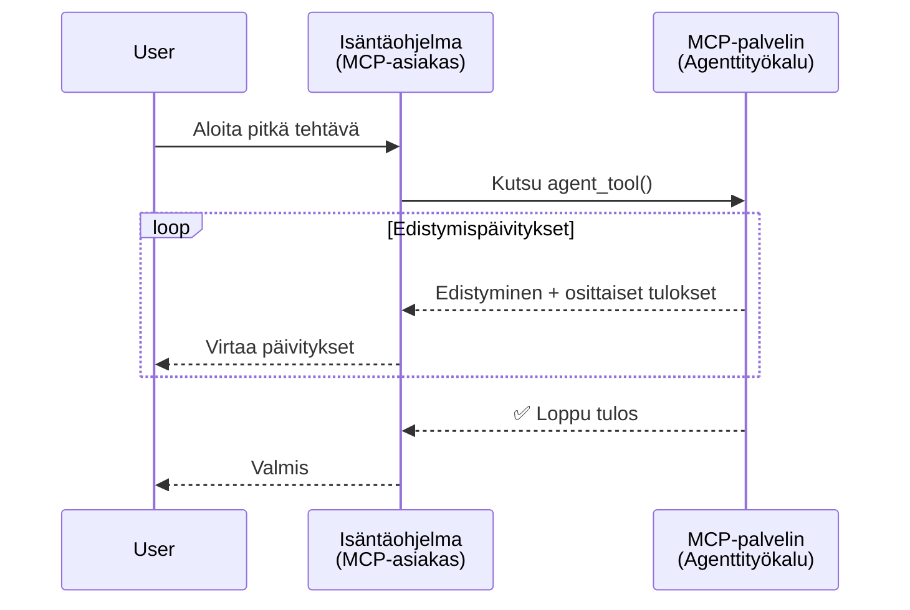
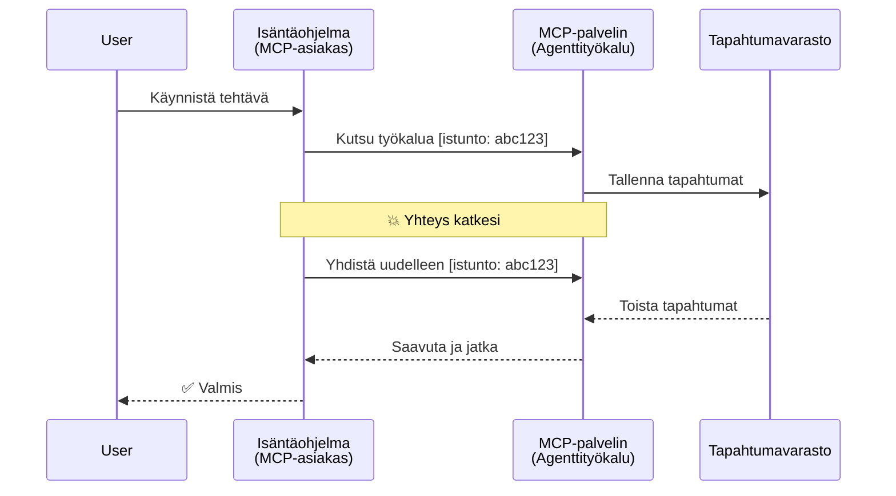
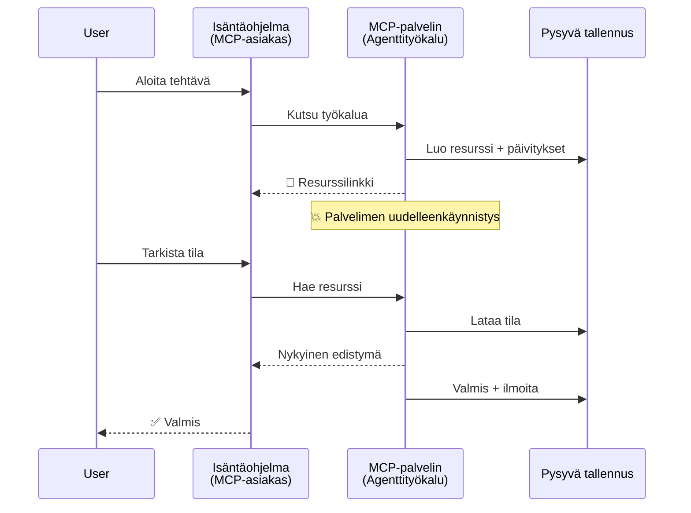
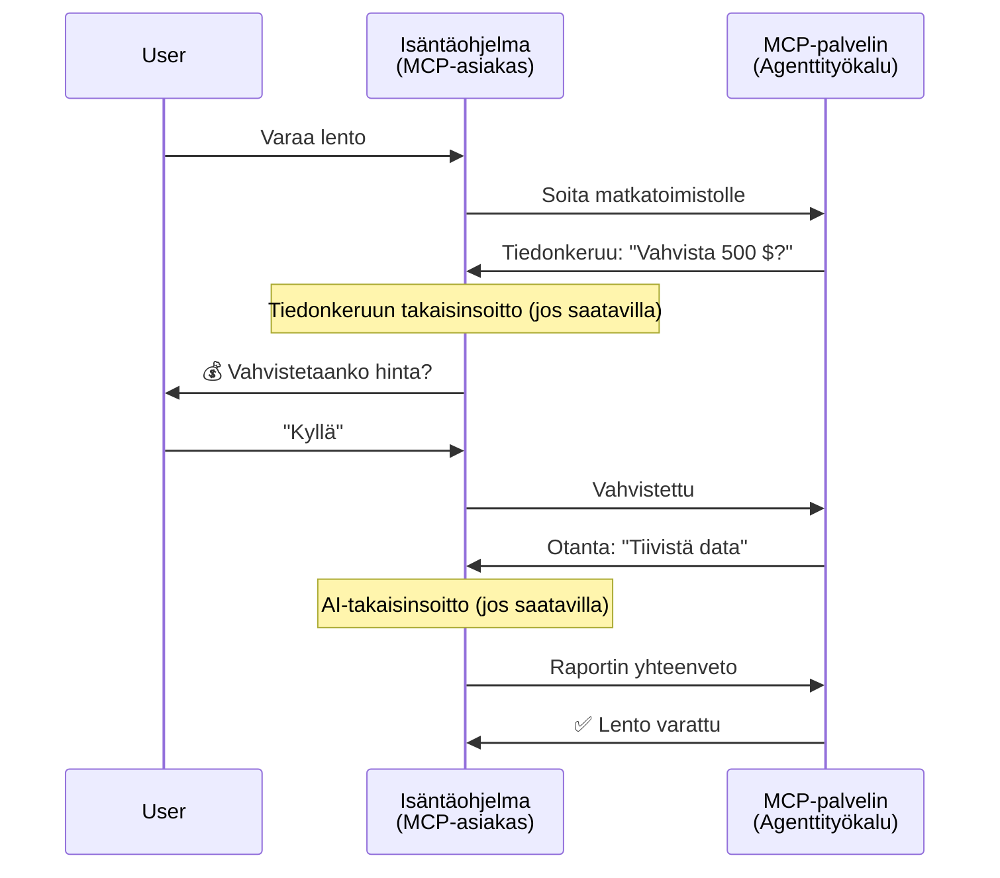
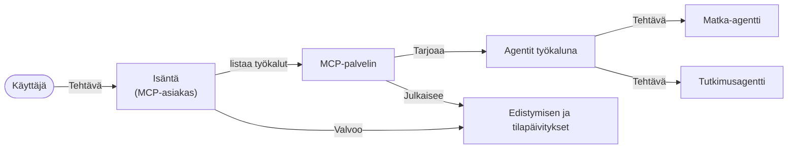

# Agenttien välisten viestintäjärjestelmien rakentaminen MCP:llä

> TL;DR - Voitko rakentaa Agent2Agent-viestinnän MCP:llä? Kyllä!

MCP on kehittynyt merkittävästi alkuperäisestä tavoitteestaan "tarjota kontekstia LLM:ille". Viimeaikaisten parannusten, kuten [jatkettavien streamien](https://modelcontextprotocol.io/docs/concepts/transports#resumability-and-redelivery), [elicitaation](https://modelcontextprotocol.io/specification/2025-06-18/client/elicitation), [näytteenoton](https://modelcontextprotocol.io/specification/2025-06-18/client/sampling) ja ilmoitusten ([edistyminen](https://modelcontextprotocol.io/specification/2025-06-18/basic/utilities/progress) ja [resurssit](https://modelcontextprotocol.io/specification/2025-06-18/schema#resourceupdatednotification)) myötä MCP tarjoaa nyt vahvan perustan monimutkaisten agenttien välisen viestinnän järjestelmien rakentamiseen.

## Agentti/työkalu-virhekäsitys

Yhä useampien kehittäjien tutkiessa agenttikäyttäytymistä omaavia työkaluja (jotka voivat käydä pitkiä aikoja, saattavat tarvita lisäsyötettä kesken suorituksen jne.), yleinen harhakäsitys on, että MCP ei sovellu tähän, koska sen työkalujen alkuvaiheen esimerkit keskittyivät yksinkertaisiin pyyntö-vastaus-kuvioihin.

Tämä käsitys on vanhentunut. MCP-spesifikaatiota on kehitetty merkittävästi viime kuukausina ominaisuuksilla, jotka kaventavat aukkoa pitkään jatkuvien agenttikäyttäytymisen rakentamisessa:

- **Streaming ja osittaiset tulokset**: Reaaliaikaiset etenemisilmoitukset suorituksen aikana
- **Jatkettavuus**: Asiakkaat voivat yhdistää uudelleen ja jatkaa keskeytyksen jälkeen
- **Kestävyys**: Tulokset säilyvät palvelimen uudelleenkäynnistyksen yli (esim. resurssilinkkien kautta)
- **Monivaiheisuus**: Interaktiivinen syöte suorituksen aikana elicitaation ja näytteenoton kautta

Näitä ominaisuuksia voidaan yhdistellä monimutkaisten agenttien ja multi-agenttisovellusten toteuttamiseksi, kaikki MCP-protokollalla toteutettuina.

Viitteenä käytämme agentista nimitystä "työkalu", joka on saatavilla MCP-palvelimella. Tämä edellyttää isäntäohjelman olemassaoloa, joka toteuttaa MCP-asiakkaan, joka luo istunnon MCP-palvelimelle ja voi kutsua agenttia.

## Mitä tekee MCP-työkalun "agenttiseksi"?

Ennen toteutukseen sukeltamista määritellään, mitä infrastruktuuriominaisuuksia tarvitaan pitkään käyvän agentin tukemiseksi.

> Määrittelemme agentin olevaksi entiteetti, joka toimii itsenäisesti pitkiä ajanjaksoja, kykenee hoitamaan monimutkaisia tehtäviä, jotka saattavat vaatia useita vuorovaikutuksia tai säätöjä reaaliaikaisen palautteen perusteella.

### 1. Streaming ja osittaiset tulokset

Perinteiset pyyntö-vastaus-kuviot eivät sovellu pitkiin tehtäviin. Agenteilta vaaditaan:

- Reaaliaikaiset etenemisilmoitukset
- Välitulokset

**MCP-tuki**: Resurssin päivitysilmoitukset mahdollistavat osittaiset tulokset striimauksen, vaikka tämä vaatii huolellista suunnittelua JSON-RPC:n 1:1 pyyntö/vastaus-mallin konfliktien välttämiseksi.

| Ominaisuus                 | Käyttötapaus                                                                                                                                                              | MCP-tuki                                                                                   |
| ------------------------- | ------------------------------------------------------------------------------------------------------------------------------------------------------------------------- | ------------------------------------------------------------------------------------------ |
| Reaaliaikaiset etenemisilmoitukset | Käyttäjä pyytää koodikannan migraatiotehtävää. Agentti striimaa etenemisen: "10 % - Riippuvuuksien analysointi... 25 % - TypeScript-tiedostojen muunnos... 50 % - Tuontien päivitys..." | ✅ Edistymisilmoitukset                                                                    |
| Osittaiset tulokset       | "Kirjan luonti" -tehtävä striimaa osittaiset tulokset, esim. 1) Tarinan kaaren hahmotelma, 2) Lukulista, 3) Jokainen luku erikseen valmistumisensa mukaan. Isäntä voi tarkastella, peruuttaa tai ohjata millä tahansa vaiheella. | ✅ Ilmoitukset voidaan "laajentaa" osittaisiin tuloksiin, ks. ehdotukset PR 383, 776         |

<div align="center" style="font-style: italic; font-size: 0.95em; margin-bottom: 0.5em;">
<strong>Kuva 1:</strong> Tämä kaavio kuvaa, miten MCP-agentti striimaa reaaliaikaisesti etenemisilmoituksia ja osittaisia tuloksia isäntäohjelmalle pitkän tehtävän aikana, mahdollistaen käyttäjän seurata suoritusta reaaliajassa.
</div>



### 2. Jatkettavuus

Agenttien tulee käsitellä verkkokatkoksia sujuvasti:

- Yhdistyä uudelleen asiakasyhteyden katkeamisen jälkeen
- Jatkaa siitä, mihin jäi (viestien uudelleenlähetys)

**MCP-tuki**: MCP StreamableHTTP -kuljetus tukee tänään istunnon jatkamista ja viestien uudelleenlähetystä istunto-ID:jen ja viimeisten tapahtuma-ID:jen avulla. Tärkeää on, että palvelimen täytyy toteuttaa EventStore, joka mahdollistaa tapahtumien uudelleensoiton asiakasyhteyden uudelleenyhdistyessä.  
Huomaa, että yhteisöehdotus (PR #975) tutkii kuljetusriippumattomia jatkettavia streameja.

| Ominaisuus   | Käyttötapaus                                                                                                                                                | MCP-tuki                                                              |
| ----------- | --------------------------------------------------------------------------------------------------------------------------------------------------------- | -------------------------------------------------------------------- |
| Jatkettavuus | Asiakas irrottautuu pitkän tehtävän aikana. Uudelleen yhdistyessä istunto jatkuu, menetetyt tapahtumat toistetaan saumattomasti siitä, mihin jäätiin. | ✅ StreamableHTTP-kuljetus istunto-ID:llä, tapahtumien toistolla ja EventStorella |

<div align="center" style="font-style: italic; font-size: 0.95em; margin-bottom: 0.5em;">
<strong>Kuva 2:</strong> Tämä kaavio näyttää, miten MCP:n StreamableHTTP-kuljetus ja tapahtumavarasto mahdollistavat saumattoman istunnon jatkamisen: jos asiakas irrottautuu, se voi yhdistää uudelleen ja toistaa menetetyt tapahtumat, jatkaen tehtävää ilman etenemisen menetystä.
</div>



### 3. Kestävyys

Pitkään käyvillä agenteilla on tarve pysyvälle tilalle:

- Tulokset säilyvät palvelimen uudelleenkäynnistyksen yli
- Tila voidaan hakea erillisesti
- Etenemisen seuranta istuntojen yli

**MCP-tuki**: MCP tukee nyt työkalukutsujen Resource link -palautustyyppiä. Yleinen malli on rakentaa työkalu, joka luo resurssin ja palauttaa välittömästi resurssilinkin. Työkalu voi taustalla jatkaa tehtävän hoitamista ja päivittää resurssia. Asiakas voi puolestaan valita resurssin tilan kyselyn saadakseen osittaisia tai täydellisiä tuloksia (riippuen siitä, mitä palvelin tarjoaa) tai tilata resurssin päivitysilmoituksia.

Yksi rajoitus on, että resurssien kysely tai tilaamisen päivityksiin voi kuluttaa kapasiteettia, mikä on huomioitava laajassa mittakaavassa. On olemassa avoin yhteisöehdotus (mukaan lukien #992), joka tutkii mahdollisuutta palvelimen kutsua webhookkeja tai triggereitä ilmoittaakseen päivityksistä asiakkaalle/isännälle.

| Ominaisuus  | Käyttötapaus                                                                                                                                        | MCP-tuki                                                        |
| ---------- | ------------------------------------------------------------------------------------------------------------------------------------------------- | ---------------------------------------------------------------- |
| Kestävyys  | Palvelin kaatuu tietojen migraatiotehtävän aikana. Tulokset ja eteneminen säilyvät käynnistyksen yli, asiakas voi tarkastaa tilan ja jatkaa pysyvästä resurssista. | ✅ Resurssilinkit pysyvällä tallennuksella ja tilailmoituksilla |

Yleinen käytäntö on suunnitella työkalu, joka luo resurssin ja palauttaa välittömästi resurssilinkin. Työkalu voi taustalla hoitaa tehtävää, lähettää resurssiin tilapäivityksiä etenemisilmotuksina tai osittaisina tuloksina ja päivittää resurssin sisältöä tarpeen mukaan.

<div align="center" style="font-style: italic; font-size: 0.95em; margin-bottom: 0.5em;">
<strong>Kuva 3:</strong> Tämä kaavio havainnollistaa, kuinka MCP-agentit käyttävät pysyviä resursseja ja tilailmoituksia varmistaakseen, että pitkät tehtävät kestävät palvelimen uudelleenkäynnistykset, jolloin asiakkaat voivat tarkistaa etenemisen ja hakea tuloksia myös epäonnistumisten jälkeen.
</div>



### 4. Monivaiheiset vuorovaikutukset

Agentit tarvitsevat usein lisäsyötettä kesken suorituksen:

- Ihmisen selvennys tai hyväksyntä
- AI-avusteiset päätökset
- Dynaamiset parametrisäädöt

**MCP-tuki**: Täysin tuettu näytteenoton (AI-syöte) ja elicitaation (ihmissyöte) avulla.

| Ominaisuus               | Käyttötapaus                                                                                                                                    | MCP-tuki                                               |
| ----------------------- | ----------------------------------------------------------------------------------------------------------------------------------------------- | ------------------------------------------------------- |
| Monivaiheiset vuorovaikutukset | Matkanvarausagentti pyytää käyttäjältä hinnan vahvistuksen, sitten pyytää AI:ta tiivistämään matkadataa ennen varauksen päättämistä.                 | ✅ Elicitaatio ihmissyötteelle, näytteenotto AI-syötteelle |

<div align="center" style="font-style: italic; font-size: 0.95em; margin-bottom: 0.5em;">
<strong>Kuva 4:</strong> Tämä kaavio esittää, miten MCP-agentit voivat interaktiivisesti pyytää ihmisen syötettä tai AI-apua kesken suorituksen, tukien monimutkaisia, monivaiheisia työnkulkuja kuten vahvistuksia ja dynaamisia päätöksiä.
</div>



## Pitkään käyvän agentin toteutus MCP:llä – Koodin yleiskatsaus

Tässä artikkelissa tarjoamme [koodivaraston](https://github.com/victordibia/ai-tutorials/tree/main/MCP%20Agents), joka sisältää täydellisen pitkään toimivien agenttien toteutuksen MCP:n Python SDK:lla ja StreamableHTTP-kuljetuksella istunnon jatkamiseen ja viestien uudelleenlähetykseen. Toteutus osoittaa, miten MCP-ominaisuuksia voidaan yhdistellä edistyneiden agenttikäyttäytymisten mahdollistamiseksi.

Erityisesti toteutamme palvelimen, jossa on kaksi pääagenttityökalua:

- **Matka-agentti** – Simuloi matkanvarausta, joka vahvistaa hinnan elicitaation avulla
- **Tutkimus-agentti** – Tekee tutkimustehtäviä AI-avusteisten tiivistelmien avulla näytteenoton kautta

Molemmat agentit demonstroivat reaaliaikaisia etenemisilmoituksia, interaktiivisia vahvistuksia ja täyttä istunnon jatkumisen tukea.

### Toteutuksen keskeiset käsitteet

Seuraavissa osioissa näytetään palvelinpuolen agenttien toteutus ja asiakaspuolen isännän käsittely jokaiselle ominaisuudelle:

#### Streaming & etenemisilmoitukset – tehtävän tila reaaliajassa

Streaming mahdollistaa agenttien tarjoavan reaaliaikaisia etenemisilmoituksia pitkien tehtävien aikana, pitäen käyttäjät ajan tasalla tehtävän tilasta ja välituloksista.

**Palvelimen toteutus (agentti lähettää etenemisilmoituksia):**

```python
# Palvelimelta/server.py - Matkatoimisto lähettää etenemispäivityksiä
for i, step in enumerate(steps):
    await ctx.session.send_progress_notification(
        progress_token=ctx.request_id,
        progress=i * 25,
        total=100,
        message=step,
        related_request_id=str(ctx.request_id)
    )
    await anyio.sleep(2)  # Simuloi työtä

# Vaihtoehto: Kirjaa viestit yksityiskohtaisiin askel-askeleelta päivityksiin
await ctx.session.send_log_message(
    level="info",
    data=f"Processing step {current_step}/{steps} ({progress_percent}%)",
    logger="long_running_agent",
    related_request_id=ctx.request_id,
)
```

**Asiakkaan toteutus (isäntä vastaanottaa etenemisilmoitukset):**

```python
# Asiakasohjelmasta client/client.py - Asiakas, joka käsittelee reaaliaikaisia ilmoituksia
async def message_handler(message) -> None:
    if isinstance(message, types.ServerNotification):
        if isinstance(message.root, types.LoggingMessageNotification):
            console.print(f"📡 [dim]{message.root.params.data}[/dim]")
        elif isinstance(message.root, types.ProgressNotification):
            progress = message.root.params
            console.print(f"🔄 [yellow]{progress.message} ({progress.progress}/{progress.total})[/yellow]")

# Rekisteröi viestinkäsittelijä istunnon luomisessa
async with ClientSession(
    read_stream, write_stream,
    message_handler=message_handler
) as session:
```

#### Elicitaatio – käyttäjäsyötteen pyytäminen

Elicitaatio mahdollistaa agenttien pyytää käyttäjäsyötettä kesken suorituksen. Tämä on olennaista vahvistuksiin, selvennyksiin tai hyväksyntöihin pitkissä tehtävissä.

**Palvelimen toteutus (agentti pyytää vahvistusta):**

```python
# Palvelimelta/server.py - Matkatoimisto pyytää hintavahvistusta
elicit_result = await ctx.session.elicit(
    message=f"Please confirm the estimated price of $1200 for your trip to {destination}",
    requestedSchema=PriceConfirmationSchema.model_json_schema(),
    related_request_id=ctx.request_id,
)

if elicit_result and elicit_result.action == "accept":
    # Jatka varausta
    logger.info(f"User confirmed price: {elicit_result.content}")
elif elicit_result and elicit_result.action == "decline":
    # Peruuta varaus
    booking_cancelled = True
```

**Asiakkaan toteutus (isäntä tarjoaa elicitaatiokutsun):**

```python
# Asiakas/asiakas.py:stä - Asiakkaan pyyntöjen käsittely
async def elicitation_callback(context, params):
    console.print(f"💬 Server is asking for confirmation:")
    console.print(f"   {params.message}")

    response = console.input("Do you accept? (y/n): ").strip().lower()

    if response in ['y', 'yes']:
        return types.ElicitResult(
            action="accept",
            content={"confirm": True, "notes": "Confirmed by user"}
        )
    else:
        return types.ElicitResult(
            action="decline",
            content={"confirm": False, "notes": "Declined by user"}
        )

# Rekisteröi takaisinsoitto istunnon luomisen yhteydessä
async with ClientSession(
    read_stream, write_stream,
    elicitation_callback=elicitation_callback
) as session:
```

#### Näytteenotto – AI-avun pyytäminen

Näytteenotto antaa agenttien pyytää LLM-apua monimutkaisiin päätöksiin tai sisällön luontiin suorituksen aikana. Tämä mahdollistaa ihmisen ja tekoälyn hybridivirtaukset.

**Palvelimen toteutus (agentti pyytää AI-apua):**

```python
# Palvelimelta/server.py - Tutkimusagentti pyytää tekoälyn yhteenvetoa
sampling_result = await ctx.session.create_message(
    messages=[
        SamplingMessage(
            role="user",
            content=TextContent(type="text", text=f"Please summarize the key findings for research on: {topic}")
        )
    ],
    max_tokens=100,
    related_request_id=ctx.request_id,
)

if sampling_result and sampling_result.content:
    if sampling_result.content.type == "text":
        sampling_summary = sampling_result.content.text
        logger.info(f"Received sampling summary: {sampling_summary}")
```

**Asiakkaan toteutus (isäntä tarjoaa näytteenottokutsun):**

```python
# Asiakas/client.py - Asiakkaan käsittely näytteenottopyyntöihin
async def sampling_callback(context, params):
    message_text = params.messages[0].content.text if params.messages else 'No message'
    console.print(f"🧠 Server requested sampling: {message_text}")

    # Todellisessa sovelluksessa tämä voisi kutsua LLM-rajapintaa
    # Demon vuoksi tarjoamme mallivastauksen
    mock_response = "Based on current research, MCP has evolved significantly..."

    return types.CreateMessageResult(
        role="assistant",
        content=types.TextContent(type="text", text=mock_response),
        model="interactive-client",
        stopReason="endTurn"
    )

# Rekisteröi takaisinsoitto istuntoa luotaessa
async with ClientSession(
    read_stream, write_stream,
    sampling_callback=sampling_callback,
    elicitation_callback=elicitation_callback
) as session:
```

#### Jatkettavuus – istunnon jatkuvuus irrotusten yli

Jatkettavuus varmistaa, että pitkät agenttitehtävät kestävät asiakasirrotukset ja jatkuvat saumattomasti uudelleen yhdistettäessä. Tämä toteutetaan tapahtumavaraston ja jatkemistunnusten avulla.

**Tapahtumavaraston toteutus (palvelin ylläpitää istuntotilaa):**

```python
# From server/event_store.py - Yksinkertainen muistissa oleva tapahtumavarasto
class SimpleEventStore(EventStore):
    def __init__(self):
        self._events: list[tuple[StreamId, EventId, JSONRPCMessage]] = []
        self._event_id_counter = 0

    async def store_event(self, stream_id: StreamId, message: JSONRPCMessage) -> EventId:
        """Store an event and return its ID."""
        self._event_id_counter += 1
        event_id = str(self._event_id_counter)
        self._events.append((stream_id, event_id, message))
        return event_id

    async def replay_events_after(self, last_event_id: EventId, send_callback: EventCallback) -> StreamId | None:
        """Replay events after the specified ID for resumption."""
        # Etsi tapahtumat viimeisimmän tunnetun tapahtuman jälkeen ja toista ne
        for _, event_id, message in self._events[start_index:]:
            await send_callback(EventMessage(message, event_id))

# From server/server.py - Tapahtumavaraston välitys istuntohallinnalle
def create_server_app(event_store: Optional[EventStore] = None) -> Starlette:
    server = ResumableServer()

    # Luo istuntohallinta tapahtumavarastolla jatkamista varten
    session_manager = StreamableHTTPSessionManager(
        app=server,
        event_store=event_store,  # Tapahtumavarasto mahdollistaa istunnon jatkamisen
        json_response=False,
        security_settings=security_settings,
    )

    return Starlette(routes=[Mount("/mcp", app=session_manager.handle_request)])

# Käyttö: Alusta tapahtumavarastolla
event_store = SimpleEventStore()
app = create_server_app(event_store)
```

**Asiakasmetatiedot jatkamistunnuksella (asiakas yhdistää uudelleen tallennetun tilan avulla):**

```python
# Asiakas/client.py - Asiakasjatkuu metatietojen kanssa
if existing_tokens and existing_tokens.get("resumption_token"):
    # Käytä olemassa olevaa jatkotunnistetta jatkaaksesi siitä, mihin jäimme
    metadata = ClientMessageMetadata(
        resumption_token=existing_tokens["resumption_token"],
    )
else:
    # Luo takaisinkutsu jatkotunnisteen tallentamista varten vastaanoton yhteydessä
    def enhanced_callback(token: str):
        protocol_version = getattr(session, 'protocol_version', None)
        token_manager.save_tokens(session_id, token, protocol_version, command, args)

    metadata = ClientMessageMetadata(
        on_resumption_token_update=enhanced_callback,
    )

# Lähetä pyyntö jatkometatietojen kanssa
result = await session.send_request(
    types.ClientRequest(
        types.CallToolRequest(
            method="tools/call",
            params=types.CallToolRequestParams(name=command, arguments=args)
        )
    ),
    types.CallToolResult,
    metadata=metadata,
)
```

Isäntäohjelma ylläpitää istunto-ID:tä ja jatkamistunnuksia paikallisesti, mahdollistaen uudelleen yhdistämisen olemassa oleviin istuntoihin ilman edistymisen tai tilan menetystä.

### Koodin organisointi

<div align="center" style="font-style: italic; font-size: 0.95em; margin-bottom: 0.5em;">
<strong>Kuva 5:</strong> MCP-pohjaisen agenttijärjestelmän arkkitehtuuri
</div>



**Keskeiset tiedostot:**

- **`server/server.py`** – Jatkettava MCP-palvelin, jossa on matka- ja tutkimusagentit, jotka demonstroivat elicitaatiota, näytteenottoa ja etenemisilmoituksia
- **`client/client.py`** – Interaktiivinen isäntäohjelma jatkamistuen, palautekäsittelijöiden ja tunnusten hallinnan kanssa
- **`server/event_store.py`** – Tapahtumavaraston toteutus istunnon jatkamiselle ja viestien uudelleenlähetukselle

## Laajentaminen monianttijärjestelmiin MCP:llä

Edellä mainittu toteutus voidaan laajentaa monianttijärjestelmäksi kehittämällä isäntäohjelman älykkyyttä ja laajuutta:

- **Älykäs tehtävien pilkkominen**: Isäntä analysoi monimutkaiset käyttäjäpyynnöt ja jakaa ne eri erikoistuneille agenteille
- **Monipalvelinyhteistyö**: Isäntä ylläpitää yhteyksiä useisiin MCP-palvelimiin, joista jokainen tarjoaa erilaisia agenttikykyjä
- **Tehtävätilan hallinta**: Isäntä seuraa edistymistä useissa samanaikaisissa agenttitehtävissä, hoitaa riippuvuudet ja jaksotuksen
- **Resilienssi ja uudelleenyritykset**: Isäntä hallitsee virheitä, toteuttaa uudelleenyrittomekanismeja ja ohjaa tehtäviä uudelleen, kun agentit eivät ole käytettävissä
- **Tulosten yhdistäminen**: Isäntä yhdistelee useiden agenttien tulokset yhdeksi johdonmukaiseksi lopputulokseksi

Isännästä kehkeytyy yksinkertaisesta asiakkaasta älykäs orkestroija, joka koordinoi hajautettuja agenttikykyjä säilyttäen MCP-protokollan perustan.

## Yhteenveto

MCP:n parannetut ominaisuudet – resurssitiedotteet, elicitaatio/näytteenotto, jatkettavat streamit ja pysyvät resurssit – mahdollistavat monimutkaiset agenttien väliset toiminnot säilyttäen protokollan yksinkertaisuuden.

## Aloittaminen

Valmis rakentamaan oma agent2agent-järjestelmäsi? Seuraa näitä vaiheita:

### 1. Käynnistä demo

```bash
# Käynnistä palvelin tapahtumavarastolla jatkamista varten
python -m server.server --port 8006

# Avaa toisessa komentorivissä interaktiivinen asiakasohjelma
python -m client.client --url http://127.0.0.1:8006/mcp
```

**Saatavilla olevat komennot interaktiivisessa tilassa:**

- `travel_agent` – Tee matkanvaraus hinnan vahvistuksella elicitaation kautta
- `research_agent` – Tutki aiheita AI-avusteisten tiivistelmien avulla näytteenoton kautta
- `list` – Näytä kaikki saatavilla olevat työkalut
- `clean-tokens` – Tyhjennä jatkamistunnukset
- `help` – Näytä yksityiskohtainen ohje komentoihin
- `quit` – Poistu asiakkaasta

### 2. Testaa jatkamisominaisuudet

- Käynnistä pitkäkestoinen agentti (esim. `travel_agent`)
- Katkaise asiakas suorituksen aikana (Ctrl+C)
- Käynnistä asiakas uudelleen – se jatkaa automaattisesti siitä, mihin jäi

### 3. Tutki ja laajenna

- **Tutki esimerkkejä**: Katso tämä [mcp-agents](https://github.com/victordibia/ai-tutorials/tree/main/MCP%20Agents)
- **Liity yhteisöön**: Osallistu MCP-keskusteluihin GitHubissa
- **Kokeile**: Aloita yksinkertaisesta pitkäkestoisesta tehtävästä ja lisää vähitellen streaming, jatkettavuus ja moniagenttikoordinaatio

Tämä osoittaa, miten MCP mahdollistaa älykkäät agenttikäyttäytymiset säilyttäen työkalupohjaisen yksinkertaisuuden.

Kaiken kaikkiaan MCP-protokollan spesifikaatio kehittyy nopeasti; lukijaa kehotetaan tarkistamaan virallinen dokumentaatiosivusto viimeisimpien päivitysten saamiseksi - https://modelcontextprotocol.io/introduction

---

<!-- CO-OP TRANSLATOR DISCLAIMER START -->
**Vastuuvapauslauseke**:
Tämä asiakirja on käännetty käyttämällä tekoälypohjaista käännöspalvelua [Co-op Translator](https://github.com/Azure/co-op-translator). Vaikka pyrimme tarkkuuteen, otathan huomioon, että automaattiset käännökset saattavat sisältää virheitä tai epätarkkuuksia. Alkuperäinen asiakirja sen alkuperäiskielellä on virallinen lähde. Tärkeissä asioissa suositellaan ammattimaista ihmiskäännöstä. Emme ole vastuussa tämän käännöksen käytöstä aiheutuvista väärinymmärryksistä tai tulkinnoista.
<!-- CO-OP TRANSLATOR DISCLAIMER END -->