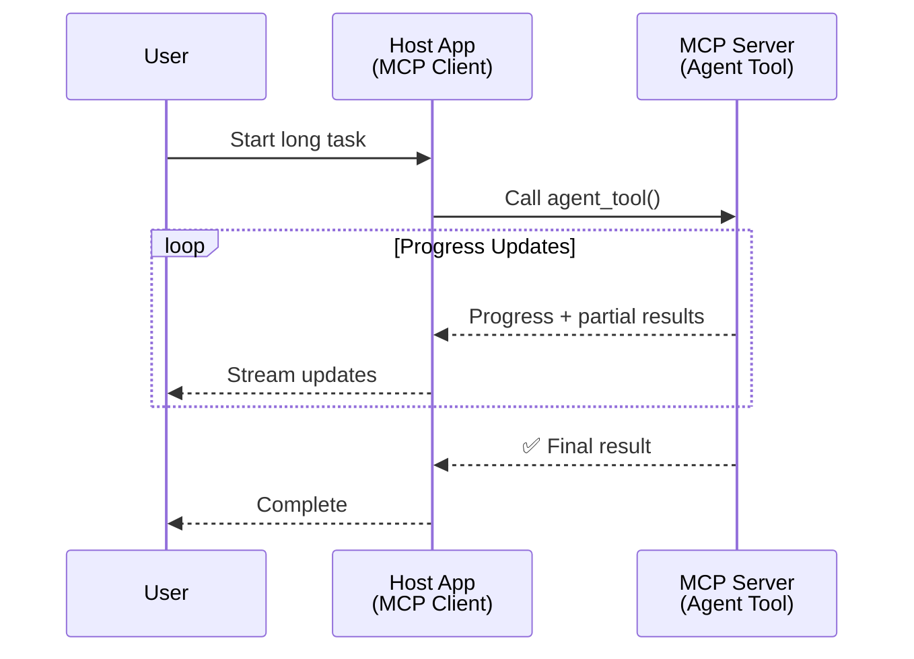
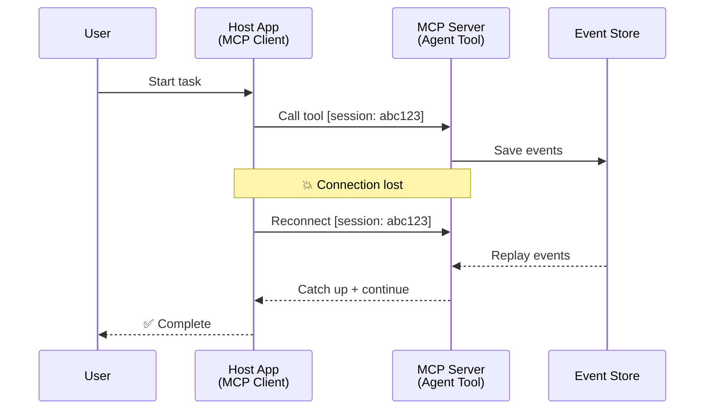
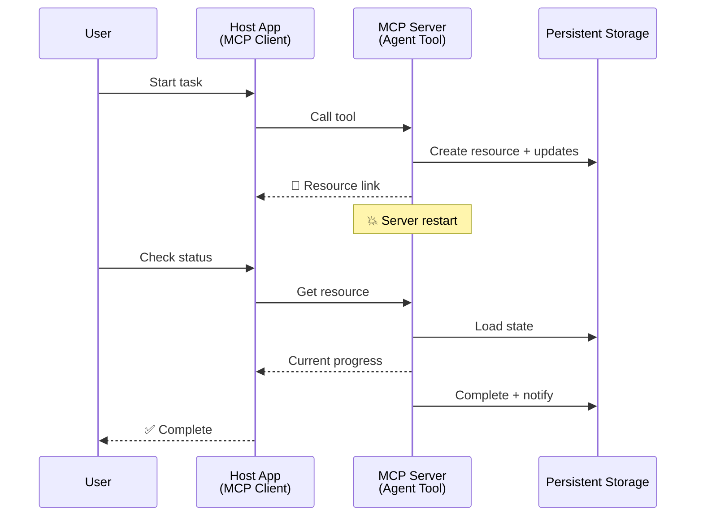
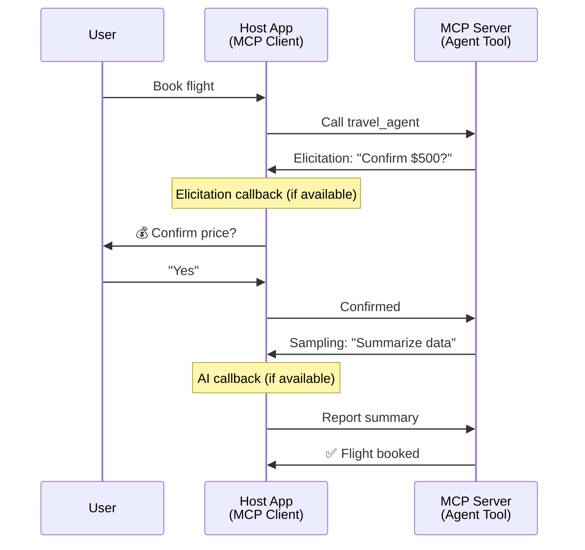
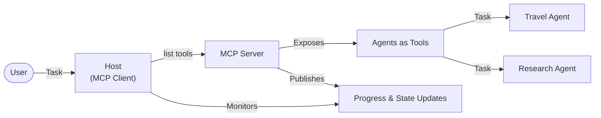

<!--
CO_OP_TRANSLATOR_METADATA:
{
  "original_hash": "5cc6836626047aa055e8960c8484a7d0",
  "translation_date": "2025-08-21T13:25:16+00:00",
  "source_file": "11-mcp/code_samples/mcp-agents/README.md",
  "language_code": "fi"
}
-->
# Agenttien välisen viestintäjärjestelmän rakentaminen MCP:llä

> TL;DR - Voitko rakentaa Agent2Agent-viestintää MCP:llä? Kyllä!

MCP on kehittynyt merkittävästi alkuperäisestä tavoitteestaan "tarjota konteksti LLM:ille". Viimeisimmät parannukset, kuten [jatkettavat streamit](https://modelcontextprotocol.io/docs/concepts/transports#resumability-and-redelivery), [tiedonkeruu](https://modelcontextprotocol.io/specification/2025-06-18/client/elicitation), [näytteenotto](https://modelcontextprotocol.io/specification/2025-06-18/client/sampling) ja ilmoitukset ([edistyminen](https://modelcontextprotocol.io/specification/2025-06-18/basic/utilities/progress) ja [resurssit](https://modelcontextprotocol.io/specification/2025-06-18/schema#resourceupdatednotification)), tarjoavat nyt vankan perustan monimutkaisten agenttien välisen viestintäjärjestelmien rakentamiseen.

## Agentti/Työkalu -väärinkäsitys

Kun yhä useammat kehittäjät tutkivat työkaluja, joilla on agenttimaisia ominaisuuksia (toimivat pitkään, saattavat vaatia lisäsyötettä kesken suorituksen jne.), yleinen väärinkäsitys on, että MCP ei sovellu tähän, koska sen työkalujen primitiiviset esimerkit keskittyivät yksinkertaisiin pyyntö-vastaus-malleihin.

Tämä käsitys on vanhentunut. MCP:n spesifikaatiota on parannettu merkittävästi viime kuukausina ominaisuuksilla, jotka mahdollistavat pitkäkestoisen agenttimaisen toiminnan:

- **Streaming & Osittaiset tulokset**: Reaaliaikaiset edistymispäivitykset suorituksen aikana
- **Jatkettavuus**: Asiakkaat voivat muodostaa yhteyden uudelleen ja jatkaa katkoksen jälkeen
- **Kestävyys**: Tulokset säilyvät palvelimen uudelleenkäynnistyksen jälkeen (esim. resurssilinkkien kautta)
- **Monikierroksisuus**: Vuorovaikutteinen syöte kesken suorituksen tiedonkeruun ja näytteenoton avulla

Näitä ominaisuuksia voidaan yhdistää monimutkaisten agenttien ja monen agentin sovellusten mahdollistamiseksi, kaikki MCP-protokollan avulla.

Viitteenä kutsumme agenttia "työkaluksi", joka on saatavilla MCP-palvelimella. Tämä tarkoittaa isäntäsovelluksen olemassaoloa, joka toteuttaa MCP-asiakkaan, joka muodostaa istunnon MCP-palvelimen kanssa ja voi kutsua agenttia.

## Mikä tekee MCP-työkalusta "agenttimaisen"?

Ennen kuin siirrymme toteutukseen, määritellään, mitä infrastruktuurikyvykkyyksiä tarvitaan pitkäkestoisten agenttien tukemiseen.

> Määrittelemme agentin entiteetiksi, joka voi toimia itsenäisesti pitkän ajan, käsitellä monimutkaisia tehtäviä, jotka saattavat vaatia useita vuorovaikutuksia tai säätöjä reaaliaikaisen palautteen perusteella.

### 1. Streaming & Osittaiset tulokset

Perinteiset pyyntö-vastaus-mallit eivät toimi pitkäkestoisissa tehtävissä. Agenttien on tarjottava:

- Reaaliaikaisia edistymispäivityksiä
- Väli- ja osatuloksia

**MCP-tuki**: Resurssipäivitysilmoitukset mahdollistavat osittaisten tulosten streamauksen, vaikka tämä vaatii huolellista suunnittelua konfliktien välttämiseksi JSON-RPC:n 1:1 pyyntö/vastaus-mallin kanssa.

| Ominaisuus                 | Käyttötapaus                                                                                                                                                                       | MCP-tuki                                                                                   |
| -------------------------- | ---------------------------------------------------------------------------------------------------------------------------------------------------------------------------------- | ------------------------------------------------------------------------------------------ |
| Reaaliaikaiset edistymispäivitykset | Käyttäjä pyytää koodikannan migraatiotehtävää. Agentti streamaa edistymistä: "10% - Analysoidaan riippuvuuksia... 25% - Muutetaan TypeScript-tiedostoja... 50% - Päivitetään tuontitiedostoja..." | ✅ Edistymisilmoitukset                                                                     |
| Osittaiset tulokset        | "Kirjan luominen" -tehtävä streamaa osittaisia tuloksia, esim. 1) Juonikaavio, 2) Lukuotsikot, 3) Jokainen luku valmistuessaan. Isäntä voi tarkastella, peruuttaa tai ohjata uudelleen missä tahansa vaiheessa. | ✅ Ilmoituksia voidaan "laajentaa" sisältämään osittaisia tuloksia, katso ehdotukset PR 383, 776 |

<div align="center" style="font-style: italic; font-size: 0.95em; margin-bottom: 0.5em;">
<strong>Kuva 1:</strong> Tämä kaavio havainnollistaa, kuinka MCP-agentti streamaa reaaliaikaisia edistymispäivityksiä ja osittaisia tuloksia isäntäsovellukselle pitkäkestoisen tehtävän aikana, mahdollistaen käyttäjän seurata suoritusta reaaliajassa.
</div>



### 2. Jatkettavuus

Agenttien on käsiteltävä verkkokatkoksia sujuvasti:

- Yhdistä uudelleen (asiakas) katkoksen jälkeen
- Jatka siitä, mihin jäätiin (viestien uudelleentoimitus)

**MCP-tuki**: MCP StreamableHTTP -kuljetus tukee nykyään istunnon jatkamista ja viestien uudelleentoimitusta istuntotunnuksilla ja viimeisten tapahtumatunnusten avulla. Tärkeä huomio tässä on, että palvelimen on toteutettava EventStore, joka mahdollistaa tapahtumien uudelleentoiston asiakkaan uudelleenyhdistämisen yhteydessä.  
Huomaa, että yhteisön ehdotus (PR #975) tutkii kuljetusagnostisia jatkettavia streameja.

| Ominaisuus      | Käyttötapaus                                                                                                                                                   | MCP-tuki                                                                 |
| --------------- | -------------------------------------------------------------------------------------------------------------------------------------------------------------- | ----------------------------------------------------------------------- |
| Jatkettavuus    | Asiakas katkaisee yhteyden pitkäkestoisen tehtävän aikana. Uudelleenyhdistämisen jälkeen istunto jatkuu, ja menetetyt tapahtumat toistetaan, jatkaen saumattomasti siitä, mihin jäätiin. | ✅ StreamableHTTP-kuljetus istuntotunnuksilla, tapahtumien toisto ja EventStore |

<div align="center" style="font-style: italic; font-size: 0.95em; margin-bottom: 0.5em;">
<strong>Kuva 2:</strong> Tämä kaavio näyttää, kuinka MCP:n StreamableHTTP-kuljetus ja tapahtumavarasto mahdollistavat saumattoman istunnon jatkamisen: jos asiakas katkaisee yhteyden, se voi yhdistää uudelleen ja toistaa menetetyt tapahtumat, jatkaen tehtävää ilman edistymisen menetystä.
</div>



### 3. Kestävyys

Pitkäkestoiset agentit tarvitsevat pysyvän tilan:

- Tulokset säilyvät palvelimen uudelleenkäynnistyksen jälkeen
- Tila voidaan hakea erillään
- Edistymisen seuranta istuntojen välillä

**MCP-tuki**: MCP tukee nyt resurssilinkkien palautustyyppiä työkalu-kutsuille. Nykyään mahdollinen malli on suunnitella työkalu, joka luo resurssin ja palauttaa välittömästi resurssilinkin. Työkalu voi jatkaa tehtävän käsittelyä taustalla ja päivittää resurssia. Asiakas voi puolestaan valita resurssin tilan kyselyn saadakseen osittaisia tai täydellisiä tuloksia (perustuen siihen, mitä resurssipäivityksiä palvelin tarjoaa) tai tilata resurssin päivitysilmoituksia.

Yksi rajoitus tässä on, että resurssien kysely tai päivitysten tilaaminen voi kuluttaa resursseja, mikä voi vaikuttaa skaalautuvuuteen. Avoin yhteisön ehdotus (mukaan lukien #992) tutkii mahdollisuutta sisällyttää webhookeja tai laukaisimia, joita palvelin voi kutsua ilmoittaakseen asiakkaalle/isäntäsovellukselle päivityksistä.

| Ominaisuus    | Käyttötapaus                                                                                                                                        | MCP-tuki                                                        |
| ------------- | --------------------------------------------------------------------------------------------------------------------------------------------------- | ---------------------------------------------------------------- |
| Kestävyys     | Palvelin kaatuu datan migraatiotehtävän aikana. Tulokset ja edistyminen säilyvät uudelleenkäynnistyksen jälkeen, asiakas voi tarkistaa tilan ja jatkaa pysyvästä resurssista. | ✅ Resurssilinkit pysyvällä tallennuksella ja tilailmoituksilla |

Nykyään yleinen malli on suunnitella työkalu, joka luo resurssin ja palauttaa välittömästi resurssilinkin. Työkalu voi taustalla käsitellä tehtävää, lähettää resurssipäivityksiä, jotka toimivat edistymispäivityksinä tai sisältävät osittaisia tuloksia, ja päivittää resurssin sisältöä tarpeen mukaan.

<div align="center" style="font-style: italic; font-size: 0.95em; margin-bottom: 0.5em;">
<strong>Kuva 3:</strong> Tämä kaavio havainnollistaa, kuinka MCP-agentit käyttävät pysyviä resursseja ja tilailmoituksia varmistaakseen, että pitkäkestoiset tehtävät säilyvät palvelimen uudelleenkäynnistyksen jälkeen, mahdollistaen asiakkaiden tarkistaa edistymistä ja hakea tuloksia myös epäonnistumisten jälkeen.
</div>



### 4. Monikierroksiset vuorovaikutukset

Agentit tarvitsevat usein lisäsyötettä kesken suorituksen:

- Ihmisen tarkennus tai hyväksyntä
- AI-apu monimutkaisiin päätöksiin
- Dynaaminen parametrien säätö

**MCP-tuki**: Täysin tuettu näytteenoton (AI-syöte) ja tiedonkeruun (ihmisen syöte) avulla.

| Ominaisuus                 | Käyttötapaus                                                                                                                                     | MCP-tuki                                           |
| -------------------------- | ----------------------------------------------------------------------------------------------------------------------------------------------- | ------------------------------------------------- |
| Monikierroksiset vuorovaikutukset | Matkavarauksen agentti pyytää käyttäjältä hintavahvistusta, sitten pyytää AI:ta tiivistämään matkadataa ennen varauksen viimeistelyä. | ✅ Tiedonkeruu ihmisen syötteelle, näytteenotto AI-syötteelle |

<div align="center" style="font-style: italic; font-size: 0.95em; margin-bottom: 0.5em;">
<strong>Kuva 4:</strong> Tämä kaavio kuvaa, kuinka MCP-agentit voivat vuorovaikutteisesti pyytää ihmisen syötettä tai AI-apua kesken suorituksen, tukien monimutkaisia, monikierroksisia työnkulkuja, kuten vahvistuksia ja dynaamista päätöksentekoa.
</div>



## Pitkäkestoisten agenttien toteuttaminen MCP:llä - Koodikatsaus

Osana tätä artikkelia tarjoamme [koodivaraston](https://github.com/victordibia/ai-tutorials/tree/main/MCP%20Agents), joka sisältää täydellisen toteutuksen pitkäkestoisista agenteista MCP Python SDK:lla käyttäen StreamableHTTP-kuljetusta istunnon jatkamiseen ja viestien uudelleentoimitukseen. Toteutus havainnollistaa, kuinka MCP-ominaisuuksia voidaan yhdistää mahdollistamaan kehittyneitä agenttimaisia toimintoja.

Erityisesti toteutamme palvelimen, jossa on kaksi pääasiallista agenttityökalua:

- **Matka-agentti** - Simuloi matkavarauksen palvelua hintavahvistuksella tiedonkeruun avulla
- **Tutkimusagentti** - Suorittaa tutkimustehtäviä AI-avusteisilla tiivistelmillä näytteenoton avulla

Molemmat agentit demonstroivat reaaliaikaisia edistymispäivityksiä, vuorovaikutteisia vahvistuksia ja täydellisiä istunnon jatkamiskykyjä.

### Keskeiset toteutuskäsitteet

Seuraavat osiot näyttävät palvelinpuolen agenttien toteutuksen ja asiakaspuolen isännän käsittelyn jokaiselle ominaisuudelle:

#### Streaming & Edistymispäivitykset - Reaaliaikainen tehtävän tila

Streaming mahdollistaa agenttien tarjoavan reaaliaikaisia edistymispäivityksiä pitkäkestoisten tehtävien aikana, pitäen käyttäjät ajan tasalla tehtävän tilasta ja väli-/osatuloksista.

**Palvelimen toteutus (agentti lähettää edistymisilmoituksia):**

```python
# From server/server.py - Travel agent sending progress updates
for i, step in enumerate(steps):
    await ctx.session.send_progress_notification(
        progress_token=ctx.request_id,
        progress=i * 25,
        total=100,
        message=step,
        related_request_id=str(ctx.request_id)
    )
    await anyio.sleep(2)  # Simulate work

# Alternative: Log messages for detailed step-by-step updates
await ctx.session.send_log_message(
    level="info",
    data=f"Processing step {current_step}/{steps} ({progress_percent}%)",
    logger="long_running_agent",
    related_request_id=ctx.request_id,
)
```

**Asiakkaan toteutus (isäntä vastaanottaa edistymispäivityksiä):**

```python
# From client/client.py - Client handling real-time notifications
async def message_handler(message) -> None:
    if isinstance(message, types.ServerNotification):
        if isinstance(message.root, types.LoggingMessageNotification):
            console.print(f"📡 [dim]{message.root.params.data}[/dim]")
        elif isinstance(message.root, types.ProgressNotification):
            progress = message.root.params
            console.print(f"🔄 [yellow]{progress.message} ({progress.progress}/{progress.total})[/yellow]")

# Register message handler when creating session
async with ClientSession(
    read_stream, write_stream,
    message_handler=message_handler
) as session:
```

#### Tiedonkeruu - Käyttäjän syötteen pyytäminen

Tiedonkeruu mahdollistaa agenttien pyytää käyttäjän syötettä kesken suorituksen. Tämä on olennaista vahvistuksille, tarkennuksille tai hyväksynnöille pitkäkestoisten tehtävien aikana.

**Palvelimen toteutus (agentti pyytää vahvistusta):**

```python
# From server/server.py - Travel agent requesting price confirmation
elicit_result = await ctx.session.elicit(
    message=f"Please confirm the estimated price of $1200 for your trip to {destination}",
    requestedSchema=PriceConfirmationSchema.model_json_schema(),
    related_request_id=ctx.request_id,
)

if elicit_result and elicit_result.action == "accept":
    # Continue with booking
    logger.info(f"User confirmed price: {elicit_result.content}")
elif elicit_result and elicit_result.action == "decline":
    # Cancel the booking
    booking_cancelled = True
```

**Asiakkaan toteutus (isäntä tarjoaa tiedonkeruukutsun):**

```python
# From client/client.py - Client handling elicitation requests
async def elicitation_callback(context, params):
    console.print(f"💬 Server is asking for confirmation:")
    console.print(f"   {params.message}")

    response = console.input("Do you accept? (y/n): ").strip().lower()

    if response in ['y', 'yes']:
        return types.ElicitResult(
            action="accept",
            content={"confirm": True, "notes": "Confirmed by user"}
        )
    else:
        return types.ElicitResult(
            action="decline",
            content={"confirm": False, "notes": "Declined by user"}
        )

# Register the callback when creating the session
async with ClientSession(
    read_stream, write_stream,
    elicitation_callback=elicitation_callback
) as session:
```

#### Näytteenotto - AI-avun pyytäminen

Näytteenotto mahdollistaa agenttien pyytää LLM-apua monimutkaisiin päätöksiin tai sisällön luomiseen suorituksen aikana. Tämä mahdollistaa hybridit ihmisen-AI-työnkulut.

**Palvelimen toteutus (agentti pyytää AI-apua):**

```python
# From server/server.py - Research agent requesting AI summary
sampling_result = await ctx.session.create_message(
    messages=[
        SamplingMessage(
            role="user",
            content=TextContent(type="text", text=f"Please summarize the key findings for research on: {topic}")
        )
    ],
    max_tokens=100,
    related_request_id=ctx.request_id,
)

if sampling_result and sampling_result.content:
    if sampling_result.content.type == "text":
        sampling_summary = sampling_result.content.text
        logger.info(f"Received sampling summary: {sampling_summary}")
```

**Asiakkaan toteutus (isäntä tarjoaa näytteenottokutsun):**

```python
# From client/client.py - Client handling sampling requests
async def sampling_callback(context, params):
    message_text = params.messages[0].content.text if params.messages else 'No message'
    console.print(f"🧠 Server requested sampling: {message_text}")

    # In a real application, this could call an LLM API
    # For demo purposes, we provide a mock response
    mock_response = "Based on current research, MCP has evolved significantly..."

    return types.CreateMessageResult(
        role="assistant",
        content=types.TextContent(type="text", text=mock_response),
        model="interactive-client",
        stopReason="endTurn"
    )

# Register the callback when creating the session
async with ClientSession(
    read_stream, write_stream,
    sampling_callback=sampling_callback,
    elicitation_callback=elicitation_callback
) as session:
```

#### Jatkettavuus - Istunnon jatkuvuus katkosten yli

Jatkettavuus varmistaa, että pitkäkestoiset agenttitehtävät voivat selviytyä asiakkaan katkoista ja jatkua saumattomasti uudelleenyhdistämisen jälkeen. Tämä toteutetaan tapahtumavarastojen ja jatkamistunnusten avulla.

**Tapahtumavaraston toteutus (palvelin säilyttää istuntotilan):**

```python
# From server/event_store.py - Simple in-memory event store
class SimpleEventStore(EventStore):
    def __init__(self):
        self._events: list[tuple[StreamId, EventId, JSONRPCMessage]] = []
        self._event_id_counter = 0

    async def store_event(self, stream_id: StreamId, message: JSONRPCMessage) -> EventId:
        """Store an event and return its ID."""
        self._event_id_counter += 1
        event_id = str(self._event_id_counter)
        self._events.append((stream_id, event_id, message))
        return event_id

    async def replay_events_after(self, last_event_id: EventId, send_callback: EventCallback) -> StreamId | None:
        """Replay events after the specified ID for resumption."""
        # Find events after the last known event and replay them
        for _, event_id, message in self._events[start_index:]:
            await send_callback(EventMessage(message, event_id))

# From server/server.py - Passing event store to session manager
def create_server_app(event_store: Optional[EventStore] = None) -> Starlette:
    server = ResumableServer()

    # Create session manager with event store for resumption
    session_manager = StreamableHTTPSessionManager(
        app=server,
        event_store=event_store,  # Event store enables session resumption
        json_response=False,
        security_settings=security_settings,
    )

    return Starlette(routes=[Mount("/mcp", app=session_manager.handle_request)])

# Usage: Initialize with event store
event_store = SimpleEventStore()
app = create_server_app(event_store)
```

**Asiakkaan metadata jatkamistunnuksella (asiakas yhdistää uudelleen tallennetun tilan avulla):**

```python
# From client/client.py - Client resumption with metadata
if existing_tokens and existing_tokens.get("resumption_token"):
    # Use existing resumption token to continue where we left off
    metadata = ClientMessageMetadata(
        resumption_token=existing_tokens["resumption_token"],
    )
else:
    # Create callback to save resumption token when received
    def enhanced_callback(token: str):
        protocol_version = getattr(session, 'protocol_version', None)
        token_manager.save_tokens(session_id, token, protocol_version, command, args)

    metadata = ClientMessageMetadata(
        on_resumption_token_update=enhanced_callback,
    )

# Send request with resumption metadata
result = await session.send_request(
    types.ClientRequest(
        types.CallToolRequest(
            method="tools/call",
            params=types.CallToolRequestParams(name=command, arguments=args)
        )
    ),
    types.CallToolResult,
    metadata=metadata,
)
```

Isäntäsovellus ylläpitää istuntotunnuksia ja jatkamistunnuksia paikallisesti, mahdollistaen sen yhdistää olemassa oleviin istuntoihin ilman edistymisen tai tilan menetystä.

### Koodin organisointi

<div align="center" style="font-style: italic; font-size: 0.95em; margin-bottom: 0.5em;">
<strong>Kuva 5:</strong> MCP-pohjaisen agenttijärjestelmän arkkitehtuuri
</div>



**Keskeiset tiedostot:**

- **`server/server.py`** - Jatkettava MCP-palvelin matkustus- ja tutkimusagenteilla, jotka demonstroivat tiedonkeruuta, näytteenottoa ja edistymispäivityksiä
- **`client/client.py`** - Vuorovaikutteinen isäntäsovellus jatkamistuella, kutsujen käsittelyllä ja tunnusten hallinnalla
- **`server/event_store.py`** - Tapahtumavaraston toteutus, joka mahdollistaa istunnon jatkamisen ja viestien uudelleentoimituksen

## Laajentaminen monen agentin viestintään MCP:llä

Yllä oleva toteutus voidaan laajentaa monen agentin järjestelmiin parantamalla isäntäsovelluksen älykkyyttä ja laajuutta:

- **Älykäs tehtävän pilkkominen**: Isäntä analysoi monimutkaisia käyttäjäpyyntöjä ja jakaa ne alatehtäviksi eri erikoistuneille agenteille
- **Monipalvelimen koordinointi**: Isäntä ylläpitää yhteyksiä useisiin MCP-palvelimiin, joista kukin tarjoaa erilaisia agenttikyvykkyyksiä
- **Tehtävän tilan hallinta**: Isäntä seuraa edistymistä useiden samanaikaisten agenttitehtävien välillä, käsitellen riippuvuuksia ja järjestystä
- **Resilienssi & Uudelleenyritykset**: Isäntä hallitsee epäonnistumisia, toteuttaa uudelleenyrittämislogiikkaa ja ohjaa tehtäviä uudelleen, kun agentit eivät ole saatavilla
- **Tulosten yhdistäminen**: Isäntä yhdistää useiden agenttien tuotokset yhtenäisiksi lopputuloksiksi

Isäntä kehittyy yksinkertaisesta asiakkaasta älykkääksi orkestroijaksi, joka koordinoi hajautettuja agenttikyvykkyyksiä samalla säilyttäen MCP-protokollan perustan.

## Yhteenveto

MCP:n parannetut ominaisuudet - resurssipäivitykset, tiedonkeruu/näytteenotto, jatkettavat streamit ja pysyvät resurssit - mahdollistavat monimutkaiset agenttien väliset vuorovaikutukset samalla säilyttäen protokollan yksinkertaisuuden.

## Aloittaminen

Valmis rakentamaan oma agent2agent-järjestelmäsi? Seuraa nä

**Vastuuvapauslauseke**:  
Tämä asiakirja on käännetty käyttämällä tekoälypohjaista käännöspalvelua [Co-op Translator](https://github.com/Azure/co-op-translator). Pyrimme tarkkuuteen, mutta huomioithan, että automaattiset käännökset voivat sisältää virheitä tai epätarkkuuksia. Alkuperäistä asiakirjaa sen alkuperäisellä kielellä tulee pitää ensisijaisena lähteenä. Kriittisen tiedon osalta suositellaan ammattimaista ihmiskääntämistä. Emme ole vastuussa tämän käännöksen käytöstä aiheutuvista väärinkäsityksistä tai tulkintavirheistä.