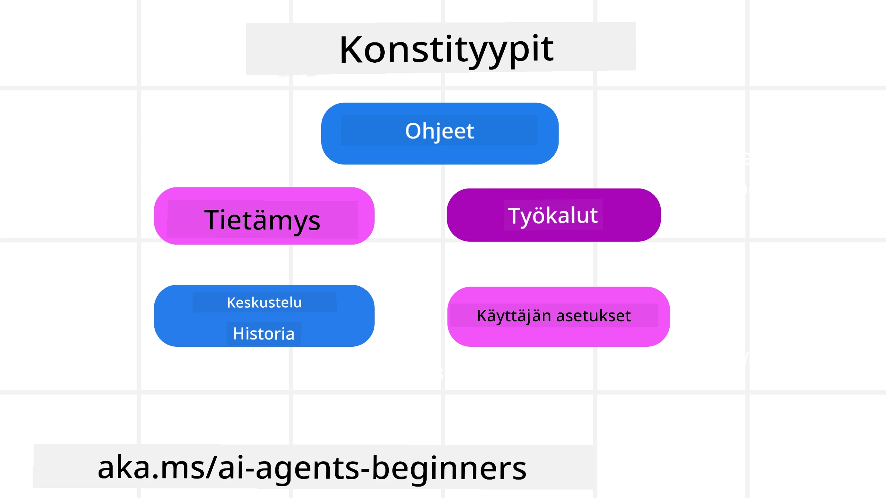
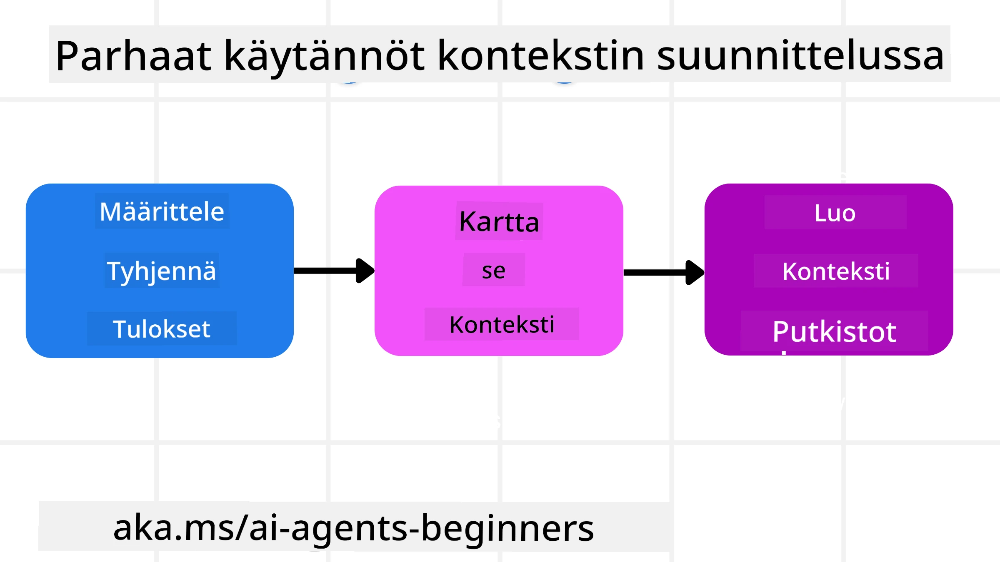

# Kontekstisuunnittelu tekoälyagentteja varten

> _(Klikkaa yllä olevaa kuvaa nähdäksesi tämän oppitunnin videon)_

On tärkeää ymmärtää sen sovelluksen monimutkaisuus, jota varten rakennat tekoälyagenttia, jotta voit tehdä luotettavan sellaisen. Meidän täytyy rakentaa tekoälyagentteja, jotka hallitsevat tietoa tehokkaasti vastatakseen monimutkaisiin tarpeisiin kehittyneempänä kuin pelkkä kehotteiden suunnittelu.

Tässä oppitunnissa tarkastelemme, mitä kontekstisuunnittelu on ja mikä sen rooli on tekoälyagenttien rakentamisessa.

## Johdanto

Tämä oppitunti kattaa:

• **Mikä on kontekstisuunnittelu** ja miksi se eroaa kehotteiden suunnittelusta.

• **Tehokkaan kontekstisuunnittelun strategiat**, mukaan lukien miten kirjoittaa, valita, pakata ja eristää tietoa.

• **Yleiset kontekstiin liittyvät virheet**, jotka voivat haitata tekoälyagenttiasi, ja miten ne korjataan.

## Oppimistavoitteet

Tämän oppitunnin suorittamisen jälkeen osaat:

• **Määritellä kontekstisuunnittelun** ja erottaa sen kehotteiden suunnittelusta.

• **Tunnistaa kontekstin keskeiset osat** suurten kielimallien (LLM) sovelluksissa.

• **Soveltaa strategioita kontekstin kirjoittamiseen, valitsemiseen, pakkaamiseen ja eristämiseen** parantaaksesi agentin suorituskykyä.

• **Tunnistaa yleiset kontekstivirheet**, kuten myrkytys, häirintä, sekaannus ja ristiriita, sekä ottaa käyttöön lieventämistekniikoita.

## Mikä on kontekstisuunnittelu?

Tekoälyagenteille konteksti on se, mikä ohjaa tekoälyagentin suunnittelua tiettyjen toimien suorittamiseen. Kontekstisuunnittelu tarkoittaa käytäntöä, jossa varmistetaan, että tekoälyagentilla on oikea tieto seuraavan tehtävävaiheen suorittamiseen. Konteksti-ikkuna on kooltaan rajoitettu, joten agenttien rakentajina meidän täytyy kehittää järjestelmiä ja prosesseja tiedon lisäämisen, poistamisen ja tiivistämisen hallintaan konteksti-ikkunassa.

### Kehote- ja kontekstisuunnittelu

Kehotesuunnittelu keskittyy yhteen staattiseen ohjeistukseen, joka ohjaa tehokkaasti tekoälyagentteja sääntöjen avulla. Kontekstisuunnittelu puolestaan tarkoittaa dynaamisen tietokokonaisuuden hallintaa, mukaan lukien alkuperäinen kehotte, jotta tekoälyagentilla on tarpeellinen tieto ajan mittaan. Kontekstisuunnittelun pääidea on tehdä tästä prosessista toistettava ja luotettava.

### Kontextin tyypit

On tärkeää muistaa, että konteksti ei ole vain yksi asia. Tekoälyagentin tarvitsemat tiedot voivat tulla monista eri lähteistä, ja meidän tehtävämme on varmistaa, että agentilla on pääsy näihin lähteisiin:

Kontekstityypit, joita tekoälyagentin täytyy hallita, sisältävät:

• **Ohjeet:** Nämä ovat agentin "sääntöjä" – kehotteita, järjestelmäviestejä, muutama esimerkki (jotka näyttävät tekoälylle, miten tehdä jotakin) ja työkalujen kuvauksia, joita se voi käyttää. Tässä kehotteiden suunnittelu ja kontekstisuunnittelu yhdistyvät.

• **Tietämys:** Tämä kattaa faktat, tietokannoista haetun tiedon tai agentin kertyneet pitkäaikaiset muistot. Tämä sisältää Retrieval Augmented Generation (RAG) -järjestelmän integroinnin, jos agentin tarvitsee päästä eri tietovarastoihin ja tietokantoihin.

• **Työkalut:** Nämä ovat ulkoisten toimintojen, sovellusliittymien (API) ja MCP-palvelimien määritelmiä, joita agentti voi kutsua, sekä saamaansa palautetta (tuloksia).

• **Keskusteluhistoria:** Käyttäjän kanssa jatkuva vuoropuhelu. Ajan myötä nämä keskustelut pitenevät ja monimutkaistuvat, mikä vie tilaa konteksti-ikkunassa.

• **Käyttäjän mieltymykset:** Tietoa käyttäjän mieltymyksistä tai inhoista ajan mittaan. Näitä voidaan tallentaa ja käyttää päätöksenteossa käyttäjän auttamiseksi.

## Tehokkaan kontekstisuunnittelun strategiat

### Suunnittelustrategiat

Hyvä kontekstisuunnittelu alkaa hyvästä suunnittelusta. Tässä lähestymistapa, joka auttaa sinua ajattelemaan, miten soveltaa kontekstisuunnittelun konseptia:

1. **Määritä selkeät tulokset** – Tehtävien, jotka tekoälyagenteille annetaan, tulokset tulisi määritellä selkeästi. Vastaa kysymykseen - "Miltä maailma näyttää, kun tekoälyagentti on suorittanut tehtävänsä?" Toisin sanoen, mikä muutos, tieto tai vastaus käyttäjällä tulisi olla vuorovaikutuksen jälkeen.

2. **Kartoitus kontekstista** – Kun olet määrittänyt tekoälyagentin tulokset, sinun tulee vastata kysymykseen "Mitä tietoja tekoälyagentti tarvitsee tämän tehtävän suorittamiseen?". Näin voit alkaa kartoittaa, mistä nämä tiedot löytyvät.

3. **Luo kontekstiputket** – Kun tiedät, mistä tieto löytyy, pitää vastata kysymykseen "Miten agentti saa tämän tiedon?". Tämä voidaan tehdä monella tavalla, kuten RAG, MCP-palvelinten ja muiden työkalujen käytöllä.

### Käytännön strategiat

Suunnittelu on tärkeää, mutta kun tieto alkaa virrata agenttisi konteksti-ikkunaan, tarvitsemme käytännön strategioita sen hallintaan:

#### Kontextin hallinta

Vaikka osa tiedoista lisätään konteksti-ikkunaan automaattisesti, kontekstisuunnittelu tarkoittaa aktiivisempaa roolia tiedon hallinnassa, joka voidaan tehdä seuraavilla strategioilla:

 1. **Agentin muistilappu**  
 Tämä antaa tekoälyagentille mahdollisuuden tehdä muistiinpanoja tämänhetkisistä tehtävistä ja käyttäjän vuorovaikutuksista yhden istunnon aikana. Sen tulisi olla erillään konteksti-ikkunasta tiedostona tai suoritusajankohteen objektina, jonka agentti voi myöhemmin tarvittaessa hakea tällä istunnolla.

 2. **Muistot**  
 Muistilaput sopivat yhden istunnon ulkopuolisen tiedon hallintaan. Muistot mahdollistavat agentin tallentaa ja hakea merkityksellistä tietoa useiden istuntojen yli. Tämä voi sisältää tiivistelmiä, käyttäjän mieltymyksiä ja palautetta tulevaa parantamista varten.

 3. **Kontekstin pakkaaminen**  
 Kun konteksti-ikkuna kasvaa ja lähestyy rajaansa, voidaan käyttää tekniikoita kuten tiivistämistä ja karsimista. Tämä voi tarkoittaa joko säilyttämällä vain kaikkein oleellisimmat tiedot tai poistamalla vanhempia viestejä.

 4. **Moni-agenttijärjestelmät**  
 Moni-agenttijärjestelmien kehittäminen on eräänlaista kontekstisuunnittelua, koska jokaisella agentilla on oma konteksti-ikkunansa. Miten tämä konteksti jaetaan ja siirretään eri agenteille on toinen suunnittelun kohde näitä järjestelmiä rakentamalla.

 5. **Hiekkalaatikkoympäristöt**  
 Jos agentin täytyy ajaa koodia tai käsitellä suuria tietomääriä dokumentissa, se voi vaatia paljon tokeneita tulosten prosessointiin. Sen sijaan, että kaikki tallennettaisiin konteksti-ikkunaan, agentti voi käyttää hiekkalaatikkoympäristöä, joka kykenee suorittamaan koodin ja lukemaan vain tulokset ja muut olennaiset tiedot.

 6. **Suoritustilan objektit**  
 Tämä tehdään luomalla tietokontteja hallitsemaan tilanteita, joissa agentin täytyy päästä käsiksi tiettyihin tietoihin. Monimutkaisessa tehtävässä tämä mahdollistaa agentin tallentaa jokaisen alatehtävän tulokset vaiheittain, jolloin konteksti pysyy yhteydessä vain kyseiseen alatehtävään.

#### Kontextin tarkastus

Kun olet soveltanut jotakin näistä strategioista, kannattaa tarkistaa, mitä seuraava mallikutsu todella sai. Hyvä vianetsintäkysymys on:

> Lataiko agentti liikaa kontekstia, väärää kontekstia vai jäi puuttumaan konteksti, jota se tarvitsi?

Tähän kysymykseen ei tarvitse kirjata raakakehotteita, työkalujen tuloksia tai muistosisältöjä. Tuotannossa suositaan pieniä kontekstin tarkastuslokeja, jotka tallentavat laskemat, tunnisteet, hajautukset ja politiikan tarrat:

- **Valinta:** Seuraa, kuinka monta ehdokasta, työkalua tai muistoa harkittiin, kuinka monta valittiin ja mikä sääntö tai pisteytys aiheutti muiden suodattamisen pois.
- **Pakkaus:** Tallenna lähdealue tai jäljitystunnus, tiivistelmän tunnus, arvioitu tokenimäärä ennen ja jälkeen pakkauksen, ja oliko raakasisältö pois seuraavasta kutsusta.
- **Eristys:** Merkitse, mikä alatehtävä suoritettiin erillisessä agentissa, istunnossa tai hiekkalaatikossa, mikä rajattu tiivistelmä palautettiin ja pysyikö suuri työkalutulos emäagentin kontekstin ulkopuolella.
- **Muisti ja RAG:** Tallenna haettujen dokumenttien tunnukset, muistotunnukset, pisteet, valitut tunnukset ja punaisuustilanne kokonaisen haetun tekstin sijaan.
- **Turvallisuus ja yksityisyys:** Suosi hajautuksia, tunnuksia, token-ämpäreitä ja politiikan tarroja arkaluonteisen kehotetekstin, työkalujen argumenttien, tulosten tai käyttäjän muistosisältöjen sijaan.

Tavoitteena ei ole säilyttää enemmän kontekstia, vaan jättää tarpeeksi todisteita, jotta kehittäjä voi tietää, mikä kontekstistrategia toimi ja muutti seuraavan mallikutsun tarkoitetulla tavalla.

### Esimerkki kontekstisuunnittelusta

Sanotaan, että haluamme tekoälyagentin suorittavan **"Varaa minulle matka Pariisiin."**

• Yksinkertainen agentti, joka käyttää vain kehotteiden suunnittelua, vastaisi vain: **"Okei, milloin haluaisit mennä Pariisiin?"** Se käsitteli vain käyttäjän suoraa kysymystä siinä hetkessä.

• Agentti, joka käyttää edellä kuvatun kaltaisia kontekstisuunnittelun strategioita, tekisi paljon enemmän. Ennen vastaamista sen järjestelmä voisi:

  ◦ **Tarkistaa kalenterisi** vapaiden päivien osalta (hakien reaaliaikaista tietoa).

 ◦ **Muistaa aiemmat matkatoiveesi** (pitkäaikaisesta muistista) kuten suosiman lentoyhtiön, budjetin tai halun suoriin lentoihin.

 ◦ **Tunnistaa käytettävissä olevat työkalut** lentojen ja hotellivarauksen tekemiseen.

- Sitten esimerkkivastaus voisi olla: "Hei [Nimesi]! Näen, että olet vapaana lokakuun ensimmäisellä viikolla. Haluatko, että etsin suoria lentoja Pariisiin [Suositeltu lentoyhtiö] käytössäsi olevalla budjetilla [Budjetti]?" Tämä rikkaampi, kontekstitietoinen vastaus osoittaa kontekstisuunnittelun voiman.

## Yleiset kontekstiin liittyvät virheet

### Kontekstin myrkytys

**Mitä se on:** Kun harha (LLM:n generoima virhetieto) tai virhe pääsee kontekstiin ja sitä toistuvasti viitataan, aiheuttaen agentin pyrkivän mahdottomiin tavoitteisiin tai kehittävän järjettömiä strategioita.

**Mitä tehdä:** Ota käyttöön **kontekstin validointi** ja **eristys**. Tarkista tiedot ennen kuin ne lisätään pitkäaikaiseen muistiin. Jos mahdollinen myrkytys havaitaan, aloita uudet kontekstiketjut estämään huonon tiedon leviämistä.

**Matkanvarausesimerkki:** Agenttisi hakee harhakuvitelman **suorasta lennosta pieneltä paikalliselta lentokentältä kaukaiseen kansainväliseen kaupunkiin**, jonne ei oikeasti ole kansainvälisiä lentoja. Tämä olematon lentotieto tallentuu kontekstiin. Myöhemmin kun pyydät agenttia varaamaan, se yrittää yhä etsiä lippuja tälle mahdottomalle reitille, aiheuttaen toistuvia virheitä.

**Ratkaisu:** Toteuta vaihe, jossa **tarkistetaan lennon olemassaolo ja reitit reaaliaikaisella API:lla** _ennen_ lentotiedon lisäämistä agentin työskentelykontekstiin. Jos tarkistus epäonnistuu, virheelliset tiedot "eristetään" eikä niitä käytetä enää.

### Kontekstin häirintä

**Mitä se on:** Kun konteksti kasvaa niin suureksi, että malli keskittyy liikaa kertynyttä historiaa käyttäen sitä enemmän kuin koulutuksessa oppimaansa, mikä johtaa toistuviin tai turhiin toimintoihin. Mallit saattavat alkaa tehdä virheitä jo ennen konteksti-ikkunan täyttymistä.

**Mitä tehdä:** Käytä **kontekstin tiivistämistä**. Pakkaa ajoittain kertyneet tiedot lyhyemmiksi tiivistelmiksi, säilyttäen tärkeät yksityiskohdat ja poistamalla päällekkäistä historiaa. Tämä auttaa "nollaamaan" tarkennuksen.

**Matkanvarausesimerkki:** Olet keskustellut pitkään erilaisista unelmakohteista ja todennut yksityiskohtaisesti reppureissusi kahden vuoden takaa. Kun lopulta pyydät **"etsi minulle halpa lento ensi kuuksi",** agentti jumittuu vanhoihin merkityksettömiin yksityiskohtiin ja kysyy jatkuvasti reppureissusi varusteista tai menneistä matkaohjelmista laiminlyöden nykyisen pyynnön.

**Ratkaisu:** Tietyn kierrosmäärän jälkeen tai kun konteksti kasvaa liian suureksi, agentin tulisi **tiivistää keskustelun viimeisimmät ja oleellisimmat osat** – keskittyen nykyisiin matkapäiviisi ja kohteeseen – ja käyttää tätä tiivistettyä yhteenvetoa seuraavassa LLM-kutsussa hyläten vähemmän relevantin keskusteluhistorian.

### Kontekstin sekaannus

**Mitä se on:** Kun tarpeeton konteksti, usein liian monien käytettävissä olevien työkalujen muodossa, saa mallin tuottamaan huonoja vastauksia tai kutsumaan asiaankuulumattomia työkaluja. Pienemmät mallit ovat erityisen alttiita tälle.

**Mitä tehdä:** Ota käyttöön **työkalujen valikon hallinta** käyttämällä RAG-tekniikoita. Tallenna työkalujen kuvaukset vektoritietokantaan ja valitse _ainoastaan_ tehtävään relevantit työkalut kullekin tehtävälle. Tutkimukset osoittavat, että työkaluvalintojen rajoittaminen alle 30:een on tehokasta.

**Matkanvarausesimerkki:** Agentillasi on käytettävissään kymmeniä työkaluja: `book_flight` (lennon varaus), `book_hotel` (hotellin varaus), `rent_car` (autonvuokraus), `find_tours` (retket), `currency_converter` (valuutanmuunnin), `weather_forecast` (sääennuste), `restaurant_reservations` (ravintolavaraukset) jne. Kysyt, **"Mikä on paras tapa liikkua Pariisissa?"** Tän suuren työkalujen määrän vuoksi agentti hämmentyy ja yrittää varata `book_flight` -työkalun _Pariisin sisäisiin matkoihin_ tai vuokrata auton, vaikka suosisit julkista liikennettä, koska työkalujen kuvaukset saattavat olla päällekkäisiä tai agentti ei pysty erottelemaan parasta työkalua.

**Ratkaisu:** Käytä **RAG:ia työkalukuvausten päällä**. Kun kysyt liikkumistapaa Pariisissa, järjestelmä hakee dynaamisesti _ainoastaan_ relevantteja työkaluja kuten `rent_car` tai `public_transport_info` käyttäjän kyselyn perusteella, esitellen kohdennetun työkalurepertuaarin LLM:lle.

### Kontekstiristiriita

**Mitä se on:** Kun kontekstissa on ristiriitaista tietoa, mikä johtaa epäjohdonmukaiseen päättelyyn tai huonoihin lopullisiin vastauksiin. Tämä tapahtuu usein, kun tiedot saapuvat vaiheittain ja aikaiset virheelliset olettamukset säilyvät kontekstissa.

**Mitä tehdä:** Käytä **kontekstin karsintaa** ja **siirtämistä**. Karsinta tarkoittaa vanhentuneen tai ristiriitaisen tiedon poistamista uusien tietojen saapuessa. Siirtäminen antaa mallille erillisen "muistilapun" työtilan, jossa tieto voidaan käsitellä ilman, että pääkontekstiin kertyy sekavuutta.
**Matkanvarausesimerkki:** Aluksi kerrot agentillesi, **"Haluan lentää turistiluokassa."** Keskustelun edetessä muutat mielesi ja sanot, **"Itse asiassa tällä matkalla mennään bisnesluokassa."** Jos molemmat ohjeet jäävät kontekstiin, agentti saattaa saada ristiriitaisia hakutuloksia tai sekoittaa, kumpaa mieltymystä pitäisi asettaa etusijalle.

**Ratkaisu:** Ota käyttöön **kontekstin karsiminen**. Kun uusi ohje on ristiriidassa vanhan kanssa, vanha ohje poistetaan tai korvataan selkeästi kontekstissa. Vaihtoehtoisesti agentti voi käyttää **muistiinpanovälinettä** ristiriitaisten mieltymysten sovittamiseen ennen päätöksen tekemistä, varmistaen, että vain lopullinen ja johdonmukainen ohje ohjaa sen toimintaa.

## Lisää kysymyksiä kontekstisuunnittelusta?

Liity [Microsoft Foundry Discordiin](https://aka.ms/ai-agents/discord) tavata muiden oppijoiden kanssa, osallistua toimistoaikoihin ja saada vastaukset AI-agentteihin liittyviin kysymyksiisi.

---

<!-- CO-OP TRANSLATOR DISCLAIMER START -->
**Vastuuvapauslauseke**:
Tämä asiakirja on käännetty käyttämällä tekoälypohjaista käännöspalvelua [Co-op Translator](https://github.com/Azure/co-op-translator). Vaikka pyrimme tarkkuuteen, otathan huomioon, että automaattiset käännökset saattavat sisältää virheitä tai epätarkkuuksia. Alkuperäinen asiakirja sen alkuperäiskielellä on virallinen lähde. Tärkeissä asioissa suositellaan ammattimaista ihmiskäännöstä. Emme ole vastuussa tämän käännöksen käytöstä aiheutuvista väärinymmärryksistä tai tulkinnoista.
<!-- CO-OP TRANSLATOR DISCLAIMER END -->