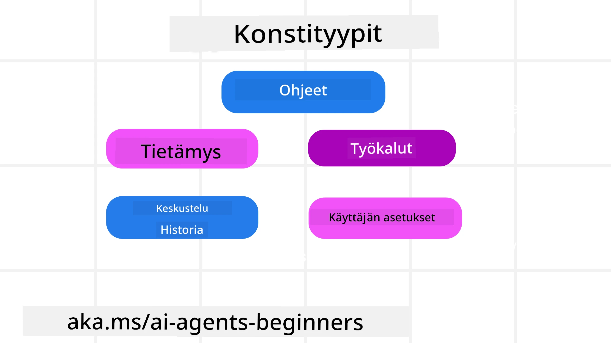
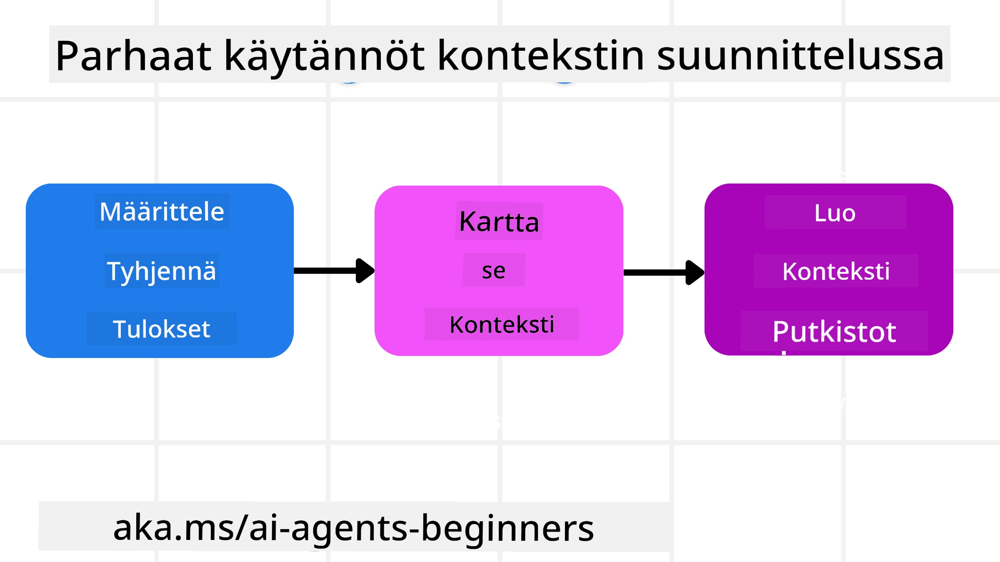

# Kontekstisuunnittelu tekoälyagentteja varten

> _(Napsauta kuvaa yllä nähdäksesi tämän oppitunnin videon)_

On tärkeää ymmärtää sen sovelluksen monimutkaisuus, jota varten rakennat tekoälyagenttia, jotta siitä saadaan luotettava. Meidän täytyy rakentaa tekoälyagentteja, jotka tehokkaasti hallitsevat tietoa monimutkaisten tarpeiden täyttämiseksi beyond kehotemuotoilun.

Tässä oppitunnissa tarkastelemme, mitä kontekstisuunnittelu on ja minkä roolin se näyttelee tekoälyagenttien rakentamisessa.

## Johdanto

Tämä oppitunti käsittelee:

• **Mitä kontekstisuunnittelu on** ja miksi se eroaa kehotemuotoilusta.

• **Tehokkaan kontekstisuunnittelun strategioita**, mukaan lukien miten kirjoittaa, valita, puristaa ja eristää tietoa.

• **Yleisiä kontekstivirheitä**, jotka voivat sabotoida tekoälyagenttisi ja miten ne korjataan.

## Oppimistavoitteet

Oppitunnin suorittamisen jälkeen ymmärrät, miten:

• **Määritellään kontekstisuunnittelu** ja erotetaan se kehotemuotoilusta.

• **Tunnistetaan kontekstin keskeiset osat** suurten kielimallien (LLM) sovelluksissa.

• **Sovelletaan strategioita kontekstin kirjoittamiseen, valitsemiseen, puristamiseen ja eristämiseen** agentin suorituskyvyn parantamiseksi.

• **Tunnistetaan yleiset kontekstivirheet** kuten myrkytys, häiriöt, sekaannukset ja ristiriidat sekä toteutetaan lieventämistekniikat.

## Mitä kontekstisuunnittelu on?

Tekoälyagenteille konteksti ohjaa tekoälyagentin suunnitelmaa tiettyjen toimien toteuttamiseksi. Kontekstisuunnittelu on käytäntö, jolla varmistetaan, että tekoälyagentilla on oikea tieto tehtävän seuraavan vaiheen suorittamiseen. Konteksti-ikkuna on kooltaan rajattu, joten agentin rakentajina meidän on kehitettävä järjestelmiä ja prosesseja, jotka hallitsevat tiedon lisäämistä, poistamista ja tiivistämistä konteksti-ikkunaan.

### Kehotemuotoilu vs. kontekstisuunnittelu

Kehotemuotoilu keskittyy yhteen staattiseen ohjetekstiin, jolla ohjataan tekoälyagentteja säännöstön avulla. Kontekstisuunnittelu puolestaan tarkoittaa dynaamisen tietojoukon hallintaa, mukaan lukien alkuperäinen kehotus, jotta tekoälyagentilla on ajan mittaan tarvittava tieto. Tärkein ajatus kontekstisuunnittelussa on tehdä tästä prosessista toistettava ja luotettava.

### Kontekstin tyypit

On tärkeää muistaa, ettei konteksti ole vain yksi asia. Tieto, jota tekoälyagentti tarvitsee, voi tulla monista eri lähteistä, ja meidän tehtävämme on varmistaa, että agentilla on pääsy näihin lähteisiin:

Tekoälyagentin tarvitsemia kontekstityyppejä ovat esimerkiksi:

• **Ohjeet:** Nämä ovat agentin "sääntöjä" – kehotteita, järjestelmäviestejä, muutamia esimerkkejä (joilla näytetään tekoälylle, miten tehdä jotain) ja työkalujen kuvauksia. Tässä kehotemuotoilun painopiste kohtaa kontekstisuunnittelun.

• **Tieto:** Tämä kattaa faktat, tietokannoista haetun tiedon tai agentin kerryttämän pitkäaikaisen muistin. Tämä sisältää myös hakua tukevan generoinnin (RAG) järjestelmän integroinnin, jos agentti tarvitsee pääsyn erilaisiin tietovarantoihin ja tietokantoihin.

• **Työkalut:** Nämä ovat määritelmiä ulkoisista toiminnoista, rajapinnoista ja MCP-palvelimista, joita agentti voi kutsua, sekä saamistaan palauteista (tuloksista).

• **Keskusteluhistoria:** Käyttäjän kanssa käytävä jatkuva vuoropuhelu. Ajan myötä nämä keskustelut pitenevät ja monimutkaistuvat, mikä vie tilaa konteksti-ikkunasta.

• **Käyttäjän mieltymykset:** Tieto käyttäjän mieltymyksistä tai inhokkeista ajan mittaan. Näitä voidaan tallentaa ja hyödyntää tärkeiden päätösten tekemisessä käyttäjän avuksi.

## Tehokkaan kontekstisuunnittelun strategiat

### Suunnittelustrategiat

Hyvä kontekstisuunnittelu alkaa hyvästä suunnittelusta. Tässä lähestymistapa, joka auttaa sinua pohtimaan, miten soveltaa kontekstisuunnittelun käsitettä:

1. **Määrittele selkeät tulokset** – tehtävien tulokset, jotka tekoälyagenteille annetaan, on määriteltävä selkeästi. Vastaa kysymykseen: "Miltä maailma näyttää, kun tekoälyagentti on suorittanut tehtävänsä?" Toisin sanoen, mikä muutos, tieto tai vastaus käyttäjälle pitäisi olla saatavilla tekoälyagentin vuorovaikutuksen jälkeen.
2. **Kartoituksen konteksti** – Kun olet määritellyt tekoälyagentin tulokset, sinun tulee vastata kysymykseen "Mitä tietoja tekoälyagentti tarvitsee tämän tehtävän suorittamiseen?". Näin voit aloittaa sen ympäristön kartoittamisen, mistä tuo tieto löytyy.
3. **Luo kontekstiputkia** – Kun tiedät, mistä tieto löytyy, sinun tulee vastata kysymykseen "Miten agentti saa tämän tiedon?". Tämä voidaan tehdä monin tavoin, kuten RAG:n, MCP-palvelimien ja muiden työkalujen avulla.

### Käytännön strategiat

Suunnittelu on tärkeää, mutta kun tieto alkaa virrata agentin konteksti-ikkunaan, tarvitsemme käytännön strategioita sen hallintaan:

#### Kontekstin hallinta

Vaikka osa tiedosta lisätään konteksti-ikkunaan automaattisesti, kontekstisuunnittelu tarkoittaa aktiivisempaa roolia tämän tiedon hallinnassa, mikä voidaan tehdä muutamin strategioin:

 1. **Agentin muistiinpanoalue**
 Tämä antaa tekoälyagentin mahdollisuuden tehdä muistiinpanoja merkityksellisistä tiedoista nykyisten tehtävien ja käyttäjävuorovaikutusten aikana yhdellä istunnolla. Tämä tulisi olla konteksti-ikkunan ulkopuolella tiedostona tai suorituskohteena, jonka agentti voi myöhemmin palauttaa tarvittaessa tänä istuntona.

 2. **Muistot**
 Muistiinpanot sopivat tiedon hallintaan yhden istunnon konteksti-ikkunan ulkopuolella. Muistot mahdollistavat agenttien tallentaa ja hakea merkityksellistä tietoa useiden istuntojen yli. Tämä voisi sisältää yhteenvetoja, käyttäjäasetuksia ja palautetta tulevia parannuksia varten.

 3. **Kontekstin puristaminen**
  Kun konteksti-ikkuna kasvaa ja lähestyy rajojaan, voidaan käyttää tekniikoita kuten tiivistäminen ja karsiminen. Tämä tarkoittaa joko kaikkein olennaisimmasta tiedosta pitämistä tai vanhempien viestien poistamista.
  
 4. **Moniagenttijärjestelmät**
  Moniagenttijärjestelmien kehittäminen on eräänlainen kontekstisuunnittelu, koska jokaisella agentilla on oma konteksti-ikkunansa. Miten konteksti jaetaan ja siirretään eri agenttien välillä, on toinen asia, joka on suunniteltava näitä järjestelmiä rakennettaessa.
  
 5. **Hiekkalaatikkoympäristöt**
  Jos agentin täytyy suorittaa koodia tai käsitellä suuria määriä tietoja dokumentissa, tämä voi kuluttaa paljon token-määrää tulosten prosessoinnissa. Sen sijaan, että tämä kaikki säilytetään konteksti-ikkunassa, agentti voi käyttää hiekkalaatikkoympäristöä, joka pystyy suorittamaan koodin ja lukemaan vain tulokset ja muut merkitykselliset tiedot.
  
 6. **Suoritusaikaiset tilakohteet**
   Tämä toteutetaan luomalla tietosisältöjä tilanteiden hallintaan, joissa agentin täytyy päästä käsiksi tiettyyn tietoon. Monimutkaisessa tehtävässä tämä mahdollistaisi agentin tallentaa tulokset jokaisesta alitehtävästä vaihe vaiheelta, jolloin konteksti pysyy kytkettynä vain kyseiseen alitehtävään.

#### Kontekstin tarkastelu

Näiden strategioiden soveltamisen jälkeen on hyödyllistä tarkistaa, mitä seuraava mallikutsu todella sai. Käytännöllinen virheenkorjauskysymys on:

> Latasiko agentti liikaa kontekstia, väärää kontekstia vai puuttuiko tarvitsemaansa kontekstia?

Tätä kysymystä ei tarvitse vastata kirjaamalla raakamuotoisia kehotteita, työkalujen tulosteita tai muistisisältöjä. Tuotannossa suositaan pieniä kontekstitarkastelutietueita, jotka tallentavat määrät, tunnisteet, tiivisteet ja käytäntötunnisteet:

- **Valinta:** Seuraa, kuinka monta ehdokaspalasta, työkalua tai muistia harkittiin, kuinka monta valittiin ja mikä sääntö tai pisteytys suodatti muut pois.
- **Puristus:** Tallenna lähdealue tai jäljitystunnus, yhteenvedon tunnus, arvioitu tokenien määrä ennen ja jälkeen puristuksen sekä oliko raakasisältö poissuljettu seuraavasta kutsusta.
- **Eristys:** Kirjaa, mikä alitehtävä ajettiin erillisessä agentissa, istunnossa tai hiekkalaatikossa, mikä rajattu yhteenveto palautettiin ja pysyikö suuri työkalutulos pääagentin kontekstin ulkopuolella.
- **Muisti ja RAG:** Tallenna hakudokumenttien tunnisteet, muistien tunnisteet, pisteet, valitut tunnisteet ja muokkaustila täydellisen haetun tekstin sijaan.
- **Turvallisuus ja yksityisyys:** Suosi tiivisteitä, tunnisteita, token-säiliöitä ja käytäntötunnisteita arkaluonteisen kehotetekstin, työkalujen argumenttien, työkalujen tulosten tai käyttäjän muistin runkojen sijaan.

Tavoitteena ei ole säilyttää enemmän kontekstia. Tavoitteena on jättää riittävästi todisteita, jotta kehittäjä voi nähdä, mikä kontekstistrategia suoritettiin ja muutiko se seuraavan mallikutsun tarkoitetulla tavalla.

### Esimerkki kontekstisuunnittelusta

Sanotaan, että haluamme tekoälyagentin **"Varaa minulle matka Pariisiin."**

• Yksinkertainen agentti, joka käyttää pelkästään kehotemuotoilua, voisi vastata: **"Ok, milloin haluaisit mennä Pariisiin?"** Se käsitteli vain käyttäjän suoraa kysymystä silloin.

• Agentti, joka käyttää tässä käsiteltyjä kontekstisuunnittelun strategioita, tekisi paljon enemmän. Ennen vastaamista sen järjestelmä voisi:

  ◦ **Tarkistaa kalenterisi** saatavilla olevien päivämäärien varalta (hakea reaaliaikaista dataa).

 ◦ **Muistaa aiemmat matkamieltymykset** (pitkäaikaisesta muistista) kuten suosikki lentoyhtiösi, budjetin tai halutko suoria lentoja.

 ◦ **Tunnistaa käytettävissä olevat työkalut** lentojen ja hotellien varaamiseen.

- Esimerkiksi vastaus voisi olla: "Hei [Nimesi]! Näen, että olet vapaa lokakuun ensimmäisellä viikolla. Etsinkö suoria lentoja Pariisiin [suosikki lentoyhtiö] budjetillasi [budjetti]?" Tämä rikkaampi, kontekstitietoinen vastaus osoittaa kontekstisuunnittelun voiman.

## Yleiset kontekstivirheet

### Kontekstin myrkytys

**Mitä se on:** Kun harha eli väärä tieto (LLM:n generoima virheellinen tieto) tai virhe pääsee kontekstiin ja siihen viitataan toistuvasti, mikä saa agentin tavoittelemaan mahdottomia päämääriä tai kehittämään järjettömiä strategioita.

**Mitä tehdä:** Toteuta **kontekstin validointi** ja **eristäminen**. Vahvista tiedot ennen niiden lisäämistä pitkäaikaiseen muistiin. Jos epäillään myrkytystä, aloita uudet kontekstilankat estääksesi virheellisen tiedon leviämisen.

**Matkanvarausesimerkki:** Agentti hallusinoi **suoran lennon pieneltä paikalliselta lentokentältä kaukaiseen kansainväliseen kaupunkiin**, joka ei todellisuudessa tarjoa kansainvälisiä lentoja. Tämä olematon lentotieto tallennetaan kontekstiin. Kun myöhemmin pyydät varaamaan matkan, agentti yrittää yhä löytää lippuja tälle mahdottomalle reitille, mikä johtaa toistuviin virheisiin.

**Ratkaisu:** Toteuta vaihe, joka **vahvistaa lentojen olemassaolon ja reitit reaaliaikaisen API:n avulla** _ennen kuin_ lisäät lentotiedon agentin työskentelykontekstiin. Jos vahvistus epäonnistuu, virheellinen tieto "eristetään" eikä sitä käytetä enää.

### Kontekstihäiriö

**Mitä se on:** Kun konteksti kasvaa liian laajaksi, malli keskittyy liian paljon kertynyttä historiaa kohtaan eikä siihen, mitä se on oppinut koulutuksen aikana, mikä johtaa toistuviin tai turhiin toimiin. Mallit voivat alkaa tehdä virheitä jo ennen kuin konteksti-ikkuna täyttyy.

**Mitä tehdä:** Käytä **kontekstin tiivistämistä**. Purista kertynyttä tietoa säännöllisesti lyhyemmiksi yhteenvetoiksi, säilyttäen tärkeät tiedot ja poistaen turhan historian. Tämä auttaa palauttamaan keskittymisen.

**Matkanvarausesimerkki:** Olette keskustelleet unelmakohteistasi pitkään, mukaan lukien yksityiskohtainen kertomus selkärepulla tehdystä matkasta kaksi vuotta sitten. Kun lopulta pyydät **"etsi minulle halpa lento ensi kuulle",** agentti juuttuu vanhoihin, epäolennaisiin yksityiskohtiin ja kysyy jatkuvasti repuntarvikkeistasi tai aiemmista matkareiteistä, mutta jättää huomiotta nykyisen pyyntösi.

**Ratkaisu:** Tietyn määrän vuorojen jälkeen tai kontekstin kasvaessa liian suureksi agentin tulisi **tiivistää keskustelun viimeisimmät ja olennaisimmat osat** – keskittyen nykyisiin matkapäiviisi ja kohteeseen – ja käyttää tätä tiivistettyä yhteenvetoa seuraavassa LLM-kutsussa, hyläten vähemmän tärkeät historialliset osat.

### Kontekstisekavuus

**Mitä se on:** Kun tarpeeton konteksti, usein liian monien käytettävissä olevien työkalujen muodossa, aiheuttaa mallin tuottamaan huonoja vastauksia tai kutsumaan epäolennaisia työkaluja. Pienemmät mallit ovat erityisen alttiita tälle.

**Mitä tehdä:** Toteuta **työkalujen kuormanhallinta** käyttäen RAG-tekniikoita. Tallenna työkalujen kuvaukset vektoritietokantaan ja valitse _vain_ olennaisimmat työkalut kutakin tehtävää varten. Tutkimukset osoittavat, että työkalujen valinnan rajaaminen alle 30:een on suositeltavaa.

**Matkanvarausesimerkki:** Agentillasi on käytössä kymmeniä työkaluja: `book_flight`, `book_hotel`, `rent_car`, `find_tours`, `currency_converter`, `weather_forecast`, `restaurant_reservations` jne. Kysyt, **"Mikä on paras tapa liikkua Pariisissa?"** Työkalujen määrän takia agentti hämmentyy ja yrittää kutsua `book_flight` _Pariisin sisällä_ tai `rent_car` vaikka suosittelet julkista liikennettä, koska työkalukuvausten päällekkäisyys tai epäselvyys estää parhaan valinnan.

**Ratkaisu:** Käytä **RAG:ia työkalukuvauksissa**. Kun kysyt liikkumisesta Pariisissa, järjestelmä hakee dynaamisesti _vain_ tarpeellisimmat työkalut kuten `rent_car` tai `public_transport_info` kyselysi perusteella, ja tarjoaa keskittyneen työkalukuormituksen LLM:lle.

### Kontekstiristiriita

**Mitä se on:** Kun ristiriitainen tieto on kontekstissa, mikä johtaa epäjohdonmukaiseen päättelyyn tai huonoihin lopullisiin vastauksiin. Tämä tapahtuu usein, kun tieto saapuu vaiheittain ja varhaiset virheelliset oletukset jäävät kontekstiin.

**Mitä tehdä:** Käytä **kontekstin karsimista** ja **poistamista**. Karsiminen tarkoittaa vanhentuneen tai ristiriitaisen tiedon poistamista uusien tietojen saapuessa. Poistaminen antaa mallille erillisen "muistiinpanotilan" tiedon käsittelyyn ilman, että tieto sotkee pääkontekstia.

**Matkanvarausesimerkki:** Aluksi kerrot agentillesi, **"Haluan lentää turistiluokassa."** Myöhemmin keskustelun aikana muutat mieltäsi ja sanot, **"Oikeastaan, tällä matkalla mennään bisnesluokassa."** Jos molemmat ohjeet pysyvät kontekstissa, agentti saattaa saada ristiriitaisia hakutuloksia tai sekoittaa, kumpaa mieltymystä tulisi ensisijaisesti noudattaa.

**Ratkaisu:** Toteuta **kontekstin karsiminen**. Kun uusi ohje on ristiriidassa vanhan kanssa, vanha ohje poistetaan tai korvataan selkeästi kontekstissa. Vaihtoehtoisesti agentti voi käyttää **muistiinpanovälinettä** ristiriitaisten mieltymysten sovittamiseen ennen päätöksentekoa, jolloin vain lopullinen, johdonmukainen ohje ohjaa sen toimintaa.

## Lisää kysymyksiä kontekstisuunnittelusta?

Liity [Microsoft Foundryn Discordiin](https://discord.com/invite/ATgtXmAS5D) tavataksesi muita oppijoita, osallistuaksesi toimistoaikoihin ja saadaksesi vastauksia tekoälyagenttien kysymyksiin.

---

<!-- CO-OP TRANSLATOR DISCLAIMER START -->
**Vastuuvapauslauseke**:
Tämä asiakirja on käännetty käyttämällä tekoälypohjaista käännöspalvelua [Co-op Translator](https://github.com/Azure/co-op-translator). Vaikka pyrimme tarkkuuteen, otathan huomioon, että automaattiset käännökset saattavat sisältää virheitä tai epätarkkuuksia. Alkuperäinen asiakirja sen alkuperäiskielellä on virallinen lähde. Tärkeissä asioissa suositellaan ammattimaista ihmiskäännöstä. Emme ole vastuussa tämän käännöksen käytöstä aiheutuvista väärinymmärryksistä tai tulkinnoista.
<!-- CO-OP TRANSLATOR DISCLAIMER END -->