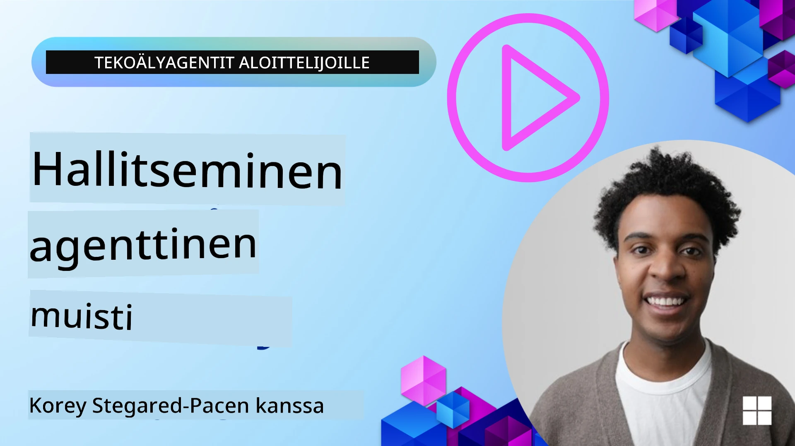

# Muisti tekoälyagenteille 

Kun keskustellaan tekoälyagenttien ainutlaatuisista hyödyistä, kaksi asiaa nousevat päällimmäisinä esiin: kyky kutsua työkaluja tehtävien suorittamiseksi ja kyky parantua ajan myötä. Muisti on perustana itseään parantavien agenttien luomiselle, jotka voivat tarjota parempia kokemuksia käyttäjillemme.

Tässä oppitunnissa tarkastelemme, mitä muisti tarkoittaa tekoälyagenteille ja miten voimme hallita sitä ja käyttää sitä sovellustemme hyödyksi.

## Johdanto

Tämä oppitunti käsittelee:

• **Tekoälyagentin muistin ymmärtäminen**: Mitä muisti on ja miksi se on oleellista agenteille.

• **Muistin toteuttaminen ja tallentaminen**: Käytännön menetelmiä muistitoimintojen lisäämiseksi tekoälyagenteille, keskittyen lyhytaikaiseen ja pitkäaikaiseen muistiin.

• **Tekoälyagenttien itsensä parantaminen**: Miten muisti mahdollistaa agenttien oppimisen aiemmista vuorovaikutuksista ja parantumisen ajan mittaan.

## Saatavilla olevat toteutukset

Tämä oppitunti sisältää kaksi kattavaa muistikirjaopasta:

• **[13-agent-memory.ipynb](./13-agent-memory.ipynb)**: Toteuttaa muistin Mem0:lla ja Azure AI Searchilla Microsoft Agent Frameworkin kanssa

• **[13-agent-memory-cognee.ipynb](./13-agent-memory-cognee.ipynb)**: Toteuttaa jäsennetyn muistin Cognee:n avulla, rakennettaen automaattisesti upotuksiin perustuvan tietopohjan, visualisoiden graafin ja tarjoten älykkään haun

## Oppimistavoitteet

Oppitunnin suorittamisen jälkeen osaat:

• **Erottaa eri tyyppiset tekoälyagentin muistit**, mukaan lukien työ-, lyhytaikainen ja pitkäaikainen muisti sekä erikoistuneet muodot, kuten persoonamuisti ja episodimuisti.

• **Toteuttaa ja hallita lyhytaikaista ja pitkäaikaista muistia tekoälyagenteille** käyttäen Microsoft Agent Frameworkia, hyödyntäen työkaluja kuten Mem0, Cognee, Whiteboard-muisti ja integroiden Azure AI Searchin.

• **Ymmärtää itseään parantavien tekoälyagenttien periaatteet** ja miten vahva muistinhallinta tukee jatkuvaa oppimista ja sopeutumista.

## Tekoälyagentin muistin ymmärtäminen

Ytimeltään **muisti tekoälyagenteille viittaa mekanismeihin, jotka sallivat niiden säilyttää ja palauttaa tietoa**. Tämä tieto voi olla yksityiskohtia keskustelusta, käyttäjäasetuksista, aiemmista toimista tai jopa opituista malleista.

Ilman muistia tekoälysovellukset ovat usein tilattomia, mikä tarkoittaa, että jokainen vuorovaikutus alkaa alusta. Tämä johtaa toistuviin ja turhauttaviin käyttökokemuksiin, joissa agentti "unohtaa" aiemman kontekstin tai mieltymykset.

### Miksi muisti on tärkeää?

Agentin älykkyys liittyy syvästi sen kykyyn palauttaa ja hyödyntää aiempaa tietoa. Muisti mahdollistaa agenttien olevan:

• **Pohdiskelevia**: Oppimista menneistä toimista ja tuloksista.

• **Vuorovaikutteisia**: Kontekstin ylläpitämistä käynnissä olevan keskustelun aikana.

• **Ennakoivia ja reaktiivisia**: Tarpeiden ennakointia tai asianmukaista reagointia historiallisten tietojen perusteella.

• **Autonomisia**: Toimimista itsenäisemmin hyödyntämällä tallennettua tietämystä.

Muistin toteuttamisen tavoitteena on tehdä agenteista **luotettavampia ja taitavampia**.

### Muistin tyypit

#### Työmuisti

Ajattele tätä kuin muistilappua, jota agentti käyttää yhden jatkuvan tehtävän tai ajatusprosessin aikana. Se sisältää välittömän tiedon, joka tarvitaan seuraavan askeleen laskemiseen.

Tekoälyagenteille työmuisti kaappaa usein keskustelun olennaisimman tiedon, vaikka koko keskusteluhistoria olisi pitkä tai katkaistu. Se keskittyy avainelementtien, kuten vaatimusten, ehdotusten, päätösten ja toimien, poimimiseen.

**Työmuistin esimerkki**

Matkavarauksia hoitavassa agentissa työmuisti voi tallentaa käyttäjän nykyisen pyynnön, kuten "Haluan varata matkan Pariisiin". Tämä erityinen vaatimus pidetään agentin välittömässä kontekstissa ohjaamaan nykyistä vuorovaikutusta.

#### Lyhytaikainen muisti

Tämä muistityyppi säilyttää tietoa yhden keskustelun tai istunnon ajan. Se on nykyisen chatin konteksti, joka sallii agentin viitata aiempiin vuoroihin dialogissa.

**Lyhytaikaisen muistin esimerkki**

Jos käyttäjä kysyy "Paljonko lennot Pariisiin maksaisivat?" ja jatkaa kysymällä "Entä majoitus siellä?", lyhytaikainen muisti varmistaa, että agentti ymmärtää "siellä" viittaavan samaan keskusteluun sisällä olevaan "Parisiin".

#### Pitkäaikainen muisti

Tämä on tietoa, joka säilyy useiden keskustelujen tai istuntojen yli. Se antaa agenteille mahdollisuuden muistaa käyttäjäasetuksia, historiallisia vuorovaikutuksia tai yleistä tietämystä pitkällä aikavälillä. Tämä on tärkeää personoinnissa.

**Pitkäaikaisen muistin esimerkki**

Pitkäaikainen muisti voisi tallentaa, että "Ben nauttii laskettelusta ja ulkoilusta, pitää kahvista vuoristonäkymällä ja haluaa välttää vaativia rinteitä aiemman vamman vuoksi". Tämä tieto, opittu aiemmista vuorovaikutuksista, vaikuttaa suosituksiin tulevissa matkasuunnittelutilanteissa, tehden niistä hyvin henkilökohtaisia.

#### Persoonamuisti

Tämä erikoistunut muistityyppi auttaa agenttia kehittämään johdonmukaisen "persoonan" tai roolin. Se sallii agentin muistaa tietoja itsestään tai sen tarkoitetusta roolista, tehden vuorovaikutuksista sujuvampia ja tarkemmin kohdennettuja.

**Persoonamuistin esimerkki**
Jos matkatoimija on suunniteltu olemaan "asiantuntija laskettelusuunnittelussa", persoonamuisti voi vahvistaa tätä roolia ja vaikuttaa vastauksiin niin, että ne vastaavat asiantuntijan tyyliä ja tietämystä.

#### Työnkulku-/episodinen muisti

Tämä muisti tallentaa sarjan askeleita, joita agentti ottaa monimutkaisen tehtävän aikana, mukaan lukien onnistumiset ja epäonnistumiset. Se on kuin muistaisi tiettyjä "jaksoja" tai aiempia kokemuksia oppiakseen niistä.

**Episodimuistin esimerkki**

Jos agentti yritti varata tietyn lennon mutta epäonnistui saatavuusongelman vuoksi, episodimuisti voisi tallentaa tämän epäonnistumisen, jolloin agentti voi seuraavalla yrittämällä kokeilla vaihtoehtoisia lentoja tai ilmoittaa käyttäjälle ongelmasta tietoisemmin.

#### Entiteettimuisti

Tämä sisältää tiettyjen entiteettien (kuten ihmisten, paikkojen tai esineiden) ja tapahtumien poimimisen ja muistamisen keskusteluista. Se antaa agentille mahdollisuuden rakentaa jäsennelty ymmärrys keskustelun keskeisistä elementeistä.

**Entiteettimuistin esimerkki**

Keskustelusta menneestä matkasta agentti voi poimia entiteeteiksi "Pariisi", "Eiffel-torni" ja "illallinen ravintolassa Le Chat Noir". Tulevassa vuorovaikutuksessa agentti voisi muistaa "Le Chat Noir" ja tarjoutua tekemään sinne uuden varauksen.

#### Rakenteellinen RAG (Retrieval Augmented Generation)

Vaikka RAG on laajempi tekniikka, "Rakenteellinen RAG" korostetaan tehokkaana muistiteknologiana. Se poimii tiivistä, jäsenneltyä tietoa eri lähteistä (keskustelut, sähköpostit, kuvat) ja hyödyntää sitä vastausten tarkkuuden, haun ja nopeuden parantamiseen. Toisin kuin klassinen RAG, joka perustuu pelkästään semanttiseen samankaltaisuuteen, Rakenteellinen RAG hyödyntää tiedon sisäistä rakennetta.

**Rakenteellisen RAGin esimerkki**

Pelkkien avainsanojen vastaavuuden sijaan Rakenteellinen RAG voisi jäsentää lentotiedot (kohde, päivämäärä, kellonaika, lentoyhtiö) sähköpostista ja tallentaa ne jäsenneltynä. Tämä mahdollistaa tarkat haut kuten "Minkä lennon varasin Pariisiin tiistaina?"

## Muistin toteuttaminen ja tallentaminen

Muistin toteuttaminen tekoälyagenteille sisältää järjestelmällisen prosessin, jota kutsutaan **muistinhallinnaksi**, ja joka kattaa generoinnin, tallentamisen, hakemisen, integroinnin, päivittämisen ja jopa "unohtamisen" (tai poistamisen). Hakeminen on erityisen keskeinen osa.

### Erikoistuneet muistityökalut

#### Mem0

Yksi tapa tallentaa ja hallita agentin muistia on käyttää erikoistuneita työkaluja kuten Mem0. Mem0 toimii pysyvänä muistikerroksena, joka sallii agenttien palauttaa relevantteja vuorovaikutuksia, tallentaa käyttäjäasetuksia ja faktuaalista kontekstia sekä oppia menestyksistä ja epäonnistumisista ajan myötä. Ajatus on, että tilattomat agentit muuttuvat tilallisiksi.

Se toimii **kaksivaiheisen muistiputken avulla: poiminta ja päivittäminen**. Ensin agentin ketjuun lisätyt viestit lähetetään Mem0-palveluun, joka käyttää Large Language Model (LLM) -mallia keskusteluhistorian tiivistämiseen ja uusien muistojen poimintaan. Tämän jälkeen LLM-ohjattu päivitysvaihe päättää, lisätäänkö, muokataanko vai poistetaanko näitä muistoja, ja tallentaa ne hybriditietovarastoon, joka voi sisältää vektori-, graafi- ja avain-arvo-tietokantoja. Järjestelmä tukee myös erilaisia muistityyppejä ja voi sisällyttää graafimuistin entiteettien välisten suhteiden hallintaan.

#### Cognee

Toinen tehokas lähestymistapa on käyttää **Cognee**a, avoimen lähdekoodin semanttista muistia tekoälyagenteille, joka muuntaa jäsenneltyä ja jäsentämätöntä dataa kyseltäviksi tietopohjiksi upotusten tukemana. Cognee tarjoaa **kaksoisvarastorakenteen**, joka yhdistää vektorisen samankaltaisuushaun ja graafisuhteet, mahdollistaen agenttien ymmärtää paitsi mikä tieto on samanlaista, myös miten käsitteet liittyvät toisiinsa.

Se erottuu **hybridihakusta**, joka yhdistää vektorisamanlaisuuden, graafirakenteen ja LLM-päättelyn – raakahakupalvelusta graafitietoiseen kysymys-vastaus-ominaisuuteen. Järjestelmä ylläpitää **elävää muistia**, joka kehittyy ja kasvaa samalla kun se pysyy kyseltävänä yhtenä yhdistettynä graafina, tukien sekä lyhytaikaista istuntokontekstia että pitkäaikaista pysyvää muistia.

Cognee-muistikirjaopas ([13-agent-memory-cognee.ipynb](./13-agent-memory-cognee.ipynb)) demonstroi tämän yhtenäisen muistikerroksen rakentamista, käytännön esimerkeillä erilaisten tietolähteiden sisäänsyötöstä, tietopohjagraafin visualisoinnista ja erilaisten hakustrategioiden käyttämisestä agentin tarpeisiin räätälöitynä.

### Muistin tallentaminen RAGin avulla

Beyond specialized memory tools like mem0 , you can leverage robust search services like **Azure AI Search as a backend for storing and retrieving memories**, especially for structured RAG.

This allows you to ground your agent's responses with your own data, ensuring more relevant and accurate answers. Azure AI Search can be used to store user-specific travel memories, product catalogs, or any other domain-specific knowledge.

Azure AI Search supports capabilities like **Structured RAG**, which excels at extracting and retrieving dense, structured information from large datasets like conversation histories, emails, or even images. This provides "superhuman precision and recall" compared to traditional text chunking and embedding approaches.

## Tekoälyagenttien itsensä parantaminen

Yleinen malli itseään parantaville agenteille sisältää erillisen **"tietämysagentin"**. Tämä agentti tarkkailee pääkeskustelua käyttäjän ja primäärisen agentin välillä. Sen rooli on:

1. **Tunnistaa arvokas tieto**: Päätellä, onko jokin keskustelun osa säilyttämisen arvoinen yleisenä tietona tai tiettynä käyttäjämieltymyksenä.

2. **Poimia ja tiivistää**: Uuttoa keskustelun ydinoppi tai mieltymys.

3. **Tallentaa tietopohjaan**: Säilyttää tämä poimittu tieto, usein vektoripohjaiseen tietokantaan, jotta se voidaan hakea myöhemmin.

4. **Täydentää tulevia kyselyjä**: Kun käyttäjä aloittaa uuden kyselyn, tietämysagentti hakee relevanttia tallennettua tietoa ja liittää sen käyttäjän kehotteeseen, tarjoten primääriselle agentille tärkeän kontekstin (suunnilleen kuten RAG).

### Muistin optimoinnit

• **Viiveen hallinta**: Välttääkseen käyttäjävuorovaikutusten hidastumisen, aluksi voidaan käyttää edullisempaa ja nopeampaa mallia nopeasti tarkistamaan, onko tieto säilyttämisen arvoista tai haettavaa, ja käynnistää monimutkaisempi poiminta/haku vain kun tarpeen.

• **Tietopohjan ylläpito**: Kasvavalle tietopohjalle harvemmin käytetty tieto voidaan siirtää "kylmään säilytykseen" kustannusten hallitsemiseksi.

## Onko sinulla lisää kysymyksiä agentin muistista?

Liity [Microsoft Foundry Discord](https://aka.ms/ai-agents/discord) tapaamaan muita oppijoita, osallistumaan toimistoaikoihin ja saadaksesi vastauksia tekoälyagentteihin liittyviin kysymyksiisi.

---

<!-- CO-OP TRANSLATOR DISCLAIMER START -->
Vastuuvapauslauseke:
Tämä asiakirja on käännetty tekoälykäännöspalvelulla [Co-op Translator](https://github.com/Azure/co-op-translator). Vaikka pyrimme tarkkuuteen, huomioithan, että automaattiset käännökset voivat sisältää virheitä tai epätarkkuuksia. Alkuperäistä asiakirjaa sen alkuperäisellä kielellä on pidettävä auktoritatiivisena lähteenä. Tärkeiden tietojen osalta suositellaan ammattimaista ihmiskäännöstä. Emme vastaa mahdollisista väärinkäsityksistä tai virhetulkinnoista, jotka johtuvat tämän käännöksen käytöstä.
<!-- CO-OP TRANSLATOR DISCLAIMER END -->