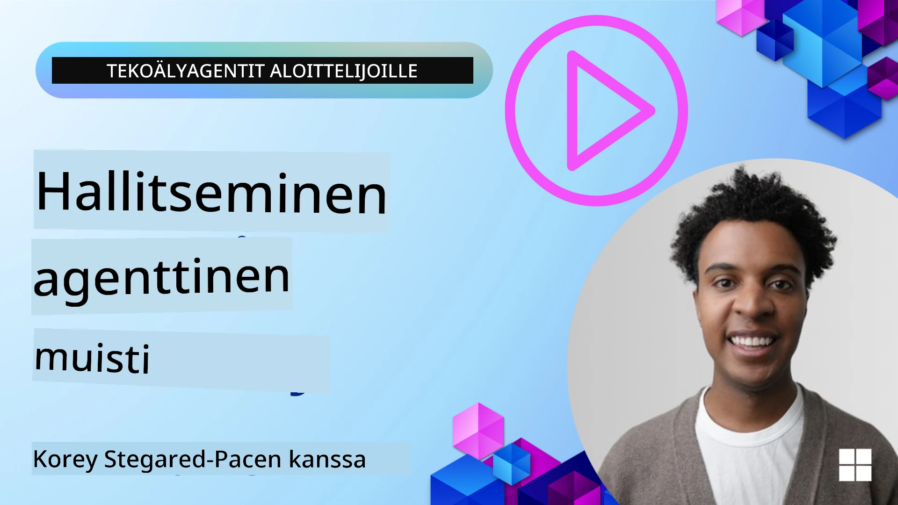

# Muisti tekoälyagentteja varten 

Kun keskustellaan tekoälyagenttien ainutlaatuisista eduista, käsitellään pääasiassa kahta asiaa: kykyä kutsua työkaluja tehtävien suorittamiseksi ja kykyä parantaa itseään ajan myötä. Muisti on itseparantuvan agentin luomisen perusta, mikä mahdollistaa parempien käyttäjäkokemusten tuottamisen.

Tässä oppitunnissa tarkastelemme, mitä muisti tarkoittaa tekoälyagenttien yhteydessä ja miten voimme hallita sitä sekä hyödyntää sovellustemme hyväksi.

## Johdanto

Tässä oppitunnissa käsitellään:

• **Tekoälyagentin muistin ymmärtäminen**: Mikä muisti on ja miksi se on olennaista agenteille.

• **Muistin toteuttaminen ja tallentaminen**: Käytännön menetelmiä muistikyvyn lisäämiseksi tekoälyagenteille, keskittyen lyhytaikaiseen ja pitkäaikaiseen muistiin.

• **Tekoälyagenttien tekeminen itseparantuviksi**: Miten muisti mahdollistaa agenttien oppimisen menneistä vuorovaikutuksista ja parantamisen ajan kuluessa.

## Saatavilla olevat toteutukset

Tämä oppitunti sisältää kaksi kattavaa muistikirjaopastusta:

• **[13-agent-memory.ipynb](./13-agent-memory.ipynb)**: Toteuttaa muistin käyttäen Mem0:aa ja Azure AI Searchia Microsoft Agent Frameworkin kanssa

• **[13-agent-memory-cognee.ipynb](./13-agent-memory-cognee.ipynb)**: Toteuttaa rakenteellisen muistin Cogneen avulla, joka rakentaa automaattisesti upotuksiin perustuvan tietografiikan, visualisoi grafiikan ja tarjoaa älykkään hakutoiminnon

## Oppimistavoitteet

Tämän oppitunnin suorittamisen jälkeen osaat:

• **Erotella erilaiset tekoälyagentin muistin tyypit**, mukaan lukien työmuisti, lyhytaikainen ja pitkäaikainen muisti sekä erikoistuneet muodot, kuten persoonamuisti ja episodimuisti.

• **Toteuttaa ja hallita lyhytaikaista ja pitkäaikaista muistia tekoälyagenteille** käyttäen Microsoft Agent Frameworkia, hyödyntäen työkaluja kuten Mem0, Cognee, Whiteboard-muistia sekä integroitua Azure AI Searchia.

• **Ymmärtää itseparantuvien tekoälyagenttien periaatteet** ja miten kestävät muistinhallintajärjestelmät tukevat jatkuvaa oppimista ja sopeutumista.

## Tekoälyagenttien muistin ymmärtäminen

Ytimessä **tekoälyagenttien muisti tarkoittaa mekanismeja, jotka mahdollistavat tiedon säilyttämisen ja palauttamisen**. Tämä tieto voi olla yksityiskohtia keskustelusta, käyttäjäasetuksista, menneistä toiminnoista tai jopa opituista malleista.

Ilman muistia tekoälysovellukset ovat usein tilattomia, eli jokainen vuorovaikutus alkaa alusta. Tämä johtaa toistuvaan ja turhauttavaan käyttäjäkokemukseen, jossa agentti "unohtaa" aiemman kontekstin tai mieltymykset.

### Miksi muisti on tärkeä?

Agentin älykkyys liittyy syvästi sen kykyyn muistaa ja hyödyntää aiempaa tietoa. Muisti antaa agenteille mahdollisuuden olla:

• **Reflektoivia**: Oppia menneistä toimista ja seurauksista.

• **Vuorovaikutteisia**: Säilyttää konteksti käynnissä olevan keskustelun aikana.

• **Proaktiivisia ja reaktiivisia**: Ennakoida tarpeita tai vastata sopivasti aiempaan tietoon perustuen.

• **Autonomisia**: Toimia itsenäisemmin hyödyntämällä tallennettua tietoa.

Muistin toteuttamisen tavoitteena on tehdä agenteista **luotettavampia ja kykenevämpiä**.

### Muistin tyypit

#### Työmuisti

Ajattele tätä agentin käyttämiin muistiinpanoihin yhden käynnissä olevan tehtävän tai ajatusprosessin aikana. Se pitää välitöntä tietoa, joka tarvitaan seuraavan askeleen laskemiseen.

Tekoälyagenteille työmuisti tallentaa usein keskustelun olennaisimmat tiedot, vaikka koko keskusteluhistoria olisi pitkä tai katkaistu. Se keskittyy keräämään keskeiset elementit, kuten vaatimukset, ehdotukset, päätökset ja toimet.

**Työmuistin esimerkki**

Matkavarausagentilla työmuisti saattaa tallentaa käyttäjän tämänhetkisen pyynnön, kuten "Haluan varata matkan Pariisiin". Tämä erityinen vaatimus pidetään agentin välittömässä kontekstissa ohjaamaan nykyistä vuorovaikutusta.

#### Lyhytaikainen muisti

Tämä muistin tyyppi säilyttää tietoa yhden keskustelun tai istunnon ajan. Se on nykyisen keskustelun konteksti, joka antaa agentille mahdollisuuden viitata aiempiin vuorovaikutuksiin.

[Microsoft Agent Frameworkin](https://github.com/microsoft/agent-framework) Python SDK -esimerkeissä tämä vastaa `AgentSession`ia, joka luodaan `agent.create_session()`-komennolla. Istunto on frameworkin sisäänrakennettu lyhytaikainen muisti: se pitää keskustelukontextin käytettävissä, kun sama istunto on käynnissä, mutta konteksti ei tallennu istunnon päättyessä tai sovelluksen käynnistyessä uudelleen. Pitkäaikaisen muistin käyttöön otetaan tosiasiat ja mieltymykset, jotka täytyy säilyttää istuntojen välillä, yleensä tietokannan, vektori-indeksin tai muun pysyvän tallennusratkaisun kautta.

**Lyhytaikaisen muistin esimerkki**

Jos käyttäjä kysyy "Paljonko lento Pariisiin maksaisi?" ja jatkaa sitten "Entä majoitus siellä?", lyhytaikainen muisti varmistaa, että agentti ymmärtää "siellä" viittaavan "Pariisiin" samassa keskustelussa.

#### Pitkäaikainen muisti

Tämä on tieto, joka säilyy useiden keskustelujen tai istuntojen yli. Se antaa agenteille mahdollisuuden muistaa käyttäjäasetuksia, historiallisia vuorovaikutuksia tai yleistä tietoa pitkällä aikavälillä. Tämä on tärkeää personoinnissa.

**Pitkäaikaisen muistin esimerkki**

Pitkäaikainen muisti saattaa tallentaa, että "Ben nauttii hiihtämisestä ja ulkoilusta, pitää kahvista vuoristonäkymän kanssa ja haluaa välttää vaativia hiihtorinteitä aiemman loukkaantumisen vuoksi". Tämä tieto, opittu aiemmista vuorovaikutuksista, vaikuttaa suosituksiin tulevissa matkan suunnitteluissa, tehden niistä erittäin henkilökohtaisia.

#### Persoonamuisti

Tämä erikoistunut muistityyppi auttaa agenttia kehittämään johdonmukaisen "persoonallisuuden" tai roolin. Se antaa agentille mahdollisuuden muistaa yksityiskohtia itsestään tai roolistaan, tehden vuorovaikutuksista sujuvampia ja fokusoituneempia.

**Persoonamuistin esimerkki**
Jos matkatoimistoagentti on suunniteltu olemaan "asiantuntijahiihtosuunnittelija", persoonamuisti saattaa vahvistaa tätä roolia vaikuttaen vastauksiin asiantuntijan sävyllä ja tiedoilla.

#### Työnkulku-/episodimuisti

Tämä muisti tallentaa agentin kulkeman vaiheiden sarjan monimutkaisessa tehtävässä, mukaan lukien onnistumiset ja epäonnistumiset. Se on kuin muistaa tiettyjä "jaksoja" tai menneitä kokemuksia oppiakseen niistä.

**Episodimuistin esimerkki**

Jos agentti yritti varata tietyn lennon, mutta se epäonnistui saatavuusongelman takia, episodimuisti voisi tallentaa tämän epäonnistumisen, jolloin agentti voisi kokeilla vaihtoehtoisia lentoja tai tiedottaa käyttäjää ongelmasta paremmalla tiedolla seuraavalla yrityksellä.

#### Kohdemuisti

Tämä sisältää tiettyjen entiteettien (kuten ihmisten, paikkojen tai asioiden) ja tapahtumien poimimisen ja muistamisen keskusteluista. Se antaa agentille mahdollisuuden rakentaa rakenteellinen ymmärrys keskustelluista keskeisistä elementeistä.

**Kohdemuistin esimerkki**

Keskustelusta menneestä matkasta agentti saattaa poimia "Pariisi", "Eiffelin torni" ja "illallinen Le Chat Noir -ravintolassa" entiteeteiksi. Tulevassa vuorovaikutuksessa agentti saattaa muistaa "Le Chat Noir" ja tarjoutua tekemään uuden varauksen sinne.

#### Rakenteellinen RAG (Retrieval Augmented Generation)

Vaikka RAG on laajempi tekniikka, "Rakenteellinen RAG" korostuu tehokkaana muistiteknologiana. Se poimii tiivistä, rakenteellista tietoa eri lähteistä (keskustelut, sähköpostit, kuvat) ja käyttää tätä vastauksissa tarkkuuden, kattavuuden ja nopeuden parantamiseen. Toisin kuin perinteinen RAG, joka perustuu pelkkään semanttiseen samankaltaisuuteen, Rakenteellinen RAG hyödyntää tiedon sisäistä rakennetta.

**Rakenteellisen RAGin esimerkki**

Sen sijaan, että vain etsittäisiin avainsanoja, Rakenteellinen RAG voisi jäsentää lento- ja varauskohtaiset tiedot (kohde, päivämäärä, aika, lentoyhtiö) sähköpostista ja tallentaa ne rakenteellisessa muodossa. Tämä mahdollistaa täsmälliset haut, kuten "Mikä lento minulla on varattuna Pariisiin tiistaina?"

## Muistin toteuttaminen ja tallentaminen

Tekoälyagenttien muistin toteuttaminen sisältää systemaattisen prosessin, joka käsittää **muistin hallinnan**: luomisen, tallentamisen, hakemisen, integroimisen, päivittämisen ja jopa tiedon "unohtamisen" (tai poistamisen). Haku on erityisen tärkeä osa.

### Erikoistuneet muistityökalut

#### Mem0

Yksi tapa tallentaa ja hallita agentin muistia on käyttää erikoistuneita työkaluja kuten Mem0. Mem0 toimii pysyvänä muistikerroksena, jonka avulla agentit voivat palauttaa olennaisia vuorovaikutuksia, tallentaa käyttäjäasetuksia ja tosiasiallista kontekstia sekä oppia onnistumisista ja epäonnistumisista ajan kuluessa. Ajatus on, että tilattomat agentit muuttuvat tilallisiksi.

Se toimii **kaksivaiheisella muistiputkella: poiminta ja päivitys**. Ensiksi agentin ketjuun lisätyt viestit lähetetään Mem0-palveluun, joka käyttää suurta kielimallia tiivistämään keskusteluhistorian ja poimimaan uusia muistoja. Tämän jälkeen LLM-ohjattu päivitysvaihe päättää, lisätäänkö, muutetaanko vai poistetaanko nämä muistot, ja tallentaa ne hybridiin tietokantaan, joka voi sisältää vektori-, grafiikka- ja avain-arvopohjaiset tietokannat. Järjestelmä tukee myös eri muistityyppejä ja voi sisällyttää suhteiden hallintaan liittyvää graafimuistia.

#### Cognee

Toinen tehokas lähestymistapa on käyttää **Cogneetä**, avoimen lähdekoodin semanttista muistia tekoälyagenteille, joka muuntaa rakenteellista ja ei-rakenteellista dataa kysyttäväksi tietografiikaksi, jota tukevat upotukset. Cognee tarjoaa **kaksoistallennusarkkitehtuurin**, joka yhdistää vektorihakujen samankaltaisuutta grafiikkasuhteisiin, mahdollistaen agenttien ymmärtää, eivät ainoastaan mitkä tiedot ovat samankaltaisia, vaan miten käsitteet liittyvät toisiinsa.

Se on erinomainen **hybridihakumenetelmässä**, jossa yhdistyy vektorihakusamankaltaisuus, grafiikka-rakenne ja LLM-perustainen päättely – raakadatapalojen hausta graafitietoiseen kysymys-vastausjärjestelmään. Järjestelmä ylläpitää **eleävää muistoa**, joka kehittyy ja kasvaa, mutta säilyy kysyttävänä yhtenäisena grafiikkana, tukeen sekä lyhytaikaista istuntokontekstia että pitkäaikaista pysyvää muistia.

Cogneen muistikirjaopastus ([13-agent-memory-cognee.ipynb](./13-agent-memory-cognee.ipynb)) havainnollistaa tämän yhdistetyn muistikerroksen rakentamista, käytännön esimerkein monipuolisen datan vastaanottamisesta, tietografiikan visualisoinnista ja erilaisilla hakustrategioilla kysymyksiin vastaamisesta, jotka on räätälöity agentin tarpeisiin.

### Muistin tallentaminen RAGilla

Erikoistuneiden muistityökalujen kuten Mem0:n lisäksi voit hyödyntää tehokkaita hakupalveluja, kuten **Azure AI Searchiä taustajärjestelmänä muistien tallentamiseen ja hakemiseen**, erityisesti rakenteellisessa RAGissa.

Tämä mahdollistaa agentin vastausten perustamisen omaan dataasi, varmistaen merkitykselliset ja täsmälliset vastaukset. Azure AI Searchia voidaan käyttää käyttäjäkohtaisen matkamuistin, tuotekatalogien tai minkä tahansa muun toimialakohtaisen tiedon tallentamiseen.

Azure AI Search tukee ominaisuuksia kuten **rakenteellinen RAG**, joka on erityisen hyvä tiiviin, rakenteellisen tiedon poimimisessa ja hakemisessa suurista tietoaineistoista, kuten keskusteluhistoriasta, sähköposteista tai jopa kuvista. Tämä tarjoaa "yliluonnollisen tarkkuuden ja kattavuuden" verrattuna perinteisiin tekstipalojen pilkkomiseen ja upotuksiin perustuviin menetelmiin.

## Tekoälyagenttien itseparantaminen

Usein itseparantuvissa agenteissa käytetään **"tietäjäagenttia"**. Tämä erillinen agentti tarkkailee päätason keskustelua käyttäjän ja pääagentin välillä. Sen rooli on:

1. **Tunnistaa arvokas tieto**: Päätellä, onko jokin keskustelun osa tallennettavissa yleiseksi tiedoksi tai käyttäjäkohtaiseksi mieltymykseksi.

2. **Poimia ja tiivistää**: Eristää oleellinen opittu tieto tai mieltymys keskustelusta.

3. **Tallentaa tietopohjaan**: Säilyttää poimittu tieto, usein vektoripohjaiseen tietokantaan, josta se voidaan hakea myöhemmin.

4. **Täydentää tulevia kyselyjä**: Kun käyttäjä aloittaa uuden kyselyn, tietäjäagentti hakee relevantin tallennetun tiedon ja liittää sen käyttäjän kehotteeseen, antaen tärkeää kontekstia pääagentille (vastaava kuin RAG).

### Muistin optimoinnit

• **Viiveen hallinta**: Käyttäjävuorovaikutuksen hidastamisen välttämiseksi voidaan ensin käyttää halpaa ja nopeaa mallia tarkistamaan nopeasti, onko tieto tallentamisen tai hakemisen arvoista, ja kutsua monimutkaisempaa poiminta/hakuprosessia vain tarpeen vaatiessa.

• **Tietopohjan ylläpito**: Kasvavassa tietopohjassa harvemmin käytetty tieto voidaan siirtää "kylmään arkistoon" kustannusten hallitsemiseksi.

## Lisää kysymyksiä agenttimuisteista?

Liity [Microsoft Foundry Discordiin](https://discord.com/invite/ATgtXmAS5D) tapaamaan muita oppijoita, osallistumaan toimistoaikoihin ja saamaan vastaukset tekoälyagentteja koskeviin kysymyksiisi.

---

<!-- CO-OP TRANSLATOR DISCLAIMER START -->
**Vastuuvapauslauseke**:
Tämä asiakirja on käännetty käyttämällä tekoälypohjaista käännöspalvelua [Co-op Translator](https://github.com/Azure/co-op-translator). Vaikka pyrimme tarkkuuteen, otathan huomioon, että automaattiset käännökset saattavat sisältää virheitä tai epätarkkuuksia. Alkuperäinen asiakirja sen alkuperäiskielellä on virallinen lähde. Tärkeissä asioissa suositellaan ammattimaista ihmiskäännöstä. Emme ole vastuussa tämän käännöksen käytöstä aiheutuvista väärinymmärryksistä tai tulkinnoista.
<!-- CO-OP TRANSLATOR DISCLAIMER END -->