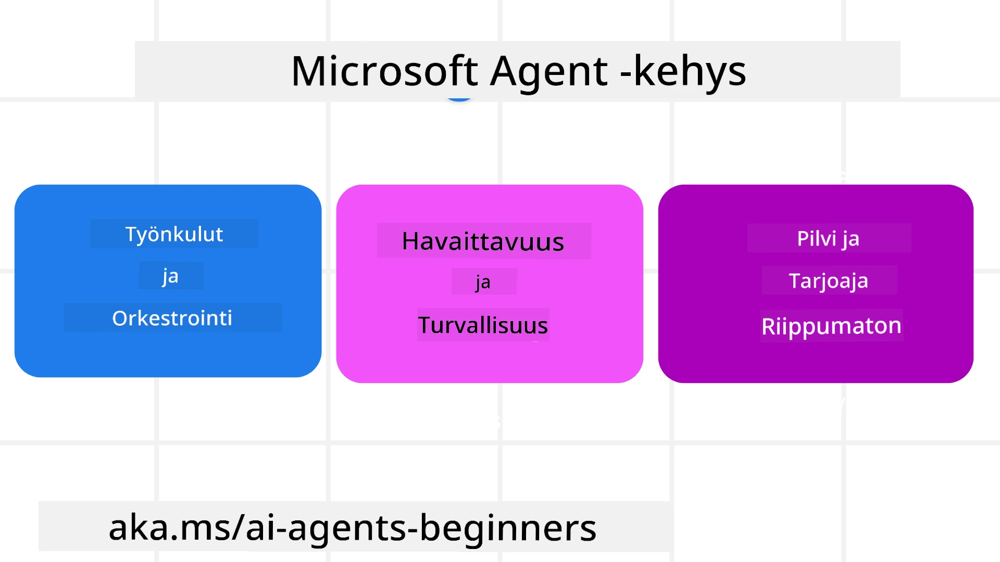

# Microsoft Agent Frameworkin tutkiminen


### Johdanto

Tämä oppitunti käsittelee:

- Microsoft Agent Frameworkin ymmärtäminen: keskeiset ominaisuudet ja arvo  
- Microsoft Agent Frameworkin keskeisten käsitteiden tutkiminen  
- Edistyneet MAF-kuviot: työnkulut, middleware ja muisti  

## Oppimistavoitteet

Tämän oppitunnin jälkeen osaat:

- Rakentaa tuotantovalmiita tekoälyagentteja Microsoft Agent Frameworkilla  
- Soveltaa Microsoft Agent Frameworkin ydintoimintoja agenttikäyttötapauksissasi  
- Käyttää edistyneitä kuvioita, kuten työnkulkuja, middlewarea ja havaittavuutta  

## Koodiesimerkit

Koodiesimerkkejä [Microsoft Agent Frameworkille (MAF)](https://aka.ms/ai-agents-beginners/agent-framewrok) löytyy tästä repositoriosta tiedostoista `xx-python-agent-framework` ja `xx-dotnet-agent-framework`.

## Microsoft Agent Frameworkin ymmärtäminen



[Microsoft Agent Framework (MAF)](https://aka.ms/ai-agents-beginners/agent-framewrok) on Microsoftin yhtenäinen kehys tekoälyagenttien luomiseen. Se tarjoaa joustavuutta vastata laajaan agenttikäyttötapausten kirjoon, joita nähdään sekä tuotanto- että tutkimusympäristöissä, mukaan lukien:

- **Peräkkäinen agenttien orkestrointi** tilanteissa, joissa tarvitaan askel-askeleelta eteneviä työnkulkuja.  
- **Samaan aikaan tapahtuva orkestrointi** tilanteissa, joissa agenttien on suoritettava tehtäviä samanaikaisesti.  
- **Ryhmäkeskusteluorkestrointi** tilanteissa, joissa agentit voivat tehdä yhteistyötä yhdessä tehtävässä.  
- **Tehtävän siirron orkestrointi** tilanteissa, joissa agentit siirtävät tehtävän toisille alitehtävien valmistuessa.  
- **Magnetic Orchestration** tilanteissa, joissa johtaja-agentti luo ja muokkaa tehtävälistaa ja hoitaa alitehtävien koordinaation tehtävän suorittamiseksi.

Tuotantokäyttöön toimitettavissa AI-agenteissa MAF sisältää myös ominaisuuksia:

- **Havaittavuus** OpenTelemetryn avulla, jossa jokainen tekoälyagentin toiminto, kuten työkalun kutsu, orkestrointivaiheet, päättelyprosessit ja suorituskyvyn seuranta Microsoft Foundryn koontinäytöillä, on nähtävissä.  
- **Turvallisuus** isännöimällä agenteja natiivisti Microsoft Foundryllä, joka sisältää turvallisuusohjauksia, kuten roolipohjaisen pääsynhallinnan, yksityisen datan käsittelyn ja sisäänrakennetun sisällön turvallisuuden.  
- **Kestävyys** sillä agenttien säikeet ja työnkulut voivat pysähtyä, jatkua ja toipua virheistä, mikä mahdollistaa pidempikestoiset prosessit.  
- **Hallinta** tukemalla ihmisen osallistumista työnkulkuun, jossa tehtävät merkitään ihmisen hyväksyntää vaativiksi.

Microsoft Agent Framework pyrkii myös yhteentoimivuuteen:

- **Pilviriippumattomuus** - Agentit voivat toimia konteissa, paikallisympäristöissä ja useissa eri pilvissä.  
- **Tarjoajariippumattomuus** - Agentit voidaan luoda suosimallasi SDK:lla, mukaan lukien Azure OpenAI ja OpenAI.  
- **Avoimien standardien integrointi** - Agentit voivat hyödyntää protokollia kuten Agent-to-Agent (A2A) ja Model Context Protocol (MCP) löytääkseen ja käyttääkseen muita agenteja ja työkaluja.  
- **Lisäosat ja liittimet** - Yhteyksiä voidaan muodostaa datan ja muistin palveluihin, kuten Microsoft Fabric, SharePoint, Pinecone ja Qdrant.

Katsotaan, miten nämä ominaisuudet soveltuvat Microsoft Agent Frameworkin keskeisiin käsitteisiin.

## Microsoft Agent Frameworkin keskeiset käsitteet

### Agentit


**Agenttien luominen**

Agentin luominen tapahtuu määrittelemällä päättelypalvelu (LLM-palveluntarjoaja), joukko ohjeita, joita tekoälyagentin tulee noudattaa, ja annetaan sille `name`:

```python
agent = AzureOpenAIChatClient(credential=AzureCliCredential()).create_agent( instructions="You are good at recommending trips to customers based on their preferences.", name="TripRecommender" )
```

Yllä käytetään `Azure OpenAI`:ta, mutta agentteja voi luoda monilla palveluilla, mukaan lukien `Microsoft Foundry Agent Service`:

```python
AzureAIAgentClient(async_credential=credential).create_agent( name="HelperAgent", instructions="You are a helpful assistant." ) as agent
```

OpenAI:n `Responses`, `ChatCompletion` -rajapinnat

```python
agent = OpenAIResponsesClient().create_agent( name="WeatherBot", instructions="You are a helpful weather assistant.", )
```

```python
agent = OpenAIChatClient().create_agent( name="HelpfulAssistant", instructions="You are a helpful assistant.", )
```

tai kaukoagentteina A2A-protokollaa käyttäen:

```python
agent = A2AAgent( name=agent_card.name, description=agent_card.description, agent_card=agent_card, url="https://your-a2a-agent-host" )
```

**Agenttien suorittaminen**

Agenteja suoritetaan käyttämällä `.run`- tai `.run_stream`-metodeja ei-suoratoistettuihin tai suoratoistettuihin vastauksiin.

```python
result = await agent.run("What are good places to visit in Amsterdam?")
print(result.text)
```

```python
async for update in agent.run_stream("What are the good places to visit in Amsterdam?"):
    if update.text:
        print(update.text, end="", flush=True)

```

Jokaisella agenttikutsulla voi myös olla asetuksia parametrien kuten agentin käyttämien `max_tokens`, agentin kutsuttavissa olevien `tools`-työkalujen sekä käytetyn `model`-mallin mukauttamiseksi.

Tämä on hyödyllistä tapauksissa, joissa tiettyjä malleja tai työkaluja tarvitaan käyttäjän tehtävän suorittamiseen.

**Työkalut**

Työkaluja voidaan määritellä sekä agenttia luodessa:

```python
def get_attractions( location: Annotated[str, Field(description="The location to get the top tourist attractions for")], ) -> str: """Get the top tourist attractions for a given location.""" return f"The top attractions for {location} are." 


# Kun luodaan ChatAgent suoraan

agent = ChatAgent( chat_client=OpenAIChatClient(), instructions="You are a helpful assistant", tools=[get_attractions]

```

että agenttia suoritettaessa:

```python

result1 = await agent.run( "What's the best place to visit in Seattle?", tools=[get_attractions] # Työkalu tarjottu vain tätä ajoa varten )
```

**Agentin säikeet**

Agentin säikeitä käytetään monikierroksisten keskustelujen hallintaan. Säikeitä voi luoda joko:

- Käyttämällä `get_new_thread()`, joka mahdollistaa säikeen tallentamisen ajan myötä.  
- Luomalla säie automaattisesti agenttia suoritettaessa, jolloin säie kestää vain nykyisen ajon ajan.

Säikeen luonti tapahtuu näin:

```python
# Luo uusi säie.
thread = agent.get_new_thread() # Suorita agentti säikeellä.
response = await agent.run("Hello, I am here to help you book travel. Where would you like to go?", thread=thread)

```

Säikeen voi sitten sarjoittaa ja tallentaa myöhempää käyttöä varten:

```python
# Luo uusi säie.
thread = agent.get_new_thread() 

# Suorita agentti säikeen kanssa.

response = await agent.run("Hello, how are you?", thread=thread) 

# Sarjoita säie tallennusta varten.

serialized_thread = await thread.serialize() 

# Pura säikeen tila tallennuksesta lataamisen jälkeen.

resumed_thread = await agent.deserialize_thread(serialized_thread)
```

**Agentin middleware**

Agentit vuorovaikuttavat työkalujen ja LLM:ien kanssa käyttäjän tehtävien suorittamiseksi. Tietyissä tilanteissa haluamme suorittaa tai seurata välivaiheita näiden vuorovaikutusten välillä. Agentin middleware mahdollistaa tämän seuraavasti:

*Toimintomiddleware*

Tämä middleware sallii toiminnan suorittamisen agentin ja kutsuttavan funktion/työkalun välissä. Esimerkiksi tätä voidaan käyttää kirjaamaan lokia funktiokutsusta.

Alla olevassa koodissa `next` määrittää, kutsutaanko seuraavaa middlewarea vai varsinaista funktiota.

```python
async def logging_function_middleware(
    context: FunctionInvocationContext,
    next: Callable[[FunctionInvocationContext], Awaitable[None]],
) -> None:
    """Function middleware that logs function execution."""
    # Esikäsittely: Lokitetaan ennen funktion suorittamista
    print(f"[Function] Calling {context.function.name}")

    # Jatka seuraavaan middlewareen tai funktion suorittamiseen
    await next(context)

    # Jälkikäsittely: Lokitetaan funktion suorituksen jälkeen
    print(f"[Function] {context.function.name} completed")
```

*Chat-middleware*

Tämä middleware sallii toiminnan suorittamisen tai lokituksen agentin ja LLM:n pyyntöjen välillä.

Täällä on tärkeää tietoa, kuten AI-palvelulle lähetettävät `messages`.

```python
async def logging_chat_middleware(
    context: ChatContext,
    next: Callable[[ChatContext], Awaitable[None]],
) -> None:
    """Chat middleware that logs AI interactions."""
    # Esikäsittely: Kirjaa lokiin ennen tekoälykutsua
    print(f"[Chat] Sending {len(context.messages)} messages to AI")

    # Jatka seuraavaan middlewareen tai tekoälypalveluun
    await next(context)

    # Jälkikäsittely: Kirjaa lokiin tekoälyn vastauksen jälkeen
    print("[Chat] AI response received")

```

**Agentin muisti**

Kuten oppitunnissa `Agentic Memory` käsiteltiin, muisti on tärkeä elementti agentin toiminnan mahdollistamiseksi eri konteksteissä. MAF tarjoaa useita erilaisia muistityyppejä:

*Muisti sovellusajon aikana säikeissä*

Tämä muisti tallennetaan säikeisiin sovelluksen suorituksen aikana.

```python
# Luo uusi säie.
thread = agent.get_new_thread() # Suorita agentti säikeellä.
response = await agent.run("Hello, I am here to help you book travel. Where would you like to go?", thread=thread)
```

*Pysyvät viestit*

Tätä muistia käytetään keskusteluhistorian tallentamiseen eri istuntojen välillä. Se määritellään `chat_message_store_factory`:lla:

```python
from agent_framework import ChatMessageStore

# Luo mukautettu viestivarasto
def create_message_store():
    return ChatMessageStore()

agent = ChatAgent(
    chat_client=OpenAIChatClient(),
    instructions="You are a Travel assistant.",
    chat_message_store_factory=create_message_store
)

```

*Dynaaminen muisti*

Tämä muisti lisätään kontekstiin ennen agenttien ajoa. Tätä muistia voidaan säilyttää ulkoisissa palveluissa kuten mem0:

```python
from agent_framework.mem0 import Mem0Provider

# Käytetään Mem0:aa kehittyneisiin muistitoimintoihin
memory_provider = Mem0Provider(
    api_key="your-mem0-api-key",
    user_id="user_123",
    application_id="my_app"
)

agent = ChatAgent(
    chat_client=OpenAIChatClient(),
    instructions="You are a helpful assistant with memory.",
    context_providers=memory_provider
)

```

**Agentin havaittavuus**

Havaittavuus on tärkeää luotettavien ja ylläpidettävien agenttijärjestelmien rakentamiseksi. MAF integroituu OpenTelemetryyn tarjotakseen jäljitystä ja mittareita parhaan havaittavuuden saavuttamiseksi.

```python
from agent_framework.observability import get_tracer, get_meter

tracer = get_tracer()
meter = get_meter()
with tracer.start_as_current_span("my_custom_span"):
    # tee jotain
    pass
counter = meter.create_counter("my_custom_counter")
counter.add(1, {"key": "value"})
```

### Työnkulut

MAF tarjoaa työnkulkuja, jotka ovat ennalta määriteltyjä vaiheita tehtävän suorittamiseksi ja sisältävät tekoälyagentteja osina näitä vaiheita.

Työnkulut koostuvat eri osista, jotka mahdollistavat paremman ohjausvirran. Työnkulut tukevat myös **moniagenttien orkestrointia** ja **tarkistuspisteiden käyttöä** työnkulun tilojen tallentamiseksi.

Työnkulun ydinkomponentit ovat:

**Suorittajat**

Suorittajat vastaanottavat syöteviestejä, suorittavat nimettyjä tehtäviään ja tuottavat sitten tulosviestin. Tämä vie työnkulkua kohti suuremman tehtävän valmistumista. Suorittajat voivat olla tekoälyagentteja tai mukautettua logiikkaa.

**Säikeet**

Säikeitä käytetään määrittelemään viestien kulkua työnkulussa. Nämä voivat olla:

*Suorat säikeet* - Yksinkertaisia yhden kohteen yhteyksiä suorittajien kesken:

```python
from agent_framework import WorkflowBuilder

builder = WorkflowBuilder()
builder.add_edge(source_executor, target_executor)
builder.set_start_executor(source_executor)
workflow = builder.build()
```

*Ehdolliset säikeet* - Aktivoituvat tietyn ehdon täyttyessä. Esimerkiksi, kun hotellihuoneita ei ole saatavana, suorittaja voi ehdottaa muita vaihtoehtoja.

*Kytkin-tapauksen säikeet* - Reitittävät viestejä eri suorittajille määriteltyjen ehtojen mukaan. Esimerkiksi jos matkustajalla on etuoikeus, heidän tehtävänsä hoidetaan toisen työnkulun kautta.

*Hajautuneet säikeet* - Lähettävät yhden viestin useille kohteille.

*Yhdistävät säikeet* - Keräävät useita viestejä eri suorittajilta ja lähettävät yhdelle kohteelle.

**Tapahtumat**

Parantaakseen työnkulkujen havaittavuutta MAF tarjoaa sisäänrakennettuja tapahtumia suoritukseen, kuten:

- `WorkflowStartedEvent`  - Työnkulun suoritus alkaa  
- `WorkflowOutputEvent` - Työnkulku tuottaa tuloksen  
- `WorkflowErrorEvent` - Työnkulussa ilmenee virhe  
- `ExecutorInvokeEvent`  - Suorittaja aloittaa prosessoinnin  
- `ExecutorCompleteEvent`  - Suorittaja lopettaa prosessoinnin  
- `RequestInfoEvent` - Pyyntö on tehty  

## Edistyneet MAF-kuviot

Yllä olevat osiot käsittelevät Microsoft Agent Frameworkin keskeisiä käsitteitä. Kun rakennat monimutkaisempia agentteja, tässä on joitain edistyneitä kuvioita, joita kannattaa harkita:

- **Middlewaren ketjuttaminen**: Ketjuta useita middleware-käsittelijöitä (lokitus, tunnistus, nopeuden rajoitus) käyttämällä toimintomiddlewarea ja chat-middlewarea agentin toiminnan hienovaraiseen hallintaan.  
- **Työnkulun tarkistuspisteet**: Käytä työnkulun tapahtumia ja sarjallistamista pitkiä agenttiprosesseja tallentamiseen ja uudelleenjatkamiseen.  
- **Dynaaminen työkalujen valinta**: Yhdistä RAG työkalukuvausten kanssa ja MAF:n työkalurekisteröityminen sillä tavoin, että esitetään vain kyseeseen tulevat työkalut kunkin kyselyn yhteydessä.  
- **Moni-agenttien tehtävien siirto**: Käytä työnkulun säikeitä ja ehdollista reititystä orkestroimaan siirtoja erikoistuneiden agenttien välillä.  

## Koodiesimerkit

Microsoft Agent Frameworkin koodiesimerkkejä löytyy tästä repositoriosta tiedostoista `xx-python-agent-framework` ja `xx-dotnet-agent-framework`.

## Onko sinulla lisää kysymyksiä Microsoft Agent Frameworkista?

Liity [Microsoft Foundry Discordiin](https://aka.ms/ai-agents/discord) tavata muita oppijoita, osallistua toimistoaikoihin ja saada AI-agenttikysymyksiisi vastauksia.

---

<!-- CO-OP TRANSLATOR DISCLAIMER START -->
**Vastuuvapauslauseke**:
Tämä asiakirja on käännetty tekoälypohjaisella käännöspalvelulla [Co-op Translator](https://github.com/Azure/co-op-translator). Pyrimme tarkkuuteen, mutta huomaathan, että automaattikäännöksissä saattaa esiintyä virheitä tai epätarkkuuksia. Alkuperäinen asiakirja sen alkuperäisellä kielellä on pidettävä virallisena lähteenä. Tärkeissä tiedoissa suositellaan ammattimaista ihmiskäännöstä. Emme ole vastuussa tämän käännöksen käytöstä johtuvista väärinymmärryksistä tai tulkinnoista.
<!-- CO-OP TRANSLATOR DISCLAIMER END -->