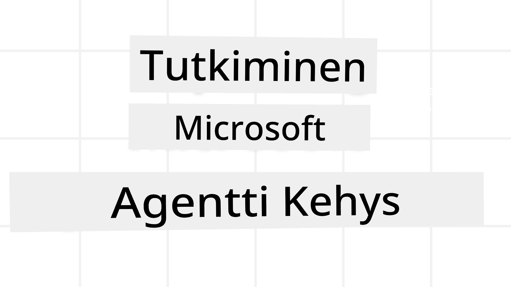
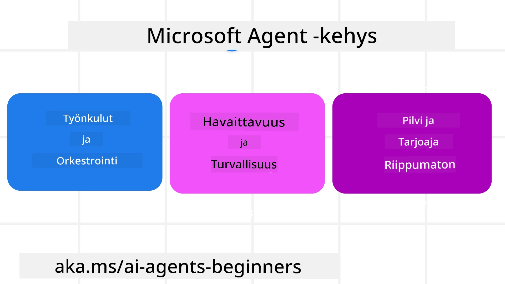
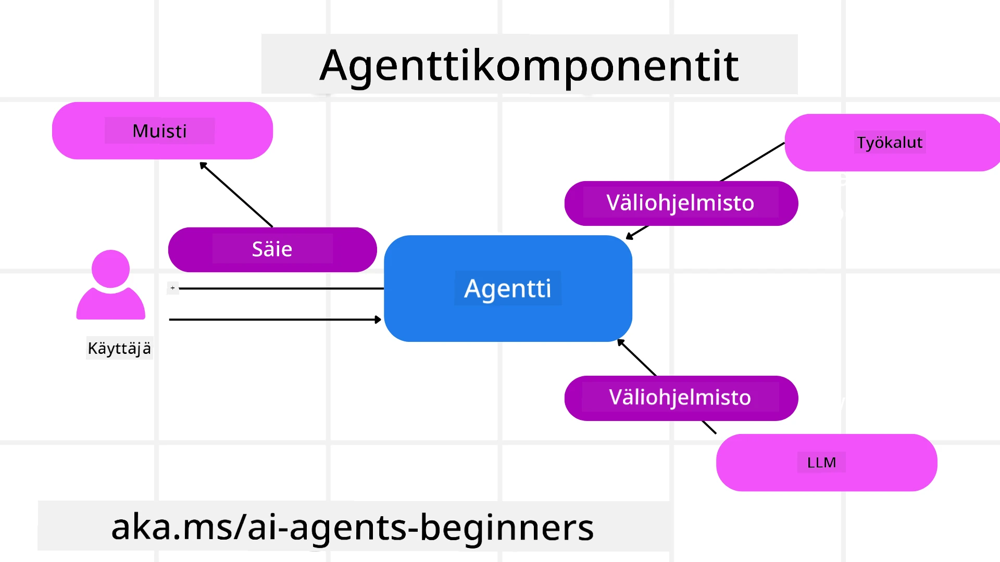

# Microsoft Agent Frameworkin tutkiminen



### Johdanto

Tässä oppitunnissa käsitellään:

- Microsoft Agent Frameworkin ymmärtäminen: Keskeiset ominaisuudet ja arvo  
- Microsoft Agent Frameworkin keskeisten käsitteiden tutkiminen
- Edistyneet MAF-mallit: Työnkulut, middleware ja muisti

## Oppimistavoitteet

Oppitunnin suorittamisen jälkeen osaat:

- Rakentaa tuotantoon valmiita tekoälyagentteja Microsoft Agent Frameworkin avulla
- Soveltaa Microsoft Agent Frameworkin ydintoimintoja agenttikäyttötapauksiisi
- Käyttää edistyneitä malleja, mukaan lukien työnkulut, middleware ja havaittavuus

## Koodiesimerkit

Microsoft Agent Frameworkin (MAF) koodiesimerkit löytyvät tästä repositoriosta tiedostoista `xx-python-agent-framework` ja `xx-dotnet-agent-framework`.

## Microsoft Agent Frameworkin ymmärtäminen



[Microsoft Agent Framework (MAF)](https://learn.microsoft.com/en-us/agent-framework/overview/?wt.mc_id=youtube_26688_organicsocial_reactor&pivots=programming-language-python) on Microsoftin yhtenäinen kehys tekoälyagenttien rakentamiseen. Se tarjoaa joustavuutta laajaan agenttikäyttötapausten kirjoon, joita esiintyy sekä tuotanto- että tutkimusympäristöissä, mukaan lukien:

- **Järjestelmällinen agenttien orkestrointi** tilanteissa, joissa tarvitaan vaiheittaisia työnkulkuja.
- **Samaan aikaan tapahtuva orkestrointi** tilanteissa, joissa agenttien täytyy suorittaa tehtäviä samanaikaisesti.
- **Ryhmäkeskusteluorkestrointi** tilanteissa, joissa agentit voivat tehdä yhteistyötä yhden tehtävän parissa.
- **Tehtävien siirtämisen orkestrointi** tilanteissa, joissa agentit siirtävät tehtävän toisilleen aliprosessien valmistuttua.
- **Magnetic Orchestration** tilanteissa, joissa johtava agentti luo ja muuttaa tehtävälistaa ja koordinoi apuagenttien toimintaa tehtävän suorittamiseksi.

Tuottaakseen tekoälyagentteja tuotantoon MAF sisältää myös ominaisuuksia, kuten:

- **Havaittavuus** OpenTelemetryn avulla, jossa jokainen tekoälyagentin toiminto, mukaan lukien työkalujen kutsu, orkestrointivaiheet, päättelyvirrat ja suorituskyvyn seuranta Microsoft Foundry -mittaritaulujen kautta.
- **Turvallisuus** isännöimällä agentteja natiivisti Microsoft Foundryn päällä, mikä sisältää turvakontrollit kuten roolipohjaisen pääsyn, yksityisen datan käsittelyn ja sisäänrakennetun sisällön turvallisuuden.
- **Kestävyys** sillä agenttien säikeet ja työnkulut voivat keskeyttää, jatkaa ja palautua virheistä mahdollistaen pidempiaikaisen prosessin.
- **Hallinta** tukemalla ihmisen osallistumista työnkulussa, jossa tehtävät merkitään ihmisen hyväksyntää vaativiksi.

Microsoft Agent Framework keskittyy myös yhteen toimivuuteen seuraavasti:

- **Pilvi-riippumattomuus** - agentit voivat toimia konteissa, paikallisesti ja useissa eri pilvissä.
- **Tarjoajariippumattomuus** - agentteja voidaan luoda suosimallasi SDK:lla mukaan lukien Azure OpenAI ja OpenAI.
- **Avoimien standardien integrointi** - agentit voivat hyödyntää protokollia kuten Agent-to-Agent (A2A) ja Model Context Protocol (MCP) löytääkseen ja käyttäessään muita agentteja ja työkaluja.
- **Lisäosat ja liittimet** - yhteydet voidaan muodostaa data- ja muistipalveluihin kuten Microsoft Fabric, SharePoint, Pinecone ja Qdrant.

Katsotaan miten näitä ominaisuuksia sovelletaan Microsoft Agent Frameworkin keskeisiin käsitteisiin.

## Microsoft Agent Frameworkin keskeiset käsitteet

### Agentit



**Agenttien luominen**

Agenttien luominen tapahtuu määrittämällä päättelypalvelu (LLM-tarjoaja), joukko ohjeita tekoälyagentille ja määritelty `name`:


```python
agent = AzureOpenAIChatClient(credential=AzureCliCredential()).create_agent( instructions="You are good at recommending trips to customers based on their preferences.", name="TripRecommender" )
```

Yllä käytetään `Azure OpenAI`:ta, mutta agentteja voi luoda monenlaisilla palveluilla, mukaan lukien `Microsoft Foundry Agent Service`:

```python
AzureAIAgentClient(async_credential=credential).create_agent( name="HelperAgent", instructions="You are a helpful assistant." ) as agent
```

OpenAI:n `Responses`, `ChatCompletion` API:t

```python
agent = OpenAIResponsesClient().create_agent( name="WeatherBot", instructions="You are a helpful weather assistant.", )
```

```python
agent = OpenAIChatClient().create_agent( name="HelpfulAssistant", instructions="You are a helpful assistant.", )
```

tai [MiniMax](https://platform.minimaxi.com/), joka tarjoaa OpenAI-yhteensopivan API:n laajoilla kontekstitilavuuksilla (jopa 204K tokenia):

```python
agent = OpenAIChatClient(base_url="https://api.minimax.io/v1", api_key=os.environ["MINIMAX_API_KEY"], model_id="MiniMax-M3").create_agent( name="HelpfulAssistant", instructions="You are a helpful assistant.", )
```

tai etäagentteja käyttämällä A2A-protokollaa:

```python
agent = A2AAgent( name=agent_card.name, description=agent_card.description, agent_card=agent_card, url="https://your-a2a-agent-host" )
```

**Agenttien suorittaminen**

Agentteja ajetaan `.run` tai `.run_stream` -menetelmillä joko ei-suoratoistovasteille tai suoratoistovasteille.

```python
result = await agent.run("What are good places to visit in Amsterdam?")
print(result.text)
```

```python
async for update in agent.run_stream("What are the good places to visit in Amsterdam?"):
    if update.text:
        print(update.text, end="", flush=True)

```

Jokaisella agenttikutsulla voi myös olla valintavaihtoehtoja räätälöidä parametreja kuten agentin käyttämät `max_tokens`, agentin kutsumat `tools` ja jopa itse agentissa käytetty `model`.

Tämä on hyödyllistä tapauksissa, joissa tietyt mallit tai työkalut vaaditaan käyttäjän tehtävän suorittamiseen.

**Työkalut**

Työkaluja voidaan määrittää sekä agenttia luotaessa:

```python
def get_attractions( location: Annotated[str, Field(description="The location to get the top tourist attractions for")], ) -> str: """Get the top tourist attractions for a given location.""" return f"The top attractions for {location} are." 


# Kun luodaan ChatAgent suoraan

agent = ChatAgent( chat_client=OpenAIChatClient(), instructions="You are a helpful assistant", tools=[get_attractions]

```

että agenttia ajettaessa:

```python

result1 = await agent.run( "What's the best place to visit in Seattle?", tools=[get_attractions] # Työkalu tarjottu vain tätä suoritusta varten )
```

**Agenttisäikeet**

Agenttisäikeitä käytetään monivaiheisten keskustelujen hallintaan. Säikeitä voi luoda joko:

- Käyttämällä `get_new_thread()`, joka sallii säikeen tallentamisen ajan myötä
- Luomalla säikeen automaattisesti agentin suorituksen yhteydessä, jolloin säie kestää vain nykyisen suorituksen ajan.

Säikeen luomiseksi koodi näyttää tältä:

```python
# Luo uusi säie.
thread = agent.get_new_thread() # Suorita agentti säikeen kanssa.
response = await agent.run("Hello, I am here to help you book travel. Where would you like to go?", thread=thread)

```

Säikeen voi sitten sarjoittaa tallennettavaksi myöhempää käyttöä varten:

```python
# Luo uusi säie.
thread = agent.get_new_thread() 

# Suorita agentti säikeellä.

response = await agent.run("Hello, how are you?", thread=thread) 

# Sarjallista säie tallennusta varten.

serialized_thread = await thread.serialize() 

# Desarjallista säikeen tila latauksen jälkeen.

resumed_thread = await agent.deserialize_thread(serialized_thread)
```

**Agenttimiddleware**

Agentit käyttävät työkaluja ja LLM:iä suorittaakseen käyttäjän tehtävät. Tietyissä tilanteissa haluamme suorittaa tai seurata toimintoja näiden vuorovaikutusten välillä. Agenttimiddleware mahdollistaa tämän seuraavasti:

*Funktion Middleware*

Tämä middleware sallii toiminnon suorittamisen agentin ja kutsuttavan funktion/työkalun välillä. Esimerkki käyttötarkoituksesta on funktiokutsun lokitus.

Alla olevassa koodissa `next` määrittää, kutsutaanko seuraava middleware vai varsinainen funktio.

```python
async def logging_function_middleware(
    context: FunctionInvocationContext,
    next: Callable[[FunctionInvocationContext], Awaitable[None]],
) -> None:
    """Function middleware that logs function execution."""
    # Esikäsittely: Kirjaa lokiin ennen funktion suoritusta
    print(f"[Function] Calling {context.function.name}")

    # Jatka seuraavaan middlewareen tai funktion suoritukseen
    await next(context)

    # Jälkikäsittely: Kirjaa lokiin funktion suorituksen jälkeen
    print(f"[Function] {context.function.name} completed")
```

*Keskustelumiddleware*

Tämä middleware mahdollistaa toiminnon suorittamisen tai lokituksen agentin ja LLM:n välisten pyyntöjen välillä.

Se sisältää tärkeää tietoa kuten AI-palvelulle lähetettävät `messages`.

```python
async def logging_chat_middleware(
    context: ChatContext,
    next: Callable[[ChatContext], Awaitable[None]],
) -> None:
    """Chat middleware that logs AI interactions."""
    # Esikäsittely: Lokita ennen AI-kutsua
    print(f"[Chat] Sending {len(context.messages)} messages to AI")

    # Jatka seuraavaan middlewareen tai AI-palveluun
    await next(context)

    # Jälkikäsittely: Lokita AI-vastauksen jälkeen
    print("[Chat] AI response received")

```

**Agentin muisti**

Kuten oppitunnissa `Agentic Memory` käsiteltiin, muisti on tärkeä elementti, joka mahdollistaa agentin toiminnan eri konteksteissä. MAF tarjoaa useita muistityyppejä:

*Muisti sovelluksen ajon aikana*

Tämä on muistia, joka tallennetaan säikeisiin sovelluksen suorituksen aikana.

```python
# Luo uusi säie.
thread = agent.get_new_thread() # Aja agenttia säikeen kanssa.
response = await agent.run("Hello, I am here to help you book travel. Where would you like to go?", thread=thread)
```

*Pysyvät viestit*

Tätä muistia käytetään keskusteluhistorian tallentamiseen eri istuntojen välillä. Se määritellään `chat_message_store_factory` avulla:

```python
from agent_framework import ChatMessageStore

# Luo mukautettu viestivarasto
def create_message_store():
    return ChatMessageStore()

agent = ChatAgent(
    chat_client=OpenAIChatClient(),
    instructions="You are a Travel assistant.",
    chat_message_store_factory=create_message_store
)

```

*Dynaaminen muisti*

Tämä muisti lisätään kontekstiin ennen agenttien suoritusta. Tätä muistia voi tallentaa ulkopuolisiin palveluihin kuten mem0:

```python
from agent_framework.mem0 import Mem0Provider

# Käytetään Mem0:aa edistyneisiin muistitoimintoihin
memory_provider = Mem0Provider(
    api_key="your-mem0-api-key",
    user_id="user_123",
    application_id="my_app"
)

agent = ChatAgent(
    chat_client=OpenAIChatClient(),
    instructions="You are a helpful assistant with memory.",
    context_providers=memory_provider
)

```

**Agentin havaittavuus**

Havaittavuus on tärkeää luotettavien ja ylläpidettävien agenttijärjestelmien rakentamiseksi. MAF integroituu OpenTelemetryyn tarjoten jäljityksen ja mittarit parempaa havaittavuutta varten.

```python
from agent_framework.observability import get_tracer, get_meter

tracer = get_tracer()
meter = get_meter()
with tracer.start_as_current_span("my_custom_span"):
    # tee jotain
    pass
counter = meter.create_counter("my_custom_counter")
counter.add(1, {"key": "value"})
```

### Työnkulut

MAF tarjoaa työnkulkuja, jotka ovat ennalta määriteltyjä vaiheita tehtävän suorittamiseksi ja sisältävät tekoälyagentteja osina näitä vaiheita.

Työnkulut koostuvat erilaisista komponenteista, jotka mahdollistavat paremman ohjausvirran. Työnkulut tukevat myös **moniagenttien orkestrointia** ja **tarkistuspisteitä** työnkulun tilojen tallentamiseksi.

Työnkulun ydinkomponentit ovat:

**Suorittajat**

Suorittajat vastaanottavat syöteviestejä, suorittavat määrätyt tehtävänsä ja tuottavat sitten ulostulevan viestin. Tämä vie työnkulkua eteenpäin kohti suuremman tehtävän valmistumista. Suorittajat voivat olla joko tekoälyagentteja tai mukautettua logiikkaa.

**Sillat**

Siltoja käytetään määrittämään viestien virtaus työnkulussa. Näitä voivat olla:

*Suorat sillat* – Yksinkertaisia yksi-yhteen yhteyksiä suorittajien välillä:

```python
from agent_framework import WorkflowBuilder

builder = WorkflowBuilder()
builder.add_edge(source_executor, target_executor)
builder.set_start_executor(source_executor)
workflow = builder.build()
```

*Ehdolliset sillat* – Aktivoituvat, kun tietty ehto täyttyy. Esimerkiksi, kun hotellihuoneita ei ole saatavilla, suorittaja voi ehdottaa muita vaihtoehtoja.

*Switch-case-sillat* – Reitittävät viestit eri suorittajille määriteltyjen ehtojen perusteella. Esimerkiksi, jos matkailuasiakkaalla on etuoikeutettu pääsy, heidän tehtävänsä käsitellään toisen työnkulun kautta.

*Fan-out-sillat* – Lähettävät yhden viestin usealle vastaanottajalle.

*Fan-in-sillat* – Keräävät useita viestejä eri suorittajilta ja lähettävät ne yhdelle vastaanottajalle.

**Tapahtumat**

Parempaa havaittavuutta varten työnkulkuihin MAF tarjoaa sisäänrakennettuja suoritustapahtumia, kuten:

- `WorkflowStartedEvent` – Työnkulun suoritus alkaa
- `WorkflowOutputEvent` – Työnkulku tuottaa ulostulon
- `WorkflowErrorEvent` – Työnkulku kohtaa virheen
- `ExecutorInvokeEvent` – Suorittaja aloittaa prosessoinnin
- `ExecutorCompleteEvent` – Suorittaja loppuu prosessointiin
- `RequestInfoEvent` – Pyyntö lähetetään

## Edistyneet MAF-mallit

Edellä käsiteltiin Microsoft Agent Frameworkin keskeiset käsitteet. Rakentaessasi monimutkaisempia agentteja tässä on joitain edistyneitä malleja harkittavaksi:

- **Middleware-yhdistely**: Ketjuta useita middleware-käsittelijöitä (lokitus, todennus, nopeuden rajoitus) funktio- ja keskustelumiddlewarella hienojakoiseen hallintaan agentin käyttäytymisessä.
- **Työnkulkutarkistuspisteet**: Käytä työnkultutapahtumia ja sarjallistusta tallentaaksesi ja jatkaaksesi pitkään käynnissä olevia agenttiprosesseja.
- **Dynaaminen työkalujen valinta**: Yhdistä RAG työkalujen kuvauksiin ja MAF:n työkalurekisteröintiin tarjotaksesi vain asiaankuuluvia työkaluja kyselyä kohden.
- **Moniagenttien tehtävien siirto**: Käytä työnkulun siltoja ja ehdollista reititystä orkestroidaksesi tehtävien siirtoja erikoistuneiden agenttien välillä.

## LangChain / LangGraph -agenttien isännöinti Microsoft Foundryssa

Microsoft Agent Framework on **kehysriippumaton** – et ole rajoitettu vain MAF:lla kirjoitettuihin agentteihin. Jos sinulla on jo agentti rakennettuna **LangChain**- tai **LangGraph**-tekniikalla, voit ajaa sitä **Microsoft Foundryn isännöimänä agenttina**, jolloin Foundry hoitaa ajon, istunnot, skaalaamisen, identiteetin ja protokollapäätepisteet puolestasi, kun sinun agenttilogistiikkasi pysyy LangGraphissa.

Tämä tehdään `langchain_azure_ai.agents.hosting` -paketin avulla, joka paljastaa käännetyn LangGraph-kaavion samoilla protokollilla, joita Foundryn isännöimät agentit käyttävät.

**1. Asenna hosting-lisäosa:**

```bash
pip install -U "langchain-azure-ai[hosting]>=1.2.4" azure-identity
```

`hosting`-lisäosa asentaa Foundryn protokollakirjastot: `azure-ai-agentserver-responses` (OpenAI-yhteensopiva `/responses`-päätepiste) ja `azure-ai-agentserver-invocations` (geneerinen `/invocations`-päätepiste).

**2. Valitse hosting-protokolla:**

| Protokolla | Isäntälahiluokka | Päätepiste | Käyttötilanne |
|----------|-----------|----------|----------|
| **Responses** | `ResponsesHostServer` | `/responses` | Haluat OpenAI-yhteensopivan chatin, suoratoiston, vastaushistorian ja keskustelusäikeen — suositeltu oletus keskusteluagentteihin. |
| **Invocations** | `InvocationsHostServer` | `/invocations` | Tarvitset mukautetun JSON-rakenteen, webhook-tyyppisen päätepisteen tai ei-keskusteluprosessoinnin. |

Koska **Responses API on ensisijainen agentti-tyylisen kehityksen API Foundryssa**, aloita useimmissa agenteissa `ResponsesHostServer`-luokalla.

**3. Määritä ympäristömuuttujat** (`az login` ensin, jotta `DefaultAzureCredential` voi todentaa):

```bash
export FOUNDRY_PROJECT_ENDPOINT="https://<resource>.services.ai.azure.com/api/projects/<project>"
export FOUNDRY_MODEL_NAME="gpt-5-mini"
```

Kun agentti myöhemmin ajaa isännöitynä agenttina Foundryssa, alusta lisää automaattisesti `FOUNDRY_PROJECT_ENDPOINT`-arvon.

**4. Paljasta LangGraph-agentti Responses-protokollan yli:**

```python
import os

from azure.ai.projects import AIProjectClient
from azure.identity import DefaultAzureCredential, get_bearer_token_provider
from langchain.agents import create_agent
from langchain_openai import ChatOpenAI
from langchain_azure_ai.agents.hosting import ResponsesHostServer

_AZURE_AI_SCOPE = "https://ai.azure.com/.default"


def build_chat_model() -> ChatOpenAI:
    project_endpoint = os.environ["FOUNDRY_PROJECT_ENDPOINT"].rstrip("/")
    deployment = os.environ.get("FOUNDRY_MODEL_NAME", "gpt-5-mini")
    credential = DefaultAzureCredential()
    project = AIProjectClient(endpoint=project_endpoint, credential=credential)
    openai_client = project.get_openai_client()
    token_provider = get_bearer_token_provider(credential, _AZURE_AI_SCOPE)

    # ChatOpenAI tässä kohdistaa Foundry-projektin OpenAI-yhteensopivaan (Responses) rajapintaan.
    return ChatOpenAI(
        model=deployment,
        base_url=str(openai_client.base_url),
        api_key=token_provider,
    )


def main() -> None:
    graph = create_agent(build_chat_model(), tools=[])
    port = int(os.environ.get("PORT", "8088"))
    ResponsesHostServer(graph).run(port=port)


if __name__ == "__main__":
    main()
```

Aja se paikallisesti komennolla `python main.py`, sitten lähetä Responses-pyyntö osoitteeseen `http://localhost:8088/responses`.

**Keskeiset käyttäytymismallit:**

- **Keskustelut**: Asiakkaat jatkavat keskustelua välittämällä `previous_response_id` tai `conversation`-tunnisteen. Jos kaaviosi on käännetty LangGraph-tarkistuspisteellä, Foundry liittää keskustelutilan tarkistuspisteeseen (käytä kestävämpää tarkistuspistettä tuotannossa; `MemorySaver` soveltuu paikalliseen testaukseen).
- **Ihminen renkaassa**: Jos kaaviosi käyttää LangGraphin `interrupt()`-toimintoa, `ResponsesHostServer` näyttää odottavan keskeytyksen Responsesin `function_call`/`mcp_approval_request`-kohteena, ja asiakkaat jatkavat vastaavalla `function_call_output`/`mcp_approval_response`-viestillä.
- **Julkaisu Foundryyn**: Käytä Azure Developer CLI:tä – `azd ext install azure.ai.agents`, `azd ai agent init -m <manifest>`, `azd ai agent run` (paikallinen, vaatii Dockerin), sitten `azd provision` ja `azd deploy`. Isännöidyn agentin julkaisu vaatii **Foundry Project Manager** -roolin.

Tämä esimerkin ajettava versio löytyy tiedostosta [code-samples/14-langchain-hosted-agent.py](../../../14-microsoft-agent-framework/code-samples/14-langchain-hosted-agent.py). Täydellisen oppaan (Invocations-protokolla, mukautetut pyyntörakenteet ja vianmääritys) löydät osoitteesta [Host LangGraph agents as Foundry hosted agents](https://learn.microsoft.com/azure/foundry/how-to/develop/langchain-hosted-agents).

## Koodiesimerkit

Microsoft Agent Frameworkin koodiesimerkit löytyvät tästä repositoriosta tiedostoista `xx-python-agent-framework` ja `xx-dotnet-agent-framework`.

## Lisäkysymyksiä Microsoft Agent Frameworkista?

Liity [Microsoft Foundry Discordiin](https://discord.com/invite/ATgtXmAS5D) tapaa muita oppijoita, osallistu toimistotunteihin ja saa vastauksia tekoälyagenttien kysymyksiisi.
## Edellinen oppitunti

[Muisti tekoälyagenteille](../13-agent-memory/README.md)

## Seuraava oppitunti

[Tietokoneen käyttöagenttien rakentaminen (CUA)](../15-browser-use/README.md)

---

<!-- CO-OP TRANSLATOR DISCLAIMER START -->
**Vastuuvapauslauseke**:
Tämä asiakirja on käännetty käyttämällä tekoälypohjaista käännöspalvelua [Co-op Translator](https://github.com/Azure/co-op-translator). Vaikka pyrimme tarkkuuteen, otathan huomioon, että automaattiset käännökset saattavat sisältää virheitä tai epätarkkuuksia. Alkuperäinen asiakirja sen alkuperäiskielellä on virallinen lähde. Tärkeissä asioissa suositellaan ammattimaista ihmiskäännöstä. Emme ole vastuussa tämän käännöksen käytöstä aiheutuvista väärinymmärryksistä tai tulkinnoista.
<!-- CO-OP TRANSLATOR DISCLAIMER END -->