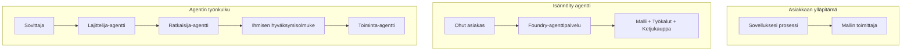
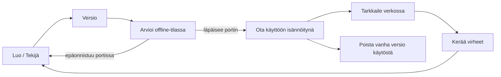
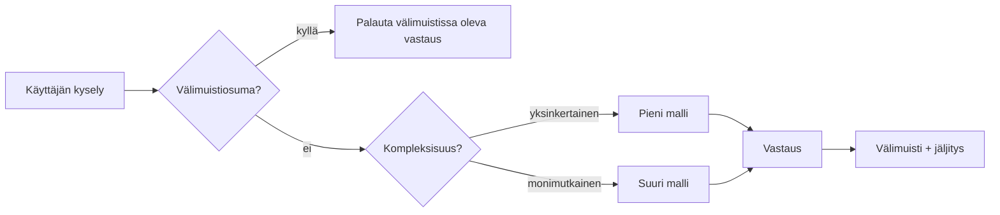
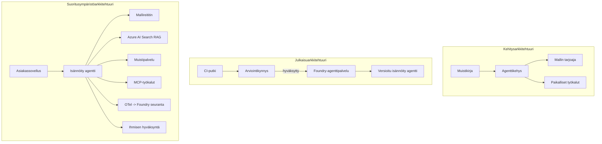

# Skaalautuvien agenttien käyttöönotto Microsoft Foundryn avulla


Tähän asti olet rakentanut agentteja, jotka toimivat kannettavallasi tietokoneella, muistikirjan sisällä, `az login` -komennolla ja joukoilla ympäristömuuttujia ohjattuna. Se on juuri oikea tapa oppia. Se ei kuitenkaan ole oikea tapa ajaa agenttia, johon tuhannet asiakkaat luottavat aamuyöllä kello 3.

Tämä oppitunti käsittelee kuilua ”se toimii omalla koneellani” ja ”se toimii luotettavasti ja kustannustehokkaasti tuotannossa” välillä. Suljemme tämän kuilun käyttämällä **Microsoft Foundrya** ja **Microsoft Foundry Agent Serviceä**, ja teemme sen rakentamalla todellisen asiakastukia agentin, jossa on työkaluja, tietojen haku, muisti, arviointi ja seuranta.

## Johdanto

Tämä oppitunti kattaa:

- Ero **prototyyppi agentin** ja **käytössä olevan agentin** välillä, ja miksi siirtyminen koskee enimmäkseen kaikkea *mallin* ympärillä olevaa.
- Agenttien **käyttöönotto-mallit**: asiakasisännöidyt, palvelin-isännöidyt (Hosted Agents) ja työnkulun orkestrointi.
- **Agentin elinkaaren hallinta** Microsoft Foundryssa — luo, versiota, käyttöönotto, arvioi, tarkkaile, eläke.
- **Skaalausstrategiat**: mallin reititys, välimuisti, samanaikaisuus ja tilattomuuden suunnittelu.
- **Havaitsevuus** OpenTelemetryn ja Foundryn jäljityksen avulla.
- **Kustannusoptimointi** mallin valinnan, reitityksen ja arviointilukkojen kautta.
- **Yritystason näkökohdat**: hallinto, ihmisen hyväksyntä ja MCP-palvelimien turvallinen ajaminen tuotannossa.

## Oppimistavoitteet

Oppitunnin jälkeen osaat:

- Valita oikean käyttöönotto-mallin tietylle agenttikuormalle.
- Ottaa agentti käyttöön Microsoft Foundry Agent Servicessä siten, että se on versioitu, hallittu ja havaittavissa.
- Instrumentoida agentti jäljitystä varten ja kytkeä arviointiputki, joka suoritetaan ennen jokaista julkaisua.
- Soveltaa mallin reititystä ja välimuistia pitämään viive ja kustannukset hallinnassa mittakaavassa.
- Lisätä ihmisen hyväksyntäportti riskialttiille toimenpiteille ja integroida MCP-palvelin tuotannon turvallisella tavalla.

## Edellytykset

Tämä oppitunti edellyttää, että olet suorittanut aiemmat oppitunnit ja osaat:

- Rakentaa agentteja [Microsoft Agent Frameworkin](../14-microsoft-agent-framework/README.md) avulla (Oppitunti 14).
- [Työkalujen käyttö](../04-tool-use/README.md) (Oppitunti 4) ja [Agentic RAG](../05-agentic-rag/README.md) (Oppitunti 5).
- [Agentin muisti](../13-agent-memory/README.md) (Oppitunti 13) ja [Agentic Protocols / MCP](../11-agentic-protocols/README.md) (Oppitunti 11).
- [Havaitsevuus ja arviointi](../10-ai-agents-production/README.md) (Oppitunti 10) — tähän oppituntiin perustuen suoraan.

Tarvitset myös:

- **Azure-tilauksen** ja **Microsoft Foundry -projektin**, jossa on vähintään yksi käyttöönotettu chat-malli.
- **Azure CLI:n**, johon olet kirjautunut (`az login`).
- Python 3.12+ ja varastossa olevat paketit [`requirements.txt`](../../../requirements.txt).

## Prototyypistä tuotantoon: mitä oikein muuttuu

Prototyyppiagentti ja tuotantoagentti jakavat saman ydinsilmukan — päättely, työkalujen kutsuminen, vastaaminen. Muuttuu kaikki, mitä silmukan ympärillä on. Malli on ehkä 20 % tuotantoagentista; loput 80 % ovat operatiivinen runko.

| Huolenaihe | Prototyyppi | Tuotanto |
| --- | --- | --- |
| **Isännöinti** | Ajetaan muistikirjassasi | Ajetaan isännöitynä palveluna, versiotettu ja julkaistu |
| **Tunnistus** | Sinun `az login` -tunnuksesi | Hallittu identiteetti rajatulla RBAC:lla |
| **Tila** | Muistissa, katoaa uudelleenkäynnistyksessä | Ulkoistettu (keskusteluketjuvarasto, muistipalvelu) |
| **Virhetilanteet** | Näet virheen jäljitteen | Uudelleenyritykset, vararatkaisut, dead-letter, hälytykset |
| **Kustannukset** | "Muutama sentti" | Seurattu pyynnöittäin, reititetty, välimuistissa, budjetoitu |
| **Laadunvalvonta** | Tarkkailet tulosta silmämääräisesti | Arvioidaan automaattisesti ennen jokaista julkaisua |
| **Luotettavuus** | Hyväksyt jokaisen toimenpiteen | Politiikka + ihmisen hyväksyntä riskialttiissa toimenpiteissä |

Pidä tämä taulukko mielessä. Jokaista alla olevaa osiota vastaa jotakin taulukon riviä.

## Agenttien käyttöönotto-mallit

Kolme mallia ovat yleisiä ja niitä käytetään usein yhdessä.

### 1. Asiakasisännöidyt agentit

Agentti-objekti elää *sinun* sovellusprosessissasi. Koodisi kutsuu mallin tarjoajaa suoraan; päättelysilmukka ajetaan palvelussasi. Tämä on se, mitä jokainen aiempi oppitunti on tehnyt.

- **Käytä, kun** tarvitset täyden kontrollin silmukasta, mukautettua välikerrosta tai upotat agentin olemassa olevaan taustajärjestelmään.
- **Vaihtoehto**: skaalautuminen, tila ja vikasietoisuus ovat sinun vastuullasi.

### 2. Isännöidyt agentit (Foundry Agent Service)

Agentti rekisteröidään *resurssina* Microsoft Foundryssa. Foundry isännöi päättelysilmukkaa, tallentaa ketjut, valvoo sisällön turvallisuutta ja RBAC:ia sekä tekee agentista näkyvän Foundryn portaalissa. Sovelluksestasi tulee ohut asiakas, joka luo ketjuja ja lukee vastauksia.

- **Käytä, kun** haluat kestävyyttä, sisäänrakennettua havaitsevyyttä, hallintaa ja vähemmän operatiivista pinta-alaa.
- **Vaihtoehto**: vähemmän matalan tason kontrollia hallitun ajon kustannuksella.

### 3. Agenttien työnkulut

Useita agentteja (ja työkaluja) yhdistetään graafiksi, jossa on eksplisiittinen ohjausvirtaus — peräkkäisiä vaiheita, haarautumista, ihmisen hyväksyntäsolmuja ja pysyviä tarkistuspisteitä, jotka voivat keskeyttää ja jatkaa. Tämä on Microsoft Agent Frameworkin **Workflows**-ominaisuus käyttöönoton mittakaavassa.

- **Käytä, kun** yksittäinen tehtävä kattaa useita erikoistuneita agentteja tai vaatii hyväksymisvaiheen keskellä.
- **Vaihtoehto**: enemmän liikkuvia osia; vaatii orkestroinnin tason havaitsevyyttä.



## Agentin elinkaari Microsoft Foundryssa

Agentin käyttöönotto ei ole yksittäinen `push`-toimenpide. Se on silmukka, ja se muistuttaa voimakkaasti ohjelmiston julkaisusykliä, sillä juuri sitä se on.



Keskeinen idea, peräisin [Oppitunnista 10](../10-ai-agents-production/README.md): **offline-arviointi on portti, ei jälkikirjoitus.** Uutta agenttiversiota ei julkaista, ellei se läpäise arviointikynnyskohdiasi. Online-havaitsevuus syöttää tuotannon virheet takaisin offline-testisarjaan. Tämä on koko silmukka.

## Skaalausstrategiat

Agentin skaalaus eroaa tilattoman web-API:n skaalaamisesta, koska jokainen pyyntö voi laukaista useita kalliita malli- ja työkalukutsuja. Neljä tekniikkaa kantavat suurimman kuorman.

**Tilaton pyynnön käsittely.** Älä pidä käyttäjäkohtaista tilaa muistissasi. Tallenna keskusteluketjut Foundryn ketjuvarastoon tai muistipalveluun, jotta mikä tahansa instanssi voi käsitellä minkä tahansa pyynnön. Tämä mahdollistaa vaakasuuntaisen skaalauksen — lisää instansseja, ei tarvetta vastaanottoistunnoille.

**Mallin reititys.** Kaikki pyynnöt eivät tarvitse tehokkainta (ja kalleinta) malliasi. Reititä yksinkertaiset pyynnöt — tarkoituksen luokitus, lyhyet faktavastaukset — pienelle, nopealle mallille ja varaudu suurta mallia aidosti päättelyyn. Foundryn **Model Router** voi tehdä sen puolestasi, tai voit toteuttaa kevyen luokittelijan itse. Rakennat tee-se-itse-version laboratoriossa.

**Vastausten välimuisti.** Monet tukikyselyt ovat lähes-identtisiä (“miten palautan salasanani?”). Välimuistita yleiset kysymykset ja tarjoa ne ilman mallin kutsua. Jo kohtalainen välimuistin osumaprosentti alentaa merkittävästi kustannuksia ja viivettä.

**Samaan aikaan suorittaminen ja takaisinpainetta.** Mallin tarjoajilla on rajoituksia pyynnöille. Rajoita samanaikaisuutta, käytä eksponentiaalista palautusta yrityksiin ja epäonnistu sulavasti (jonossa oleva ”olemme hoidossa” -vastaus on parempi kuin 500-virhe).



## Havaitsevuus tuotannossa

Et voi ohjata sitä, mitä et näe. Kuten Oppitunnissa 10 käsiteltiin, Microsoft Agent Framework lähettää **OpenTelemetry**-jäljityksiä natiivisti — jokainen mallikutsu, työkalun kutsu ja orkestrointivaihe muodostaa spanin. Tuotannossa viet nämä spanit Microsoft Foundryyn tai mihin tahansa OTel-yhteensopivaan taustajärjestelmään, jotta voit:

- Jäljittää yksittäisen asiakasvalituksen päästä päähän jokaisen mallin ja työkalun kutsun kautta.
- Tarkkailla p50/p95 viivettä ja kustannuksia pyynnöittäin ajan myötä.
- Hälyttää virheprosentin piikeistä ja kustannusanomaliosta ennen kuin käyttäjät (tai taloustiimisi) havaitsevat ne.

```python
from agent_framework.observability import get_tracer

tracer = get_tracer()

with tracer.start_as_current_span("support_request") as span:
    span.set_attribute("customer.tier", "enterprise")
    span.set_attribute("routed.model", "gpt-5-nano")
    # agentin suoritus jäljitetään automaattisesti tämän spanin sisällä
```

Attribuutit kuten `customer.tier` ja `routed.model` muuttavat valtavan määrän jäljityksiä kysymyksiksi, joihin voidaan vastata ("ohjataanko yritysasiakkaita liian usein pienelle mallille?").

## Kustannusoptimointi

Produ[ctio]-agenttien kustannukset ovat pitkälti token-pohjaisia. Kolme vipua vaikutuksen mukaan:

1. **Sopivan kokoinen malli.** Pieni malli, joka läpäisee arviointikynnyksesi, on lähes aina edullisempi kuin iso, joka myös läpäisee. Käytä arviointia todistamaan, että pieni malli on tarpeeksi hyvä sen sijaan, että valitsisit suurimman mallin varmuuden vuoksi.
2. **Reititys monimutkaisuuden perusteella.** Kuten yllä — maksa suurten mallien hinnat vain pyyntöihin, jotka vaativat suurten mallien päättelyä.
3. **Aggressiivinen välimuistitus.** Halvin mallikutsu on se, joka jää kokonaan tekemättä.

Arviointilukot ja kustannusten hallinta ovat sama kurinalaisuus eri kulmasta: arviointi kertoo *laadun pohjan*, reititys ja välimuisti pitävät kustannukset mahdollisimman lähellä tätä pohjaa.

## Yrityksen käyttöönoton näkökulmat

**Hallinto.** Hosted Agents perivät Foundryn RBAC:in, sisällön turvallisuuden ja auditointilokit. Anna jokaiselle agentille hallittu identiteetti, jolla on tarvittavat vähimmät oikeudet — lukuoikeus tietokantaan, rajatut oikeudet tikettijärjestelmään, ei enempää.

**Ihminen silmukassa.** Jotkut toimenpiteet ovat liian merkittäviä automatisoitaviksi täysin — hyvityksen myöntäminen, tilin poistaminen, laki-tiimille eskalointi. Microsoft Agent Framework tukee **hyväksyntää vaativia** työkaluja: agentti ehdottaa toimenpidettä, suoritusta keskeytetään, ihminen hyväksyy tai hylkää, ja työnkulku jatkuu. Näit käsitteen [Oppitunnissa 6](../06-building-trustworthy-agents/README.md); tässä otat sen käyttöön.

**MCP tuotannossa.** [MCP](../11-agentic-protocols/README.md) antaa agentillesi mahdollisuuden käyttää ulkoisia työkaluja standardoidun rajapinnan kautta. Tuotannossa kohtele jokaista MCP-palvelinta epäluotettavana rajapintana: kiinnitä palvelimen versioon, aja se rajatulla identiteetillä, validoi sen tulokset, älä koskaan paljasta sille salaisuuksia. MCP-palvelin on riippuvuus, ja riippuvuudet korjataan, auditoidaan ja niille asetetaan rajat.



Nämä kolme kaaviota — kehitys, käyttöönotto, ajoaika — ovat sama agentti kolmessa elämänsä vaiheessa. Seuraava laboratorio opastaa sinua sen rakentamisessa.

## Käytännön laboratorio: tuotantovalmis asiakastukia agentti

Avaa [`code_samples/16-python-agent-framework.ipynb`](./code_samples/16-python-agent-framework.ipynb) ja käy se läpi alusta loppuun. Kootaan **Contoso-asiakastukia agentti**, jossa on kaikki tuotantoon liittyvät toiminnot kytketty:

1. **Työkalujen kutsu** — tilauksen tilan tarkistus ja tukipyynnöt.
2. **RAG** — vastaa politiikkaan liittyviin kysymyksiin tietokannasta (Azure AI Searchilla, muistissa oleva varajärjestelmä, jotta muistikirja toimii ilman Search-resurssia).
3. **Muisti** — muista asiakas keskustelun aikana.
4. **Mallin reititys** — monimutkaisuusluokittelija jakaa pyynnöt pienelle tai isolle mallille.
5. **Vastausten välimuisti** — toistuvat kysymykset palvellaan välimuistista.
6. **Ihmisen hyväksyntä** — hyvitykset tietyn rajan yli pysäytetään ihmisen hyväksyntää varten.
7. **Arviointiputki** — pieni offline-testisarja pisteyttää agentin ja toimii julkaisulukona.
8. **Havaitsevuus** — OpenTelemetry-jäljitys jokaisen pyynnön ympärillä.

### Läpikäynti

Muistikirja on järjestetty siten, että jokainen tuotannon huolenaihe on itsenäinen suoritettava osio. Sen ydin on reititys-ja-välimuistikäsittelijä:

```python
async def handle_support_request(query: str, customer_id: str) -> str:
    # 1. Palvelu välimuistista, kun se on mahdollista.
    cached = response_cache.get(normalize(query))
    if cached:
        return cached

    # 2. Reititä monimutkaisuuden mukaan kustannusten hallitsemiseksi.
    model = "gpt-5-nano" if is_simple(query) else "gpt-5-mini"

    # 3. Suorita agentti jäljitysvälin sisällä havaittavuuden vuoksi.
    with tracer.start_as_current_span("support_request") as span:
        span.set_attribute("routed.model", model)
        span.set_attribute("customer.id", customer_id)
        response = await support_agent.run(query, model=model)

    # 4. Välimuistita ja palauta.
    response_cache.set(normalize(query), response.text)
    return response.text
```

Julkaisua valvova arviointilukko näyttää tältä:

```python
async def evaluation_gate(agent, test_cases, threshold: float = 0.8) -> bool:
    passed = 0
    for case in test_cases:
        result = await agent.run(case["input"])
        if score_response(result.text, case["expected"]) >= 0.8:
            passed += 1
    pass_rate = passed / len(test_cases)
    print(f"Evaluation pass rate: {pass_rate:.0%} (gate: {threshold:.0%})")
    return pass_rate >= threshold  # ota käyttöön vain, jos portti menee läpi
```

Lue jokainen rivi — muistikirja pitää peruspalikat tietoisesti pieninä, jotta mikään ei ole piilossa kehyskutsun taakse.

## Käyttöönotetun agentin validointi savutesteillä

Yllä oleva arviointilukko suoritetaan *offline* agentti-objektiisi vastaan. Kun agentti on otettu käyttöön Hosted Agentina, tarvitset vielä yhden, vielä halvemman tarkistuksen: **vastaako käyttöönotettu päätepiste oikeasti?**

"Onnistuneen" käyttöönoton todistaminen tarkoittaa vain, että ohjaustaso hyväksyi määritelmän — se ei todista, että agentti vastaa. Puuttuva riippuvuus, virheellinen mallin reititys tai vanhentunut yhteys voivat jättää vihreän käyttöönoton, joka ei palauta mitään. **Savutesti** löytää tämän sekunneissa jokaisella käyttöönotolla ilman täysarvioinnin kustannuksia.

Tämä varasto sisältää käyttövalmiin savutestiputken, joka perustuu [AI Smoke Test](https://github.com/marketplace/actions/ai-smoke-test) GitHub-toimintoon:

- **Katalogi** — [`tests/lesson-16-smoke-tests.json`](../../../tests/lesson-16-smoke-tests.json) sisältää kehotteet ja väittämät Contoso-tukia agentille (perusteelliset politiikan vastaukset, tilauksen haku, aiheessa pysyminen ja monikierroksinen ketjun jatkavuus). Muiden oppituntien agenttien katalogit sijaitsevat samassa paikassa — katso [`tests/README.md`](../tests/README.md).
- **Työnkulku** — [`.github/workflows/smoke-test.yml`](../../../.github/workflows/smoke-test.yml) kirjautuu Azure OIDC:llä ja postittaa jokaisen kehotteen agentin Responses-päätepisteeseen, epäonnistuen tehtävässä, jos mikään väite ei täyty.

```yaml
- name: Smoke-test hosted agent
  uses: JFolberth/ai-smoketest@v1
  with:
    project_endpoint: ${{ inputs.project_endpoint }}
    agent_name: ContosoSupportAgent
    tests_file: tests/lesson-16-smoke-tests.json
```


Suorita se **Actions**-välilehdeltä, kun agenttisi on otettu käyttöön, syöttämällä Foundry-projektisi päätepiste ja agentin nimi. Federoitu identiteetti tarvitsee **Azure AI User** -roolin Foundry-projektin laajuudessa. Ajattele kerroksia pyramidina: savutestit (saavutettavissa ja vastaavatko?) suoritetaan jokaisella käyttöönotolla, offline-arviointi (Onko tarpeeksi hyvä julkaistavaksi?) suoritetaan ennen edistämistä, ja online-arviointi (miten se toimii luonnossa?) suoritetaan jatkuvasti.

## Tietotesti

Testaa ymmärryksesi ennen siirtymistä tehtävään.

**1. Kuinka suuri osa tuotantoagentista on ”malli” ja mitä loput ovat?**

<details>
<summary>Vastaus</summary>

Malli on järjestelmän vähemmistö — usein mainittu olevan noin 20 %. Loput ovat operatiivista rakennetta: isännöinti ja versiointi, identiteetti ja RBAC, ulkoistettu tila, virheiden käsittely, kustannusseuranta, arviointi ja ihmisohjauksen hallinta. Tuotantoon siirtyminen on pitkälti kaiken rakentamista *päättelysilmukan* ympärille.
</details>

**2. Milloin valitsisit Hosted Agentin asiakas-isännöidyn agentin sijaan?**

<details>
<summary>Vastaus</summary>

Kun haluat hallitun suoritusaikaympäristön, jossa on sisäänrakennettu kestävyys (säikeet, jotka jatkuvat ja voivat jatkua), havaittavuus, sisällön turvallisuus ja RBAC, ja olet valmis luopumaan hieman matalan tason kontrollista päättelysilmukassa saadaksesi pienemmän operatiivisen pinta-alan. Asiakas-isännöinti on parempi, kun tarvitset täyden kontrollin silmukasta tai upotat agentin olemassa olevaan taustajärjestelmään.
</details>

**3. Miksi skaalautuvan agentin täytyy olla tilaton omassa prosessimuistissaan?**

<details>
<summary>Vastaus</summary>

Jotta mikä tahansa instanssi voi käsitellä minkä tahansa pyynnön, mikä mahdollistaa vaakasuoran skaalaamisen ilman istuntokiinnityksiä. Käyttäjäkohtainen keskustelutila ulkoistetaan säievarastoon tai muistipalveluun. Jos tila olisi prosessimuistissa, se katoaisi uudelleenkäynnistyksessä etkä voisi vapaasti jakaa kuormaa.
</details>

**4. Mitä ongelmaa mallireititys ratkaisee ja miten se liittyy arviointiin?**

<details>
<summary>Vastaus</summary>

Reititys lähettää yksinkertaiset pyynnöt pienelle, halvalle ja nopealle mallille, ja varaa suuren mallin aitoon päättelyyn, halliten sekä latenssia että kustannuksia. Se liittyy arviointiin, koska arviointi *todistaa*, että pieni malli on riittävän hyvä tiettyihin pyyntölajeihin — reititys ilman arviointia on arvaamista.
</details>

**5. Mikä on ”arviointipuomi” ja missä se sijaitsee elinkaaressa?**

<details>
<summary>Vastaus</summary>

Arviointipuomi suorittaa offline-testisarjan uudelle agenttiversiolle ja estää käyttöönoton, ellei läpäisyprosentti ylitä asetettua rajaa. Se on elinkaaren ”version” ja ”käyttöönoton” välissä, tehden laadusta ehtovaatimuksen julkaisulle sen sijaan, että se tarkistettaisiin jälkikäteen.
</details>

**6. Miksi MCP-palvelinta tulisi pitää epäluotettavana rajapintana tuotannossa?**

<details>
<summary>Vastaus</summary>

Koska se on ulkoinen riippuvuus, johon agenttisi kutsuu. Sen versio tulisi lukita, ajaa rajatulla identiteetillä, validoida sen tuotokset, rajoittaa pyyntöjen määrää ja olla koskaan paljastamatta salaisuuksia — sama kurinalaisuus, jota sovelletaan muuhun kolmannen osapuolen riippuvuuteen. Sen tuotokset vaikuttavat agentin päättelyyn, joten salaamaton luottamus on turvallisuusriski.
</details>

**7. Mikä yksittäinen muutos yleensä vaikuttaa eniten tuotantoagentin kustannuksiin ja miksi?**

<details>
<summary>Vastaus</summary>

Mallin oikeankokoistaminen — käyttämällä pienintä mallia, joka silti läpäisee arviointipuomin. Kustannukset määräytyvät enimmäkseen tokenien mukaan, ja pienempi malli, joka täyttää laatuvaatimukset, on lähes aina halvempi kuin suurempi. Välimuisti ja reititys alentavat kustannuksia edelleen, mutta oikean perustason mallin valinnalla on suurin ensivaikutus.
</details>

**8. Mikä rooli on span-attribuuteilla kuten `customer.tier` ja `routed.model` havaittavuudessa?**

<details>
<summary>Vastaus</summary>

Ne muuttavat raakajäljet vastausyksiköiksi liiketoimintakysymyksiin. Ilman attribuutteja sinulla on pelkkä spansseinäinen seinä; niiden kanssa voit kysyä ”ohjataanko yritysasiakkaita liian usein pienelle mallille?” tai ”mikä malli käsittelee hitaimmat pyyntömme?” Attribuutit ovat tapa jakaa telemetriaa juuri sinun toimintasi kannalta tärkeiden ulottuvuuksien mukaan.
</details>

## Tehtävä

Ota laboratoriosta asiakastukirobotti ja tee siitä kovempi tiettyä tilannetta varten: **tilausten laskutuksen tukirobotti SaaS-yritykselle.**

Palautuksesi tulisi:

1. **Korvata työkalut** laskutukseen liittyvillä: `get_subscription_status`, `get_invoice` ja `issue_credit` (hyvitykset yli 50 dollarin vaativat ihmisen hyväksynnän).
2. **Lisätä kolme RAG-dokumenttia** kattamaan yrityksen hyvityskäytännön, laskutusjakson ja peruutuskäytännön.
3. **Laajentaa arviointisarjaa** vähintään kahdeksaan tapaukseen, mukaan lukien vähintään kaksi, jotka *pitäisi* johtaa ihmisen hyväksymisreittiin, ja varmistaa arviointipuomin läpäisy tai hylkäys oikein.
4. **Lisätä yksi kustannusraportti**: kymmenen erilaista kyselyä suorittamisen jälkeen tulosta, kuinka moni meni pienelle mallille, kuinka moni isolle mallille ja kuinka moni haettiin välimuistista.

Kirjoita lyhyt kappale (markdown-solussa) selittäen, minkä mallireitityssäännön valitsit ja miten validoisit sen oikealla liikenteellä. Oikeaa vastausta ei ole — arvioidaan, ovatko tuotantohuomiot johdonmukaisesti yhdistetty.

## Yhteenveto

Tässä oppitunnissa siirsit agentin prototyypistä tuotantoon Microsoft Foundryn avulla:

- Siirtyminen tuotantoon on pitkälti **mallin ympärillä olevan operatiivisen rakenteen** hallintaa — isännöinti, identiteetti, tila, virheiden käsittely, kustannukset, laatu ja luottamus.
- Opit kolme **käyttöönotto-kuviota** — asiakas-isännöity, Hosted Agentit ja Agent-työnkulut — ja milloin kukin sopii.
- Kävit läpi **agentin elinkaaren**, jossa offline-**arviointi toimii julkaisuluukkuna** ja online-havaittavuus palauttaa virheet testisarjaan.
- Sovelsit **skaalausstrategioita** — tilattomuutta, mallireititystä, välimuistia ja rajattua samanaikaisuutta — ja yhdistit ne **kustannusten optimointiin**.
- Liitit mukaan **yritysvalvontaa**: RBAC, ihmisen hyväksynnän ja tuotantoturvallisen MCP-integraation.
- Rakensit **tuotantovalmiin asiakastukirobotin**, joka yhdistää kaikki nämä näkökohdat ajettavaan koodiin.

Seuraavassa oppitunnissa kuljet päinvastaista polkua: siirrät agentit pilvestä *alas* yhdelle kehittäjän koneelle ja ajat ne täysin paikallisesti.

## Lisäresurssit

- <a href="https://learn.microsoft.com/azure/ai-foundry/what-is-azure-ai-foundry" target="_blank">Microsoft Foundry -dokumentaatio</a>
- <a href="https://learn.microsoft.com/azure/ai-foundry/agents/overview" target="_blank">Microsoft Foundry Agent Service yleiskatsaus</a>
- <a href="https://learn.microsoft.com/en-us/agent-framework/overview/?wt.mc_id=youtube_26688_organicsocial_reactor&pivots=programming-language-python" target="_blank">Microsoft Agent Framework</a>
- <a href="https://learn.microsoft.com/azure/ai-foundry/concepts/model-router" target="_blank">Mallireititin Microsoft Foundryssa</a>
- <a href="https://learn.microsoft.com/azure/search/search-what-is-azure-search" target="_blank">Azure AI Search</a>
- <a href="https://opentelemetry.io/" target="_blank">OpenTelemetry</a>
- <a href="https://github.com/marketplace/actions/ai-smoke-test" target="_blank">AI Smoke Test GitHub Action</a>
- <a href="https://modelcontextprotocol.io/" target="_blank">Model Context Protocol (MCP)</a>

## Edellinen oppitunti

[Tietokoneen käyttöagenttien rakentaminen (CUA)](../15-browser-use/README.md)

## Seuraava oppitunti

[Paikallisten AI-agenttien luominen](../17-creating-local-ai-agents/README.md)

---

<!-- CO-OP TRANSLATOR DISCLAIMER START -->
**Vastuuvapauslauseke**:
Tämä asiakirja on käännetty käyttämällä tekoälypohjaista käännöspalvelua [Co-op Translator](https://github.com/Azure/co-op-translator). Vaikka pyrimme tarkkuuteen, otathan huomioon, että automaattiset käännökset saattavat sisältää virheitä tai epätarkkuuksia. Alkuperäinen asiakirja sen alkuperäiskielellä on virallinen lähde. Tärkeissä asioissa suositellaan ammattimaista ihmiskäännöstä. Emme ole vastuussa tämän käännöksen käytöstä aiheutuvista väärinymmärryksistä tai tulkinnoista.
<!-- CO-OP TRANSLATOR DISCLAIMER END -->