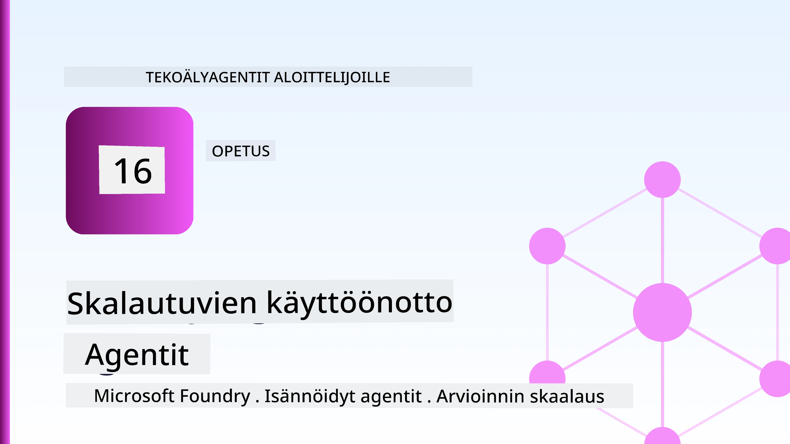
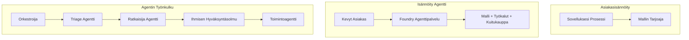
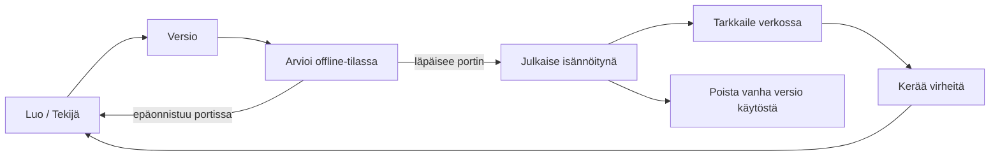
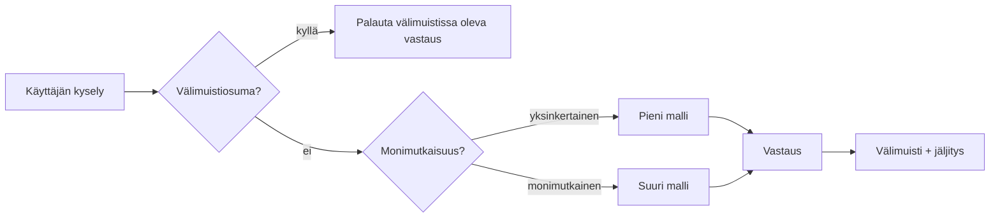
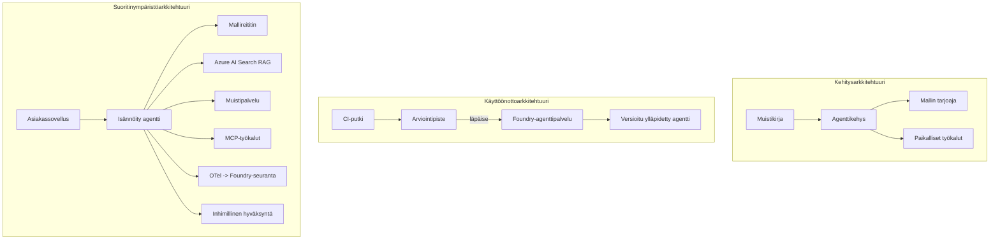

# Skaalautuvien agenttien käyttöönotto Microsoft Foundryn avulla



Tähän mennessä kurssilla olet rakentanut agentteja, jotka toimivat kannettavassasi tietokoneessa, muistikirjassa, ohjattuna `az login` -komennolla ja muutamalla ympäristömuuttujalla. Tämä on juuri oikea tapa oppia. Se ei kuitenkaan ole oikea tapa ajaa agenttia, johon tuhannet asiakkaat luottavat kolmelta aamuyöllä.

Tässä oppitunnissa käsittelemme kuilua "se toimii koneellani" ja "se toimii luotettavasti ja kustannustehokkaasti tuotannossa" välillä. Suljemme tämän kuilun käyttämällä **Microsoft Foundrya** ja **Microsoft Foundry Agent Serviceä**, ja teemme sen rakentamalla todellisen asiakastukagentin, jolla on työkalut, tiedonhaku, muisti, arviointi ja valvonta.

## Johdanto

Tässä oppitunnissa käsitellään:

- Ero **prototyyppiagentin** ja **käyttöönotetun agentin** välillä ja miksi siirtymä koskee enimmäkseen kaikkea *mallin ympärillä*.
- Agenettien **käyttöönotto-mallit**: asiakasisännöity, palvelimisännöity (Hosted Agents) ja työnkulun orkestrointi.
- **Agentin elinkaari** Microsoft Foundryssä — luonti, versiointi, käyttöönotto, arviointi, valvonta, käytöstä poisto.
- **Skaalausstrategiat**: mallin ohjaus, välimuisti, samanaikaisuus ja tilattomuus.
- **Havaittavuus** OpenTelemetryn ja Foundryn jäljityksen avulla.
- **Kustannusten optimointi** mallin valinnan, ohjauksen ja arviointipisteiden kautta.
- **Yritystason näkökohdat**: hallinnointi, ihmisen hyväksyntä ja MCP-palvelimien turvallinen käyttö tuotannossa.

## Oppimistavoitteet

Oppitunnin suorittamisen jälkeen osaat:

- Valita oikean käyttöönottomallin tietylle agentin kuormitukselle.
- Ottaa agentti käyttöön Microsoft Foundry Agent Servicessa siten, että se on versioitu, hallinnoitu ja havaittavissa.
- Instrumentoida agentti jäljitystä varten ja kytkeä arviointiputki, joka suoritetaan ennen jokaista julkaisua.
- Soveltaa mallin ohjausta ja välimuistia, jotta viive ja kustannukset pysyvät hallinnassa skaalassa.
- Lisätä ihmisen hyväksyntäportti korkean riskin toimille ja integroida MCP-palvelin tuotantoturvallisesti.

## Esivaatimukset

Tämä oppitunti olettaa, että olet suorittanut aiemmat oppitunnit ja hallitset:

- Agenttien rakentamisen [Microsoft Agent Frameworkilla](../14-microsoft-agent-framework/README.md) (Oppitunti 14).
- [Työkalujen käyttö](../04-tool-use/README.md) (Oppitunti 4) ja [Agentic RAG](../05-agentic-rag/README.md) (Oppitunti 5).
- [Agentin muisti](../13-agent-memory/README.md) (Oppitunti 13) ja [Agentic Protocols / MCP](../11-agentic-protocols/README.md) (Oppitunti 11).
- [Havaittavuus ja arviointi](../10-ai-agents-production/README.md) (Oppitunti 10) — tämä oppitunti rakentuu suoraan sen päälle.

Tarvitset myös:

- **Azure-tilauksen** ja **Microsoft Foundry -projektin**, jossa on vähintään yksi käyttöön otettu chat-malli.
- Todennuksen Azure CLI:ssä (`az login`).
- Python 3.12+ ja riippuvuudet arkistossa [`requirements.txt`](../../../requirements.txt).

## Prototyypistä tuotantoon: mitä oikeastaan muuttuu

Prototyyppiagentti ja tuotantoagentti jakavat saman ydinsilmukan — päättely, työkalujen kutsu, vastaaminen. Muuttuu kaikki, mikä käärii tämän silmukan ympärille. Malli muodostaa ehkä 20 % tuotantoagentista; muu 80 % on operatiivinen runko.

| Huolenaihe | Prototyyppi | Tuotanto |
| --- | --- | --- |
| **Isännöinti** | Ajetaan muistikirjassa | Ajetaan isännöitynä palveluna, versioituna ja käyttöön otettuna |
| **Tunnistus** | Sinun `az login` -tokenisi | Hallinnoitu identiteetti rajatulla RBAC-käytöllä |
| **Tila** | Muistissa, katoaa uudelleenkäynnistyksessä | Ulkoistettu (keskustelulokivarasto, muistipalvelu) |
| **Virheet** | Näet virhesyötteen | Uudelleenyritykset, varahälytykset, kuolleen kirjeen jono, hälytykset |
| **Kustannukset** | "Se on vain muutama sentti" | Seurataan pyyntökohtaisesti, ohjataan, välimuistitetaan, budjetoidaan |
| **Laadunvalvonta** | Arvioit visuaalisesti tuloksen | Arvioidaan automaattisesti ennen jokaista julkaisua |
| **Luottamus** | Hyväksyt jokaisen toiminnon | Politiikka + ihmisen valvonta riskialttiissa toimissa |

Pidä tämä taulukko mielessä. Jokainen alla oleva osio vastaa yhtä taulukon riviä.

## Agentin käyttöönoton mallit

Käytössäsi on kolme mallia, usein yhdistelminä.

### 1. Asiakasisännöidyt agentit

Agentti-objekti elää *sinun* sovellusprosessissasi. Koodisi kutsuu suoraan mallipalvelua; päättelysilmukka pyörii omassa palvelussasi. Tätä on kaikki aiemmat oppitunnit tehneet.

- **Käytä, kun** tarvitset täydellistä hallintaa silmukasta, mukautettua middlewarea tai olet upottamassa agenttia olemassa olevaan backend-järjestelmään.
- **Haittapuoli**: sinun tulee itse hallita skaalaus, tila ja vikasietokyky.

### 2. Isännöidyt agentit (Foundry Agent Service)

Agentti *rekisteröidään resurssiksi* Microsoft Foundryssä. Foundry isännöi päättelysilmukkaa, tallentaa keskusteluketjut, valvoo sisällön turvallisuutta ja RBAC-käyttöoikeuksia sekä tekee agentista näkyvän Foundry-portaalissa. Sovelluksesi muuttuu ohueksi asiakkaaksi, joka luo ketjuja ja lukee vastauksia.

- **Käytä, kun** haluat kestävyyttä, sisäänrakennettua havaittavuutta, hallinnointia ja vähemmän operatiivista pinta-alaa.
- **Haittapuoli**: vähemmän matalan tason hallintaa vastapainona hallinnoidulle ajoympäristölle.

### 3. Agenttien työnkulut

Useita agentteja (ja työkaluja) koostetaan graphiksi, jossa on eksplisiittinen kontrollivirta – sekventiaaliset vaiheet, haarautuminen, ihmisen hyväksyntäsolmut ja kestäviä tarkistuspisteitä, jotka voivat pysäyttää ja jatkaa työtä. Tämä on Microsoft Agent Frameworkin **Workflows**-ominaisuus sovellettuna käyttöönoton mittakaavaan.

- **Käytä, kun** tehtävä kattaa useita erikoistuneita agentteja tai vaatii hyväksymisvaiheen keskellä.
- **Haittapuoli**: enemmän liikkuvia osia; tarvitaan orkestroinnin tasolla näkyvyyttä.



## Agentin elinkaari Microsoft Foundryssä

Agentin käyttöönotto ei ole kertaluontoinen `push`. Se on silmukka, ja se muistuttaa paljon ohjelmiston julkaisusykliä, koska se on juuri sitä.



Keskeinen ajatus, joka on peräisin [Oppitunnista 10](../10-ai-agents-production/README.md): **offline-arviointi on portti, ei jälkikäteen lisätty vaihe.** Uutta agenttiversiota ei julkaista, ellei se läpäise arviointikynnyksiäsi. Online-havaittavuus syöttää sitten oikean maailman virheitä takaisin offline-testisettiin. Se on koko silmukka.

## Skaalausstrategiat

Agentin skaalaus eroaa tilattoman web-API:n skaalaamisesta, koska kukin pyyntö voi laukaista useita kalliita malli- ja työkalukutsuja. Neljä tekniikkaa kantaa suurimman kuorman.

**Tilattomien pyyntöjen käsittely.** Älä säilytä käyttäjäkohtaista tilaa prosessimuistissa. Tallenna keskusteluketjut Foundryn ketjuvarastoon tai muistipalveluun, jotta mikä tahansa instanssi voi käsitellä minkä tahansa pyynnön. Tämä mahdollistaa horisontaalisen skaalauksen – lisää instansseja, ei kiinteitä istuntoja.

**Mallin ohjaus.** Kaikki pyynnöt eivät tarvitse tehokkainta (ja kalleinta) malliasi. Ohjaa yksinkertaiset pyynnöt – tarkoitusluokitus, lyhyet faktavastaukset – pieneen, nopeaan malliin ja varaa suuri malli aitoon päättelyyn. Foundryn **Model Router** voi tehdä tämän puolestasi, tai voit toteuttaa kevyen luokittelijan itse. Rakennat DIY-version harjoituksessa.

**Vastausten välimuistitus.** Monet tukikyselyt ovat lähes kopioita ("miten resetoin salasanani?"). Välimuistita yleiset kysymykset ja tarjoa vastaukset ilman mallikutsua. Jo maltillinen välimuistiosuma vähentää kustannuksia ja viivettä merkittävästi.

**Samanaikaisuus ja takaisku.** Mallipalveluilla on pyyntörajoitukset. Rajoita samanaikaisuutta, käytä uudelleenyrityksiä eksponentiaalisella takaisinviiveellä ja epäonnistu mallikkaasti (jonotettu "me hoidamme" -vastaus on parempi kuin 500-virhe).



## Havaittavuus tuotannossa

Et voi hallita sitä, mitä et näe. Kuten Oppitunnissa 10 käsiteltiin, Microsoft Agent Framework lähettää **OpenTelemetry**-jäljityksiä natiivisti — jokainen mallikutsu, työkalukutsu ja orkestrointivaihe muuttuu jaksoon. Tuotannossa viet ne Microsoft Foundryyn (tai mihin tahansa OTel-yhteensopivaan backendään), jotta voit:

- Jäljittää yksittäisen asiakasvalituksen päästä päähän jokaisen mallin ja työkalukutsun yli.
- Seurata p50/p95-viivettä ja kustannuksia pyyntöä kohden ajan kuluessa.
- Hälyttää virheiden määrän piikeistä ja kustannushäiriöistä ennen kuin käyttäjäsi (tai taloustiimisi) huomaavat ne.

```python
from agent_framework.observability import get_tracer

tracer = get_tracer()

with tracer.start_as_current_span("support_request") as span:
    span.set_attribute("customer.tier", "enterprise")
    span.set_attribute("routed.model", "gpt-5-nano")
    # agentin suoritus jäljitetään automaattisesti tämän spanssin sisällä
```

Ominaisuudet kuten `customer.tier` ja `routed.model` muuttavat suuren määrän jäljityksiä vastauskelpoisiksi kysymyksiksi ("ohjaavatko yritysasiakkaat liian usein pieneen malliin?").

## Kustannusten optimointi

Tuotantoagenttien kustannukset aiheutuvat pääosin tokenien käytöstä. Kolme vipua vaikutuksen mukaan:

1. **Valitse sopivan kokoinen malli.** Pieni malli, joka läpäisee arviointisi, on lähes aina halvempi kuin suuri, joka myös läpäisee. Käytä arviointia todistaaksesi, että pieni malli on riittävä sen sijaan, että turvaudut aina suurimpaan varmuuden vuoksi.
2. **Ohjaa monimutkaisuuden mukaan.** Kuten edellä — maksa suurimallin hinnat vain pyynnöistä, jotka tarvitsevat suurimallin päättelyä.
3. **Välimuistita aggressiivisesti.** Halvin mallikutsu on se, jota et koskaan tee.

Arviointipisteet ja kustannusten hallinta ovat samaa kurinalaisuutta eri näkökulmista: arviointi kertoo *laadun alarajan*, ohjaus ja välimuistitus pitävät kustannukset mahdollisimman lähellä kyseistä rajaa.

## Yrityskoon käyttöönoton näkökohdat

**Hallinnointi.** Hosted Agents perii Foundryn RBACin, sisällön turvamääritykset ja auditointilokit. Anna jokaiselle agentille hallinnoitu identiteetti vähimmillä tarvittavilla oikeuksilla — lukuoikeus tietokantaan, rajattu pääsy tukipalvelulle, ei mitään ylimääräistä.

**Ihminen mukana.** Jotkut toimenpiteet ovat liian merkittäviä automatisoitaviksi suoraan — hyvityksen myöntäminen, tilin poistaminen, oikeusasioiden eskalointi. Microsoft Agent Framework tukee **hyväksyntää vaativia** työkaluja: agentti ehdottaa toimenpidettä, suoritus keskeytyy, ihminen hyväksyy tai hylkää ja työnkulku jatkuu. Näit primitiven jo [Oppitunnissa 6](../06-building-trustworthy-agents/README.md); tässä otat sen käyttöön.

**MCP tuotannossa.** [MCP](../11-agentic-protocols/README.md) mahdollistaa agenttisi käyttää ulkoisia työkaluja standardoidun rajapinnan kautta. Tuotannossa käsittele jokaista MCP-palvelinta luottamattomana rajapintana: pinnaa palvelimen versio, aja se rajatulla identiteetillä, validoi sen tulokset ja älä koskaan paljasta sille salaisuuksia. MCP-palvelin on riippuvuus, ja riippuvuuksia korjataan, auditoidaan ja rajoitetaan.



Nuo kolme kaaviota — kehitys, käyttöönotto, ajonaikainen vaihe — ovat saman agentin kolme elämänvaihetta. Seuraava harjoitus ohjaa sinut sen rakentamiseen.

## Käytännön harjoitus: tuotantokelpoinen asiakastukiapuri

Avaa [`code_samples/16-python-agent-framework.ipynb`](./code_samples/16-python-agent-framework.ipynb) ja käy se läpi kokonaan. Koot työssä **Contoso-asiakastukiapurin**, johon kaikki tuotantoon liittyvät näkökohdat on liitetty:

1. **Työkalujen kutsu** — selvitä tilauksen tila ja avaa tukipyyntöjä.
2. **RAG** — vastaa politiikkakysymyksiin tietokannasta (Azure AI Search, sisäisen muistin varajärjestelmä jotta muistikirja toimii ilman Search-resurssia).
3. **Muisti** — muista asiakas keskustelun eri vuoroissa.
4. **Mallin ohjaus** — monimutkaisuusluokittelija ohjaa jokaisen pyynnön pieneen tai suureen malliin.
5. **Vastausten välimuistitus** — toistuvat kysymykset palvelaan välimuistista.
6. **Ihmisen hyväksyntä** — kynnysarvon ylittävät hyvitykset odottavat ihmisen hyväksyntää.
7. **Arviointiputki** — pieni offline-testisetti pisteyttää agentin ja toimii julkaisun porttina.
8. **Havaittavuus** — OpenTelemetry-jäljitys jokaisen pyynnön yhteydessä.

### Läpikäynti

Muistikirja on järjestetty niin, että kukin tuotantoon liittyvä osa-alue on itsenäinen, ajettava osio. Sen sydän on ohjaus-yhdistetty-välimuistin pyyntöjen käsittelijä:

```python
async def handle_support_request(query: str, customer_id: str) -> str:
    # 1. Palvele välimuistista, kun voimme.
    cached = response_cache.get(normalize(query))
    if cached:
        return cached

    # 2. Reititä monimutkaisuuden mukaan kustannusten hallitsemiseksi.
    model = "gpt-5-nano" if is_simple(query) else "gpt-5-mini"

    # 3. Suorita agentti jäljen sisällä havaittavuuden vuoksi.
    with tracer.start_as_current_span("support_request") as span:
        span.set_attribute("routed.model", model)
        span.set_attribute("customer.id", customer_id)
        response = await support_agent.run(query, model=model)

    # 4. Vältä ja palauta.
    response_cache.set(normalize(query), response.text)
    return response.text
```

Julkaisua valvova arviointipordti näyttää tältä:

```python
async def evaluation_gate(agent, test_cases, threshold: float = 0.8) -> bool:
    passed = 0
    for case in test_cases:
        result = await agent.run(case["input"])
        if score_response(result.text, case["expected"]) >= 0.8:
            passed += 1
    pass_rate = passed / len(test_cases)
    print(f"Evaluation pass rate: {pass_rate:.0%} (gate: {threshold:.0%})")
    return pass_rate >= threshold  # ota käyttöön vain, jos portti menee läpi
```

Lue jokainen rivi — muistikirjassa primitiivit pidetään tarkoituksella pieninä, joten mikään ei ole piilossa kehyskäskyn takana.

## Käyttöönotetun agentin validointi savutestien avulla

Yllä oleva arviointiportti suoritetaan *offline* agenttiobjektiin. Kun agentti on otettu käyttöön Hosted Agentina, tarvitset vielä yhden halvemman tarkistuksen: **vastaaako käyttöönotettu päätepiste todellisuudessa?**

"Onnistunut" käyttöönotto osoittaa ainoastaan, että hallintakerros hyväksyi määritelmän — se ei takaa, että agentti vastaa. Puuttuva riippuvuus, väärä mallin ohjaus tai vanhentunut yhteys voi jättää vihreän käyttöönoton, joka ei palauta mitään. **Savutesti** havaitsee tämän sekunneissa, jokaisella käyttöönotolla, ilman täysimittaista arviointia.

Tämä arkisto sisältää valmiin savutestiputken, joka rakentuu [AI Smoke Test](https://github.com/marketplace/actions/ai-smoke-test) GitHub-toiminnon päälle:

- **Luettelo** — [`tests/lesson-16-smoke-tests.json`](../../../tests/lesson-16-smoke-tests.json) sisältää kehotteet ja väittämät Contoso-tukiapurille (perustuvat politiikkavastaukset, tilauksen haku, aiheen pysyminen, monivuorokeskustelun jatkuvuus). Muiden oppituntien agenttien luettelot sijaitsevat siinä vieressä — katso [`tests/README.md`](../tests/README.md).
- **Työnkulku** — [`.github/workflows/smoke-test.yml`](../../../.github/workflows/smoke-test.yml) kirjautuu Azure OIDC:llä ja POSTaa jokaisen kehotteen agentin Vastaukset-päätepisteeseen, epäonnistuen jos jokin väittämä ei täyty.

```yaml
- name: Smoke-test hosted agent
  uses: JFolberth/ai-smoketest@v1
  with:
    project_endpoint: ${{ inputs.project_endpoint }}
    agent_name: ContosoSupportAgent
    tests_file: tests/lesson-16-smoke-tests.json
```


Suorita se **Actions**-välilehdeltä, kun agenttisi on otettu käyttöön, ja anna Foundry-projektisi päätepiste ja agentin nimi. Liittovaltion tunnistautumisella tulee olla **Azure AI User** -rooli Foundry-projektin laajuudessa. Ajattele kerroksia pyramidina: savutestit (saavutettavissa ja vastaavatko?) suoritetaan jokaisessa käyttöönotossa, offline-arviointi (riittävän hyvä julkaistavaksi?) suoritetaan ennen edistämistä ja online-arviointi (miten se pärjää luonnossa?) suoritetaan jatkuvasti.

## Tietotarkistus

Testaa ymmärryksesi ennen siirtymistä tehtävään.

**1. Kuinka suuri osa tuotantoagentista on "malli" ja mitä on muu osa?**

<details>
<summary>Vastaus</summary>

Malli on järjestelmän vähemmistön osuus — usein noin 20%. Loput ovat operatiivinen runko: isännöinti ja versiohallinta, tunnistautuminen ja RBAC, ulkoistettu tila, virheiden käsittely, kustannusseuranta, arviointi ja ihmisen ohjaaminen. Siirtyminen tuotantoon liittyy lähinnä kaiken rakentamiseen *ajattelusilmukan ympärille*.
</details>

**2. Milloin valitsisit Hosted Agentin client-isännöidyn agentin sijaan?**

<details>
<summary>Vastaus</summary>

Kun haluat hallitun suoritusympäristön, joka tarjoaa sisäänrakennetun säilyvyyden (jatkuvat säikeet, jotka voivat jatkaa toimintaansa), havainnoitavuuden, sisällön turvallisuuden ja RBAC:n, ja olet valmis luopumaan jonkin verran matalan tason hallinnasta ajattelusilmukassa saadaksesi vähemmän operatiivista pinta-alaa. Client-isännöity on parempi, kun tarvitaan täysi hallinta silmukasta tai agentti upotetaan olemassa olevaan backend-järjestelmään.
</details>

**3. Miksi skaalautuva agentti on oltava tilaton omassa prosessimuistissaan?**

<details>
<summary>Vastaus</summary>

Näin mikä tahansa instanssi voi käsitellä minkä tahansa pyynnön, mikä mahdollistaa vaakasuuntaisen skaalaamisen ilman sticky-sessioita. Käyttäjäkohtaisten keskustelujen tila ulkoistetaan säikeiden tallennukseen tai muistipalveluun. Jos tila olisi prosessimuistissa, se katoaisi uudelleenkäynnistyksen yhteydessä eikä kuormaa voisi jakaa vapaasti.
</details>

**4. Minkä ongelman mallijako ratkaisee ja miten se liittyy arviointiin?**

<details>
<summary>Vastaus</summary>

Mallijako ohjaa yksinkertaiset pyynnöt pieneen, halpaan, nopeaan malliin ja varaa suuren mallin aitoon päättelyyn halliten sekä latenssia että kustannuksia. Se liittyy arviointiin, koska arviointi todistaa, että pieni malli riittää tiettyjen pyyntöjen luokkaan — jakaminen ilman arviointia on arvailua.
</details>

**5. Mikä on "arviointiloukku" ja missä elinkaaressa se sijaitsee?**

<details>
<summary>Vastaus</summary>

Arviointiloukku suorittaa offline-testin uudelle agentin versiolle ja estää käyttöönoton, ellei läpäisyprosentti ylitä kynnystä. Se sijaitsee "versio" ja "käyttöönotto" -vaiheiden välillä elinkaaressa, tehden laadusta esitarkistuksen julkaisua varten eikä jälkikäteen tarkistettavan asian.
</details>

**6. Miksi MCP-palvelinta tulisi pitää epäluotettavana rajapintana tuotannossa?**

<details>
<summary>Vastaus</summary>

Koska se on ulkoinen riippuvuus, johon agenttisi kutsuu. Sen version tulee olla lukittu, se tulee ajaa rajatulla identiteetillä, validoida sen tuotokset, rajoittaa palvelupyynnöt eikä koskaan paljastaa sille salaisuuksia — samoja periaatteita kuin minkä tahansa kolmannen osapuolen riippuvuuden kohdalla. Sen tuotokset vaikuttavat agenttisi päättelyyn, joten validoimaton luottamus on turvallisuusriski.
</details>

**7. Mikä yksittäinen muutos yleensä vaikuttaa eniten tuotantoagentin kustannuksiin ja miksi?**

<details>
<summary>Vastaus</summary>

Mallin koon oikea valinta — käyttämällä pienintä mallia, joka läpäisee arviointiloukun. Kustannukset määräytyvät enimmäkseen tokenien mukaan, ja pienempi malli, joka täyttää laatuvaatimukset, on lähes aina halvempaa kuin suurempi. Välimuisti ja mallijako vähentävät kustannuksia edelleen, mutta oikean perustason mallin valinta on suurin suoraan vaikuttava tekijä.
</details>

**8. Mikä rooli span-ominaisuuksilla kuten `customer.tier` ja `routed.model` on havainnoitavuudessa?**

<details>
<summary>Vastaus</summary>

Ne muuttavat raakatrajaukset vastauksiksi liiketoimintakysymyksiin. Ilman ominaisuuksia sinulla on pelkkä joukko mitattuja tapahtumia; niiden kanssa voit kysyä "saavatko yritysasiakkaat liian usein ohjauksen pienelle mallille?" tai "mikä malli käsittelee hitaimmat pyyntömme?" Ominaisuudet ovat tapa pilkkoa telemetriaa niillä ulottuvuuksilla, jotka ovat merkityksellisiä toimintasi kannalta.
</details>

## Tehtävä

Ota laboratoriosta tuttu asiakastukirobotti ja vahvista se tiettyä skenaariota varten: **tilauslaskutuksen tukirobotti SaaS-yritykselle.**

Palautuksesi tulee sisältää:

1. **Korvaa työkalut** laskutukseen liittyvillä, kuten `get_subscription_status`, `get_invoice` ja `issue_credit` (hyvitykset yli 50 dollaria vaativat ihmisen hyväksynnän).
2. **Lisää kolme RAG-dokumenttia** kattamaan yrityksen hyvityskäytännön, laskutusjakson ja peruutuskäytännön.
3. **Laajenna arviointisarja** vähintään kahdeksaan tapaukseen, mukaan lukien vähintään kaksi, jotka *pitäisi* laukaista ihmisen hyväksyntäpolku, ja varmista, että arviointiloukku läpäisee tai hylkää oikein.
4. **Lisää yksi kustannusraportti**: ajetettuasi kymmenen erilaista kyselyä agentin läpi, tulosta kuinka monta meni pienelle mallille, kuinka monta suurelle mallille ja kuinka monta palveltiin välimuistista.

Kirjoita lyhyt kappale (markdown-solussa) selittäen, minkä mallijako-säännön valitsit ja miten validoisit sen oikealla liikenteellä. Oikeaa vastausta ei ole; arvioidaan, ovatko tuotantoon liittyvät näkökohdat johdonmukaisesti yhteen kytkettyjä.

## Yhteenveto

Tässä oppitunnissa siirsit agentin prototyypistä tuotantoon Microsoft Foundryn avulla:

- Siirtyminen tuotantoon liittyy pääosin **mallin ympärillä** olevaan operatiiviseen runkoon — isännöinti, tunnistautuminen, tila, virheiden käsittely, kustannukset, laatu ja luottamus.
- Opit kolme **käyttöönoton mallia** — client-isännöity, Hosted Agentit ja Agent Workflows — ja milloin kukin sopii.
- Kävelit **agentin elinkaaren**, jossa offline-**arviointi toimii julkaisuporttina** ja online-havainnoitavuus syöttää virheet takaisin testijoukkoon.
- Käytit **skaalausstrategioita** — tilaton suunnittelu, mallijako, välimuisti ja rajattu samanaikaisuus — ja yhdistit ne **kustannusten optimointiin**.
- Kytkit päälle **yritystason kontrollit**: RBAC, ihmisen hyväksyntä ja tuotantoturvallinen MCP-integraatio.
- Rakensit **tuotantovalmiin asiakastukiagentin**, joka yhdistää kaikki nämä näkökohdat suoritettavaan koodiin.

Seuraava oppitunti vie päinvastaisen matkan: tuotantoagenttien skaalaamisen pilveen sijaan tuot ne *alas* yhdelle kehittäjän koneelle ja ajat täysin paikallisesti.

## Lisäresurssit

- <a href="https://learn.microsoft.com/azure/ai-foundry/what-is-azure-ai-foundry" target="_blank">Microsoft Foundryn dokumentaatio</a>
- <a href="https://learn.microsoft.com/azure/ai-foundry/agents/overview" target="_blank">Microsoft Foundry Agent Service -yleiskatsaus</a>
- <a href="https://learn.microsoft.com/en-us/agent-framework/overview/?wt.mc_id=youtube_26688_organicsocial_reactor&pivots=programming-language-python" target="_blank">Microsoft Agent Framework</a>
- <a href="https://learn.microsoft.com/azure/ai-foundry/concepts/model-router" target="_blank">Model Router Microsoft Foundryssä</a>
- <a href="https://learn.microsoft.com/azure/search/search-what-is-azure-search" target="_blank">Azure AI Search</a>
- <a href="https://opentelemetry.io/" target="_blank">OpenTelemetry</a>
- <a href="https://github.com/marketplace/actions/ai-smoke-test" target="_blank">AI Smoke Test GitHub Action</a>
- <a href="https://modelcontextprotocol.io/" target="_blank">Model Context Protocol (MCP)</a>

## Edellinen oppitunti

[Rakennetaan tietokoneen käyttöagentteja (CUA)](../15-browser-use/README.md)

## Seuraava oppitunti

[Paikallisten tekoälyagenttien luominen](../17-creating-local-ai-agents/README.md)

---

<!-- CO-OP TRANSLATOR DISCLAIMER START -->
**Vastuuvapauslauseke**:
Tämä asiakirja on käännetty käyttämällä tekoälypohjaista käännöspalvelua [Co-op Translator](https://github.com/Azure/co-op-translator). Vaikka pyrimme tarkkuuteen, otathan huomioon, että automaattiset käännökset saattavat sisältää virheitä tai epätarkkuuksia. Alkuperäinen asiakirja sen alkuperäiskielellä on virallinen lähde. Tärkeissä asioissa suositellaan ammattimaista ihmiskäännöstä. Emme ole vastuussa tämän käännöksen käytöstä aiheutuvista väärinymmärryksistä tai tulkinnoista.
<!-- CO-OP TRANSLATOR DISCLAIMER END -->