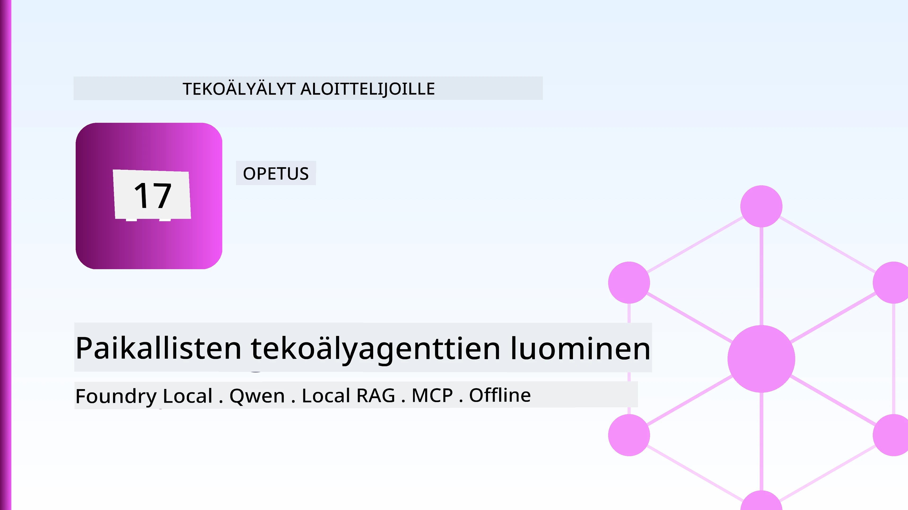
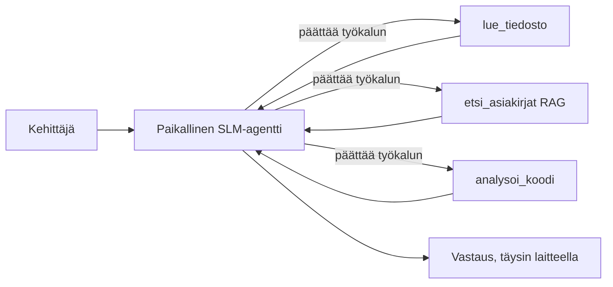
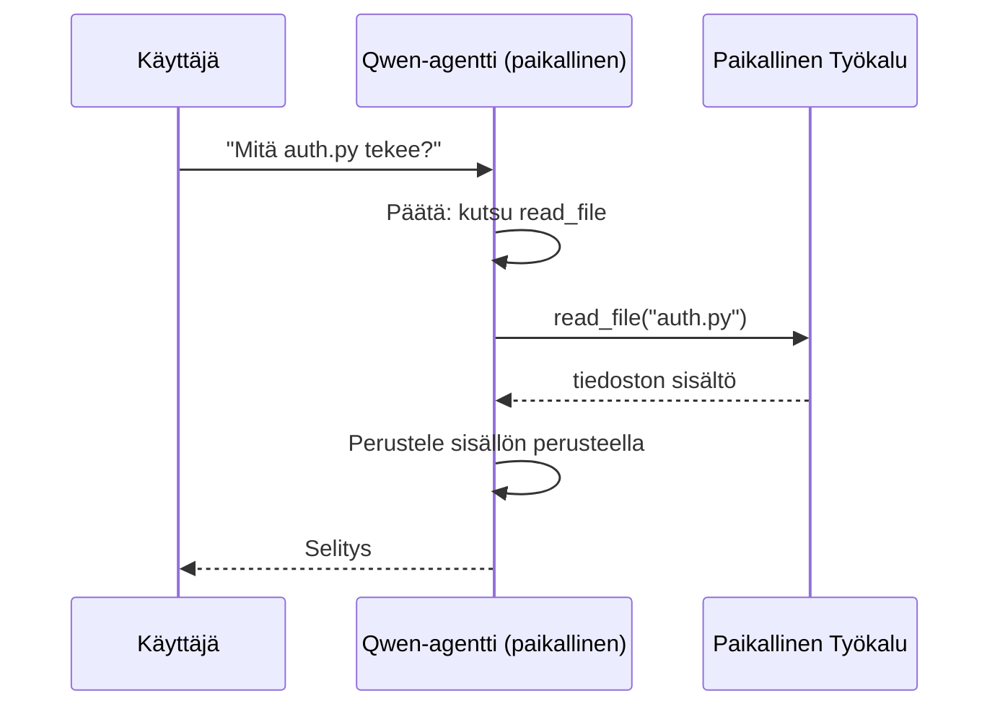
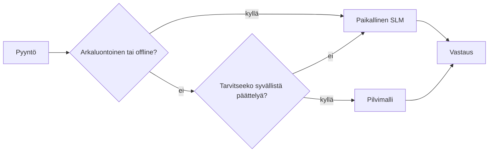

# Paikallisten tekoälyagenttien luominen Microsoft Foundry Localilla ja Qwenillä



Edellinen oppitunti skaalasi agenteja *pilveen*. Tämä tuo ne *alas* yhdelle koneelle. Lopuksi sinulla on toimiva insinöörin assistentti, joka päättelyttää, kutsuu työkaluja, lukee tiedostojasi ja hakee dokumentaatiotasi — **ilman yhtäkään pilvipohjaista päättelykutsua.**

Miksi haluaisit tämän? Kolme syytä, jotka nousevat jatkuvasti esiin aidossa insinööritöissä:

- **Tietosuoja.** Koodi ja dokumentit eivät koskaan poistu koneelta. Ei kehotteita, ei koodipätkiä, ei asiakastietoja ylitä verkon rajaa.
- **Kustannukset.** Paikallinen päättely ei veloita per token -maksua. Voit toistaa kehitystyötä koko päivän sähköenergian hinnalla.
- **Offline-tila.** Lentokoneessa, turvatilassa tai sähkökatkon aikana agentti toimii silti.

Haittapuoli on se, että vaihdat etulinjan pilvimallin **pieneen kielimalliin (SLM)**, joka pyörii CPU:lla, GPU:lla tai NPU:lla. Tämä oppitunti käsittelee agenttien rakentamista, jotka ovat *hyviä* tämän rajoituksen sisällä sen sijaan, että teeskentelisit, ettei rajoitusta ole.

## Johdanto

Tämä oppitunti kattaa:

- **Pienet kielimallit (SLM:t)** — mitä ne ovat, missä ne loistavat ja missä eivät.
- **Microsoft Foundry Local** — ajoympäristö, joka lataa ja palvelee malleja laitteellasi **OpenAI-yhteensopivan API:n** kautta.
- **Qwen-funktiokutsumallit** — SLM:t, jotka tuottavat luotettavasti työkalukutsuja, mikä tekee paikallisista *agenteista* (ei vain paikallisesta keskustelusta) mahdollisia.
- **Paikalliset työkalut, paikallinen RAG ja paikallinen MCP** — jotka antavat agentille kyvykkyyden ilman pilveä.
- **Hybridimallit** — milloin pitää pysyä paikallisessa ja milloin kääntyä pilven puoleen.

## Oppimistavoitteet

Tässä oppitunnissa opit:

- Selittämään SLM:ien kompromissit ja valitsemaan sopivia paikallisia agenttisovelluksia.
- Palvelemaan Qwen-mallia paikallisesti Foundry Localilla ja yhdistämään siihen OpenAI-yhteensopivan päätepisteen kautta.
- Rakentamaan työkalukutsuvan agentin, joka toimii kokonaan työasemallasi.
- Lisäämään paikallisen RAG:n omien dokumenttien päälle paikallista vektoritietokantaa (Chroma) käyttäen.
- Kytkemään agentti paikalliseen MCP-palvelimeen ja pohtimaan hybridipilvi-/paikallisratkaisuja.

## Esivaatimukset

Tässä oppitunnissa oletetaan, että olet käynyt aiemmat oppitunnit ja hallitset:

- [Työkalujen käyttö](../04-tool-use/README.md) (Oppitunti 4) ja [Agenttinen RAG](../05-agentic-rag/README.md) (Oppitunti 5).
- [Agenttiprotokollat / MCP](../11-agentic-protocols/README.md) (Oppitunti 11).
- [Microsoft Agent Framework](../14-microsoft-agent-framework/README.md) (Oppitunti 14).

Tarvitset lisäksi:

- Kehittäjän työaseman. **8 GB RAM on realistinen minimivaatimus**; 16 GB+ on mukava. GPU tai NPU auttaa, mutta ei ole pakollinen.
- Asennettuna **Microsoft Foundry Local** (ohjeet asennukseen alla).
- Python 3.12+ ja repossa olevat paketit [`requirements.txt`](../../../requirements.txt), sekä `foundry-local-sdk`, `openai` ja `chromadb` tätä oppituntia varten.

## Pienet kielimallit: Oikea työkalu paikalliseen työhön

Etulinjan pilvimallilla on satoja miljardeja parametreja ja datakeskus tukena. SLM:llä on muutama miljardi parametria ja sen on mahtuva kannettavasi RAM-muistiin. Tämä ero asettaa selkeät odotukset.

**SLM:t ovat hyviä:**

- Rakenteellisissa, rajatuissa tehtävissä — luokittelu, tietojen poiminta, tunnetun dokumentin tiivistys.
- **Työkalukutsussa** — päättämään, mitä funktiota kutsutaan ja millä argumenteilla.
- Nopea, halpa, yksityinen iteraatio omilla tiedoillasi.

**SLM:t ovat heikompiä:**

- Avoimissa, monivaiheisissa päättelyissä pitkissä konteksteissa.
- Laajassa yleismaailman tiedossa (ne ovat nähneet vähemmän ja unohtavat enemmän).

Paikallisten agenttien voittostrategia on siis: **anna SLM:n orkestroida ja anna työkalujen hoitaa raskaat tehtävät.** Mallin ei tarvitse *tietää* koodipohjaasi — sen pitää tietää, milloin kutsutaan `read_file` ja `search_docs`. Tämä hyödyntää suoraan SLM:n vahvuuksia.



## Microsoft Foundry Local

**Microsoft Foundry Local** on kevyt ajoympäristö, joka lataa, hallinnoi ja palvelee malleja kokonaan koneellasi. Sen tärkein ominaisuus meille on, että se tarjoaa **OpenAI-yhteensopivan HTTP-päätepisteen** — mikä tarkoittaa, että OpenAI SDK ja Microsoft Agent Frameworkin OpenAI-asiakas toimivat sitä vastaan vain `base_url`-arvon vaihtamisella. Kaikki agenttien rakentamisesta oppimasi siirtyy suoraan; vain päätepiste vaihtuu pilvestä `localhost`iin.

Foundry Local valitsee myös automaattisesti parhaan mallin käännöksen laitteistosi mukaan — CPU, CUDA/GPU tai NPU — joten sinun ei tarvitse optimoida per kone.

### Asennus

Asenna Foundry Local (katso [ohjeet](https://learn.microsoft.com/azure/ai-foundry/foundry-local/) käyttöjärjestelmällesi), ja varmista että se toimii:

```bash
# Asenna (esimerkki; seuraa dokumentaatiota alustallesi)
winget install Microsoft.FoundryLocal      # Windows
# brew install microsoft/foundrylocal/foundrylocal   # macOS

# Lataa ja suorita Qwen-malli, ja käynnistä sitten paikallinen palvelu
foundry model run qwen2.5-7b-instruct
foundry service status
```

Kun palvelu on käynnissä, sinulla on paikallinen OpenAI-yhteensopiva päätepiste (yleensä `http://localhost:PORT/v1`). Muistikirja käyttää `foundry-local-sdk`:ta löytääkseen päätepisteen automaattisesti, joten sinun ei tarvitse kovakoodata porttia.

## Qwen-funktiokutsut: Miksi se on tärkeää

Agentti on agentti vain, jos se voi kutsua työkaluja. Monet SLM:t pystyvät keskustelemaan, mutta tuottavat epäluotettavia, virheellisiä työkalukutsuja. **Qwen**-mallit on koulutettu funktiokutsuihin ja ne tuottavat johdonmukaisesti hyvin muotoiltuja työkalukutsurakenteita — mikä muuttaa paikallisen keskustelumallin aidoksi paikalliseksi *agentiksi*.

Prosessi on tuttu työkalukutsusilmukka, joka toimii laitteellasi:



## Paikallinen RAG

Dokumentaation haku on se, missä paikalliset agentit ansaitsevat paikkansa. Sen sijaan, että toivoisit SLM:n muistaneen kehyskirjastosi dokumentaation, upotat ne **paikalliseen vektoritietokantaan** ja annat agentin hakea asiaankuuluvat pätkät tarpeen mukaan.

Käytämme **Chromaa**, upotettua vektoritietokantaa, joka toimii prosessissa eikä vaadi palvelinta. Putki on täysin paikallinen: paikallinen upotusmalli → paikalliset vektorit → paikallinen haku → paikallinen SLM.


Tämä on sama Agentic RAG -malli kuin Oppitunnissa 5 — ainoa ero on, että kaikki osat toimivat koneellasi.

## Paikalliset MCP-palvelimet

[MCP](../11-agentic-protocols/README.md) on siirtoprotokolla, ei pilvipalvelu. MCP-palvelin voi toimia paikallisena prosessina `stdio`:ssa, tarjoten työkaluja agentillesi standardiprotokollan yli. Tämä mahdollistaa kasvavan MCP-palvelin-ekosysteemin uudelleenkäytön — tiedostojärjestelmään pääsy, git-operaatiot, tietokantakyselyt — täysin offline-tilassa.

Turvallisuusnäkökulma on erilainen kuin pilvessä, mutta ei poissa: paikallinen MCP-palvelin toimii käyttäjäsi oikeuksilla, joten rajaa se siihen, mihin sen pitää saada pääsy (esim. projektihakemisto, ei koko kotihakemisto) ja tarkista sen tuottamat tulokset ennen käsittelyä.

## Hybridipilvi- ja paikallismallit

Paikallisuus ensin ei tarkoita vain paikallista. Kypsät järjestelmät ohjaavat tehtäviä herkkyyden ja vaikeuden mukaan:

| Tilanne | Missä se ajetaan |
| --- | --- |
| Herkkä koodi/data tai offline | **Paikallinen SLM** |
| Yksinkertainen, rajattu tehtävä | **Paikallinen SLM** (halpa, nopea) |
| Vaikea monivaiheinen päättely ei-herkällä datalla | **Pilvimalli** |
| Kaikki, sähkökatkon aikana | **Paikallinen SLM** (sujuva degradaatio) |

Tämä peilaa mallin reitityksen ideaa Oppitunnista 16 — paitsi että yksi "malleista" on nyt oma koneesi. Vankka suunnittelu putoaa takaisin paikalliseen, kun pilvi ei ole saatavilla, joten agentti heikkenee laadullisesti sen sijaan, että epäonnistuisi kokonaan.



## Käytännön harjoitus: Paikallinen insinööriassistentti

Avaa [`code_samples/17-local-agent-foundry-local.ipynb`](./code_samples/17-local-agent-foundry-local.ipynb) ja käy se läpi. Rakennat **paikallisen insinööriassistentin**, joka toimii kokonaan työasemallasi ja voi:

1. **Kutsua työkaluja** — Qwen-funktiokutsujen kautta Foundry Localilla.
2. **Suorittaa paikallisia tiedostotoimintoja** — listata ja lukea tiedostoja projektihakemistosta.
3. **Analysoida koodia** — raportoida perusmittareita lähdetiedostosta.
4. **Etsiä dokumentaatiota** — paikallinen RAG dokumenttihakemistolle Chromalla.
5. **Käyttää MCP:tä** — liittyä paikalliseen MCP-palvelimeen (hyväksyy tyylikkään ohituksen, jos konfigurointia ei ole).

Pilvipohjaista päättelyä ei käytetä missään vaiheessa.

### Läpikäynti

Assistentti yhdistää Foundry Localiin OpenAI-yhteensopivan päätepisteen kautta, joten agenttikoodi näyttää lähes samalta kuin pilvioppitunneilla — vain asiakas muuttuu:

```python
from foundry_local import FoundryLocalManager
from openai import OpenAI

# Foundry Local löytää/lataa mallin ja antaa meille paikallisen päätepisteen.
manager = FoundryLocalManager(\"qwen2.5-7b-instruct\")
client = OpenAI(base_url=manager.endpoint, api_key=manager.api_key)  # api_key on paikallinen paikkamerkki
```

Työkalut ovat tavallisia Python-funktioita, rajattuna projektiin:

```python
def read_file(path: str) -> str:
    \"\"\"Read a file, but only inside the sandboxed project directory.\"\"\"
    full = (PROJECT_ROOT / path).resolve()
    if PROJECT_ROOT not in full.parents and full != PROJECT_ROOT:
        return \"Access denied: path is outside the project directory.\"
    return full.read_text(encoding=\"utf-8\")
```

Huomaa hiekkalaatikotarkistus — jopa paikallisesti työkalu, joka lukee mielivaltaisia polkuja, on riski. Muistikirja pitää työkalut rajattuina yhteen projektin juureen.

## Tietämystesti

Testaa ymmärrystäsi ennen tehtävään siirtymistä.

**1. Anna kaksi konkreettista syytä ajaa agentti paikallisesti pilven sijaan.**

<details>
<summary>Vastaus</summary>

Mitkä tahansa kaksi seuraavista: **tietosuoja** (koodi ja data eivät koskaan poistu koneelta), **kustannukset** (ei token-perusteista päättelymaksua) ja **offline-kyky** (toimii ilman verkkoa — lentokoneessa, turvatilassa tai sähkökatkon aikana). Sääntely- ja noudattamisrajoitukset, jotka kieltävät datan lähettämisen laitteen ulkopuolelle, ovat yleinen tietosuoja-syy.
</details>

**2. Mikä on suositeltu työnjako SLM:n ja sen työkalujen välillä paikallisessa agentissa, ja miksi?**

<details>
<summary>Vastaus</summary>

Anna SLM:n **orkestroida** (päättää, mitä työkalua kutsutaan ja millä argumenteilla) ja anna **työkalujen tehdä raskas työ** (tiedostojen lukeminen, dokumenttien haku, tulosten laskeminen). SLM:t ovat vahvoja rajattujen päätösten kuten työkalujen valinnan tekemisessä mutta heikompia laajassa tiedossa ja pitkissä monivaiheisissa päättelyissä, joten työkalujen hyödyntäminen tukee niiden vahvuuksia.
</details>

**3. Mikä mahdollistaa pilviagenttikoodin uudelleenkäytön Foundry Localin kanssa?**

<details>
<summary>Vastaus</summary>

Foundry Local tarjoaa **OpenAI-yhteensopivan HTTP-päätepisteen**. OpenAI SDK ja Agent Frameworkin OpenAI-asiakas toimivat sitä vastaan muuttamalla vain `base_url`-arvon (ja käyttäen paikallista API-avaimen paikkamerkkiä). Muu agenttikoodi pysyy samana.
</details>

**4. Miksi käytämme erityisesti Qwen-funktiokutsumallia, emme mitä tahansa SLM:ää?**

<details>
<summary>Vastaus</summary>

Koska agentin on tuotettava luotettavia, hyvin muotoiltuja **työkalukutsuja**. Monet SLM:t voivat keskustella, mutta tuottavat epäsäännöllisiä tai virheellisiä työkalukutsurakenteita. Qwen-mallit on koulutettu funktiokutsuihin ja ne tuottavat johdonmukaisia työkalukutsuja, mikä muuttaa paikallisen keskustelumallin toimivaksi paikallisagentiksi.
</details>

**5. Mitkä komponentit paikallisessa RAG-putkessa toimivat koneellasi?**

<details>
<summary>Vastaus</summary>

Kaikki: upotusmalli, vektoritietokanta (Chroma, levyllä), haku ja SLM. Dokumentit upotetaan paikallisesti, tallennetaan paikallisesti, haetaan paikallisesti ja paikallinen malli päättelyttää niiden yli — mikään osa ei kosketa pilveä.
</details>

**6. Paikallinen MCP-palvelin toimii koneellasi. Tehköötkö se automaattisesti turvalliseksi? Mikä varotoimenpide sinun tulisi silti tehdä?**

<details>
<summary>Vastaus</summary>

Ei. Paikallinen MCP-palvelin toimii käyttäjäsi oikeuksilla, joten se voi koskea kaikkeen, mihin sinäkin. Rajaa se tarpeeseen (esim. yhden projektihakemiston sisälle, ei koko kotihakemistoon) ja käsittele sen tuloksia syötteinä, jotka tarkistat ennen jatkotoimia.
</details>

**7. Kuvaile järkevää hybridireitityssääntöä, joka sisältää paikallisen mallin.**

<details>
<summary>Vastaus</summary>

Ohjaa herkkä- tai offline-pyynnöt paikalliselle SLM:lle; ohjaa yksinkertaiset rajatut tehtävät paikalliselle SLM:lle nopeuden ja kustannusten takia; ohjaa vaikea monivaiheinen päättely ei-herkällä datalla pilvimallille; ja palaa paikalliseen SLM:ään, jos pilvi ei ole käytettävissä, jolloin agentti heikkenee hallitusti eikä epäonnistu suoraan. Tämä on mallin reititys (Oppitunti 16) paikallisen koneen ollessa yksi malleista.
</details>

**8. Mikä on realistinen vähimmäismuistimäärä paikallisen agentin ajamiseen tässä oppitunnissa, ja mitä enemmän muistia tarjoaa sinulle?**

<details>
<summary>Vastaus</summary>

Noin **8 GB** on realistinen minimi; 16 GB+ on mukava. Enemmän muistia mahdollistaa suurempien, kykenevämpien mallien ajamisen ja enemmän kontekstin pitämisen muistissa. GPU tai NPU nopeuttaa päättelyä, mutta ei ole pakollinen — Foundry Local valitsee CPU-käännöksen, jos kiihdytintä ei ole saatavilla.
</details>

## Tehtävä

Laajenna paikallinen insinööriassistentti **paikalliseksi dokumentaation tarkastajaksi** pienelle valitsemallesi projektille (voit käyttää tämän repositorion oppituntikansioita halutessasi).

Palautuksesi tulee sisältää:

1. **Indeksoi oikea dokumentti-/koodihakemisto** Chromaan (vähintään viisi tiedostoa).
2. **Lisää `find_todos`-työkalu**, joka skannaa projektista `TODO`-/`FIXME`-kommentit ja palauttaa ne tiedostonimen ja rivinumeron kera — käyttäen samaa hiekkalaatikon tarkistusta kuin `read_file`.

3. **Kysy agentilta kolme kysymystä**, jotka pakottavat sen yhdistämään työkaluja: yksi puhdas RAG-kysymys, yksi, joka vaatii tietyn tiedoston lukemista, ja yksi, joka vaatii TODO-tehtävien etsimistä.
4. **Mittaa se**: mittaa kunkin kolmen vastauksen kesto ja merkitse ne markdown-soluun. Kommentoi, onko viive hyväksyttävä suunnitellullesi työnkulkulle.

Kirjoita sitten lyhyt kappale siitä, **mitä siirtäisit pilveen ja mitä pitäisit paikallisena** tälle arvioijalle, ja miksi. Sinua arvioidaan siitä, ovatko paikalliset komponentit yhdistetty oikein ja onko hybridiratkaisusi looginen — ei mallin laadun perusteella.

## Yhteenveto

Tässä oppitunnissa rakensit agentin, joka toimii kokonaan omalla koneellasi:

- **SLM:t** vaihtavat laajuuden yksityisyyteen, kustannuksiin ja offline-käyttöön — ja loistavat, kun ne **orkestroivat työkaluja** sen sijaan, että kantaisivat kaiken tiedon itse.
- **Foundry Local** palvelee malleja laitteella OpenAI-yhteensopivan päätepisteen takana, joten pilviagenttikoodisi siirtyy yhdellä rivin muutoksella.
- **Qwen-funktiokutsumallit** tekevät luotettavasta paikallisesta työkalujen kutsumisesta — ja siten paikallisista *agenteista* — mahdollista.
- **Paikallinen RAG** (Chroma) ja **paikallinen MCP** antavat agentille kyvyn ilman koneelta poistumista.
- **Hybridimallit** antavat sinun reitittää herkkyyden ja vaikeuden mukaan, käyttäen paikallista siistinä varapolkuvaihtoehtona.

Tämä täydentää käyttöönoton kaaren: Oppitunti 16 skaalasi agentteja Microsoft Foundryn sisällä, ja tämä oppitunti pienensi niitä yhdelle työasemalle. Seuraava oppitunti käsittelee asennettujen agenttien suojaamista.

## Lisäresurssit

- <a href="https://learn.microsoft.com/azure/ai-foundry/foundry-local/" target="_blank">Microsoft Foundry Local -dokumentaatio</a>
- <a href="https://learn.microsoft.com/azure/ai-foundry/what-is-azure-ai-foundry" target="_blank">Microsoft Foundry -dokumentaatio</a>
- <a href="https://learn.microsoft.com/en-us/agent-framework/overview/?wt.mc_id=youtube_26688_organicsocial_reactor&pivots=programming-language-python" target="_blank">Microsoft Agent Framework</a>
- <a href="https://qwen.readthedocs.io/en/latest/framework/function_call.html" target="_blank">Qwen-funktiokutsudokumentaatio</a>
- <a href="https://modelcontextprotocol.io/" target="_blank">Model Context Protocol (MCP)</a>
- <a href="https://docs.trychroma.com/" target="_blank">Chroma-vektoritietokanta</a>

## Edellinen oppitunti

[Skaalautuvien agenttien käyttöönotto](../16-deploying-scalable-agents/README.md)

## Seuraava oppitunti

[AI-agenttien suojaaminen](../18-securing-ai-agents/README.md)

---

<!-- CO-OP TRANSLATOR DISCLAIMER START -->
**Vastuuvapauslauseke**:
Tämä asiakirja on käännetty käyttämällä tekoälypohjaista käännöspalvelua [Co-op Translator](https://github.com/Azure/co-op-translator). Vaikka pyrimme tarkkuuteen, otathan huomioon, että automaattiset käännökset saattavat sisältää virheitä tai epätarkkuuksia. Alkuperäinen asiakirja sen alkuperäiskielellä on virallinen lähde. Tärkeissä asioissa suositellaan ammattimaista ihmiskäännöstä. Emme ole vastuussa tämän käännöksen käytöstä aiheutuvista väärinymmärryksistä tai tulkinnoista.
<!-- CO-OP TRANSLATOR DISCLAIMER END -->