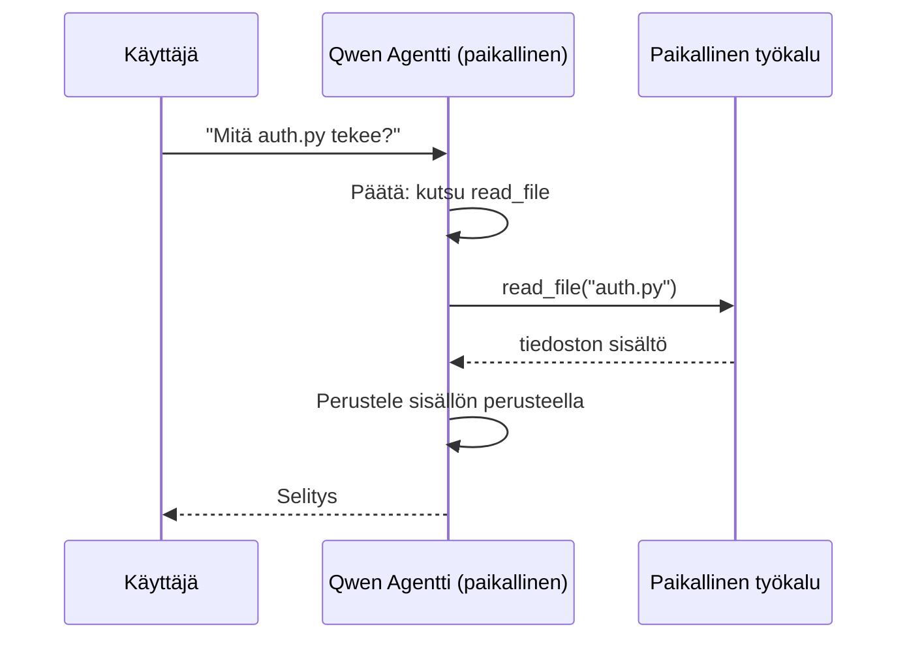
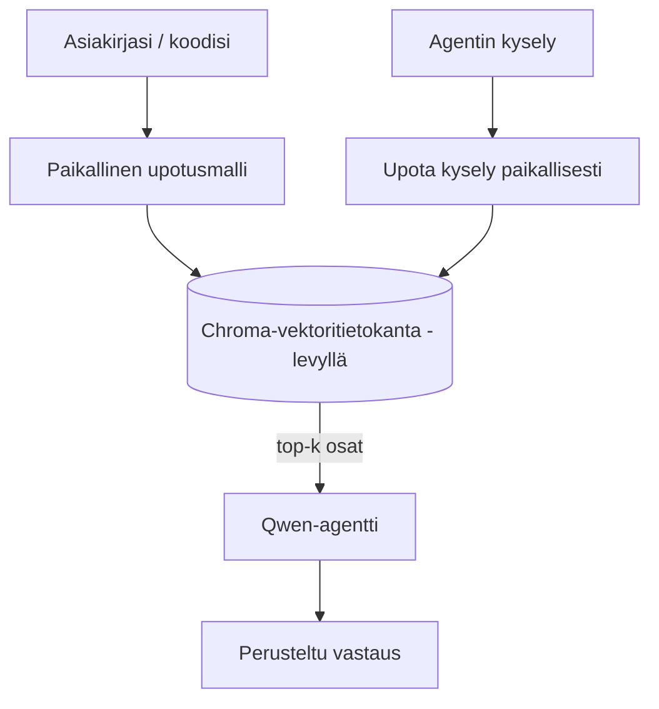
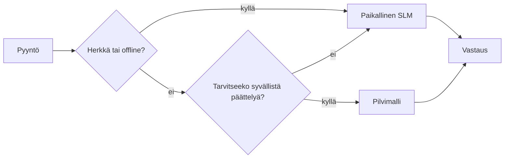

# Paikallisten tekoälyagenttien luominen Microsoft Foundry Localin ja Qwenin avulla


Edellinen oppitunti skaalasi agentteja *pilveen*. Tämä tuo ne *alas* yhdelle koneelle. Lopuksi sinulla on toimiva insinööriassistentti, joka päättelyttää, kutsuu työkaluja, lukee tiedostojasi ja etsii dokumentaatiotasi — **ilman yhtäkään pilvipohjaista inferenssikutsua.**

Miksi haluaisit sen? Kolme syytä, jotka nousevat jatkuvasti esiin todellisessa insinöörityössä:

- **Yksityisyys.** Koodi ja dokumentit eivät koskaan poistu koneelta. Ei pyyntöä, ei pätkää, ei asiakastietoja ylitä verkkorajapintaa.
- **Kustannukset.** Paikallinen inferenssi ei veloita per token -maksua. Voit iteroida koko päivän sähkön hinnalla.
- **Offline.** Lentokoneessa, turvallisessa tilassa tai katkolla agentti toimii yhä.

Kiinteä asia on, että vaihdat eturivin pilvimallin **pieneen kielimalliin (SLM)**, joka pyörii suoraan CPU:lla, GPU:lla tai NPU:lla. Tämä oppitunti keskittyy rakentamaan agentteja, jotka ovat *hyviä* tässä rajassa sen sijaan, että teeskentelet rajan puuttuvan.

## Johdanto

Tässä oppitunnissa käsitellään:

- **Pienet kielimallit (SLM)** — mitä ne ovat, missä ne loistavat ja missä eivät.
- **Microsoft Foundry Local** — runtime, joka lataa ja palvelee malleja laitteella **OpenAI-yhteensopivan API:n** kautta.
- **Qwen-funktiokutsumallit** — SLM-mallit, jotka tuottavat luotettavasti työkalukutsut, mikä tekee paikallisista *agenteista* (ei pelkästään paikallisista chateista) mahdollisia.
- **Paikalliset työkalut, paikallinen RAG ja paikallinen MCP** — jotka antavat agentille kyvyt ilman pilveä.
- **Hybridimallit** — milloin pitää pysyä paikallisessa ja milloin ottaa pilvi käyttöön.

## Oppimistavoitteet

Tämän oppitunnin jälkeen osaat:

- Selittää SLM:ien kompromissit ja valita sopivat paikallisen agentin käyttötapaukset.
- Palvella Qwen-mallia paikallisesti Foundry Localilla ja yhdistää se OpenAI-yhteensopivaan rajapintaan.
- Rakentaa työkalukutsuvan agentin, joka toimii kokonaan työasemallasi.
- Lisätä paikallisen RAG:n omiin dokumentteihisi paikallisen vektorikannan (Chroma) avulla.
- Yhdistää agentti paikalliseen MCP-palvelimeen ja pohtia hybridipaikallisen/pilvipohjaisen suunnittelun etuja.

## Edellytykset

Tämä oppitunti olettaa, että olet käynyt läpi aiemmat oppitunnit ja hallitset:

- [Työkalujen käyttö](../04-tool-use/README.md) (Oppitunti 4) ja [Agenttinen RAG](../05-agentic-rag/README.md) (Oppitunti 5).
- [Agenttiprotokollat / MCP](../11-agentic-protocols/README.md) (Oppitunti 11).
- [Microsoft Agent Framework](../14-microsoft-agent-framework/README.md) (Oppitunti 14).

Tarvitset myös:

- Kehittäjätyöaseman. **8 Gt RAM on realistinen minimivaatimus**; 16 Gt+ on mukava. GPU tai NPU auttaa, mutta ei ole pakollinen.
- **Microsoft Foundry Local** asennettuna (katso asennusohje alempaa).
- Python 3.12+ ja tässä repossa olevien pakettien [`requirements.txt`](../../../requirements.txt), sekä `foundry-local-sdk`, `openai` ja `chromadb` käytettäväksi tässä oppitunnissa.

## Pienet kielimallit: Oikea työkalu paikalliseen työhön

Eturivin pilvimalli sisältää satoja miljardeja parametreja ja toimii datakeskuksen takana. SLM:ssä on muutama miljardi parametria ja sen pitää mahtua kannettavan tietokoneen RAM-muistiin. Tämä ero asettaa selkeät odotukset.

**SLM:t ovat hyviä:**

- Rakenneperusteisissa, rajatuissa tehtävissä — luokittelu, tiedon poiminta, tiivistys tunnetusta dokumentista.
- **Työkalukutsuissa** — päättää, mikä funktio kutsutaan ja millä argumenteilla.
- Nopea, halpa ja yksityinen iterointi omilla tiedoillasi.

**SLM:t ovat heikompia:**

- Avoimeen, monivaiheiseen päättelyyn laajassa kontekstissa.
- Laajaan maailmantietämykseen (ovat nähneet vähemmän ja unohtavat enemmän).

Paikallisten agenttien voittava strategia on siis: **anna SLM:n orkestroida, ja anna työkalujen tehdä raskas työ.** Mallin ei tarvitse *tietää* koodikantaasi — sen tarvitsee tietää, milloin kutsua `read_file` ja `search_docs`. Tämä tukee suoraan SLM:n vahvuuksia.


## Microsoft Foundry Local

**Microsoft Foundry Local** on kevyt runtime, joka lataa, hallinnoi ja palvelee malleja kokonaan koneellasi. Sen tärkein ominaisuus meille on, että se tarjoaa **OpenAI-yhteensopivan HTTP-rajapinnan** — mikä tarkoittaa, että OpenAI SDK ja Microsoft Agent Frameworkin OpenAI-asiakas toimivat sen kanssa vain muuttamalla `base_url`-osoitetta. Kaikki agenttien rakentamisesta opitut asiat siirtyvät suoraan; vain päätepiste vaihtuu pilvestä `localhost`iin.

Foundry Local valitsee automaattisesti parhaan malliversion laitteistollesi — CPU-version, CUDA/GPU-version tai NPU-version — joten sinun ei tarvitse optimoida käsin eri koneille.

### Asennus

Asenna Foundry Local (katso [dokumentaatio](https://learn.microsoft.com/azure/ai-foundry/foundry-local/) käyttöjärjestelmällesi) ja varmista, että se toimii:

```bash
# Asenna (esimerkki; seuraa ohjeita alustallesi)
winget install Microsoft.FoundryLocal      # Windows
# brew install microsoft/foundrylocal/foundrylocal   # macOS

# Lataa ja suorita Qwen-malli, käynnistä sitten paikallinen palvelu
foundry model run qwen2.5-7b-instruct
foundry service status
```

Kun palvelu on käynnissä, sinulla on paikallinen OpenAI-yhteensopiva päätepiste (tyypillisesti `http://localhost:PORT/v1`). Notebook käyttää `foundry-local-sdk`:ta löytääkseen päätepisteen automaattisesti, joten sinun ei tarvitse kovakoodata porttia.

## Qwen-funktiokutsu: Miksi se on tärkeää

Agentti on agentti vain, jos se voi kutsua työkaluja. Monet SLM:t voivat chattailla mutta tuottavat epäluotettavia, virheellisiä työkalukutsuja. **Qwen**-mallit on koulutettu funktiokutsuihin ja ne tuottavat johdonmukaisesti hyvin muotoiltuja työkalukutsurakenteita — mikä tekee paikallisesta chat-mallista paikallisen *agentin*.

Prosessi on normaali työkalukutsusilmukka, jonka olet jo oppinut, vain että se pyörii laitteellasi:



## Paikallinen RAG

Dokumentaation haku on se, missä paikalliset agentit todella ansaitsevat paikkansa. Sen sijaan, että toivoisit SLM:n muistaneen kehyskirjastosi dokumentaation, upotat ne **paikalliseen vektorikantaan** ja annat agentin hakea tarpeelliset osat pyynnöstä.

Käytämme **Chroma**a, upotettua vektoritallenninta, joka pyörii prosessin sisällä ilman palvelinta. Putki on täysin paikallinen: paikallinen upotemalli → paikalliset vektorit → paikallinen haku → paikallinen SLM.



Tämä on sama Agenttinen RAG-kaava kuin Oppitunnissa 5 — ainoa ero on, että kaikki komponentit toimivat koneellasi.

## Paikalliset MCP-palvelimet

[MCP](../11-agentic-protocols/README.md) on tiedonsiirtoprotokolla, ei pilvipalvelu. MCP-palvelin voi toimia paikallisena prosessina `stdio`:n kautta ja tarjota työkaluja agentillesi standardiprotokollalla. Näin voit käyttää MCP-palvelinten kasvavaa ekosysteemiä — tiedostojärjestelmän käyttö, git-operaatiot, tietokantakyselyt — kokonaan offline-tilassa.

Turvallisuusnäkökulma on erilainen kuin pilvessä, mutta ei poissa: paikallinen MCP-palvelin toimii käyttäjäsi oikeuksilla, joten rajoita mitä se saa käyttää (esim. projektihakemisto, ei koko kotihakemisto) ja käsittele sen tuottamat tulokset syötteinä, jotka validoit ennen käyttöä.

## Hybridipilvi- ja paikallismallit

Paikallinen ei tarkoita pelkästään paikallista. Kypsät järjestelmät ohjaavat työn herkkävaikutteisuuden ja vaikeuden mukaan:

| Tilanne | Missä se toimii |
| --- | --- |
| Herkkä koodi/data tai offline | **Paikallinen SLM** |
| Yksinkertainen, rajattu tehtävä | **Paikallinen SLM** (halpa, nopea) |
| Vaativa monivaiheinen päättely ei-herkissä tiedoissa | **Pilvimalli** |
| Kaikki offline-tilassa | **Paikallinen SLM** (pehmeä vikaantuminen) |

Tämä heijastaa **mallin reitityksen** ideaa Oppitunnista 16 — paitsi että yksi "malleista" on nyt oma koneesi. Vankka suunnittelu siirtyy paikalliseen, kun pilvi ei ole käytettävissä, joten agentin laatu heikkenee hallitusti eikä se epäonnistu täysin.



## Käytännön harjoitus: Paikallinen insinööriassistentti

Avaa [`code_samples/17-local-agent-foundry-local.ipynb`](./code_samples/17-local-agent-foundry-local.ipynb) ja työstä se läpi. Rakennat **paikallisen insinööriassistentin**, joka pyörii kokonaan työasemallasi ja voi:

1. **Kutsua työkaluja** — Qwen-funktionkutsulla Foundry Localin kautta.
2. **Suorittaa paikallisia tiedostotoimia** — listata ja lukea tiedostoja projektihakemistosta.
3. **Analysoida koodia** — raportoida perusmittareita lähdetiedostosta.
4. **Etsiä dokumentaatiota** — paikallinen RAG dokumenttihakemistolle Chromalla.
5. **Käyttää MCP:tä** — yhdistää paikalliseen MCP-palvelimeen (hyväksyvä ohitus, jos palvelinta ei ole määritetty).

Pilvipohjaisia inferenssejä ei käytetä missään vaiheessa.

### Läpi käynti

Assistentti yhdistää Foundry Localiin OpenAI-yhteensopivan rajapinnan kautta, joten agenttikoodi on lähes identtinen pilvioppien kanssa — ainoastaan asiakas vaihtuu:

```python
from foundry_local import FoundryLocalManager
from openai import OpenAI

# Foundry Local löytää/lataa mallin ja antaa meille paikallisen päätepisteen.
manager = FoundryLocalManager(\"qwen2.5-7b-instruct\")
client = OpenAI(base_url=manager.endpoint, api_key=manager.api_key)  # api_key on paikallinen paikkamerkki
```

Työkalut ovat tavallisia Python-funktioita, jotka on rajattu projektihakemistoon:

```python
def read_file(path: str) -> str:
    \"\"\"Read a file, but only inside the sandboxed project directory.\"\"\"
    full = (PROJECT_ROOT / path).resolve()
    if PROJECT_ROOT not in full.parents and full != PROJECT_ROOT:
        return \"Access denied: path is outside the project directory.\"
    return full.read_text(encoding=\"utf-8\")
```

Huomaa hiekkalaatikkotarkistus — vaikka paikallisesti, työkalu, joka lukee mielivaltaisia polkuja, on riski. Notebook pitää jokaisen työkalun rajattuna yhteen projektin juureen.

## Tietämystesti

Testaa ymmärrystäsi ennen tehtävään siirtymistä.

**1. Anna kaksi konkreettista syytä ajaa agenttia paikallisesti pilven sijaan.**

<details>
<summary>Vastaus</summary>

Kaksi seuraavista: **yksityisyys** (koodi ja data eivät poistu koneelta), **kustannukset** (ei per token -maksua inferenssistä) ja **offline-kyky** (toimii ilman verkkoa — lentokoneessa, turvallisessa tilassa tai katkolla). Säädös- ja vaatimustenmukaisuusrajoitukset, jotka estävät datan siirron laitteesta pois, ovat yleinen yksityisyysperuste.
</details>

**2. Mikä on suositeltu työnjako SLM:n ja sen työkalujen välillä paikallisessa agentissa, ja miksi?**

<details>
<summary>Vastaus</summary>

Anna SLM:n **orkestroida** (päättää, mitä työkalua kutsutaan ja millä argumenteilla) ja anna **työkalujen tehdä raskas työ** (lukeminen, dokumenttien haku, tulosten laskenta). SLM:t ovat vahvoja rajatuissa päätöksissä, kuten työkalun valinnassa, mutta heikompia laajassa tietämyksessä ja pitkissä monivaiheisissa päättelyissä, joten työkaluihin tukeutuminen tukee niiden vahvuuksia.
</details>

**3. Mikä tekee mahdolliseksi pilviagenttikoodin uudelleenkäytön Foundry Localin kanssa?**

<details>
<summary>Vastaus</summary>

Foundry Local tarjoaa **OpenAI-yhteensopivan HTTP-rajapinnan**. OpenAI SDK ja Agent Frameworkin OpenAI-asiakas toimivat sen kanssa muuttamalla vain `base_url` (ja käyttämällä paikallista esimerkkikäyttöavainta). Kaikki muu agenttikoodissa pysyy samana.
</details>

**4. Miksi valitsemme erityisesti Qwen-funktiokutsumallin eikä mitä tahansa SLM:ää?**

<details>
<summary>Vastaus</summary>

Koska agentin on tuotettava luotettavia, hyvin muotoiltuja **työkalukutsuja**. Monet SLM:t voivat keskustella mutta tuottavat virheellisiä tai epäyhtenäisiä työkalukutsurakenteita. Qwen-mallit on koulutettu funktiokutsuihin ja ne tuottavat johdonmukaiset työkalukutsut, mikä muuttaa paikallisen chat-mallin toimivaksi paikallisagentiksi.
</details>

**5. Mitä komponentteja paikallisessa RAG-putkessa ajetaan koneella?**

<details>
<summary>Vastaus</summary>

Kaikki: upotemalli, vektorikanta (Chroma, levyllä), haku ja SLM. Dokumentit upotetaan paikallisesti, tallennetaan paikallisesti, haetaan paikallisesti, ja paikallinen malli perustelee niillä — yksikään osa ei kosketa pilveä.
</details>

**6. Paikallinen MCP-palvelin toimii koneellasi. Teekö se siitä automaattisesti turvallisen? Mitä varotoimia sinun silti tulisi noudattaa?**

<details>
<summary>Vastaus</summary>

Ei. Paikallinen MCP-palvelin toimii käyttäjäsi oikeuksilla, joten se voi käyttää mitä sinäkin. Rajoita se vain tarpeelliseen (esim. yhteen projektihakemistoon eikä koko kotihakemistoon) ja käsittele sen tuottamat tulokset syötteinä, jotka validoit ennen jatkotoimia.
</details>

**7. Kuvaile järkevä hybridireitityssääntö, joka sisältää paikallisen mallin.**

<details>
<summary>Vastaus</summary>

Reititä herkkä tai offline-pyyntö paikalliselle SLM:lle; yksinkertaiset, rajatut tehtävät paikalliselle SLM:lle nopeuden ja kustannusten vuoksi; vaikea monivaiheinen päättely ei-herkälle datalle pilvimallille; ja palaa paikalliseen SLM:ään, jos pilvi ei ole käytettävissä, jotta agentti heikkenee hallitusti eikä epäonnistu kokonaan. Tämä on mallin reititystä (Oppitunti 16) siten, että paikallinen kone on yksi malleista.
</details>

**8. Mikä on realistinen minimimäärä RAMia paikallisen agentin ajamiseen tässä oppitunnissa, ja mitä enemmän RAMia tuo?**

<details>
<summary>Vastaus</summary>

Noin **8 Gt** on realistinen minimivaatimus; 16 Gt+ on mukava. Lisämuisti sallii isompien, kykenevämpien mallien ajamisen ja enemmän kontekstin ylläpidon muistissa. GPU tai NPU nopeuttaa inferenssiä mutta ei ole pakollinen — Foundry Local valitsee CPU-buildin, jos kiihtyvää ei ole.
</details>

## Tehtävä

Laajenna paikallinen insinööriassistentti **paikalliseksi dokumentaation tarkistajaksi** valitsemallesi pienelle projektille (voit käyttää tämän repoon oppituntikansioita halutessasi).

Palautuksesi tulisi:

1. **Indeksoi todellinen dokumentti-/koodihakemisto** Chroma-kantaan (vähintään viisi tiedostoa).
2. **Lisää `find_todos`-työkalu**, joka skannaa projektista `TODO`-/`FIXME`-kommentit ja palauttaa ne tiedoston ja rivinumeron kanssa — pitäen samat hiekkalaatikkotarkistukset kuin `read_file`.

3. **Kysy agentilta kolme kysymystä**, jotka pakottavat sen yhdistämään työkaluja: yksi puhdas RAG-kysymys, yksi, joka vaatii tietyn tiedoston lukemista, ja yksi, joka vaatii TODO-kohtien löytämistä.
4. **Mittaa se**: aikaile jokainen kolmesta vastauksesta ja kirjaa ne markdown-soluun. Kommentoi, onko viive hyväksyttävä suunnittelemaasi työnkulkuun.

Kirjoita sitten lyhyt kappale siitä, **mitä siirtäisit pilveen ja mitä pitäisit paikallisesti** tälle tarkastajalle, ja miksi. Sinua arvioidaan sen perusteella, onko paikalliset komponentit kytketty oikein yhteen ja onko hybridipäättelysi perusteltua — ei mallin laadun mukaan.

## Yhteenveto

Tässä oppitunnissa loit agentin, joka toimii kokonaan omalla koneellasi:

- **SLMit** vaihtavat laajuuden yksityisyyteen, kustannuksiin ja offline-toimintaan — ja loistavat, kun ne **orchestraavat työkaluja** sen sijaan, että kantaisivat kaiken tiedon itse.
- **Foundry Local** palvelee malleja laitteella ilman verkkoa **OpenAI-yhteensopivan päätelipun takana**, joten pilviagenttikoodisi siirtyy yhdellä rivin muutoksella.
- **Qwen-funktiokutsumallit** mahdollistavat luotettavan paikallisen työkalukutsun — ja siten paikalliset *agentit*.
- **Paikallinen RAG** (Chroma) ja **paikallinen MCP** antavat agentille kyvyn ilman koneelta poistumista.
- **Hybridimallit** antavat reitittää herkkyyden ja vaikeuden mukaan, käyttäen paikallista sulavasti vararatkaisuna.

Tämä täydentää käyttöönoton kaaren: Oppitunti 16 laajensi agenteja Microsoft Foundryyn, ja tämä oppitunti pienensi ne yhdelle työasemalle. Seuraavassa oppitunnissa siirrytään käytössä olevien agenttien turvallisuuteen.

## Lisämateriaalit

- <a href="https://learn.microsoft.com/azure/ai-foundry/foundry-local/" target="_blank">Microsoft Foundry Local -dokumentaatio</a>
- <a href="https://learn.microsoft.com/azure/ai-foundry/what-is-azure-ai-foundry" target="_blank">Microsoft Foundry -dokumentaatio</a>
- <a href="https://learn.microsoft.com/en-us/agent-framework/overview/?wt.mc_id=youtube_26688_organicsocial_reactor&pivots=programming-language-python" target="_blank">Microsoft Agent Framework</a>
- <a href="https://qwen.readthedocs.io/en/latest/framework/function_call.html" target="_blank">Qwen-funktiokutsudokumentaatio</a>
- <a href="https://modelcontextprotocol.io/" target="_blank">Model Context Protocol (MCP)</a>
- <a href="https://docs.trychroma.com/" target="_blank">Chroma-vektoritietokanta</a>

## Edellinen oppitunti

[Skaalautuvien agenttien käyttöönotto](../16-deploying-scalable-agents/README.md)

## Seuraava oppitunti

[AI-agenttien suojaaminen](../18-securing-ai-agents/README.md)

---

<!-- CO-OP TRANSLATOR DISCLAIMER START -->
**Vastuuvapauslauseke**:
Tämä asiakirja on käännetty käyttämällä tekoälypohjaista käännöspalvelua [Co-op Translator](https://github.com/Azure/co-op-translator). Vaikka pyrimme tarkkuuteen, otathan huomioon, että automaattiset käännökset saattavat sisältää virheitä tai epätarkkuuksia. Alkuperäinen asiakirja sen alkuperäiskielellä on virallinen lähde. Tärkeissä asioissa suositellaan ammattimaista ihmiskäännöstä. Emme ole vastuussa tämän käännöksen käytöstä aiheutuvista väärinymmärryksistä tai tulkinnoista.
<!-- CO-OP TRANSLATOR DISCLAIMER END -->