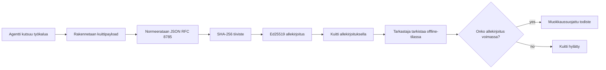
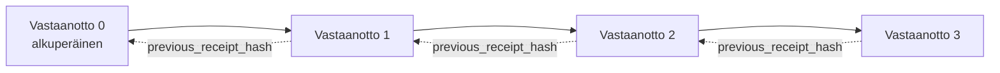

[Katso oppituntivideo: AI-agenttien suojaaminen kryptografisilla kuiteilla](https://youtu.be/PLACEHOLDER_VIDEO_ID)

> _(Oppituntivideo ja pikkukuva lisätään Microsoftin sisältötiimin toimesta yhdistämisen jälkeen, vastaamaan oppituntien 14 / 15 kaavaa.)_

# AI-agenttien suojaaminen kryptografisilla kuiteilla

## Johdanto

Tässä oppitunnissa käsitellään:

- Miksi AI-agenttien auditointijäljet ovat tärkeitä vaatimustenmukaisuuden, virheenkorjauksen ja luottamuksen kannalta.
- Mikä on kryptografinen kuitti ja miten se eroaa allekirjoittamattomasta lokirivistä.
- Kuinka tuottaa allekirjoitettu kuitti agentin työkalukutsulle pelkällä Pythonilla.
- Kuinka varmistaa kuitti offline-tilassa ja havaita manipulointi.
- Kuinka ketjuttaa kuitteja siten, että yhden poistaminen tai uudelleenjärjestäminen katkaisee ketjun.
- Mitä kuitit todistavat ja mitä ne nimenomaisesti eivät todista.

## Oppimistavoitteet

Oppitunnin suorittamisen jälkeen osaat:

- Tunnistaa virhetilanteet, jotka motivoivat kryptografisen alkuperän todentamista agentin toiminnoille.
- Tuottaa Ed25519-allekirjoitetun kuitin kanonisen JSON-payloadin yli.
- Varmistaa kuitin itsenäisesti käyttäen vain allekirjoittajan julkista avainta.
- Havaita manipulointi suorittamalla uudelleen varmennus muokattuun kuittiin.
- Rakentaa hash-ketjutetun kuitujonon ja selittää miksi ketju on tärkeä.
- Tunnistaa rajapinta sen välillä, mitä kuitit todistavat (attribuutio, eheys, järjestys) ja mitä ne eivät todista (toiminnon oikeellisuus, politiikan pätevyys).

## Ongelma: Agenttisi auditointijälki

Kuvittele, että olet käyttöönotanut AI-agentin Contoso Travelille. Agentti lukee asiakkaan pyyntöjä, kutsuu lentojen APIa vaihtoehtojen hakemiseksi ja varaa paikkoja asiakkaan puolesta. Viimeisellä neljänneksellä agentti käsitteli 50 000 varausta.

Nyt paikalle saapuu tarkastaja. Hän kysyy yksinkertaisen kysymyksen: "Näytä minulle, mitä agenttisi teki."

Luovutat lokitiedostosi. Tarkastaja katsoo niitä ja kysyy vaikeamman kysymyksen: "Miten tiedän, ettei näitä lokeja ole muokattu?"

Tämä on auditointijälki-ongelma. Useimmat agenttien käyttöönotot nykyään luottavat:

- **Sovelluslokit**: joita agentti itse kirjoittaa, muokattavissa kenellä tahansa, jolla on tiedostojärjestelmän oikeudet.
- **Pilvilokinointipalvelut**: väärinkäytökset näkyviä alustatasolla, mutta vain jos tarkastaja luottaa alustan ylläpitäjään.
- **Tietokantatapahtumalokit**: soveltuvat hyvin tietokantamuutoksiin, mutta eivät mielivaltaisiin työkalukutsuihin.

Kukaan näistä ei voi vastata tarkastajan kysymykseen ilman, että tarkastaja luottaa johonkin (sinuun, pilvipalveluntarjoajaasi, tietokantatoimittajaasi). Sisäisessä käytössä tämä luottamus usein kelpaa. Säädellyissä työkuormissa (rahoitus, terveydenhuolto, EU:n tekoälydirektiivin alaiset) ei.

Kryptografiset kuitit ratkaisevat tämän tekemällä jokaisen agentin toiminnon itsenäisesti varmennettavaksi. Tarkastajan ei tarvitse luottaa sinuun. Hän tarvitsee vain julkisen avaimesi ja kuitin itsessään.

## Mikä on kryptografinen kuitti?

Kuitti on JSON-objekti, joka tallentaa, mitä agentti teki, ja on allekirjoitettu digitaalisella allekirjoituksella.



Minimaalinen kuitti näyttää tältä:

```json
{
  "type": "agent.tool_call.v1",
  "agent_id": "contoso-travel-bot",
  "tool_name": "lookup_flights",
  "tool_args_hash": "sha256:a3f9c1...",
  "result_hash": "sha256:7b2e1d...",
  "policy_id": "contoso-travel-policy-v3",
  "timestamp": "2026-04-25T14:30:00Z",
  "sequence": 47,
  "previous_receipt_hash": "sha256:9d4e6a...",
  "signature": {
    "alg": "EdDSA",
    "sig": "c5af83...",
    "public_key": "8f3b2c..."
  }
}
```

Kolme ominaisuutta tekee työn:

1. **Allekirjoitus**. Kuitti on allekirjoitettu agentin portin toimesta Ed25519-yksityisavaimella. Kuka tahansa, jolla on vastaava julkinen avain, voi tarkistaa allekirjoituksen offline-tilassa. Kentän muuttaminen mitätöi allekirjoituksen.

2. **Kanoninen koodaus**. Ennen allekirjoittamista kuitti sarjallistetaan JSON Kanonisointisääntöjen (JCS, RFC 8785) mukaisesti. Tämä varmistaa, että kaksi eri toteutusta, jotka tuottavat saman loogisen kuitin, tuottavat tavu-identtisen ulostulon. Ilman kanonisointia erilaiset JSON-sarjallistimet tuottaisivat eri allekirjoituksia samalle sisällölle.

3. **Hash-ketjuuntaminen**. `previous_receipt_hash`-kenttä linkittää jokaisen kuitin sitä edeltävään. Yhden kuitin poistaminen tai uudelleenjärjestäminen rikkoo kaikki sitä seuraavat kuitit. Manipulointi tulee näkyväksi ketjutasolla, vaikka yksittäiset allekirjoitukset pettäisivät.

Nämä ominaisuudet yhdessä tarjoavat kolme takuuta:

- **Attribuutio**: tämä avain allekirjoitti tämän sisällön.
- **Eheys**: sisältöä ei ole muutettu allekirjoittamisen jälkeen.
- **Järjestys**: tämä kuitti tuli ketjussa sen kuitin jälkeen.

## Kuittien tuottaminen Pythonilla

Et tarvitse erillistä kirjastoa kuitin tuottamiseen. Kryptografiset perusrakenteet ovat laajalti saatavilla ja logiikka on muutama kymmenen riviä Pythonia.

Käytännön harjoitukset tiedostossa `code_samples/18-signed-receipts.ipynb` käyvät koko prosessin läpi. Yhteenvetona:

```python
import json
import hashlib
import base64
from nacl import signing
from jcs import canonicalize  # RFC 8785 kanoninen JSON

def b64url_nopad(data: bytes) -> str:
    return base64.urlsafe_b64encode(data).decode("ascii").rstrip("=")

def sha256_canonical(obj) -> str:
    """SHA-256 of a Python object's JCS-canonical JSON form."""
    return f"sha256:{hashlib.sha256(canonicalize(obj)).hexdigest()}"

# Luo tai lataa allekirjoitusavain (tuotannossa tallenna avainholviin)
signing_key = signing.SigningKey.generate()
verify_key = signing_key.verify_key

# Rakenna kuittauksen sisältö (ei vielä allekirjoitusta)
tool_args = {"origin": "SYD", "destination": "LAX"}
tool_result = [{"flight": "QF11", "price": 1850, "stops": 0}]

payload = {
    "type": "agent.tool_call.v1",
    "agent_id": "contoso-travel-bot",
    "tool_name": "lookup_flights",
    "tool_args_hash": sha256_canonical(tool_args),
    "result_hash": sha256_canonical(tool_result),
    "policy_id": "contoso-travel-policy-v3",
    "timestamp": "2026-04-25T14:30:00Z",
    "sequence": 0,
    "previous_receipt_hash": None,
}

# Kanonisoi, hajauta, allekirjoita.
canonical_bytes = canonicalize(payload)
message_hash = hashlib.sha256(canonical_bytes).digest()
signature_bytes = signing_key.sign(message_hash).signature

# Liitä rakenteellinen allekirjoitusobjekti.
receipt = {
    **payload,
    "signature": {
        "alg": "EdDSA",
        "sig": b64url_nopad(signature_bytes),
        "public_key": b64url_nopad(bytes(verify_key)),
    },
}
```

Tämä on koko allekirjoitusputki. Tehtävät muistikirjassa käyvät jokaisen vaiheen yksityiskohtaisesti.

## Kuitin varmistus ja manipuloinnin havaitseminen

Varmistus on käänteinen operaatio:

```python
import base64
import hashlib
from nacl import signing
from nacl.exceptions import BadSignatureError
from jcs import canonicalize

def b64url_decode(s: str) -> bytes:
    padding = "=" * ((4 - len(s) % 4) % 4)
    return base64.urlsafe_b64decode(s + padding)

def verify_receipt(receipt: dict) -> bool:
    # Allekirjoitus on jäsennelty objekti: {"alg", "sig", "public_key"}.
    sig_obj = receipt.get("signature")
    if not sig_obj or sig_obj.get("alg") != "EdDSA":
        return False

    # Rakenna uudelleen kuorma, joka todellisuudessa allekirjoitettiin (kaikki paitsi allekirjoitus).
    payload = {k: v for k, v in receipt.items() if k != "signature"}

    canonical_bytes = canonicalize(payload)
    message_hash = hashlib.sha256(canonical_bytes).digest()

    try:
        verify_key = signing.VerifyKey(b64url_decode(sig_obj["public_key"]))
        verify_key.verify(message_hash, b64url_decode(sig_obj["sig"]))
        return True
    except BadSignatureError:
        return False
```

Tämä funktio ottaa kuitin ja palauttaa `True`, jos allekirjoitus on validi, muuten `False`. Ei verkkokutsuja, ei palveluriippuvuuksia, ei luottamusta kolmanteen osapuoleen.

Manipuloinnin havaitsemisen näet tekemällä:

1. Tuota kelvollinen kuitti ja varmistu, että se tarkistuu.
2. Muuta yksi tavu `tool_args_hash`-kentässä.
3. Aja varmistus uudelleen ja huomaa, että se epäonnistuu.

Tämä on käytännön osoitus siitä, että kuitit ovat väärinkäytöksiä estäviä: mikä tahansa muutos, miten pieni tahansa, rikkoo allekirjoituksen.

## Kuittien ketjuttaminen monivaiheisissa agenteissa

Yksi allekirjoitettu kuitti suojaa yhtä toimintoa. Kuituketju suojaa toimintojen sarjaa.



Jokainen kuitti tallentaa edellisen kuitin hashin. Jos hyökkääjä haluaa poistaa kuitin 2 huomaamattomasti, hänen täytyisi joko:

- Muuttaa kuitin 3 `previous_receipt_hash`-kenttää (rikkoutuu kuitin 3 allekirjoitus), TAI
- Väärennettävä uusi allekirjoitus muokatulle kuittille 3 (tarvitaan agentin yksityisavain).

Jos yksityisavain on laitteistoturvakaapissa ja julkaiset julkisen avaimen jokaisen kuitin yhteydessä, kumpikaan hyökkäys ei ole toteutettavissa huomaamatta.

Muistikirjassa käydään läpi:

1. Kolmen kuitin ketjun rakentaminen.
2. Jokaisen kuitin `previous_receipt_hash`-kentän vastaavuuden varmistaminen edeltävän kuitin todelliseen hash-arvoon.
3. Yhden kuitin manipulointi keskellä ja ketjun katkeaminen juuri siinä kohtaa.

Tällä tavalla tuot auditointijäljen, jonka ulkopuolinen tarkastaja voi varmentaa ilman luottamusta sinuun.

## Mitä kuitit todistavat (ja mitä eivät todista)

Tämä on tämän oppitunnin tärkein osio. Kuitit ovat voimakkaita, mutta niiden voima on rajattu.

**Kuitit todistavat kolme asiaa:**

1. **Attribuutio**: tietty avain allekirjoitti tietyn tiedon.
2. **Eheys**: tieto ei ole muuttunut allekirjoituksen jälkeen.
3. **Järjestys**: tämä kuitti tuli ketjussa sen kuitin jälkeen.

**Kuitit EIVÄT todista:**

1. **Oikeellisuus**: että agentin toiminto oli oikea. Kuitti voi olla allekirjoitettu yhtä puhtaasti väärälle vastaukselle kuin oikeallekin.
2. **Politiikan noudattaminen**: että `policy_id`-kentässä mainittu politiikka todella arvioitiin tai että se olisi sallinut toiminnon. Kuitti tallentaa väitteen, ei toimeenpanoa.
3. **Identiteettiä avaimen ulkopuolella**: kuitti sanoo "tämä avain allekirjoitti tämän sisällön." Se ei sano "tämä ihminen valtuutti tämän." Yhdenmukaistaminen avaimesta henkilöön tai organisaatioon vaatii erillisen identiteettijärjestelmän (hakemisto, julkisten avainten rekisteri jne.).
4. **Syötteiden totuudenmukaisuutta**: jos agentti saa manipulointipromotin ja toimii sen mukaan, kuitti tallentaa toiminnon uskollisesti. Kuitit ovat syötteen validoinnin jälkeisiä, eivät korvaavia.

Tämä raja on tärkeä kahdesta syystä:

- Se kertoo, mihin kuitit sopivat: agentin toiminnan auditointiin ja väärinkäytösten estoon, myös organisaatiorajojen yli.
- Se kertoo, mitä muita kerroksia tarvitaan: syötteen validointi (Oppitunti 6), politiikan toimeenpano (lyhyesti käsitelty alla) ja identiteettijärjestelmät (ei tämän oppitunnin aihe).

Yleinen virhe on olettaa, että "meillä on kuitit" tarkoittaa "meitä valvotaan." Ei tarkoita. Kuitit ovat perusta. Hallinto on järjestelmä, jonka rakennat niiden päälle.

## Tuotantoviitteet

Tämän oppitunnin Python-koodi on tarkoituksella minimaalista, jotta voit lukea jokaisen rivin ja ymmärtää tarkasti, mitä tapahtuu. Tuotantokäytössä sinulla on kaksi vaihtoehtoa:

1. **Rakenna suoraan kryptografisten primitiivien päälle**. Yllä näkemäsi noin 50 riviä riittävät moniin käyttötapauksiin. PyNaCl (Ed25519) ja `jcs`-paketti (kanoninen JSON) ovat hyvin ylläpidettyjä ja auditoituja kirjastoja.

2. **Käytä tuotantolaatuista kuittikirjastoa.** Useat avoimen lähdekoodin projektit toteuttavat samaa kaavaa lisäominaisuuksilla (avaimien kierto, erävarmennus, JWK Set -jakelu, integraatio politiikka-moottoreihin):
   - Tässä oppitunnissa käytetty kuittiformaatti noudattaa IETF:n Internet-Draftia (`draft-farley-acta-signed-receipts`), joka on standardointiprosessissa.
   - Microsoft Agent Governance Toolkit yhdistää kuitit Cedar-pohjaisiin politiikkapäätöksiin; katso esimerkkiä opetusohjelmasta 33 kyseisessä repositoriossa.
   - `protect-mcp` (npm) ja `@veritasacta/verify` (npm) tarjoavat Node-pohjaiset toteutukset kuittien allekirjoitukseen ja offline-varmennukseen, tarkoitettuja minkä tahansa MCP-palvelimen ympärille tamper-evident audit trailin rakentamiseen.

Päätös oman toteutuksen ja kirjaston käytön välillä vastaa päätöstä kirjoittaa oma JWT-kirjasto tai käyttää testattua: molemmat ovat järkeviä; kirjasto säästää aikaa ja vähentää auditointialuetta; oma toteutus pakottaa ymmärtämään jokaisen primitiivin. Tämä oppitunti opettaa oman toteutuksen mallin, jotta sinulla on perusta kumpaankin.

## Tietotarkistus

Testaa ymmärryksesi ennen siirtymistä harjoitustehtävään.

**1. Kuitti allekirjoitetaan agentin yksityisellä Ed25519-avaimella. Tarkastajalla on vain julkinen avain. Voiko tarkastaja varmistaa kuitin offline?**

<details>
<summary>Vastaus</summary>

Kyllä. Ed25519-varmennus tarvitsee vain julkisen avaimen ja allekirjoitetut tavut. Ei verkkokutsuja, ei palveluriippuvuuksia. Tämä tekee kuiteista hyödyllisiä eriytetyissä, moniorganisaatioisissa tai vähäluottoisissa auditointitilanteissa.
</details>

**2. Hyökkääjä muuttaa kuitin `policy_id`-kenttää väittäen, että sitä säätelee sallivampi politiikka. Allekirjoitus oli alkuperäisen payloadin yli. Mitä tapahtuu varmennuksen aikana?**

<details>
<summary>Vastaus</summary>

Varmistus epäonnistuu. Allekirjoitus laskettiin alkuperäisen payloadin kanonisista tavuista; kentän muuttaminen muuttaa tavujoukkoa, muuttaa SHA-256-hashin ja tekee allekirjoituksen kelvottomaksi. Hyökkääjä tarvitsee yksityisavaimen tuottaakseen uuden kelvollisen allekirjoituksen, jota hänellä ei ole.
</details>

**3. Miksi kuitti sisältää `tool_args_hash`- ja `result_hash`-kentät sen sijaan, että se sisältäisi raakadatan työkalun argumenteista ja tuloksista?**

<details>
<summary>Vastaus</summary>

Kahta syytä. Ensinnäkin kuitti saatetaan arkistoida tai siirtää ympäristöissä, joissa raakadatan (henkilötiedot, liiketoimintadata) vuotaminen on ongelma. Hashaus pitää kuitin pienenä ja sisällön yksityisenä; tarkastaja varmistaa, että hash vastaa erikseen tallennettua sisältöä. Toiseksi hashien koko on vakio; kuitti hashien kanssa on koon suhteen rajattu riippumatta syötteiden ja tulosten koosta.
</details>

**4. `previous_receipt_hash` linkittää jokaisen kuitin edeltäjäänsä. Jos hyökkääjä poistaa hiljaisesti yhden kuitin ketjusta keskeltä, mikä menee mitättömäksi?**

<details>
<summary>Vastaus</summary>

Kaikki sitä seuraavat kuitit. Niiden `previous_receipt_hash`-kentät eivät enää vastaa todellista ketjua (koska viitattu kuitti puuttuu tai ketju osoittaa eri edeltäjään). Poiston salaamiseksi hyökkääjän täytyisi allekirjoittaa uudelleen jokainen myöhempi kuitti, mikä vaatii yksityisavaimen.
</details>

**5. Kuitti varmistetaan onnistuneesti. Todistaako se, että agentin toiminta oli oikea, pätevä tai politiikan mukainen?**

<details>
<summary>Vastaus</summary>

Ei. Kelvollinen kuitti todistaa kolme asiaa: attribuution (tämä avain allekirjoitti tämän sisällön), eheyden (sisältö ei muuttunut) ja järjestyksen (kuitti tuli sen kuitin jälkeen). Se EI todista, että toiminto oli oikea, että `policy_id`-kentän politiikka arvioitiin tai että agentti noudatti kaikkia sääntöjä. Kuitit tekevät agentin toiminnasta auditoitavaa, eivät välttämättä oikeaa. Tämä on oppitunnin tärkein rajapinta.
</details>

## Harjoitustehtävä

Avaa tiedosto `code_samples/18-signed-receipts.ipynb` ja suorita kaikki neljä osiota:

1. **Osio 1**: Allekirjoita ensimmäinen kuittisi ja varmista se.
2. **Osio 2**: Manipuloi kuittia ja seuraa varmennuksen epäonnistumista.
3. **Osio 3**: Rakenna kolmen kuitin ketju ja varmista ketjun eheys.
4. **Osio 4**: Käytä mallia Microsoft Agent Frameworkilla rakennetulle agentille: kääri työkalukutsu kuittien allekirjoituksella, sitten varmista kuitti itsenäisesti.

**Lisähaaste 1:** laajenna kuitin skeemaa yhdellä omavalintaisella kentällä (esimerkiksi pyyntö-ID jäljitystä varten), päivitä kanoninen allekirjoituslogiikka ottamaan se mukaan ja varmistu, että kuitti kulkee varmennusprosessin läpi onnistuneesti. Muokkaa sitten kenttää allekirjoittamisen jälkeen ja varmista, että varmennus epäonnistuu. Tämä pakottaa ymmärtämään, miten jokainen tavu kanonisessa koodauksessa vaikuttaa allekirjoitukseen.
**Haastava lisätehtävä 2:** SHA-256-tiivistä kaksi kuittiasi yhteen (yhdistä niiden kanoniset tavut määrätyssä järjestyksessä) ja upota syntynyt tiiviste kolmannen kuitin uudeksi kentäksi ennen sen allekirjoittamista. Varmista, että kaikki kolme kuittia voivat edelleen kulkea edestakaisin. Olet juuri rakentanut yksivaiheisen sisällyttämistodisteen: kuka tahansa, joka pitää hallussaan kolmatta kuittia, voi todistaa, että kaksi ensimmäistä kuittia olivat olemassa sen allekirjoitushetkellä paljastamatta niiden sisältöä. Tämä on malli, jota valikoiva-paljastuskuittaukset käyttävät laajassa mittakaavassa (Merkle-sitoumukset, RFC 6962).

## Yhteenveto

Kryptografiset kuitit antavat tekoälyagentteille tarkastusjäljen, joka on:

- **Itsenäisesti varmennettavissa**: kuka tahansa julkisen avaimen omaava voi varmistaa, ilman palvelupelejä.
- **Muokkaustahaton**: mikä tahansa muutos mitätöi allekirjoituksen.
- **Siirrettävissä**: kuitti on pieni JSON-tiedosto; sen voi arkistoida, lähettää ja varmentaa missä tahansa.
- **Standardien mukainen**: rakennettu Ed25519:n (RFC 8032), JCS:n (RFC 8785) ja SHA-256:n varaan, jotka ovat laajalti käytettyjä primitiivejä.

Ne eivät korvaa syötteen validointia, politiikan toimeenpanoa tai identiteettijärjestelmää. Ne ovat niiden kerrosten perusta. Kun otat agentteja käyttöön säännellyissä työkuormissa, moniorganisaatiotyönkuluissa tai missä tahansa tilanteessa, jossa tuleva tarkastaja ei oletuksena luota sinuun, kuitit ovat tapa tehdä tarkastusjäljestä rehellinen.

Tärkein opetus: kuitit todistavat kuka sanoi mitä ja milloin. Ne eivät todista, että sanottu oli totta tai oikeaa. Säilytä tämä ero tarkasti. Se on ero rehellisen alkuperäjärjestelmän ja harhaanjohtavan välillä.

## Tuotannon tarkistuslista

Kun olet valmis siirtymään tästä oppitunnista ja käyttämään kuittien allekirjoittamia agenteja todellisessa ympäristössä:

- [ ] **Siirrä allekirjoitusavain pois kehittäjän kannettavalta.** Käytä Azure Key Vaultia, AWS KMS:ää tai laitteistoturvamoduulia. Henkilökohtaisen avaimen joka allekirjoittaa kuitit ei koskaan saa olla lähdekoodin hallinnassa tai selväkielisenä sovelluskoneilla.
- [ ] **Julkaise varmennusavain.** Tarkastajien tulee voida varmistaa offline-tilassa. Vakiokäytäntönä on JWK Set tunnetussa URL-osoitteessa (RFC 7517), esim. `https://your-org.example.com/.well-known/agent-keys.json`.
- [ ] **Ankkuroi ketju ulkoisesti.** Kirjoita säännöllisesti ketjun viimeisin päätiiviste läpinäkyvyyslokiin (Sigstore Rekor, RFC 3161 aikaleima-aukio, tai toinen sisäinen järjestelmä), jotta ulkopuolinen osapuoli voi vahvistaa ”tämä ketju oli olemassa tässä ajassa.”
- [ ] **Tallenna kuitit muuttumattomasti.** Lisää-pelkkä blob-varasto (Azure Storage immutability-politiikoilla, AWS S3 Object Lock) estää sisäpiiriläisen historiankirjoituksen tallennustasolla.
- [ ] **Päätä säilytysaika.** Monet vaatimustenmukaisuussäännökset edellyttävät usean vuoden säilytystä. Suunnittele kuitujen kasvulle (jokainen kuitti on ~500 tavua; agentti tekee 10 000 kutsua päivässä, tuottaen ~1,8 Gt vuodessa).
- [ ] **Kirjaa, mitä kuitit eivät kata.** Kuitit todistavat attribuution, eheyden ja järjestyksen. Käyttöohjeessasi tulisi nimenomaisesti luetella, mitä muita valvontakeinoja (syötteen validointi, politiikan toimeenpano, nopeuden rajoittaminen, identiteettijärjestelmät) käytetään kuitien rinnalla hallintamallissasi.

### Lisää kysymyksiä tekoälyagenttien suojaamisesta?

Liity [Microsoft Foundry Discordiin](https://aka.ms/ai-agents/discord) tavata muita oppijoita, osallistua aukioloihin ja saada vastauksia AI-agenttikysymyksiisi.

## Tämän oppitunnin jälkeen

Tämä oppitunti käsittelee yksittäisen kuitin allekirjoitusta ja hajautetun ketjun sekvenssejä. Samat primitiivit muodostavat useita edistyneempiä malleja, joita voit kohdata hallintamallisi kehittyessä:

- **Valikoiva paljastus.** Kun kuitin kentät on sitoutettu itsenäisesti (RFC 6962-tyylinen Merkle-puu), voit paljastaa tietyt kentät tietyille tarkastajille ja todistaa, että muut kentät eivät ole muuttuneet paljastamatta niitä. Kätevää, kun sama kuitti täytyy täyttää sekä kattava tarkastus (joka vaatii täydellisyyttä) että tietojen minimointia koskevat sääntelyt kuten GDPR (joka haluaa, että tarkastaja näkee vain välttämättömän).
- **Kuitin mitätöinti.** Jos allekirjoitusavain vaarantuu, tarvitset tavan merkitä kaikki kyseisellä avaimella allekirjoitetut kuitit epäluotettaviksi tietystä ajankohdasta eteenpäin. Vakiomallit: lyhytikäiset allekirjoitusavaimet plus julkaistu mitätöintilista tai läpinäkyvyysloki, jossa mitätöintimerkinnät.
- **Kaksipuoliset / jaetut allekirjoituskuittaukset.** Joissain toteutuksissa allekirjoitettu sisältö jaetaan ennakkosuoritusvaiheen (`authorization_*`) ja jälkisuoritusvaiheen (`result_*`) puoliksi riippumattomilla allekirjoituksilla, hyödyllistä kun valtuutuspäätöksen ja havaittujen tulosten tuottavat eri toimijat tai eri ajat. Tämä yhdistyy opetusoppitunnin kuittiformaattiin lisäkerroksena.
- **Sisällön koostaminen.** Kuitti sulkee sisälleen mitä tahansa tavuja, jotka laitat `result_hash`-kenttään. Käytännön tosiasiat ovat usein monipuolisempia kuin yhden työkalukutsun tulos: päätösperustelut (mallin ennuste, harkitut vaihtoehdot, todisteet ja niiden kattavuus, riskiasema, vastuuketju, portin lopputulos) voivat kaikki asua tässä sisältöobjektissa, jota yksi kuitti sulkee. Näin säilytetään kuittimuoto yksinkertaisena samalla, kun tietomallit voivat kehittyä toimialakohtaisesti.
- **Monen toteutuksen yhteensopivuus.** Useat itsenäiset toteutukset samasta kuittiformaatista (Python, TypeScript, Rust, Go) varmistavat pöytäkirjan noudattamisen yhteisillä testivektoreilla. Jos rakennat oman toteutuksen, testivektoreihin vertaaminen vahvistaa yhteensopivuuden.
- **Jälkikvanttisiirtymä.** Ed25519 on laajasti käytössä, mutta ei kvanttikestävä. Kuittiformaatti on algoritmi-joustava: `signature.alg`-kenttä voi sisältää `ML-DSA-65` (NISTin jälkikvantti allekirjoitusstandardi) siirtymää varten. Suunnittele siirtymävaihe, jossa kuitit allekirjoitetaan kahdesti.

## Lisäresurssit

- <a href="https://datatracker.ietf.org/doc/draft-farley-acta-signed-receipts/" target="_blank">IETF Internet-Draft: Signed Decision Receipts for Machine-to-Machine Access Control</a>
- <a href="https://learn.microsoft.com/azure/ai-studio/responsible-use-of-ai-overview" target="_blank">Vastuullisen tekoälyn yleiskatsaus (Azure AI)</a>
- <a href="https://datatracker.ietf.org/doc/html/rfc8032" target="_blank">RFC 8032: Edwards-Käyrän digitaali allekirjoitusalgoritmi (EdDSA)</a>
- <a href="https://datatracker.ietf.org/doc/html/rfc8785" target="_blank">RFC 8785: JSON-kanonisointimenetelmä (JCS)</a>
- <a href="https://datatracker.ietf.org/doc/html/rfc6962" target="_blank">RFC 6962: Sertifikaattien läpinäkyvyys</a> (Merkle-puu, jota valikoivissa kuiteissa käytetään)
- <a href="https://github.com/microsoft/agent-governance-toolkit/blob/main/docs/tutorials/33-offline-verifiable-receipts.md" target="_blank">Microsoft Agent Governance Toolkit, opetus 33: Offline-varmennettavat päätös kuitit</a>
- <a href="https://github.com/ScopeBlind/agent-governance-testvectors" target="_blank">Monen toteutuksen yhteensopivuustestivektorit</a> tämän oppitunnin kuittiformaatille (Apache-2.0)
- <a href="https://pynacl.readthedocs.io/" target="_blank">PyNaCl-dokumentaatio</a> (Ed25519 Pythonissa)

## Edellinen oppitunti

[Tietokoneen käyttöagenttien rakentaminen (CUA)](../15-browser-use/README.md)

## Seuraava oppitunti

_(Määritellään opetussuunnitelman ylläpitäjien toimesta)_

---

<!-- CO-OP TRANSLATOR DISCLAIMER START -->
**Vastuuvapauslauseke**:
Tämä asiakirja on käännetty käyttämällä tekoälypohjaista käännöspalvelua [Co-op Translator](https://github.com/Azure/co-op-translator). Vaikka pyrimme tarkkuuteen, otathan huomioon, että automaattiset käännökset saattavat sisältää virheitä tai epätarkkuuksia. Alkuperäinen asiakirja sen alkuperäiskielellä on virallinen lähde. Tärkeissä asioissa suositellaan ammattimaista ihmiskäännöstä. Emme ole vastuussa tämän käännöksen käytöstä aiheutuvista väärinymmärryksistä tai tulkinnoista.
<!-- CO-OP TRANSLATOR DISCLAIMER END -->