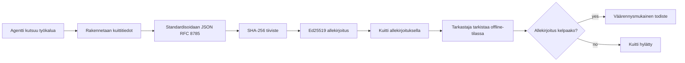
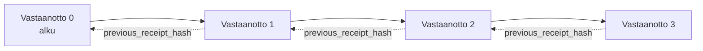

[Katso oppituntivideo: AI-agenttien suojaus kryptografisilla kuiteilla](https://youtu.be/PLACEHOLDER_VIDEO_ID)

> _(Oppituntivideo ja pikkukuva lisätään Microsoftin sisältötiimin toimesta yhdistämisen jälkeen, vastaamaan oppituntien 14 / 15 mallia.)_

# AI-agenttien suojaus kryptografisilla kuiteilla

## Johdanto

Tässä oppitunnissa käsitellään:

- Miksi auditointijäljet AI-agenteille ovat tärkeitä vaatimustenmukaisuuden, vianmäärityksen ja luottamuksen vuoksi.
- Mitä kryptografinen kuitti on ja kuinka se eroaa allekirjoittamattomasta lokirivistä.
- Kuinka tuottaa allekirjoitettu kuitti agentin työkalukutsusta tavallisessa Pythonissa.
- Kuinka varmentaa kuitti offline-tilassa ja havaita manipulointi.
- Kuinka ketjuttaa kuitteja siten, että yhden poistaminen tai uudelleen järjestäminen katkaisee ketjun.
- Mitä kuitit todistavat ja mitä ne nimenomaan eivät todista.

## Oppimistavoitteet

Oppitunnin suorittamisen jälkeen osaat:

- Tunnistaa virhetilanteet, jotka motivoivat kryptografista alkuperän todentamista agentin toiminnoissa.
- Tuottaa Ed25519-allekirjoitetun kuitin kanonisen JSON-payloadin pohjalta.
- Varmistaa kuitin riippumattomasti käyttäen pelkästään allekirjoittajan julkista avainta.
- Tunnistaa manipuloinnin suorittamalla varmennus uudelleen muokatulla kuitilla.
- Rakentaa hash-ketjutetun kuittilistauksen ja selittää, miksi ketju on tärkeä.
- Erotella, mitä kuitit todistavat (attribuutio, eheys, järjestys) ja mitä ne eivät todista (toiminnon oikeellisuus, politiikan pätevyys).

## Ongelma: Agenttisi auditointijälki

Kuvittele, että olet ottanut käyttöön AI-agentin Contoso Travelille. Agentti lukee asiakaspalautteita, soittaa lentojen API:a vaihtoehtojen hakemiseksi ja varaa paikat asiakkaan puolesta. Viime neljänneksellä agentti käsitteli 50 000 varausta.

Nyt tarkastaja saapuu. Hän esittää yksinkertaisen kysymyksen: "Näytä mitä agenttisi teki."

Luovutat lokitiedostot. Tarkastaja katsoo niitä ja kysyy hankalamman kysymyksen: "Mistä tiedän, etteivät nämä lokitiedostot ole muokattuja?"

Tämä on auditointijälkien ongelma. Useimmat agenttien käyttöönotot tänään luottavat:

- **Sovelluslokit**: joita agentti kirjoittaa itse, joita voi muokata kuka tahansa, jolla on tiedostojärjestelmän pääsy.
- **Pilvilokeerauspalvelut**: muokkauksen havaitsevia alustatasolla, mutta vain jos tarkastaja luottaa alustan ylläpitäjään.
- **Tietokantatransaktioiden lokit**: sopivat hyvin tietokantamuutoksiin mutta eivät mielivaltaisiin työkalukutsuihin.

Yksikään näistä ei voi vastata tarkastajan kysymykseen ilman, että tarkastaja luottaa johonkin (sinuun, pilvipalveluntarjoajaasi, tietokantatoimittajaasi). Sisäisessä käytössä luottamus on usein hyväksyttävää. Säännellyissä työnkuormissa (rahoitus, terveydenhuolto, EU:n tekoälyasetus) ei ole.

Kryptografiset kuitit ratkaisevat tämän tekemällä jokaisesta agentin toiminnasta itsenäisesti varmennettavan. Tarkastajan ei tarvitse luottaa sinuun. Tarvitaan vain julkinen avaimesi ja kuitti itsessään.

## Mitä on kryptografinen kuitti?

Kuitti on JSON-objekti, joka kirjaa mitä agentti teki ja jonka on allekirjoittanut digitaalinen allekirjoitus.


  
Minimaalinen kuitti näyttää tältä:

```json
{
  "type": "agent.tool_call.v1",
  "agent_id": "contoso-travel-bot",
  "tool_name": "lookup_flights",
  "tool_args_hash": "sha256:a3f9c1...",
  "result_hash": "sha256:7b2e1d...",
  "policy_id": "contoso-travel-policy-v3",
  "timestamp": "2026-04-25T14:30:00Z",
  "sequence": 47,
  "previous_receipt_hash": "sha256:9d4e6a...",
  "signature": {
    "alg": "EdDSA",
    "sig": "c5af83...",
    "public_key": "8f3b2c..."
  }
}
```
  
Kolme ominaisuutta tekevät työn:

1. **Allekirjoitus**. Kuitti on allekirjoitettu agentin portin Ed25519-yksityisellä avaimella. Kuka tahansa, jolla on vastaava julkinen avain, voi varmistaa allekirjoituksen offline-tilassa. Minkä tahansa kentän muokkaus mitätöi allekirjoituksen.

2. **Kanoninen koodaus**. Ennen allekirjoitusta kuitti sarjoitetaan käyttäen JSON Canonicalization Schemea (JCS, RFC 8785). Tämä varmistaa, että kaksi toteutusta, jotka tuottavat loogisesti saman kuitin, tuottavat identtiset tavujonot. Ilman kanonisointia eri JSON-serialisaattorit tuottaisivat eri allekirjoituksia samalle sisällölle.

3. **Hash-ketju**. `previous_receipt_hash`-kenttä linkittää jokaisen kuitin sitä edeltävään. Jonkin kuitin poistaminen tai uudelleenjärjestely katkaisee kaikki sitä seuraavat kuitit. Manipulaatio käy ilmi ketjutason tarkastelussa, vaikka yksittäiset allekirjoitukset ylitettäisiin.

Nämä ominaisuudet yhdessä tarjoavat kolme takuuta:

- **Attribuutio**: tämä avain allekirjoitti tämän sisällön.
- **Eheys**: sisältö ei ole muuttunut allekirjoituksen jälkeen.
- **Järjestys**: tämä kuitti tuli tuon kuitin jälkeen ketjussa.

## Kuittien tuottaminen Pythonilla

Kuittien tuottaminen ei vaadi erityistä kirjastoa. Kryptografiset primitiivit ovat laajalti saatavilla ja logiikka on muutaman kymmenen rivin Python-koodia.

`code_samples/18-signed-receipts.ipynb`-muistikirjassa käydään läpi koko prosessi. Yhteenvetona:

```python
import json
import hashlib
import base64
from nacl import signing
from jcs import canonicalize  # RFC 8785 kanoninen JSON

def b64url_nopad(data: bytes) -> str:
    return base64.urlsafe_b64encode(data).decode("ascii").rstrip("=")

def sha256_canonical(obj) -> str:
    """SHA-256 of a Python object's JCS-canonical JSON form."""
    return f"sha256:{hashlib.sha256(canonicalize(obj)).hexdigest()}"

# Luo tai lataa allekirjoitusavain (tuotannossa tallenna avainholviin)
signing_key = signing.SigningKey.generate()
verify_key = signing_key.verify_key

# Rakenna kuittauksen sisältö (ei vielä allekirjoitusta)
tool_args = {"origin": "SYD", "destination": "LAX"}
tool_result = [{"flight": "QF11", "price": 1850, "stops": 0}]

payload = {
    "type": "agent.tool_call.v1",
    "agent_id": "contoso-travel-bot",
    "tool_name": "lookup_flights",
    "tool_args_hash": sha256_canonical(tool_args),
    "result_hash": sha256_canonical(tool_result),
    "policy_id": "contoso-travel-policy-v3",
    "timestamp": "2026-04-25T14:30:00Z",
    "sequence": 0,
    "previous_receipt_hash": None,
}

# Tee kanoninen muoto, tiiviste, allekirjoita.
canonical_bytes = canonicalize(payload)
message_hash = hashlib.sha256(canonical_bytes).digest()
signature_bytes = signing_key.sign(message_hash).signature

# Liitä rakenteellinen allekirjoitusobjekti.
receipt = {
    **payload,
    "signature": {
        "alg": "EdDSA",
        "sig": b64url_nopad(signature_bytes),
        "public_key": b64url_nopad(bytes(verify_key)),
    },
}
```
  
Tämä on koko allekirjoitussykli. Muistikirjaharjoitukset käyvät läpi jokaisen vaiheen erikseen.

## Kuittien varmennus ja manipuloinnin havaitseminen

Varmennus on käänteinen operaatio:

```python
import base64
import hashlib
from nacl import signing
from nacl.exceptions import BadSignatureError
from jcs import canonicalize

def b64url_decode(s: str) -> bytes:
    padding = "=" * ((4 - len(s) % 4) % 4)
    return base64.urlsafe_b64decode(s + padding)

def verify_receipt(receipt: dict) -> bool:
    # Allekirjoitus on jäsennelty objekti: {"alg", "sig", "public_key"}.
    sig_obj = receipt.get("signature")
    if not sig_obj or sig_obj.get("alg") != "EdDSA":
        return False

    # Kokoa uudelleen se hyötykuorma, joka allekirjoitettiin (kaikki paitsi allekirjoitus).
    payload = {k: v for k, v in receipt.items() if k != "signature"}

    canonical_bytes = canonicalize(payload)
    message_hash = hashlib.sha256(canonical_bytes).digest()

    try:
        verify_key = signing.VerifyKey(b64url_decode(sig_obj["public_key"]))
        verify_key.verify(message_hash, b64url_decode(sig_obj["sig"]))
        return True
    except BadSignatureError:
        return False
```
  
Tämä funktio ottaa kuitin ja palauttaa `True`, jos allekirjoitus on kelvollinen, muuten `False`. Ei verkko-operaatioita, ei palveluriippuvuuksia, ei luottamusta kolmansiin osapuoliin.

Näyttääkseen manipuloinnin tunnistamisen, muistikirjassa tehdään:

1. Kelvollisen kuitin tuottaminen ja varmennuksen vahvistaminen.
2. Yhden tavun muuttaminen `tool_args_hash`-kentässä.
3. Varmennuksen uudelleensuoritus ja sen epäonnistuminen.

Tämä on käytännön osoitus siitä, että kuitit paljastavat manipuloinnin: pienikin muutos rikkoo allekirjoituksen.

## Kuittien ketjutus monivaiheisille agenteille

Yksi allekirjoitettu kuitti suojaa yhtä toimintoa. Ketju suojaa sarjaa toimintoja.


  
Jokainen kuitti tallentaa sitä edeltävän kuitin hajauksen. Jos hyökkääjä yrittää poistaa toisena olevan kuitin hiljaa, hänen pitäisi joko:

- Muuttaa kuitin 3 `previous_receipt_hash` -kenttää (rikkoutuu kuitin 3 allekirjoitus), TAI
- Tehdä uusi allekirjoitus muokatulle kuitille 3 (vaatii agentin yksityisen avaimen).

Jos yksityinen avain on laitteistokeskuksessa ja julkaiset julkisen avaimen jokaisen kuitin yhteydessä, kumpikaan hyökkäys ei ole toteutettavissa ilman paljastumista.

Muistikirja käy läpi:

1. Kolmen kuitin ketjun rakentamisen.
2. Varmistuksen, että kukin kuitti `previous_receipt_hash` vastaa edeltävän kuitin todellista hajautusta.
3. Yhden kuitin manipuloinnin keskeltä ja ketjun katkeamisen tarkalleen siellä.

Näin tuotat auditointijäljen, jonka ulkoinen tarkastaja voi vahvistaa ilman luottamusta sinuun.

## Mitä kuitit todistavat (ja mitä eivät)

Tämä on tämän oppitunnin tärkein osio. Kuitit ovat tehokkaita, mutta niiden voima on rajattu.

**Kuitit todistavat kolme asiaa:**

1. **Attribuutio**: tietty avain allekirjoitti tietyn payloadin.
2. **Eheys**: payload ei ole muuttunut allekirjoituksen jälkeen.
3. **Järjestys**: tämä kuitti tuli tuon kuitin jälkeen hajausketjussa.

**Kuitit EIVÄT todista:**

1. **Oikeellisuutta**: että agentin toiminto oli oikea toiminto. Väärän vastauksen allekirjoitus on yhtä helppo kuin oikean.
2. **Politiikan noudattamista**: että `policy_id`-kentässä viitattu politiikka todella arvioitiin tai että se olisi sallinut toiminnon. Kuitti tallentaa väitetyn, ei pakotettua.
3. **Henkilöllisyyttä avaimen ulkopuolella**: kuitti sanoo "tämä avain allekirjoitti tämän sisällön". Se ei sano "tämä henkilö auktorisoi tämän". Avain yhdistäminen henkilöön tai organisaatioon vaatii erillisen henkilöllisyysinfrastruktuurin (hakemiston, julkisen avaimen rekisterin jne.).
4. **Syötteiden totuudenmukaisuutta**: jos agentti saa manipuloidun kehotteen ja toimii sen pohjalta, kuitti tallentaa toiminnon tarkasti. Kuitit ovat syötteen validoinnin jälkeisiä, eivät korvaavia.

Tämä rajaus on tärkeä kahdesta syystä:

- Se kertoo, mihin kuitit sopivat: tekemään agentin käyttäytymisestä auditoitavaa ja manipulointiturvallista, jopa organisaatiorajojen yli.
- Se kertoo, mitä muita kerroksia tarvitset vielä: syötteen validointi (Oppitunti 6), politiikan toteutus (lyhyesti myöhemmin) ja henkilöllisyysinfrastruktuuri (ei kuulu tämän oppitunnin aiheeseen).

Yleinen virhe on olettaa, että "meillä on kuitit" tarkoittaa "meillä on hallinto". Ei tarkoita. Kuitit ovat perusta. Hallinto on järjestelmä, jonka rakennat niiden päälle.

## Tuotantoviitteet

Tämän oppitunnin Python-koodi on tarkoituksella minimaalinen, jotta voit lukea jokaisen rivin ja ymmärtää tarkasti, mitä tapahtuu. Tuotantokäytössä sinulla on kaksi vaihtoehtoa:

1. **Rakennat suoraan kryptografisten primitiivien päälle.** Edellä nähty 50 riviä riittävät moniin käyttötarkoituksiin. PyNaCl (Ed25519) ja `jcs`-paketti (kanoninen JSON) ovat hyvin ylläpidettyjä ja auditoituja kirjastoja.

2. **Käytät tuotantotason kuittikirjastoa.** Useat avoimen lähdekoodin projektit toteuttavat saman mallin lisäominaisuuksin (avainten kierto, eräkäsittely, JWK-setin jakelu, integrointi politiikkamoottoreihin):
   - Tässä oppitunnissa käytetty kuittimuoto seuraa IETF:n Internet-Draftia (`draft-farley-acta-signed-receipts`), joka on parhaillaan standardointiprosessissa.
   - Microsoft Agent Governance Toolkit yhdistää kuitit Cedar-pohjaisiin politiikkapäätöksiin; katso opas 33 kyseisestä repositoriosta loppuun asti esimerkkinä.
   - `protect-mcp` (npm) ja `@veritasacta/verify` (npm) tarjoavat Node-pohjaiset toteutukset kuittien allekirjoittamiseen ja offline-varmennukseen, tarkoitettu suojaamaan minkä tahansa MCP-palvelimen manipulointiturvallisella audittraililla.
   - **[nobulex](https://github.com/arian-gogani/nobulex)** Python-SDK (`pip install nobulex`) tarjoaa saman Ed25519 + JCS allekirjoitusmallin Pythonissa LangChain- ja CrewAI-integraatioilla, sisältäen julkaistuja ristiinvalidointitestivektoreita ja vaatimustenmukaisuuskartoituksen, joka on myötävaikuttanut [OWASP PR #2210](https://github.com/OWASP/CheatSheetSeries/pull/2210) kautta.

Valinta oman ratkaisun ja kirjaston välillä vastaa JWT-kirjaston kirjoittamisen ja valmiin käytön valintaa: molemmat ovat järkeviä; kirjasto säästää aikaa ja vähentää auditointipintaa; alusta alkaen toteuttaminen pakottaa ymmärtämään jokaisen primitiivin. Tämä oppitunti opettaa alusta alkaen -tavan, jotta sinulla on pohja kumpaakin valintaa varten.

## Tietovisa

Testaa ymmärryksesi ennen käytännön harjoitukseen siirtymistä.

**1. Kuitti on allekirjoitettu agentin yksityisellä Ed25519-avaimella. Tarkastajalla on vain julkinen avain. Voiko tarkastaja varmentaa kuitin offline-tilassa?**

<details>
<summary>Vastaus</summary>

Kyllä. Ed25519-varmennus tarvitsee vain julkisen avaimen ja allekirjoitetut tavut. Ei verkko-operaatioita, ei palveluriippuvuuksia. Tämä tekee kuiteista hyödyllisiä ilman verkkoyhteyttä, moniorganisaatiotarkastuksessa tai luottamuksen vähäisissä asetuksissa.
</details>

**2. Hyökkääjä muuttaa kuitin `policy_id`-kenttää väittääkseen sitä hallitsevan sallivampi politiikka. Allekirjoitus tehtiin alkuperäisen payloadin pohjalta. Mitä varmennuksen aikana tapahtuu?**

<details>
<summary>Vastaus</summary>

Varmennus epäonnistuu. Allekirjoitus laskettiin alkuperäisen payloadin kanonisista tavuista; minkä tahansa kentän muokkaus muuttaa kanonisia tavuja, joka muuttaa SHA-256-hajautusta, mikä tekee allekirjoituksesta virheellisen. Hyökkääjällä ei ole yksityistä avainta tuottaakseen uuden kelvollisen allekirjoituksen.
</details>

**3. Miksi kuitti sisältää `tool_args_hash` ja `result_hash` sen raw-argumenttien ja tulosten sijaan?**

<details>
<summary>Vastaus</summary>

Kaksi syytä. Ensinnäkin, kuitti saatetaan arkistoida tai siirtää ympäristöissä, joissa raakasisällön (henkilötiedot, liiketoimintadata) vuotaminen on ongelma. Hajautus pitää kuitin pienenä ja sisällön yksityisenä; tarkastaja voi varmistaa, että hajautus vastaa erikseen tallennettua todellista sisältöä. Toiseksi, hajautuksilla on kiinteä koko; kuitti hajautuksilla on kooltaan rajattu riippumatta syötteiden ja tuotosten koosta.
</details>

**4. `previous_receipt_hash`-kenttä linkittää jokaisen kuitin sitä edeltävään. Jos hyökkääjä poistaa hiljaa yhden kuitin ketjun keskeltä, mikä muuttuu pätemättömäksi?**

<details>
<summary>Vastaus</summary>

Jokainen kuitista sen jälkeen. Niiden `previous_receipt_hash` -kentät eivät enää vastaa ketjun todellisuutta (koska viitattu kuitti puuttuu tai ketju osoittaa eri edeltäjään). Poiston peittämiseksi hyökkääjän pitäisi allekirjoittaa uudelleen jokainen myöhempi kuitti, mikä vaatii yksityisen avaimen.
</details>

**5. Kuitti varmennetaan onnistuneesti. Todistaako se, että agentin toiminto oli oikein, pätevä tai politiikan mukainen?**

<details>
<summary>Vastaus</summary>

Ei. Kelvollinen kuitti todistaa kolme asiaa: attribuution (tämä avain allekirjoitti tämän sisällön), eheyden (sisältö ei ole muuttunut) ja järjestyksen (tämä kuitti tuli tuon jälkeen). Se EI todista, että toiminto oli oikea, että `policy_id` kentässä nimetty politiikka arvioitiin, tai että agentti noudatti kaikkia sääntöjä. Kuitit tekevät agentin käytöksestä auditoitavaa, eivät välttämättä oikeaa. Tämä on oppitunnin tärkein rajapinta.
</details>

## Harjoitustehtävä

Avaa `code_samples/18-signed-receipts.ipynb` ja suorita kaikki neljä osiota:

1. **Osa 1**: Allekirjoita ensimmäinen kuittisi ja varmista se.
2. **Osa 2**: Manipuloi kuittia ja tarkkaile varmennuksen epäonnistumista.
3. **Osa 3**: Rakenna kolmen kuitin ketju ja varmista ketjun eheys.
4. **Osa 4**: Käytä mallia Microsoft Agent Frameworkilla rakennettuun agenttiin: kääri työkalukutsu kuittiallekirjoitukseen, varmista kuitti itsenäisesti.
**Venytystehtävä 1:** laajenna kuittikaaviota yhdellä omavalintaisella kentällä (esimerkiksi seuranta-ID), päivitä kanonista allekirjoituslogiikkaa sisällyttämään tämä kenttä ja varmista, että kuitti käy edelleen läpi varmennusprosessin. Muokkaa sitten kenttää allekirjoituksen jälkeen ja varmista, että varmennus epäonnistuu. Tämä pakottaa sinut ymmärtämään, kuinka jokainen tavua kanonisessa koodauksessa vaikuttaa allekirjoitukseen.

**Venytystehtävä 2:** SHA-256-hashaa kaksi kuittiasi yhdessä (liittämällä niiden kanoniset tavut määrätetyssä järjestyksessä) ja upota syntynyt tiiviste kolmannen kuitin uudeksi kentäksi ennen allekirjoitusta. Varmista, että kaikki kolme kuittia käyvät edelleen läpi varmennuksen. Olet juuri rakentanut yhden askeleen sisällyttämistodistuksen: kuka tahansa, joka omistaa kolmannen kuitin, voi todistaa, että kaksi ensimmäistä oli olemassa allekirjoitushetkellä paljastamatta niiden sisältöjä. Tämä on kaava, jota valikoiva-julkistuskuittaukset käyttävät laajamittaisesti (Merkle-sitoumukset, RFC 6962).

## Yhteenveto

Kryptografiset kuitit tarjoavat tekoälyagentille tarkastelulokin, joka on:

- **Itsenäisesti varmennettavissa:** kuka tahansa julkisen avaimen omaava voi varmistaa, ei palveluriskiä.
- **Epäluotettavasti havaittava:** mikä tahansa muutos mitätöi allekirjoituksen.
- **Kannettava:** kuitti on pieni JSON-tiedosto; sitä voidaan arkistoida, siirtää ja varmistaa missä tahansa.
- **Standardien mukainen:** perustuu Ed25519:ään (RFC 8032), JCS:ään (RFC 8785) ja SHA-256:een, kaikki laajasti käytettyjä primitivejä.

Ne eivät korvaa syötteen validointia, politiikan noudattamista tai identiteettijärjestelmää. Ne ovat niiden kerrosten perusta. Kun otat agentteja käyttöön säädellyissä työkuormissa, moniorganisaatiotyönkuluissa tai missä tahansa tilanteessa, jossa tulevalta tarkastajalta ei voi odottaa luottamusta, kuitit ovat tapa tehdä tarkastelulokista rehellinen.

Tärkein opetus: kuitit todistavat, kuka sanoi mitä ja milloin. Ne eivät todista, että sanottu oli totta tai oikein. Säilytä tämä ero tarkasti. Se on ero rehellisen alkuperäjärjestelmän ja harhaanjohtavan välillä.

## Tuotanto-osion tarkistuslista

Kun olet valmis siirtymään tästä oppitunnista kuitilla allekirjoitettujen agenttien käyttöönottoon tuotantoympäristössä:

- [ ] **Siirrä allekirjoitusavain pois kehittäjän kannettavalta.** Käytä Azure Key Vaultia, AWS KMS:ää tai laitteistoturvayksikköä. Yksityisavain, jolla kuitit allekirjoitetaan, ei saa koskaan sijaita lähdekoodissa tai selväkielisenä sovelluslaitteissa.
- [ ] **Julkaise varmennuksen julkinen avain.** Tarkastajat tarvitsevat sen varmistaakseen offline-tilassa. Yleinen käytäntö on JWK Set tunnetulla URL-osoitteella (RFC 7517), esim. `https://your-org.example.com/.well-known/agent-keys.json`.
- [ ] **Ankkuroi ketju ulkoisesti.** Kirjoita säännöllisesti viimeisimmän ketjun kärjen tiiviste läpinäkyvyyden lokiin (Sigstore Rekor, RFC 3161 aikaleimausviranomainen tai toinen sisäinen järjestelmä), jotta ulkopuolinen osapuoli voi varmistaa "tämä ketju oli olemassa tuohon aikaan."
- [ ] **Tallenna kuitit muuttumattomasti.** Pelkästään lisäävä säilöntä (Azure Storage immutable policyillä, AWS S3 Object Lock) estää sisäpiiriläisen historian uudelleenkirjoittamisen tallennustasolla.
- [ ] **Päätä säilytysajasta.** Monet säädökset edellyttävät monivuotista säilytystä. Suunnittele kuittien määrän kasvu (jokainen kuitti on ~500 tavua; agentti, joka tekee 10 000 kutsua päivässä, tuottaa ~1,8 GB vuodessa).
- [ ] **Dokumentoi, mitä kuitit eivät kata.** Kuitit todistavat attribuution, eheyden ja järjestyksen. Ohjeistuksessasi pitää selkeästi listata, mitä lisävalvonnat (syötteen validointi, politiikan noudattaminen, nopeuden rajoitus, identiteettijärjestelmä) kuuluvat hallintamallisi oheen.

### Lisää kysymyksiä tekoälyagenttien suojaamisesta?

Liity [Microsoft Foundry Discordiin](https://aka.ms/ai-agents/discord) tapaamaan muita oppijoita, osallistumaan toimistoaikoihin ja saamaan vastauksia tekoälyagenttikysymyksiisi.

## Tämän oppitunnin jälkeen

Tässä oppitunnissa käsiteltiin yksittäisen kuitin allekirjoitusta ja hash-ketjutettuja sekvenssejä. Samat primitiivit yhdistyvät useisiin kehittyneempiin malleihin, joihin saatat törmätä hallintamallisi kehittyessä:

- **Valikoiva julkistus.** Kun kuitin kentät ovat itsenäisesti sitoutuneita (RFC 6962-tyylinen Merkle-puu), voit paljastaa tietyt kentät tietyille tarkastajille ja todistaa muiden kenttien pysyvän muuttumattomina ilman, että paljastat niitä. Hyödyllinen, kun sama kuitti täyttää sekä laaja-alaisen tarkastuksen (joka haluaa täyden kattavuuden) että tietosuojaa koskevat normit, kuten GDPR (joka haluaa, että tarkastaja näkee mahdollisimman vähän).
- **Kuitin mitätöinti.** Jos allekirjoitusavain vaarantuu, tarvitaan tapa merkitä kaikki kyseisellä avaimella allekirjoitetut kuitit luottamattomiksi tietystä ajankohdasta eteenpäin. Yleiset mallit: lyhytikäiset allekirjoitusavaimet ja julkaistu mitätöintilista tai läpinäkyvyyden loki mitätöintimerkinnöillä.
- **Kaksiosaiset / jaetut allekirjoituskuittaukset.** Jotkin toteutukset jakavat allekirjoitetun sisällön ennen suoritusta (`authorization_*`) ja suorituksen jälkeen (`result_*`) itsenäisesti allekirjoitettuihin osiin, hyödyllinen, kun valtuutuspäätöksen ja havaittujen tulosten tuottavat eri toimijat tai eri ajankohtina. Tämä yhdistyy lisäominaisuutena tämän oppitunnin kuittiformaattiin.
- **Sisällön koostaminen.** Kuitti sulkee mitä tahansa tavuja, jotka laitat `result_hash`-kenttään. Todellisessa maailmassa sisältö on usein rikkaampi kuin yhden työkalukutsun tulos: päätöksiä edeltävä päättely (mallin ennuste, harkitut vaihtoehdot, todisteet ja niiden kattavuus, riskiasenne, vastuuketju, portin lopputulos) voi olla kaikki sisällytetty tulokseen ja suljettu yhdellä kuitilla. Tämä säilyttää kuitin muodon minimissä, samalla kun sisältökaaviot voivat kehittyä toimialakohtaisesti.
- **Ristikkäistoteutusten yhteensopivuus.** Useat riippumattomat toteutukset samasta kuittiformaatista (Python, TypeScript, Rust, Go) varmistavat yhteensopivuuden yhteisillä testivektoreilla. Jos rakennat oman toteutuksen, julkaisujen vektoreiden vastaanottaminen osoittaa suora-yhteensopivuuden.
- **Jälkikvanttisiirtymä.** Ed25519 on laajalti käytössä tänään, mutta ei kvanttiturvallinen. Kuittiformaatti on algoritmi-joustava: `signature.alg`-kentässä voi käyttää `ML-DSA-65`:ttä (NISTin jälkikvanttiallekirjoitusstandardi) siirtymän aikana. Suunnittele siirtymäkausi, jolloin kuitit allekirjoitetaan kahdella allekirjoituksella.

## Lisäresurssit

- <a href="https://datatracker.ietf.org/doc/draft-farley-acta-signed-receipts/" target="_blank">IETF Internet-Draft: Koneiden päätöskuittien allekirjoitukset koneiden väliseen käyttöoikeuteen</a>
- <a href="https://learn.microsoft.com/azure/ai-studio/responsible-use-of-ai-overview" target="_blank">Vastuullisen tekoälyn yleiskatsaus (Azure AI)</a>
- <a href="https://datatracker.ietf.org/doc/html/rfc8032" target="_blank">RFC 8032: Edwards-kaaren digitaalinen allekirjoitusalgoritmi (EdDSA)</a>
- <a href="https://datatracker.ietf.org/doc/html/rfc8785" target="_blank">RFC 8785: JSON-kanonimisointiskaala (JCS)</a>
- <a href="https://datatracker.ietf.org/doc/html/rfc6962" target="_blank">RFC 6962: Sertifikaattien läpinäkyvyys</a> (Merkle-puurakenteen käyttö valikoivissa julkistuskuituissa)
- <a href="https://github.com/microsoft/agent-governance-toolkit/blob/main/docs/tutorials/33-offline-verifiable-receipts.md" target="_blank">Microsoft Agent Governance Toolkit, Opas 33: Offline-vahvistettavat päätöskuittaukset</a>
- <a href="https://github.com/ScopeBlind/agent-governance-testvectors" target="_blank">Ristikkäistoteutusten yhteensopivuustestivektorit</a> tämän oppitunnin kuittiformaatissa (Apache-2.0)
- <a href="https://pynacl.readthedocs.io/" target="_blank">PyNaCl-dokumentaatio</a> (Ed25519 Pythonissa)

## Edellinen oppitunti

[Tietokoneen käyttöagenttien rakentaminen (CUA)](../15-browser-use/README.md)

## Seuraava oppitunti

_(Määrittelevät opetussuunnitelman ylläpitäjät)_

---

<!-- CO-OP TRANSLATOR DISCLAIMER START -->
**Vastuuvapauslauseke**:
Tämä asiakirja on käännetty käyttämällä tekoälypohjaista käännöspalvelua [Co-op Translator](https://github.com/Azure/co-op-translator). Vaikka pyrimme tarkkuuteen, otathan huomioon, että automaattiset käännökset saattavat sisältää virheitä tai epätarkkuuksia. Alkuperäinen asiakirja sen alkuperäiskielellä on virallinen lähde. Tärkeissä asioissa suositellaan ammattimaista ihmiskäännöstä. Emme ole vastuussa tämän käännöksen käytöstä aiheutuvista väärinymmärryksistä tai tulkinnoista.
<!-- CO-OP TRANSLATOR DISCLAIMER END -->