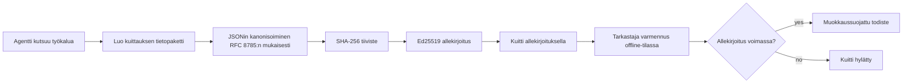
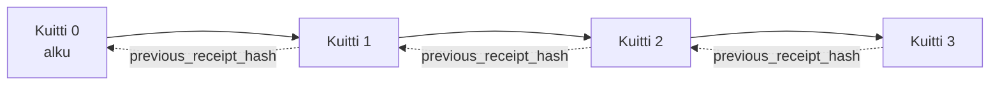

[Katso oppituntovideo: AI-agenttien suojaaminen kryptografisilla kuiteilla](https://youtu.be/PLACEHOLDER_VIDEO_ID)

> _(Oppituntovideon ja pikkukuvan lisäävät Microsoftin sisältötiimi yhdistämisen jälkeen, vastaamaan oppituntien 14 / 15 kaavaa.)_

# AI-agenttien suojaaminen kryptografisilla kuiteilla

## Johdanto

Tässä oppitunnissa käsitellään:

- Miksi auditointijäljet AI-agenteille ovat tärkeitä vaatimustenmukaisuuden, virheenkorjauksen ja luottamuksen kannalta.
- Mitä kryptografinen kuitti on ja miten se eroaa allekirjoittamattomasta lokirivistä.
- Kuinka tuottaa allekirjoitettu kuitti agentin työkalukutsusta tavallisella Pythonilla.
- Kuinka vahvistaa kuitti offline-tilassa ja havaita manipulointi.
- Kuinka ketjuttaa kuitteja niin, että yhden poistaminen tai uudelleenjärjestäminen rikkoo ketjun.
- Mitä kuitit todistavat ja mitä ne nimenomaisesti eivät todista.

## Oppimistavoitteet

Tämän oppitunnin jälkeen osaat:

- Tunnistaa epäonnistumismoodit, jotka motivoivat kryptografista alkuperän todentamista agentin toiminnoille.
- Tuottaa Ed25519-allekirjoitetun kuitin kanonisesta JSON-payloadista.
- Vahvistaa kuitin itsenäisesti pelkän allekirjoittajan julkisen avaimen avulla.
- Havaita manipulointi suorittamalla vahvistus uudelleen muunnellulla kuitilla.
- Rakentaa hash-ketjutettu kuitujono ja selittää miksi ketju on tärkeä.
- Tunnistaa raja, mitä kuitit todistavat (attributio, eheys, järjestys) ja mitä ne eivät todista (toiminnon oikeellisuus, politiikan pätevyys).

## Ongelma: Agenttisi auditointijälki

Kuvittele, että olet ottanut käyttöön AI-agentin Contoso Travelille. Agentti lukee asiakaspyyntöjä, käyttää lentojen APIa vaihtoehtojen hakemiseen ja varaa paikkoja asiakkaan puolesta. Viime vuosineljänneksellä agentti käsitteli 50 000 varausta.

Tänään tarkastaja saapuu. Hän esittää yksinkertaisen kysymyksen: "Näytä minulle, mitä agenttisi teki."

Luovutat lokitiedostosi. Tarkastaja katsoo niitä ja esittää vaikeamman kysymyksen: "Mistä tiedän, ettei näitä lokeja ole muokattu?"

Tämä on auditointijälkiongelma. Suurin osa agentin käyttöönotosta nykyään perustuu:

- **Sovelluslokkeihin**: agentin itse kirjoittamat, muokattavissa kenellä tahansa, jolla on tiedostojärjestelmän käyttöoikeus.
- **Pilvilokin palveluihin**: alustatasolla manipulointia havaitsevia, mutta vain, jos tarkastaja luottaa alustan ylläpitäjään.
- **Tietokannan transaktiolokeihin**: sopivia tietokantamuutoksiin mutta eivät mielivaltaisiin työkalukutsuihin.

Mikään näistä ei voi vastata tarkastajan kysymykseen ilman, että tarkastaja luottaa johonkuhun (sinuun, pilvipalveluntarjoajaasi, tietokantamyyjääsi). Sisäisessä käytössä tämä luotto on usein hyväksyttävää. Säännellyissä työkuormissa (rahoitus, terveydenhuolto, EU:n tekoälyasetus) sitä ei ole.

Kryptografiset kuitit ratkaisevat tämän tekemällä jokaisesta agentin toiminnosta itsenäisesti vahvistettavan. Tarkastajan ei tarvitse luottaa sinuun. He tarvitsevat vain julkisen avaimesi ja kuitin itsessään.

## Mitä on kryptografinen kuitti?

Kuitti on JSON-objekti, joka tallentaa, mitä agentti teki, ja on allekirjoitettu digitaalisella allekirjoituksella.


```mermaid
flowchart LR
    A[Agentti kutsuu työkalua] --> B[Luo kuittauksen tietopaketti]
    B --> C[JSONin kanonisoiminen RFC 8785:n mukaisesti]
    C --> D[SHA-256 tiiviste]
    D --> E[Ed25519 allekirjoitus]
    E --> F[Kuitti allekirjoituksella]
    F --> G[Tarkastaja varmennus offline-tilassa]
    G --> H{Allekirjoitus voimassa?}
    H -- yes --> I[Muokkaussuojattu todiste]
    H -- no --> J[Kuitti hylätty]
```

Minimaalinen kuitti näyttää tältä:

```json
{
  "type": "agent.tool_call.v1",
  "agent_id": "contoso-travel-bot",
  "tool_name": "lookup_flights",
  "tool_args_hash": "sha256:a3f9c1...",
  "result_hash": "sha256:7b2e1d...",
  "policy_id": "contoso-travel-policy-v3",
  "timestamp": "2026-04-25T14:30:00Z",
  "sequence": 47,
  "previous_receipt_hash": "sha256:9d4e6a...",
  "signature": {
    "alg": "EdDSA",
    "sig": "c5af83...",
    "public_key": "8f3b2c..."
  }
}
```

Kolme ominaisuutta tekevät työn:

1. **Allekirjoitus**. Kuitti on allekirjoitettu agentin portin toimesta Ed25519-yksityisavaimella. Kuka tahansa oikealla julkisella avaimella voi vahvistaa allekirjoituksen offline-tilassa. Minkä tahansa kentän manipulointi mitätöi allekirjoituksen.

2. **Kanoninen koodaus**. Ennen allekirjoitusta kuitti sarjallistetaan JSON Canonicalization Scheme (JCS, RFC 8785) -menetelmällä. Tämä takaa, että kaksi eri toteutusta tuottaa samalle loogiselle kuitille tavuittain identtisen tuloksen. Ilman kanonisointia eri JSON-sarjallistimet tuottaisivat eri allekirjoituksia samasta sisällöstä.

3. **Hash-ketjutus**. `previous_receipt_hash` -kenttä linkittää jokaisen kuitin sitä edeltävään. Yhden kuitin poistaminen tai uudelleenjärjestely rikkoo kaikki sitä seuraavat kuitit. Manipulointi tulee näkyväksi ketjutasolla, vaikka yksittäiset allekirjoitukset ylitettäisiin.

Yhdessä nämä ominaisuudet takaavat kolme asiaa:

- **Attribuutio**: tämä avain allekirjoitti tämän sisällön.
- **Eheys**: sisältö ei ole muuttunut allekirjoituksen jälkeen.
- **Järjestys**: tämä kuitti tuli tuon kuitin jälkeen ketjussa.

## Kuittien tuottaminen Pythonissa

Kuittia ei tarvitse tuottaa erityisellä kirjastolla. Kryptografiset peruspalikat ovat laajalti saatavilla ja logiikka on muutaman kymmenen rivin Python-koodi.

Käytännön harjoitukset tiedostossa `code_samples/18-signed-receipts.ipynb` käyvät koko prosessin läpi. Yhteenveto:

```python
import json
import hashlib
import base64
from nacl import signing
from jcs import canonicalize  # RFC 8785 kanoninen JSON

def b64url_nopad(data: bytes) -> str:
    return base64.urlsafe_b64encode(data).decode("ascii").rstrip("=")

def sha256_canonical(obj) -> str:
    """SHA-256 of a Python object's JCS-canonical JSON form."""
    return f"sha256:{hashlib.sha256(canonicalize(obj)).hexdigest()}"

# Luo tai lataa allekirjoitusavain (tuotannossa säilytä avainavaimessa)
signing_key = signing.SigningKey.generate()
verify_key = signing_key.verify_key

# Rakenna kuittauksen tietosisältö (ei vielä allekirjoitusta)
tool_args = {"origin": "SYD", "destination": "LAX"}
tool_result = [{"flight": "QF11", "price": 1850, "stops": 0}]

payload = {
    "type": "agent.tool_call.v1",
    "agent_id": "contoso-travel-bot",
    "tool_name": "lookup_flights",
    "tool_args_hash": sha256_canonical(tool_args),
    "result_hash": sha256_canonical(tool_result),
    "policy_id": "contoso-travel-policy-v3",
    "timestamp": "2026-04-25T14:30:00Z",
    "sequence": 0,
    "previous_receipt_hash": None,
}

# Kanonisoi, tee tiiviste, allekirjoita.
canonical_bytes = canonicalize(payload)
message_hash = hashlib.sha256(canonical_bytes).digest()
signature_bytes = signing_key.sign(message_hash).signature

# Lisää jäsennelty allekirjoitusobjekti.
receipt = {
    **payload,
    "signature": {
        "alg": "EdDSA",
        "sig": b64url_nopad(signature_bytes),
        "public_key": b64url_nopad(bytes(verify_key)),
    },
}
```

Tämä on koko allekirjoitusputki. Harjoitukset muistikirjassa käyvät jokaisen vaiheen läpi.

## Kuittien vahvistaminen ja manipuloinnin havaitseminen

Vahvistaminen on päinvastainen operaatio:

```python
import base64
import hashlib
from nacl import signing
from nacl.exceptions import BadSignatureError
from jcs import canonicalize

def b64url_decode(s: str) -> bytes:
    padding = "=" * ((4 - len(s) % 4) % 4)
    return base64.urlsafe_b64decode(s + padding)

def verify_receipt(receipt: dict) -> bool:
    # Allekirjoitus on jäsennelty objekti: {"alg", "sig", "public_key"}.
    sig_obj = receipt.get("signature")
    if not sig_obj or sig_obj.get("alg") != "EdDSA":
        return False

    # Rakenna uudelleen varsinainen allekirjoitettu tieto (kaikki paitsi allekirjoitus).
    payload = {k: v for k, v in receipt.items() if k != "signature"}

    canonical_bytes = canonicalize(payload)
    message_hash = hashlib.sha256(canonical_bytes).digest()

    try:
        verify_key = signing.VerifyKey(b64url_decode(sig_obj["public_key"]))
        verify_key.verify(message_hash, b64url_decode(sig_obj["sig"]))
        return True
    except BadSignatureError:
        return False
```

Tämä funktio ottaa kuitin ja palauttaa `True`, jos allekirjoitus on validi, muuten `False`. Ei verkkokutsua, ei palvelinriippuvuutta, ei luottamusta kolmanteen osapuoleen.

Manipuloinnin havaitsemisen näkemiseksi muistikirjassa käydään läpi:

1. Voimassa olevan kuitin tuottaminen ja vahvistuksen varmistaminen.
2. Yhden tavun muuttaminen `tool_args_hash` -kentässä.
3. Vahvistuksen uudelleenajaminen ja sen epäonnistuminen.

Tämä on käytännön todiste siitä, että kuitit ovat manipulointiin havaittavia: pienikin muutos rikkoo allekirjoituksen.

## Kuittien ketjuttaminen monivaiheisille agenteille

Yksittäinen allekirjoitettu kuitti suojaa yhtä toimintoa. Kuituketju suojaa sarjaa.


```mermaid
flowchart LR
    R0[Kuitti 0<br/>alku] --> R1[Kuitti 1]
    R1 --> R2[Kuitti 2]
    R2 --> R3[Kuitti 3]
    R1 -. previous_receipt_hash .-> R0
    R2 -. previous_receipt_hash .-> R1
    R3 -. previous_receipt_hash .-> R2
```

Jokainen kuitti tallentaa edeltäjänsä kuitin hashin. Jos hyökkääjä poistaisi kuitin 2 hiljaisesti, hänen täytyisi joko:

- Muuttaa kuitin 3 `previous_receipt_hash` -kenttää (rikkoo kuitin 3 allekirjoituksen), TAI
- Väärennä uusi allekirjoitus muokatulle kuitille 3 (vaatii agentin yksityisavaimen).

Jos yksityisavain säilyy laiteavaimessa ja julkaiset julkisen avaimen jokaisen kuitin mukana, kumpikaan hyökkäys ei ole mahdollista ilman havaitsemista.

Muistikirjassa käydään läpi:

1. Kolmen kuitin ketjun rakentaminen.
2. Vahvistetaan, että kunkin kuitin `previous_receipt_hash` vastaa edellisen kuitin todellista hashia.
3. Yhden kuitin keskellä manipulointi ja ketjun katkeaminen juuri siinä kohdassa.

Näin tuot auditointijäljen, jonka ulkopuolinen tarkastaja voi varmistaa ilman luottamusta sinuun.

## Mitä kuitit todistavat (ja mitä eivät)

Tämä on tämän oppitunnin tärkein osio. Kuitit ovat tehokkaita, mutta niiden voima on rajattu.

**Kuitit todistavat kolme asiaa:**

1. **Attribuutio**: tietty avain allekirjoitti tietyn payloadin.
2. **Eheys**: payload ei ole muuttunut allekirjoituksen jälkeen.
3. **Järjestys**: tämä kuitti tuli tuon kuitin jälkeen hash-ketjussa.

**Kuitit eivät TODISTA:**

1. **Oikeellisuutta**: että agentin toiminto oli oikea. Kuitti voidaan allekirjoittaa niin virheellisestä kuin oikeastakin vastauksesta.
2. **Politiikan noudattamista**: että `policy_id`:ssä mainittu politiikka oli oikeasti arvioitu tai että se olisi sallinut toiminnon. Kuitti tallentaa vaaditun, ei sitä, mitä noudatettiin.
3. **Identiteettiä avainyhteyden ulkopuolella**: kuitti sanoo "tämä avain allekirjoitti tämän sisällön." Se ei sano "tämä henkilö valtuutti tämän." Avain henkilön tai organisaation yhdistäminen vaatii erillisen identiteetti-infrastruktuurin (hakemisto, julkisen avaimen rekisteri yms.).
4. **Syötteiden totuudenmukaisuutta**: jos agentti saa manipuloidun käskyn ja toimii sen mukaan, kuitti tallentaa toimenpiteen tarkasti. Kuitit tulevat syötteen validoinnin jälkeen, eivät korvaa sitä.

Tämä raja on tärkeä kahdesta syystä:

- Se kertoo, mihin kuitit soveltuvat: tehdä agentin toiminnasta auditointikelpoista ja manipulointiin havaittavaa, myös organisaatiorajojen yli.
- Se kertoo, mitä lisäkerroksia tarvitset: syötteen validointi (oppitunti 6), politiikan valvonta (käsitelty lyhyesti alla) ja identiteetti-infrastruktuuri (ei tämän tunnin aihe).

Yleinen virhe on olettaa, että "meillä on kuitit" tarkoittaa "meitä valvotaan." Näin ei ole. Kuitit ovat perusta. Hallinnointi on rakennelma, jonka päälle rakennat.

## Tuotantoreferenssit

Tämän oppitunnin Python-koodi on tarkoituksella minimaalista, jotta voit lukea jokaisen rivin ja ymmärtää tarkkaan, mitä tapahtuu. Tuotannossa sinulla on kaksi vaihtoehtoa:

1. **Rakentaa suoraan kryptografisten perustoimintojen päälle.** Noin 50 riviä yllä on riittävä moniin käyttötapauksiin. PyNaCl (Ed25519) ja `jcs`-paketti (kanoninen JSON) ovat hyvin ylläpidettyjä ja auditoituja kirjastoja.

2. **Käyttää tuotantotasoista kuittikirjastoa.** Useat avoimen lähdekoodin projektit toteuttavat saman mallin lisäominaisuuksilla (avainten kierto, erävahvistus, JWK Setin jakelu, integrointi politiikkamoottoreihin):
   - Tässä oppitunnissa käytetty kuittimuoto noudattaa IETF:n Internet-Draftia (`draft-farley-acta-signed-receipts`), joka on standardointiprosessissa.
   - Microsoft Agent Governance Toolkit yhdistää kuitit Cedar-pohjaisiin politiikkapäätöksiin; katso opas 33 tästä reposta päättyvästä esimerkistä.
   - `protect-mcp` (npm) ja `@veritasacta/verify` (npm) tarjoavat Node-pohjaisen implementaation kuitin allekirjoitukseen ja offline-vahvistukseen, tarkoitettu minkä tahansa MCP-palvelimen suojaamiseen manipulointiin havaittavalla auditointijäljellä.
   - **[nobulex](https://github.com/arian-gogani/nobulex)** Python SDK (`pip install nobulex`) tarjoaa saman Ed25519 + JCS allekirjoitusmallin Pythonissa LangChain- ja CrewAI-integraatioiden kanssa, mukaan lukien julkaistut ristivahvistustestivektorit ja vaatimustenmukaisuuskartoitus, johon on osallistunut [OWASP PR #2210](https://github.com/OWASP/CheatSheetSeries/pull/2210).

Oman ratkaisun rakentamisen ja kirjaston käytön välinen valinta muistuttaa JWT-kirjaston kirjoittamisen tai testatun kirjaston käytön valintaa: molemmat ovat järkeviä; kirjasto säästää aikaa ja vähentää auditointipintaa; alusta asti rakentaminen pakottaa ymmärtämään jokaisen perustoiminnon. Tämä opetus oppitunti opettaa alusta alkaen, jotta sinulla olisi perustaa kumpaankin valintaan.

## Tiedon tarkistus

Testaa ymmärryksesi ennen siirtymistä käytännön harjoitukseen.

**1. Kuitti allekirjoitetaan agentin yksityisellä Ed25519-avaimella. Tarkastajalla on vain julkinen avain. Voiko tarkastaja vahvistaa kuitin offline-tilassa?**

<details>
<summary>Vastaus</summary>

Kyllä. Ed25519:n vahvistukseen tarvitaan vain julkinen avain ja allekirjoitetut tavut. Ei verkkokutsua, ei palveluriippuvuutta. Tämä ominaisuus tekee kuiteista hyödyllisiä eristyksissä, moniorganisaatiossa tai vähäluottamuksisissa tarkastustilanteissa.
</details>

**2. Hyökkääjä muuttaa kuitin `policy_id`-kenttää väittääkseen, että sitä hallitsi lievempi politiikka. Allekirjoitus tehtiin alkuperäisen payloadin mukaisesti. Mitä tapahtuu vahvistuksen aikana?**

<details>
<summary>Vastaus</summary>

Vahvistus epäonnistuu. Allekirjoitus laskettiin alkuperäisen payloadin kanonisten tavujen perusteella; minkä tahansa kentän muutos muuttaa kanonisia tavuja, joka muuttaa SHA-256 hashin, jolloin allekirjoitus mitätöityy. Hyökkääjällä pitäisi olla yksityisavain tuottaakseen uuden hyväksyttävän allekirjoituksen, jota hänellä ei ole.
</details>

**3. Miksi kuitti sisältää `tool_args_hash` ja `result_hash` kentät raakojen argumenttien ja tuloksen sijaan?**

<details>
<summary>Vastaus</summary>

Kaksi syytä. Ensinnäkin kuitti voi tarvita arkistointia tai siirtoa ympäristöissä, joissa raaka sisältövuoto (henkilötiedot, liiketoimintadata) on ongelma. Hashaus pitää kuitin pienenä ja sisällön yksityisenä; tarkastaja vahvistaa, että hash vastaa erillään säilytettyä todellista sisältöä. Toiseksi hasheilla on kiinteä koko; kuitti, jossa on hasheja, on kooltaan rajattu riippumatta syötteiden ja tulosten koosta.
</details>

**4. `previous_receipt_hash` kenttä linkittää kuitin edeltäjäänsä. Jos hyökkääjä poistaa hiljaisesti yhden kuitin ketjun keskeltä, mikä menee mitättömäksi?**

<details>
<summary>Vastaus</summary>

Kaikki kuitit, jotka tulivat poistettua edeltävinä. Niiden `previous_receipt_hash` kentät eivät enää vastaa oikeaa ketjua (koska viitatun kuitin ei enää ole olemassa tai ketju osoittaa eri edeltäjään). Poiston peittämiseksi hyökkääjän pitäisi allekirjoittaa uudelleen jokainen myöhempi kuitti, mikä vaatii yksityisavaimen.
</details>

**5. Kuitti vahvistetaan oikein. Todistaako se, että agentin toiminto oli oikea, pätevä tai politiikan mukainen?**

<details>
<summary>Vastaus</summary>

Ei. Voimassa oleva kuitti todistaa kolme asiaa: attribuutio (tämä avain allekirjoitti tämän sisällön), eheys (sisältö ei ole muuttunut) ja järjestys (tämä kuitti tuli tuon kuitin jälkeen). Se EI todista, että toiminto oli oikea, että `policy_id`:ssä mainittu politiikka arvioitiin tai että agentti noudatti kaikkia sääntöjä. Kuitit tekevät agentin toiminnan auditointikelpoiseksi, eivät välttämättä oikeaksi. Tämä on suurin rajaus tässä oppitunnissa.
</details>

## Harjoitustehtävä

Avaa `code_samples/18-signed-receipts.ipynb` ja suorita kaikki neljä osiota:

1. **Osa 1**: Allekirjoita ensimmäinen kuittisi ja varmista se.
2. **Osa 2**: Tee manipulointi kuitille ja katso varmennuksen epäonnistuvan.
3. **Osa 3**: Rakenna kolmen kuitin ketju ja vahvista ketjun eheys.
4. **Osa 4**: Käytä mallia Microsoft Agent Frameworkilla rakennetulle agentille: kääri työkalukutsu kuittien allekirjoitukseen ja varmista kuitti itsenäisesti.


**Haaste 1:** laajenna kuittikaavaa omavalintaisella kentällä (esimerkiksi pyynnön tunnisteella jäljitettävyyttä varten), päivitä kanoninen allekirjoituslogiikka sisällyttämään se, ja vahvista, että kuitti edelleen kulkee varmennuksen läpi. Muuta sitten kenttää allekirjoituksen jälkeen ja vahvista, että varmennus epäonnistuu. Tämä pakottaa sinut ymmärtämään, miten jokainen kanonisen koodauksen tavu vaikuttaa allekirjoitukseen.

**Haaste 2:** SHA-256-tiivistä kaksi kuittiasi yhteen (yhdistä niiden kanoniset tavut määrätietoisessa järjestyksessä) ja upota tuloksena oleva tiiviste kolmannen kuitin uudeksi kentäksi ennen allekirjoitusta. Varmista, että kaikki kolme kuittia kulkevat edelleen varmennuksesta läpi. Olet juuri rakentanut yksivaiheisen sisällyttämistodistuksen: kuka tahansa, joka pitää kädessään kolmannen kuitin, voi todistaa ensimmäisten kahden olleen olemassa allekirjoitushetkellä ilman, että niiden sisältöä tarvitsee paljastaa. Tämä on malli, jota valikoivasti paljastavat kuitit käyttävät laajasti (Merkle-commitmentit, RFC 6962).

## Yhteenveto

Kryptografiset kuitit antavat tekoälyagenttien todennuspolulle ominaisuudet:

- **Itsenäisesti varmennettavissa**: kuka tahansa julkisen avaimen omistaja voi vahvistaa, ei palveluriskiä.
- **Väärennöksiä paljastava**: mikä tahansa muutos mitätöi allekirjoituksen.
- **Kantamaton**: kuitti on pieni JSON-tiedosto; sitä voidaan arkistoida, siirtää ja varmentaa missä tahansa.
- **Standardien mukainen**: perustuu Ed25519:ään (RFC 8032), JCS:ään (RFC 8785) ja SHA-256:een, kaikki laajalti käytettyjä perusmenetelmiä.

Ne eivät korvaa syötteen validointia, politiikan toimeenpanoa tai identiteettijärjestelmää. Ne muodostavat näiden kerrosten perustan. Kun käytät agentteja säännellyissä työkuormissa, moniorganisaatiotyönkuluissa tai missä tahansa tilanteessa, jossa tuleva tarkastaja ei voi automaattisesti luottaa sinuun, kuitit tekevät todennuspolusta rehellisen.

Tärkein oppi: kuitit todistavat kuka sanoi mitä ja milloin. Ne eivät todista sanotun olevan totta tai oikeaa. Pidä tämä ero tarkasti mielessä. Se on ero rehellisen ja harhaanjohtavan alkuperäjärjestelmän välillä.

## Tuotantoon valmistautuminen

Kun olet valmis siirtymään tästä oppitunnista tuotantoon ja käyttämään kuittien allekirjoittamia agentteja oikeassa ympäristössä:

- [ ] **Siirrä allekirjoitusavain pois kehittäjän kannettavalta tietokoneelta.** Käytä Azure Key Vaultia, AWS KMS:ää tai laitteistoturvamoduulia. Yksityinen avain, jolla allekirjoitat kuitit, ei koskaan saa olla versiohallinnassa tai selväkielisenä sovelluslaitteissa.
- [ ] **Julkaise varmennuksen julkinen avain.** Tarkastajien on voitava tarkistaa kuitti ilman verkkoyhteyttä. Vakio käytäntö on JWK-setti tunnetussa URL-osoitteessa (RFC 7517), esimerkiksi `https://your-org.example.com/.well-known/agent-keys.json`.
- [ ] **Kiinnitä ketju ulkopuolisesti.** Kirjoita säännöllisesti ketjun viimeisin pään tiiviste läpinäkyvyyden lokiin (Sigstore Rekor, RFC 3161 aikaleimausviranomainen tai toinen sisäinen järjestelmä), jotta ulkopuolinen taho voi varmistaa "tämä ketju oli olemassa tuolloin."
- [ ] **Tallenna kuitit muuttumattomasti.** Lisäävään tallennukseen perustuva säilytys (Azure Storage immuuttisuuskäytännöillä, AWS S3 Object Lock) estää sisäpiiriläistä muuttamasta historiaa tallennustasolla.
- [ ] **Päätä säilytysaika.** Monet vaatimustenmukaisuusjärjestelmät edellyttävät monen vuoden säilytystä. Suunnittele kuitin kasvua varten (jokainen kuitti on ~500 tavua; agentti, joka tekee 10 000 kutsua päivässä, tuottaa ~1,8 GB vuodessa).
- [ ] **Dokumentoi, mitä kuitit eivät kata.** Kuitit todistavat attribuution, eheyden ja järjestyksen. Toimintaohjeessasi tulee nimenomaisesti listata, mitä lisävalvontoja (syötteen validointi, politiikan toimeenpano, rajoitukset, identiteettijärjestelmä) on kuitteihin liittyvänä hallintakeinona.

### Lisää kysymyksiä tekoälyagenttien suojaamisesta?

Liity [Microsoft Foundry Discordiin](https://aka.ms/ai-agents/discord) tapaamaan muita oppijoita, osallistumaan toimistoaikoihin ja saamaan vastauksia AI Agents -kysymyksiisi.

## Tämän oppitunnin jälkeen

Tämä oppitunti käsittelee yksittäisiä kuittien allekirjoituksia ja hajautettuja ketjuja. Samat perusmenetelmät muodostavat useita kehittyneempiä malleja, joita voit kohdata hallintatapasi kehittyessä:

- **Valikoiva paljastus.** Kun kuitin kentät on sitouduttu erikseen (RFC 6962 -tyylinen Merkle-puu), voit paljastaa tietyt kentät tietyille tarkastajille ja todistaa muiden olevan muuttumattomia paljastamatta niitä. Kätevää, kun sama kuitti täytyy täyttää sekä täydellinen tarkastus (vaatii kokonaisuuden) että tietosääntely, kuten GDPR (jonka mukaan tarkastajan tulee nähdä vain tarpeellinen osa).
- **Kuittien mitätöinti.** Jos allekirjoitusavain vaarantuu, tarvitset tavan merkitä kaikki sillä allekirjoitetut kuitit epäluotettaviksi tietystä ajankohdasta eteenpäin. Vakio käytännöt: lyhytaikaiset allekirjoitusavaimet yhdistettyinä julkaistuun mitätöintiluetteloon tai läpinäkyvyyden lokiin mitätöintimerkinnöillä.
- **Kaksipuoliset / jaetun allekirjoituksen kuitit.** Joissain toteutuksissa jaetaan allekirjoitettu sisältö suoritusajan esiosaan (`authorization_*`) ja jälkiosaan (`result_*`) riippumattomilla allekirjoituksilla, hyödyllinen kun valtuutus ja tarkasteltu tulos tuotetaan eri toimijoiden tai eri aikoina. Tämä yhdistyy tämän oppitunnin kuittikaavaan.
- **Sisällön koostaminen.** Kuitti myöntää, mitä tahansa laitoit `result_hash`-kenttään. Reaalimaailman sisältö voi olla rikkaampaa kuin pelkän työkalukutsun tulos: päätöksenteon ennakkotarkastelu (mallin ennuste, harkitut vaihtoehdot, todisteet ja niiden täydellisyys, riskiasema, vastuuketju, portin tulos) voi kaikki olla kuittisisällössä, jonka sulkee yksi kuitti. Tämä pitää kuittiformaatin yksinkertaisena ja antaa sisältöskeemat kehittyä alakohtaisesti.
- **Toteutusten välinen yhteensopivuus.** Useat riippumattomat toteutukset samalle kuitin muodolle (Python, TypeScript, Rust, Go) varmistavat ristiintarkastuksia julkisten testivektoreiden avulla. Oman toteutuksen rakentaminen ja julkisten vektorien validointi varmistaa yhteensopivuuden.
- **Jälkikvanttitietokonevalmius.** Ed25519 on laajasti käytössä mutta ei ole kvanttikestävä. Kuittiformaatti on algoritmiagile: `signature.alg`-kenttään voi laittaa `ML-DSA-65` (NISTin jälkikvanttiallekirjoitusstandardi), kun tarvitset siirtymää. Suunnittele siirtymäkausi, jolloin kuitit allekirjoitetaan kaksinkertaisesti.

## Lisäresurssit

- <a href="https://datatracker.ietf.org/doc/draft-farley-acta-signed-receipts/" target="_blank">IETF Internet-Draft: Signed Decision Receipts for Machine-to-Machine Access Control</a>
- <a href="https://learn.microsoft.com/azure/ai-studio/responsible-use-of-ai-overview" target="_blank">Responsible AI overview (Azure AI)</a>
- <a href="https://datatracker.ietf.org/doc/html/rfc8032" target="_blank">RFC 8032: Edwards-Curve Digital Signature Algorithm (EdDSA)</a>
- <a href="https://datatracker.ietf.org/doc/html/rfc8785" target="_blank">RFC 8785: JSON Canonicalization Scheme (JCS)</a>
- <a href="https://datatracker.ietf.org/doc/html/rfc6962" target="_blank">RFC 6962: Certificate Transparency</a> (Merkle-puuhun perustuva rakenne, jota valikoivasti paljastavat kuitit käyttävät)
- <a href="https://github.com/microsoft/agent-governance-toolkit/blob/main/docs/tutorials/33-offline-verifiable-receipts.md" target="_blank">Microsoft Agent Governance Toolkit, Oppitunti 33: Offline-verifioitavat päätöskuittaukset</a>
- <a href="https://github.com/ScopeBlind/agent-governance-testvectors" target="_blank">Toteutusriippumattomat testivektorit</a> tämän oppitunnin kuittiformaatille (Apache-2.0)
- <a href="https://pynacl.readthedocs.io/" target="_blank">PyNaCl-dokumentaatio</a> (Ed25519 Pythonissa)

## Edellinen oppitunti

[Building Computer Use Agents (CUA)](../15-browser-use/README.md)

---

<!-- CO-OP TRANSLATOR DISCLAIMER START -->
**Vastuuvapauslauseke**:
Tämä asiakirja on käännetty käyttämällä tekoälypohjaista käännöspalvelua [Co-op Translator](https://github.com/Azure/co-op-translator). Vaikka pyrimme tarkkuuteen, otathan huomioon, että automaattiset käännökset saattavat sisältää virheitä tai epätarkkuuksia. Alkuperäinen asiakirja sen alkuperäiskielellä on virallinen lähde. Tärkeissä asioissa suositellaan ammattimaista ihmiskäännöstä. Emme ole vastuussa tämän käännöksen käytöstä aiheutuvista väärinymmärryksistä tai tulkinnoista.
<!-- CO-OP TRANSLATOR DISCLAIMER END -->