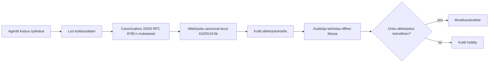
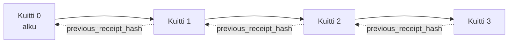

[Katso oppituntivideo: AI-agenttien suojaaminen kryptografisilla kuiteilla](https://youtu.be/PLACEHOLDER_VIDEO_ID)

> _(Oppituntivideo ja pikkukuva lisätään Microsoftin sisältötiimin toimesta yhdistämisen jälkeen, noudattaen oppituntien 14 / 15 kaavaa.)_

# AI-agenttien suojaaminen kryptografisilla kuiteilla

## Johdanto

Tässä oppitunnissa käsitellään:

- Miksi auditointilokit AI-agenteille ovat tärkeitä vaatimustenmukaisuuden, virheenkorjauksen ja luottamuksen kannalta.
- Mikä kryptografinen kuitti on ja miten se eroaa allekirjoittamattomasta lokirivistä.
- Miten tuottaa allekirjoitettu kuitti agentin työkalukutsusta tavallisella Pythonilla.
- Miten tarkistaa kuitti offline-tilassa ja havaita manipulointi.
- Miten ketjuttaa kuitteja siten, että yhden poistaminen tai uudelleenjärjestely rikkoo ketjun.
- Mitä kuitit todistavat ja mitä ne nimenomaisesti eivät todista.

## Oppimistavoitteet

Oppitunnin jälkeen osaat:

- Tunnistaa epäonnistumistilat, jotka motivoivat kryptografisen alkuperän varmistamista agentin toimille.
- Tuottaa Ed25519-allekirjoitettu kuitti kanonisen JSON-payloadin perusteella.
- Varmistaa kuitti itsenäisesti käyttäen vain allekirjoittajan julkista avainta.
- Havaita manipulointi uudelleenvahvistamalla muunneltu kuitti.
- Rakentaa hash-ketjutettu kuittijono ja selittää, miksi ketju on tärkeä.
- Tunnistaa rajapinta sen välillä, mitä kuitit todistavat (attribuutio, eheys, järjestys) ja mitä ne eivät todista (toiminnon oikeellisuus, politiikan pätevyys).

## Ongelmana: Agenttisi auditointiloki

Kuvittele, että olet ottanut käyttöön AI-agentin Contoso Travelille. Agentti lukee asiakaspyyntöjä, kutsuu lentojen APIa vaihtoehtojen etsimiseksi ja varaa istuimia asiakkaan puolesta. Viimeisellä neljänneksellä agentti käsitteli 50 000 varausta.

Tänään saapuu tarkastaja. Hän kysyy yksinkertaisen kysymyksen: "Näytä minulle, mitä agenttisi teki."

Luovutat lokitiedostosi. Tarkastaja katsoo niitä ja esittää vaikeamman kysymyksen: "Mistä tiedän, ettei näitä lokitietoja ole muokattu?"

Tämä on auditointilokiongelma. Suurin osa agenttien käyttöönotosta nykyisin nojaa:

- **Sovelluslokit**: agentin itsensä kirjoittamia, jotka voi muokata kuka tahansa, jolla on tiedostojärjestelmän pääsy.
- **Pilvilogipalvelut**: alustatasolla manipuloinnin havaitsevia, mutta vain jos tarkastaja luottaa alustan operaattoriin.
- **Tietokannan transaktio-lokit**: sopivia tietokantamuutoksille, mutta eivät mielivaltaisille työkalukutsuille.

Yksikään näistä ei voi vastata tarkastajan kysymykseen ilman, että tarkastaja luottaa johonkuhun (sinuun, pilvipalveluntarjoajaan, tietokantatoimittajaan). Sisäiseen käyttöön tämä luottamus on usein hyväksyttävää. Säännellyissä työkuormissa (rahoitus, terveydenhuolto, EU:n AI-lain alaiset) ei ole.

Kryptografiset kuitit ratkaisevat tämän tekemällä jokaisesta agentin toiminnosta itsenäisesti varmennettavan. Tarkastajan ei tarvitse luottaa sinuun. Tarvitaan vain sinun julkinen avain ja kuitti itse.

## Mikä on kryptografinen kuitti?

Kuitti on JSON-objekti, joka tallentaa, mitä agentti teki, allekirjoitettuna digitaalisella allekirjoituksella.


```mermaid
flowchart LR
    A[Agentti kutsuu työkalua] --> B[Luo kuittausdatan]
    B --> C[Canonicalisoi JSON RFC 8785:n mukaisesti]
    C --> E[Allekirjoita canonical-tavut Ed25519:llä]
    E --> F[Kuitti allekirjoituksella]
    F --> G[Auditoija tarkistaa offline-tilassa]
    G --> H{Onko allekirjoitus kelvollinen?}
    H -- yes --> I[Muokkaustodiste]
    H -- no --> J[Kuitti hylätty]
```

Minimikuitti näyttää tältä:

```json
{
  "type": "agent.tool_call.v1",
  "agent_id": "contoso-travel-bot",
  "tool_name": "lookup_flights",
  "tool_args_hash": "sha256:a3f9c1...",
  "result_hash": "sha256:7b2e1d...",
  "policy_id": "contoso-travel-policy-v3",
  "timestamp": "2026-04-25T14:30:00Z",
  "sequence": 47,
  "previous_receipt_hash": "sha256:9d4e6a...",
  "signature": {
    "alg": "EdDSA",
    "sig": "c5af83...",
    "public_key": "8f3b2c..."
  }
}
```

Kolme ominaisuutta tekee työnsä:

1. **Allekirjoitus**. Kuitti allekirjoitetaan agentin väylän toimesta Ed25519-yksityisavaimella. Jokainen, jolla on vastaava julkinen avain, voi varmistaa allekirjoituksen offline-tilassa. Minkä tahansa kentän manipulointi mitätöi allekirjoituksen.

2. **Kanoninen koodaus**. Ennen allekirjoitusta kuitti sarjallistetaan JSON Canonicalization Schemeä (JCS, RFC 8785) käyttäen. Tämä varmistaa, että kaksi toteutusta, jotka tuottavat saman loogisen kuitin, tuottavat myös tavultaan identtisen tuloksen. Ilman kanonisointia eri JSON-sarjallistimet tekisivät erilaiset allekirjoitukset samalle sisällölle.

3. **Hash-ketjutus**. `previous_receipt_hash` -kenttä linkittää jokaiseen kuittiin sitä edeltävän kuitin. Kuitin poistaminen tai uudelleenjärjestely rikkoo kaikki sitä seuraavat kuitit. Manipulointi näkyy koko ketjutasolla, vaikka yksittäiset allekirjoituksetkin kiistettäisiin.

Nämä ominaisuudet yhdessä tarjoavat kolme takeita:

- **Attribuutio**: tämä avain allekirjoitti tämän sisällön.
- **Eheys**: sisältö ei ole muuttunut allekirjoituksen jälkeen.
- **Järjestys**: tämä kuitti tuli ketjussa tuon kuitin jälkeen.

## Kuittien tuottaminen Pythonissa

Kuittia ei tarvitse tuottaa erityisellä kirjastolla. Kryptografiset primitiivit ovat laajalti saatavilla ja logiikka on muutama kymmenen riviä Python-koodia.

Käytännön harjoitukset tiedostossa `code_samples/18-signed-receipts.ipynb` käyvät koko prosessin läpi. Tiivistetty versio:

```python
import json
import hashlib
import base64
from nacl import signing
from jcs import canonicalize  # RFC 8785 kanoninen JSON

def b64url_nopad(data: bytes) -> str:
    return base64.urlsafe_b64encode(data).decode("ascii").rstrip("=")

def sha256_canonical(obj) -> str:
    """SHA-256 of a Python object's JCS-canonical JSON form."""
    return f"sha256:{hashlib.sha256(canonicalize(obj)).hexdigest()}"

# Luo tai lataa allekirjoitusavain (tuotannossa säilytä avainholvissa)
signing_key = signing.SigningKey.generate()
verify_key = signing_key.verify_key

# Rakenna kuitin hyötykuorma (ei vielä allekirjoitusta)
tool_args = {"origin": "SYD", "destination": "LAX"}
tool_result = [{"flight": "QF11", "price": 1850, "stops": 0}]

payload = {
    "type": "agent.tool_call.v1",
    "agent_id": "contoso-travel-bot",
    "tool_name": "lookup_flights",
    "tool_args_hash": sha256_canonical(tool_args),
    "result_hash": sha256_canonical(tool_result),
    "policy_id": "contoso-travel-policy-v3",
    "timestamp": "2026-04-25T14:30:00Z",
    "sequence": 0,
    "previous_receipt_hash": None,
}

# Kanonisoi ja allekirjoita JCS-tavujoukko suoraan. PureEdDSA hajauttaa sisäisesti.
canonical_bytes = canonicalize(payload)
signature_bytes = signing_key.sign(canonical_bytes).signature

# Liitä rakenteellinen allekirjoitusobjekti.
receipt = {
    **payload,
    "signature": {
        "alg": "EdDSA",
        "sig": b64url_nopad(signature_bytes),
        "public_key": b64url_nopad(bytes(verify_key)),
    },
}
```

Tämä on koko allekirjoitusputki. Kirjanmerkin harjoituskohdat käyvät jokaisen vaiheen läpi.

## Kuittien tarkistaminen ja manipuloinnin havaitseminen

Tarkistaminen on käänteinen operaatio:

```python
import base64
import hashlib
from nacl import signing
from nacl.exceptions import BadSignatureError
from jcs import canonicalize

def b64url_decode(s: str) -> bytes:
    padding = "=" * ((4 - len(s) % 4) % 4)
    return base64.urlsafe_b64decode(s + padding)

def verify_receipt(receipt: dict) -> bool:
    # Allekirjoitus on rakenteellinen objekti: {"alg", "sig", "public_key"}.
    sig_obj = receipt.get("signature")
    if not sig_obj or sig_obj.get("alg") != "EdDSA":
        return False

    # Rakenna uudelleen se data, joka oikeastaan allekirjoitettiin (kaikki paitsi allekirjoitus).
    payload = {k: v for k, v in receipt.items() if k != "signature"}

    canonical_bytes = canonicalize(payload)

    try:
        verify_key = signing.VerifyKey(b64url_decode(sig_obj["public_key"]))
        verify_key.verify(canonical_bytes, b64url_decode(sig_obj["sig"]))
        return True
    except BadSignatureError:
        return False
```

Tämä funktio ottaa kuitin ja palauttaa `True`, jos allekirjoitus on validi, `False` muuten. Ei verkkokutsuja, ei palveluriippuvuutta, ei luottamusta kolmansien osapuolten varaan.

Havaitseaksesi manipuloinnin käytännössä, kirjanmerkin harjoitukset käyvät läpi:

1. Tuotetaan kelvollinen kuitti ja varmistetaan sen pätevyys.
2. Muutetaan yhtä tavua `tool_args_hash` -kentästä.
3. Ajetaan tarkistus uudelleen ja nähdään epäonnistuminen.

Tämä on käytännön osoitus, että kuitit ovat manipuloinnin havaitsevia: kaikki muutos, kuinka pieni tahansa, rikkoo allekirjoituksen.

## Kuittien ketjuttaminen monivaiheisille agenteille

Yksi allekirjoitettu kuitti suojaa yhtä toimintoa. Ketju kuittteja suojaa toimintojen sarjaa.


```mermaid
flowchart LR
    R0[Kuitti 0<br/>alku] --> R1[Kuitti 1]
    R1 --> R2[Kuitti 2]
    R2 --> R3[Kuitti 3]
    R1 -. previous_receipt_hash .-> R0
    R2 -. previous_receipt_hash .-> R1
    R3 -. previous_receipt_hash .-> R2
```

Jokainen kuitti tallentaa edeltävän kuitin hashin. Hiljaisen kuitin 2 poistamisen hyökkääjän täytyisi joko:

- Muuttaa kuitti 3:n `previous_receipt_hash`-kenttää (rikkoo kuitti 3:n allekirjoituksen), TAI
- Väärentää uusi allekirjoitus muokatulle kuitti 3:lle (tarvitaan agentin yksityisavain).

Jos yksityisavain on laiteavaimen suojassa ja julkinen avain julkaistaan jokaisen kuitin kanssa, kumpikaan hyökkäys ei ole havaittavissa toteutettavissa.

Harjoitukset käyvät läpi:

1. Kolmen kuitin ketjun rakentamisen.
2. Varmistamisen, että jokaisen kuitin `previous_receipt_hash` vastaa edellisen kuitin todellista hashia.
3. Yhden kuitin manipuloinnin ketjun keskellä ja ketjun murtumisen juuri siinä kohdassa.

Näin tuotat auditointilokin, jonka ulkoinen tarkastaja voi varmentaa luottamatta sinuun.

## Mitä kuitit todistavat (ja mitä eivät todista)

Tämä on tämän oppitunnin tärkein osio. Kuitit ovat voimakkaita, mutta niiden voima on rajattu.

**Kuitit todistavat kolme asiaa:**

1. **Attribuutio**: tietty avain allekirjoitti tietyn payloadin.
2. **Eheys**: payload ei ole muuttunut allekirjoituksen jälkeen.
3. **Järjestys**: tämä kuitti tuli tämän kuitin jälkeen hash-ketjussa.

**Kuitit eivät todista:**

1. **Oikeellisuus**: että agentin toiminto oli oikea. Kuitti voidaan allekirjoittaa väärälle vastaukselle yhtä helposti kuin oikealle.
2. **Politiikan noudattaminen**: että `policy_id`:ssä viitattu politiikkaa arvioitiin oikeasti tai että se olisi sallinut toiminnon, jos olisi tarkastettu. Kuitti tallentaa väitteen, ei toteutusta.
3. **Identiteetti avaimen lisäksi**: kuitti sanoo "tämä avain allekirjoitti tämän sisällön." Se ei sano "tämä ihminen valtuutti tämän." Avain yhdistetään henkilöön tai organisaatioon erillisellä identiteetti-infrastruktuurilla (hakemisto, julkisen avaimen rekisteri jne.).
4. **Syötteiden totuudenmukaisuus**: jos agentille annetaan manipulointia sisältävä kehotus ja agentti toimii sen mukaan, kuitti tallentaa toiminnon uskollisesti. Kuitit ovat syötteen validoinnin jälkeisiä, eivät sen korvikkeita.

Tämä raja on tärkeä kahdesta syystä:

- Se kertoo, mihin kuitteja kannattaa käyttää: agentin käyttäytymisen auditointiin ja manipuloinnin havaitsemiseen myös organisaatiorajojen yli.
- Se kertoo, mitä muita kerroksia tarvitaan: syötteen validointi (Oppitunti 6), politiikan valvonta (lyhyesti alla), ja identiteetti-infrastruktuuri (tämän oppitunnin ulkopuolella).

Yleinen virhe on olettaa, että "meillä on kuittaus" tarkoittaa "olemme säädeltyjä." Se ei tarkoita. Kuitit ovat perusta. Sääntely on järjestelmä, jonka rakentaa perustan päälle.

## Todistamassa, että ihminen hyväksyi tarkan toiminnon

Kohta 3 yllä ansaitsee oman osionsa: toimintakuitti sanoo "tämä avain allekirjoitti tämän sisällön," ei koskaan "ihminen valtuutti tämän." Korkean riskin toiminnoissa (hyvitykset, poistot, tilisiirrot) sääntelykehykset vaativat yhä enemmän juuri tätä puuttuvaa lausetta, ja se voidaan tuottaa samoilla primitiiveillä, jotka olet jo rakentanut tässä oppitunnissa.

Seurantakansiossa `code_samples/human-authorization-receipts.ipynb` lisätään toinen kuittilaji, `human.approval.v1`, samassa kuorimuodossa kuin tämän oppitunnin kuitit (tyyppimerkattu payload, joka on allekirjoitettu Ed25519:llä kanonisista JCS-tavuista, ja `signature`-objekti allekirjoitettujen tavujen ulkopuolella). Nimetty hyväksyjä allekirjoittaa **kokonaisen kanonisen toiminnon ja sen tiivisteen** ennen suoritusta; agentin toimintakuitti sisältää **saman toimintatiivisteen** ja `parent_approval_ref`in, hyväksynnän `receipt_hash`in, saman konvention kuin `previous_receipt_hash` ketjussa, jonka rakensit yllä. Yksi `verify_chain` tarkistaa molemmat artefaktit **eri lukittujen avainrekisterien** avulla (hyväksyjien avaimet vs agentin avaimet), joten koodipolkua jaetaan, mutta valtiaita ei.

Tämä ominaisuus ilmaistuna tarkasti: *ihminen hyväksyi juuri tämän toiminnon, ja agentti suoritti täsmälleen sen hyväksytyn toiminnon.* Kirjanmerkin torjuntamekanismit tekevät siitä aidon, eivät vain väitteen:

- klassinen tuotteisto: manipulointi, erehtynyt apulainen, uudelleentoisto, allekirjoitusten väärentäminen kummallakin puolella, vääränlainen syöte;
- **vanhentunut valtuutus**: allekirjoitus, joka vielä tarkistuu, mutta hylätään, koska politiikkaversio muuttui, hyväksyjän avain poistettiin rekisteristä tai hyväksyntä vanhentui ennen suoritusta;
- **tiivisteen vaihto**: validisti allekirjoitettu toimintakuitti, joka osoittaa *todelliseen* hyväksyntään, joka sitoo *erilaiseen* kanoniseen toimintoon.

Kukin epäonnistuminen hylkää selkeällä syyllä, joten tarkastaja voi kuittien kielen lukea, tuliko valtuutus vanhentuneeksi vai muutettiinko suoritettua toimintoa. Kirjanmerkin oppi: allekirjoitettu hyväksyntä ei ole itsessään valtuutus. Valtuus on olemassa vain, jos molemmat kuitit sitoutuvat samaan kanoniseen toimintaan suorituksen hetkellä. Ihmisen hyväksymä kuitti on tämän oppitunnin määrittelemä opetuskoostumus, ei `draft-farley-acta-signed-receipts`-dokumentin käsite.

## Tuotantoviitteet

Python-koodi tässä oppitunnissa on tarkoituksella minimaalinen, jotta voit lukea jokaisen rivin ja ymmärtää tarkalleen, mitä tapahtuu. Tuotannossa sinulla on kaksi vaihtoehtoa:

1. **Rakenna suoraan kryptografisten primitiivien päälle.** Yllä näkemäsi 50 riviä riittää moniin käyttötarkoituksiin. PyNaCl (Ed25519) ja `jcs`-paketti (kanoninen JSON) ovat hyvin ylläpidettyjä ja auditoituja kirjastoja.

2. **Käytä tuotantokuittikirjastoa.** Useita avoimen lähdekoodin projekteja toteuttaa saman mallin lisäominaisuuksilla (avaimen kierto, erävarmennus, JWK-setin jakelu, integraatio politiikan moottoreihin):
   - Allekirjoitusputki käyttää JCS- ja signature-scope-konventioita itsenäisessä IETF Internet-Draftissa ([`draft-farley-acta-signed-receipts`](https://datatracker.ietf.org/doc/draft-farley-acta-signed-receipts/), revisio 02). Tämän oppitunnin litteä opetuskuitti eroaa draftin `{payload, signature}`-kuorista eikä ole conformantti toteutus. Draft julkaisee yhteisen conformancesarjan ([agent-governance-testvectors](https://github.com/ScopeBlind/agent-governance-testvectors)) toteutuksille, jotka kohdistuvat sen langan muotoon.
   - Microsoft Agent Governance Toolkit yhdistää kuitit Cedar-pohjaisiin politiikkapäätöksiin; katso Tutorial 33 tästä reposta kokonaisvaltaiseksi esimerkkiksi.
   - `protect-mcp` (npm) ja `@veritasacta/verify` (npm) paketit tarjoavat Node-pohjaisen toteutuksen kuittien allekirjoitukseen ja offline-varmennukseen, tarkoitettu minkä tahansa MCP-palvelimen ympärille tamper-evident auditointilokiksi, sisältäen pidetyn allekirjoitusvirran jossa keskeytetty toiminto lähettää hyväksyntäkuitin toiminnon tiivisteeseen sidottuna (WebAuthn-tukea työpöytävirrassa), sama hyväksyntäkuittimalli kuin ihmisen valtuutus-kirjanmerkin yllä.
   - **[nobulex](https://github.com/arian-gogani/nobulex)** Python SDK (`pip install nobulex`) tarjoaa saman Ed25519 + JCS allekirjoitusmallin Pythonissa LangChain- ja CrewAI-integraatioilla, mukaan lukien julkistetut ristiinvalidoinnin testivektorit ja vaatimustenmukaisuuskartoituksen, joka on lahjoitettu [OWASP PR #2210](https://github.com/OWASP/CheatSheetSeries/pull/2210).

Päätös oman toteutuksen ja kirjaston käytön välillä muistuttaa päätöstä JWT-kirjaston kirjoittamisesta itse tai testatun käytöstä: molemmat ovat järkeviä; kirjasto säästää aikaa ja vähentää auditointipintaa; alusta alkaen rakennettu polku pakottaa ymmärtämään jokaisen primitiivin. Tämä oppitunti opettaa alusta asti, jotta sinulla on perusta molemmille valinnoille.

## Tietotarkistus

Testaa ymmärryksesi ennen siirtymistä harjoituksiin.

**1. Kuitti allekirjoitetaan agentin yksityisellä Ed25519-avaimella. Tarkastajalla on vain julkinen avain. Voiko tarkastaja varmistaa kuitin offline-tilassa?**

<details>
<summary>Vastaus</summary>

Kyllä. Ed25519-varmennus vaatii vain julkisen avaimen ja allekirjoitetut tavut. Ei verkkokutsuja, ei palveluriippuvuutta. Tämä ominaisuus tekee kuiteista hyödyllisiä suljetuissa, moniorganisaatioisissa tai vähäluottamuksellisissa tarkastusympäristöissä.
</details>

**2. Hyökkääjä muuttaa kuitin `policy_id`-kenttää väittääkseen että sitä hallinnoi sallivampi politiikka. Allekirjoitus oli alkuperäisestä payloadista. Mitä tapahtuu tarkistuksen aikana?**

<details>
<summary>Vastaus</summary>


Vahvistus epäonnistuu. Allekirjoitus laskettiin alkuperäisen hyötykuorman kanonisista tavuista; minkä tahansa kentän muuttaminen muuttaa näitä tavuja, mikä tekee allekirjoituksesta kelvottoman. Hyökkääjän täytyisi omistaa yksityinen avain tuottaakseen uuden kelvollisen allekirjoituksen, mitä heillä ei ole.
</details>

**3. Miksi kuitti sisältää `tool_args_hash` ja `result_hash` eikä raakaa argumentteja ja tulosta?**

<details>
<summary>Vastaus</summary>

Kaksi syytä. Ensinnäkin, kuitti on ehkä arkistoitava tai siirrettävä ympäristöissä, joissa raakadatan (HETU, liiketoimintadata) vuotaminen on ongelma. Tiivisteiden käyttö pitää kuitin pienenä ja sisällön yksityisenä; auditoija vahvistaa, että tiiviste vastaa erikseen tallennettua sisältöä. Toiseksi, tiivisteillä on kiinteä koko; kuitissa olevien tiivisteiden kokoraja ei muutu riippumatta syötteiden ja tulosten koosta.
</details>

**4. Kenttä `previous_receipt_hash` linkittää jokaisen kuitin sitä edeltävään. Jos hyökkääjä poistaa hiljaa yhden kuitin ketjun keskeltä, mikä muuttuu virheelliseksi?**

<details>
<summary>Vastaus</summary>

Kaikki kuitit, jotka tulivat poistettua kuittia myöhemmin. Niiden kentät `previous_receipt_hash` eivät enää vastaa ketjua (koska kuitti, johon ne viittasivat, on poistettu tai ketju viittaa nyt eri edeltäjään). Peittääkseen poiston hyökkääjän täytyisi allekirjoittaa kaikki myöhemmät kuitit uudelleen, mikä vaatii yksityisen avaimen.
</details>

**5. Kuitti vahvistuu puhtaasti. Todistaako se, että agentin toiminta oli oikea, järkevä tai sääntöjen mukainen?**

<details>
<summary>Vastaus</summary>

Ei. Kelvollinen kuitti todistaa kolme asiaa: attribuution (tällä avaimella allekirjoitettiin tämä sisältö), eheys (sisältöä ei ole muutettu) ja järjestyksen (tämä kuitti tuli tuon kuitin jälkeen). Se EI todista, että toiminta oli oikea, että `policy_id`:ssä nimettyä sääntöä arvioitiin tai että agentti noudatti kaikkia sääntöjä. Kuitit tekevät agentin toiminnan auditoitavaksi, eivät välttämättä oikeaksi. Tämä on opetuksen tärkein raja.
</details>

## Harjoitustehtävä

Avaa `code_samples/18-signed-receipts.ipynb` ja suorita kaikki neljä osaa:

1. **Osa 1**: Allekirjoita ensimmäinen kuittisi ja vahvista se.
2. **Osa 2**: Muokkaa kuittia ja tarkkaile vahvistuksen epäonnistumista.
3. **Osa 3**: Rakenna kolmen kuitin ketju ja vahvista ketjun eheys.
4. **Osa 4**: Käytä kuviota agentissa, joka on rakennettu Microsoft Agent Frameworkilla: kääri työkalukutsu kuitin allekirjoitukseen ja vahvista sitten kuitti erikseen.

**Haaste 1:** laajenna kuittikaavaa omalla lisäkentällä (esim. jäljitettävyyden pyyntötunnus), päivitä kanonisen allekirjoituslogiikka sisällyttämään se, ja varmista, että kuitti käy läpi vahvistuksen. Muokkaa sitten kenttää allekirjoituksen jälkeen ja varmista, että vahvistus epäonnistuu. Tämä pakottaa sinut ymmärtämään, kuinka jokainen tavua kanonisessa koodauksessa vaikuttaa allekirjoitukseen.

**Haaste 2:** tee kahdesta kuitistasi SHA-256-tiiviste yhteen (liittäen kanoniset tavut deterministisesti) ja upota tulos kolmannen kuitin uudeksi kentäksi ennen allekirjoitusta. Vahvista, että kaikki kolme kuittia käyvät edelleen läpi vahvistuksen. Olet juuri rakentanut yhden askeleen sisällytysprotokollan: kuka tahansa, jolla on kolmas kuitti, voi todistaa ensimmäisten kahden olemassaolon allekirjoitushetkellä paljastamatta sisältöä. Tätä kaavaa valikoivat kuittaukset käyttävät suuressa mittakaavassa (Merkle-sitoumukset, RFC 6962).

## Yhteenveto

Kryptografiset kuitit antavat tekoälyagenteille auditointijäljen, joka on:

- **Riippumattomasti vahvistettavissa**: kuka tahansa julkisen avaimen haltija voi tarkistaa, ei palvelusidonnaisuuksia.
- **Muokkaussuojattu**: muutokset mitätöivät allekirjoituksen.
- **Siirrettävä**: kuitti on pieni JSON-tiedosto; sitä voi arkistoida, siirtää ja vahvistaa missä tahansa.
- **Standardien mukainen**: perustuu Ed25519:een (RFC 8032), JCS:ään (RFC 8785) ja SHA-256:een, kaikki laajasti käytettyjä primitiivejä.

Ne eivät korvaa syötteiden validointia, sääntöjen noudattamista tai identiteettijärjestelmiä. Ne ovat näiden kerrosten perustana. Kun otat agentteja käyttöön säännellyissä kuormissa, moniorganisaatiotyönkuluissa tai missä tahansa, jossa tuleva tarkastaja ei voi luottaa sinuun, kuitit tekevät auditointijäljestä rehellisen.

Tärkein oppi: kuitit todistavat, kuka sanoi mitä ja milloin. Ne eivät todista sanotun olevan totta tai oikeaa. Pidä tämä ero tarkasti mielessä. Se erottaa rehellisen alkuperäisyysjärjestelmän harhaanjohtavasta.

## Tuotantotarkistuslista

Kun olet valmis siirtymään tässä oppitunnissa kuittien allekirjoittamisen agentteihin tuotantoympäristössä:

- [ ] **Siirrä allekirjoitusavain pois kehittäjän kannettavasta.** Käytä Azure Key Vaultia, AWS KMS:ää tai laitteistoturvamoduulia. Yksityisen avaimen, joka allekirjoittaa kuitit, ei koskaan tule säilyä koodivarastossa tai selväkielisenä sovelluslaitteissa.
- [ ] **Julkaise vahvistuksen julkinen avain.** Tarkastajat tarvitsevat sen offline-vahvistukseen. Vakio on JWK-joukko tunnetussa URL-osoitteessa (RFC 7517), esim. `https://your-org.example.com/.well-known/agent-keys.json`.
- [ ] **Ankkuroi ketju ulkoisesti.** Kirjoita säännöllisesti ketjun uusimman pään tiiviste läpinäkyvyyshaulla (Sigstore Rekor, RFC 3161 -aikaleimatodistus tai toinen sisäinen järjestelmä), jotta ulkopuolinen osapuoli voi todistaa "tämän ketjun olleen olemassa tätä hetkeä."
- [ ] **Tallenna kuitit muuttumattomasti.** Liittämällä vain blob-varasto (Azure Storage immuuttisuuskäytännöillä, AWS S3 Object Lock) estää sisäistä väärentämistä tallennustasolla.
- [ ] **Päätä säilytysaika.** Monet sääntelyvaatimukset edellyttävät monivuotista säilytystä. Varaudu kuitujen kasvuun (jokainen kuitti on ~500 tavua; agentti, joka tekee 10 000 kutsua päivässä, tuottaa ~1,8 GB vuodessa).
- [ ] **Dokumentoi mitä kuitit eivät kata.** Kuitit todistavat attribuution, eheyden ja järjestyksen. Ajokirjallasi tulee eritellä, mitä muita kontrollitoimia (syötteiden validointi, sääntöjen noudattaminen, nopeuden rajoittaminen, identiteettijärjestelmä) käytetään hallintakokonaisuudessa.

### Lisää kysyttyä tekoälyagenttien suojaamisesta?

Liity [Microsoft Foundry Discordiin](https://aka.ms/ai-agents/discord) tavata muiden oppijoiden kanssa, osallistua toimistoaikoihin ja saada vastauksia AI-agenttikysymyksiisi.

## Tämän oppitunnin jälkeen

Tämä oppitunti kattaa yksittäisen kuitin allekirjoituksen ja tiivisteketjut. Samat primitiivit muodostavat useita edistyneempiä kuvioita, joita kohtaat, kun hallintasi kypsyy:

- **Valikoiva paljastus.** Kun kuitin kentät ovat itsenäisesti sitoutuneet (RFC 6962 -tyylinen Merkle-puu), voit paljastaa tietyt kentät tietyille tarkastajille ja todistaa, että muut eivät ole muuttuneet ilman, että paljastat niitä. Hyödyllistä, kun sama kuitti täytyy tyydyttää sekä kattava auditointi (haluaa täydellisyyden) että tietosuoja-asetukset kuten GDPR (haluavat, että tarkastaja näkee vain tarpeellisen).
- **Kuitin peruutus.** Jos allekirjoitusavain vaarantuu, tarvitset tavan merkitä kaikki kyseisellä avaimella allekirjoitetut kuitit epäluotettaviksi tietystä ajankohdasta eteenpäin. Vakiokuvat: lyhytikäiset allekirjoitusavaimet ja julkaistu peruutuslista, tai läpinäkyvyysloki peruutustiedoilla.
- **Kahdensuuntainen/jakautunut allekirjoitus.** Joissakin toteutuksissa allekirjoitettu hyötykuorma on jaettu suoritusajan edeltäviin (`authorization_*`) ja jälkeisiin (`result_*`) osiin itsenäisillä allekirjoituksilla, hyödyllistä, kun valtuutuspäätös ja havaittu tulos tulevat eri toimijoilta tai eri aikoina. Tämä lisätty kuvio pohjautuu tämän oppitunnin kuittimuotoon.
- **Hyötykuorman koostaminen.** Kuitti sulkee mitä tahansa tavujasi `result_hash`-kentässä. Todelliset hyötykuormat ovat usein monipuolisempia kuin yksittäinen työkalukutsun tulos: päätöksen esipohdinta (mallin ennuste, harkitut vaihtoehdot, todisteet ja niiden täydellisyys, riskit, vastuuketju, portin lopputulos) voivat kaikki olla hyötykuorma sisällä, yhden kuitin allekirjoittamana. Tämä pitää kuitin muodon minimalistisena, samalla kun hyötykuvaukset voivat kehittyä toimialakohtaisesti.
- **Toteutusten välinen yhteensopivuus.** Useat itsenäiset toteutukset samasta kuittimuodosta (Python, TypeScript, Rust, Go) tarkistavat toisiaan jaettujen testivektoreiden avulla. Jos rakennat oman toteutuksen, validoimalla julkaistuja vektoreita vastaan varmistat virran yhteensopivuuden.
- **Jälkikvanttimuutos.** Ed25519 on laajalti käytössä nykyään, mutta ei ole kvanttivakaa. Kuittimuoto on algoritmista joustava: kenttä `signature.alg` voi kantaa arvon `ML-DSA-65` (NISTin jälkikvanttiallekirjoitusstandardin), kun tarvitset siirtymistä. Varaudu siirtymäkauteen, jolloin kuitteja allekirjoitetaan kaksin kappalein.

## Lisäresurssit

- <a href="https://datatracker.ietf.org/doc/draft-farley-acta-signed-receipts/" target="_blank">IETF:n Internet-Draft: Machine-to-Machine -pääsynvalvonnan allekirjoitetut päätöskuitit</a>
- <a href="https://learn.microsoft.com/azure/ai-studio/responsible-use-of-ai-overview" target="_blank">Responsible AI yleiskatsaus (Azure AI)</a>
- <a href="https://datatracker.ietf.org/doc/html/rfc8032" target="_blank">RFC 8032: Edwards-käyrän digitaalinen allekirjoitusalgo (EdDSA)</a>
- <a href="https://datatracker.ietf.org/doc/html/rfc8785" target="_blank">RFC 8785: JSON- kanonisointijärjestelmä (JCS)</a>
- <a href="https://datatracker.ietf.org/doc/html/rfc6962" target="_blank">RFC 6962: Sertifikaattien läpinäkyvyys</a> (Merkle-puun rakenne, jota valikoivat kuittaukset käyttävät)
- <a href="https://github.com/microsoft/agent-governance-toolkit/blob/main/docs/tutorials/33-offline-verifiable-receipts.md" target="_blank">Microsoft Agent Governance Toolkit, Opastus 33: Offline-vahvistettavat päätöskuitit</a>
- <a href="https://github.com/ScopeBlind/agent-governance-testvectors" target="_blank">Toteutusten välinen yhteensopivuustestaus kuittimuodolle tässä oppitunnissa (Apache-2.0)</a>
- <a href="https://pynacl.readthedocs.io/" target="_blank">PyNaCl-dokumentaatio</a> (Ed25519 Pythonissa)

## Edellinen oppitunti

[Paikallisten tekoälyagenttien luominen](../17-creating-local-ai-agents/README.md)

---

<!-- CO-OP TRANSLATOR DISCLAIMER START -->
**Vastuuvapauslauseke**:
Tämä asiakirja on käännetty käyttämällä tekoälypohjaista käännöspalvelua [Co-op Translator](https://github.com/Azure/co-op-translator). Vaikka pyrimme tarkkuuteen, otathan huomioon, että automaattiset käännökset saattavat sisältää virheitä tai epätarkkuuksia. Alkuperäinen asiakirja sen alkuperäiskielellä on virallinen lähde. Tärkeissä asioissa suositellaan ammattimaista ihmiskäännöstä. Emme ole vastuussa tämän käännöksen käytöstä aiheutuvista väärinymmärryksistä tai tulkinnoista.
<!-- CO-OP TRANSLATOR DISCLAIMER END -->