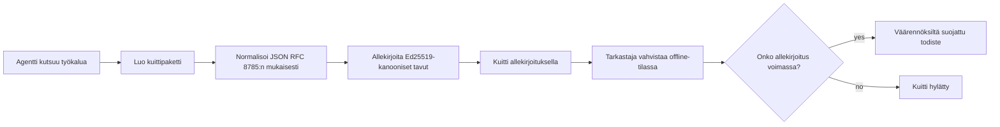
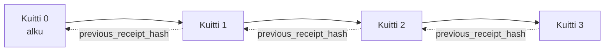

[Katso oppituntivideo: Tekoälyagenttien suojaaminen kryptografisilla kuiteilla](https://youtu.be/PLACEHOLDER_VIDEO_ID)

> _(Oppituntivideo ja pikkukuva lisätään Microsoftin sisältötiimin toimesta yhdistämisen jälkeen, vastaamaan oppituntien 14 / 15 kaavaa.)_

# Tekoälyagenttien suojaaminen kryptografisilla kuiteilla

## Johdanto

Tässä oppitunnissa käsitellään:

- Miksi tekoälyagenttien tarkastuslokeilla on merkitystä vaatimustenmukaisuuden, virheenkorjauksen ja luottamuksen kannalta.
- Mitä kryptografinen kuitti on ja miten se eroaa allekirjoittamattomasta lokirivistä.
- Kuinka tuottaa allekirjoitettu kuitti agentin työkalukutsusta tavallisella Pythonilla.
- Kuinka varmistaa kuitti offline-tilassa ja havaita manipulointi.
- Kuinka ketjuttaa kuitteja siten, että yhden poistaminen tai uudelleenjärjestäminen katkaisee ketjun.
- Mitä kuitit todistavat ja mitä ne nimenomaisesti eivät todista.

## Oppimistavoitteet

Tämän oppitunnin suorittamisen jälkeen osaat:

- Tunnistaa epäonnistumistavat, jotka motivoivat kryptografisen alkuperän varmistamista agenttitoimille.
- Tuottaa Ed25519-allekirjoitetun kuitin kanonisesta JSON-payloadista.
- Varmistaa kuitin itsenäisesti käyttäen vain allekirjoittajan julkista avainta.
- Havaita manipulointi ajamalla varmennus uudelleen muokatulle kuitille.
- Rakentaa hash-ketjutettu kuittijono ja selittää, miksi ketju on tärkeä.
- Tunnistaa raja, jonka sisällä kuitit todistavat (attribuutio, eheys, järjestys) ja sen ulkopuolella (toiminnon oikeellisuus, säännöstön pätevyys).

## Ongelma: Agenttisi tarkastusloki

Kuvittele, että olet ottanut käyttöön tekoälyagentin Contoso Travelille. Agentti lukee asiakaspyyntöjä, kutsuu lentotietopalvelun APIa etsiäkseen vaihtoehtoja ja varaa paikkoja asiakkaan puolesta. Viime neljänneksellä agentti käsitteli 50 000 varausta.

Tänään tarkastaja saapuu. Hän esittää yksinkertaisen kysymyksen: "Näytä, mitä agenttisi teki."

Luovutat lokitiedostot. Tarkastaja katsoo niitä ja esittää vaikeamman kysymyksen: "Mistä tiedän, etteivät nämä lokit ole muokattuja?"

Tämä on tarkastusloki-ongelma. Useimmat agenttien käyttöönotot nykyään luottavat:

- **Sovelluksen lokit**: agentin itse kirjoittamat, muokattavissa kenellä tahansa, jolla on tiedostojärjestelmän pääsy.
- **Pilviloki-palvelut**: manipulointia osoittavia alustan tasolla, mutta vain jos tarkastaja luottaa alustan ylläpitäjään.
- **Tietokantatapahtumalokit**: soveltuvat hyvin tietokantamuutosten kirjaamiseen, mutta eivät satunnaisiin työkalukutsuihin.

Mikään näistä ei voi vastata tarkastajan kysymykseen ilman, että tarkastaja luottaa johonkuhun (sinä, pilvipalveluntarjoajasi, tietokantamyyjäsi). Sisäisessä käytössä tämä luottamus on usein hyväksyttävää. Säännellyissä työkuormissa (rahoitus, terveydenhuolto, mikä tahansa EU:n tekoälyasetuksen alainen) se ei ole.

Kryptografiset kuitit ratkaisevat tämän tekemällä jokaisesta agentin toimenpiteestä itsenäisesti varmennettavan. Tarkastajan ei tarvitse luottaa sinuun. Tarvitaan vain julkinen avain ja kuitti.

## Mikä on kryptografinen kuitti?

Kuitti on JSON-objekti, joka tallentaa, mitä agentti teki, allekirjoitettuna digitaalisesti.


```mermaid
flowchart LR
    A[Agentti kutsuu työkalua] --> B[Luo kuittipaketti]
    B --> C[Normalisoi JSON RFC 8785:n mukaisesti]
    C --> E[Allekirjoita Ed25519-kanooniset tavut]
    E --> F[Kuitti allekirjoituksella]
    F --> G[Tarkastaja vahvistaa offline-tilassa]
    G --> H{Onko allekirjoitus voimassa?}
    H -- yes --> I[Väärennöksiltä suojattu todiste]
    H -- no --> J[Kuitti hylätty]
```

Minimikuitti näyttää tältä:

```json
{
  "type": "agent.tool_call.v1",
  "agent_id": "contoso-travel-bot",
  "tool_name": "lookup_flights",
  "tool_args_hash": "sha256:a3f9c1...",
  "result_hash": "sha256:7b2e1d...",
  "policy_id": "contoso-travel-policy-v3",
  "timestamp": "2026-04-25T14:30:00Z",
  "sequence": 47,
  "previous_receipt_hash": "sha256:9d4e6a...",
  "signature": {
    "alg": "EdDSA",
    "sig": "c5af83...",
    "public_key": "8f3b2c..."
  }
}
```

Kolme ominaisuutta tekee työn:

1. **Allekirjoitus**. Kuitti on allekirjoitettu agentin portin toimesta Ed25519-yksityisavaimella. Jokainen vastaavan julkisen avaimen omaava voi varmistaa allekirjoituksen offline-tilassa. Kentän manipulointi kumoaa allekirjoituksen.

2. **Kanoninen koodaus**. Ennen allekirjoitusta kuitti serialisoidaan JSON Canonicalization Scheme (JCS, RFC 8785) -standardin mukaisesti. Tämä varmistaa, että kaksi toteutusta, jotka tuottavat loogisesti saman kuitin, tuottavat myös identtisen tavujonon. Ilman kanonisointia eri JSON-serialisointiohjelmat tuottaisivat erilaisia allekirjoituksia samalle sisällölle.

3. **Hash-ketjutus**. `previous_receipt_hash` -kenttä linkittää jokaisen kuitin sitä edeltävään. Yhden kuitin poistaminen tai uudelleenjärjestäminen katkaisee kaikki sitä seuraavat kuitit. Manipulointi näkyy ketjutason tarkastuksessa, vaikka yksittäiset allekirjoitukset ohitettaisiin.

Nämä ominaisuudet yhdessä tarjoavat kolme takuuta:

- **Attribuutio**: tämä avain allekirjoitti tämän sisällön.
- **Eheys**: sisältö ei ole muuttunut allekirjoituksen jälkeen.
- **Järjestys**: tämä kuitti tuli sen kuitin jälkeen ketjussa.

## Kuittien tuottaminen Pythonissa

Kuittia ei tarvitse tuottaa erikoiskirjastolla. Kryptografiset perustoiminnot ovat laajalti saatavilla, ja logiikka on muutama kymmenen riviä Pythonia.

Käytännön harjoitukset tiedostossa `code_samples/18-signed-receipts.ipynb` käyvät läpi koko prosessin. Tiivistelmä:

```python
import json
import hashlib
import base64
from nacl import signing
from jcs import canonicalize  # RFC 8785 kanoninen JSON

def b64url_nopad(data: bytes) -> str:
    return base64.urlsafe_b64encode(data).decode("ascii").rstrip("=")

def sha256_canonical(obj) -> str:
    """SHA-256 of a Python object's JCS-canonical JSON form."""
    return f"sha256:{hashlib.sha256(canonicalize(obj)).hexdigest()}"

# Luo tai lataa allekirjoitusavain (tuotannossa tallenna avainholviin)
signing_key = signing.SigningKey.generate()
verify_key = signing_key.verify_key

# Rakenna kuittausaineisto (ei vielä allekirjoitusta)
tool_args = {"origin": "SYD", "destination": "LAX"}
tool_result = [{"flight": "QF11", "price": 1850, "stops": 0}]

payload = {
    "type": "agent.tool_call.v1",
    "agent_id": "contoso-travel-bot",
    "tool_name": "lookup_flights",
    "tool_args_hash": sha256_canonical(tool_args),
    "result_hash": sha256_canonical(tool_result),
    "policy_id": "contoso-travel-policy-v3",
    "timestamp": "2026-04-25T14:30:00Z",
    "sequence": 0,
    "previous_receipt_hash": None,
}

# Kanonisoi ja allekirjoita JCS-tavuerä suoraan. PureEdDSA hajauttaa sisäisesti.
canonical_bytes = canonicalize(payload)
signature_bytes = signing_key.sign(canonical_bytes).signature

# Liitä rakenteellinen allekirjoitusobjekti.
receipt = {
    **payload,
    "signature": {
        "alg": "EdDSA",
        "sig": b64url_nopad(signature_bytes),
        "public_key": b64url_nopad(bytes(verify_key)),
    },
}
```

Tämä on koko allekirjoitusketju. Harjoituksissa käydään läpi jokainen vaihe.

## Kuittien varmennus ja manipuloinnin havaitseminen

Varmennus on käänteistoiminto:

```python
import base64
import hashlib
from nacl import signing
from nacl.exceptions import BadSignatureError
from jcs import canonicalize

def b64url_decode(s: str) -> bytes:
    padding = "=" * ((4 - len(s) % 4) % 4)
    return base64.urlsafe_b64decode(s + padding)

def verify_receipt(receipt: dict) -> bool:
    # Allekirjoitus on jäsennelty objekti: {"alg", "sig", "public_key"}.
    sig_obj = receipt.get("signature")
    if not sig_obj or sig_obj.get("alg") != "EdDSA":
        return False

    # Rakenna uudelleen ladattu tieto, joka allekirjoitettiin (kaikki paitsi allekirjoitus).
    payload = {k: v for k, v in receipt.items() if k != "signature"}

    canonical_bytes = canonicalize(payload)

    try:
        verify_key = signing.VerifyKey(b64url_decode(sig_obj["public_key"]))
        verify_key.verify(canonical_bytes, b64url_decode(sig_obj["sig"]))
        return True
    except BadSignatureError:
        return False
```

Tämä funktio ottaa kuitin ja palauttaa `True` jos allekirjoitus on voimassa, muuten `False`. Ei verkkokutsua, ei palveluriippuvuutta, ei luottamusta kolmansiin osapuoliin.

Havaitsemanäytteen mukaan harjoituksissa käydään läpi:

1. Voimassa olevan kuitin tuottaminen ja varmennuksen onnistumisen varmistaminen.
2. Yhden tavun muuttaminen `tool_args_hash` -kentässä.
3. Varmistuksen uudelleenkäynnistys ja epäonnistuminen.

Tämä osoittaa käytännössä, että kuitit ovat manipulointia osoittavia: mikä tahansa muutos, kuinka pieni tahansa, rikkoo allekirjoituksen.

## Kuittien ketjuttaminen monivaiheisille agenteille

Yksi allekirjoitettu kuitti suojaa yhtä toimintoa. Kuittiketju suojaa toimintojonon.


```mermaid
flowchart LR
    R0[Kuitti 0<br/>alku] --> R1[Kuitti 1]
    R1 --> R2[Kuitti 2]
    R2 --> R3[Kuitti 3]
    R1 -. previous_receipt_hash .-> R0
    R2 -. previous_receipt_hash .-> R1
    R3 -. previous_receipt_hash .-> R2
```

Jokainen kuitti tallentaa sitä edeltävän kuitin hashin. Jos hyökkääjä haluaisi poistaa kuitin 2 huomaamatta, hänen pitäisi joko:

- Muuttaa kuitin 3 `previous_receipt_hash` -kenttää (rikkoo kuitin 3 allekirjoituksen), TAI
- Väärennellä uusi allekirjoitus muokatulle kuitille 3 (vaatii agentin yksityisavaimen).

Jos yksityisavain on turvallisessa laiterahastossa ja julkinen avain julkaistaan jokaisen kuitin mukana, kumpikaan hyökkäys ei ole mahdollinen ilman havaitsemista.

Harjoitustiedosto käy läpi:

1. Kolmen kuitin ketjun rakentamisen.
2. Varmistamisen, että kunkin kuitin `previous_receipt_hash` vastaa edellisen kuitin todellista hashia.
3. Yhden kuitin manipuloinnin keskellä ja ketjun rikkoutumisen juuri siinä kohdassa.

Näin tuotat tarkastusloki, jonka ulkoinen tarkastaja voi varmentaa ilman, että hänen tarvitsee luottaa sinuun.

## Mitä kuitit todistavat (ja mitä ne eivät)

Tämä on oppitunnin tärkein osio. Kuitit ovat tehokkaita mutta niiden voima on rajattu.

**Kuitit todistavat kolme asiaa:**

1. **Attribuutio**: tietty avain allekirjoitti tietyn payloadin.
2. **Eheys**: payload ei ole muuttunut allekirjoituksen jälkeen.
3. **Järjestys**: tämä kuitti tuli sen kuitin jälkeen hash-ketjussa.

**Kuitit eivät todista:**

1. **Oikeellisuutta**: että agentin toiminto oli oikea. Kuitti voidaan allekirjoittaa yhtä hyvin väärälle kuin oikealle vastaukselle.
2. **Säännöstön noudattamista**: että `policy_id`-kentässä viitattu säännöstö olisi arvioitu tai että se olisi sallinut toiminnon. Kuitti tallentaa, mitä väitettiin, ei mitä toteutettiin.
3. **Identiteettiä avaimen ulkopuolella**: kuitti sanoo "tämä avain allekirjoitti tämän sisällön", ei "tämä henkilö valtuutti tämän". Avain ja henkilö tai organisaatio täytyy yhdistää erillisellä identiteettijärjestelmällä (hakemisto, julkisen avaimen rekisteri jne.).
4. **Syötteiden totuudenmukaisuutta**: jos agentti saa manipuloidun promptin ja toimii sen perusteella, kuitti tallentaa toiminnon uskollisesti. Kuitit ovat syötteiden validoinnin jälkeisiä, eivät korvauksia sille.

Tämä raja on tärkeä kahdesta syystä:

- Se kertoo, mihin kuitit soveltuvat: agentin toiminnan tekemiseen tarkastettavaksi ja manipulointia osoittavaksi, myös organisaatiorajojen yli.
- Se kertoo, mitä muita kerroksia tarvitaan: syötteiden validointi (oppitunti 6), säännöstön valvonta (lyhyesti alla), ja identiteettijärjestelmät (ei tämän oppitunnin aihe).

Tavallinen virhe on olettaa, että "meillä on kuitit" tarkoittaa "meitä valvotaan". Ei tarkoita. Kuitit ovat perusta. Valvontajärjestelmä on sen päälle rakennettava kokonaisuus.

## Todistetaan, että ihminen hyväksyi tarkalleen tietyn toiminnon

Kohta 3 on oman osionsa arvoinen: toimintakuitti sanoo "tämä avain allekirjoitti tämän sisällön", ei koskaan "tämä ihminen valtuutti tämän". Korkean riskin toimille (hyvitykset, poistot, tilisiirrot) hallintakehykset vaativat yhä useammin juuri tämän puuttuvan lausunnon, ja se on tuotettavissa samoilla perustoiminnoilla, jotka opit tässä oppitunnissa.

Jatkotyöstävä muistio `code_samples/human-authorization-receipts.ipynb` lisää toisen kuittilajin, `human.approval.v1`, oppitunnin kuittien kanssa samaan kuoreen (tyypitetty payload allekirjoitettuna Ed25519:llä kanonisista JCS-tavuista, `signature`-objekti allekirjoitettujen tavujen ulkopuolella). Nimetty hyväksyjä allekirjoittaa **koko kanonisen toiminnon ja sen tiivisteen** ennen suorittamista; agentin toimintakuitti kantaa **saman toimen tiivisteen** ja `parent_approval_ref` -kentän, hyväksynnän `receipt_hash`:n, samalla kaavalla kuin `previous_receipt_hash` ketjussa yllä. Yksi `verify_chain` vahvistaa molemmat artefaktit **eri kiinnitettyjen avainrekistereiden** avulla (hyväksyjän avaimet vs agentin avaimet), joten koodipolku on yhteinen mutta toimivaltuudet eivät koskaan.

Täsmällisesti ilmaistuna tämä takaa: *ihminen hyväksyi juuri tämän toiminnon, ja agentti suoritti täsmälleen sen hyväksytyn toiminnon.* Muistion kieltäytymiesimerkit tekevät ominaisuudesta todellisen eikä vain väitteen:

- klassinen joukko: manipulointi, sekaisin oleva apulainen, toisto, väärennetyt avaimet kummallakin puolella, viallinen syöte;
- **vanhentunut toimivalta**: allekirjoitus, joka edelleen varmistuu, mutta hylätään, koska säännöstön versio muuttui, hyväksyjän avain poistettiin kiinnitetyistä rekistereistä tai hyväksyntä vanheni ennen suoritusta;
- **tiivisteen vaihto**: voimassa oleva allekirjoitettu toimintakuitti, joka osoittaa *aito* hyväksyntäpäätökseen, joka sitoo *eri* kanonisen toiminnon.

Kukin virhe hylätään eri syystä, joten tarkastaja voi silmäillä hylkäyksen syyn erottelevasti: toimivalta meni vanhaksi vai toiminto muuttui. Oppikirjan sääntö: allekirjoitettu hyväksyntä ei yksin ole toimivalta. Toimivalta on olemassa vain, jos molemmat kuitit sitovat samaa kanonista toimintoa suoritusaikana. Ihmisen hyväksyntäkuitti on tämän oppitunnin opetuskoostumus, ei kuittityyppi `draft-farley-acta-signed-receipts` -määrittelystä.

## Tuotantoviitteet

Python-koodi tässä oppitunnissa on tarkoituksella minimaalista, jotta voit lukea jokaisen rivin ja ymmärtää tarkalleen, mitä tapahtuu. Tuotantoa varten sinulla on kaksi vaihtoehtoa:

1. **Rakenna suoraan kryptografisille perustoiminnoille.** Yli 50 riviä yllä riittää moneen käyttötapaukseen. PyNaCl (Ed25519) ja `jcs`-paketti (kanoninen JSON) ovat hyvin ylläpidettyjä ja auditoituja kirjastoja.

2. **Käytä tuotantokuittikirjastoa.** Useat avoimen lähdekoodin projektit toteuttavat saman kaavan lisäominaisuuksilla (avainten kierto, erävarmennus, JWK nippujen jakelu, integrointi sääntömootoreihin):
   - Allekirjoitusketju noudattaa JCS- ja allekirjoitusalueen käytäntöjä itsenäisessä IETF Internet-Luonnoksessa ([`draft-farley-acta-signed-receipts`](https://datatracker.ietf.org/doc/draft-farley-acta-signed-receipts/), versio 02). Tämän oppitunnin yksinkertaisempi opetuskuitti eroaa luonnoksen `{payload, signature}` -kuoresta eikä ole esitetty virallisena toteutuksena. Luonnos julkaisee yhteisen vaatimustenmukaisuussarjan ([agent-governance-testvectors](https://github.com/ScopeBlind/agent-governance-testvectors)) toteutuksille, jotka kohdistuvat sen lankamuotoon.
   - Microsoft Agent Governance Toolkit yhdistää kuitit Cedar-pohjaisiin sääntöpäätöksiin; katso opas 33 tästä repositoriosta loppuun asti ulottuvalle esimerkkikäytölle.
   - `protect-mcp` (npm) ja `@veritasacta/verify` (npm) paketit tarjoavat Node-pohjaisen toteutuksen kuitujen allekirjoittamiseen ja offline-varaamiseen, tarkoitettuna minkä tahansa MCP-palvelimen suojaamiseen manipulointia osoittavalla tarkastuslokilla, mukaan lukien hallittu yhteisallekirjoitusvirta, jossa pysäytetty toiminto tuottaa hyväksyntäkuittin sidottuna toiminnon tiivisteeseen (WebAuthn-tuettu työpöytävirrassa), sama hyväksyntäkuittimalli kuin edellä ihmisen valtuutuksen muistiossa.
   - **[nobulex](https://github.com/arian-gogani/nobulex)** Python SDK (`pip install nobulex`) tarjoaa saman Ed25519 + JCS allekirjoituskaavan Pythonissa LangChain- ja CrewAI-integraatioilla, mukaan lukien julkaistut ristivarmennustestivektorit ja vaatimustenmukaisuuskartta, joka on kontribuoitu [OWASP PR #2210](https://github.com/OWASP/CheatSheetSeries/pull/2210).

Päätös tehdä itse tai käyttää kirjastoa muistuttaa valinnasta kirjoittaa oma JWT-kirjasto tai käyttää testattua: molemmat ovat järkeviä; kirjasto säästää aikaa ja vähentää auditointipinta-alaa; omatekoisena oppii jokaisen perustoiminnon. Tämä oppitunti opettaa omatekoisen polun, jotta sinulla on perusta molempiin vaihtoehtoihin.

## Ymmärrystesti

Testaa ymmärrystäsi ennen käytännön harjoitusta.

**1. Kuitti on allekirjoitettu agentin yksityisellä Ed25519-avaimella. Tarkastajalla on vain julkinen avain. Voiko tarkastaja varmistaa kuitin offline-tilassa?**

<details>
<summary>Vastaus</summary>

Kyllä. Ed25519-varmennukseen tarvitaan vain julkinen avain ja allekirjoitetut tavut. Ei verkkokutsuja, ei palveluriippuvuuksia. Tämä ominaisuus tekee kuiteista käyttökelpoisia ilmatiehdyttyissä, moniorganisaatioisissa tai vähäluottamuksellisissa tarkastusympäristöissä.
</details>

**2. Hyökkääjä muuttaa kuitin `policy_id` -kenttää väittääkseen, että sitä hallitsi sallivampi sääntö. Allekirjoitus kuitenkin kattoi alkuperäisen payloadin. Mitä tapahtuu varmennuksessa?**

<details>
<summary>Vastaus</summary>


Varmistus epäonnistuu. Allekirjoitus laskettiin alkuperäisen hyötykuorman kanonisista tavuista; kentän muuttaminen muuttaa näitä tavujabol, mikä tekee allekirjoituksesta virheellisen. Hyökkääjällä pitäisi olla yksityinen avain tuottaakseen uuden voimassa olevan allekirjoituksen, jota heillä ei ole.
</details>

**3. Miksi kuitti sisältää `tool_args_hash`- ja `result_hash`-kentät raakojen argumenttien ja tuloksen sijasta?**

<details>
<summary>Vastaus</summary>

Kaksi syytä. Ensinnäkin kuitti voidaan joutua arkistoimaan tai siirtämään ympäristöissä, joissa raakan sisällön (henkilökohtaiset tiedot, liiketoimintatiedot) vuotaminen on ongelma. Hashaus pitää kuitin pienenä ja sisällön yksityisenä; tarkastaja varmistaa, että hash vastaa erikseen tallennettua kopioita todellisesta sisällöstä. Toiseksi hasheilla on kiinteä koko; kuitti, jossa on hasheja, on kooksi rajoitettu riippumatta syötteiden ja tulosten koosta.
</details>

**4. `previous_receipt_hash`-kenttä linkittää jokaisen kuitin edeltäjäänsä. Jos hyökkääjä salaa poistaa yhden kuitin ketjun keskeltä, mikä muuttuu virheelliseksi?**

<details>
<summary>Vastaus</summary>

Jokainen kuitti, joka tuli poistetun jälkeen. Niiden `previous_receipt_hash`-kentät eivät enää vastaa todellista ketjua (koska viitattu kuitti ei enää ole olemassa tai ketju osoittaa eri edeltäjään). Poiston piilottamiseksi hyökkääjän pitäisi allekirjoittaa uudelleen jokainen myöhempi kuitti, mikä vaatii yksityisen avaimen.
</details>

**5. Kuitti tarkastetaan onnistuneesti. Todistaako se, että agentin toiminta oli oikea, järkevä tai sääntöjen mukainen?**

<details>
<summary>Vastaus</summary>

Ei. Voimassa oleva kuitti todistaa kolme asiaa: attribuution (tämä avain allekirjoitti tämän sisällön), eheyden (sisältöä ei ole muutettu) ja järjestyksen (tämä kuitti tuli tämän kuitin jälkeen). Se EI todista, että toiminta oli oikea, että `policy_id`-kentässä nimettyä sääntöä arvioitiin tai että agentti noudatti kaikkia sääntöjä. Kuitit tekevät agentin toiminnasta auditoitavaa, eivät välttämättä oikeaa. Tämä on oppitunnin tärkein raja.
</details>

## Harjoitustehtävä

Avaa `code_samples/18-signed-receipts.ipynb` ja suorita kaikki neljä osaa:

1. **Osa 1**: Allekirjoita ensimmäinen kuitin ja varmista se.
2. **Osa 2**: Muokkaa kuittia ja tarkkaile varmennuksen epäonnistumista.
3. **Osa 3**: Rakenna kolmen kuitin ketju ja varmista ketjun eheys.
4. **Osa 4**: Käytä mallia Microsoft Agent Frameworkilla rakennetulle agentille: kääri työkalukutsu kuittien allekirjoittamiseen, tarkista sitten kuitti itsenäisesti.

**Lisähaaste 1:** laajenna kuittitietomallia omalla lisäkentälläsi (esim. pyyntö-ID jäljitykseen), päivitä kanoninen allekirjoituslogiikka sisällyttämään se ja varmista että kuitti käy läpi varmennuksen. Muokkaa sitten kenttää allekirjoituksen jälkeen ja varmista varmennuksen epäonnistuminen. Tämä pakottaa ymmärtämään, miten jokainen tavujono kanonisessa koodauksessa vaikuttaa allekirjoitukseen.

**Lisähaaste 2:** Tee SHA-256-tiiviste kahdesta kuitistasi (liitä niiden kanoniset tavut määrätietoisesti) ja upota tuloksena oleva tiiviste kolmannen kuitin uuteen kenttään ennen sen allekirjoittamista. Varmista, että kaikki kolme kuittia käyvät läpi varmennuksen. Olet juuri rakentanut yhden askeleen sisältötodistuksen: kuka tahansa, joka omistaa kolmannen kuitin, voi todistaa, että kaksi ensimmäistä oli olemassa allekirjoitushetkellä paljastamatta niiden sisältöä. Tätä mallia käyttää suurissa mittakaavoissa valikoiva paljastus (Merkle-sitoumukset, RFC 6962).

## Yhteenveto

Kryptografiset kuitit antavat tekoälyagenteille auditointiketjun, joka on:

- **Itsenäisesti varmennettavissa**: kuka tahansa julkisen avaimen haltija voi varmistaa, ei palveluriippuvuutta.
- **Muokkauspaljastava**: mikä tahansa muutos mitätöi allekirjoituksen.
- **Kannettava**: kuitti on pieni JSON-tiedosto; se voidaan arkistoida, siirtää ja varmistaa missä tahansa.
- **Standardien mukainen**: rakennettu Ed25519:n (RFC 8032), JCS:n (RFC 8785) ja SHA-256:n varaan, kaikki laajasti käytettyjä primitives.

Ne eivät korvaa syötevalidointia, sääntöjen noudattamista tai identiteettirakenteita. Ne ovat näiden tasojen perusta. Kun otat agentteja käyttöön säädellyissä työkuormissa, moni-organisaatiotyönkuluissa tai missä tahansa tilanteessa, jossa tuleva tarkastaja ei voi luottaa suoraan sinuun, kuitit ovat keino tehdä auditointiketjusta rehellinen.

Tärkein opetus: kuitit todistavat kuka sanoi mitä ja milloin. Ne eivät todista, että sanottu oli totta tai oikein. Pidä tämä ero tarkasti mielessä. Se on rehellisen alkuperäisjärjestelmän ja harhaanjohtavan ero.

## Tuotantovalmiusmuistilista

Kun olet valmis siirtymään tästä oppitunnista käyttöön tuotantoon allekirjoitetuilla kuiteilla varustettujen agenttien kanssa:

- [ ] **Siirrä allekirjoitusavain pois kehittäjän kannettavalta.** Käytä Azure Key Vaultia, AWS KMS:ää tai laitteistoturvamoduulia. Yksityinen avain, jolla allekirjoitat kuitit, ei saa koskaan olla lähdekoodissa tai selväkielisenä sovelluslaitteilla.
- [ ] **Julkaise varmennuksen julkinen avain.** Tarkastajat tarvitsevat sen varmennukseen offline-tilassa. Vakio käytäntö on JWK Set tunnetussa URL-osoitteessa (RFC 7517), esim. `https://your-org.example.com/.well-known/agent-keys.json`.
- [ ] **Kytke ketju ulkoiseen ankkuriin.** Kirjoita säännöllisesti ketjun viimeisimmän pään tiiviste läpinäkyvyyden lokiin (Sigstore Rekor, RFC 3161 aikaleimausviranomainen tai toinen sisäinen järjestelmä), jotta ulkopuolinen osapuoli voi vahvistaa "tämä ketju oli olemassa tähän aikaan."
- [ ] **Tallenna kuitit muuttumattomasti.** Lisää vain -blobsäilytys (Azure Storage immutability-politiikoilla, AWS S3 Object Lock) estää sisäpiiriläistä kirjoittamasta historian uudelleen tallennustasolla.
- [ ] **Päätä säilytysajasta.** Monet vaatimustenmukaisuusjärjestelmät edellyttävät monivuotista säilytystä. Suunnittele kuitin kasvua (jokainen kuitti on ~500 tavua; agentti, joka tekee 10 000 kutsua päivässä, tuottaa ~1,8 GB vuodessa).
- [ ] **Dokumentoi, mitä kuittaukset eivät kata.** Kuitit todistavat attribuution, eheyden ja järjestyksen. Suoritusohjeesi tulisi selkeästi luetella mitkä lisävahvistukset (syötevalidointi, sääntöjen valvonta, rajoitus, identiteettirakenne) toimivat yhdessä kuittien kanssa hallintamallissasi.

### Lisää kysymyksiä tekoälyagenttien suojaamisesta?

Liity [Microsoft Foundry Discordiin](https://aka.ms/ai-agents/discord) tavata muiden oppijoiden kanssa, osallistu toimistoaikoihin ja saa vastauksia tekoälyagentteja koskeviin kysymyksiisi.

## Oppitunnin jälkeen

Tämä oppitunti käsittelee yksittäisen kuitin allekirjoitusta ja hash-ketjutettuja sarjoja. Samat primitiivit kootaan useiksi edistyneemmiksi malleiksi, joita saatat kohdata, kun hallintamallisi kehittyy:

- **Valikoiva paljastus.** Kun kuitin kentät ovat itsenäisesti sitoutuneita (RFC 6962 -tyylinen Merkle-puu), voit paljastaa tiettyjä kenttiä tietyille tarkastajille ja todistaa, että muut eivät ole muuttuneet paljastamatta niitä. Käytännöllinen, kun sama kuitti täytyy palvella sekä kattavaa tarkastusta (joka haluaa täydellisyyden) että tietojen minimointilainsäädäntöä kuten GDPR:ää (joka haluaa tarkastajan näkevän mahdollisimman vähän).
- **Kuitin peruuttaminen.** Jos allekirjoitusavain on vaarantunut, tarvitset tavan merkitä kaikki sillä allekirjoitetut kuitit epäluotettaviksi tietystä ajankohdasta eteenpäin. Vakio käytännöt: lyhytaikaiset allekirjoitusavaimet ja julkaistu peruutuslista, tai läpinäkyvyyslokijärjestelmä peruutustiedoilla.
- **Kahdenvälinen / jaettu allekirjoituskuitti.** Jotkin toteutukset jakavat allekirjoitetun hyötykuorman ennen suoritusta (`authorization_*`) ja sen jälkeen (`result_*`) puoliksi riippumattomilla allekirjoituksilla, hyödyllistä, kun valtuutuspäätöksen ja havaitun tuloksen tekevät eri toimijat tai eri aikoina. Tämä kerrostuu additiivisesti tämän oppitunnin kuitiformaatin päälle.
- **Hyötykuorman koostaminen.** Kuitti tiivistää mitä tahansa, mitä laitat `result_hash`-kenttään. Käytännön hyötykuormat ovat usein rikkaampia kuin yhden työkalukutsun tulos: päätöstä edeltävä päättely (mallin ennuste, harkitut vaihtoehdot, todistusaineisto ja sen täydellisyys, riskin tila, vastuuketju, portin päätös) voi kaikki olla hyötykuormassa, suljettuna yhden kuitin alle. Tämä pitää kuittiformaatin minimissä ja antaa hyötykuvamalleille tilaa kehittyä toimialakohtaisesti.
- **Ristiintoteutusmukavuus.** Useat riippumattomat toteutukset samasta kuitiformaatista (Python, TypeScript, Rust, Go) varmistavat toistensa toteutusta ja yhteensopivuutta julkisten testivektoreiden avulla. Jos rakennat oman toteutuksesi, julkaisuihin testivektoreihin verrattu validointi varmistaa yhteensopivuuden.
- **Jälki-kvanttimurros.** Ed25519 on laajasti käytössä nyt, mutta ei ole kvanttiturvallinen. Kuittiformaatti on algoritmista ketterä: kenttä `signature.alg` voi sisältää `ML-DSA-65` (NISTin jälki-kvanttiallekirjoitusstandardi) kun on aika siirtyä. Suunnittele siirtymäkausi, jolloin kuitit ovat kaksinkertaisesti allekirjoitettuja.

## Lisäresurssit

- <a href="https://datatracker.ietf.org/doc/draft-farley-acta-signed-receipts/" target="_blank">IETF Internet-Draft: Allekirjoitetut päätöskuittaukset koneiden väliseen pääsynvalvontaan</a>
- <a href="https://learn.microsoft.com/azure/ai-studio/responsible-use-of-ai-overview" target="_blank">Vastuullisen tekoälyn yleiskatsaus (Azure AI)</a>
- <a href="https://datatracker.ietf.org/doc/html/rfc8032" target="_blank">RFC 8032: Edwards-käyrä digitaaliallekirjoitusalgoritmi (EdDSA)</a>
- <a href="https://datatracker.ietf.org/doc/html/rfc8785" target="_blank">RFC 8785: JSON-kanonisointijärjestelmä (JCS)</a>
- <a href="https://datatracker.ietf.org/doc/html/rfc6962" target="_blank">RFC 6962: Sertifikaattien läpinäkyvyys</a> (Merkle-puurakenteen käyttö valikoivassa paljastuskuittauksessa)
- <a href="https://github.com/microsoft/agent-governance-toolkit/blob/main/docs/tutorials/33-offline-verifiable-receipts.md" target="_blank">Microsoft Agent Governance Toolkit, Opas 33: Offline-varmennettavat päätöskuittaukset</a>
- <a href="https://github.com/ScopeBlind/agent-governance-testvectors" target="_blank">Ristiintoteutusmukavuustestivektorit</a> tämän oppitunnin kuittiformaatille (Apache-2.0)
- <a href="https://pynacl.readthedocs.io/" target="_blank">PyNaCl-dokumentaatio</a> (Ed25519 Pythonissa)

## Edellinen oppitunti

[Paikallisten tekoälyagenttien luominen](../17-creating-local-ai-agents/README.md)

---

<!-- CO-OP TRANSLATOR DISCLAIMER START -->
**Vastuuvapauslauseke**:
Tämä asiakirja on käännetty käyttämällä tekoälypohjaista käännöspalvelua [Co-op Translator](https://github.com/Azure/co-op-translator). Vaikka pyrimme tarkkuuteen, otathan huomioon, että automaattiset käännökset saattavat sisältää virheitä tai epätarkkuuksia. Alkuperäinen asiakirja sen alkuperäiskielellä on virallinen lähde. Tärkeissä asioissa suositellaan ammattimaista ihmiskäännöstä. Emme ole vastuussa tämän käännöksen käytöstä aiheutuvista väärinymmärryksistä tai tulkinnoista.
<!-- CO-OP TRANSLATOR DISCLAIMER END -->