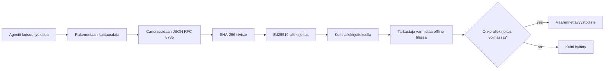
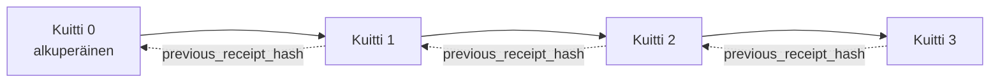

[Katsokaa oppituntivideo: AI-agenttien suojaaminen kryptografisilla kuiteilla](https://youtu.be/PLACEHOLDER_VIDEO_ID)

> _(Oppituntivideo ja pikkukuva lisätään Microsoftin sisältötiimin toimesta yhdistämisen jälkeen, noudattaen oppituntien 14 / 15 kaavaa.)_

# AI-agenttien suojaaminen kryptografisilla kuiteilla

## Johdanto

Tässä oppitunnissa käsitellään:

- Miksi AI-agenttien auditointihistoria on tärkeä vaatimustenmukaisuuden, virheenkorjauksen ja luottamuksen kannalta.
- Mitä kryptografinen kuitti on ja miten se eroaa allekirjoittamattomasta lokirivistä.
- Kuinka tuottaa allekirjoitettu kuitti agentin työkalukutsusta tavallisella Pythonilla.
- Kuinka vahvistaa kuitti offline-tilassa ja havaita manipulointi.
- Kuinka ketjuttaa kuitteja niin, että yhden poistaminen tai uudelleenjärjestäminen rikkoo ketjun.
- Mitä kuitit todistavat ja mitä ne nimenomaisesti eivät todista.

## Oppimistavoitteet

Oppitunnin suorittamisen jälkeen osaat:

- Tunnistaa ne virhetilanteet, jotka motivoivat kryptografisen alkuperän todistamista agentin toimille.
- Tuottaa Ed25519-allekirjoitetun kuitin kanonisesta JSON-payloadista.
- Vahvistaa kuitin itsenäisesti käyttäen ainoastaan allekirjoittajan julkista avainta.
- Havaita manipulointia ajamalla vahvistus uudelleen muokatulla kuitilla.
- Rakentaa hash-ketjutetun kuitteja sisältävän sarjan ja selittää, miksi ketju on tärkeä.
- Tunnistaa raja, mikä kuitit todistavat (attribuutio, eheys, järjestys) ja mitä ne eivät (toiminnon oikeellisuus, politiikan oikeellisuus).

## Ongelma: Agenttisi auditointiloki

Kuvittele, että olet ottanut käyttöön AI-agentin Contoso Travelille. Agentti lukee asiakaspalvelupyyntöjä, kutsuu lentojen API:a vaihtoehtojen hakemiseksi ja varaa asiakkaille istumapaikat. Viime neljänneksellä agentti käsitteli 50 000 varausta.

Tänään tarkastaja saapuu. Hän kysyy yksinkertaisen kysymyksen: "Näytä, mitä agenttisi teki."

Luovutat lokitiedostosi. Tarkastaja tutkii ne ja esittää vaikeamman kysymyksen: "Miten voin olla varma, että näitä lokitietoja ei ole muokattu?"

Tämä on auditointihistorian ongelma. Suurin osa agenttien käyttöönotosta tänään luottaa:

- **Sovelluslokit**: agentin itsensä kirjoittamat, ketä tahansa tiedostojärjestelmään pääsevää voi muokata.
- **Pilvilokituspalvelut**: alustatasolla manipulointivarmoja, mutta vain jos tarkastaja luottaa alustatoimittajaan.
- **Tietokantatransaktioraportit**: sopivat tietokantamuutoksille, eivät satunnaisille työkalukutsuille.

Mikään näistä ei voi vastata tarkastajan kysymykseen ilman, että tarkastaja luottaa johonkin (sinuun, pilvipalveluntarjoajaasi, tietokantatoimittajaan). Sisäisessä käytössä luottamus on usein hyväksyttävää. Säädellyissä työkuormissa (rahoitus, terveydenhuolto, EU:n tekoälyasetus) ei ole.

Kryptografiset kuitit ratkaisevat tämän tekemällä jokaisesta agentin toiminnosta itsenäisesti vahvistettavan. Tarkastajan ei tarvitse luottaa sinuun – tarvitsee vain julkisen avaimesi ja kuitin itsessään.

## Mikä on kryptografinen kuitti?

Kuitti on JSON-objekti, joka tallentaa, mitä agentti teki, allekirjoitettuna digitaalisella allekirjoituksella.


```mermaid
flowchart LR
    A[Agentti kutsuu työkalua] --> B[Rakennetaan kuittausdata]
    B --> C[Canonisoidaan JSON RFC 8785]
    C --> D[SHA-256 tiiviste]
    D --> E[Ed25519 allekirjoitus]
    E --> F[Kuitti allekirjoituksella]
    F --> G[Tarkastaja varmistaa offline-tilassa]
    G --> H{Onko allekirjoitus voimassa?}
    H -- yes --> I[Väärennettävyystodiste]
    H -- no --> J[Kuitti hylätty]
```

Minimaalinen kuitti näyttää tältä:

```json
{
  "type": "agent.tool_call.v1",
  "agent_id": "contoso-travel-bot",
  "tool_name": "lookup_flights",
  "tool_args_hash": "sha256:a3f9c1...",
  "result_hash": "sha256:7b2e1d...",
  "policy_id": "contoso-travel-policy-v3",
  "timestamp": "2026-04-25T14:30:00Z",
  "sequence": 47,
  "previous_receipt_hash": "sha256:9d4e6a...",
  "signature": {
    "alg": "EdDSA",
    "sig": "c5af83...",
    "public_key": "8f3b2c..."
  }
}
```

Kolme ominaisuutta tekevät työn:

1. **Allekirjoitus**. Kuitti allekirjoitetaan agentin portin toimesta Ed25519-yksityisavaimella. Jokainen, jolla on vastaava julkinen avain, voi varmistaa allekirjoituksen offline-tilassa. Minkä tahansa kentän manipulointi mitätöi allekirjoituksen.

2. **Kanonalinen koodaus**. Ennen allekirjoitusta kuitti serialisoidaan JSON Canonicalization Scheme (JCS, RFC 8785) mukaisesti. Tämä varmistaa, että kaksi toteutusta, jotka tuottavat saman loogisen kuitin, tuottavat tavultaat täsmälleen samat tulokset. Ilman kanonikalisoimista eri JSON-serialisoijat tuottaisivat eri allekirjoituksia samasta sisällöstä.

3. **Hash-ketjutus**. `previous_receipt_hash`-kenttä linkittää jokaisen kuitin edelliseen. Yhden kuitin poistaminen tai uudelleenjärjestäminen rikkoo kaikki sitä seuraavat kuitit. Manipulointi näkyy ketjun tasolla, vaikka yksittäiset allekirjoitukset ohitettaisiin.

Yhdessä nämä ominaisuudet takaavat kolme asiaa:

- **Attribuutio**: tämä avain allekirjoitti tämän sisällön.
- **Eheys**: sisältö ei ole muuttunut allekirjoituksen jälkeen.
- **Järjestys**: tämä kuitti tuli ketjussa sen kuitin jälkeen.

## Kuittien tuottaminen Pythonilla

Voit tuottaa kuitin ilman erityistä kirjastoa. Kryptografiset alkutoiminnot ovat laajalti saatavilla ja logiikka on muutaman kymmenen Python-rivin mittainen.

`code_samples/18-signed-receipts.ipynb` -käsikirjassa käydään läpi koko prosessi. Tiivistelmänä:

```python
import json
import hashlib
import base64
from nacl import signing
from jcs import canonicalize  # RFC 8785 kanoninen JSON

def b64url_nopad(data: bytes) -> str:
    return base64.urlsafe_b64encode(data).decode("ascii").rstrip("=")

def sha256_canonical(obj) -> str:
    """SHA-256 of a Python object's JCS-canonical JSON form."""
    return f"sha256:{hashlib.sha256(canonicalize(obj)).hexdigest()}"

# Luo tai lataa allekirjoitusavain (tuotannossa säilytä avainholvissa)
signing_key = signing.SigningKey.generate()
verify_key = signing_key.verify_key

# Rakenna kuittauksen sisältö (ei allekirjoitusta vielä)
tool_args = {"origin": "SYD", "destination": "LAX"}
tool_result = [{"flight": "QF11", "price": 1850, "stops": 0}]

payload = {
    "type": "agent.tool_call.v1",
    "agent_id": "contoso-travel-bot",
    "tool_name": "lookup_flights",
    "tool_args_hash": sha256_canonical(tool_args),
    "result_hash": sha256_canonical(tool_result),
    "policy_id": "contoso-travel-policy-v3",
    "timestamp": "2026-04-25T14:30:00Z",
    "sequence": 0,
    "previous_receipt_hash": None,
}

# Tee kanonisointi, hajautus, allekirjoitus.
canonical_bytes = canonicalize(payload)
message_hash = hashlib.sha256(canonical_bytes).digest()
signature_bytes = signing_key.sign(message_hash).signature

# Liitä rakenteellinen allekirjoitusobjekti.
receipt = {
    **payload,
    "signature": {
        "alg": "EdDSA",
        "sig": b64url_nopad(signature_bytes),
        "public_key": b64url_nopad(bytes(verify_key)),
    },
}
```

Tuossa on koko allekirjoitusputki. Käsikirjassa käydään jokainen vaihe läpi.

## Kuittien vahvistaminen ja manipuloinnin havaitseminen

Vahvistus on käänteinen operaatio:

```python
import base64
import hashlib
from nacl import signing
from nacl.exceptions import BadSignatureError
from jcs import canonicalize

def b64url_decode(s: str) -> bytes:
    padding = "=" * ((4 - len(s) % 4) % 4)
    return base64.urlsafe_b64decode(s + padding)

def verify_receipt(receipt: dict) -> bool:
    # Allekirjoitus on jäsennelty objekti: {"alg", "sig", "public_key"}.
    sig_obj = receipt.get("signature")
    if not sig_obj or sig_obj.get("alg") != "EdDSA":
        return False

    # Rakenna uudelleen se hyötykuorma, joka allekirjoitettiin (kaikki paitsi allekirjoitus).
    payload = {k: v for k, v in receipt.items() if k != "signature"}

    canonical_bytes = canonicalize(payload)
    message_hash = hashlib.sha256(canonical_bytes).digest()

    try:
        verify_key = signing.VerifyKey(b64url_decode(sig_obj["public_key"]))
        verify_key.verify(message_hash, b64url_decode(sig_obj["sig"]))
        return True
    except BadSignatureError:
        return False
```

Tämä funktio ottaa kuitin ja palauttaa `True`, jos allekirjoitus on voimassa, ja `False` muuten. Ei verkkokutsua, ei palveluriskiä, ei kolmannen osapuolen luottamusta.

Manipuloinnin havaitsemisen näkemiseksi käsikirja käy läpi:

1. Voimassa olevan kuitin tuottamisen ja sen vahvistamisen.
2. Yhden tavun muokkaamisen `tool_args_hash`-kentässä.
3. Vahvistuksen uudelleenajon ja epäonnistumisen.

Tämä on käytännön demonstraatio siitä, että kuitit ovat manipulointivarmoja: mikä tahansa muutos rikkoo allekirjoituksen.

## Kuittien ketjutus monivaiheisille agenteille

Yksi allekirjoitettu kuitti suojaa yhtä toimintoa. Ketju suojaa toimintojen sarjaa.


```mermaid
flowchart LR
    R0[Kuitti 0<br/>alkuperäinen] --> R1[Kuitti 1]
    R1 --> R2[Kuitti 2]
    R2 --> R3[Kuitti 3]
    R1 -. previous_receipt_hash .-> R0
    R2 -. previous_receipt_hash .-> R1
    R3 -. previous_receipt_hash .-> R2
```

Jokainen kuitti tallentaa edellisen kuitin hashin. Jos hyökkääjä haluaa poistaa kuitti 2 hiljaisesti:

- Muutettava kuitin 3 `previous_receipt_hash`-kenttää (rikkoutuu kuitin 3 allekirjoitus), TAI
- Väärennettävä uusi allekirjoitus muokatulle kuitille 3 (vaatii agentin yksityisavaimen).

Jos yksityisavain on laiteavainten varastoissa ja julkaiset julkisen avaimen jokaisen kuitin mukana, kumpikaan hyökkäys ei ole mahdollinen ilman havaitsemista.

Käsikirjassa käydään läpi:

1. Kolmen kuitin ketjun rakentaminen.
2. Kunkin kuitin `previous_receipt_hash` -kentän vastaavuuden vahvistaminen edellisen kuitin todellisen hashin kanssa.
3. Yhden kuitin manipulointi ketjun keskellä ja ketjun katkeaminen juuri siinä kohtaa.

Näin tuotat auditointihistorian, jonka ulkopuolinen tarkastaja voi vahvistaa ilman luottamusta sinuun.

## Mitä kuitit todistavat (ja mitä eivät)

Tämä on tämän oppitunnin tärkein osio. Kuitit ovat tehokkaita, mutta niiden voima on rajallinen.

**Kuitit todistavat kolme asiaa:**

1. **Attribuutio**: tietty avain allekirjoitti tietyn datan.
2. **Eheys**: data ei ole muuttunut allekirjoituksen jälkeen.
3. **Järjestys**: tämä kuitti tuli ketjussa jälkeenpäin sitä kuittia.

**Kuitit EIVÄT todista:**

1. **Oikeellisuutta**: ettei agentin toiminta ollut oikea. Kuitti voidaan allekirjoittaa yhtä hyvin väärästä kuin oikeastakin vastauksesta.
2. **Politiikan noudattamista**: ettei `policy_id`-kentässä mainittu politiikkaa olisi itse asiassa arvioitu tai että se olisi sallinut kyseisen toiminnon. Kuitti tallentaa väitetyn, ei sovelletun.
3. **Identiteettiä avaimen ulkopuolella**: kuitti kertoo "tämä avain allekirjoitti tämän", muttei "tämä ihminen valtuutti tämän". Avain ja henkilö/organisaatio vaativat erillisen identiteettijärjestelmän (hakemisto, julkisten avainten rekisteri jne.).
4. **Syötteiden totuudenmukaisuutta**: jos agentille annetaan manipuloitu pyyntö ja se toimii sen pohjalta, kuitti tallentaa teon totuudenmukaisesti. Kuitit ovat syötetarkistuksen jälkeen, eivät korvike sille.

Tämä raja on tärkeä kahdesta syystä:

- Se kertoo, mihin kuitteja voi käyttää: tekemään agentin toiminnasta todennettavaa ja manipulointivastaista, myös organisaatiorajojen yli.
- Se kertoo, mitä muita kerroksia tarvitset: syötteiden validointi (Oppitunti 6), politiikkojen täytäntöönpano (lyhyesti käsitelty alla) ja identiteettijärjestelmät (ei tämän oppitunnin aihe).

Yleinen virhe on olettaa, että "meillä on kuitit" tarkoittaa "meitä ohjataan säännöin." Ei tarkoita. Kuitit ovat perusta. Hallinto on järjestelmä, jonka niiden päälle rakennat.

## Tuotantoviitteet

Tämän oppitunnin Python-koodi on tarkoituksella minimalistista, jotta jokainen rivi on ymmärrettävissä. Tuotannossa sinulla on kaksi vaihtoehtoa:

1. **Rakenna suoraan kryptografisille alkutoiminnoille.** Yllä näkemäsi noin 50 riviä riittää moniin käyttötarkoituksiin. PyNaCl (Ed25519) ja `jcs`-paketti (kanoninen JSON) ovat hyvin ylläpidettyjä ja tarkastettuja kirjastoja.

2. **Käytä tuotantotason kuittikirjastoa.** Useat avoimen lähdekoodin projektit toteuttavat saman mallin lisäominaisuuksilla (avainten kierto, erävahvistus, JWK Set -jakelu, integrointi politiikkamoottoreihin):
   - Tässä oppitunnissa käytetty kuittiformaatti noudattaa IETF:n Internet-Draftia (`draft-farley-acta-signed-receipts`), joka on standardointiprosessissa.
   - Microsoft Agent Governance Toolkit yhdistelee kuitteja Cedar-pohjaisiin politiikkapäätöksiin; katso opas 33 tästä repositoriosta esimerkin vuoksi.
   - `protect-mcp` (npm) ja `@veritasacta/verify` (npm) tarjoavat Node-pohjaisen toteutuksen kuittien allekirjoitukselle ja offline-vahvistukselle, suunniteltu minkä tahansa MCP-palvelimen ympärille tamper-evident -audittraililla.
   - **[nobulex](https://github.com/arian-gogani/nobulex)** Python SDK (`pip install nobulex`) tarjoaa saman Ed25519 + JCS allekirjoitusmallin Pythonissa LangChain- ja CrewAI-integraatioilla sekä julkaistut ristivalidointitestivektorit ja OWASP PR #2210:n kautta kontribuoidun vaatimustenmukaisuuskartoituksen.

Päätös oman ratkaisun ja kirjaston käytöstä on verrattavissa JWT-kirjaston kirjoittamiseen alusta alkaen tai valmiin käytössä. Molemmat ovat järkeviä; kirjasto säästää aikaa ja pienentää auditointipintaa; alusta alkaen pakottaa ymmärtämään jokaisen alkutoiminnon. Tämä oppitunti opettaa alusta alkaen tavan, jotta sinulla on perusta kumpaankin vaihtoehtoon.

## Tietotarkistus

Testaa ymmärryksesi ennen harjoitustehtävää.

**1. Kuitti allekirjoitetaan agentin yksityisellä Ed25519-avaimella. Tarkastajalla on vain julkinen avain. Voiko tarkastaja vahvistaa kuitin offline?**

<details>
<summary>Vastaus</summary>

Kyllä. Ed25519-vahvistus tarvitsee vain julkisen avaimen ja allekirjoitetut tavut. Ei verkkokutsua, ei palveluriippuvuutta. Tämä tekee kuiteista käyttökelpoisia ilmatiivissä, moniorganisaatiossa tai vähäluottamuksellisissa auditointiasetuksissa.
</details>

**2. Hyökkääjä muuttaa kuitin `policy_id`-kenttää väittääkseen sen olevan hallinnoitu sallivammalla politiikalla. Allekirjoitus tehtiin alkuperäisen datan perusteella. Mitä tapahtuu vahvistuksen yhteydessä?**

<details>
<summary>Vastaus</summary>

Vahvistus epäonnistuu. Allekirjoitus laskettiin alkuperäisen datan kanonisista tavuista; kentän muuttaminen muuttaa tavut, SHA-256-hashia ja tekee allekirjoituksen pätemättömäksi. Hyökkääjän pitäisi hallita yksityisavainta tehdäkseen uuden pätevän allekirjoituksen, mitä hänellä ei ole.
</details>

**3. Miksi kuitti sisältää `tool_args_hash` ja `result_hash` eikä raakaa argumentteja ja tuloksia?**

<details>
<summary>Vastaus</summary>

Kaksi syytä. Ensinnäkin kuitti voi tarvita arkistointia tai siirtoa ympäristöissä, joissa raakadatan (henkilötiedot, liiketoimintadata) paljastuminen ongelma. Hashit pitävät kuitin pienenä ja sisällön yksityisenä; tarkastaja vahvistaa hashin vastaavan erikseen tallennettua sisältöä. Toiseksi hashilla on kiinteä koko; kuitti, jossa pelkät hashit, on kokorajoitteinen riippumatta syötteiden ja tulosten koosta.
</details>

**4. `previous_receipt_hash`-kenttä linkittää joka kuittiin edellisen kuittinsa. Jos hyökkääjä poistaa hiljaa yhden kuitin ketjun keskeltä, mikä muuttuu pätemättömäksi?**

<details>
<summary>Vastaus</summary>

Jokainen kuitti, joka tuli poistetun jälkeen. Niiden `previous_receipt_hash`-kentät eivät enää vastaa todellista ketjua (koska viitattu kuitti on kadonnut tai ketju osoittaa eri edeltäjään). Poiston peittämiseksi hyökkääjän pitäisi allekirjoittaa uudelleen kaikki jälkimmäiset kuitit, mikä vaatii yksityisavainta.
</details>

**5. Kuitti vahvistuu puhtaasti. Todistaako se, että agentin toiminta oli oikea, perusteltu tai politiikan mukainen?**

<details>
<summary>Vastaus</summary>

Ei. Voimassa oleva kuitti todistaa kolme asiaa: attribuutio (tämä avain allekirjoitti tämän sisällön), eheys (sisältö ei ole muuttunut) ja järjestys (tämä kuitti tuli sen kuitin jälkeen). Se EI todista, että toiminta oli oikea, että `policy_id`-kentässä mainittu politiikka olisi arvioitu tai että agentti noudatti kaikkia sääntöjä. Kuitit tekevät agentin toiminnan todennettavaksi, eivät välttämättä oikeaksi. Tämä on oppitunnin tärkein raja.
</details>

## Harjoitustehtävä

Avaa `code_samples/18-signed-receipts.ipynb` ja tee kaikki neljä osiota:

1. **Osa 1**: Allekirjoita ensimmäinen kuittisi ja vahvista se.
2. **Osa 2**: Manipuloi kuittia ja katso, että vahvistus epäonnistuu.
3. **Osa 3**: Rakenna kolmen kuitin ketju ja vahvista ketjun eheys.
4. **Osa 4**: Sovella mallia Microsoft Agent Frameworkilla rakennettuun agenttiin: ympäröi työkalukutsu kuittien allekirjoituksella, sitten vahvista kuitti itsenäisesti.
**Haaste 1:** laajenna kuittikaavaa lisäämällä oma valintasi mukaan kenttä (esim. pyyntötunnus jäljitystä varten), päivitä kaanoninen allekirjoituslogiikka mukaan ottamaan tämä kenttä ja varmista, että kuitti käy läpi tarkistuksen pyöreästi. Muuta sitten kenttää allekirjoittamisen jälkeen ja varmista, että tarkistus epäonnistuu. Tämä pakottaa ymmärtämään, miten jokainen tavu kaanonisessa koodauksessa vaikuttaa allekirjoitukseen.

**Haaste 2:** laske kahden kuitin SHA-256-tiiviste yhteen (liittämällä niiden kaanoniset tavut ennustettavassa järjestyksessä) ja upota tuloksena oleva tiiviste kolmannen kuitin uudeksi kentäksi ennen sen allekirjoittamista. Varmista, että kaikki kolme kuittia käyvät yhä läpi tarkistuksen pyöreästi. Olet juuri rakentanut yhden askeleen sisällyttämistodistuksen: kuka tahansa, jolla on kolmas kuitti, voi todistaa, että kaksi ensimmäistä oli olemassa sen allekirjoitushetkellä paljastamatta niiden sisältöä. Tämä on kaava, jota valikoiva-läpinäkyvyys-kuittaukset käyttävät laajasti (Merkle-sitoumukset, RFC 6962).

## Yhteenveto

Kryptografiset kuitit antavat tekoälyagenttien auditointijäljen, joka on:

- **Itsenäisesti tarkistettavissa**: kuka tahansa julkisen avaimen haltija voi tarkistaa, ei palveluriippuvuutta.
- **Muokkauspaljastava**: mikä tahansa muokkaus mitätöi allekirjoituksen.
- **Kannettava**: kuitti on pieni JSON-tiedosto; sen voi arkistoida, siirtää ja tarkistaa missä tahansa.
- **Standardien mukainen**: perustuu Ed25519:ään (RFC 8032), JCS:ään (RFC 8785) ja SHA-256:een, kaikki laajasti käytettyjä primitiivejä.

Ne eivät korvaa syötteen validointia, politiikan toimeenpanoa tai identiteettipalveluita. Ne ovat näiden kerrosten perusta. Kun otat agentteja käyttöön säännellyissä työkuormissa, moniorganisaatiotyönkuluissa tai missä tahansa tilanteessa, jossa tuleva tarkastaja ei oleteta luottavan sinuun, kuitit tekevät auditointijäljestä rehellisen.

Tärkein opetus: kuitit todistavat kuka sanoi mitä ja milloin. Ne eivät todista, että sanottu oli totta tai oikein. Pidä tämä ero selkeänä. Se on ero rehellisen alkuperäjärjestelmän ja harhaanjohtavan välillä.

## Käyttöönoton tarkistuslista

Kun olet valmis siirtymään tästä oppitunnista oikeaan ympäristöön, jossa agentit allekirjoittavat kuitteja:

- [ ] **Siirrä allekirjoitusavain pois kehittäjän kannettavalta.** Käytä Azure Key Vaultia, AWS KMS:ää tai laitteistoturvamoduulia. Yksityisavaimen, jolla allekirjoitat kuitit, ei koskaan saa säilyttää lähdekoodissa tai selväkielisenä sovelluslaitteissa.
- [ ] **Julkaise julkinen tarkistusavain.** Tarkastajien pitää pystyä tarkistamaan se offline-tilassa. Vakiokuvio on JWK-joukko tunnetussa URL:ssa (RFC 7517), esim. `https://your-org.example.com/.well-known/agent-keys.json`.
- [ ] **Ankkuroi ketju ulkoisesti.** Kirjoita säännöllisesti ketjun viimeisimmän pään tiiviste läpinäkyvyyslokiin (Sigstore Rekor, RFC 3161 aikaleimaviranomainen tai toinen sisäinen järjestelmä), jotta ulkoinen osapuoli voi varmistaa "tämän ketjun olleen olemassa tuolloin."
- [ ] **Tallenna kuitit muuttumattomina.** Lisäys vain -tason blob-tallennus (Azure Storage immutability-politiikoilla, AWS S3 Object Lock) estää sisäpiiriläistä muokkaamasta historiaa tallennustasolla.
- [ ] **Päätä säilytyksestä.** Monet vaativat monivuotista säilytystä. Suunnittele kuitin kasvua varten (jokainen kuitti on ~500 tavua; agentti, joka tekee 10 000 kutsua päivässä, tuottaa ~1,8 Gt vuodessa).
- [ ] **Dokumentoi, mitä kuitit eivät kata.** Kuitit todistavat attribuution, eheyden ja järjestyksen. Suunnitelmassasi pitää selkeästi näkyä, mitkä muut kontrollit (syötteen validointi, politiikan valvonta, nopeuden rajoitus, identiteettipalvelut) kulkevat kuittien rinnalla hallintakäytännössäsi.

### Lisää kysymyksiä tekoälyagenttien suojaamisesta?

Liity [Microsoft Foundry Discordiin](https://aka.ms/ai-agents/discord) tapaamaan muita oppijoita, osallistumaan toimistoaikoihin ja saamaan vastauksia tekoälyagenttikysymyksiisi.

## Tämän oppitunnin jälkeen

Tässä oppitunnissa käsitellään yksittäisten kuittien allekirjoituksia ja tiivisteillä ketjutettuja sarjoja. Samat primitiivit muodostavat useita edistyneempiä kuvioita, joita voit kohdata governance-asioissa kehittyessäsi:

- **Valikoiva läpinäkyvyys.** Kun kuitin kentät ovat sidottuja itsenäisesti (RFC 6962-tyylinen Merkle-puu), voit paljastaa tiettyjä kenttiä tietyille tarkastajille ja todistaa, että muut kentät ovat muuttumattomia paljastamatta niitä. Hyödyllistä, kun sama kuitti täytyy täyttää sekä kattava auditointi (joka haluaa täydellisyyttä) että tietosuojalainsäädäntö kuten GDPR (joka vaatii, että tarkastaja näkee vain välttämättömän).
- **Kuitin peruutus.** Jos allekirjoitusavain joutuu kompromissiin, tarvitset tavan merkitä kaikki kyseisellä avaimella allekirjoitetut kuitit epäluotettaviksi tietystä ajankohdasta eteenpäin. Vakiokuviot: lyhytaikaiset allekirjoitusavaimet plus julkaistu peruutuslista tai läpinäkyvyysloki peruutusmerkinnöillä.
- **Kahdenvälinen / jaettu-allekirjoitus kuitit.** Jotkut toteutukset jakavat allekirjoitetun datan ennen suoritusta (`authorization_*`) ja suorituksen jälkeen (`result_*`) puoliksi itsenäisillä allekirjoituksilla, hyödyllistä, kun valvontapäätöksen ja tuloksen tuottavat eri osapuolet tai eri aikaan. Tämä rakentuu lisää päälle tässä oppitunnissa opetetun kuitin formaatin.
- **Datan kooste.** Kuitti sinetöi kaikki tavut, jotka laitat `result_hash`-kenttään. Käytännön maailmassa kuormien tulokset ovat usein monipuolisempia kuin yhden komennon tulos: päätöksen etukäteispohdinta (mallin ennuste, harkitut vaihtoehdot, todisteet ja niiden täydellisyys, riskiasetelma, vastuuketju, porttitulokset) voivat kaikki olla kuormassa sinetöitynä yhdellä kuitilla. Tämä pitää kuittiformaatin yksinkertaisena, kun sallitaan kuormakaavojen kehittyminen sovellusalueittain.
- **Ristikkäinen toteutusvarmennus.** Useat riippumattomat toteutukset samalle kuittiformaatille (Python, TypeScript, Rust, Go) tarkistavat toisensa jaettuja testivektoreita vastaan. Jos toteutat oman version, julkistettuihin vektoreihin testaus vahvistaa yhteensopivuuden.
- **Postkvanttinen siirtymä.** Ed25519 on nykyisin laajasti käytössä mutta ei kvanttiturvallinen. Kuittiformaatti on algoritmista joustava: `signature.alg` -kenttään voi asettaa `ML-DSA-65` (NISTin postkvanttinen allekirjoitusstandardi) siirtymätarpeissa. Suunnittele siirtymäkausi, jolloin kuitit ovat kaksoisallekirjoitettuja.

## Lisäresurssit

- <a href="https://datatracker.ietf.org/doc/draft-farley-acta-signed-receipts/" target="_blank">IETF Internet-Draft: Signed Decision Receipts for Machine-to-Machine Access Control</a>
- <a href="https://learn.microsoft.com/azure/ai-studio/responsible-use-of-ai-overview" target="_blank">Vastuullisen tekoälyn yleiskatsaus (Azure AI)</a>
- <a href="https://datatracker.ietf.org/doc/html/rfc8032" target="_blank">RFC 8032: Edwards-käyräpohjainen digitaalinen allekirjoitusalgoritmi (EdDSA)</a>
- <a href="https://datatracker.ietf.org/doc/html/rfc8785" target="_blank">RFC 8785: JSON Canonicalization Scheme (JCS)</a>
- <a href="https://datatracker.ietf.org/doc/html/rfc6962" target="_blank">RFC 6962: Sertifikaattien läpinäkyvyys</a> (Merkle-puujärjestelmä, jota valikoiva-läpinäkyvyys-kuittaukset käyttävät)
- <a href="https://github.com/microsoft/agent-governance-toolkit/blob/main/docs/tutorials/33-offline-verifiable-receipts.md" target="_blank">Microsoft Agent Governance Toolkit, Opas 33: Offline-tarkistettavat päätöskuitit</a>
- <a href="https://github.com/ScopeBlind/agent-governance-testvectors" target="_blank">Ristikkäistoteutusten yhteensopivuustestivektorit</a> tässä oppitunnissa käytetylle kuittiformaatille (Apache-2.0)
- <a href="https://pynacl.readthedocs.io/" target="_blank">PyNaCl-dokumentaatio</a> (Ed25519 Pythonissa)

## Edellinen oppitunti

[Tietokoneen käyttöagenttien rakentaminen (CUA)](../15-browser-use/README.md)

---

<!-- CO-OP TRANSLATOR DISCLAIMER START -->
**Vastuuvapauslauseke**:
Tämä asiakirja on käännetty käyttämällä tekoälypohjaista käännöspalvelua [Co-op Translator](https://github.com/Azure/co-op-translator). Vaikka pyrimme tarkkuuteen, otathan huomioon, että automaattiset käännökset saattavat sisältää virheitä tai epätarkkuuksia. Alkuperäinen asiakirja sen alkuperäiskielellä on virallinen lähde. Tärkeissä asioissa suositellaan ammattimaista ihmiskäännöstä. Emme ole vastuussa tämän käännöksen käytöstä aiheutuvista väärinymmärryksistä tai tulkinnoista.
<!-- CO-OP TRANSLATOR DISCLAIMER END -->